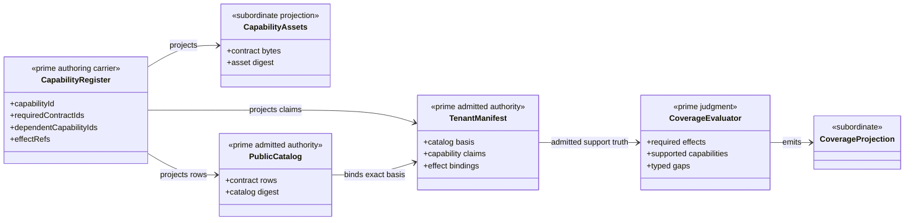
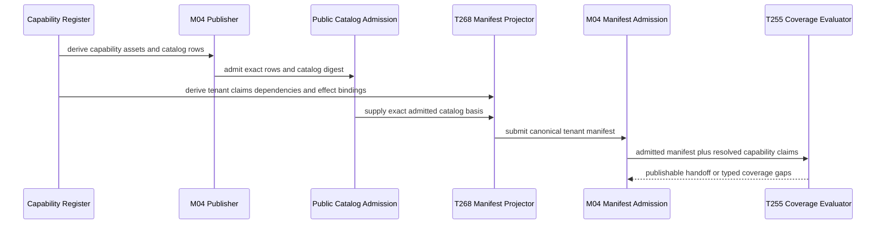
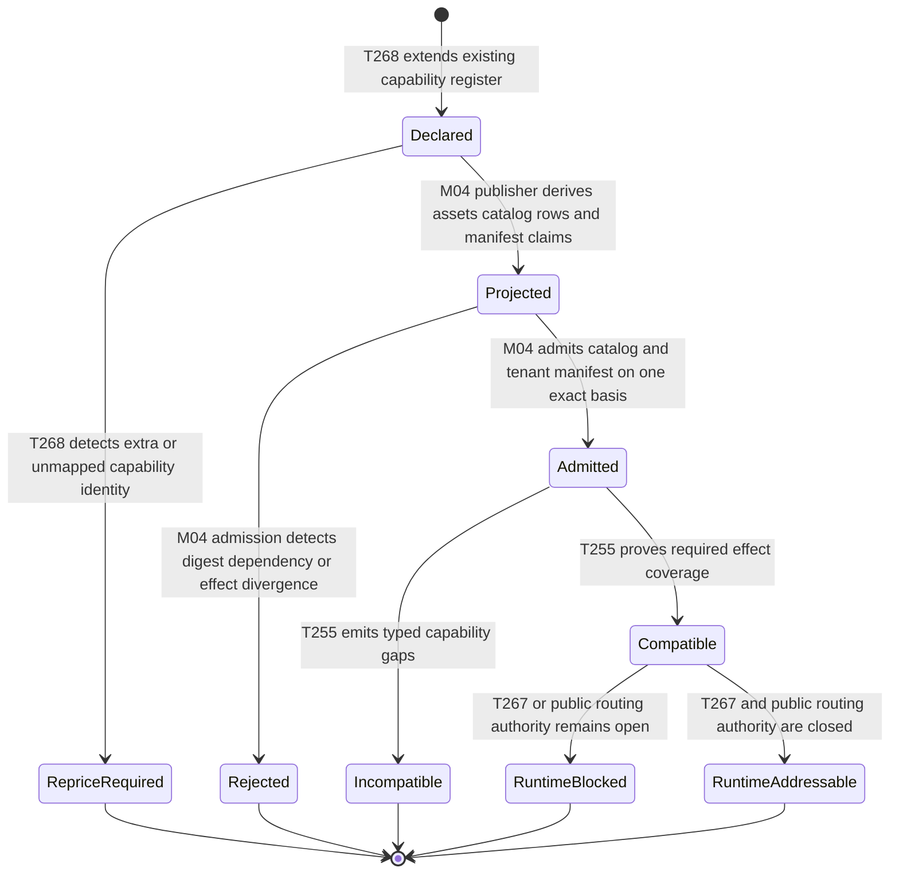

# M02-M04 Capability Declaration Graph Prime Contraction Behavior Design

**Status**: F_H-authorized prospective owner design; independent closure review pending

**Date**: 2026-07-15

**Ticket**: `T-268`

**Change class**: `design_reframe`

**Governing design**: [ADR-044](./adrs/ADR-044-prime-contraction-is-a-cross-boundary-design-gate.md)

**Census row**: `PC-006`

## Boundary

The existing `DS1_CAPABILITY_CONTRACT_REGISTER` is the Prime realization
carrier for capability identity and required-contract edges. It already
generates capability assets and public-catalog rows, and product verification
already consumes it. T-268 extends that register with Consensus capability,
dependency, effect-binding, and manifest-projection data. It does not create a
second capability graph, manifest roster, engine, DSL, or registry.

The public contract catalog and tenant-conformance manifest remain distinct
admitted authorities. Their capability rows are projections of the declaration
register, but each binds a different basis: the catalog publishes addressable
contract identity; the manifest claims one engine/build tenant's support over
an exact admitted catalog. T-255 evaluates coverage and does not author either.

The mandatory 16-row release roster remains requirement truth. The current
extra `abg.capability.fh.interact@5` identity cannot silently become row 17 or
be relabeled. T-268 stops until it is mapped to an existing required capability
without loss or enters requirement reprice.

## Irreducible Architectural Carrier Set

- `DS1_CAPABILITY_CONTRACT_REGISTER`: one capability declaration and dependency
  graph
- `PublicContractCatalog`: independently admitted public contract and
  capability publication basis
- `TenantConformanceManifest`: independently admitted tenant support claim
- `T255CapabilityCoverageEvaluator`: basis-preserving compatibility judgment

Generated capability assets, catalog rows, manifest claim rows, effect-binding
rows, required-ID arrays, and exact-coverage summaries remain subordinate.

## Prime Contraction Review

```json prime-contraction
{
  "schemaVersion": 1,
  "iacs": [
    "DS1_CAPABILITY_CONTRACT_REGISTER",
    "PublicContractCatalog",
    "TenantConformanceManifest",
    "T255CapabilityCoverageEvaluator"
  ],
  "authoritativeCarriers": [
    "DS1_CAPABILITY_CONTRACT_REGISTER",
    "PublicContractCatalog",
    "TenantConformanceManifest",
    "T255CapabilityCoverageEvaluator"
  ],
  "subordinatePayloads": [
    "CapabilityAssetProjection",
    "CapabilityCatalogRowProjection",
    "TenantCapabilityClaimProjection",
    "TenantEffectBindingProjection",
    "CapabilityCoverageProjection",
    "CapabilityIdProjection"
  ],
  "promotionTests": [
    {
      "candidate": "DS1_CAPABILITY_CONTRACT_REGISTER",
      "verdict": "promote",
      "reason": "It already owns capability identity and required-contract edges consumed by asset generation, catalog publication, and product verification."
    },
    {
      "candidate": "PublicContractCatalog",
      "verdict": "promote",
      "reason": "It independently admits addressable public contract identity, version, digest, and capability references."
    },
    {
      "candidate": "TenantConformanceManifest",
      "verdict": "promote",
      "reason": "It independently binds one engine and build tenant's support claims to an exact admitted public catalog basis."
    },
    {
      "candidate": "T255CapabilityCoverageEvaluator",
      "verdict": "promote",
      "reason": "It owns the compatibility judgment between selected execution requirements and admitted tenant capability truth."
    },
    {
      "candidate": "TenantCapabilityClaimProjection",
      "verdict": "remain_subordinate",
      "reason": "It is deterministically projected from the declaration register and owns no independent capability meaning."
    }
  ],
  "recurrenceReview": {
    "status": "consume_existing",
    "ref": "build_tenants/abiogenesis/typescript/design/A5_PRIME_CONTRACTION_CENSUS.md#pc-006---capability-declaration-graph"
  },
  "authoritySourceCount": {
    "before": 4,
    "after": 4
  },
  "authoringSourceCount": {
    "before": 1,
    "after": 1
  },
  "disposition": "consume_existing",
  "ownerTicket": "T-268"
}
```

## Domain View



## Execution View



## State View



Transition owners are explicit: T-268 owns declaration extension and manifest
projection; the existing M04 publisher and admission boundary own projection
and admission; T-255 owns compatibility judgment; T-267/T-270/T-272 own
runtime addressability.

## Realization Rule

1. Extend `DS1_CAPABILITY_CONTRACT_REGISTER`; do not add another register.
2. Derive capability assets, catalog rows, manifest claims, dependency rows,
   effect bindings, and exact ID projections from that register.
3. Keep M04 catalog and manifest admission unchanged as separate authorities.
4. Keep T-255 as the only compatibility evaluator.
5. Stop on the extra F_H capability identity until its lawful disposition is
   recorded.

## Negative Proof

- a duplicate capability identity or missing dependency fails before output
- a generated asset or catalog row cannot disagree with its register row
- a manifest-only capability or dependency fails exact parity
- an effect binding to an absent or unsupported capability fails admission
- an unsupported capability cannot become supported through package presence
- manifest coverage cannot remove the T-267/T-270/T-272 runtime fences

## Proportionality Stop

No new capability engine, schema language, plugin abstraction, dynamic graph
runtime, or generic registry is justified. If the existing closed data
register cannot express a required relation, add the smallest typed field and
direct projector under T-268; do not introduce a parallel model.
