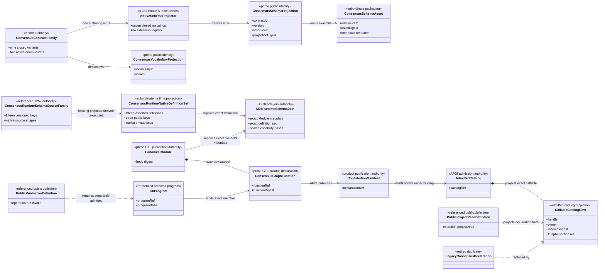
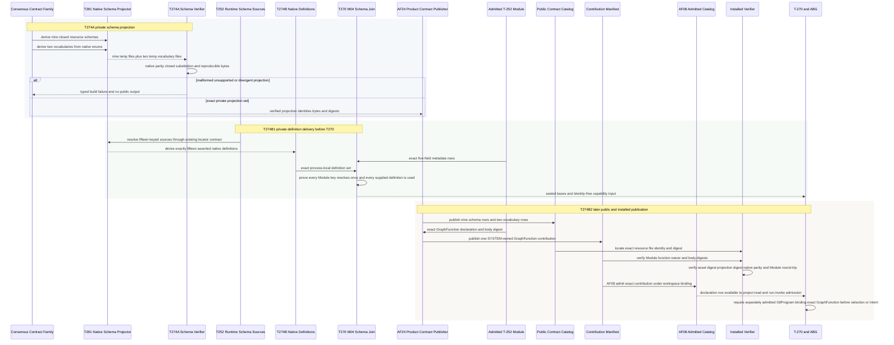
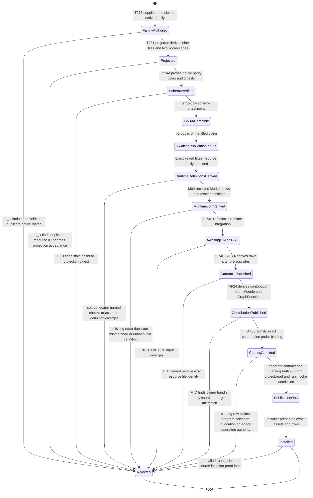

# M02-M04 Consensus Publication Prime Contraction Behavior Design

**Status**: Accepted for T-274A; T-274B private-definition delivery amendment candidate pending review

**Date**: 2026-07-15

**Ticket**: `T-274`

**Change class**: `design_reframe`

**Governing design**: [ADR-044](./adrs/ADR-044-prime-contraction-is-a-cross-boundary-design-gate.md)

**Governing Ontology**: [ABIogenesis Public Control-Plane Ontology `/9`](./ABIOGENESIS_PUBLIC_CONTROL_PLANE_ONTOLOGY.md)

**Census rows**: `PC-001`, `PC-002`

## Boundary

This design governs two separately gated parts of T-274. T-274A projects the
nine required Consensus schema identities and two closed vocabularies from the
existing native family through the private native projector accepted under
T-281 Phase A. T-274B later publishes those verified assets, the admitted T-252
Module, one SYSTEM-owned GraphFunction contribution declaration, and its
separate AF-08 admission into the installed `Catalog`. Neither phase executes
Consensus, admits domain results, projects a ticket result, publishes
capability coverage, or introduces a second GraphFunction body.

T-274B also consumes the repaired T-252 closed fifteen-key native source family
and derives exactly fifteen asserted native definitions as the bounded M04
runtime-join input. Three keys reuse existing public identities and twelve are
engine-private. The six other standing public Consensus assets remain outside
that runtime join. This definition set is a subordinate projection, never a
second schema family, public roster, registry, or authoring source.

One native `ConsensusContractFamily` owns field and value-domain meaning. Nine
closed schema projections and two vocabularies derive from it. Public identity
remains plural because consumers locate and admit each contract independently;
authorship remains singular.

The schema projector emits nine closed physical JSON Schema assets from that
single native family. This matches the existing file-level public locator and
verifier without adding an embedded-resource resolver. Every later public
catalog row retains its own contract ID, version, native symbol, schema resource
ID, asset digest, and authority refs. Physical-file identity and bytes remain
subordinate publication facts; no generated asset becomes an authoring source.

T-274A stops after deterministic schema/vocabulary generation, native parity,
cross-projection negatives, and exact byte/digest reproduction. It exports no
product contract, writes proof output only to a temporary directory, and makes
no packed, installed, Module, callable, catalog, or runtime claim.

T-274B has two ordered milestones. T-274B1 starts after the repaired T-252
implementation and existing T-281 native projector exist; it derives and
delivers the exact native definitions needed by M04 and unblocks T-270.
T-274B2 starts only after accepted T-281 P1 and T-270 runtime integration. Its
contribution declaration derives from the admitted T-252 Module and its
exact outer GraphFunction. AF-24 publishes that declaration through the
`ContributionManifest`; AF-08 separately admits it into the installed
`Catalog`. The `PublicContractCatalog` contains only public contract/function
definition truth. `ABG_CONSENSUS_MODULE_DECLARATIONS` is retired as a maintained
Consensus source. Generic Review declarations remain independent.

Before any T-270 capability construction, T-274B1 consumes the one keyed,
projector-addressable T-252 source family. Every source carries the existing
`sourceLocator` and `namedChecks` contract required by the T-281 resolver; no
numeric array index, second source registry, or new projector is introduced.
T-274B1 derives and asserts one `NativeContractDefinition` for each distinct key
named by the exact T-252 Module and supplies exactly that fifteen-definition set
to M04. M04 proves every Module row resolves one definition and every supplied
definition is used. Full native coordinates and witnesses stay
downstream of Module admission; only the existing five-field metadata key is in
the Module. The definitions are process-local runtime inputs and are not
published merely because three keys have public identities.

In T-274B, the Module and GraphFunction remain GTL declarations. Neither is a
`GtlProgram`, public invocation, selected action, `ConstructionIntent`, or
runtime authority. The callable row is eligible for invocation only when the
separately admitted program named by `abg.operation.run.invoke` contains the
exact GraphFunction. Catalog, result, and replay observation use the closed
`abg.operation.project.read` relation. This publication boundary adds no
Consensus operation and no legacy `catalog.invoke` facade.

## Ontology Slice

This design projects the ratified Ontology; it does not originate another
semantic model.

| Carrier | Ontology classification | Lifecycle and authority |
|---|---|---|
| `ConsensusContractFamily` | Prime product-definition family under `AF-24` | authored once; changed meaning versions the family; product contract publisher owns projection |
| `ABG_CONSENSUS_GTL_MODULE` | existing admitted GTL Module | GTL admission owns declaration truth; T-274 may serialize and publish but cannot reinterpret it |
| outer Consensus `GraphFunction` | existing sole named callable declaration | Module-owned declaration; becomes executable only as a member of a separately admitted `GtlProgram` |
| `ConsensusPublicContractRow` | addressable `PublicContractCatalog` row | AF-24 derives it from the family; changed definition versions the row; prior rows remain historical contract evidence |
| `ConsensusGraphFunctionContribution` | addressable `ContributionManifest` declaration | AF-24 derives it from the exact Module and GraphFunction; immutable per digest; carries no program or selection authority |
| `AdmittedConsensusCatalogRow` | existing admitted `Catalog` projection | AF-08 admits the exact contribution under a workspace binding; catalog admission does not prove program membership |
| `ConsensusSchemaAsset` | subordinate generated packaging | one generated file per public schema projection; changed bytes create a new digest and never a new domain author |
| `ConsensusRuntimeSchemaSourceFamily` | referenced T-252 native source authority | owns the fifteen versioned keys and native source shapes consumed by T-274B; no generated publication fact flows back into it |
| `ConsensusRuntimeNativeDefinitionSet` | subordinate T-274B runtime projection | exactly fifteen asserted definitions derived from the source family; delivered process-locally to M04 and never published as a private catalog |
| `GtlProgram`, `PublicInvocation<run.invoke>`, `ConstructionIntent` | referenced execution carriers | outside T-274 ownership; T-270/ABG admit and interpret them |

### Lifecycle Completeness

| Entity | Declare/create | Read/project | Update/transition | Delete/retire |
|---|---|---|---|---|
| `ConsensusContractFamily` | product definition register under `AF-24` | schema/native projections | semantic change creates a versioned family | superseded family remains historical contract evidence |
| `ConsensusPublicContractRow` | `AF-24` derives nine rows and two vocabulary rows | `AF-03 project(publicContractCatalog, rows)` | changed definition creates a new row version/digest and current projection | prior rows remain historical evidence; no public retirement operation |
| `ConsensusGraphFunctionContribution` | `AF-24` derives one contribution manifest row from exact admitted Module/GraphFunction | `AF-03 project(contributionManifest, declarations)` | changed Module/body/function creates a new contribution version/digest | prior contribution truth remains history; no compatibility alias |
| `AdmittedConsensusCatalogRow` | `AF-08` admits the exact contribution under one binding | `AF-03 project(catalog, callable)` | a new admitted contribution creates new catalog/current-view truth | prior catalog truth remains replay evidence; Catalog has no retirement operation |
| `ConsensusSchemaAsset` | deterministic schema projector emits nine assets | later public catalog locator names the exact resource file | changed family regenerates bytes/digest | historical asset remains publication evidence |

### Authority And Function Derivation

| Function | Proposer | Verifier/admitter | Executor | Projector/retirement owner | Ontology disposition |
|---|---|---|---|---|---|
| project nine schemas and two vocabularies | product build authority | T-274A native/schema parity and closed-resource verifier; later product contract admission | accepted strict native projector | T-274A owns private projection; `AF-24` owns later publication | subordinate projection of one family; no new atom |
| derive runtime native definitions | exact T-252 fifteen-key source family | existing T-281 native-definition assertion plus exact T-270 M04 key join | accepted strict native projector | T-274B delivers exactly fifteen process-local definitions; no private publication | subordinate runtime projection; no new atom or authority |
| publish Consensus contribution | product build authority citing the admitted Module | Module/body/function/digest/SYSTEM-owner verifier | deterministic publication generator | `AF-24` publishes the `ContributionManifest` | contribution declaration; no program, catalog-admission, or invocation authority |
| admit Consensus catalog row | exact workspace binding plus contribution manifest | AF-08 contribution and binding verifier | ABG catalog admission | admitted `Catalog` and its current views | existing catalog authority; does not prove GtlProgram membership |
| read catalog/result/replay truth | admitted public caller | `PublicFunctionDefinition<project.read>` admission | `AF-03` projection | owning catalog/ABG projector | referenced public operation; T-274 does not execute it |
| invoke the callable | admitted caller plus admitted GTL program | T-270/ABG verify program membership, authority, selection, and intent | admitted program interpreted through `AF-11..AF-15` | ABG runtime/replay owners | outside T-274; only `abg.operation.run.invoke`, never a private or legacy route |

Projection loss is deliberate: the publication design omits traversal
interiors, current eligibility, intent admission, continuation, and closure. It
fails if any omitted authority is reconstructed from Module bytes, the callable
row, a schema locator, or an adapter.

## Irreducible Architectural Carrier Set

- `ConsensusContractFamily`: one native domain authoring model
- `ABG_CONSENSUS_GTL_MODULE`: admitted GTL Module publication/body authority
- `ConsensusPublicContractRow`: one independently admitted public projection
- `ConsensusGraphFunctionContribution`: one SYSTEM-owned contribution declaration
- existing admitted `Catalog`: AF-08 admission authority, not another authoring source

The T-252 `ConsensusRuntimeSchemaSourceFamily` is referenced source authority,
not T-274-owned IACS. The T-274B `ConsensusRuntimeNativeDefinitionSet` is a
subordinate process-local projection of that source.

Subordinate values are vocabulary assets, schema asset bytes, asset digests,
projection digests, locators, generated files, and installed
inventory rows.

## Prime Contraction Review

```json prime-contraction
{
  "schemaVersion": 1,
  "iacs": [
    "ConsensusContractFamily",
    "ABG_CONSENSUS_GTL_MODULE",
    "ConsensusPublicContractRow",
    "ConsensusGraphFunctionContribution"
  ],
  "authoritativeCarriers": [
    "ConsensusContractFamily",
    "ABG_CONSENSUS_GTL_MODULE",
    "ConsensusPublicContractRow",
    "ConsensusGraphFunctionContribution"
  ],
  "subordinatePayloads": [
    "ConsensusSchemaDefinitionProjection",
    "ConsensusVocabularyProjection",
    "ConsensusSchemaAsset",
    "ConsensusSchemaAssetDigest",
    "ConsensusProjectionDigest",
    "ConsensusSchemaLocator",
    "ConsensusInstalledInventoryRow",
    "ConsensusRuntimeNativeDefinitionSet"
  ],
  "promotionTests": [
    {
      "candidate": "ConsensusContractFamily",
      "verdict": "promote",
      "reason": "It owns the closed native fields and value domains from which every Consensus schema and vocabulary projection derives."
    },
    {
      "candidate": "ABG_CONSENSUS_GTL_MODULE",
      "verdict": "promote",
      "reason": "It is the admitted GTL publication/body authority and the only lawful source for the installed callable declaration; it is not the admitted runtime program."
    },
    {
      "candidate": "ConsensusPublicContractRow",
      "verdict": "promote",
      "reason": "Each later public row is independently versioned, located, admitted, and consumed even though its shape is derived."
    },
    {
      "candidate": "ConsensusGraphFunctionContribution",
      "verdict": "promote",
      "reason": "The SYSTEM-owned declaration is independently addressed in the ContributionManifest; AF-08 catalog admission and current selection remain separate ABG and program authority."
    },
    {
      "candidate": "ConsensusSchemaAsset",
      "verdict": "remain_subordinate",
      "reason": "Each generated file packages one derived resource and owns no domain or callable meaning."
    },
    {
      "candidate": "ConsensusRuntimeNativeDefinitionSet",
      "verdict": "remain_subordinate",
      "reason": "It is the exact process-local native projection of the T-252 source family required by M04 and owns no schema identity or public row."
    }
  ],
  "recurrenceReview": {
    "status": "commonize_tenant",
    "ref": "build_tenants/abiogenesis/typescript/design/A5_PRIME_CONTRACTION_CENSUS.md#pc-001---consensus-contract-family-authorship"
  },
  "authoritySourceCount": {
    "before": 13,
    "after": 12
  },
  "authoringSourceCount": {
    "before": 13,
    "after": 2
  },
  "disposition": "migrate_authority",
  "ownerTicket": "T-274"
}
```

The authority count preserves nine schema rows, two vocabulary rows, and one
callable row while retiring the rival callable declaration and treating all
generated schema assets as packaging rather than authority. The authoring count contracts the eleven
potential schema/vocabulary authors plus two callable declarations to one
contract family plus one admitted Module.

## Domain View



## Execution View



## State View



Transition ownership is explicit: T-274A owns only private schema and
vocabulary projection plus exact verification. T-274B owns AF-24
public-contract and contribution-manifest projection, and AF-08 admission
of the contribution into the existing `Catalog`; the existing schema generator
owns deterministic schema projection; M02 owns Module and GraphFunction
declaration admission; installer and verification surfaces own the installed
round-trip. T-270 and ABG alone admit the later program-bound public invocation,
action selection, `ConstructionIntent`, and traversal.

## Ontology Cross-View Evaluation

| Axiom | Ontology/domain evidence | Sequence evidence | State evidence | Native/admission enforcement | Verdict |
|---|---|---|---|---|---|
| one Consensus contract author | one `ConsensusContractFamily`; schemas/assets subordinate | one accepted projector derives all resources | duplicate roster or open field rejects before projection | closed native variants and one generator basis | pass |
| Module and GraphFunction are not the program | Module owns GraphFunction; GtlProgram separately binds it; catalog row only projects contribution admission | runtime must receive a separately admitted program and prove membership | authority claim on the catalog row enters `Rejected` | T-270/ABG program-membership admission; T-274 cannot construct it | pass |
| public-contract and contribution catalogs remain distinct | AF-24 contract rows and contribution manifest feed separate carriers; AF-08 alone admits Catalog | sequence publishes then admits through separate participants | ContractsPublished and CatalogAdmitted are separate states | distinct native manifests and admission APIs | pass |
| publication does not select or invoke | callable row is declaration/publication truth only | publication ends before T-270 selection, intent, and traversal | `PublicationOnly` precedes installation; no running state exists | no runtime handler or operation is owned here | pass |
| one current public operation truth | `run.invoke` and `project.read` are referenced accepted definitions | downstream consumes only those definitions | legacy or feature-specific operation claim rejects | hard-break catalog/public-definition parity | pass |
| nine identities do not create nine authors | nine physical projections share one family while retaining addressability | generator emits per-resource files and digests from one input | cross-projection substitution rejects | native/schema parity plus exact file-locator admission | pass |
| runtime definition delivery is total without publication growth | T-252 owns fifteen keys; T-274B derives one subordinate definition set | exact fifteen definitions join the exact Module before M04 capability construction | zero, extra, duplicate, mismatch, or unused join input rejects | T-281 projector plus T-270 exact M04 join; twelve private keys create no public row | pass |

## Migration

### T-274A

1. Consume the completed T-281 Phase A projector; do not author another
   projector, transform registry, schema DSL, or converter exception.
2. Project the existing closed `ConsensusContractFamily` into nine exact
   physical schema assets.
3. Derive both vocabularies from the existing native enum rosters.
4. Prove closed native/schema parity, cross-projection refusal, exact resource
   IDs, and byte/digest reproducibility from a clean tree.
5. Stop with temp-only verified bytes. Publish or commit no schema asset, row,
   Module, contribution, catalog, install, operation, or capability claim.

### T-274B1 - Private Definition Delivery

1. Consume the exact repaired T-252 keyed fifteen-source family through its
   existing projector-compatible locator and named-check contracts; derive one
   asserted native definition for every distinct key through the existing
   T-281 projector.
2. Supply the exact Module and definition family to M04. M04 proves the runtime
   join is exactly fifteen definitions: every Module row
   resolves one, every supplied definition is used, the three reused public
   identities remain public, twelve private keys remain engine-only, and six
   other public assets stay outside the runtime join.
3. Stop after process-local definition delivery and the accepted M04 join;
   publish no contract, contribution, catalog, or private schema row.

### T-274B2 - Public And Installed Publication

1. Require accepted T-281 P1 definition truth and closed T-270 catalog
   invocation authority before public publication.
2. Publish per-resource rows with separate projection and asset digests.
3. Derive the Consensus callable declaration from the admitted Module and
   outer GraphFunction; migrate all probe and test consumers.
4. Remove the maintained `ABG_CONSENSUS_MODULE_DECLARATIONS` source.
5. Regenerate publication artifacts and prove installed source isolation.

## Negative Proof

- findings cannot admit as rulings
- round outcome cannot admit as final result
- final result cannot admit as ticket projection
- any other public cross-projection substitution fails
- an unknown field or enum value fails native and serialized admission
- a locator with the correct directory but wrong resource file or ID fails
- a correct resource with a stale schema or asset digest fails
- removing or mutating the canonical Module prevents callable publication
- a missing, extra, duplicate, mismatched, or unused runtime-join definition
  rejects before M04 capability construction
- no engine-private schema key appears in a public contract or contribution row
- the six public assets outside the runtime join cannot satisfy a Module key
- the retired declaration cannot reconstruct the callable
- installed publication resolves without importing source files

## Stop Conditions

- stop if nine generated files become nine authored models or drift from the
  one native family
- stop if T-274 authors a projector, converter exception, or schema DSL beside
  the accepted T-281 Phase A mechanism
- stop if path identity substitutes for exact resource identity and digest
- stop if a generated file or row becomes a second domain author
- stop if callable publication can succeed without the exact admitted Module
- stop if the Module, GraphFunction, or callable row is treated as the admitted
  `GtlProgram`, selected action, intent, or runtime authority
- stop if `catalog.invoke`, a Consensus-specific operation, or a compatibility
  alias survives beside `abg.operation.run.invoke`
- stop if catalog/result/replay observation bypasses
  `abg.operation.project.read`
- stop if Review declarations are removed merely because they share a file
- stop if T-274B authors a schema key or source absent from the T-252 family
- stop if a full coordinate, locator, witness, callable, or generated digest is
  copied into Module metadata
- stop if process-local native definitions become a private public catalog
- stop if T-274A publishes or installs anything before T-274B prerequisites
  close
- stop if a T-274A proof asset appears in `npm pack --dry-run`

## Phase-Split Verdict

`accepted_phase_split_t274a_dependency_gated`.

The earlier accepted design correctly preserved one Consensus authoring family
and the separate contract, contribution, and catalog authorities, but it
assumed one physical schema document with embedded addressable definitions.
The current locator and verifier are file-level. Extending them solely to keep
one physical file would add a new resolver and more failure surface without
reducing authoring truth. This repair therefore keeps one native family and
one projector while emitting nine generated physical schema assets. T-274A
proves those private projections early; T-274B retains all public and installed
publication. No product identity, semantic authority, or public operation
changes.

Independent review accepted the exact semantic candidate digest
`a370f6c894e08f966714d5b5541c9e02091b19be6768d5f4383773287cbc600e`.
T-274A implementation may begin only after T-281 Phase A implementation closes;
T-274B1 remains fenced behind repaired T-252 implementation and this amendment's
acceptance; T-274B2 remains fenced behind T-281 P1 and T-270.

## T-274B Private-Definition Amendment Verdict

`candidate_pending_independent_fh_review`.

The amendment changes no T-274A output and adds no authority. It makes the
previously implicit T-274B runtime delivery constructable and acyclic: consume
the keyed, projector-addressable T-252 fifteen-source family, derive exactly
fifteen asserted native definitions, and let M04 prove the exact total join.
T-274B1 then unblocks T-270; T-274B2 follows accepted T-270. Public publication
remains nine schema assets, two
vocabularies, and one SYSTEM GraphFunction contribution. T-274B implementation
remains blocked at the applicable milestone fences.
