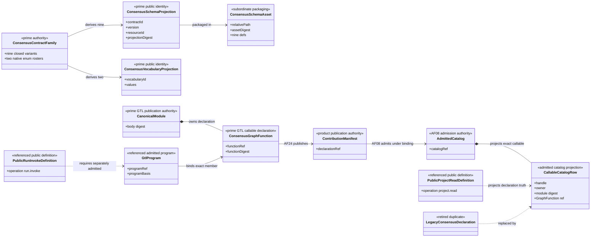
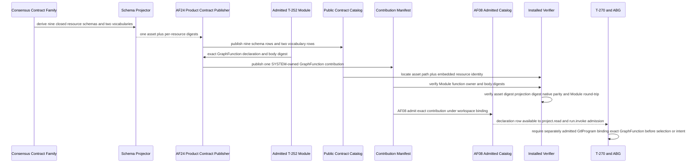
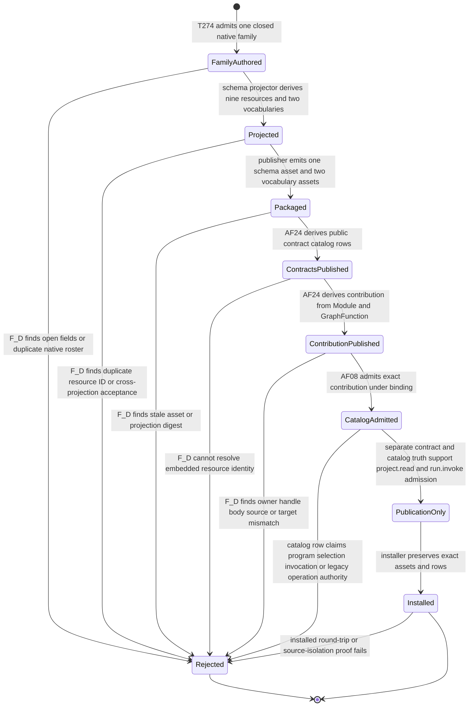

# M02-M04 Consensus Publication Prime Contraction Behavior Design

**Status**: Accepted - reconciled to ratified Ontology for bounded implementation

**Date**: 2026-07-15

**Ticket**: `T-274`

**Change class**: `design_reframe`

**Governing design**: [ADR-044](./adrs/ADR-044-prime-contraction-is-a-cross-boundary-design-gate.md)

**Governing Ontology**: [ABIogenesis Public Control-Plane Ontology `/9`](./ABIOGENESIS_PUBLIC_CONTROL_PLANE_ONTOLOGY.md)

**Census rows**: `PC-001`, `PC-002`

## Boundary

This design governs publication of the nine required Consensus schema
identities, two closed vocabularies, the admitted T-252 Module, one SYSTEM-owned
GraphFunction contribution declaration, and its separate AF-08 admission into
the installed `Catalog`. It does not execute Consensus, admit domain results,
project a ticket result, publish capability coverage, or introduce a second
GraphFunction body.

One native `ConsensusContractFamily` owns field and value-domain meaning. Nine
closed schema projections and two vocabularies derive from it. Public identity
remains plural because consumers locate and admit each contract independently;
authorship remains singular.

The schema asset is one JSON Schema document containing nine closed,
independently addressable `$defs`. Every public catalog row retains its own
contract ID, version, native symbol, schema resource ID, projection digest, and
authority refs. The shared asset path and whole-asset digest are subordinate
publication facts. A locator must name both the shared asset and the embedded
resource identity; path alone is insufficient.

The contribution declaration derives from the admitted T-252 Module and its
exact outer GraphFunction. AF-24 publishes that declaration through the
`ContributionManifest`; AF-08 separately admits it into the installed
`Catalog`. The `PublicContractCatalog` contains only public contract/function
definition truth. `ABG_CONSENSUS_MODULE_DECLARATIONS` is retired as a maintained
Consensus source. Generic Review declarations remain independent.

The Module and GraphFunction remain GTL declarations. Neither is a
`GtlProgram`, public invocation, selected action, `ConstructionIntent`, or
runtime authority. The callable row is eligible for invocation only when the
separately admitted program named by `abg.operation.run.invoke` contains the
exact GraphFunction. Catalog, result, and replay observation use the closed
`abg.operation.project.read` relation. This publication boundary adds no
Consensus operation and no legacy `catalog.invoke` facade.

## Ontology Slice

This design projects the ratified Ontology; it does not originate another
semantic model.

| Carrier | Ontology classification | Lifecycle and authority |
|---|---|---|
| `ConsensusContractFamily` | Prime product-definition family under `AF-24` | authored once; changed meaning versions the family; product contract publisher owns projection |
| `ABG_CONSENSUS_GTL_MODULE` | existing admitted GTL Module | GTL admission owns declaration truth; T-274 may serialize and publish but cannot reinterpret it |
| outer Consensus `GraphFunction` | existing sole named callable declaration | Module-owned declaration; becomes executable only as a member of a separately admitted `GtlProgram` |
| `ConsensusPublicContractRow` | addressable `PublicContractCatalog` row | AF-24 derives it from the family; changed definition versions the row; prior rows remain historical contract evidence |
| `ConsensusGraphFunctionContribution` | addressable `ContributionManifest` declaration | AF-24 derives it from the exact Module and GraphFunction; immutable per digest; carries no program or selection authority |
| `AdmittedConsensusCatalogRow` | existing admitted `Catalog` projection | AF-08 admits the exact contribution under a workspace binding; catalog admission does not prove program membership |
| `ConsensusSchemaAsset` | subordinate generated packaging | one file packages nine definitions; changed bytes create a new digest and never a new domain author |
| `GtlProgram`, `PublicInvocation<run.invoke>`, `ConstructionIntent` | referenced execution carriers | outside T-274 ownership; T-270/ABG admit and interpret them |

### Lifecycle Completeness

| Entity | Declare/create | Read/project | Update/transition | Delete/retire |
|---|---|---|---|---|
| `ConsensusContractFamily` | product definition register under `AF-24` | schema/native projections | semantic change creates a versioned family | superseded family remains historical contract evidence |
| `ConsensusPublicContractRow` | `AF-24` derives nine rows and two vocabulary rows | `AF-03 project(publicContractCatalog, rows)` | changed definition creates a new row version/digest and current projection | prior rows remain historical evidence; no public retirement operation |
| `ConsensusGraphFunctionContribution` | `AF-24` derives one contribution manifest row from exact admitted Module/GraphFunction | `AF-03 project(contributionManifest, declarations)` | changed Module/body/function creates a new contribution version/digest | prior contribution truth remains history; no compatibility alias |
| `AdmittedConsensusCatalogRow` | `AF-08` admits the exact contribution under one binding | `AF-03 project(catalog, callable)` | a new admitted contribution creates new catalog/current-view truth | prior catalog truth remains replay evidence; Catalog has no retirement operation |
| `ConsensusSchemaAsset` | deterministic schema projector emits one asset | public catalog locator plus embedded resource ID | changed family regenerates bytes/digest | historical asset remains publication evidence |

### Authority And Function Derivation

| Function | Proposer | Verifier/admitter | Executor | Projector/retirement owner | Ontology disposition |
|---|---|---|---|---|---|
| project nine schemas and two vocabularies | product build authority | native/schema parity and closed-resource verifier; product contract admission | deterministic schema projector | `AF-24` product contract publisher | subordinate projection of one family; no new atom |
| publish Consensus contribution | product build authority citing the admitted Module | Module/body/function/digest/SYSTEM-owner verifier | deterministic publication generator | `AF-24` publishes the `ContributionManifest` | contribution declaration; no program, catalog-admission, or invocation authority |
| admit Consensus catalog row | exact workspace binding plus contribution manifest | AF-08 contribution and binding verifier | ABG catalog admission | admitted `Catalog` and its current views | existing catalog authority; does not prove GtlProgram membership |
| read catalog/result/replay truth | admitted public caller | `PublicFunctionDefinition<project.read>` admission | `AF-03` projection | owning catalog/ABG projector | referenced public operation; T-274 does not execute it |
| invoke the callable | admitted caller plus admitted GTL program | T-270/ABG verify program membership, authority, selection, and intent | admitted program interpreted through `AF-11..AF-15` | ABG runtime/replay owners | outside T-274; only `abg.operation.run.invoke`, never a private or legacy route |

Projection loss is deliberate: the publication design omits traversal
interiors, current eligibility, intent admission, continuation, and closure. It
fails if any omitted authority is reconstructed from Module bytes, the callable
row, a schema locator, or an adapter.

## Irreducible Architectural Carrier Set

- `ConsensusContractFamily`: one native domain authoring model
- `ABG_CONSENSUS_GTL_MODULE`: admitted GTL Module publication/body authority
- `ConsensusPublicContractRow`: one independently admitted public projection
- `ConsensusGraphFunctionContribution`: one SYSTEM-owned contribution declaration
- existing admitted `Catalog`: AF-08 admission authority, not another authoring source

Subordinate values are schema `$defs`, vocabulary assets, shared asset bytes,
asset digests, projection digests, locators, generated files, and installed
inventory rows.

## Prime Contraction Review

```json prime-contraction
{
  "schemaVersion": 1,
  "iacs": [
    "ConsensusContractFamily",
    "ABG_CONSENSUS_GTL_MODULE",
    "ConsensusPublicContractRow",
    "ConsensusGraphFunctionContribution"
  ],
  "authoritativeCarriers": [
    "ConsensusContractFamily",
    "ABG_CONSENSUS_GTL_MODULE",
    "ConsensusPublicContractRow",
    "ConsensusGraphFunctionContribution"
  ],
  "subordinatePayloads": [
    "ConsensusSchemaDefinitionProjection",
    "ConsensusVocabularyProjection",
    "ConsensusSchemaAsset",
    "ConsensusSchemaAssetDigest",
    "ConsensusProjectionDigest",
    "ConsensusSchemaLocator",
    "ConsensusInstalledInventoryRow"
  ],
  "promotionTests": [
    {
      "candidate": "ConsensusContractFamily",
      "verdict": "promote",
      "reason": "It owns the closed native fields and value domains from which every Consensus schema and vocabulary projection derives."
    },
    {
      "candidate": "ABG_CONSENSUS_GTL_MODULE",
      "verdict": "promote",
      "reason": "It is the admitted GTL publication/body authority and the only lawful source for the installed callable declaration; it is not the admitted runtime program."
    },
    {
      "candidate": "ConsensusPublicContractRow",
      "verdict": "promote",
      "reason": "Each row is independently versioned, located, admitted, and consumed even though its shape is derived."
    },
    {
      "candidate": "ConsensusGraphFunctionContribution",
      "verdict": "promote",
      "reason": "The SYSTEM-owned declaration is independently addressed in the ContributionManifest; AF-08 catalog admission and current selection remain separate ABG and program authority."
    },
    {
      "candidate": "ConsensusSchemaAsset",
      "verdict": "remain_subordinate",
      "reason": "The file packages derived resources and owns no domain or callable meaning."
    }
  ],
  "recurrenceReview": {
    "status": "commonize_tenant",
    "ref": "build_tenants/abiogenesis/typescript/design/A5_PRIME_CONTRACTION_CENSUS.md#pc-001---consensus-contract-family-authorship"
  },
  "authoritySourceCount": {
    "before": 13,
    "after": 12
  },
  "authoringSourceCount": {
    "before": 13,
    "after": 2
  },
  "disposition": "migrate_authority",
  "ownerTicket": "T-274"
}
```

The authority count preserves nine schema rows, two vocabulary rows, and one
callable row while retiring the rival callable declaration and treating the
shared schema asset as packaging rather than authority. The authoring count contracts the eleven
potential schema/vocabulary authors plus two callable declarations to one
contract family plus one admitted Module.

## Domain View



## Execution View



## State View



Transition ownership is explicit: T-274 owns native family publication,
AF-24 public-contract and contribution-manifest projection, and AF-08 admission
of the contribution into the existing `Catalog`; the existing schema generator
owns deterministic schema projection; M02 owns Module and GraphFunction
declaration admission; installer and verification surfaces own the installed
round-trip. T-270 and ABG alone admit the later program-bound public invocation,
action selection, `ConstructionIntent`, and traversal.

## Ontology Cross-View Evaluation

| Axiom | Ontology/domain evidence | Sequence evidence | State evidence | Native/admission enforcement | Verdict |
|---|---|---|---|---|---|
| one Consensus contract author | one `ConsensusContractFamily`; schemas/assets subordinate | one projector derives all resources | duplicate roster or open field rejects before projection | closed native variants and one generator basis | pass |
| Module and GraphFunction are not the program | Module owns GraphFunction; GtlProgram separately binds it; catalog row only projects contribution admission | runtime must receive a separately admitted program and prove membership | authority claim on the catalog row enters `Rejected` | T-270/ABG program-membership admission; T-274 cannot construct it | pass |
| public-contract and contribution catalogs remain distinct | AF-24 contract rows and contribution manifest feed separate carriers; AF-08 alone admits Catalog | sequence publishes then admits through separate participants | ContractsPublished and CatalogAdmitted are separate states | distinct native manifests and admission APIs | pass |
| publication does not select or invoke | callable row is declaration/publication truth only | publication ends before T-270 selection, intent, and traversal | `PublicationOnly` precedes installation; no running state exists | no runtime handler or operation is owned here | pass |
| one current public operation truth | `run.invoke` and `project.read` are referenced accepted definitions | downstream consumes only those definitions | legacy or feature-specific operation claim rejects | hard-break catalog/public-definition parity | pass |
| nine identities do not create nine authors | nine projections share one asset/family while retaining addressability | generator emits per-resource digests from one input | cross-projection substitution rejects | native/schema parity plus embedded resource admission | pass |

## Migration

1. Establish the closed native `ConsensusContractFamily` and its enum rosters.
2. Move T-252 native witnesses onto the same family before removing the open
   carrier decoder.
3. Derive the Consensus callable declaration from the admitted Module and
   outer GraphFunction; migrate all probe and test consumers.
4. Remove the maintained `ABG_CONSENSUS_MODULE_DECLARATIONS` source.
5. Add one schema-family projector and one shared asset with nine resources.
6. Publish per-resource rows with separate projection and asset digests.
7. Derive both vocabularies from the native rosters.
8. Regenerate publication artifacts and prove installed source isolation.

## Negative Proof

- findings cannot admit as rulings
- round outcome cannot admit as final result
- final result cannot admit as ticket projection
- any other public cross-projection substitution fails
- an unknown field or enum value fails native and serialized admission
- an embedded resource locator with the correct path but wrong resource ID fails
- a correct resource with a stale projection or asset digest fails
- removing or mutating the canonical Module prevents callable publication
- the retired declaration cannot reconstruct the callable
- installed publication resolves without importing source files

## Stop Conditions

- stop if the shared schema document becomes a permissive optional-field union
- stop if path identity substitutes for embedded resource identity
- stop if a generated file or row becomes a second domain author
- stop if callable publication can succeed without the exact admitted Module
- stop if the Module, GraphFunction, or callable row is treated as the admitted
  `GtlProgram`, selected action, intent, or runtime authority
- stop if `catalog.invoke`, a Consensus-specific operation, or a compatibility
  alias survives beside `abg.operation.run.invoke`
- stop if catalog/result/replay observation bypasses
  `abg.operation.project.read`
- stop if Review declarations are removed merely because they share a file
- stop and reprice if the existing locator contract cannot distinguish shared
  asset digest from embedded projection identity without a public-contract
  migration
