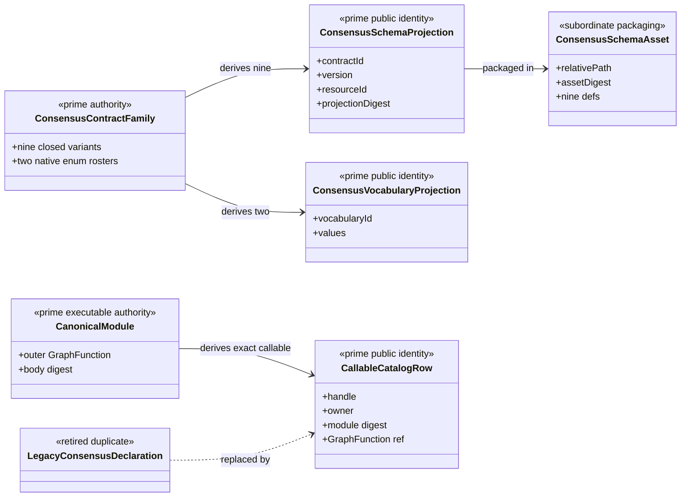
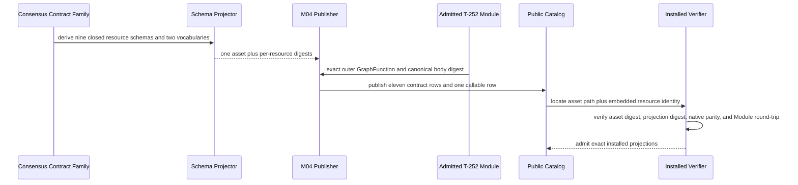
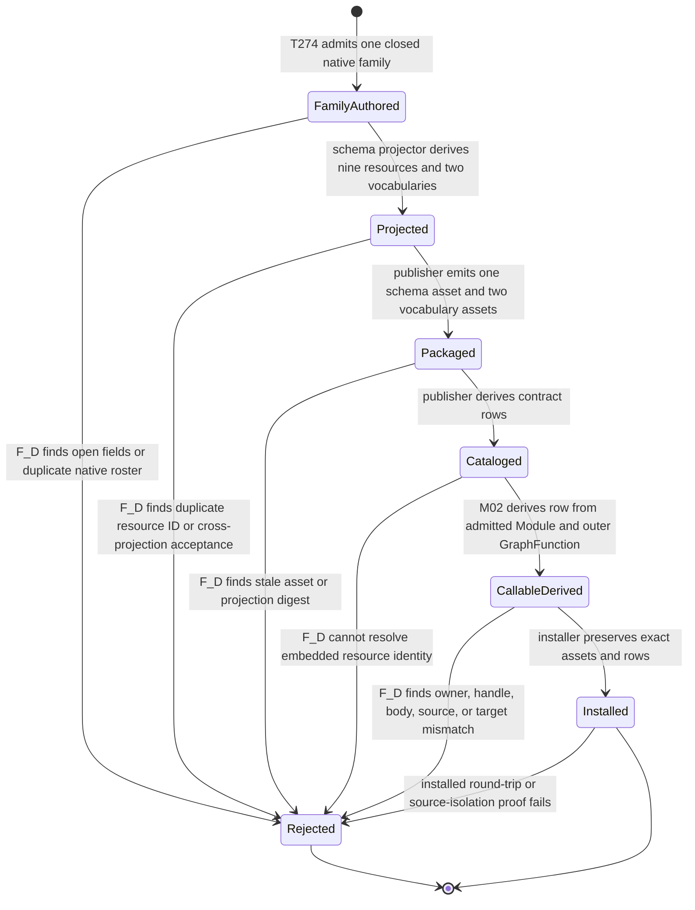

# M02-M04 Consensus Publication Prime Contraction Behavior Design

**Status**: F_H-authorized for implementation under T-277; independent closure review pending

**Date**: 2026-07-15

**Ticket**: `T-274`

**Change class**: `design_reframe`

**Governing design**: [ADR-044](./adrs/ADR-044-prime-contraction-is-a-cross-boundary-design-gate.md)

**Census rows**: `PC-001`, `PC-002`

## Boundary

This design governs publication of the nine required Consensus schema
identities, two closed vocabularies, the admitted T-252 Module, and the one
SYSTEM-owned callable catalog row. It does not execute Consensus, admit domain
results, project a ticket result, publish capability coverage, or introduce a
second GraphFunction body.

One native `ConsensusContractFamily` owns field and value-domain meaning. Nine
closed schema projections and two vocabularies derive from it. Public identity
remains plural because consumers locate and admit each contract independently;
authorship remains singular.

The schema asset is one JSON Schema document containing nine closed,
independently addressable `$defs`. Every public catalog row retains its own
contract ID, version, native symbol, schema resource ID, projection digest, and
authority refs. The shared asset path and whole-asset digest are subordinate
publication facts. A locator must name both the shared asset and the embedded
resource identity; path alone is insufficient.

The callable row derives from the admitted T-252 Module and its exact outer
GraphFunction. `ABG_CONSENSUS_MODULE_DECLARATIONS` is retired as a maintained
Consensus source. Generic Review declarations remain independent.

## Irreducible Architectural Carrier Set

- `ConsensusContractFamily`: one native domain authoring model
- `ABG_CONSENSUS_GTL_MODULE`: admitted GTL Module and body authority
- `ConsensusPublicContractRow`: one independently admitted public projection
- `ConsensusCallableCatalogRow`: one SYSTEM-owned callable projection

Subordinate values are schema `$defs`, vocabulary assets, shared asset bytes,
asset digests, projection digests, locators, generated files, and installed
inventory rows.

## Prime Contraction Review

```json prime-contraction
{
  "schemaVersion": 1,
  "iacs": [
    "ConsensusContractFamily",
    "ABG_CONSENSUS_GTL_MODULE",
    "ConsensusPublicContractRow",
    "ConsensusCallableCatalogRow"
  ],
  "authoritativeCarriers": [
    "ConsensusContractFamily",
    "ABG_CONSENSUS_GTL_MODULE",
    "ConsensusPublicContractRow",
    "ConsensusCallableCatalogRow"
  ],
  "subordinatePayloads": [
    "ConsensusSchemaDefinitionProjection",
    "ConsensusVocabularyProjection",
    "ConsensusSchemaAsset",
    "ConsensusSchemaAssetDigest",
    "ConsensusProjectionDigest",
    "ConsensusSchemaLocator",
    "ConsensusInstalledInventoryRow"
  ],
  "promotionTests": [
    {
      "candidate": "ConsensusContractFamily",
      "verdict": "promote",
      "reason": "It owns the closed native fields and value domains from which every Consensus schema and vocabulary projection derives."
    },
    {
      "candidate": "ABG_CONSENSUS_GTL_MODULE",
      "verdict": "promote",
      "reason": "It is the admitted executable GTL body and the only lawful source for the installed callable."
    },
    {
      "candidate": "ConsensusPublicContractRow",
      "verdict": "promote",
      "reason": "Each row is independently versioned, located, admitted, and consumed even though its shape is derived."
    },
    {
      "candidate": "ConsensusCallableCatalogRow",
      "verdict": "promote",
      "reason": "The SYSTEM-owned callable is independently selected and admitted by the public catalog."
    },
    {
      "candidate": "ConsensusSchemaAsset",
      "verdict": "remain_subordinate",
      "reason": "The file packages derived resources and owns no domain or callable meaning."
    }
  ],
  "recurrenceReview": {
    "status": "commonize_tenant",
    "ref": "build_tenants/abiogenesis/typescript/design/A5_PRIME_CONTRACTION_CENSUS.md#pc-001---consensus-contract-family-authorship"
  },
  "authoritySourceCount": {
    "before": 13,
    "after": 12
  },
  "authoringSourceCount": {
    "before": 13,
    "after": 2
  },
  "disposition": "migrate_authority",
  "ownerTicket": "T-274"
}
```

The authority count preserves nine schema rows, two vocabulary rows, and one
callable row while retiring the rival callable declaration and treating the
shared schema asset as packaging rather than authority. The authoring count contracts the eleven
potential schema/vocabulary authors plus two callable declarations to one
contract family plus one admitted Module.

## Domain View



## Execution View



## State View



Transition ownership is explicit: T-274 owns native family publication and
catalog derivation; the existing schema generator owns deterministic schema
projection; M04 owns public-contract admission and publication; M02 owns Module
admission and callable lookup; installer and verification surfaces own the
installed round-trip.

## Migration

1. Establish the closed native `ConsensusContractFamily` and its enum rosters.
2. Move T-252 native witnesses onto the same family before removing the open
   carrier decoder.
3. Derive the Consensus callable declaration from the admitted Module and
   outer GraphFunction; migrate all probe and test consumers.
4. Remove the maintained `ABG_CONSENSUS_MODULE_DECLARATIONS` source.
5. Add one schema-family projector and one shared asset with nine resources.
6. Publish per-resource rows with separate projection and asset digests.
7. Derive both vocabularies from the native rosters.
8. Regenerate publication artifacts and prove installed source isolation.

## Negative Proof

- findings cannot admit as rulings
- round outcome cannot admit as final result
- final result cannot admit as ticket projection
- any other public cross-projection substitution fails
- an unknown field or enum value fails native and serialized admission
- an embedded resource locator with the correct path but wrong resource ID fails
- a correct resource with a stale projection or asset digest fails
- removing or mutating the canonical Module prevents callable publication
- the retired declaration cannot reconstruct the callable
- installed publication resolves without importing source files

## Stop Conditions

- stop if the shared schema document becomes a permissive optional-field union
- stop if path identity substitutes for embedded resource identity
- stop if a generated file or row becomes a second domain author
- stop if callable publication can succeed without the exact admitted Module
- stop if Review declarations are removed merely because they share a file
- stop and reprice if the existing locator contract cannot distinguish shared
  asset digest from embedded projection identity without a public-contract
  migration
