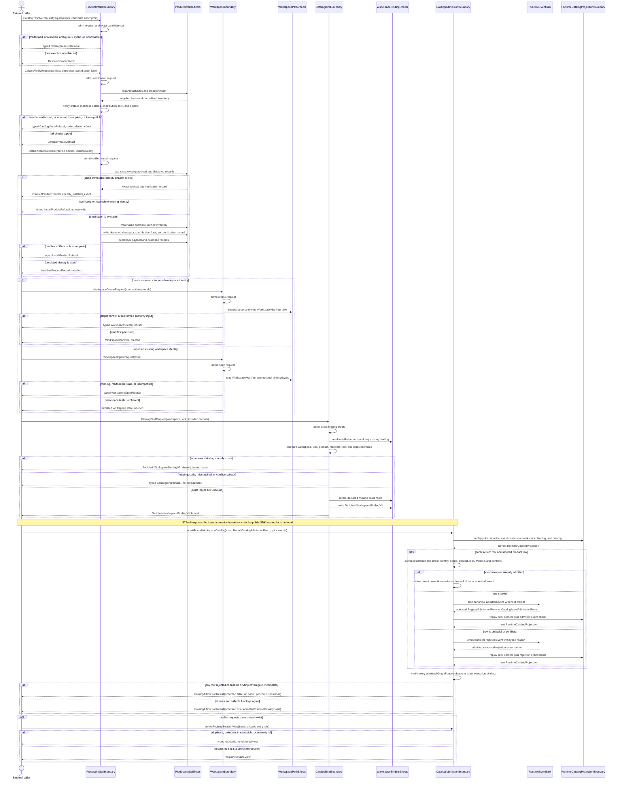
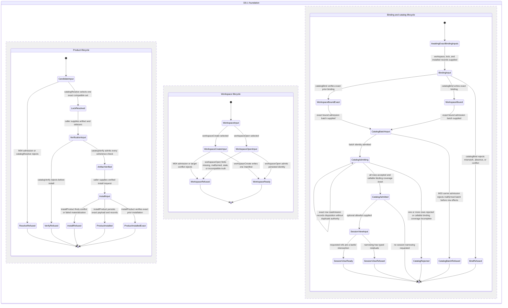

# M02-M04 Installed Catalog Foundation Behavior Design

**Status**: Candidate retrospective design
**Checkpoint under review**: `f572ee9` (`T-223: checkpoint installed catalog foundation`)
**Review date**: 2026-07-12
**Change class**: `design_reframe`
**Method authority**: `../../../../.genesis/docs/standards/DESIGN_MODULE_METHOD.md` section 5E
**Tenant authority**: `TYPESCRIPT_REALIZATION_GUARDRAILS.md`

## Boundary

- **Design verdict**: `candidate`
- **Owning modules**: M04 product intake, workspace, and toolchain binding;
  M03 catalog admission, canonical events, replay projection, and admitted
  runtime-catalog basis; M02 published `Module` lookup used by M03 admission
- **Requirements**:
  - `specification/PRODUCT.md`
  - `specification/requirements/product/REQ-P-CATALOG.md`
  - `specification/requirements/product/REQ-P-INSTALL.md`
  - `specification/requirements/product/REQ-P-POLICY.md`
  - `specification/requirements/product/REQ-P-PUBLIC-CONTRACTS.md`
  - `specification/requirements/abg/REQ-R-ABG3-EVENTS.md`
  - `specification/requirements/gtl/REQ-L-GTL3-MODULE.md`
  - `specification/requirements/gtl/REQ-L-GTL3-GRAPHFUNCTION.md`
  - `specification/requirements/gtl/REQ-L-GTL3-IDENTITY.md`
- **Ticket**: T-223, DS-1 foundation checkpoint
- **Code scope**: exact product resolution, artifact verification, immutable
  installation, workspace create/open, exact workspace binding, M03 catalog
  admission, canonical catalog events, replay projection, admitted catalog
  basis, and narrowing-only session-view derivation present at `f572ee9`
- **Dependencies**: completed T-222 design pack; existing M02 Module lookup and
  M03 runtime-registry/event admission
- **Explicit exclusions**: static product publication, generated schemas,
  publisher-authored Hello World, executable public SDK, `abg.cli`, packed
  consumer proof, live sandbox, public GraphFunction invocation proof, result
  and replay adapters, later public operations, node-type application, overlay
  application, product mutation lifecycle, and all self-hosting or full-5.0
  closure claims

This is a retrospective design reconstruction. It evaluates the code frozen at
`f572ee9` against authority that predates the code and the current live product
law. It does not rationalize later implementation and does not authorize work
outside the boundary above.

The checkpoint is the deterministic lower foundation of DS-1. This candidate
finding is that the carriers and effect boundaries appear structurally fit for
retention as the substrate for the remaining T-223 work. Retention remains
frozen until independent axiom review and F_H ratification accept the design.
It does not mean that T-223, DS-1, or Abiogenesis 5.0 is complete.

## Domain Model

```mermaid
classDiagram
  direction LR

  class ExternalCaller {
    <<effect-edge>>
    +supplies requests and actor attribution
  }

  class CatalogResolveRequest {
    <<effect-edge>>
    +requirements
    +candidateDescriptors
  }

  class CatalogVerifyRequest {
    <<effect-edge>>
    +artifact
    +descriptor
    +contributionManifest
    +resolvedLock
  }

  class InstallProductRequest {
    <<effect-edge>>
    +verifiedArtifact
    +toolchainRoot
  }

  class WorkspaceCreateRequest {
    <<effect-edge>>
    +targetRoot
    +authorityMode
  }

  class WorkspaceOpenRequest {
    <<effect-edge>>
    +targetRoot
  }

  class CatalogBindRequest {
    <<effect-edge>>
    +workspaceId
    +resolvedLock
    +installedProducts
  }

  class CatalogProductDescriptor {
    <<prime>>
    <<authoritative>>
    +descriptorId
    +productId
    +version
    +artifactDigest
    +contributionDigest
  }

  class CatalogContributionManifest {
    <<prime>>
    <<authoritative>>
    +contributionId
    +contributionDigest
  }

  class CatalogContributionRow {
    <<subordinate>>
    +canonicalHandle
    +publicKind
    +declarationLocator
  }

  class ProductRequirement {
    <<subordinate>>
    +productId
    +versionConstraint
  }

  class ResolvedProductSelection {
    <<subordinate>>
    +productId
    +version
    +descriptorId
  }

  class ResolvedDependencyEdge {
    <<subordinate>>
    +sourceProductId
    +targetProductId
  }

  class ResolvedProductLock {
    <<prime>>
    <<authoritative>>
    +lockId
    +lockDigest
  }

  class SuppliedProductArtifact {
    <<effect-edge>>
    +artifactPath
    +expectedArtifactDigest
  }

  class ProductToolchainManifest {
    <<prime>>
    <<authoritative>>
    +productId
    +packageVersion
    +productContentDigest
  }

  class PublicContractCatalog {
    <<prime>>
    <<authoritative>>
    +catalogId
    +catalogVersion
    +catalogDigest
  }

  class VerifiedProductArtifact {
    <<prime>>
    <<authoritative>>
    +verifiedAt
    +contentInventory
    +verificationChecks
  }

  class InstalledProductRecord {
    <<prime>>
    <<authoritative>>
    +productRoot
    +manifestPath
    +verificationRecordPath
  }

  class ProductVerificationRecord {
    <<prime>>
    <<authoritative>>
    +installedIdentity
    +verifiedIdentity
  }

  class WorkspaceManifest {
    <<prime>>
    <<authoritative>>
    +workspaceId
    +root
    +authorityMode
  }

  class ToolchainProductBindingV3 {
    <<subordinate>>
    +productId
    +version
    +manifestDigest
  }

  class ToolchainMutableStateRootsV3 {
    <<subordinate>>
    +eventLogPath
    +runtimeRoot
    +projectionRoot
    +archiveRoot
  }

  class ToolchainWorkspaceBindingV3 {
    <<prime>>
    <<authoritative>>
    +bindingId
    +workspaceId
    +resolvedLockId
  }

  class BoundCatalogAdmissionBatch {
    <<prime>>
    +workspaceId
    +bindingId
    +catalogId
    +resolvedLockRef
  }

  class CatalogAdmissionDeclaration {
    <<subordinate>>
    +kind
    +entryRef
    +declarationRef
  }

  class RegistryAdmissionEvent {
    <<prime>>
    <<authoritative>>
    <<admitted event carrier>>
    +ordinal
    +eventRef
  }

  class CatalogAssetAdmissionEvent {
    <<prime>>
    <<authoritative>>
    <<admitted event carrier>>
    +ordinal
    +eventRef
  }

  class RuntimeEventSink {
    <<M03 truth-write boundary>>
    +append canonical event
  }

  class RuntimeCatalogProjectionBoundary {
    <<M03 replay boundary>>
    +replay canonical catalog events
  }

  class RuntimeCatalogProjection {
    <<prime>>
    <<downstream>>
    +projectionRef
    +workspaceId
    +bindingId
    +catalogId
  }

  class CatalogExecutionBinding {
    <<subordinate>>
    +entryRef
    +graphFunctionRef
    +moduleIdentity
  }

  class AdmittedRuntimeCatalogBasis {
    <<prime>>
    <<downstream>>
    +basisRef
    +catalogIdentity
    +projectionRefs
  }

  class CatalogAdmissionResult {
    <<downstream>>
    +accepted
    +rowDispositions
    +basis
  }

  class RegistrySessionView {
    <<downstream>>
    +viewRef
    +allowedEntryRefs
  }

  class ProductIntakeBoundary {
    <<M04 admission boundary>>
    +catalogResolve
    +catalogVerify
    +installProduct
  }

  class ProductIntakeEffects {
    <<effect-edge>>
    -read and inspect artifact
    -materialize and verify product
    -read and write detached records
  }

  class WorkspaceBoundary {
    <<M04 admission boundary>>
    +workspaceCreate
    +workspaceOpen
  }

  class WorkspacePathEffects {
    <<effect-edge>>
    -inspect target
    -read and write workspace manifest
  }

  class CatalogBindBoundary {
    <<M04 admission boundary>>
    +catalogBind
  }

  class WorkspaceBindingEffects {
    <<effect-edge>>
    -read installed records
    -read and write binding
    -create mutable roots
  }

  class CatalogAdmissionBoundary {
    <<M03 catalog admission boundary>>
    +admitBoundWorkspaceCatalog
    +deriveRegistrySessionView
  }

  class DeferredDs1Delivery {
    <<deferred>>
    +product publication
    +public SDK and CLI
    +packed and live proof
    +invoke result replay adapters
  }

  class PublicOperationOutcome {
    <<prime>>
    <<downstream>>
    +operationId
    +kind
  }

  class PublicOperationAccepted {
    <<downstream>>
    +disposition
    +value
  }

  class PublicOperationRefused {
    <<downstream>>
    +code
    +residualRefs
  }

  CatalogProductDescriptor "1" --> "1" CatalogContributionManifest : digest-binds
  CatalogContributionManifest "1" *-- "1..*" CatalogContributionRow : owns
  ResolvedProductLock "1" *-- "1..*" ProductRequirement : closes
  ResolvedProductLock "1" *-- "1..*" ResolvedProductSelection : selects
  ResolvedProductLock "1" *-- "0..*" ResolvedDependencyEdge : orders
  SuppliedProductArtifact --> ProductIntakeBoundary : foreign bytes
  ExternalCaller --> CatalogResolveRequest : supplies
  ExternalCaller --> CatalogVerifyRequest : supplies
  ExternalCaller --> InstallProductRequest : supplies
  ExternalCaller --> WorkspaceCreateRequest : supplies
  ExternalCaller --> WorkspaceOpenRequest : supplies
  ExternalCaller --> CatalogBindRequest : supplies
  CatalogResolveRequest --> ProductIntakeBoundary : admitted by
  CatalogVerifyRequest --> ProductIntakeBoundary : admitted by
  InstallProductRequest --> ProductIntakeBoundary : admitted by
  ProductIntakeBoundary --> ProductIntakeEffects : invokes bounded effects
  ProductIntakeBoundary --> ResolvedProductLock : constructs
  ProductIntakeBoundary --> VerifiedProductArtifact : verifies
  VerifiedProductArtifact --> CatalogProductDescriptor : preserves
  VerifiedProductArtifact --> CatalogContributionManifest : preserves
  VerifiedProductArtifact --> ResolvedProductLock : preserves
  VerifiedProductArtifact --> ProductToolchainManifest : admits
  ProductToolchainManifest "1" *-- "1" PublicContractCatalog : publishes
  ProductIntakeBoundary --> InstalledProductRecord : materializes
  ProductIntakeBoundary --> PublicOperationOutcome : returns
  InstalledProductRecord --> ProductVerificationRecord : persisted with
  WorkspaceCreateRequest --> WorkspaceBoundary : admitted by
  WorkspaceOpenRequest --> WorkspaceBoundary : admitted by
  WorkspaceBoundary --> WorkspacePathEffects : invokes bounded effects
  WorkspaceBoundary --> WorkspaceManifest : writes or reads
  WorkspaceBoundary --> PublicOperationOutcome : returns
  ToolchainWorkspaceBindingV3 "1" *-- "1..*" ToolchainProductBindingV3 : owns
  ToolchainWorkspaceBindingV3 "1" *-- "1" ToolchainMutableStateRootsV3 : owns
  CatalogBindBoundary --> ToolchainWorkspaceBindingV3 : constructs
  CatalogBindRequest --> CatalogBindBoundary : admitted by
  CatalogBindBoundary --> WorkspaceBindingEffects : invokes bounded effects
  CatalogBindBoundary --> PublicOperationOutcome : returns
  CatalogBindBoundary --> WorkspaceManifest : checks
  CatalogBindBoundary --> InstalledProductRecord : checks exact set
  CatalogBindBoundary --> ResolvedProductLock : checks
  BoundCatalogAdmissionBatch "1" *-- "1..*" CatalogAdmissionDeclaration : owns
  CatalogAdmissionBoundary --> BoundCatalogAdmissionBatch : admits
  CatalogAdmissionBoundary --> RuntimeEventSink : emits through
  RuntimeEventSink --> RegistryAdmissionEvent : appends
  RuntimeEventSink --> CatalogAssetAdmissionEvent : appends
  RegistryAdmissionEvent --> RuntimeCatalogProjectionBoundary : replay input
  CatalogAssetAdmissionEvent --> RuntimeCatalogProjectionBoundary : replay input
  RuntimeCatalogProjectionBoundary --> RuntimeCatalogProjection : produces
  RuntimeCatalogProjection "1" *-- "0..*" CatalogExecutionBinding : joins exact callable rows
  RuntimeCatalogProjection --> CatalogAdmissionBoundary : replay result input
  CatalogAdmissionBoundary --> AdmittedRuntimeCatalogBasis : produces when complete
  CatalogAdmissionBoundary --> CatalogAdmissionResult : returns
  CatalogAdmissionResult --> AdmittedRuntimeCatalogBasis : contains when accepted
  AdmittedRuntimeCatalogBasis --> CatalogAdmissionBoundary : session narrowing input
  CatalogAdmissionBoundary --> RegistrySessionView : produces narrowed view
  ExternalCaller --> ProductIntakeBoundary : invokes
  ExternalCaller --> WorkspaceBoundary : invokes
  ExternalCaller --> CatalogBindBoundary : invokes
  ExternalCaller --> CatalogAdmissionBoundary : invokes
  PublicOperationOutcome <|-- PublicOperationAccepted : accepted variant
  PublicOperationOutcome <|-- PublicOperationRefused : refused variant
  DeferredDs1Delivery ..> AdmittedRuntimeCatalogBasis : later consumes
```



The irreducible authoritative carrier progression is:

```text
descriptor + contribution + supplied artifact
  -> ResolvedProductLock
  -> VerifiedProductArtifact
  -> InstalledProductRecord + ProductVerificationRecord
workspace input -> WorkspaceManifest
workspace + lock + installed records -> ToolchainWorkspaceBindingV3
exact bound admission batch -> canonical events -> RuntimeCatalogProjection
  -> AdmittedRuntimeCatalogBasis
```

Rows, dependency edges, content inventories, verification checks, product
bindings, mutable roots, declaration rows, event payloads, execution bindings,
and session entries remain subordinate to those carriers. Effect objects carry
filesystem or event-sink capabilities only; they are not semantic truth.

## Execution Sequence



No worker, F_P result, retry, recursion, fan-out/fan-in, nested graph workflow,
or F_H transition occurs in this checkpoint. The row loop is deterministic
admission over a finite submitted carrier, not `C.batch` or hidden graph
workflow. Public GraphFunction invocation and its ordinary M03 traversal are
deferred and therefore absent from this sequence.

## Lifecycle State Machine



The three concurrent regions represent separate product, workspace, and
binding/catalog truth. The binding region may enter `BindingInput` only when a
`WorkspaceReady` identity, a `LockResolved` identity, and exact installed
records from the product region are supplied. The state machine deliberately
does not collapse installed into bound, bound into admitted, admitted into
session-visible, or catalog presence into callable runtime authority.

## Cross-View Invariants

| Check | Evidence | Verdict |
|---|---|---|
| Every sequence participant exists in the domain model or is external | Caller is explicitly external; admission is the parser/admitter facet of the M04 boundaries; all effect, binding, event, catalog, and projection boundaries are modeled | pass |
| Every lifecycle carrier exists in the domain model | Lock, verified artifact, installed record, workspace manifest, binding, admission result, catalog basis, and session view are modeled prime or downstream carriers | pass |
| Every message names a typed transform, admission function, or effect boundary | Requests pass through M04 admission; pure resolution, effectful verification/install/workspace/bind, and M03 event admission are named separately | pass |
| Every transition has an admission, effect, event, or projection owner | M04 admission boundaries coordinate product/workspace effects; M03 owns catalog event admission and the explicit catalog replay boundary | pass |
| Installed, bound, admitted, visible, eligible, and callable are not synonyms | Separate carriers and lifecycle states preserve every boundary; only an admitted basis can derive a session view | pass |
| Raw F_P output cannot transition directly to accepted or closed | No F_P output or semantic judgment exists in this deterministic foundation | not_applicable: no probabilistic boundary |
| Plugins and handlers own interiors only | No plugin or worker handler participates; filesystem capabilities and event sink are effect edges without semantic authority | pass |
| Batch, retry, recursion, and nested workflow use declared algebra | No graph batch, retry, recursion, or nested workflow is implemented or relied on; finite row admission is deterministic carrier admission | not_applicable: graph execution is excluded |
| Catalog mutation is canonical-event owned | Every new row disposition is backed by a canonical admitted or rejected event and replayed projection; exact readmission does not mint rival authority | pass |
| Session selection cannot widen workspace authority | Session view is derived only from an admitted basis and refuses unknown, duplicate, inadmissible, or unready refs | pass |

## Axiom Evaluation

| Axiom | Authority | Domain evidence | Sequence evidence | State evidence | Native enforcement | Admission/compiler enforcement | Verdict | Gap owner |
|---|---|---|---|---|---|---|---|---|
| Exact immutable product identity precedes install or binding | PRODUCT installed-product boundary; REQ-P-CATALOG-001 through -013; REQ-P-INSTALL-043 through -045 | Descriptor, contribution, artifact, lock, verified artifact, and installed record are distinct carriers | Resolve and verify finish before install; bind consumes exact lock and records | Resolution, verification, install, and bind are separate states | Readonly closed TypeScript carriers and digest string domain | I-JSON/JCS admission, SemVer admission, lock and digest coherence checks | pass | none |
| Source project, release product, installed product, and workspace remain distinct | PRODUCT; REQ-P-INSTALL-002, -005, -036 | Product payload/record and workspace manifest/binding are separate identities | Product materialization targets toolchain product root; workspace writes only binding/mutable-root truth | Product and workspace are concurrent independent lifecycles | Distinct discriminated carrier families | Root, manifest, package, product, and workspace identity checks | pass | none |
| Installation does not confer catalog authority | REQ-P-CATALOG-004, -014, -029 | InstalledProductRecord, ToolchainWorkspaceBindingV3, RuntimeCatalogProjection, and AdmittedRuntimeCatalogBasis are separate | Explicit bind and explicit M03 admission follow install | Installed, bound, and admitted are separate states | No union variant aliases these states | Bind coherence and M03 row admission gate each transition | pass | none |
| M03 is the sole catalog-event and replay authority | PRODUCT; REQ-P-INSTALL-004; REQ-P-CATALOG-014 through -018; REQ-R-ABG3-EVENTS | M04 boundaries stop at binding; M03 admission owns events while RuntimeCatalogProjectionBoundary owns replay | CatalogAdmissionBoundary emits through RuntimeEventSink, then supplies admitted event carriers to RuntimeCatalogProjectionBoundary | Catalog transitions are owned by M03 admission events and the resulting replay projection | M03 event and projection types are not reconstructed in M04 | Canonical event admission, ordinal emitter context, and replay admission | pass | none |
| GraphFunction is the sole public callable catalog kind | PRODUCT; REQ-P-CATALOG-006 through -009 | Execution binding exists only for admitted GraphFunction rows; node type and overlay remain non-callable catalog rows | Admission verifies exact GraphFunction Module resolution and total execution-binding coverage | Catalog admission can complete only with exact callable coverage | Closed public-kind and declaration-locator unions | Kind-specific row admission and Module lookup authority | pass | none |
| Conflicts fail typed and exact readmission alone is idempotent | REQ-P-CATALOG-016, -017; REQ-P-INSTALL-013 | Identity-bearing lock, install, binding, declaration, event, and disposition carriers | Conflicting install/bind/admit paths refuse; exact prior identities return exact dispositions | Refused and exact-idempotent states are distinct | Closed outcome unions and literal disposition values | Cross-identity coherence and conflict admission | pass | none |
| Catalog provenance survives to replay-derived truth | REQ-P-CATALOG-015, -019 through -022 | Descriptor, contribution, lock, declaration, events, projection, and basis retain refs | Admission events preserve source identities before projection | CatalogAdmitted derives only after replay projection | Required provenance fields on closed carriers | Catalog row and event admission check exact refs | pass | none |
| Session allowlists are narrowing-only | REQ-P-CATALOG-023 through -026 | RegistrySessionView is downstream from AdmittedRuntimeCatalogBasis | Optional derivation accepts only an intersection and returns typed residuals otherwise | SessionViewReady is reachable only from CatalogAdmitted | Closed residual-reason union | `deriveRegistrySessionView` rejects duplicate, unknown, inadmissible, and unready refs | pass | none |
| Native types enforce local relations; admission owns global coherence | DESIGN_MODULE_METHOD 5E; TYPESCRIPT_REALIZATION_GUARDRAILS | Prime carriers and subordinate payloads are explicit; effect capabilities are not truth carriers | Every foreign request enters an admitter before owned behavior | Malformed inputs transition to refusal rather than later semantic states | Strict readonly interfaces and closed discriminated unions | Carrier admitters, digest checks, lock graph checks, Module lookup, and event admission | pass | none |
| No adapter, effect provider, or helper becomes a second semantic center | PRODUCT public operator law; TYPESCRIPT_REALIZATION_GUARDRAILS authority-seam closure | Effect boundaries carry IO capabilities only; authoritative meaning remains in admitted carriers and M03 events | Effects read/write requested bytes and return interior results; decisions remain in owning boundary | Controller-local memory creates no lifecycle state | Effect interfaces exclude event, traversal, continuation, and closure mutation | Readback verification and replay projection prevent effect-local truth | pass | none |
| Graph-native workflow uses declared GTL/C algebra rather than imperative orchestration | REQ-L-GTL3-CONTRACT-LAW-API-001 through -010; ODD method | No workflow GraphFunction, graph vector, C term, worker, or continuation is in this boundary | Sequence is deterministic product lifecycle and catalog admission only | No running, retry, recurse, fan-out, or graph closure state exists | No workflow carrier is claimed | Graph invocation is explicitly deferred | not_applicable: this foundation is not graph execution | T-223 remaining invocation slice |
| Probabilistic output is admitted before semantic acceptance | PRODUCT F_D/F_P/F_H law; ABG payload and assurance law | No F_P payload or evaluator result is in this boundary | No worker transport or probabilistic message exists | No probabilistic lifecycle state exists | No F_P outcome type is accepted here | Not invoked | not_applicable: deterministic foundation only | later invocation/runtime proof |
| Trusted-desktop scope remains proportional | PRODUCT; REQ-P-CATALOG-027, -028 | Digests and exact local roots provide identity; no signing, RBAC, registry, or hostile-local carrier is introduced | Sequence uses supplied local artifacts and bounded filesystem effects | No hostile/multi-user lifecycle is claimed | Local path and digest domains only | Unsafe archive and path admission cover likely malformed input | pass | none |
| Partial DS-1 publication cannot claim the complete public product | REQ-P-PUBLIC-CONTRACTS; T-222 DS-1 operation map | DeferredDs1Delivery is explicit and the foundation carriers do not claim full catalog capability | Public SDK, CLI, invoke, result, replay, packed, and live paths are absent | State machine terminates at admitted basis/session view | No complete-capability flag is exposed by this checkpoint | Full public roster and packed qualification remain later gates | pass | T-223 remaining delivery |

## Gap And Exclusion Register

| Gap or exclusion | Why outside or blocking | Owner | Re-entry condition |
|---|---|---|---|
| Public product manifest and static contract/schema publication | `f572ee9` implements admission and verification mechanics, not the packed publisher output that exercises them | T-223 continuation | Publish one exact packed ABG product and validate its closed file/contract census |
| Public SDK operation execution | Foundation functions and carriers exist, but the one source-blind SDK dispatcher and exact context selection are not in this checkpoint | T-223 continuation | SDK delegates admitted operations to these boundaries without reconstructing meaning |
| `abg.cli` | Thin CLI adapter is intentionally later than the SDK contract | T-223 continuation | CLI parses and delegates to the same SDK operations with equivalent outcomes |
| Bound-catalog public assembly | M03 accepts an exact `BoundCatalogAdmissionBatch`; public assembly from the workspace binding, lock, verified sidecars, and contribution rows is not part of this checkpoint | T-223 continuation | SDK constructs and admits the batch from exact installed/bound truth without test-only inventory |
| Publisher-authored Hello World | Needed to prove source-blind Module and GraphFunction consumption, but no fixture is published at this checkpoint | T-223 continuation | Packed declaration-only fixture installs, binds, admits, and invokes |
| Public GraphFunction invocation, result, and replay | M03 execution binding is prepared, but this checkpoint does not prove public invocation or read adapters | T-223 continuation | Selected admitted GraphFunction enters the existing M03 runner and projects typed result/replay truth |
| Packed deterministic and live qualification | Unit behavior is present; release-shaped installed proof and one live sandbox are not | T-223 continuation | Packed SDK and CLI Hello World plus bounded malformed and live differentials pass |
| Node-type and overlay application semantics | DS-1 retains list/describe/non-callability only; application law is separate | T-179 and T-228 | Separate admitted application contracts and proof exist |
| Remaining public operation and capability families | DS-1 foundation is a partial public-product slice and must not imply the full 5.0 contract | Later 5.0 delivery phases | Each owning phase supplies accepted three-view design and implementation proof |
| Update, disable, unbind, uninstall, retirement, revocation, and hosted marketplace behavior | Explicitly outside initial 5.0 distribution scope | Future product reprice | Concrete demand and constitutional admission |
| Signing, hostile-local tamper proofing, organization RBAC, and multi-user administration | Unsupported by the trusted single-developer desktop use case and disproportionate to likely failure | Future product reprice | Threat model or deployment context changes |
| Graph batch, retry, recursion, nested workflow, worker transport, and F_H | Not used by deterministic product intake or catalog admission | Owning graph/runtime slices | A concrete graph-native operation requires them and an accepted design names the algebra |

## Design Verdict

`candidate` for retention of the bounded lower-foundation code at checkpoint
`f572ee9`.

The candidate evidence is the 2026-07-12 Codex retrospective three-view review
against the exact checkpoint diff, the live product and requirement authority,
the completed T-222 design pack, and the checkpoint's 25 focused T-223 tests.
That review found no hidden graph workflow, second runtime controller,
lifecycle collapse, or relied-on graph-algebra gap inside this boundary.
Deterministic product effects remain in M04; catalog authority, canonical
events, replay, and the admitted basis remain in M03. Independent axiom review
and F_H ratification are still required before the verdict can become
`accepted` or implementation can resume over this boundary.

This candidate does **not** authorize checkpoint retention, accept later T-223
code, close T-223 or DS-1, qualify a release candidate, or establish
Abiogenesis 5.0 completeness. The gap register is mandatory continuation work.
Any later slice that introduces public
orchestration, GraphFunction execution, retry, recursion, fan-out/fan-in,
worker behavior, or F_H must receive its own accepted three-view design before
code continues.
