# M02-M04 Installed Catalog, SDK, And CLI Structural Carrier Diagram

**Ticket**: T-222
**Status**: Completed
**Date**: 2026-07-11
**Derived from**: `M02_M04_INSTALLED_CATALOG_SDK_CLI_DERIVATION.md`,
`M02_M04_INSTALLED_CATALOG_SDK_CLI_IACS.md`,
`M02_M04_INSTALLED_CATALOG_SDK_CLI_PUBLIC_OPERATION_REGISTER.md`

## Purpose

Render the DS-1 carrier topology with M02 publication, M03 runtime, M04 product
delivery/read-model, and CLI adapter ownership visible. Composition means owned
payload membership. Association means reference, derivation, or consumption.
Inheritance is used only for actual discriminated outcome/specialization types.

## Structural Relationships

```mermaid
classDiagram
direction LR

class GraphFunction {
  <<prime>>
  <<authoritative>>
  +id: opaque
  +name: display
}

class MaterializeNodeType {
  <<pure-admission>>
  +owner: M01
}

class Module {
  <<prime>>
  <<authoritative>>
  +owner: M02
}

class ModuleLookupAuthority {
  <<prime>>
  <<authoritative>>
  +owner: M02
}

class GtlLibraryEntryDeclaration {
  <<prime>>
  <<authoritative>>
  +owner: M02
}

class ProductRegistryStartupConfig {
  <<prime>>
  <<authoritative>>
  +owner: M02
}

class ProductToolchainManifest {
  <<prime>>
  <<authoritative>>
  +productContentDigest
  +productRelativeLocators
}

class AbgRuntimeSystemProfile {
  <<subordinate>>
  +runtimeIdentity
  +resolvedPolicyIdentity
  +standardPluginRefs
  +profileDigest
}

class PublicContractCatalog {
  <<prime>>
  <<authoritative>>
  +catalogId
  +catalogVersion
  +catalogDigest
}

class PublicContractRow {
  <<subordinate>>
  +contractId
  +version
  +digest
}

class NativeContractLocator {
  <<subordinate>>
  +packageExport
  +symbol
}

class CanonicalAssetLocator {
  <<subordinate>>
  +relativePath
  +schemaId
  +digest
}

class CatalogProductDescriptor {
  <<prime>>
  <<authoritative>>
  +publisher
  +productId
  +version
}

class CatalogContributionManifest {
  <<prime>>
  <<authoritative>>
  +contributionId
  +contributionDigest
}

class CatalogContributionRow {
  <<subordinate>>
  +canonicalHandle
  +publicKind
}

class ModuleDeclarationLocator {
  <<subordinate>>
  +modulePath
  +declarationRef
}

class OpaqueOverlayAssetLocator {
  <<subordinate>>
  +assetPath
  +schemaId
}

class ProductRequirement {
  <<subordinate>>
  +productId
  +versionConstraint
}

class ResolvedDependencyEdge {
  <<subordinate>>
  +sourceProduct
  +targetProduct
}

class ResolvedProductLock {
  <<prime>>
  <<authoritative>>
  +owner: M04
  +lockId
  +lockDigest
}

class SuppliedProductArtifact {
  <<subordinate>>
  +format
  +artifactPath
  +expectedDigest
}

class ProductVerificationCheck {
  <<subordinate>>
  +field
  +accepted
}

class VerifiedProductArtifact {
  <<prime>>
  <<authoritative>>
  +owner: M04
}

class GenericVerifiedProductMaterializer {
  <<effect-edge>>
  +owner: M04
}

class AbgNpmPackageAdapter {
  <<subordinate>>
  +format: npm_package_tgz
}

class InstalledProductRecord {
  <<prime>>
  <<authoritative>>
  +owner: M04
}

class WorkspaceIdentity {
  <<subordinate>>
  +workspaceId
}

class WorkspaceManifest {
  <<prime>>
  <<authoritative>>
  +owner: M04
}

class WorkspaceCreateEffect {
  <<effect-edge>>
  +owner: M04
}

class ToolchainProductBindingV3 {
  <<subordinate>>
  +installedProductId
  +manifestDigest
}

class ToolchainWorkspaceBindingV3 {
  <<prime>>
  <<authoritative>>
  +owner: M04
  +bindingId
}

class CatalogBindEffect {
  <<effect-edge>>
  +owner: M04
}

class BoundCatalogAdmissionBatch {
  <<prime>>
  +owner: M03
  +systemDeclarations
  +orderedProductBatches
}

class CatalogAdmissionDeclaration {
  <<subordinate>>
  +kind: runtime_library_entry or opaque_catalog_asset
}

class OpaqueCatalogAssetDeclaration {
  <<subordinate>>
  +workspaceBindingCatalogIdentity
  +entryAndDeclarationIdentity
  +ownerVersionProductLockIdentity
  +assetSchemaAndDigest
  +readinessPolicyProvenance
}

class AdmitBoundWorkspaceCatalog {
  <<effect-edge>>
  +owner: M03
}

class RegistryAdmissionEvent {
  <<prime>>
  <<effect-edge>>
  <<authoritative>>
  +owner: M03
}

class CatalogAssetAdmissionEvent {
  <<prime>>
  <<effect-edge>>
  <<authoritative>>
  +owner: M03
  +kind: catalog_asset_admitted or catalog_asset_rejected
  +workspaceScope
}

class CatalogRowDisposition {
  <<subordinate>>
  +handle
  +disposition
}

class CatalogAdmissionResult {
  <<prime>>
  <<authoritative>>
  +owner: M03
}

class RuntimeRegistryProjection {
  <<prime>>
  <<authoritative>>
  +owner: M03
  +projectionRef
}

class OpaqueCatalogAssetProjection {
  <<subordinate>>
  +kind: overlay
  +callable: false
}

class RejectedOpaqueCatalogAssetProjection {
  <<subordinate>>
  +rejectionReason
  +conflictingEntryRefs
}

class RuntimeCatalogProjection {
  <<prime>>
  <<authoritative>>
  +owner: M03
  +catalogProjectionRef
}

class RegistryLookupResult {
  <<prime>>
  <<authoritative>>
  +owner: M03
}

class AdmittedRuntimeCatalogBasis {
  <<prime>>
  <<authoritative>>
  +owner: M03
  +catalogId
  +projectionRef
}

class CatalogExecutionBinding {
  <<subordinate>>
  -module
  -selectedHandle
}

class CatalogReadinessDecision {
  <<subordinate>>
  +ready
  +blockers
}

class RegistrySessionView {
  <<prime>>
  <<authoritative>>
  +owner: M03
  +allowedEntryRefs
}

class CatalogEligibilityDecision {
  <<subordinate>>
  +eligible
  +reasons
}

class PublicCatalogRow {
  <<subordinate>>
  +handle
  +kind
  +callable
}

class PublicCatalogDescription {
  <<subordinate>>
  +handle
  +provenance
}

class WorkspaceCatalogProjection {
  <<prime>>
  <<downstream>>
  +owner: M04
}

class PublicSessionCatalogView {
  <<prime>>
  <<downstream>>
  +owner: M04
  +sessionViewId
  +allowedHandles
}

class PublicOperationInvocationEnvelope {
  <<prime>>
  <<downstream>>
  +operationId
  +requestSchemaIdentity
  +resultSchemaIdentity
  +refusalSchemaIdentity
  +request
}

class OperationSpecificPayload {
  <<subordinate>>
  +requestOrResultOrRefusal
}

class HostInvocationDescriptor {
  <<prime>>
  <<downstream>>
  +catalogId
  +catalogVersion
  +productBindingRefs
  +effectiveSessionViewId
  +allowedHandles
  +graphFunctionHandle
  +inputIdentity
  +expectedOutcomeSchemas
}

class AdmittedWorkspaceReplay {
  <<prime>>
  <<authoritative>>
  +owner: M03
  +orderedEvents
}

class WorkspaceRuntimeEventBytes {
  <<subordinate>>
  +boundEventPath
  +bytes
}

class WorkspaceRuntimeEventReader {
  <<effect-edge>>
  +owner: M04
}

class CatalogInvocationAssembly {
  <<prime>>
  +owner: M03
  -executionBinding
  -engineStartRequest
}

class InvokeAdmittedCatalogGraphFunction {
  <<effect-edge>>
  +owner: M03
}

class GraphFunctionSelectedEvent {
  <<prime>>
  <<effect-edge>>
  <<authoritative>>
  +owner: M03
}

class GraphCall {
  <<prime>>
  <<authoritative>>
  +owner: M03
}

class ExecutionBasis {
  <<prime>>
  <<authoritative>>
  +owner: M03
}

class EngineStartRequest {
  <<prime>>
  <<authoritative>>
  +owner: M03
}

class RuntimeEventLogSink {
  <<effect-edge>>
  +owner: M03
}

class RuntimeEventStream {
  <<prime>>
  <<authoritative>>
  +owner: M03
}

class PublicResultProjection {
  <<prime>>
  <<downstream>>
  +owner: M03
}

class PublicReplayProjection {
  <<prime>>
  <<downstream>>
  +owner: M03
}

class PublicOperationAccepted {
  <<prime>>
}

class PublicOperationRefused {
  <<prime>>
}

class PublicOperationOutcome {
  <<prime>>
  <<downstream>>
}

class AbiogenesisPublicSdk {
  <<downstream>>
  +owner: M04
}

class PublicSdkExecutionContext {
  <<prime>>
  <<effect-edge>>
  +owner: M04
  +kind: closed context union
}

class WorkspacePathContext {
  <<subordinate>>
  +targetRoot
}

class ProductIntakeContext {
  <<subordinate>>
  +artifactAndRecordEffects
}

class WorkspaceBindingContext {
  <<subordinate>>
  +admittedWorkspaceManifest
}

class BoundWorkspaceContext {
  <<subordinate>>
  +admittedWorkspaceAndBinding
}

class OperatorCapabilityComposer {
  <<effect-edge>>
  +owner: M04
}

class LiveCapabilityBinding {
  <<prime>>
  +owner: M04
  +pluginCapabilities
}

class EnginePluginCapabilities {
  <<prime>>
  <<authoritative>>
  +owner: M03
}

class CliParsedInput {
  <<subordinate>>
  +flags
  +paths
}

class AbgCli {
  <<downstream>>
  +parse
  +delegate
  +render
}

class ProductLifecycleMutation {
  <<deferred>>
}

ProductToolchainManifest *-- PublicContractCatalog : contains bootstrap catalog
ProductToolchainManifest *-- AbgRuntimeSystemProfile : ABG-only invocation profile
PublicContractCatalog *-- PublicContractRow : contains
PublicContractRow *-- NativeContractLocator : zero or one
PublicContractRow *-- CanonicalAssetLocator : zero or one

CatalogProductDescriptor --> CatalogContributionManifest : detached digest reference
CatalogContributionManifest *-- CatalogContributionRow : contains
CatalogContributionRow *-- ModuleDeclarationLocator : graph function or node type
CatalogContributionRow *-- OpaqueOverlayAssetLocator : overlay alternative
ModuleDeclarationLocator --> Module : locates admitted publication
Module *-- GraphFunction : publishes
GraphFunction --> MaterializeNodeType : node-type rows prove identity law
ModuleLookupAuthority --> Module : resolves declarations from
ModuleLookupAuthority --> GraphFunction : resolves opaque identity

ResolvedProductLock *-- ProductRequirement : resolves
ResolvedProductLock *-- ResolvedDependencyEdge : records
ResolvedProductLock --> CatalogProductDescriptor : selects detached identity
SuppliedProductArtifact --> VerifiedProductArtifact : verifier admits
VerifiedProductArtifact *-- ProductVerificationCheck : contains
VerifiedProductArtifact --> ProductToolchainManifest : verified payload bootstrap
VerifiedProductArtifact --> CatalogProductDescriptor : verifies detached identity
VerifiedProductArtifact --> CatalogContributionManifest : verifies detached identity
GenericVerifiedProductMaterializer --> InstalledProductRecord : writes exact payload
VerifiedProductArtifact --> GenericVerifiedProductMaterializer : required input
AbgNpmPackageAdapter --> GenericVerifiedProductMaterializer : ABG payload adapter

WorkspaceManifest *-- WorkspaceIdentity : contains
WorkspaceCreateEffect --> WorkspaceManifest : writes only workspace boundary
InstalledProductRecord --> CatalogBindEffect : exact input
WorkspaceManifest --> CatalogBindEffect : exact workspace
ResolvedProductLock --> CatalogBindEffect : exact graph
CatalogBindEffect --> ToolchainWorkspaceBindingV3 : writes
ToolchainWorkspaceBindingV3 *-- ToolchainProductBindingV3 : ordered product set
ToolchainProductBindingV3 --> ProductToolchainManifest : binds manifest digest
ToolchainProductBindingV3 --> PublicContractCatalog : binds catalog digest

ToolchainWorkspaceBindingV3 --> BoundCatalogAdmissionBatch : supplies opaque exact refs
CatalogContributionManifest --> BoundCatalogAdmissionBatch : supplies product batches
GtlLibraryEntryDeclaration --> BoundCatalogAdmissionBatch : admitted declaration rows
ProductRegistryStartupConfig --> BoundCatalogAdmissionBatch : one per product batch
BoundCatalogAdmissionBatch *-- CatalogAdmissionDeclaration : closed row union
CatalogAdmissionDeclaration --> GtlLibraryEntryDeclaration : runtime-library arm only
CatalogAdmissionDeclaration *-- OpaqueCatalogAssetDeclaration : opaque-asset arm
OpaqueCatalogAssetDeclaration --> OpaqueOverlayAssetLocator : exact asset locator
OpaqueCatalogAssetDeclaration --> CatalogProductDescriptor : exact product identity
OpaqueCatalogAssetDeclaration --> ResolvedProductLock : exact lock identity
BoundCatalogAdmissionBatch --> AdmitBoundWorkspaceCatalog : one ordered batch
AdmitBoundWorkspaceCatalog --> RuntimeEventLogSink : canonical append seam
RuntimeEventLogSink --> RegistryAdmissionEvent : persists admitted facts
RuntimeEventLogSink --> CatalogAssetAdmissionEvent : persists catalog-only facts
RegistryAdmissionEvent --> RuntimeRegistryProjection : replay-derived
RuntimeRegistryProjection --> RuntimeCatalogProjection : GraphFunction-backed subprojection
CatalogAssetAdmissionEvent --> OpaqueCatalogAssetProjection : admitted fold
CatalogAssetAdmissionEvent --> RejectedOpaqueCatalogAssetProjection : rejected fold
RuntimeCatalogProjection *-- OpaqueCatalogAssetProjection : owns catalog-only rows
RuntimeCatalogProjection *-- RejectedOpaqueCatalogAssetProjection : owns rejected rows
CatalogAdmissionResult *-- CatalogRowDisposition : owns row results
CatalogAdmissionResult --> RegistryAdmissionEvent : references registry facts
CatalogAdmissionResult --> CatalogAssetAdmissionEvent : references asset facts
CatalogAdmissionResult --> AdmittedRuntimeCatalogBasis : produces when required rows pass
AdmittedRuntimeCatalogBasis --> RuntimeCatalogProjection : binds replay-verifiable identity
AdmittedRuntimeCatalogBasis --> RuntimeRegistryProjection : binds callable subprojection
AdmittedRuntimeCatalogBasis *-- CatalogExecutionBinding : internal bindings
CatalogExecutionBinding --> Module : references admitted module
CatalogExecutionBinding --> GraphFunction : references callable declaration
AdmittedRuntimeCatalogBasis *-- CatalogReadinessDecision : owns readiness rows
RuntimeCatalogProjection --> RegistrySessionView : narrows all public kinds
AdmittedRuntimeCatalogBasis --> RegistrySessionView : exact catalog basis
RegistrySessionView *-- CatalogEligibilityDecision : request-local decisions

ToolchainWorkspaceBindingV3 --> WorkspaceCatalogProjection : product facts
CatalogProductDescriptor --> WorkspaceCatalogProjection : detached facts
CatalogContributionManifest --> WorkspaceCatalogProjection : contribution facts
RuntimeCatalogProjection --> WorkspaceCatalogProjection : M03 truth input
WorkspaceCatalogProjection *-- PublicCatalogRow : owns list rows
WorkspaceCatalogProjection *-- PublicCatalogDescription : owns describe rows
RegistrySessionView --> PublicSessionCatalogView : M03 view input
WorkspaceCatalogProjection --> PublicSessionCatalogView : M04 metadata join

PublicOperationInvocationEnvelope *-- OperationSpecificPayload : closed payload
HostInvocationDescriptor --|> PublicOperationInvocationEnvelope
PublicSessionCatalogView --> HostInvocationDescriptor : exact effective view
ToolchainWorkspaceBindingV3 --> WorkspaceRuntimeEventReader : resolves event path
WorkspaceRuntimeEventReader --> WorkspaceRuntimeEventBytes : reads without interpretation
WorkspaceRuntimeEventBytes --> AdmittedWorkspaceReplay : M03 admits and orders
AdmittedWorkspaceReplay --> CatalogInvocationAssembly : replay input
AdmittedRuntimeCatalogBasis --> CatalogInvocationAssembly : already admitted catalog
RegistrySessionView --> CatalogInvocationAssembly : selection boundary
CatalogExecutionBinding --> CatalogInvocationAssembly : admitted Module and selected handle
HostInvocationDescriptor --> CatalogInvocationAssembly : input/capability/actor
AbgRuntimeSystemProfile --> CatalogInvocationAssembly : bound runtime identity and policy
EnginePluginCapabilities --> CatalogInvocationAssembly : M03 capability input
CatalogInvocationAssembly --> InvokeAdmittedCatalogGraphFunction : one M03 ingress
CatalogInvocationAssembly --> EngineStartRequest : assembles existing input
EngineStartRequest --> ExecutionBasis : runEngineStartAsync admits sole basis
RuntimeRegistryProjection --> RegistryLookupResult : lookup input
RegistrySessionView --> RegistryLookupResult : narrowed eligibility
RegistryLookupResult --> InvokeAdmittedCatalogGraphFunction : exact eligible selection
InvokeAdmittedCatalogGraphFunction --> GraphFunctionSelectedEvent : emits before call
InvokeAdmittedCatalogGraphFunction --> RuntimeEventLogSink : canonical append seam
GraphFunctionSelectedEvent --> GraphCall : precedes
ExecutionBasis --> GraphCall : binds invocation truth
GraphCall --> RuntimeEventStream : ordinary start-to-iterate
AdmittedWorkspaceReplay --> PublicResultProjection : M03 projection
AdmittedWorkspaceReplay --> PublicReplayProjection : M03 projection

PublicOperationAccepted --|> PublicOperationOutcome
PublicOperationRefused --|> PublicOperationOutcome
AbiogenesisPublicSdk --> PublicOperationOutcome : returns exact typed outcome
PublicOperationInvocationEnvelope --> AbiogenesisPublicSdk : admitted request
PublicSdkExecutionContext --> AbiogenesisPublicSdk : explicit effect context
PublicSdkExecutionContext *-- WorkspacePathContext : create or open arm
PublicSdkExecutionContext *-- ProductIntakeContext : resolve verify install arm
PublicSdkExecutionContext *-- WorkspaceBindingContext : bind arm
PublicSdkExecutionContext *-- BoundWorkspaceContext : admitted operations arm
PublicSdkExecutionContext --> OperatorCapabilityComposer : standard factories
HostInvocationDescriptor --> OperatorCapabilityComposer : admitted steering and refs
OperatorCapabilityComposer --> LiveCapabilityBinding : composes existing carrier
LiveCapabilityBinding --> EnginePluginCapabilities : projects admitted M03 member
CliParsedInput --> AbgCli : adapter-only input
AbgCli --> AbiogenesisPublicSdk : one-to-one delegate
ToolchainWorkspaceBindingV3 ..> ProductLifecycleMutation : not DS-1
```



## Effect Flow

```text
workspace.create        -> WorkspaceManifest write only
catalog.resolve         -> pure ResolvedProductLock
catalog.verify          -> read/temp verify -> VerifiedProductArtifact
install.install         -> generic materializer + ABG npm adapter when applicable
catalog.bind            -> ToolchainWorkspaceBindingV3 + declared mutable roots
catalog.admit           -> M03 registry-entry or catalog-asset event append
catalog.list/describe   -> M04 WorkspaceCatalogProjection over M03 truth
catalog.allow           -> M03 RegistrySessionView + M04 public wrapper
catalog.invoke          -> already-admitted basis -> M03 selection -> GraphCall
read.result/replay      -> M04 bound read -> M03 event admission/projection
abg.cli                 -> no independent semantic effect
```

## Reading Rules

- Product manifest and public contract catalog are definition-bearing
  bootstrap carriers. The workspace binding stores their final digests.
- Descriptor, contribution, lock, and artifact sidecars reference one another;
  they are not composition-owned by each other or included in payload digest.
- Installation does not bind. Binding does not admit. Admission does not make a
  row ready, visible, eligible, or callable by itself.
- `RuntimeCatalogProjection`, its `RuntimeRegistryProjection` subprojection,
  `AdmittedRuntimeCatalogBasis`, registry session view, execution binding,
  selection, GraphCall, and events remain M03-owned.
- `WorkspaceCatalogProjection` and `PublicSessionCatalogView` are M04 downstream
  read models. M03 never imports them.
- Catalog admission results reference canonical events; they do not own event truth.
- Public catalog projections do not own private execution bindings.
- Invocation uses an already-admitted catalog basis and cannot also supply
  startup declarations.
- `runEngineStartAsync` and `admitExecutionBasis` remain the sole GraphFunction,
  Job, materialized-graph, and ExecutionBasis construction path.
- M04 retains `LiveCapabilityBinding`; only its admitted
  `EnginePluginCapabilities` member and provenance refs cross into M03.
- Workspace event reading is M04 filesystem effect; event admission, ordering,
  result meaning, and replay meaning remain M03.
- CLI parsed input is subordinate and cannot supply absent operation semantics.
- Product lifecycle mutation remains deferred.

## Sign-Off Claim

This topology is lawful only if T-223 proves that the bootstrap manifest and
contract catalog are addressable, multi-product admission threads one M03
projection, invocation consumes an already-admitted basis without duplicate
events, public joined views stay above M03, and SDK/CLI add no worker, event,
selection, iteration, continuation, retry, or closure authority.
