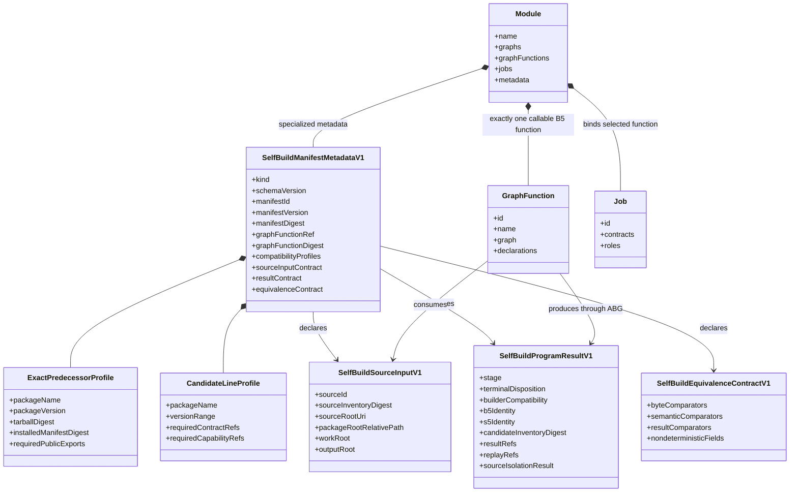
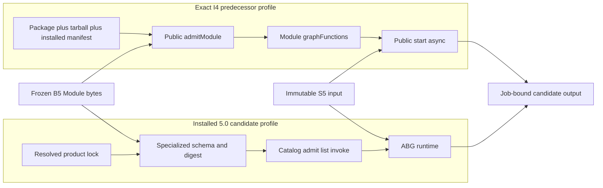

# M02/M04 Self-Build Program Structural Carrier Diagram

**Derived from**: `M02_M04_SELF_BUILD_PROGRAM_DERIVATION.md`

## Cross-Line Flow

## Authority Notes

- Both flows consume the same B5 bytes and GraphFunction identity.
- I4 Module listing is not a 5.0 catalog projection.
- The 5.0 catalog does not create GraphFunction or runtime authority.
- Only ABG runtime produces events, result, continuation, and closure truth.
- S5 supplies source input only. It supplies no builder runtime or controller.
- Output existence without converged result/replay truth is not stage closure.
