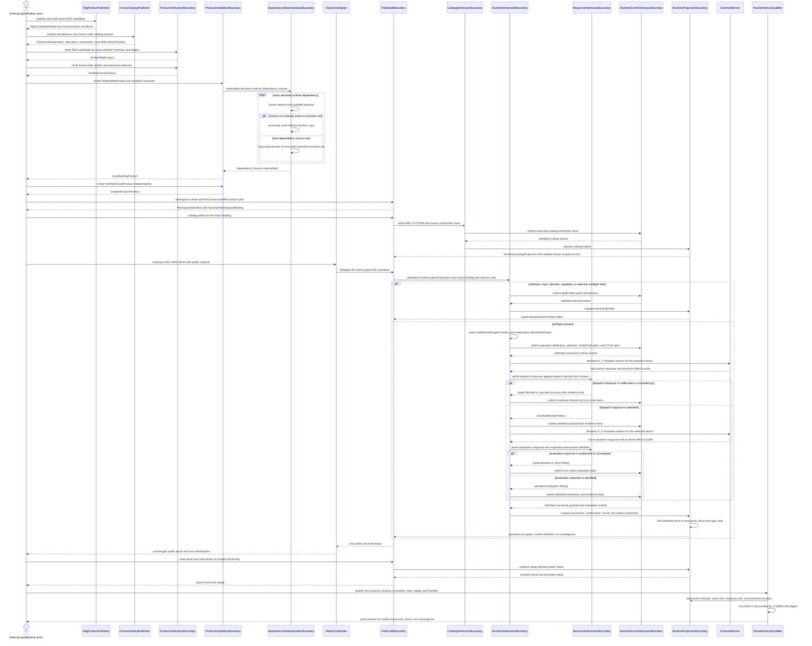
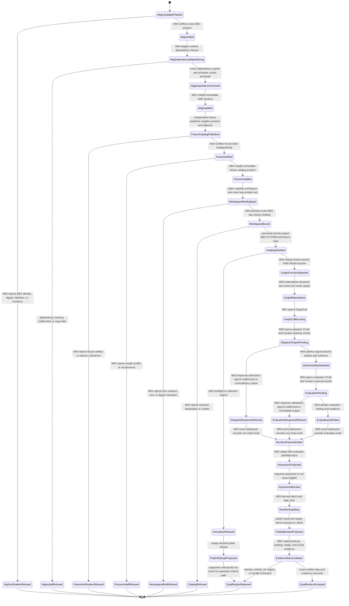

# M02-M05 Packed Installed Vertical Behavior Design

**Status**: Retrospective three-view design blocked
**Date**: 2026-07-12
**Checkpoints**: `779eb07` and `28da030` (`T-223` packed candidate and installed vertical)
**Method authority**: `specification_methodology/specification/standards/DESIGN_MODULE_METHOD.md` section 5E
**Tenant authority**: [TYPESCRIPT_REALIZATION_GUARDRAILS.md](./TYPESCRIPT_REALIZATION_GUARDRAILS.md)

## Boundary

- **Design verdict**: `blocked` for acceptance of the complete live vertical.
  Two-product packaging, installation, binding, and the observed evidence
  reconciliation remain candidate subclaims for independent review.
- **Owning modules**: M02 publication owns Module and GraphFunction publication;
  M04 owns product verification, installation, workspace binding, public SDK,
  and the thin CLI; M03 owns catalog admission, GraphFunction materialization,
  GraphCall and C-call interpretation, response admission, canonical events,
  assurance, continuation, result, and replay; M05 owns downstream
  qualification only.
- **Requirements**: `PRODUCT.md` Installed And Catalog Product and Public
  Operator Product; `REQ-P-INSTALL`; `REQ-P-CATALOG`;
  `REQ-P-PUBLIC-CONTRACTS`; `REQ-L-GTL3-MODULE`;
  `REQ-L-GTL3-GRAPHFUNCTION`; `REQ-R-ABG3-EVENTS`;
  `REQ-R-ABG3-PROJECTION`; `REQ-R-ABG3-ASSURANCE`;
  `REQ-R-ABG3-INSTRUCTION-ASSEMBLY-014`.
- **Ticket or intake**: completed `T-223`, installed vertical and phase closure.
- **Code scope**: exact ABG candidate publisher, the independently published
  `fixture.hello` catalog product, generic product verification and installation,
  TypeScript package installation, public SDK/CLI workspace binding and
  invocation, M03 runtime and response-admission paths, live F_P evidence
  bundles, public result/replay, and the T-223 installed qualification tests.
- **Dependencies**: the DS-1 product/catalog foundation and public SDK/CLI
  boundaries; exact product and public-contract manifests; the ABG SYSTEM
  catalog contribution; the fixture-owned Hello World Module and GraphFunction;
  standard F_P effect contracts; canonical M03 event, assurance, continuation,
  result, and replay projections; the blocked F_P output-admission and
  instruction-protocol designs.
- **Explicit exclusions**: release-version assignment; hosted registry
  publication; hostile-local tamper defense; node/overlay application;
  statistical or multi-worker qualification; conversion of the observed
  `assurance_block` into convergence; complete 5.0 conformance; and any claim
  that this vertical proves a C-program conformance identity joined to the
  runtime `ExecutionBasis`.

The vertical proves two-product installed consumption, not one product
containing its consumer fixture. The ABG candidate and the independently
versioned `fixture.hello` catalog product are verified and installed separately,
then bound by exact identity to one workspace. The fixture contributes the
Hello World Module and GraphFunction. ABG admits that contribution and remains
the sole runtime authority.

The expected live result is deliberately non-terminal work truth:
`runtime_continuation_transition:block:assurance_block`. The M05 proof may pass
because that stop is truthful and fully reconciled. The GraphCall does not
converge.

## Domain Model

```mermaid
classDiagram
  direction LR

  class AbgProductPublisher {
    <<M02 publication boundary>>
    +publish exact ABG candidate
  }
  class FixtureCatalogPublisher {
    <<M02 proof publication boundary>>
    +publish fixture catalog product
  }
  class ProductVerificationBoundary {
    <<M04 admission boundary>>
    +verify exact product artifact
  }
  class ProductInstallationBoundary {
    <<M04 effect boundary>>
    +install verified immutable product
  }
  class DependencyMaterializationBoundary {
    <<M04 package install boundary>>
    +locate runtime dependency
    +copy real payload recursively
    +terminate ancestor cycle
  }
  class RuntimeDependencyPayload {
    <<subordinate package payload>>
    +packageName
    +sourceRoot
    +targetRoot
  }
  class AncestorSourceRootSet {
    <<invocation-local recursion guard>>
    +visited source roots
  }
  class PublicSdkBoundary {
    <<M04 public boundary>>
    +create workspace
    +bind exact products
    +invoke GraphFunction
    +read result and replay
  }
  class NativeCliAdapter {
    <<M04 thin adapter>>
    +delegate one SDK operation
  }
  class CatalogAdmissionBoundary {
    <<M03 semantic boundary>>
    +admit bound product contributions
  }
  class RuntimeInterpreterBoundary {
    <<M03 semantic authority>>
    +select GraphFunction
    +materialize declared Graph
    +open GraphCall and CCalls
  }
  class ResponseAdmissionBoundary {
    <<M03 ingress boundary>>
    +admit worker artifact and findings
  }
  class RuntimeEventAdmissionBoundary {
    <<M03 truth-write boundary>>
    +emit canonical events
  }
  class RuntimeProjectionBoundary {
    <<M03 replay boundary>>
    +project catalog assurance continuation result replay
  }
  class PackedVerticalQualifier {
    <<M05 downstream proof boundary>>
    +reconcile exact products runtime and evidence
  }

  class AbgCandidateArtifact {
    <<prime immutable ABG product>>
    +productId: abiogenesis
    +version
    +artifactDigest
    +productContentDigest
  }
  class AbgSystemModule {
    <<GTL Module owned by ABG product>>
    +moduleId
    +identity GraphFunctions
  }
  class VerifiedAbgProduct {
    <<prime M04 verification truth>>
    +productId
    +artifactDigest
    +verificationChecks
  }
  class InstalledAbgProduct {
    <<prime M04 install truth>>
    +productRoot
    +manifestDigest
  }

  class FixtureCatalogArtifact {
    <<prime immutable catalog product>>
    +productId: fixture.hello
    +version: 0.1.0
    +artifactDigest
  }
  class FixtureProductDescriptor {
    <<publisher sidecar>>
    +descriptorId
    +productId
    +artifactDigest
  }
  class FixtureContributionManifest {
    <<publisher sidecar>>
    +contributionId
    +contributionDigest
    +rows
  }
  class VerifiedFixtureProduct {
    <<prime M04 verification truth>>
    +productId
    +artifactDigest
    +verificationChecks
  }
  class InstalledFixtureProduct {
    <<prime M04 install truth>>
    +productRoot
    +manifestDigest
  }

  class HelloWorldModule {
    <<GTL Module owned by fixture.hello>>
    +moduleId
    +graphFunctions
  }
  class HelloWorldGraphFunction {
    <<GTL callable declaration>>
    +handle
    +interfaceRef
    +inlineGraphTemplate
  }
  class HelloWorldGraph {
    <<GTL Graph>>
    +graphId
  }
  class HelloInputNode {
    <<GTL Node>>
    +nodeId
    +inputContractRef
  }
  class HelloOutputNode {
    <<GTL Node>>
    +nodeId
    +outputContractRef
  }
  class HelloWorldGraphVector {
    <<GTL GraphVector>>
    +vectorId
    +sourceRef
    +targetRef
  }
  class HelloWorldCompositionDeclaration {
    <<GTL declared composition data>>
    +compositionRef
    +regimeBindings
    +closureContractRef
  }
  class HelloWorldEffectPolicyBinding {
    <<GTL declared policy and effect data>>
    +pluginSelection
    +capabilityRefs
    +policyRefs
    +assuranceRefs
  }

  class WorkspaceManifest {
    <<prime M04 workspace truth>>
    +workspaceId
  }
  class ToolchainWorkspaceBinding {
    <<prime M04 binding truth>>
    +bindingId
    +resolvedLockId
    +exactProductSetDigest
  }
  class RuntimeCatalogProjection {
    <<M03 replay-derived catalog>>
    +catalogId
    +admittedEntries
  }
  class HostInvocationDescriptor {
    <<subordinate public ingress data>>
    +workspaceBindingRef
    +sessionViewRef
    +graphFunctionHandle
    +inputContractRef
    +capabilityRefs
  }
  class MaterializedGraphSelection {
    <<M03 runtime selection truth>>
    +graphFunctionRef
    +graphRef
    +vectorRef
  }
  class GraphCall {
    <<prime M03 runtime carrier>>
    +graphCallId
    +selectedGraphFunctionRef
  }
  class CCall {
    <<M03 effect spine>>
    +cCallRef
    +stageRole
    +regime: F_P
  }
  class ExternalWorker {
    <<external effect>>
    +no runtime authority
  }
  class AdmittedWorkerArtifact {
    <<M03 admitted F_P artifact>>
    +payloadRef
    +responseContractRef
    +producerRef
    +evidenceRefs
  }
  class FpCallEvidenceBundle {
    <<effect evidence>>
    +requestDigest
    +cCallRef
    +promptManifest
    +output
    +traceResult
    +completion
  }
  class CanonicalRuntimeEventLog {
    <<prime M03 truth>>
    +eventAdmissionOrdinal
    +events
  }
  class AssuranceProjection {
    <<M03 replay projection>>
    +decision: block
    +reason: assurance_block
  }
  class ContinuationTransition {
    <<M03 replay projection>>
    +action: block
    +terminalKind: gap_stop
  }
  class PublicResultProjection {
    <<downstream read model>>
    +operationAccepted
    +runtimeDisposition: blocked
    +terminalReason
  }
  class PublicReplayProjection {
    <<downstream read model>>
    +subject: graph_call
    +events
    +evidenceRefs
  }

  AbgProductPublisher --> AbgCandidateArtifact : publishes
  AbgCandidateArtifact "1" *-- "1" AbgSystemModule : contains
  ProductVerificationBoundary --> AbgCandidateArtifact : verifies
  ProductVerificationBoundary --> VerifiedAbgProduct : produces
  ProductInstallationBoundary --> VerifiedAbgProduct : consumes
  ProductInstallationBoundary --> DependencyMaterializationBoundary : closes runtime dependency tree
  DependencyMaterializationBoundary --> RuntimeDependencyPayload : copies exact payload
  DependencyMaterializationBoundary --> AncestorSourceRootSet : carries recursive termination
  ProductInstallationBoundary --> InstalledAbgProduct : materializes

  FixtureCatalogPublisher --> FixtureCatalogArtifact : publishes
  FixtureCatalogPublisher --> FixtureProductDescriptor : publishes
  FixtureCatalogPublisher --> FixtureContributionManifest : publishes
  FixtureProductDescriptor --> FixtureCatalogArtifact : digest binds
  FixtureContributionManifest --> FixtureCatalogArtifact : describes contribution
  FixtureCatalogArtifact "1" *-- "1" HelloWorldModule : contains
  HelloWorldModule "1" *-- "1" HelloWorldGraphFunction : publishes callable
  HelloWorldGraphFunction "1" *-- "1" HelloWorldGraph : materializes
  HelloWorldGraph "1" *-- "1" HelloInputNode : input
  HelloWorldGraph "1" *-- "1" HelloOutputNode : output
  HelloWorldGraph "1" *-- "1" HelloWorldGraphVector : transition
  HelloWorldGraphVector --> HelloInputNode : source
  HelloWorldGraphVector --> HelloOutputNode : target
  HelloWorldGraphFunction "1" *-- "1" HelloWorldCompositionDeclaration : declares
  HelloWorldGraphFunction "1" *-- "1" HelloWorldEffectPolicyBinding : declares
  ProductVerificationBoundary --> FixtureCatalogArtifact : verifies
  ProductVerificationBoundary --> VerifiedFixtureProduct : produces
  ProductInstallationBoundary --> VerifiedFixtureProduct : consumes
  ProductInstallationBoundary --> InstalledFixtureProduct : materializes

  PublicSdkBoundary --> WorkspaceManifest : creates or opens
  ToolchainWorkspaceBinding "1" o-- "1" InstalledAbgProduct : binds exact ABG
  ToolchainWorkspaceBinding "1" o-- "1" InstalledFixtureProduct : binds exact catalog product
  PublicSdkBoundary --> ToolchainWorkspaceBinding : writes exact binding
  NativeCliAdapter --> PublicSdkBoundary : delegates unchanged
  CatalogAdmissionBoundary --> ToolchainWorkspaceBinding : admits bound set
  CatalogAdmissionBoundary --> FixtureContributionManifest : admits rows
  CatalogAdmissionBoundary --> RuntimeEventAdmissionBoundary : submits catalog events
  RuntimeEventAdmissionBoundary --> CanonicalRuntimeEventLog : appends only
  RuntimeProjectionBoundary --> CanonicalRuntimeEventLog : replays
  RuntimeProjectionBoundary --> RuntimeCatalogProjection : derives catalog

  PublicSdkBoundary --> HostInvocationDescriptor : derives
  HostInvocationDescriptor --> ToolchainWorkspaceBinding : cites
  HostInvocationDescriptor --> HelloWorldGraphFunction : requests
  RuntimeInterpreterBoundary --> RuntimeCatalogProjection : selects from
  RuntimeInterpreterBoundary --> HelloWorldGraphFunction : materializes
  RuntimeInterpreterBoundary --> MaterializedGraphSelection : records selection
  MaterializedGraphSelection --> HelloWorldGraph : binds
  MaterializedGraphSelection --> HelloWorldGraphVector : binds
  RuntimeInterpreterBoundary --> GraphCall : opens
  GraphCall "1" *-- "1..*" CCall : owns spines
  RuntimeInterpreterBoundary --> CCall : selects active spine
  RuntimeInterpreterBoundary --> ExternalWorker : invokes declared CCall interior
  ExternalWorker --> RuntimeInterpreterBoundary : returns raw output
  RuntimeInterpreterBoundary --> ResponseAdmissionBoundary : submits raw output
  ResponseAdmissionBoundary --> AdmittedWorkerArtifact : admits or refuses
  CCall "1" --> "1" FpCallEvidenceBundle : identity joins effect evidence
  RuntimeInterpreterBoundary --> RuntimeEventAdmissionBoundary : submits runtime facts
  ResponseAdmissionBoundary --> RuntimeEventAdmissionBoundary : submits admitted payload facts
  RuntimeProjectionBoundary --> AssuranceProjection : folds admitted truth
  RuntimeProjectionBoundary --> ContinuationTransition : derives next action
  RuntimeProjectionBoundary --> PublicResultProjection : projects result
  RuntimeProjectionBoundary --> PublicReplayProjection : projects replay
  PackedVerticalQualifier --> AbgCandidateArtifact : verifies candidate identity
  PackedVerticalQualifier --> InstalledAbgProduct : verifies install
  PackedVerticalQualifier --> InstalledFixtureProduct : verifies catalog install
  PackedVerticalQualifier --> PublicResultProjection : observes truthful stop
  PackedVerticalQualifier --> PublicReplayProjection : reconciles replay
  PackedVerticalQualifier --> FpCallEvidenceBundle : reconciles external work
```

The ABG candidate and fixture catalog product are separate immutable products,
separately verified and installed. The workspace binding names both exact
installed identities. The fixture Module owns the callable GraphFunction; the
GraphFunction materializes an explicit two-node, one-vector Graph and carries
its composition and policy/effect declarations. Catalog presence grants no
runtime authority. M03 alone selects and interprets the admitted function.

The diagram does not claim that the Hello World function carries or passed a
T-220 C-program conformance identity. It records the as-built scalar runtime
path. Any later claim that the same function is governed by the seven-term C
algebra requires the separate C-compilation-to-`ExecutionBasis` join identified
by the compiled-handoff design.

## Execution Sequence

Only boundary objects perform transforms or effects. Artifacts, install records,
bindings, GraphCalls, event logs, and projections remain data or truth carriers.
The CLI delegates once to the SDK. The catalog product never invokes a worker or
emits an event. M03 admits every output and owns every event, assurance fold,
continuation, and runtime disposition.

The two worker effects are distinct declared C-call interiors in the current
scalar runtime path. This statement does not classify the path as a realized
`C.batch`, `C.retry`, or `workflow.C` program and does not certify a T-220
C-program compilation join.

## Lifecycle State Machine

`QualificationAccepted` means the declared packed installed scenario proved its
expected behavior. It does not transition `RuntimeGapStop` to convergence. A
future close-eligible run must enter through a new invocation or lawful
continuation and produce a fresh M03 assurance projection.

## Cross-View Invariants

| Check | Evidence | Verdict |
|---|---|---|
| Every sequence participant exists in the domain model or is external | Both publishers, verifier, installer, CLI, SDK, catalog admission, runtime, response admission, event admission, projection, worker, and qualifier are explicit domain boundaries; Builder is external. | pass |
| Every lifecycle carrier exists in the domain model | Separate ABG and fixture product artifacts, verifications, installs, workspace binding, catalog, GraphFunction/Graph/GraphVector, GraphCall/CCall, artifact, event, assurance, continuation, public projection, and qualification carriers are modeled. | pass |
| Every message names a typed transform, graph/C interpreter act, admission, or effect boundary | Publication, verification, install, bind, catalog admission, graph materialization, C-call effect, response admission, event admission, replay projection, and qualification are explicit. | pass |
| Every transition names an admission, interpreter, event, projection, or external owner | M02, M04, M03, M05, and the external worker own only their declared transitions. Records and projections do not perform effects. | pass |
| ABG and fixture.hello remain distinct products | They have separate artifacts, descriptors/manifests, verification states, installed records, and one exact workspace binding. | pass |
| Source-blind ABG installation includes a finite runtime dependency closure | Dependency materialization copies real payloads recursively and an invocation-local ancestor-root set terminates cycles. | pass |
| The callable GraphFunction decomposes into lawful GTL structure | The fixture Module owns HelloWorldGraphFunction, which materializes HelloWorldGraph with input/output Nodes, one GraphVector, and declared composition and policy/effect bindings. | pass |
| Raw F_P output cannot transition directly to accepted or closed | The observed responses passed the intended admission/event path, but the general F_P boundary is blocked pending G1-G5. | fail |
| Plugins, transports, and catalog products own interiors only | The worker returns raw output and evidence; M03 owns selection, events, assurance, continuation, and runtime disposition. | pass |
| Event admission and replay projection remain distinct | Runtime and catalog boundaries submit facts to one event-admission boundary; projection only reads the canonical log. | pass |
| Batch, retry, recursion, and nested workflow use declared algebra | The vertical claims none of those constructors. Malformed-output retry truth is an ordinary M03 judgment/continuation concern, not a claim that `C.retry` is realized. | not_applicable |
| Runtime failure and qualification failure are not conflated | Runtime truth remains `assurance_block`; M05 may accept exact evidence for that expected stop without changing runtime status. | pass |
| C syntax availability is not runtime certification | The views do not carry a C-program compilation identity into `ExecutionBasis` and make no seven-term runtime claim. | pass |

## Axiom Evaluation

| Axiom | Authority | Domain evidence | Sequence evidence | State evidence | Native enforcement | Admission/compiler enforcement | Verdict | Gap owner |
|---|---|---|---|---|---|---|---|---|
| Release product, catalog product, installs, workspace binding, and runtime are distinct identities | root `AGENTS.md` recursive product taxonomy; `PRODUCT.md` catalog-product law; `REQ-P-CATALOG-004`; `REQ-P-INSTALL` | separate ABG and fixture product, verification, install, binding, and runtime carriers | both products verify/install independently before one exact binding | separate product states precede binding, admission, and runtime | distinct readonly carrier families | exact identity, digest, lock, binding, and catalog admission | pass | none |
| Installed consumption is source-blind and package-first | `PRODUCT.md` Installed And Catalog Product; `REQ-P-PUBLIC-CONTRACTS-001..004` | immutable artifacts, dependency payloads, recursion guard, and installed records are distinct | isolated install copies the real recursive dependency closure before public invocation | `AbgDependenciesClosed` precedes `AbgInstalled`; both products precede runtime | package identities and ancestor-root set bound recursion | package census, payload copy, cycle termination, digest verification, and source/private-import negatives | pass | none |
| Catalog products contribute declarations but receive no runtime authority | `PRODUCT.md` lines 62-73; `REQ-P-CATALOG-003..008` | fixture descriptor/contribution/Module are publisher truth; M03 owns runtime carriers | fixture publication stops at catalog admission; M03 selects and invokes | only M03 selection opens GraphCall | contribution carriers expose no event or closure methods | catalog admission and GraphFunction-only callability | pass | none |
| The constructive carrier is a published Module-backed GraphFunction with a materialized Graph | ODD method; `REQ-L-GTL3-MODULE`; `REQ-L-GTL3-GRAPHFUNCTION` | Module, GraphFunction, Graph, Nodes, GraphVector, composition, and effect/policy declarations are explicit | M03 selects the function and materializes its declared graph before GraphCall | selection precedes graph materialization and GraphCall | native Module/GraphFunction/Graph/Node/GraphVector types | serialization, Module lookup, catalog admission, and runtime selection | pass | none |
| M03 owns GraphCall, C-call, worker attribution, event, continuation, and closure truth | `M03-engine-kernel`; `PRODUCT.md` public operator law | all runtime primes and admission/projection boundaries are M03-owned | M04 delegates once; M03 owns materialization, effects, admission, and folds | every runtime transition after invocation is M03-owned | closed runtime, event, and transition unions | basis, session, selection, payload, evidence, assurance, and event admission | pass | none |
| Raw F_P output is likely malformed and must fail closed | `REQ-L-GTL3-C-ALGEBRA-018`; `REQ-R-ABG3-INSTRUCTION-ASSEMBLY-014` | raw output is external; admitted artifact is distinct | the observed happy-path responses crossed admission | the intended refusal path reaches non-close truth | plugin and payload result families exist | the separate F_P review found open contract/status relations and no full raw-to-close differential | fail | `M03_FP_OUTPUT_ADMISSION_BEHAVIOR_DESIGN.md` G1-G5 |
| Worker/process success cannot become closure truth | `REQ-R-ABG3-ASSURANCE-017..020`, `-030`, and `-034` | worker, admitted artifact, event log, assurance, and continuation are distinct | successful effects are followed by response/event admission and assurance projection | admitted evaluation still reaches AssuranceBlocked | assurance decisions are distinct from effect status | replay-derived assurance fold | pass | none |
| Missing assurance closes nothing | `REQ-R-ABG3-ASSURANCE-005`, `-018`, and `-029` | explicit AssuranceProjection and ContinuationTransition carry block truth | ordinary fold projects `assurance_block` and `gap_stop` | no state edge from AssuranceBlocked to convergence | closed assurance and continuation carriers | assurance rows and transition precedence admission | pass | later assurance-contract realization |
| Event write authority and replay projection are not collapsed | `REQ-R-ABG3-EVENTS`; `REQ-R-ABG3-PROJECTION` | separate event-admission, event-log, and projection boundaries | facts enter event admission; projection reads the resulting log | RuntimeFactsAdmitted precedes AssuranceProjected | canonical event and projection types are distinct | ordinal ingest and event-kind admission | pass | none |
| Event and replay truth reconcile with external-work evidence | C-call external-work law; `REQ-R-ABG3-EVENTS`; `REQ-R-ABG3-PROJECTION` | CCall, bundle, event, result, replay, and M05 proof carriers are separate and ref-joined | qualifier reads projections and reconciles bundles after runtime stop | mismatch rejects qualification without rewriting runtime | branded identity/digest fields | event admission and M05 exact reconciliation | pass | none |
| SDK and CLI consume one runtime meaning | `PRODUCT.md` Public Operator Product | CLI is a thin boundary over SDK inputs/results | CLI delegates one operation and renders the SDK result | no CLI-owned runtime state exists | shared SDK operation types and exhaustive CLI mapping | operation admission and equivalence proof | pass | independent SDK/CLI design review |
| M05 proof remains downstream and cannot alter runtime closure | Design Module law; M05 qualification law | qualifier references upstream truth only | qualifier runs after result/replay projection | QualificationAccepted does not leave RuntimeGapStop | separate qualification carrier family | qualification admits observations only | pass | none |
| This vertical does not claim runtime realization of `workflow.C`, `C.batch`, or `C.retry` | `REQ-L-GTL3-C-ALGEBRA`; compiled-handoff design | no such runtime carrier is modeled | no child traversal, batch fan-out, or declared C retry executes | no state depends on those constructors | syntax existence is not used as runtime proof | no C-program compilation identity is joined to the basis in this vertical | not_applicable | later accepted C-runtime designs |
| Product-visible prompt protocol is declared by GTL rather than authored in M03 | `REQ-R-ABG3-HANDLERS-015`; instruction-protocol design | prompt manifest and declared graph exist, but protocol-source declaration is absent | current startup factory synthesizes transform/review protocol text before manifest rendering | runtime can reach dispatch from code-owned protocol synthesis | native types do not bind text to an instruction declaration | compiler validates asserted plan shape without proving declaration lineage | fail | `M03_INSTRUCTION_PROTOCOL_BEHAVIOR_DESIGN.md` |
| Trusted desktop scope requires proportional identity defense, not tamper-proofing | `PRODUCT.md` Native And Release Boundary; `REQ-P-PUBLIC-CONTRACTS-014` | exact digests and safe local paths, no signing or adversarial-host carrier | verification rejects likely malformed/coherence failures | mismatches refuse locally; no hostile actor lifecycle | digest/path/manifest types | exact artifact and package census verification | pass | none |

## Gap And Exclusion Register

| Gap or exclusion | Why outside or blocking | Owner | Re-entry condition |
|---|---|---|---|
| Runtime convergence | the observed live run lawfully stops at `assurance_block`; relabeling it would falsify closure truth | later runtime/assurance slice | an admitted assurance contract and complete required evidence produce a fresh close-eligible projection |
| C-program conformance joined to `ExecutionBasis` | this vertical proves the existing scalar GraphFunction path, not that the selected graph carries a T-220 C-program compilation identity into runtime | M01/M03 mapping design | accepted design joins one admitted C compilation identity to the authoritative basis without a second program authority |
| Instruction-protocol placement | the vertical consumes the current standard instruction manifest but this asset does not establish that protocol text is fully declaration-owned under `HANDLERS-015` | separate instruction-boundary design | independent three-view review proves declared instruction ownership and standard engine rendering |
| Complete 5.0 public contract and capability catalogs | T-223 proves the DS-1 subset, not final conformance | later 5.0 phases | all admitted 5.0 rows exist and exact conformance passes |
| Node-type and overlay application | catalog presence is list/describe only in DS-1 | demand-driven successor | application semantics and program binding are designed and admitted |
| Statistical, heterogeneous-worker, or portfolio qualification | one Hello World and one configured live worker prove route viability only | M05 successor qualification | a requirement/scenario defines sample size, worker diversity, and acceptance law |
| Registry publication and stable version assignment | the ABG package was a local candidate and the fixture remains proof-only | release phase | immutable release identity, manifests, checksums, tags, and release qualification agree |
| Hostile-local tamper resistance | explicitly disproportionate for one trusted developer desktop | none for 5.0 | product threat model is repriced by F_H |

## Design Verdict

`blocked` for acceptance of the complete packed live vertical delivered by
`779eb07` and `28da030`. The bounded candidate subclaims are:

1. an exact ABG candidate and an independent `fixture.hello` catalog product
   verify and install as distinct products;
2. one workspace binds both exact installed identities and M03 admits their
   contributions;
3. the fixture-owned Hello World GraphFunction materializes its declared
   two-node, one-vector Graph and enters the ordinary M03 runtime path;
4. the observed worker outputs crossed the current M03 response and event path;
   this observation is not a general malformed-output guarantee; and
5. public result, replay, and external-work evidence reconcile to a truthful
   non-terminal `assurance_block`.

The complete design cannot be accepted while F_P response admission and
instruction-protocol placement have failed axioms. It also does not prove
convergence, complete 5.0 conformance, release readiness, or a C-program
conformance join. Independent axiom review and F_H disposition remain
required, and the reviewed code stays frozen.
