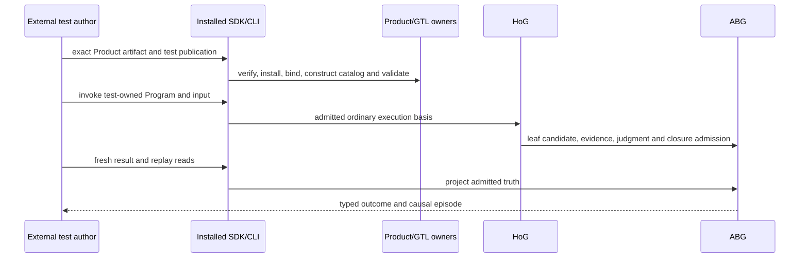

# M02-M05 Installed Program Mechanics Proof

## Current Boundary

Owner correction, 2026-10-06: the former Hello-as-Product design is withdrawn.
Hello World is a minimal language test program. ABIogenesis ships no Hello
Product, module, special contract, implementation, admission or proof branch.
The current F14/S01 proof runs an independently authored test program outside
the ABG package through the ordinary installed Public and GTL extension path.
The test program supplies its own declarations, ordinary leaf binding and oracle.
No replacement built-in application or special test execution path is introduced.

The owning requirements are `REQ-P-INSTALL`, `REQ-P-CATALOG`,
`REQ-P-PUBLIC-CONTRACTS`, `REQ-P-SCENARIOS-005/008`, `REQ-P-QUAL-058`,
`REQ-L-GTL3-MODULE`, `REQ-L-GTL3-GRAPHFUNCTION` and the existing ABG
admission/event/replay requirements. Current Product owns all release allocation.

## Domain And Sequence

| Carrier or operation | Owner |
|---|---|
| Exact package, verified artifact, install and workspace binding | Existing Product publication, verification and install owners |
| External test Program, GraphFunction, contracts, leaf binding and oracle | Test/consumer author through ordinary GTL publication |
| Catalog readiness and non-lowering validation | Existing Product and GTL validator owners |
| Native SDK/CLI request and response | Thin Public transport/projection |
| Selected graph and C-call traversal | HoG |
| Result, evidence, judgment, runtime disposition and closure | ABG admission |
| Current result and episode readback | Event Calculus/replay and Public projections |

```mermaid
sequenceDiagram
  participant Author as External test author
  participant Public as Installed SDK/CLI
  participant Product as Product/GTL owners
  participant HoG as HoG
  participant ABG as ABG
  Author->>Public: exact Product artifact and test publication
  Public->>Product: verify, install, bind, construct catalog and validate
  Author->>Public: invoke test-owned Program and input
  Public->>HoG: admitted ordinary execution basis
  HoG->>ABG: leaf candidate, evidence, judgment and closure admission
  Author->>Public: fresh result and replay reads
  Public->>ABG: project admitted truth
  ABG-->>Author: typed outcome and causal episode
```

## Exit Evidence

A clean source-blind installation executes the external minimal deterministic
program with its test-owned typed outcome. A live F_P claim has actual attributed
provider evidence; deterministic doubles prove only mechanics. Both enter the
same declared GTL, HoG and ABG route. SDK and CLI outcomes agree. Two fresh reads
retain the same producer, contracts, execution basis, terminal result and closed
state. Malformed declaration, input, binding, capability and output cases refuse
at their generic owning boundaries. Test scaffolding authors no admitted result,
event, execution basis, continuation or closure.

Verify that source, build, manifest and packed payload contain no test-program
semantics or imports. A green test through a built-in solution cannot satisfy
this boundary. No full-candidate, release or stochastic-reliability claim follows
from this bounded mechanics proof.

The actual earlier `779eb07`/`28da030` T-223 records remain historical evidence,
including their truthful nonterminal `assurance_block` and incomplete admission/
instruction claims. They do not authorize a Hello Product or qualify the
removed-code successor. The superseded design remains available in repository
history; its false Product characterization is not retained as live authority.
