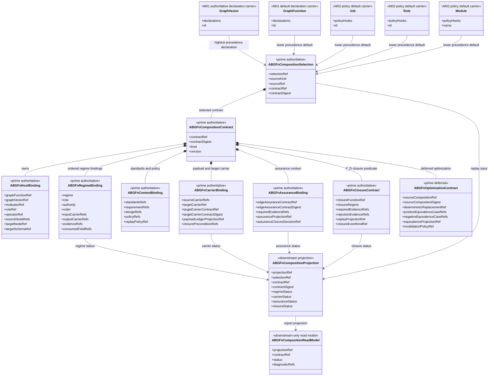

# M03 ABG.Fn Composition Structural Carrier Diagram

**Status**: Active
**Date**: 2026-05-16
**Derived from**: [M03_ABG_FN_COMPOSITION_DERIVATION.md](./M03_ABG_FN_COMPOSITION_DERIVATION.md), [M03_ABG_FN_COMPOSITION_FIRST_SLICE_IACS.md](./M03_ABG_FN_COMPOSITION_FIRST_SLICE_IACS.md)

## Purpose

Show the design-method carrier boundary for ABG.Fn composition: host-bound
composition contracts, selected regime authority, context identity,
carrier/assurance binding, deterministic closure, deferred optimization, and
downstream replay projection.

## Structural Carrier Diagram

## Functional Reading

- Declaration carriers are immutable GTL inputs to composition selection.
- `ABGFnCompositionSelection` is replay-visible precedence truth.
- `ABGFnCompositionContract` is the identity-bearing carrier. Removing it must
  make closure fail closed rather than silently reconstructing regime law.
- Host, regime, context, carrier, assurance, and closure bindings are owned
  subordinate composition of the prime contract, but they remain prime carrier
  families because dependent tickets consume them independently.
- `ABGFnOptimizationContract` is deferred but remains a prime boundary for
  lawful F_P-to-F_D replacement.
- `ABGFnCompositionProjection` is a read-side projection over admitted contract,
  event, carrier, assurance, and closure truth. It is not worker output.
- `ABGFnCompositionReadModel` is report/query shape only.

## Sign-Off Claim

This design is lawful only if implementation preserves the selected
composition identity through parser admission, host binding, payload ledger
projection, assurance projection, runner routing, and closure. F_P and F_H
outputs may supply evidence, but only an F_D closure predicate under the
selected composition identity may close.
