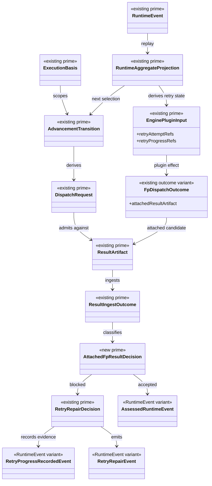

# M03 Attached F_P Worker Loop Structural Carrier Diagram

**Status**: Active
**Date**: 2026-04-27
**Derived from**: [M03_ATTACHED_FP_WORKER_LOOP_DERIVATION.md](./M03_ATTACHED_FP_WORKER_LOOP_DERIVATION.md), [M03_ATTACHED_FP_WORKER_LOOP_FIRST_SLICE_IACS.md](./M03_ATTACHED_FP_WORKER_LOOP_FIRST_SLICE_IACS.md), [T-084](../../../../.ai-workspace/tickets/backlog/T-084-realize-abg-owned-fp-result-ingest-retry-and-continue-loop-for-attached-workers.md)

## Purpose

Render the attached F_P worker loop as one M03 carrier topology.

## Diagram

## Reading Rules

- `AttachedFpResultDecision` is the only new prime carrier.
- It is runner-local engine law, not a plugin callback surface.
- `FpDispatchOutcome.attachedResultArtifact` is only a candidate payload.
- Retry and assessed facts remain members of `RuntimeEvent`.
- Re-entry is replay-derived through `RuntimeAggregateProjection`; it is not a
  controller-local attempt loop.

