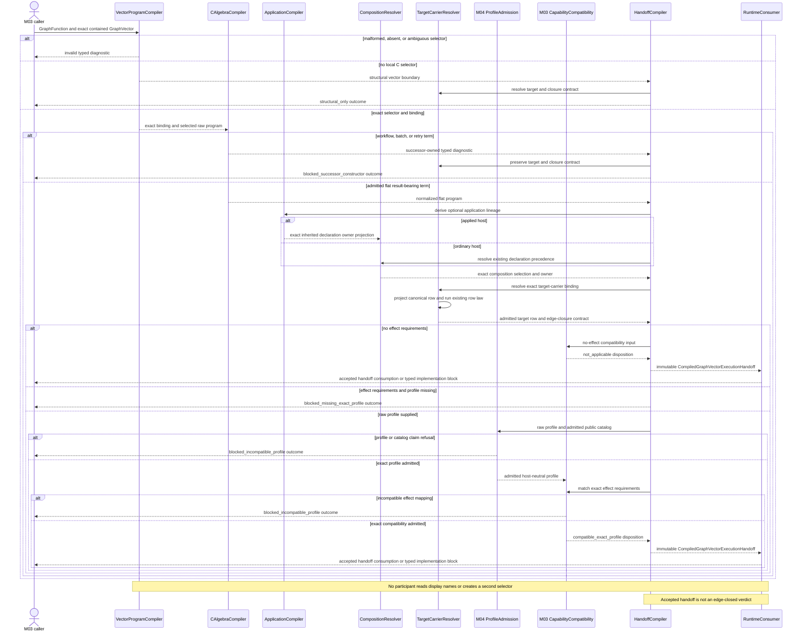
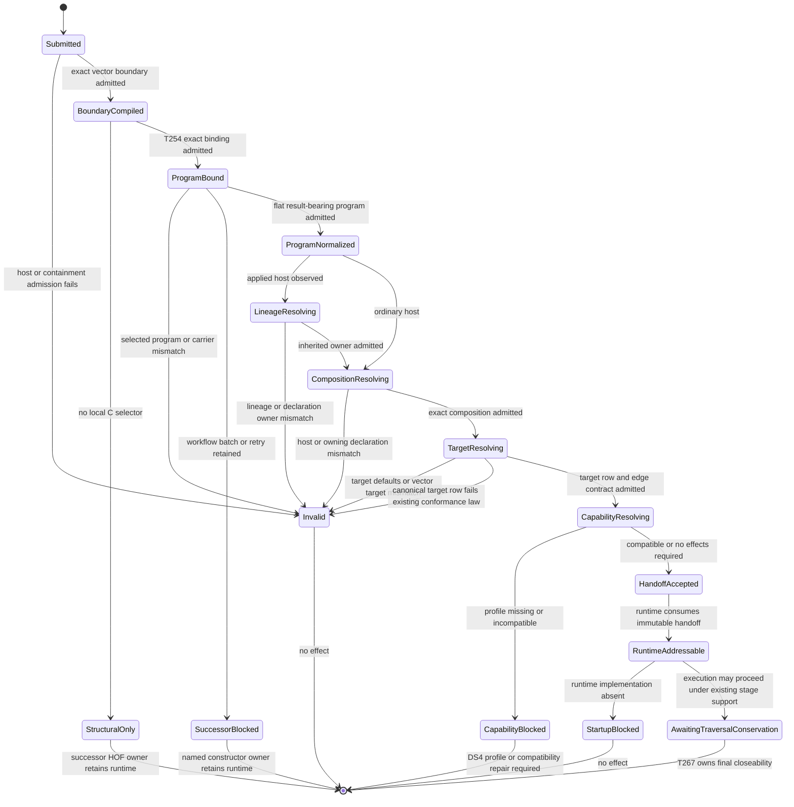

# M03 Compiled GraphVector Execution Handoff Behavior Design

**Design verdict**: `candidate_repaired_after_adversarial_review_pending_explicit_fh`
**Implementation admission**: `paused_pending_own_explicit_fh_acceptance`
**Ticket**: [T-255](../../../../.ai-workspace/tickets/active/T-255-close-compiled-graph-vector-execution-handoff.md)
**Owning modules**: M04 product-intake profile admission, shared admitted-profile
carrier, and M03 graph-vector compilation
**Change class**: `design_reframe`
**Delivery phase**: DS-2 execution spine

## Boundary

T-255 closes one generic relation:

```text
admitted GraphFunction + exact contained GraphVector
  + compiled T-254 vector/program binding
  + admitted flat result-bearing C program
  + effective ABG.Fn composition under existing precedence
  + optional T-265 application lineage
  + effective target-carrier binding and canonical conformance-row projection
  + exact admitted tenant capability profile when effects are required
    -> CompiledGraphVectorExecutionHandoff | typed blocked outcome
```

The handoff is the first runtime-addressable carrier that joins program shape,
composition authority, target-carrier identity, and edge-closure contract for
one exact GraphVector. It is derived data. It does not become another GTL
declaration, selector, composition owner, capability profile, or closure
verdict.

An effect-bearing handoff is not accepted merely because those structural joins
exist. It must also carry an admitted exact capability profile and a compatible
effect-to-capability judgment. Missing profile truth is a typed block.

The prior design was a retrospective of the GraphFunction-wide HoG plan. It
explicitly excluded GraphVector program selection, generalized flat C shape,
target/closure contracts, and application-lineage composition ownership. Those
are now T-255's boundary, so the retrospective design is superseded rather
than extended.

## Proportional Reprice

T-255 owns these five T-252 families:

```text
c_program_runtime_shape_generalization
graph_vector_program_runtime_selection
target_carrier_contract
edge_closure_contract
composition_owning_declaration_join
```

The original ticket also owned the broad `traversal_execution_contracts`
family. That family requires admitted plugin result-interface truth and bind
conservation inputs that are not present at this compiler boundary. The HOF
wrapper also intentionally has no local C selector. Creating those rows here
would fabricate assurance or reintroduce a selector.

T-267 therefore owns final traversal result-interface and bind-conservation
closure. T-255 produces the exact handoff T-267 will consume. This is a design
reframe, not a requirement reprice: target-carrier, composition, result
admission, and conservation requirements remain unchanged.

## Authority

- `REQ-L-GTL3-C-ALGEBRA-011/-014/-016` requires exact vector-local program
  selection, compiler-owned interpretation, and compile-before-effects.
- `REQ-L-GTL3-GRAPHVECTOR` preserves ordered source and exact target identity.
- `REQ-R-ABG3-FN-COMP-001..007` owns composition precedence, host matching,
  carrier context, assurance context, and deterministic closure contracts.
- `REQ-R-ABG3-INTERPRET-010/-013/-022/-023/-027` requires typed traversal
  units, `no_compute_basis` for absent compute, opaque identities, and exact
  target/closure rows.
- `REQ-M-GTL3-CAPABILITY` requires T-255 to admit a versioned exact tenant
  capability profile before accepting an effect-bearing handoff.
- T-254 owns `CompiledGraphVectorCProgramBinding`.
- T-265 owns application lineage and provisional inherited-composition
  projections.
- T-264 owns static declaration inventory and matchable effect requirements.
- T-268 owns DS-4 publication of the exact Consensus capability profile.

The earlier inference that direct continuation admitted implementation was
invalid. T-252, T-263, and T-264 received explicit F_H acceptance on 2026-07-13.
T-255 remains paused at its own design gate; that upstream ruling did not admit
this design or its uncommitted prototype. The proportionality rule still
applies: do not widen the base algebra or fabricate missing authority to
perfect a local seam.

## Current Evidence

The unchanged T-252 body contains 35 materialized GraphVectors and 34 exact
T-254 vector/program bindings.

| Current relation | Count | T-255 disposition |
|---|---:|---|
| exact vector/program bindings | 34 | consume without a second selector |
| flat C programs lowerable to normalized HoG | 28 | structurally eligible; capability admission still gates acceptance |
| `workflow.C` selected programs | 5 | retain typed T-259 gaps |
| `C.retry` selected programs | 1 | retain typed T-261 gap |
| structural HOF wrapper with no local selector | 1 | compile boundary/target truth only; T-260 owns runtime |
| direct composition selections | 19 | join directly |
| inherited applied-host composition selections | 15 | join through T-265 lineage |
| target-carrier bindings currently resolvable from defaults | 35 | current defaults do not satisfy the current target-row law and require bounded repair |
| effect-bearing materialized vectors | 35 | exact profile required before any flat handoff is accepted |

The compiler target is not `all 35 execute`. It is:

```text
28 flat vector handoffs become structurally compilable, then capability-blocked
5 workflow selections remain workflow gaps
1 retry selection remains a retry gap
1 selector-free structural HOF vector remains a HOF runtime gap
0 Consensus handoffs are accepted before DS-4 publishes the exact profile
```

## Adversarial Design Review

The pre-acceptance prototype exposed two load-bearing contradictions:

1. It copied the resolved generic target binding into a conformance row, but the
   installed defaults predate the current row law. The resulting rows use the
   wrong output-surface and authority-ref families and omit mandatory protocol
   fields and exact literal domains. The real conformance gate rejects them.
2. It returned `accepted` for effect-bearing handoffs while recording
   `deferred_missing_exact_profile`. That violates
   `REQ-M-GTL3-CAPABILITY-007` and this design's own fail-closed capability
   boundary.

The repair does not widen GTL or create another validator. T-255 shall use one
canonical M03 target-row projector, validate its output through the existing
`typecheckGtlProgram(...)` law, and block every effect-bearing handoff until an
exact admitted profile proves compatibility. The prototype remains design
evidence only and must be rewritten after explicit F_H acceptance.

## Irreducible Carrier Set

| Carrier | Role | Visibility | Authority |
|---|---|---|---|
| `GraphFunction` | prime authored host | public GTL | GTL declaration truth |
| `GraphVector` | prime typed edge | public GTL | ordered source/target and vector declarations |
| `CompiledGraphVectorCProgramBinding` | subordinate exact join | public M03 | T-254 compiler result |
| `GraphFunctionApplicationLineageProjection` | subordinate lineage | public M03 | T-265 derived application truth |
| `AbgFnCompositionSelection` | subordinate composition | public M03 | existing precedence resolver |
| `TargetCarrierContractBinding` | subordinate target contract | public GTL/M03 | vector declaration or exact defaults |
| `GtlProgramTargetCarrierRow` | subordinate exact row projection | public M03 | canonical projection over exact boundary and admitted binding |
| `CompiledGraphVectorEdgeClosureBinding` | downstream contract projection | public M03 | derived from vector and target contract |
| `CompiledGraphVectorExecutionHandoff` | prime runtime handoff | public M03 | this compiler's accepted result |
| `GraphVectorExecutionHandoffOutcome` | closed result family | public M03 | accepted, structural-only, successor-blocked, capability-blocked, or invalid |
| `AdmittedTenantCapabilityProfile` | authoritative admitted input | shared carrier; M04 producer, M03 consumer | exact profile/catalog identity and resolved claims |
| `CapabilityCompatibilityAdmission` | subordinate exact judgment | public M03 | effect requirements joined to admitted profile claims |
| result-interface and bind-conservation contract | deferred authority | T-267 | final TraversalUnit closeability |

## Domain Model

```mermaid
classDiagram
  direction LR

  class GraphFunction {
    <<prime>>
    <<authoritative>>
    +id
    +declarations
  }

  class GraphVector {
    <<prime>>
    <<authoritative>>
    +id
    +ordered source
    +target
    +declarations
  }

  class CompiledGraphVectorCProgramBinding {
    <<subordinate>>
    <<authoritative>>
    +graphVectorRef
    +selectedProgramRef
    +bindingDigest
  }

  class AdmittedCProgram {
    <<subordinate>>
    +programRef
    +term
    +canonicalDigest
  }

  class NormalizedFlatProgram {
    <<subordinate>>
    +programRef
    +ordered stages
  }

  class ApplicationLineage {
    <<subordinate>>
    +executionSubjectRef
    +declarationOwnerRefs
    +lineageDigest
  }

  class CompositionSelection {
    <<subordinate>>
    <<authoritative>>
    +sourceRef
    +selectionRef
    +contractDigest
    +owningDeclarationRef
  }

  class TargetCarrierDefaults {
    <<effect-edge>>
    <<authoritative>>
    +bundleRef
    +bundleDigest
  }

  class TargetCarrierBinding {
    <<subordinate>>
    <<authoritative>>
    +contractRef
    +configDigest
    +materializationPolicyRef
    +closurePreconditionRef
  }

  class TargetCarrierRow {
    <<subordinate>>
    +opaque graph/vector identity
    +exact target asset type
    +exact protocol literals
    +contract ref and digest
  }

  class EdgeClosureBinding {
    <<downstream>>
    +edgeClosureRef
    +edgeAssuranceBindingRef
    +closurePreconditionRef
    +bindingDigest
  }

  class ExecutionHandoff {
    <<prime>>
    <<downstream>>
    +handoffRef
    +handoffDigest
    +programDisposition
    +capabilityAdmissionDisposition
  }

  class PublicContractCatalog {
    <<prime>>
    <<authoritative>>
    +catalog identity version digest
    +contract and capability rows
  }

  class RawTenantCapabilityProfile {
    <<product input>>
    +manifest identity version digest
    +engine identity version
    +public catalog identity version digest
    +capability claims
    +effect bindings
  }

  class ProfileAdmission {
    <<effect-edge>>
    +M04 catalog resolution
    +digest and dependency checks
  }

  class AdmittedTenantCapabilityProfile {
    <<shared subordinate>>
    +profile and catalog basis
    +resolved capability claims
    +exact effect bindings
  }

  class CapabilityCompatibility {
    <<subordinate>>
    +profile ref and digest
    +required effect refs
    +matched capability refs
    +disposition
  }

  class HandoffOutcome {
    <<prime>>
    +accepted
    +structural_only
    +blocked_successor_constructor
    +blocked_capability
    +invalid
  }

  class RuntimeConsumer {
    <<downstream>>
    +consume exact handoff
  }

  class TraversalConservation {
    <<deferred>>
    +result interfaces
    +bind conservation
  }

  GraphFunction "1" *-- "1..*" GraphVector : contains
  GraphVector --> CompiledGraphVectorCProgramBinding : selected by T254
  CompiledGraphVectorCProgramBinding --> AdmittedCProgram : identifies exactly
  AdmittedCProgram --> NormalizedFlatProgram : lowers when flat
  GraphFunction --> ApplicationLineage : derives when applied
  ApplicationLineage --> CompositionSelection : admits inherited owner
  GraphVector --> CompositionSelection : admits direct owner
  TargetCarrierDefaults --> TargetCarrierBinding : supplies declared defaults
  GraphVector --> TargetCarrierBinding : resolves exact target
  TargetCarrierBinding --> TargetCarrierRow : projects exact row
  TargetCarrierBinding --> EdgeClosureBinding : projects contract
  PublicContractCatalog --> ProfileAdmission : M04 authority
  RawTenantCapabilityProfile --> ProfileAdmission : submitted profile
  ProfileAdmission --> AdmittedTenantCapabilityProfile : admits host-neutral carrier
  AdmittedTenantCapabilityProfile --> CapabilityCompatibility : M03 consumes exact claims
  GraphFunction --> CapabilityCompatibility : declares effects
  CompiledGraphVectorCProgramBinding --> ExecutionHandoff : owned subordinate
  CompositionSelection --> ExecutionHandoff : owned subordinate
  TargetCarrierBinding --> ExecutionHandoff : owned subordinate
  TargetCarrierRow --> ExecutionHandoff : owned subordinate
  EdgeClosureBinding --> ExecutionHandoff : owned subordinate
  CapabilityCompatibility --> ExecutionHandoff : gates acceptance
  ExecutionHandoff --> HandoffOutcome : accepted result
  HandoffOutcome --> RuntimeConsumer : only accepted handoff
  ExecutionHandoff ..> TraversalConservation : T267 consumes
```



## Compiler Contract

### Exact vector/program binding

The compiler calls T-254 first. It accepts only one exact binding whose host,
graph, vector, ordered source interface, target interface, and selected program
match the submitted GraphFunction and GraphVector. It does not read a
GraphFunction-global fixed selector and does not synthesize a selection from
program order.

### C-program disposition

The selected C term receives one closed disposition:

```text
flat_executable
blocked_successor_constructor
```

`C.of`, flat `C.compose`, and flat `C.edge` lower through the existing
`compileCAlgebraToHog` compiler. `C.id` remains the left and right unit of
composition; under `REQ-L-GTL3-C-ALGEBRA-003` it cannot make an otherwise empty
executable program complete and receives no standalone execution handoff.
`workflow.C`, `C.batch`, and `C.retry` retain their exact typed diagnostics and
owners. A blocked nested constructor does not discard the accepted T-254
binding, target contract, or diagnostic lineage.

### Composition ownership

For an ordinary GraphFunction, existing vector-local then GraphFunction-local
precedence resolves the composition directly.

For an applied GraphFunction, T-265 must first return one accepted lineage and
one provisional binding matching the exact GraphVector declaration host. The
handoff compiler verifies:

```text
execution subject = submitted GraphFunction
declaration owner is in eligible lineage owners
declaration host = exact selected vector or owning GraphFunction
composition ref/digest = T-265 projection
owning declaration ref = canonical declaration identity for that exact host
```

Canonical declaration identity is derived from opaque host identity and the
registered `abg.fn_composition` key through one shared function. Display names,
tags, URI parsing, and the selected program ref are not declaration identity.
The function must reproduce current T-252 bytes; changing body serialization
to satisfy the compiler is forbidden.

### Target and edge closure

The compiler requires an admitted target-carrier defaults bundle. Existing
vector-local declaration precedence remains authoritative. The resulting
`TargetCarrierContractBinding` must match the exact vector target.

The binding is not itself a `GtlProgramTargetCarrierRow`. T-255 introduces one
canonical M03 projector over:

```text
exact GraphFunction / materialized Graph / GraphVector identity
+ exact target Node asset-surface kind and schema
+ admitted TargetCarrierContractBinding
  -> GtlProgramTargetCarrierRow
  -> existing typecheckGtlProgram(...) target-row law
```

The projector derives `edgeRef` from opaque identities plus the selected
contract ref/digest, uses the target Node asset-surface kind rather than a
display name as target asset identity, and binds the exact dynamic literal
domains for `targetAssetType`, `edgeRef`, and `contractRef`. It does not repair
missing declaration fields silently. The admitted binding must already declare
the required and fixed protocol field names; otherwise projection fails.

The current conformance projection derives `targetAssetType` from `Node.name`.
T-255 must correct that existing projection to use the admitted asset-surface
kind. Opaque graph-function, graph, and vector ids remain the row identity; the
asset kind is a contract classification, not a substitute identity.

The installed generic defaults currently predate this law. T-255 realization
must update that visible defaults bundle so its output-surface template,
required/fixed field declarations, and authority-ref families satisfy the
existing conformance validator. This is a correction to the installed default
instance, not a new target-carrier law. The same canonical projector must feed
the handoff and the conformance proof; tests may not assemble a second row by
copying selected fields.

The corrected installed instance is constrained as follows:

| Field | Required relation |
|---|---|
| `outputSurfaceRefTemplate` | `asset-type://abiogenesis/{outputCarrierKind}` |
| `requiredFieldRefs` | exactly includes `kind`, `targetAssetType`, `edgeRef`, `contractRef`, `contractDigest`, and the nested payload path |
| `fixedProtocolFieldRefs` | exactly includes `kind`, `targetAssetType`, `edgeRef`, `contractRef`, and `contractDigest` |
| `workerFillableFieldRefs` | excludes every fixed protocol field |
| projected literal domains | exact `kind`, `targetAssetType`, `edgeRef`, and `contractRef` values |
| `admissionRef` | `admission://abg/target-carrier/generic` |
| `payloadLedgerBindingRef` | `payload-ledger://abg/target-carrier` |
| `edgeAssuranceBindingRef` | `edge-assurance://abg/target-carrier` |
| `handoffProjectionRef` | `handoff-projection://abg/target-carrier/generic` |
| `constructionTemplateRef` | `construction-template://gtl/target-carrier/generic-output` |
| `replayDigestPolicyRef` | `replay-digest://abg/target-carrier` |
| `materializationPolicyRef` | `materialization://gtl/target-carrier` |
| `closurePreconditionRef` | `closure-precondition://abg/target-carrier-admitted` |

`CompiledGraphVectorEdgeClosureBinding` is a derived contract projection over:

```text
graph function / graph / vector identity
target node contract key
target carrier contract ref and digest
materialization policy ref
edge assurance binding ref
closure precondition ref
composition closure contract ref when compute is present
```

This binding says which closure contract governs. It does not say the edge is
closed. Runtime events and T-267 conservation remain the source of closure
truth.

### Capability boundary

T-255 joins T-264 effect-requirement refs to an admitted exact capability
profile. The result is one closed disposition:

```text
not_applicable_no_effect_requirements
compatible_exact_profile
blocked_missing_exact_profile
blocked_incompatible_profile
```

No package version, plugin ref, handler ref, URI spelling, or passing test may
stand in for the exact DS-4 tenant capability profile. Only compatible or
not-applicable handoffs can be accepted.

The minimum reviewable profile contract is:

```text
TenantCapabilityProfile =
  schema version
  + manifest identity / version / digest
  + engine identity / version
  + public-contract-catalog identity / version / digest
  + exact public-contract claims
  + capability claims {
      capability identity,
      owning public contract identity / version / digest,
      supported disposition,
      dependent capability identities
    }
  + exact effect-ref -> capability-identity bindings
  + conformance-enforcement claims {
      carrier classification,
      applicable rule identities,
      causal predecessor refs,
      bounded proof refs
    }
```

T-255 has two clean module responsibilities:

1. M04 product intake runs `admitTenantCapabilityProfile(rawProfile,
   admittedPublicContractCatalog)`. It recomputes the manifest digest, resolves
   every claimed contract and capability through the existing catalog
   authority, checks dependent-capability closure, admits the closed
   root/causal/derived/transition/closure-bearing classifications and applicable
   rule identities required by `REQ-M-GTL3-CAPABILITY-010..013`, and produces
   one immutable host-neutral `AdmittedTenantCapabilityProfile`. It preserves
   owning proof refs; release qualification remains responsible for resolving
   those proof artifacts.
2. M03 consumes only that admitted carrier. It requires each T-264 effect
   requirement to resolve to exactly one supported capability claim and emits
   `CapabilityCompatibilityAdmission` or a typed block.

The shared surface contains the admitted-profile carrier contract, not a copied
catalog schema or second catalog admitter. M03 does not import M04 application
code. The compatibility result preserves profile and catalog identities and
digests; it does not republish either source or treat a digest-only assertion as
resolved catalog evidence.

DS-4, tracked by T-268, publishes the Consensus profile. T-255 can close its
generic admission relation using non-Consensus exact-profile, missing-profile,
incompatible-profile, and no-effect fixtures. Until T-268 lands, the 28 flat
T-252 handoffs terminate as `blocked_missing_exact_profile`; they are not
accepted with a deferred status.

## Execution Sequence



## Lifecycle State Model



## Cross-View Invariants

| Invariant | Domain | Sequence | State | Verdict |
|---|---|---|---|---|
| one vector-local selector | T-254 binding is singular | T-254 runs first | ambiguity enters `Invalid` | pass |
| arbitrary flat C shape is preserved | normalized program retains ordered stages | compiler lowers the selected term | flat shape reaches `ProgramNormalized` | pass |
| identity cannot create executable work | standalone identity fails C-program admission | no handoff is fabricated | identity remains a compositional unit | pass |
| applied composition ownership uses lineage | lineage and composition are separate carriers | T-265 precedes inherited resolution | mismatch enters `Invalid` | pass |
| program and composition remain distinct authorities | handoff owns both subordinates | neither selects the other | both required before target resolution | pass |
| target row has one law | binding and row are distinct carriers | canonical projector feeds existing validator and handoff | invalid defaults or row enter `Invalid` | pending F_H |
| target/closure contract is not closure truth | edge binding is downstream contract data | compiler only projects it | final state awaits conservation | pass |
| missing capability truth blocks acceptance | profile is a distinct admitted input | admission precedes handoff acceptance | missing or incompatible profile blocks | pending F_H |
| successor constructors remain visible | workflow/batch/retry are deferred variants | typed diagnostic returns | `SuccessorBlocked` is terminal here | pass |
| structural HOF vector remains selector-free | structural-only outcome exists | no selector is synthesized | `StructuralOnly` is terminal here | pass |
| no product-specific path | all carriers are generic GTL/M03 identities | no Consensus participant exists | no Consensus state exists | pass |

## Axiom Evaluation

| Axiom | Evaluation | Verdict | Owner |
|---|---|---|---|
| GTL declares; ABG interprets | compiler consumes admitted declarations and emits derived handoff | pass | T-255 |
| compile before effects | every invalid or blocked outcome precedes runtime consumption | pass | T-255 |
| vector-local program selection is exact | T-254 binding is required unchanged | pass | T-254/T-255 |
| ABG.Fn host binding fails closed | direct or lineage-derived owner is checked before handoff | pass | T-255 |
| target satisfaction uses selected carrier identity | exact target binding, canonical row, and digest are handoff fields | pending F_H | T-255 |
| edge assurance does not become closure | edge binding names contracts only | pass | T-255 |
| effect compatibility requires exact profile | T-268/DS-4 publishes; T-255 admits and decides | pending F_H | T-268/T-255 |
| raw F_P output is admitted before closure | not available at this boundary | not_applicable | T-257 |
| bind conservation covers obligations and pressure | not available at this boundary | not_applicable | T-267 |
| workflow, batch, retry, and recurse are declared algebra | typed successor gaps remain | pass | T-259..T-262 |

## Proof Matrix

| Proof | Required evidence |
|---|---|
| ordinary flat program | non-Consensus one-stage and multi-stage programs compile without fixed triple coercion |
| identity exclusion | standalone identity cannot become an executable handoff or fake stage |
| vector selection | mutated host/vector/program refs fail before handoff |
| direct composition | vector-local precedence and owner identity are exact |
| inherited composition | T-265 applied lineage admits exact owner and rejects copied or ambiguous owner |
| target/default repair | installed generic defaults satisfy existing target-row law without a second validator or test-only row builder |
| target/closure | all T-252 vectors project one exact canonical target row and edge contract from the admitted binding |
| capability admission | no-effect accepts; missing profile blocks; malformed/incompatible profile blocks; exact non-Consensus profile accepts |
| enforcement profile | missing carrier classification, applicable rule identity, causal predecessor, or required proof ref fails profile admission |
| Consensus capability boundary | all 28 flat T-252 candidates remain profile-blocked until T-268 publishes DS-4 truth; none carries deferred acceptance |
| successor blocking | workflow and retry preserve their current diagnostic ids and owners |
| structural vector | selector-free HOF wrapper remains structural-only |
| runtime consumption | current runtime receives the exact handoff or fails before effects; no GraphFunction-global fallback |
| body immutability | T-252 body digest remains `sha256:e4555c21cdb4292b64f7f4d5a625c2a520195aa8d6e9c759498eed4bf28d0ea0` |

## Non-Closure

- changing T-252 body bytes;
- adding a Consensus branch;
- selecting a program from GraphFunction-global `abg.hog_program_ref`;
- inferring composition from program selection or vice versa;
- accepting authored `owning_declaration_ref` without compiler-derived host
  identity and lineage;
- coercing every program to transform/evaluate/consequence;
- turning compositional identity into an executable handoff or fabricated handler stage;
- flattening workflow, batch, retry, HOF, or recurse into local imperative
  control flow;
- reporting an edge closed because its closure contract was derived;
- repairing malformed target bindings inside a test-only or handoff-local row
  assembler instead of correcting the admitted defaults and using one canonical
  projector;
- minting plugin-result interfaces or bind-conservation truth without their
  admitted authorities;
- inferring effect capability from names, refs, package version, or tests;
- accepting an effect-bearing handoff with missing or deferred profile truth.

## Operational Lifecycle

| Phase | Disposition |
|---|---|
| upstream authority | active requirements, accepted T-252 census, and completed T-263/T-264 admission foundations |
| realization | M03 compiler and bounded runtime consumption |
| proof | module tests, T-252 recompile, non-Consensus fixtures, full semantic and packed gates |
| release/package | generated public M03 declaration inventory and product publication |
| install | existing ABG product install; no new product-local carrier |
| live use | runtime consumes only an exact accepted per-vector handoff; T-252 remains capability-blocked before DS-4 |
| telemetry | existing runtime events retain basis, vector, composition, target, and result refs |
| retirement | old GraphFunction-wide selection path retires only after all runtime consumers use the handoff |

## Final Design Position

T-255 is an incremental strangler step, not a runtime rewrite. It introduces
one per-vector compiled handoff and migrates current consumers to that carrier.
It closes only relations available from current admitted inputs and blocks when
required profile truth is absent. T-268 owns DS-4 Consensus capability-profile
publication. T-267 remains the explicit final static TraversalUnit closeability
owner, and T-259 through T-262 retain constructor-specific runtime semantics.
