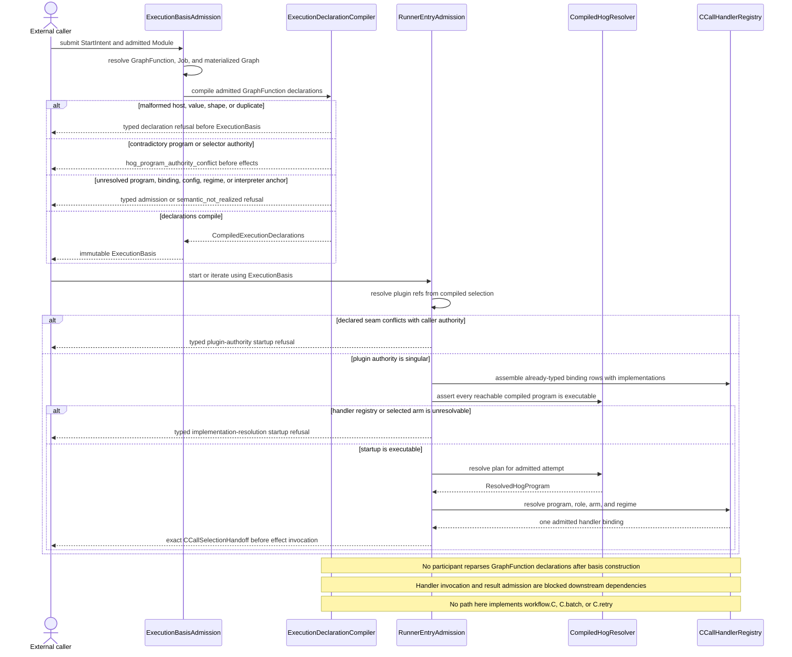
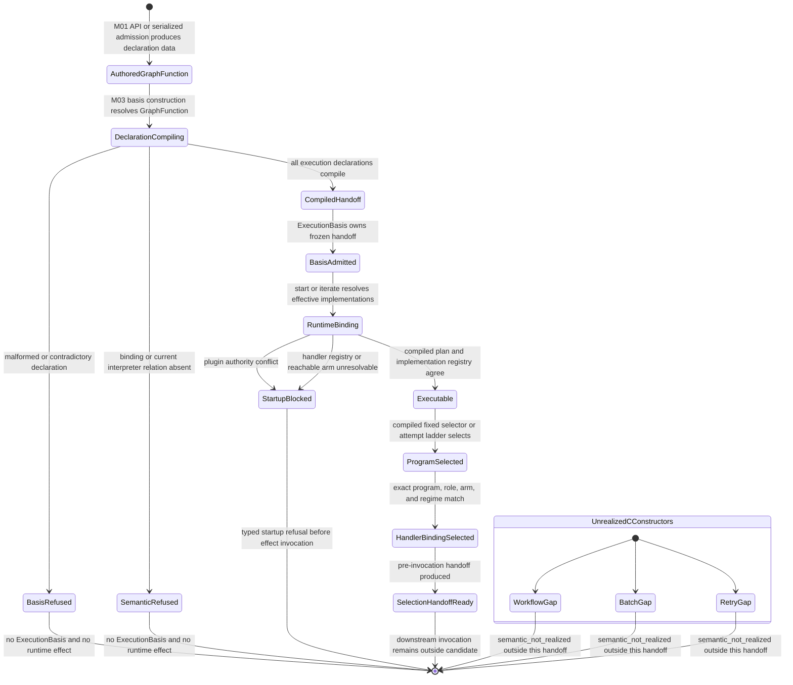

# M03 Compiled Execution Handoff Behavior Design

**Status**: Retrospective three-view design gate
**Design date**: 2026-07-12
**Checkpoint assessed**: `014448f` (`T-220: close typed GTL C algebra authoring loop`)
**Method authority**: `specification_methodology/specification/standards/DESIGN_MODULE_METHOD.md` section 5E
**Tenant authority**: [TYPESCRIPT_REALIZATION_GUARDRAILS.md](./TYPESCRIPT_REALIZATION_GUARDRAILS.md)
**Retrospective subject**: T-220 P4 execution-declaration compilation and typed runtime handoff

This design reconstructs one completed code boundary: graph-function execution
declarations are compiled before an `ExecutionBasis` exists, and the runner,
HoG selector, plugin resolver, and handler registry consume only that compiled
handoff. It does not redesign the runner and does not claim execution support
for any C constructor that the semantic compiler reports as unrealized.

## Boundary

- **Design verdict**: `candidate`. Retain the compiled-handoff structure only
  if independent axiom review and F_H ratification accept all three views.
- **Owning module**: M03 owns execution-declaration compilation,
  `ExecutionBasis`, runtime program selection, plugin resolution, handler
  binding, and fail-closed startup admission. M01 owns the published
  host-indexed declaration law and native declaration builders.
- **Requirements**: `REQ-L-GTL3-C-ALGEBRA-010..-016`,
  `REQ-R-ABG3-HANDLERS-001..-016`, `REQ-R-ABG3-CCALL-001..-017`,
  `REQ-R-ABG3-INTERPRET`, and `PRODUCT.md` Heart of Gold atom and program
  configuration law.
- **Ticket or intake**:
  `.ai-workspace/tickets/completed/T-220-close-typed-gtl-c-algebra-authoring-loop.md`,
  specifically P4.
- **Code scope assessed**:
  `gtl/m01/contracts/declaration_law.ts`,
  `gtl/m01/contracts/execution_declaration_builders.ts`,
  `abg/m03/contracts/execution_declaration_compiler.ts`,
  `abg/m03/contracts/hog_handler_bindings.ts`,
  `abg/m03/contracts/constructors.ts`,
  `abg/m03/contracts/carriers.ts`,
  `abg/m03/runner/hog_program_resolution.ts`,
  `abg/m03/runner/c_call_handlers.ts`, the typed consumption sites in
  `engine_runner.ts`, and `gtl_algebra_authority_guard.mjs`.
- **Dependencies**: admitted `Module` and `GraphFunction` lookup; the published
  seven-key execution-declaration law; HoG syntax admission; plugin seam
  admission; handler implementation registry; `ExecutionBasis` and uniform
  C-call spine law.
- **Explicit exclusions**: C-program authoring and semantic compilation;
  `workflow.C`, `C.batch`, and `C.retry` runtime realization; GraphFunction
  traversal and continuation design; F_P response admission; handler interior
  schemas; event and result projection; public SDK/CLI behavior; release-root
  completeness; and product-specific graph functions.

The seven execution declaration keys in this boundary are not the seven C
constructors. They are configuration attached to one admitted
`GraphFunction`: HoG program, catalog, fixed selector, ladder, handler
bindings, handler configs, and plugin selection. This boundary may select and
bind already-realized program terms. It cannot turn an unrealized C
constructor into runtime behavior.

The candidate claim is deliberately narrow:

1. authored execution declarations are admitted and compiled at one M03
   boundary before runtime effects;
2. one closed compiled payload is owned by `ExecutionBasis`;
3. runtime consumers select from that payload without reparsing authored
   declarations; and
4. an invalid or unexecutable selection stops before a handler interior runs.

## Domain Model

```mermaid
classDiagram
  direction LR

  class ExternalAuthor {
    <<effect-edge>>
    +authors typed or serialized GTL
  }

  class ExecutionDeclarationLaw {
    <<prime>>
    <<authoritative>>
    +key
    +allowedHost
    +valueKind
    +precedenceRule
    +compositionRule
    +interpretationOwner
  }

  class GraphFunction {
    <<prime>>
    <<authoritative>>
    +id
    +name
    +declarations
  }

  class ExecutionDeclarationEntry {
    <<subordinate>>
    +key
    +typedValue
  }

  class RawSerializedDeclaration {
    <<effect-edge>>
    +unknown shape
  }

  class ExecutionDeclarationCompiler {
    <<authoritative boundary>>
    +compileExecutionDeclarations(graphFunction)
    -compileHogProgramPlan()
    -admitHandlerBindings()
    -compilePluginSelection()
    -assertBindingsMatchPlan()
  }

  class CompiledExecutionDeclarations {
    <<subordinate>>
    <<authoritative in basis>>
    +kind
    +sourceRef
    +hogProgramPlan
    +handlerBindingRows
    +handlerConfigs
    +pluginSelection
  }

  class CompiledHogProgramPlan {
    <<subordinate closed union>>
    +mode default or single or catalog or ladder
  }

  class CCallHandlerBinding {
    <<subordinate>>
    +programRef
    +stageRole
    +armId
    +regime
    +handlerRef
    +handlerClass
    +handlerConfigRef
  }

  class DeclaredHandlerConfig {
    <<effect-edge subordinate>>
    +configRef
    +opaque unreviewed config data
  }

  class CompiledPluginSelection {
    <<subordinate>>
    +seam to pluginRef
  }

  class ExecutionBasis {
    <<prime>>
    <<authoritative>>
    +basisId
    +graphFunction
    +graph
    +job
    +compiledExecutionDeclarations
  }

  class ExecutionBasisAdmission {
    <<authoritative boundary>>
    +constructExecutionBasis()
    +resolve GraphFunction, Job, and Graph
  }

  class RunnerEntryAdmission {
    <<authoritative boundary>>
    +resolve effective plugins
    +assemble typed handler registry
    +assert plan executable
  }

  class ResolvedHogProgram {
    <<downstream>>
    +program
    +source
  }

  class CompiledHogResolver {
    <<interpreter boundary>>
    +resolveCompiledHogProgram()
    +assertCompiledHogPlanExecutable()
  }

  class CCallHandlerRegistry {
    <<downstream>>
    +typedBindings
    +handlerImplementations
  }

  class CCallSelection {
    <<downstream>>
    +programRef
    +stageRole
    +armId
    +regime
  }

  class CCallSelectionHandoff {
    <<prime downstream handoff>>
    +programRef
    +stageRole
    +armId
    +regime
    +handlerRef
    +handlerConfigRef
  }

  class DownstreamHandlerInvocation {
    <<deferred dependency>>
    +instruction protocol must be declared
  }

  class DownstreamResultAdmission {
    <<deferred dependency>>
    +F_P response admission must be accepted
  }

  class WorkflowCRuntime {
    <<deferred>>
    +transparent child traversal
  }

  class CBatchRuntime {
    <<deferred>>
    +ordered task spines
  }

  class CRetryRuntime {
    <<deferred>>
    +declared budget and one retry law
  }

  ExternalAuthor --> RawSerializedDeclaration : may supply
  ExternalAuthor --> ExecutionDeclarationEntry : constructs through typed API
  ExecutionDeclarationLaw "1" --> "1" ExecutionDeclarationEntry : governs
  GraphFunction "1" *-- "0..7" ExecutionDeclarationEntry : owns unique keys
  RawSerializedDeclaration --> GraphFunction : only after declaration admission
  ExecutionDeclarationCompiler --> GraphFunction : consumes admitted source
  ExecutionDeclarationCompiler --> ExecutionDeclarationLaw : applies
  ExecutionDeclarationCompiler --> CompiledExecutionDeclarations : produces once
  CompiledExecutionDeclarations "1" *-- "1" CompiledHogProgramPlan : owns
  CompiledExecutionDeclarations "1" *-- "0..*" CCallHandlerBinding : owns
  CompiledExecutionDeclarations "1" *-- "0..*" DeclaredHandlerConfig : addresses
  CompiledExecutionDeclarations "1" *-- "0..1" CompiledPluginSelection : owns
  ExecutionBasisAdmission --> ExecutionDeclarationCompiler : invokes once
  ExecutionBasisAdmission --> ExecutionBasis : constructs
  ExecutionBasis "1" *-- "1" CompiledExecutionDeclarations : freezes handoff
  RunnerEntryAdmission --> ExecutionBasis : consumes only
  RunnerEntryAdmission --> CompiledHogResolver : delegates compiled selection
  CompiledHogResolver --> ResolvedHogProgram : selects compiled term
  RunnerEntryAdmission --> CCallHandlerRegistry : joins bindings to implementations
  ResolvedHogProgram --> CCallSelection : supplies program membership
  CCallHandlerRegistry --> CCallSelection : resolves one implementation
  CCallSelection --> CCallSelectionHandoff : produces exact pre-invocation selection
  CCallSelectionHandoff ..> DownstreamHandlerInvocation : outside candidate
  DownstreamHandlerInvocation ..> DownstreamResultAdmission : outside candidate
  CompiledHogProgramPlan ..> WorkflowCRuntime : does not realize
  CompiledHogProgramPlan ..> CBatchRuntime : does not realize
  CompiledHogProgramPlan ..> CRetryRuntime : does not realize
```

### Carrier And Authority Reading

`GraphFunction` is the authored GTL authority. Its execution declaration rows
are subordinate configuration under the published declaration law.
`CompiledExecutionDeclarations` is not a second authored program. It is the
single normalized runtime handoff owned by one immutable `ExecutionBasis`.
The runner may select a program or ladder rung from that handoff; it may not
reopen `GraphFunction.declarations` to recover authored meaning.

`CCallHandlerBinding` is admitted configuration, not an implementation and not
runtime truth. `CCallHandlerRegistry` joins those typed rows to supplied
implementations and produces one exact pre-invocation selection. This
candidate stops there. It does not accept the selected handler's instruction
protocol, opaque config content, response admission, event emission, or
closure path; those are separately blocked designs.

The three deferred classes are negative structure. They make clear that a HoG
plan, plugin selection, handler config, or runner loop cannot stand in for
`workflow.C`, `C.batch`, or `C.retry`. Their absence remains visible to the C
semantic compiler as `semantic_not_realized`.

## Execution Sequence

The external caller is the only external participant. Every other participant
is a domain boundary above. Compilation and entry admission end at the exact
selection handoff, before the first handler interior can execute.

This sequence does not place the C semantic compiler inside `ExecutionBasis`
construction because the assessed code does not do so. The T-220 C conformance
gate is a separate upstream proof. A dependent design must not infer from this
compiled handoff that a C term passed that gate or that an unrealized
constructor executes.

## Lifecycle State Machine

The unrealized constructor states are not reachable by coercion from
`CompiledHandoff`. They are terminal outcomes of the separate C semantic
compiler. A runner loop, plugin, or handler cannot transition them to
`Executable`.

## Cross-View Invariants

| Check | Evidence | Verdict |
|---|---|---|
| Every sequence participant exists in the domain model or is external | Basis admission, compiler, runner admission, HoG resolver, and registry are modeled; caller is explicitly external. | pass |
| Every lifecycle carrier exists in the domain model | GraphFunction, compiled handoff, basis, resolved program, binding/registry, and exact selection handoff appear in the domain view. Refused states are compiler or entry dispositions. | pass |
| Every message names a typed transform or interpreter act | Lookup, compile, assemble, executability assertion, exact selection, and handoff are named operations. No effect is invoked. | pass |
| Every transition has an admission, compiler, interpreter, event, or external owner | No transition depends on controller-local memory or an untyped declaration bag. | pass |
| Authored execution declarations are interpreted once | `compileExecutionDeclarations` is called during `constructExecutionBasis`; runtime receives `basis.compiledExecutionDeclarations`. The runner source guard rejects declaration-attribute parser APIs. | pass |
| Runtime does not parse raw declaration meaning | HoG resolution accepts `CompiledHogProgramPlan`; registry assembly accepts `CCallHandlerBinding[]`; plugin selection reads the compiled map. | pass |
| Invalid declarations cannot produce worker/plugin/handler effects | Compilation must return before `ExecutionBasis`; implementation resolution is checked before the selection handoff. This candidate invokes no effect. | pass |
| Plugin and handler implementations own interiors only | The candidate ends before invocation and claims no handler-result, event, continuation, or closure behavior. | not_applicable |
| Opaque handler config does not become program meaning in this handoff | The compiler proves config-ref existence and never interprets config as program shape. Whether current config content lawfully excludes prompt/protocol truth is a blocked downstream instruction concern. | pass |
| The bootstrap default is a catalog citizen | `default` mode resolves the reserved effective-catalog default rather than an unlabelled runner program. | pass |
| Ladder selection ranges only over compiled declared terms | Basis compilation verifies every rung names a program in the compiled catalog; runtime selects by admitted attempt and cannot invent a program. | pass |
| Raw F_P output cannot transition directly to accepted or closed | The candidate ends before handler invocation and receives no F_P output. | not_applicable |
| Batch, retry, recursion, and nested workflow use declared algebra | This handoff contains no realization path for `workflow.C`, `C.batch`, or `C.retry`; all remain separate terminal gaps. | pass |
| A missing C interpreter cannot be replaced by HoG config or imperative glue | The compiled plan configures already-realized stages only. The views contain no plugin-owned traversal, batch loop, or retry loop. | pass |

## Axiom Evaluation

| Axiom | Authority | Domain evidence | Sequence evidence | State evidence | Native enforcement | Admission/compiler enforcement | Verdict | Gap owner |
|---|---|---|---|---|---|---|---|---|
| GTL declarations author program shape; ABG interprets admitted data | `PRODUCT.md` GTL/ABG layer law; `REQ-L-GTL3-C-ALGEBRA-011` | `GraphFunction` and declaration law precede the compiler and basis | Compiler consumes declarations once; runtime consumes compiled output | Authored, compiled, admitted-basis, and runtime states remain distinct | Host-indexed key/value builders and closed plan union | Host, kind, duplicate, precedence, selection, and binding checks occur before effects | pass | none |
| Execution declarations have one interpretation owner | `REQ-L-GTL3-C-ALGEBRA-011`; `REQ-R-ABG3-HANDLERS-011` | One `ExecutionDeclarationCompiler` owns the seven-key family | No runner participant receives raw declaration attrs | Only `DeclarationCompiling` can create `CompiledHandoff` | Typed compiler input/output and source guard | Runner parser APIs and direct declaration-entry reads are prohibited by the gate | pass | none |
| Runtime advancement truth is carried by `ExecutionBasis` | `ADR-043`; `TYPESCRIPT_REALIZATION_GUARDRAILS.md` | Basis is the prime runtime carrier and owns the compiled subordinate | Every runtime selection begins from the basis-owned handoff | `BasisAdmitted` precedes runtime binding | Required readonly `compiledExecutionDeclarations` field | Basis construction cannot finish if compilation throws | pass | none |
| Compile before effects | `REQ-L-GTL3-C-ALGEBRA-016` | Compiler sits before downstream effect edges | Invalid declarations return before basis; unresolvable implementation binding stops before selection handoff | Refused states cannot reach `SelectionHandoffReady` | Closed result and required basis field | Compiler and startup resolution gates fail closed | pass | none |
| Runtime may select among compiled declared terms but may not author or repair terms | `REQ-L-GTL3-C-ALGEBRA-014..-016`; `REQ-R-ABG3-CCALL-017` | Compiled plan is a closed default/single/catalog/ladder union | Attempt selects only an admitted ladder rung | `ProgramSelected` follows `Executable` and never rewrites handoff | Exhaustive plan switch | Catalog membership, selector conflict, and rung membership checked once | pass | none |
| Handler matching is exact on program, role, arm, and fibre | `REQ-L-GTL3-C-ALGEBRA-010`; `REQ-R-ABG3-HANDLERS-001/-012` | Typed binding carries all four identity dimensions | Registry resolves the selected tuple before invocation | Unresolvable selection enters `StartupBlocked` | Closed regime and handler-class unions | Binding-plan, regime, arm, config-ref, and implementation presence checks | pass | none |
| Handlers realize one interior and do not own truth or continuation | `REQ-R-ABG3-HANDLERS-002..-010` | Handler invocation and result admission are explicit downstream dependencies | Sequence stops at selection handoff | No handler lifecycle appears | The selected handler API is outside this candidate | No response or truth claim is made | not_applicable | blocked instruction and F_P designs |
| Duplicate selection authorities fail closed | `REQ-L-GTL3-C-ALGEBRA-011`; T-220 `AX-T220-06` | Declared plugin selection is one compiled subordinate | Declared and caller-supplied authority conflict at entry | Conflict enters `StartupBlocked` | Partial seam map has one value per seam | Compiler rejects declaration duplicates; entry rejects caller/declaration collision | pass | none |
| Default program remains labelled catalog data | `REQ-R-ABG3-HANDLERS-016`; `REQ-R-ABG3-CCALL-016` | Default mode points to effective catalog membership | HoG resolver returns the reserved default member | Default follows the same executable/program-selected states | Closed `default` plan variant | Effective catalog must contain its declared default ref | pass | none |
| Higher-order workflows remain free constructions, not feature-specific engine law | `PRODUCT.md` atom criterion; `ODD_METHOD.md` | The handoff contains general program/binding atoms only | No product-specific orchestration appears in the sequence | No feature-specific state exists | General closed carriers only | Missing constructor remains a typed gap | pass | all dependent feature owners |
| `workflow.C` executes as a transparent child traversal | `REQ-L-GTL3-C-ALGEBRA-006`; `REQ-R-ABG3-CCALL-013` | Runtime carrier is explicitly deferred and absent from the handoff | No child traversal path is drawn | `WorkflowGap` is terminal | Typed syntax exists outside this boundary | Current semantic compiler reports `semantic_not_realized` | not_applicable | M03 workflow-lift design and realization |
| `C.batch` preserves ordered task identity and one spine per task | `REQ-L-GTL3-C-ALGEBRA-007`; `REQ-R-ABG3-CCALL-005` | Runtime carrier is explicitly deferred and absent from the handoff | No fan-out/fan-in path is drawn | `BatchGap` is terminal | Typed syntax exists outside this boundary | Current semantic compiler reports `semantic_not_realized` | not_applicable | M03 batch design and realization |
| `C.retry` preserves contract under one declared retry law | `REQ-L-GTL3-C-ALGEBRA-008`; `REQ-R-ABG3-CCALL-009` | Runtime carrier is explicitly deferred and absent from the handoff | No runner-local retry loop is drawn | `RetryGap` is terminal | Typed syntax and positive budget exist outside this boundary | Current semantic compiler reports `semantic_not_realized` | not_applicable | M03 retry design and realization |
| Native-language enforcement is proportional to the desktop threat model | `REQ-L-GTL3-C-ALGEBRA-012` and Operating Trust Boundary | Closed plan/binding carriers protect likely authoring errors; hostile-object defense is absent | Foreign serialized declarations admit before basis; typed local values are trusted | Malformed input stops at the earliest capable boundary | Discriminated unions, readonly fields, host-indexed builders | Raw admission and semantic checks cover malformed authored data | pass | none |

## Gap And Exclusion Register

| Gap or exclusion | Why outside or blocking | Owner | Re-entry condition |
|---|---|---|---|
| `workflow.C` runtime realization | This handoff has no child-basis, graph-call/frame, sub-traversal evidence, or foldback carrier. A HoG plan or handler cannot substitute for the named lift. | M03 algebra interpreter | Separate accepted three-view design, implementation, and replay proof for transparent child traversal and C-call audit equality. |
| `C.batch` runtime realization | This handoff has no ordered task-family carrier, per-task spine/cardinality identity, or traversal-owned fan-out/fan-in. A TypeScript loop in the runner or plugin is forbidden. | M03 algebra interpreter | Separate accepted three-view design and proof preserving order, identity, one spine and judgment per task, and pointwise composition. |
| `C.retry` runtime realization | A HoG attempt ladder selects configuration; it is not `C.retry`. This handoff does not bind a C term, declared retry budget, replay-derived continuation, and one retry allowlist into one carrier. | M03 algebra interpreter | Separate accepted three-view design and proof for the declared retry constructor. |
| C conformance result is not attached to `ExecutionBasis` | The assessed code compiles GraphFunction execution declarations but does not carry the separate C-program compilation or realization census into basis admission. Therefore this design cannot certify that the running GraphFunction's constructive body passed C conformance. | M01/M03 mapping design | A requirement-authorized design decides whether and how one admitted C compilation identity joins the authoritative product/install root and `ExecutionBasis`, without creating a second program authority. |
| Release-authoritative declaration inventory | Basis compilation proves declarations that are present and their internal references; it cannot prove which declarations an authoritative release root required but omitted. | Product/install binding | Release manifest and expected-coverage carrier bind one complete authoritative root. |
| Opaque handler config schema | The handoff proves only ref existence and keeps config at the effect edge. Each concrete handler still owns admission of its published system/environment config contract. | Handler seam owners; prompt placement residual T-227 | Each selected handler admits its config before effect; prompts and domain policy remain typed GTL, not opaque handler config. |
| F_P output admission | Malformed worker output is probable, but its schema, contradiction, and closure laws are downstream of this declaration handoff. | M03 payload/result admission | Independent three-view review proves closed response admission before accepted assessment or closure. |
| Declared instruction protocol and handler-config placement | The handoff resolves a config ref but does not prove that its content excludes code-owned prompt/protocol truth. | GTL instruction declaration and M03 compiler | The blocked instruction design is repaired and accepted before any selected handler is invoked. |
| Source guard completeness | The regex guard is a bounded anti-regression signal, not a proof against every possible alias or dynamically constructed parser. The structural guarantee primarily comes from typed runner APIs. | M03 maintenance | Keep the guard and require independent code review whenever runner APIs or declaration parser exports change. |
| Plugin, handler, runner, shell, service, or script used to realize an absent C constructor | Such a workaround would create a rival interpreter, hide the semantic gap, and violate the atom criterion. | All implementation owners | No workaround re-entry. Realize the declared constructor or keep the dependent feature blocked. |

## Design Verdict

`candidate` for the bounded compiled-handoff claim:

1. `compileExecutionDeclarations` is the one runtime interpretation boundary
   for the seven GraphFunction execution-declaration keys;
2. `constructExecutionBasis` compiles those declarations before publishing an
   immutable basis;
3. HoG selection, plugin resolution, handler configuration, and handler
   registry assembly consume the basis-owned typed payload rather than raw
   declaration attributes; and
4. declaration and startup incoherence stops before the exact pre-invocation
   selection handoff is returned.

This is not acceptance of T-220 as seven-term runtime closure. In particular,
the handoff cannot certify or execute `workflow.C`, `C.batch`, or `C.retry`,
and it does not automatically bind the separate C conformance result into the
runtime basis. Handler invocation remains downstream of blocked instruction
and F_P response-admission designs. Any feature depending on those boundaries
or constructors remains blocked.

The candidate evidence is the live implementation descended from `014448f`,
the focused execution-basis coherence corpus, the declaration-law type/runtime
corpus, the HoG/handler tests, and the runner source guard. An independent
reviewer must evaluate the domain, sequence, and state views against the axiom
matrix. F_H must then explicitly accept, reject, or reprice the design. Until
both occur, this retrospective design freezes the completed code boundary and
authorizes no dependent implementation.
