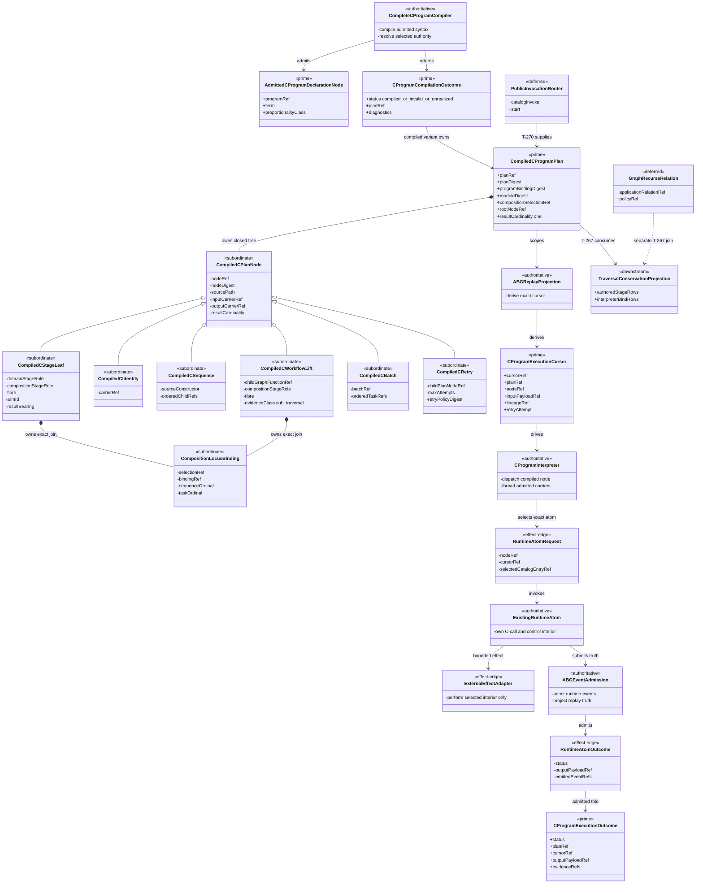
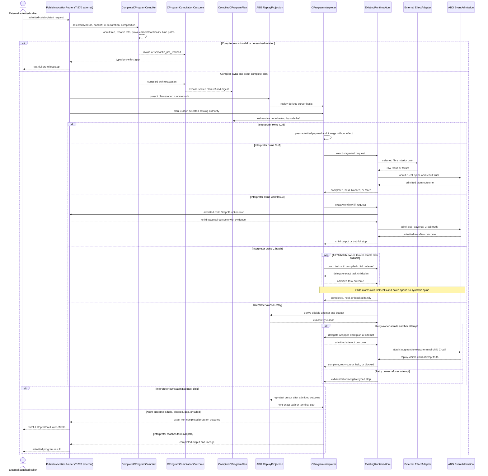
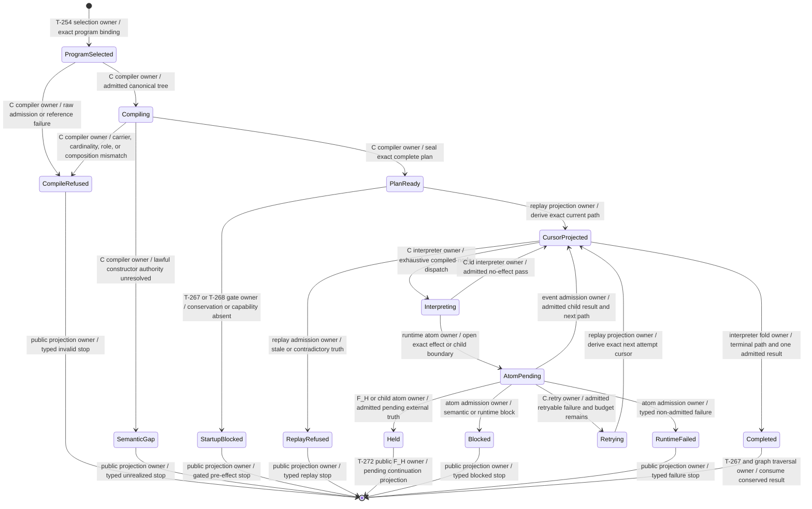

# M03 Complete C-Program Interpreter Behavior Design

**Status**: Accepted under delegated F_H authority after bounded self-review
**Date**: 2026-07-14
**Ticket**: `T-271`
**Method authority**: `specification_methodology/specification/standards/DESIGN_MODULE_METHOD.md` section 5E
**Tenant authority**: [TYPESCRIPT_REALIZATION_GUARDRAILS.md](./TYPESCRIPT_REALIZATION_GUARDRAILS.md)

## Boundary

This design closes the structural interpreter gap between admitted GTL C
syntax and the generic runtime atoms already realized by T-257 through T-262.
It compiles one complete admitted C program before effects, then interprets
only the compiled plan:

```text
admitted CProgramDeclaration
  -> selected Module and GraphVector program binding
  -> exact selected abg.fn_composition
  -> one immutable CompiledCProgramPlan
  -> replay-derived CProgramExecutionCursor
  -> existing C-call, workflow.C, C.batch, and C.retry runtime atoms
  -> admitted CProgramExecutionOutcome
```

The seven GTL constructors remain exactly:

```text
C.of | C.id | C.compose | C.edge | workflow.C | C.batch | C.retry
```

The interpreter introduces no eighth constructor. Graph-level `recurse` is a
GraphFunction application relation and remains outside the C syntax tree. The
interpreter may consume an already admitted recurse relation only at the
public graph traversal boundary owned by T-267/T-270; it does not translate
that relation into a C node.

### Requirements

- `REQ-L-GTL3-C-ALGEBRA-001..-017`
- `REQ-R-ABG3-CCALL-001..-017`
- `REQ-R-ABG3-FN-COMP-001..-024`
- `REQ-R-ABG3-INTERPRET-010` and `-027`
- `specification/PRODUCT.md` atom criterion
- T-259 direct `workflow.C` atom
- T-260 direct HOF and `C.batch` atoms
- T-261 direct `C.retry` atom
- T-262 typed graph-recurse atom
- T-269 authored-stage and interpreter-bind separation

### Explicit exclusions

- Consensus-specific stage names, reviewer policy, panel control, or routes;
- a controller, service loop, prompt shell, or second graph traversal loop;
- parsing or repairing authored C syntax after execution starts;
- synthesis of transform/evaluate/consequence stages not present in the C
  declaration;
- flattening `workflow.C`, `C.batch`, or `C.retry` into anonymous `C.of`
  leaves;
- treating call preparation, evidence, result admission, or materialization
  binds as authored C stages;
- treating GraphFunction `recurse` as a C constructor;
- unbounded retry, scheduling, leases, cancellation, or distributed execution;
- public SDK routing, owned by T-270;
- whole-program traversal conservation and static TraversalUnit closure, owned
  by the reframed T-267; and
- tenant capability publication, owned by T-268.

## Irreducible Architectural Carrier Set

The active boundary has five prime carriers.

| Prime carrier | Authority | Purpose |
|---|---|---|
| `AdmittedCProgramDeclarationNode` | GTL M01 authoritative input | Canonical authored syntax, program identity, outer carriers, and proportionality class. |
| `CProgramCompilationOutcome` | M03 authoritative compiler result | Closed `compiled`, `invalid`, or `semantic_not_realized` result; only `compiled` carries a plan. |
| `CompiledCProgramPlan` | M03 authoritative compiled projection | Exact selected-Module, program, composition, carrier, constructor, path, role/fibre/arm, result-cardinality, retry, and child-reference joins. |
| `CProgramExecutionCursor` | M03 replay-derived runtime position | Current plan path, sequence position, batch task, retry attempt, input payload, lineage, and admitted predecessor outcome. |
| `CProgramExecutionOutcome` | M03 authoritative admitted outcome family | Completed, held, blocked, semantic-gap, or runtime-failed result with exact plan and replay identity. |

Subordinate plan nodes are a closed recursive family:

```text
CompiledCPlanNode
  = CompiledCStageLeaf
  | CompiledCIdentity
  | CompiledCSequence
  | CompiledCWorkflowLift
  | CompiledCBatch
  | CompiledCRetry
```

`CompiledCSequence.sourceConstructor` distinguishes `c_compose` from
`c_edge`; an edge retains its three named field paths while using the same
ordered sequence law. A plan node always carries its canonical source path,
source digest, input carrier, output carrier, and result-cardinality
projection. It cannot carry effects, events, continuation authority, or a
product-specific route.

`CProgramExecutionCursor` is not controller memory. It is derived from the
compiled plan plus admitted replay. The interpreter may retain a local value
for efficiency, but re-entry must reproduce the same cursor from those two
authorities.

## Design Decisions

### D1. Canonical C syntax remains the only program authority

The compiler consumes the exact T-254 selected program binding and readmits
the selected canonical C declaration. It walks the admitted C tree once and
produces one digest-bound `CompiledCProgramPlan`. Runtime consumes that plan;
it does not invoke `compileCAlgebraToHog`, parse declaration attributes, or
infer a program from effects, handlers, graph shape, names, or observed
results.

The existing normalized HoG flat/workflow/batch/retry variants remain direct
form compatibility projections. For a direct form, the complete compiler must
produce a plan observationally equivalent to the existing direct binding and
resolver. Those HoG projections do not become a second authority for mixed or
nested programs.

### D2. Source paths make every structural locus exact

Every node receives a canonical source path rooted at `$.term`:

```text
c_compose:  .left, .right
c_edge:     .transform, .evaluate, .consequence
c_batch:    .tasks[n]
c_retry:    .term
```

The node ref and digest cover the program binding digest, selected Module
digest, source path, canonical source node, outer carrier pair, parent path,
and constructor-specific authority. Equal-looking subterms at different paths
therefore remain distinct.

The compiler derives two orthogonal ordinals:

- `sequenceOrdinal`: serial position inside the current sequence scope; and
- `taskOrdinal`: stable batch list position, null outside a batch.

Retry attempts remain replay-derived runtime ordinals and never enter static
program identity. Workflow child frames retain child GraphFunction and frame
identity. These coordinates join the existing C-call identity without
inventing a parallel call namespace.

### D3. Carrier continuity and result cardinality close before effects

The compiler proves input/output continuity recursively:

- `C.id<A>` requires equal input and output carriers and invokes no atom;
- `C.compose(left, right)` requires `left.output == right.input`;
- `C.edge` requires the same continuity across its three direct fields;
- `workflow.C` requires one exact Module-contained child whose typed outer
  interface preserves the declared carrier pair;
- `C.batch` requires a non-empty ordered task family with the same input,
  output, and per-task result cardinality; and
- `C.retry` preserves the wrapped plan's carrier pair and cardinality.

Cardinality is derived structurally as `zero | one | many | unresolved`.
`workflow.C` has no authored result-bearing flag. The compiler therefore uses
only authored sequence structure: a sole direct workflow or a terminal
workflow with no other authored result-bearing locus supplies the parent
result; an intermediate workflow supplies admitted bind output but not the
outer result. An explicit `C.of.resultBearing` remains authoritative and may
not be cleared because another term follows it. A program with both an
explicit result-bearing leaf and a terminal workflow result is `many` and
fails. This is a structural cardinality judgment, not a claim that the
workflow's internal Node-interface refs equal a published wire contract; the
existing `childOuterContractRef: null` and `childWireContractCertified: false`
truth remain unchanged. Batch cardinality is the shared per-task cardinality,
not task count. The complete plan admits only `one`; `zero`, `many`, or an
unresolved child reference is a typed compiler stop.

### D4. Composition binding is exact and separate from domain role

`C.of` owns its domain stage role, fibre, arm, and result-bearing flag.
`workflow.C` intentionally owns none of those domain-stage fields; it is a
transparent named lift. The compiler does not fabricate them.

For each invoking locus, the compiler joins the selected
`abg.fn_composition` governance row:

- exact composition selection and digest;
- exact fibre for `C.of`;
- when that fibre has one row, that unique row may govern more than one domain
  locus and every locus still receives a distinct compiled binding record;
- when a fibre has several rows, exact declared `order` at the stable
  depth-first invocation ordinal must select one;
- role-free `workflow.C` uses the sole composition row, or exact order when
  the composition has several rows; and
- batch task ordinals remain separate C-call identity even when lawful tasks
  reuse the same unique governance row.

The compiled locus carries both `domainStageRole: string | null` and the
closed `compositionStageRole`. A null domain role is lawful only for
`workflow.C`; its `armId` is the exact child GraphFunction ref and its evidence
class is `sub_traversal`. The child program preserves and executes its own
authored roles under its own selected composition.

Ambiguous order, missing fibre, undeclared role, or a composition row outside
the selected owner fails compilation before effects. A row reused through the
unique-fibre rule is recorded on every locus; reuse never merges stage, task,
arm, evidence, or C-call identity.

### D5. Structural constructors delegate to the existing atom laws

The interpreter exhaustively matches `CompiledCPlanNode`:

- stage leaf: invoke the existing declared-stage C-call/result-admission atom;
- identity: pass the admitted input and lineage without events or effects;
- sequence: interpret children in order, passing only admitted output;
- workflow lift: invoke the T-259 child traversal atom under the compiled
  child binding;
- batch: invoke the T-260 all-or-block task-family law, with each task adapter
  interpreting that task's compiled child plan; and
- retry: invoke the T-261 replay/budget law, with each eligible attempt
  interpreting the wrapped compiled child plan.

Direct `C.batch(C.of...)` and `C.retry(C.of...)` retain observationally
equivalent resolver behavior. Their current implementations combine the
grouping/control law with the sole direct leaf's C-call construction. T-271
must factor those implementations at the existing atom boundary:

- the batch coordinator owns stable task order and all-or-block folding;
- the retry coordinator owns replay-derived attempt eligibility, budget, and
  the retry judgment over the exact terminal child call; and
- the stage/workflow atoms own every C-call open, fibre selection, evidence,
  result admission, and non-retry terminal judgment.

Nested forms then reuse the same batch and retry laws while delegating task or
attempt interiors back to the structural interpreter. A wrapper never opens a
synthetic C-call around multiple effectful child calls. Each invoking leaf or
workflow lift owns its existing spine; batch remains a grouping relation and
retry remains a control relation. The retry attempt is included in every
wrapped child cursor, so replay distinguishes the whole new attempt while the
coordinator attaches `retry` only to the failed attempt's exact terminal child
C-call.

### D6. The interpreter is a fold, not another traversal runtime

The interpreter owns only:

```text
compiled-node dispatch
ordered carrier threading
batch child-plan delegation
retry child-plan delegation
replay-derived cursor re-entry
closed outcome folding
```

Existing runtime atoms continue to own C-call events, plugin/worker effect
boundaries, F_P result admission, F_H held truth, retry eligibility, child
frames, and replay evidence. The interpreter cannot emit a successful atom
result, select a handler, write runtime truth directly, or decide graph
continuation. It consumes atom outcomes and returns one program outcome to the
owning graph traversal boundary.

### D7. Replay and failure are path-conserving

Before dispatch, the interpreter projects the current cursor from the plan
and replay. A completed child path is not repeated. A dangling atom resumes
through that atom's existing replay law. A retry resumes the exact current
attempt. A batch resumes only unresolved task paths while retaining the
all-or-block parent disposition.

Every refusal identifies the available program or plan ref, node path, source
node digest, composition selection, carrier pair, and current replay basis.
Compilation has one closed outcome family:

```text
compiled
invalid
semantic_not_realized
```

Only `compiled` carries a `CompiledCProgramPlan`. Runtime has a separate
closed outcome family:

```text
blocked
held
runtime_failed
completed
```

Malformed atom output, stale replay, carrier mismatch, undeclared role,
unresolved child, unsupported graph-recursive shape, and plan drift cannot
advance the cursor or permit a later effect.

### D8. Graph recurse remains a separate application relation

A `workflow.C` self-reference or mutual workflow-reference cycle always stops
as `gtl-c-unsupported-recursive-shape-before-effects`; a C workflow lift is
not an alternate spelling of graph recurse. Lawful recursion is represented
by the already admitted GraphFunction application relation outside the
selected C tree. T-262 remains its one typed runtime, and T-267/T-270 join that
relation to conservation and public routing. T-271 may compile ordinary
non-cyclic C programs inside a GraphFunction that participates in that outer
relation, but it neither calls itself to simulate recursion nor encodes
recurse as a plan-node variant.

### D9. Publication and traversal closure remain gated

T-271 publishes the compiler/interpreter contract inside M03 and removes only
the `complete_c_program_interpreter` gap. It does not make the program publicly
invocable. T-267 must prove every authored locus and interpreter bind is
conserved. T-270 must connect the admitted plan to the one public catalog/start
router. T-268 must admit product capability coverage before effect-bearing
Consensus execution.

## Domain Model



## Execution Model



## Lifecycle Model



## Cross-View Axiom Evaluation

| Axiom | Authority | Domain evidence | Sequence evidence | State evidence | Native enforcement | Admission/compiler enforcement | Verdict | Gap owner |
|---|---|---|---|---|---|---|---|---|
| Closed seven-constructor family | C-ALGEBRA-001 | Closed `CompiledCPlanNode` variants; recurse is separate | Exhaustive interpreter alternatives | `Interpreting` dispatches only compiled nodes | TypeScript discriminated union | Unknown syntax fails admission | pass | none |
| Compile before effects | C-ALGEBRA-016 | `CompiledCProgramPlan` precedes requests | Compile refusal returns before `EffectAdapter` | `PlanReady` precedes `AtomPending` | Plan-only interpreter input | Global references, carriers, cardinality, and composition close in compiler | pass | none |
| Authored stage conservation | C-ALGEBRA-016; FN-COMP-015/-021 | Source path and digest retained per node | Sequence never synthesizes a C stage | Compiler refusal on lost or replaced locus | Exact recursive plan union | Path census equals admitted tree census | pass | T-267 consumes proof |
| Role/fibre orthogonality | C-ALGEBRA-009 | Domain and composition roles are separate fields | Atom receives exact declared fibre | Mismatch transitions to `CompileRefused` | `C.of` typed fibre | Composition row joined without renaming domain role | pass | none |
| Named workflow transparency | C-ALGEBRA-006; CCALL-013 | Workflow node binds one child GraphFunction | Child runs through public graph start and returns evidence | Held/block/complete derive from child atom | Node carries exact child ref | Selected Module and outer interface resolve exactly | pass | none |
| Batch spine identity | C-ALGEBRA-007; CCALL-005 | Ordered task refs plus task ordinal | Each task delegates one child plan; atom owns spines | Parent remains all-or-block | Non-empty typed task family | Equal carriers/cardinality and stable positions | pass | none |
| One retry law | C-ALGEBRA-008; CCALL-009 | Retry node carries shared policy digest | Retry atom consults replay before another attempt | Only admitted retry moves to `Retrying` | Positive authored budget | Policy digest, allowlist, budget, and replay eligibility rechecked | pass | none |
| Replay-derived continuation | CCALL-004; FN-COMP-011 | Cursor is prime replay projection | Cursor reprojects after admitted atom truth | No controller-local transition | Cursor type excludes decision flags | Replay identity and plan digest must match | pass | none |
| Raw F_P/F_H output cannot close | C-ALGEBRA-018; FN-COMP-017 | Raw atom result is effect-edge-only | Atom admits output before interpreter sees it | Raw output has no transition to `Completed` | Closed atom outcome union | Existing T-257/T-258 admissions own checks | pass | none |
| Graph recurse separation | C-ALGEBRA-001; CCALL-013 | Recurse is deferred relation, not plan node | No recurse interpreter alternative | Unsupported cycle reaches `SemanticGap` | No recurse C variant exists | Graph application compiler owns relation | pass | T-267 join |
| Public invocation integration | T-270 | Router is deferred/downstream | Router supplies plan and consumes outcome | Startup remains blocked without router authority | Not applicable in T-271 | T-270 must join public catalog/start truth | not_applicable | T-270 |
| Whole-program TraversalUnit conservation | T-267 | Downstream projection consumes exact plan | Completed result returns to traversal owner | `Completed` does not self-close graph traversal | Not applicable in T-271 | T-267 must conserve authored and bind rows | not_applicable | T-267 |
| Tenant capability coverage | T-268 | Capability is outside interpreter plan | Router gates before effect | `StartupBlocked` is explicit | Not applicable in T-271 | Canonical manifest admission owns coverage | not_applicable | T-268 |

## Required Proof Matrix

Implementation may begin only after this design is accepted. Closure then
requires these tests against module-owned carriers rather than helper layout:

| Proof | Required observation |
|---|---|
| Native/raw equivalence | Native constructor tree and raw canonical admission compile to the same plan digest. |
| Flat parity | Existing direct `C.of`, `C.edge`, workflow, batch, and retry fixtures remain observationally equivalent. |
| Mixed sequence | `C.compose` threads carriers through at least one `C.of` and one `workflow.C` without flattening the lift. |
| Nested batch | A batch task containing composition executes each leaf under distinct path/task identity and retains all-or-block semantics. |
| Nested retry | `C.retry` around a composite child re-enters only through replay-derived eligibility and preserves child C-call spines. |
| Identity law | Left and right `C.id` add no effect or C-call event and preserve the same admitted payload/lineage. |
| Edge law | `C.edge` retains transform/evaluate/consequence source paths and direct leaves without forcing those roles on open programs. |
| Carrier negative | One inner carrier discontinuity fails compilation before atom invocation. |
| Composition negative | Missing, ambiguous, reordered, or fibre-incompatible composition binding fails before effects. |
| Replay negative | Stale plan, cursor, attempt, task, child frame, or predecessor outcome cannot resume. |
| Role negative | Undeclared role or handler binding cannot invoke an atom. |
| Recursive-shape negative | Self or mutual workflow lift stops before effects; the separate admitted graph-recurse relation remains unchanged. |
| Canonical consumer | T-252 loses only `complete_c_program_interpreter`; no Consensus branch or body-byte change is introduced. |
| Governance | Strict TypeScript, semantic suite, GTL law, three-view Mermaid, DS governance, publication, and `git diff --check` pass. |

## Design Verdict

`accepted`.

The bounded self-review repaired workflow wire-authority, cross-view owner,
compiler/runtime outcome, nested batch/retry spine, composition-row reuse, and
recurse-separation defects before acceptance. Implementation is authorized
only within this design; closure still requires the complete proof matrix and
an independent post-implementation review.
