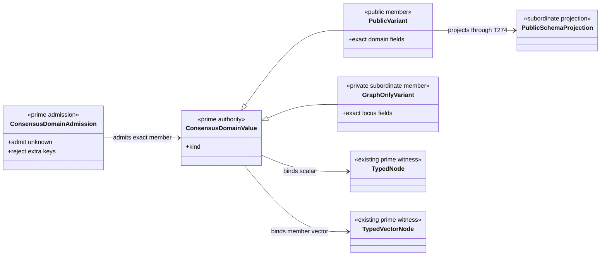
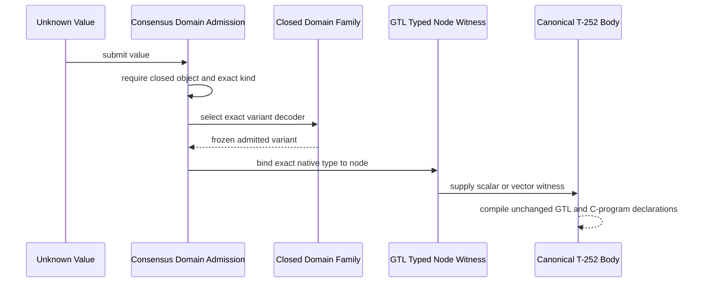
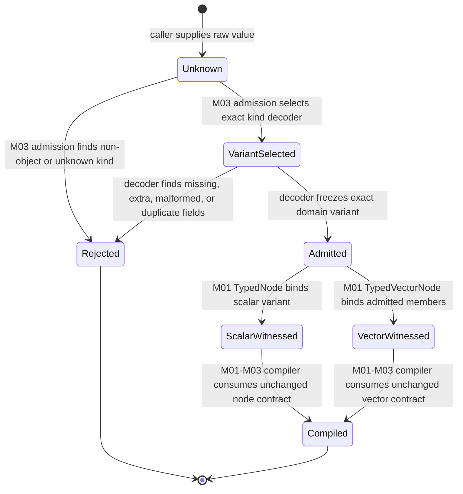

# M03 Consensus Domain Family Prime Contraction Behavior Design

**Status**: F_H-authorized for implementation under T-277; independent closure review pending

**Date**: 2026-07-15

**Ticket**: `T-275`

**Change class**: `realization_refactor`

**Governing design**: [ADR-044](./adrs/ADR-044-prime-contraction-is-a-cross-boundary-design-gate.md)

**Census rows**: `PC-001`, `PC-003`

## Boundary

This design replaces the fourteen aliases over
`ConsensusCarrier<Kind>` and `Record<string, unknown>` with one closed,
discriminated `ConsensusDomainValue` family. It closes existing T-252 native
witnesses without adding Consensus execution, result projection, ticket
mutation, or another public schema identity.

Public variants are `ConsensusSubject`, `ConsensusPanel`,
`ConsensusReviewerProfile`, `ReviewFindings`, `ReviewRulings`,
`ConsensusRoundPolicy`, `ConsensusRoundOutcome`, `ConsensusResult`, and
`TicketConsensusProjection`. Graph-only variants remain private to the
Consensus body. Vector wrappers remain structural typed-node witnesses and do
not become domain variants.

Every variant has exact keys and closed value domains. The single admission
dispatcher selects a variant only by its `kind`, then applies that variant's
exact decoder. Unknown kinds, fields, enum values, empty required vectors,
duplicate profile identity, and cross-variant payloads fail before typed-node
admission.

## Irreducible Architectural Carrier Set

- `ConsensusDomainValue`: one closed native discriminated family
- `ConsensusDomainAdmission`: one kind-directed exact admission boundary
- `TypedNode`: existing graph scalar witness
- `TypedVectorNode`: existing graph vector witness

Public schema projections are subordinate to the domain family but remain
independently admitted public identities under T-274.

## Prime Contraction Review

```json prime-contraction
{
  "schemaVersion": 1,
  "iacs": [
    "ConsensusDomainValue",
    "ConsensusDomainAdmission",
    "TypedNode",
    "TypedVectorNode"
  ],
  "authoritativeCarriers": [
    "ConsensusDomainValue",
    "ConsensusDomainAdmission",
    "TypedNode",
    "TypedVectorNode"
  ],
  "subordinatePayloads": [
    "ConsensusPublicProjection",
    "ConsensusGraphOnlyVariant",
    "ReviewerAssignmentVector",
    "AttributedFindingsVector"
  ],
  "promotionTests": [
    {
      "candidate": "ConsensusDomainValue",
      "verdict": "promote",
      "reason": "It is the one closed native source for all Consensus domain fields and discriminants."
    },
    {
      "candidate": "ConsensusDomainAdmission",
      "verdict": "promote",
      "reason": "It is the only dynamic boundary that converts unknown input into a typed Consensus variant."
    },
    {
      "candidate": "TypedNode",
      "verdict": "promote",
      "reason": "The existing GTL scalar witness independently binds admitted native values to exact nodes."
    },
    {
      "candidate": "TypedVectorNode",
      "verdict": "promote",
      "reason": "The existing GTL vector witness independently preserves member type and vector cardinality."
    },
    {
      "candidate": "ConsensusGraphOnlyVariant",
      "verdict": "remain_subordinate",
      "reason": "A graph-only locus is selected only inside the canonical body and has no independent public consumer."
    }
  ],
  "recurrenceReview": {
    "status": "commonize_tenant",
    "ref": "build_tenants/abiogenesis/typescript/design/A5_PRIME_CONTRACTION_CENSUS.md#pc-003---open-internal-consensus-carrier-aliases"
  },
  "authoritySourceCount": {
    "before": 1,
    "after": 1
  },
  "authoringSourceCount": {
    "before": 14,
    "after": 1
  },
  "disposition": "migrate_authority",
  "ownerTicket": "T-275"
}
```

## Domain View



## Execution View



## State View



Transition owners are explicit: M03 Consensus admission owns variant
selection and exact decoding; the native family owns field/value meaning; M01
typed witnesses own node binding; existing M01-M03 compilation owns the
unchanged GTL body transition.

## Migration

1. Define the public and graph-only variant interfaces in one native family.
2. Define one exact admission dispatcher and per-variant closed field checks.
3. Move the fourteen scalar witnesses to the family admission boundary.
4. Keep reviewer-assignment and finding vectors as typed structural wrappers.
5. Export only public variants and explicitly supported native admission.
6. Remove `ConsensusCarrier`, `CarrierKind`, and open `fields` payloads.
7. Prove the serialized T-252 Module and compiler census remain unchanged.
8. Let T-274 derive public schemas from the public family members.

## Negative Proof

- every former kind rejects unknown and missing fields
- an unknown kind fails before witness construction
- a public variant cannot substitute for another public variant
- a graph-only variant cannot be admitted through a public contract
- a vector rejects non-array input and a malformed member
- duplicate reviewer identities and empty required vectors fail domain admission
- no `Record<string, unknown>` or generic `fields` payload remains in the family
- the T-252 Module round-trip and body digest remain stable unless the exact
  node contract is intentionally migrated and re-sealed

## Stop Conditions

- stop if exact decoding requires a permissive index signature in an admitted type
- stop if graph-only loci gain public schema identities
- stop if vector structure is flattened into the domain union
- stop if a domain decoder begins selecting traversal, worker, or closure
- stop if migration changes the canonical GTL topology or C-program body
- stop and reprice if a required public field cannot be derived from
  `REQ-P-CONSENSUS` without inventing product meaning
