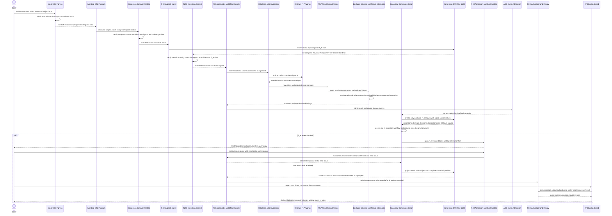
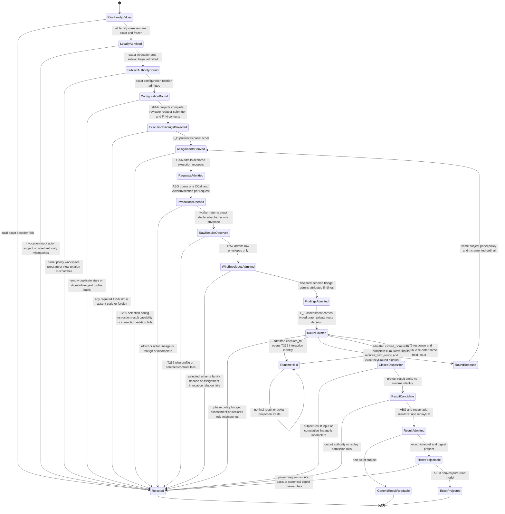

# M03 Consensus Domain Stdlib, Admission, And Ticket Projection Behavior Design

**Status**: Candidate - bounded constructability repair pending independent review; implementation fenced on T-281, T-270, and T-274

**Date**: 2026-07-18

**Ticket**: `T-275`

**Change class**: `design_reframe`

**Governing design**: [ADR-044](./adrs/ADR-044-prime-contraction-is-a-cross-boundary-design-gate.md)

**Governing Ontology**: [ABIogenesis Public Control-Plane Ontology `/9`](./ABIOGENESIS_PUBLIC_CONTROL_PLANE_ONTOLOGY.md), accepted semantic candidate `1ca39b2b5c536be6d16eecfb30d8310e798853232ae7c03f71ac655a7f97bf40`, current projection digest `bcbacd4a4b4dd3b5b6db2a3ad281c92bf76a7a889da38562d5b6301e85764615`

**Ratified dependencies**:

- T-270 `run.invoke` design digest `71076f364d06a9725b5482ee0cdc84e64d29a4c18447a5ab4c41e1b62ba7f430`, accepted by `20260716T062747Z_DECISION_fh_accept_t270_reconciled_run_invoke_design.md`
- T-274 publication design digest `930c26a2fa5e144ebe0d0ba1aa639fd2aaf531b51e4b5921df434860718313e8`, accepted by `20260716T062342Z_DECISION_fh_accept_t274_reconciled_publication_design.md`
- completed T-256 declared execution-context admission
- completed T-257 declared F_P result admission
- completed T-267 whole-program conservation
- completed T-271 complete C-program interpretation

**Census rows**: `PC-001`, `PC-003`

## Boundary

This design consumes the one T-274 `ConsensusContractFamily`. It does not add a
domain author, public schema identity, vocabulary, public operation, event kind,
store, traversal authority, or ticket authority.

The first relation binds an admitted `ConsensusSubject` to one immutable
`WorkspaceBinding`, one admitted `GtlProgram`, one narrowing `CatalogView`, one
exact `ConsensusPanel`, and one exact `ConsensusRoundPolicy`. It derives ordered
private reviewer assignments from the panel's declared profile vector. T-275
validates that relation; it does not select a reviewer or worker. The generic
T-256 execution-context compiler remains the only path from an assignment to a
declared F_P request. ABG then opens the ordinary C-call and actor invocation.
T-257 admits the exact raw wire envelope; it does not validate domain fields.
One generic declared-schema bridge resolves the T-256-selected result contract,
admits the raw payload against that schema, and calls the same
`ConsensusContractFamily.review_findings` decoder used by the typed GTL node.
The bridge is contract-indexed and proves a non-Consensus fixture; it is not a
Consensus parser side path.

The second relation binds the canonical Consensus graph result candidate to its existing
`AdmittedOutputAuthorityProjection`, execution basis, payload ledger, and
canonical replay. `AF-03 project` then derives a
`TicketConsensusProjection` through the `ticket_consensus` variant of
`abg.operation.project.read`. The projection is a pure read model over admitted
truth. It is not persisted and cannot mutate, close, create, split, or triage a
ticket.

The published Module and GraphFunction remain declarations. The admitted GTL
program owns the graph sequence. T-270 owns `run.invoke` authority admission.
T-272 owns response and continuation from a held F_H interaction. T-275 cannot
fabricate a final result from a held or incomplete state.

T-275 also owns the SYSTEM stdlib implementations for the canonical
Consensus-specific deterministic leaf operators. This is domain-function
ownership, not a Consensus runtime. T-270 resolves and invokes those bindings
through its generic operator boundary. The three structural wrapper bindings
`binding://abg/consensus/review-panel`,
`binding://abg/consensus/reduce-panel-facts`, and
`binding://abg/consensus/bounded-rounds` remain generic `workflow.C`, HOF, and
recurse routing owned by T-270 and never enter the Consensus domain registry.

### Requirements

- `REQ-P-CONSENSUS-004..012`, `-015`, and `-019`
- `REQ-P-PUBLIC-CONTRACTS-006` and `-008..010`
- `REQ-L-GTL3-OPERATOR-003..005` and `REQ-L-GTL3-RECURSE-001..004`
- PRODUCT bounded Consensus and Public Operator Contract
- the ratified public control-plane Ontology, especially `AF-03`, `AF-15`,
  `RuntimeProjection<K>`, and the 19-operation hard break

### Explicit Exclusions

- a second Consensus type, schema, decoder, or publication family;
- `ticket.consensus` as an operation identity or handler;
- `catalog.invoke`, `read.result`, `read.replay`, or a compatibility alias;
- profile or worker selection owned by T-275;
- a domain result that bypasses the generic T-257 raw-envelope and declared-
  schema admission chain;
- a Consensus-specific runtime, reviewer loop, result store, event writer,
  retry controller, closure evaluator, or ticket writer;
- caller-authored result, replay, projection ref, or projection digest;
- completion-order attribution or adapter-position attribution; and
- projection of a held F_H interaction as a terminal `ConsensusResult`.

## Ontology Slice

### Irreducible Architectural Carrier Set

| Carrier | Authority | Lifecycle role |
|---|---|---|
| `ConsensusContractFamily` | one native domain authoring family | Owns the exact field and value-domain meaning of all nine public variants and the graph-private variants. |
| `ConsensusDomainAdmission` | one exact kind-directed native admission boundary | Converts unknown values to frozen family members; it cannot prove cross-carrier relations alone. |
| `TypedNode` and `TypedVectorNode` | existing GTL native witnesses | Preserve scalar type and ordered vector member type without becoming domain authors. |
| `PublicInvocation<run.invoke>` | accepted public invocation family | Carries the exact input basis and invocation identity that propose the subject. |
| `InvocationAuthority<run.invoke>` | accepted authority join | Binds submitting actor, grants, policy, catalog view, steering provenance, and stable authority basis. |
| `PublicFunctionDefinition<project.read>` | accepted public function-definition family | Defines one closed source/projection relation and its request, result, refusal, binding, and effect law. |
| `PublicInvocation<project.read>` | public query admission | Names the exact result source, projection kind, workspace binding, and authority basis. |
| `WorkspaceBinding` | stable workspace/product/catalog authority | Binds the same workspace and catalog basis used by `run.invoke`; ordinary observation does not change it. |
| `GtlProgram` | admitted constructive program | Publishes the canonical Consensus GraphFunction and owns the graph sequence; T-275 cannot rewrite it. |
| `CatalogView` | narrowing catalog authority | Proves the exact function and declared profile/policy inputs remain in the admitted view. |
| `DeclaredExecutionRequest` | existing T-256 locus authority | Carries the exact per-reviewer selection, configuration, instruction, result, and capability requirements. |
| `CCall` and `ActorInvocation` | existing ABG effect lineage | Bind one assignment-derived request to one graph/frame/vector attempt, worker dispatch, actor, and result identity. |
| `AdmittedFpResultContractEnvelope` | existing T-257 raw wire admission | Conserves the selected contract ref and raw payload digest under one exact wire profile; it makes no domain-schema claim. |
| `DeclaredDomainResultAdmission` | generic contract-indexed F_D bridge | Resolves the selected declared schema, validates the raw domain payload, and invokes the schema family's native decoder before target-carrier admission. |
| `AdmittedOutputAuthorityProjection` | existing payload-ledger result authority | Proves the output payload ref, digest, contract, producer, basis, validation, and evidence for the canonical result locus. |
| `RuntimeEventLog` | existing append-only replay authority | Supplies exact graph-call, basis, result, interaction, lineage, and replay truth. |
| `ConsensusResult` | admitted domain result | Carries one immutable subject/panel/policy/round/findings/rulings/outcome/evidence/lineage result. |

`ConsensusSubjectAdmissionBasis`, `ConsensusConfigurationBinding`,
`ReviewerAssignment`, `AssignmentInvocationBinding`, ordered assignment and
findings vectors, `ConsensusResultProjectionBasis`, and
`TicketConsensusProjection` are subordinate derived values. They own no
selection, mutation, execution, or retention lifecycle.

### Lifecycle Completeness

| Entity | Declare/create | Read/project | Update/transition | Delete/retire |
|---|---|---|---|---|
| `ConsensusReviewerProfile` | admitted from one declared program/profile source through the family decoder | projected through its profile ref and exact configuration basis | changed selection, configuration, instruction, result, or capability basis creates a new profile value and digest | prior profile remains evidence; no public retirement operation |
| `ConsensusPanel` | admitted as one non-empty ordered vector of exact profiles | resolved by the subject and admitted program/view | changed membership, order, or profile basis creates a new panel digest | prior panel remains evidence |
| `ConsensusRoundPolicy` | admitted from one declared policy source | resolved by the subject and program policy basis | changed budget, rule, escalation, or foldback basis creates a new policy digest | prior policy remains evidence |
| `ConsensusSubject` | admitted as immutable invocation input under `run.invoke`; a subordinate basis joins its exact contract/ref/digest, submitting actor, optional ticket ref/digest, invocation input basis, invocation authority, and workspace | read with its exact workspace, panel, policy, actor, source, and optional ticket identity | changed subject, digest, actor, panel, policy, workspace, ticket, input, or authority basis creates a new subject | prior subject remains causal input evidence |
| `ReviewerAssignment` | F_D derives one private row per ordered panel profile | consumed by T-256 and the canonical fan-out | never updated; changed profile/panel/round creates another assignment | invocation-local subordinate value expires with its execution basis but remains replay evidence |
| `AssignmentInvocationBinding` | ABG derives it when the interpreter opens the assignment's C-call and actor invocation | joins panel ordinal/request to actor invocation, result, and event refs | another attempt creates another immutable binding | retained as replay-derived effect lineage |
| `ReviewFindings` | the generic declared-schema bridge admits the T-257 raw envelope payload through the selected family schema, then verifies its assignment/invocation relation | consumed by canonical reduction and replay projection | correction or retry admits another attributed value; it never rewrites the prior value | retained under payload/event law |
| `ReviewRulings`, `ConsensusRoundOutcome`, `ConsensusResultCandidate`, `ConsensusResult` | canonical GTL stages produce rulings, outcomes, and the identity-free candidate; ABG output/replay admission completes the public result | runtime result and replay reads project them | another round or corrected evidence creates another immutable value | retained under runtime and payload law |
| `TicketConsensusProjection` | `AF-03` derives it only on an admitted query | returned through `project.read` | a different result/replay/ticket basis derives another projection ref/digest; no stored row changes | ephemeral read model; no retirement operation |

### Authority And Function Derivation

```text
PublicInvocation<run.invoke>
  -> InvocationAuthority + exact invocation input basis
  -> admitted GtlProgram + WorkspaceBinding + CatalogView
  -> exact subject source/actor/ticket + ConsensusPanel + ConsensusRoundPolicy relation
  -> F_D ordered ReviewerAssignment projection
  -> T-256 DeclaredExecutionRequest per assignment
  -> ABG interpreter opens CCall + ActorInvocation and dispatches ordinary F_P work
  -> T-257 admits the exact raw result envelope and selected contract identity
  -> generic declared-schema admission decodes ConsensusContractFamily.review_findings
  -> assignment/actor-invocation/replay-attributed ReviewFindings
  -> canonical GTL fan-in, reduction, bounded recurse, and F_H boundaries
  -> identity-free ConsensusResultCandidate target-carrier admission
  -> AdmittedOutputAuthorityProjection + RuntimeEventLog
  -> runtime-completed ConsensusResult with ABG-owned result/replay refs
  -> PublicInvocation<project.read>
  -> AF-03 ticket_consensus projection
  -> TicketConsensusProjection
```

The admitted program owns the constructive order. T-275 owns only the generic
declared-schema bridge, deterministic cross-carrier verification, and the pure
projection implementation. `AF-15`, T-256, T-257 raw-envelope admission, ABG
effect/event admission, T-272, and `AF-03` retain their existing authority.

Projection loss is deliberate. `TicketConsensusProjection` exposes the admitted
Consensus result and its ticket/result/replay basis. It omits private traversal,
worker transport, prompt, frame, retry, continuation, current-selection, and
ticket-mutation state. Omitted state cannot be reconstructed from profile labels,
payload shape, array order, or adapter data.

## Relational Admission Decisions

### D1. Local Shape Is Necessary But Not Sufficient

`ConsensusDomainAdmission` continues to reject unknown kinds, extra fields,
malformed digests, open enums, empty required arrays, and duplicate profile
identities. A separate relation verifier then checks that independently admitted
family members share the same authority and causal basis. Passing the local
decoder never proves panel membership, current configuration, invocation
attribution, result reachability, or projection eligibility.

### D2. Subject, Actor, Ticket, Panel, Policy, Program, And Workspace Bind Exactly

`ConsensusSubjectAdmissionBasis` is a subordinate deterministic join over the
admitted `PublicInvocation<run.invoke>`, its `InvocationAuthority`, its exact
input-basis ref/digest, and its immutable `WorkspaceBinding`. The subject's
`subjectContractRef`, `subjectRef`, and `subjectDigest` must identify the exact
admitted input source. `submittingActorRef` must equal the invocation's admitted
actor attribution. `ticketRef` and `ticketDigest` are jointly absent or resolve
to one exact ticket source under the same workspace/input basis; path presence
or caller prose is not authority.

The subject's workspace, panel, and round-policy refs must then resolve exactly
once inside the admitted program and narrowed catalog view under that same
binding. The panel digest binds its ordered profile vector. The policy digest
binds its declared positive budget and rule/foldback refs. A string-shaped ref or
digest with no exact admitted source is invalid.

Downstream profiles and policies enter through ordinary declared GTL/catalog
surfaces. T-275 adds no catalog kind, global registry, ambient profile directory,
or configuration file scan.

### D3. Reviewer Assignment Is A Projection, Not Selection

The canonical F_D `expand_panel` locus derives exactly one assignment for each
declared panel ordinal. The private assignment preserves:

- panel ref and declared ordinal;
- profile ref;
- role or worker-selection contract ref;
- configuration digest;
- instruction contract ref;
- result contract ref; and
- declared capability requirement refs.

The role/worker-selection value is projected into T-256's existing
`role_or_worker_selection_ref` slot. The profile configuration digest must equal
the value admitted from the same T-256 source closure. Profile capability refs
are requirements, not grants; generic capability admission remains authoritative.

T-256 validates and returns the declared request. It does not choose a worker,
open an invocation, dispatch transport, admit a domain result, or write an event.

### D4. Attribution Is Independent Of Completion Order

ABG's ordinary interpreter/effect path consumes one declared request and opens
one C-call plus one `ActorInvocation`. A subordinate
`AssignmentInvocationBinding` joins the assignment ref/digest and panel ordinal
to the declared request ref/digest, C-call ref, graph-call/frame/vector identity,
actor invocation id, actor result ref, and causal event refs. Neither the
assignment nor T-256 pre-authors an invocation identity.

T-257 next admits only the exact raw wire envelope, selected result-contract ref,
and raw payload digest. This slice realizes T-257's previously deferred generic
wire profile as the exact two-key envelope
`{ resultContractRef, payload }`. The envelope vocabulary is fixed; the selected
declared schema is the sole shape authority for `payload`. The generic declared-
schema bridge resolves that selected contract from the same admitted program and
contract-catalog basis, validates `payload`, and invokes the family decoder. It
cannot accept an echoed contract ref as schema success or merge schema fields
into the envelope vocabulary. A non-Consensus declared-schema fixture must use
the same profile and bridge.

Each admitted `ReviewFindings` value must then match one exact assignment and
invocation binding by profile ref, configuration digest, actor invocation id,
output digest, result contract, and reachable evidence. Every required profile
appears once for the round. Missing, duplicate, foreign, stale, or unattributed
output remains typed non-close truth. The deterministic vector order is panel
ordinal, never worker completion order.

`ReviewFindings.invocationRef` equals the bound `actorInvocationId`.
`ReviewFindings.outputDigest` equals the canonical digest of the admitted domain
`payload`, not the outer envelope or free-form transport text. Its evidence refs
must be reachable from the same actor-result, C-call, payload, and event chain.

### D5. Result Admission Conserves Runtime Truth

The canonical result target locus must have one admitted
`AdmittedOutputAuthorityProjection` whose payload ref, digest, target contract,
producer, execution basis, validation refs, and evidence refs match the
`ConsensusResult`. The result must preserve the exact subject, panel, policy,
ordered rounds, finding sets, ruling rows, classification, dissent, terminal
outcome, evidence, lineage, result ref, and replay ref reachable from the same
runtime log.

The terminal outcome must name the final represented round; its finding and
ruling refs must be reachable from the result's admitted round data. Contract
failure classification and failure ref remain paired. Agreement and dissent
cannot be inferred from prose or worker order.

### D6. F_H Hold Is Not A Final Result

`escalate_fh` may be observed as typed round/F_H replay truth. A held interaction
is still nonterminal runtime truth. T-275 exposes no `ConsensusResult` or ticket
projection until T-272 admits any required response/continuation and the canonical
graph produces a valid result under its declared output contract.

If the canonical body cannot produce the result required by the accepted product
after lawful continuation, implementation stops and routes the structural gap to
the owning GTL design. T-275 cannot synthesize a result in the projector.

### D7. Ticket Projection Is Pure AF-03

The one accepted relation is:

```text
source: admitted ConsensusResult + exact subject/output/replay basis
projection kind: ticket_consensus
operation: abg.operation.project.read
result: TicketConsensusProjection
```

The source subject must contain jointly present ticket ref and digest. The result
must preserve the same subject identity. `projectionRef` and `projectionDigest`
derive canonically from the exact ticket, result, output-authority, and replay
basis; callers cannot supply them as authority. The same inputs reproduce the
same projection. The projector emits no event, performs no write, and never
changes ticket status or content.

### D8. SYSTEM Stdlib Resolves Only Deterministic Domain Leaves

One SYSTEM-owned `ConsensusSystemStdlib` projects one private
`ConsensusFdStdlibBindingSet` that resolves exactly the ten canonical F_D leaf
`Operator.binding` identities below. Each row is admitted with regime
`F_D`, exact input schema refs, exact output schema ref, and the shared
`ConsensusContractFamily` source digest before T-270 may invoke it.

| Declared `Operator.binding` | Domain function | Native implementation family |
|---|---|---|
| `binding://abg/consensus/exact-panel-facts` | derive member-only exact panel facts | exact-panel facts |
| `binding://abg/consensus/expand-panel` | project ordered reviewer assignments | panel expansion |
| `binding://abg/consensus/project-reducer-binding` | project reducer execution context | typed execution-binding projection |
| `binding://abg/consensus/project-submitter-binding` | project submitter execution context | typed execution-binding projection |
| `binding://abg/consensus/project-fh-binding` | project F_H execution context | typed execution-binding projection |
| `binding://abg/consensus/close-initial` | admit an initial `closed_done` route | typed route admission |
| `binding://abg/consensus/close-post-submitter` | admit a post-submitter `closed_done` route | typed route admission |
| `binding://abg/consensus/recurse-post-submitter` | admit a post-submitter `recurse_next_round` route | typed route admission |
| `binding://abg/consensus/seed-round` | derive the first round from the exact subject/configuration relation | round seed |
| `binding://abg/consensus/project-result` | project a closed graph result candidate | result-candidate projection |

The ten language identities remain distinct because each belongs to a declared
GraphVector. Prime contracts them to six native action families where type and
authority are identical: one exact-facts action, one expansion action, one
closed typed execution-binding projector with three cases, one typed route
admission action with three declared-route cases, one seed action, and one
result-candidate action. The target schema and admitted GraphVector rule select
the closed case; runtime strings, tags, or a second registry do not.

The stdlib does not include the wrapper identities `review-panel`,
`reduce-panel-facts`, or `bounded-rounds`. Those rows select no domain
implementation; T-270 derives their `workflow.C`, HOF, and recurse execution
from admitted structure. The stdlib also does not own F_P transport, F_H
interaction admission, evaluator plugins, events, replay, or continuation.

### D9. Execution Context Is Fully Carried By Graph-Private Family Values

The four graph-private carriers that enter T-256 preserve every active slot;
T-256 derives no value from a profile label, operator name, or ambient catalog.

| Family value | Required exact fields | T-256 slot mapping |
|---|---|---|
| `ReviewerAssignment` | `roundRef`, `panelRef`, `profileRef`, positive `panelOrdinal`, `roleContractRef`, `configurationDigest`, `instructionContractRef`, `resultContractRef`, ordered-unique `capabilityRefs` | role/worker selection, configuration, instruction protocol, result contract, capability requirements |
| `SemanticReducerBinding` | `roundRef`, `reducerRef`, `roleContractRef`, `configurationDigest`, `instructionContractRef`, `resultContractRef`, ordered-unique `capabilityRefs`, `policyRef` | role/worker selection, configuration, instruction protocol, result contract, capability requirements |
| `SubmitterTurnBinding` | `roundRef`, `submitterRef`, `roleContractRef`, `configurationDigest`, `instructionContractRef`, `resultContractRef`, ordered-unique `capabilityRefs` | role/worker selection, configuration, instruction protocol, result contract, capability requirements |
| `FhInteractionBinding` | `roundRef`, `interactionSubjectRef`, `expectedActorRef`, `instructionContractRef`, `resultContractRef`, ordered-unique `capabilityRefs`, `interactionOperationIds`, `interactionResumeOperationIds`, `interactionChoiceRefs` | interaction subject, instruction protocol, result contract, capability requirements, operation, resume-operation, and choice refs |

`FhInteractionBinding` carries no `interactionRef`. The exact interaction
identity is created only when ABG/T-272 admits the F_H hold. The resulting
`FhPendingInteraction` may carry that runtime-owned identity. The former
`requestContractRef` is not treated as an instruction protocol alias; it is
replaced by the exact declared `instructionContractRef`.

### D10. Routing Consumes A Real Graph-Private Contract

`InitialSemanticAssessment` and `PostSubmitterSemanticAssessment` each carry one
nested `ConsensusSemanticRouteDecision` from the same family. It contains the
exact round ref, assessment ref and digest, phase (`initial` or
`post_submitter`), policy ref and digest, observed round ordinal and budget,
typed route (`closed_done`, `submitter_turn`, `recurse_next_round`, or
`escalate_fh`), ruling/residual refs, and evidence refs.

The decision is an admitted F_P claim, not closure truth. The deterministic
route leaf verifies its exact assessment, phase, policy, budget, and declared
GraphVector rule before producing `ConsensusRoundDisposition` or selecting the
submitter/F_H locus. Initial decisions cannot recurse; post-submitter decisions
cannot request another submitter turn; exhausted recurse requests route to F_H.
Evaluator field refs point only to actual route-decision fields. The obsolete
`initial-assessment/disposition` and `post-assessment/disposition` refs are
removed rather than aliased.

### D11. Result Projection Has Complete Inputs Without An Identity Cycle

The closed `ConsensusRoundDisposition` conserves the subject ref/digest, panel
ref, policy ref, ordered round refs, admitted finding-set refs, full
`ReviewRulings`, classification, dissent profile refs, terminal round outcome,
evidence refs, lineage refs, and paired contract-failure truth. The
`project-result` leaf consumes both the exact `ConsensusSubject` and a
`closed_done` disposition. A disposition missing any required public-result
input cannot reach that leaf.

For graph-success `closed_done`, `contractFailureRef` is null. Contract-failure
public results remain projections of ABG blocked truth and never enter the
graph-success candidate path.

The leaf emits graph-private `ConsensusResultCandidate`, a subordinate variant
of the one `ConsensusContractFamily`. It contains every domain field required by
public `ConsensusResult` except `resultRef` and `replayRef`. ABG output admission
owns the result identity; canonical replay projection owns the replay identity.
The ordinary result projection joins those two runtime identities to the
candidate and then admits the public `ConsensusResult`. The graph, caller, and
ticket projector cannot pre-author either identity.

### D12. F_H Re-entry And Recurse Bindings Are Exact

On `escalate_fh`, the declared F_H locus opens one T-272-owned interaction and
the runtime holds without a graph result. `abg.operation.interaction.respond`
admits the exact actor response through AF-18. `abg.operation.run.continue`
then uses AF-17/T-272 to re-enter the same admitted program, GraphCall, frame,
current construction intent, and held locus with that response. No new action
is selected, and no projector resumes the graph. A second F_H hold creates a
new interaction through the same lifecycle.

The recurse declaration retains exactly:

- termination evaluator binding `binding://abg/consensus/round-closed`;
- foldback implementation binding `binding://abg/consensus/next-round`;
- mode `rebind`; and
- `requiresParentEvaluation: true`.

The SYSTEM stdlib supplies those two domain bindings separately from the ten
F_D `Operator.binding` rows. `round-closed` accepts only a `closed_done`
disposition. `next-round` accepts only a `recurse_next_round` disposition with
an unexhausted declared budget, increments the ordinal once, binds
`priorRoundRef`, and preserves the exact subject, panel, policy, cumulative
findings, rulings, dissent, evidence, and lineage. T-270 owns generic recurse
interpretation; T-275 owns only these declared domain functions.

## Prime Contraction Review

```json prime-contraction
{
  "schemaVersion": 1,
  "iacs": [
    "ConsensusContractFamily",
    "ConsensusDomainAdmission",
    "TypedNode",
    "TypedVectorNode",
    "PublicInvocationRunInvoke",
    "InvocationAuthorityRunInvoke",
    "PublicFunctionDefinitionProjectRead",
    "PublicInvocationProjectRead",
    "WorkspaceBinding",
    "AdmittedGtlProgram",
    "CatalogView",
    "DeclaredExecutionRequest",
    "CCall",
    "ActorInvocation",
    "AdmittedFpResultContractEnvelope",
    "AdmittedOutputAuthorityProjection",
    "RuntimeEventLog",
    "ConsensusResult"
  ],
  "authoritativeCarriers": [
    "ConsensusContractFamily",
    "ConsensusDomainAdmission",
    "TypedNode",
    "TypedVectorNode",
    "PublicInvocationRunInvoke",
    "InvocationAuthorityRunInvoke",
    "PublicFunctionDefinitionProjectRead",
    "PublicInvocationProjectRead",
    "WorkspaceBinding",
    "AdmittedGtlProgram",
    "CatalogView",
    "DeclaredExecutionRequest",
    "CCall",
    "ActorInvocation",
    "AdmittedFpResultContractEnvelope",
    "AdmittedOutputAuthorityProjection",
    "RuntimeEventLog",
    "ConsensusResult"
  ],
  "subordinatePayloads": [
    "ConsensusSubjectAdmissionBasis",
    "ConsensusConfigurationBinding",
    "ReviewerAssignment",
    "ReviewerAssignmentVector",
    "ConsensusFdStdlibBindingSet",
    "ConsensusRecursionBindingSet",
    "ConsensusSemanticRouteDecision",
    "ConsensusRoundDisposition",
    "ConsensusResultCandidate",
    "AssignmentInvocationBinding",
    "DeclaredDomainResultAdmission",
    "AttributedFindingsVector",
    "ConsensusResultProjectionBasis",
    "TicketConsensusProjection"
  ],
  "promotionTests": [
    {"candidate":"ConsensusContractFamily","verdict":"promote","reason":"It remains the one independently authored source for every Consensus domain field and discriminant."},
    {"candidate":"ConsensusDomainAdmission","verdict":"promote","reason":"It is the one dynamic boundary that converts unknown values into exact frozen family members."},
    {"candidate":"TypedNode","verdict":"promote","reason":"The existing scalar witness independently binds admitted native values to exact GTL nodes."},
    {"candidate":"TypedVectorNode","verdict":"promote","reason":"The existing vector witness independently preserves member type and declared vector cardinality."},
    {"candidate":"PublicInvocationRunInvoke","verdict":"promote","reason":"The admitted public invocation independently owns request, input-basis, and function identity before domain admission."},
    {"candidate":"InvocationAuthorityRunInvoke","verdict":"promote","reason":"The operation-indexed authority join independently binds actor, grants, view, policy, steering provenance, and stable basis."},
    {"candidate":"PublicFunctionDefinitionProjectRead","verdict":"promote","reason":"The accepted public definition independently governs the closed query relation across schema SDK CLI and ingress."},
    {"candidate":"PublicInvocationProjectRead","verdict":"promote","reason":"The admitted query has an independent public request and refusal lifecycle before projection."},
    {"candidate":"WorkspaceBinding","verdict":"promote","reason":"The immutable binding independently governs exact workspace product root and catalog authority."},
    {"candidate":"AdmittedGtlProgram","verdict":"promote","reason":"The admitted program independently owns the canonical constructive sequence and function membership."},
    {"candidate":"CatalogView","verdict":"promote","reason":"The narrowing view independently constrains admitted callable and declaration inputs without widening authority."},
    {"candidate":"DeclaredExecutionRequest","verdict":"promote","reason":"T-256 independently admits the exact per-locus selection configuration instruction result and capability contract."},
    {"candidate":"CCall","verdict":"promote","reason":"The existing C-call independently identifies the program locus, frame, vector, task, regime, and attempt interpreted by ABG."},
    {"candidate":"ActorInvocation","verdict":"promote","reason":"The existing actor invocation independently owns one worker dispatch and result lifecycle under the C-call."},
    {"candidate":"AdmittedFpResultContractEnvelope","verdict":"promote","reason":"T-257 independently conserves exact wire-profile, selected-contract, and raw-payload identity before domain admission."},
    {"candidate":"AdmittedOutputAuthorityProjection","verdict":"promote","reason":"The existing payload-ledger projection independently proves the admitted result payload contract digest producer and evidence."},
    {"candidate":"RuntimeEventLog","verdict":"promote","reason":"The append-only event log independently owns canonical causal and replay truth."},
    {"candidate":"ConsensusResult","verdict":"promote","reason":"Public consumers pattern-match one independently admitted immutable result with its own result and replay identities."},
    {"candidate":"ConsensusSubjectAdmissionBasis","verdict":"remain_subordinate","reason":"It is the reproducible join of admitted invocation input, actor, workspace, subject, and optional ticket truth and owns no separate lifecycle."},
    {"candidate":"ReviewerAssignment","verdict":"remain_subordinate","reason":"It derives from one admitted panel profile and round ordinal and has no independent selection or lifecycle."},
    {"candidate":"ConsensusFdStdlibBindingSet","verdict":"remain_subordinate","reason":"It contributes exact implementations for already-declared Operator bindings to the generic T-270 resolver and owns no selector, schema, or runtime lifecycle."},
    {"candidate":"ConsensusRecursionBindingSet","verdict":"remain_subordinate","reason":"It contributes the declared termination and foldback implementations to generic recurse interpretation without owning recursion control."},
    {"candidate":"ConsensusSemanticRouteDecision","verdict":"remain_subordinate","reason":"It is an admitted graph-private F_P claim that requires deterministic route admission and never owns closure truth."},
    {"candidate":"ConsensusRoundDisposition","verdict":"remain_subordinate","reason":"It is the cumulative typed output of one admitted round and is consumed only by generic recurse or result projection."},
    {"candidate":"ConsensusResultCandidate","verdict":"remain_subordinate","reason":"It preserves complete graph-produced domain content while ABG output and replay projections retain sole ownership of runtime identities."},
    {"candidate":"AssignmentInvocationBinding","verdict":"remain_subordinate","reason":"It derives from one assignment, declared request, C-call, actor invocation, and replay event set without selecting or dispatching work."},
    {"candidate":"DeclaredDomainResultAdmission","verdict":"remain_subordinate","reason":"It applies the already-selected schema and family decoder to one T-257 envelope and cannot author contract or domain meaning."},
    {"candidate":"TicketConsensusProjection","verdict":"remain_subordinate","reason":"It is reproducibly derived by AF-03 from admitted result and replay truth and owns no mutation or retention authority."}
  ],
  "recurrenceReview": {
    "status": "consume_existing",
    "ref": "build_tenants/abiogenesis/typescript/design/A5_PRIME_CONTRACTION_CENSUS.md#pc-001---consensus-contract-family-authorship"
  },
  "authoritySourceCount": {"before":18,"after":18},
  "authoringSourceCount": {"before":1,"after":1},
  "disposition": "consume_existing",
  "ownerTicket": "T-275"
}
```

This feature adds zero public schema identities, zero operation identities, zero
event kinds, zero stores, zero runtime controllers, and zero domain authors. It
adds one closed source/projection variant to the existing `project.read`
definition, graph-private contract variants inside the same family, and one
subordinate stdlib contribution to T-270's generic binding resolver. The ten
leaf identities contract to six native actions; the three structural wrappers
and two recurse bindings do not duplicate those actions.

## Domain View

```mermaid
classDiagram
  direction LR
  class ConsensusContractFamily {
    <<prime author>>
    +nine public variants
    +graph private variants
  }
  class ConsensusSubject {
    +subjectContractRef
    +subjectRef
    +subjectDigest
    +submittingActorRef
    +panelRef
    +roundPolicyRef
    +workspaceRef
    +ticketRef
    +ticketDigest
  }
  class ConsensusPanel {
    +panelRef
    +panelDigest
    +ordered profiles
  }
  class ConsensusReviewerProfile {
    +profileRef
    +roleContractRef
    +configurationDigest
    +instructionContractRef
    +resultContractRef
    +capabilityRefs
  }
  class ConsensusRoundPolicy {
    +policyRef
    +policyDigest
    +roundBudget
    +rule refs
  }
  class WorkspaceBinding {
    <<prime authority>>
  }
  class PublicRunInvocation {
    <<prime ingress>>
    +invocationRef
    +inputBasisRef
    +inputBasisDigest
  }
  class InvocationAuthority {
    <<prime authority join>>
    +actorAttributionRef
    +authoritySetRef
    +authoritySetDigest
  }
  class SubjectAdmissionBasis {
    <<subordinate exact join>>
  }
  class AdmittedGtlProgram {
    <<prime constructive program>>
  }
  class CatalogView {
    <<prime narrowing view>>
  }
  class ReviewerAssignment {
    <<subordinate ordered projection>>
    +panelOrdinal
    +roleContractRef
    +configurationDigest
    +instructionContractRef
    +resultContractRef
    +capabilityRefs
  }
  class SemanticReducerBinding {
    <<subordinate F_P context>>
    +roleContractRef
    +configurationDigest
    +instructionContractRef
    +resultContractRef
    +capabilityRefs
  }
  class SubmitterTurnBinding {
    <<subordinate F_P context>>
    +roleContractRef
    +configurationDigest
    +instructionContractRef
    +resultContractRef
    +capabilityRefs
  }
  class FhInteractionBinding {
    <<subordinate F_H context>>
    +interactionSubjectRef
    +expectedActorRef
    +instructionContractRef
    +resultContractRef
    +operationIds
    +resumeOperationIds
    +choiceRefs
    +no interactionRef
  }
  class ConsensusSemanticRouteDecision {
    <<graph private F_P claim>>
    +phase
    +route
    +assessmentDigest
    +policyDigest
    +roundOrdinal
    +roundBudget
  }
  class ConsensusRoundDisposition {
    <<graph private cumulative result>>
    +outcome
    +roundRefs
    +findingSetRefs
    +rulings
    +classification
    +dissentProfileRefs
    +evidenceRefs
    +lineageRefs
  }
  class ConsensusSystemStdlib {
    <<SYSTEM owned contribution>>
    +ten F_D leaf bindings
    +six native actions
    +two recurse bindings
  }
  class GenericStructuralRouter {
    <<T270 generic>>
    +workflow C
    +fan out and fan in
    +recurse
  }
  class DeclaredExecutionRequest {
    <<T256 prime>>
  }
  class CCall {
    <<ABG effect locus>>
    +cCallRef
  }
  class ActorInvocation {
    <<ABG dispatch lifecycle>>
    +actorInvocationId
    +resultRef
  }
  class AssignmentInvocationBinding {
    <<subordinate lineage join>>
    +panelOrdinal
    +requestRef
    +cCallRef
    +actorInvocationId
  }
  class RawFpResultEnvelope {
    <<T257 wire admission>>
    +declared_schema_result
    +resultContractRef
    +payloadDigest
  }
  class DeclaredDomainAdmission {
    <<subordinate schema application>>
    +selectedSchemaRef
    +payloadDigest
  }
  class ReviewFindings {
    +profileRef
    +configurationDigest
    +invocationRef
  }
  class ConsensusResult {
    <<runtime completed public result>>
    +resultRef
    +replayRef
  }
  class ConsensusResultCandidate {
    <<graph private subordinate>>
    +all domain result fields
    +no resultRef
    +no replayRef
  }
  class AdmittedOutputAuthority {
    <<payload ledger authority>>
  }
  class RuntimeEventLog {
    <<replay authority>>
  }
  class FhPendingInteraction {
    <<T272 runtime truth>>
    +interactionRef
  }
  class ProjectReadDefinition {
    <<AF03 public definition>>
    +ticket_consensus
  }
  class TicketConsensusProjection {
    <<subordinate pure projection>>
    +projectionRef
    +projectionDigest
  }

  ConsensusContractFamily *-- ConsensusSubject
  ConsensusContractFamily *-- ConsensusPanel
  ConsensusContractFamily *-- ConsensusReviewerProfile
  ConsensusContractFamily *-- ConsensusRoundPolicy
  ConsensusContractFamily *-- ReviewFindings
  ConsensusContractFamily *-- ConsensusResult
  ConsensusPanel *-- ConsensusReviewerProfile : ordered membership
  PublicRunInvocation *-- InvocationAuthority : requires exact
  PublicRunInvocation --> SubjectAdmissionBasis : derives
  InvocationAuthority --> SubjectAdmissionBasis : binds actor and authority
  ConsensusSubject --> SubjectAdmissionBasis : exact subject and ticket source
  SubjectAdmissionBasis --> WorkspaceBinding : same stable basis
  ConsensusSubject --> ConsensusPanel : exact ref
  ConsensusSubject --> ConsensusRoundPolicy : exact ref
  ConsensusSubject --> WorkspaceBinding : same workspace basis
  AdmittedGtlProgram --> ConsensusPanel : binds declared input
  AdmittedGtlProgram --> ConsensusRoundPolicy : binds declared policy
  CatalogView --> AdmittedGtlProgram : narrows declarations
  ConsensusReviewerProfile --> ReviewerAssignment : F_D derives
  ConsensusRoundPolicy --> SemanticReducerBinding : exact context
  ConsensusSubject --> SubmitterTurnBinding : distinct from actor
  ConsensusRoundPolicy --> FhInteractionBinding : request basis only
  ConsensusContractFamily *-- ConsensusSemanticRouteDecision
  ConsensusContractFamily *-- ConsensusRoundDisposition
  ConsensusContractFamily *-- ConsensusResultCandidate
  ConsensusSystemStdlib --> ReviewerAssignment : expand panel
  ConsensusSystemStdlib --> SemanticReducerBinding : typed projection
  ConsensusSystemStdlib --> SubmitterTurnBinding : typed projection
  ConsensusSystemStdlib --> FhInteractionBinding : typed projection
  ConsensusSystemStdlib --> ConsensusSemanticRouteDecision : validates exact route
  GenericStructuralRouter --> ConsensusSystemStdlib : resolves declared leaves
  ReviewerAssignment --> DeclaredExecutionRequest : T256 admits
  DeclaredExecutionRequest --> CCall : interpreter opens for request
  CCall --> ActorInvocation : effect handler dispatches
  ReviewerAssignment --> AssignmentInvocationBinding : exact assignment
  DeclaredExecutionRequest --> AssignmentInvocationBinding : exact request
  CCall --> AssignmentInvocationBinding : exact effect locus
  ActorInvocation --> AssignmentInvocationBinding : exact attempt
  ActorInvocation --> RawFpResultEnvelope : T257 admits wire result
  RawFpResultEnvelope --> DeclaredDomainAdmission : selected schema validates payload
  DeclaredDomainAdmission --> ReviewFindings : family decoder admits
  AssignmentInvocationBinding --> ReviewFindings : verifies attribution
  RuntimeEventLog --> AssignmentInvocationBinding : replay derives
  ConsensusRoundDisposition --> ConsensusResultCandidate : closed project result
  ConsensusSubject --> ConsensusResultCandidate : exact source
  ConsensusResultCandidate --> AdmittedOutputAuthority : ABG admits and owns resultRef
  AdmittedOutputAuthority --> ConsensusResult : supplies result identity
  RuntimeEventLog --> ConsensusResult : supplies replay identity
  FhInteractionBinding --> FhPendingInteraction : ABG opens without authored identity
  FhPendingInteraction --> RuntimeEventLog : T272 holds and re-enters
  ProjectReadDefinition --> ConsensusResult : closed source relation
  ProjectReadDefinition --> TicketConsensusProjection : AF03 derives
```



## Execution Sequence



## State View



Transition ownership is explicit. Public ingress owns invocation and stable
authority admission. The family decoder owns local domain admission. The
admitted program owns constructive order. The SYSTEM stdlib implements only the
declared deterministic leaf and recurse bindings; T-270 owns generic structural
routing. T-256 owns execution-context admission only. ABG owns C-call, actor,
effect, and event lineage. T-257 owns raw wire-envelope admission only. The
generic declared-schema bridge applies the selected domain schema and verifies
the assignment/invocation relation. The canonical graph owns reduction,
recursion, F_H routing, and result-candidate production; T-272 owns interaction
identity and lawful re-entry; ABG owns target-output and replay identities.
`AF-03` alone owns the public result/ticket projections.

## Ontology Cross-View Evaluation

| Axiom | Domain evidence | Sequence evidence | State evidence | Enforcement | Verdict |
|---|---|---|---|---|---|
| one Consensus domain author | all public and private values derive from `ConsensusContractFamily` | one family enters every relation | local admission precedes relational admission | one schema map and indexed decoder | pass |
| subject authority is exact | subject basis joins public invocation input, actor, optional ticket, workspace, and authority | ingress admits before program handoff | authority mismatch rejects before configuration | invocation/input/source digest equality and jointly-present ticket law | pass |
| no profile selector in T-275 | assignment is subordinate to ordered panel membership | F_D projects each declared ordinal before T-256 | no selection state exists | exact panel/profile relation and T-256 selector contract | pass |
| raw wire admission is not domain truth | T257 envelope and declared-domain admission are distinct | selected schema runs after exact envelope admission | wire-admitted can still reject at domain admission | exact two-key generic profile plus selected family decoder | pass |
| attribution is not completion order | findings bind assignment, request, C-call, actor invocation, profile, and config | ABG creates invocation identity after T256 then schema admission joins it | stale or foreign invocation binding rejects | replay-derived assignment-invocation join and order differential | pass |
| result is runtime truth | result requires output authority and replay | graph emits before `project.read` | candidate cannot become admitted without matching basis | payload-ledger and canonical-event verification | pass |
| projection is pure | ticket projection is subordinate | read follows completed result and emits no event | projected state has no mutation transition | event-count and write-surface negatives | pass |
| F_H remains truthful nonterminal | held interaction is not a result | continuation is explicitly T-272-owned | RuntimeHeld cannot enter TicketProjectable | no projection without admitted result target | pass |
| deterministic stdlib is bounded | exactly ten F_D leaf refs contract to six actions; wrappers are absent | T-270 resolves a leaf only after structural routing selects its locus | no stdlib controller or wrapper state exists | exact ref/regime/input/output/family-digest admission plus wrapper absence scan | pass |
| execution contexts are complete | all four graph-private binding carriers contain every active T-256 slot | T-256 receives typed values without inference | missing field reaches Rejected before effect | exact slot projection and profile/policy relation | pass |
| routing consumes real fields | assessments carry one typed private route decision | F_D verifies route phase policy budget and declared rule | invalid phase or exhausted recurse rejects or holds | no nonexistent disposition field refs | pass |
| graph result does not own runtime identity | `ConsensusResultCandidate` omits resultRef and replayRef | ABG output admission and replay projection add identities | candidate cannot become public result without both authorities | target-authority and replay join | pass |
| recurse and F_H re-entry remain generic runtime | two exact domain bindings feed generic recurse; T272 owns interaction and re-entry | response then continue returns to same held locus | no projection or new selection resumes work | exact binding refs plus same-intent/frame/locus proof | pass |
| 19-operation hard break | only accepted `run.invoke` and `project.read` appear | no feature-specific adapter participates | legacy route has no state | operation-definition/catalog/SDK/CLI parity scan | pass |

## Migration

1. Retain the one `ConsensusContractFamily`, its nine public variants, and two
   native vocabulary rosters.
2. Extend only the graph-private reviewer, reducer, submitter, and F_H binding
   projections with every active T-256 execution-context field; remove the
   pre-authored F_H interaction identity.
3. Add one SYSTEM stdlib contribution for the ten exact F_D leaf bindings and
   two recurse bindings; contract the ten leaves to six native actions and keep
   all three structural wrappers outside the contribution.
4. Add one relational admission module that consumes family values and existing
   GTL/ABG authorities without copying field rosters.
5. Bind every subject field, submitting actor, and optional ticket to the exact
   `run.invoke` input, `InvocationAuthority`, source, and workspace basis before
   panel expansion.
6. Extend T-257 with one generic `declared_schema_result` wire profile whose
   exact envelope is `{ resultContractRef, payload }`; resolve the selected
   schema from the admitted contract catalog and prove the same bridge with a
   non-Consensus fixture.
7. Join each assignment and T-256 request to the ABG-created C-call, actor
   invocation, raw envelope, and replay events; admit `payload` through the
   selected family decoder before target-carrier use.
8. Replace nonexistent evaluator field refs with the graph-private semantic
   route-decision contract and verify phase, policy, budget, and declared rule.
9. Make `project-result` consume the subject plus complete closed disposition
   and emit `ConsensusResultCandidate`; reuse output authority and replay to add
   runtime-owned result/replay identities, with no result writer or store.
10. Add `ticket_consensus` to the existing closed `project.read`
   source/projection relation and derive projection identity and digest.
11. Preserve the canonical graph ownership and change its body only where the
   graph-private route, result-candidate, and execution-context contracts make
   the declared dataflow constructible; one changed body digest remains the
   sole body rather than a compatibility copy.
12. Extend focused tests with two differently attributed profiles, serialized
   parity, order differentials, result/replay conservation, and pure-read proof.
13. Prove the T-272 interaction/respond/continue path returns to the same held
   locus and the exact recurse bindings preserve cumulative round truth.
14. Remove or refuse every legacy operation, feature-specific handler, raw
   projection constructor, or compatibility path.

## Negative Proof

- unknown, missing, extra, or cross-variant fields fail local admission;
- empty panels and duplicate profile identities fail;
- subject contract/ref/digest, submitting actor, invocation input, workspace, or
  jointly-present ticket ref/digest mismatch fails before panel expansion;
- panel digest, policy digest, or profile configuration drift fails;
- subject panel, policy, workspace, program, or catalog-view mismatch fails;
- an assignment missing a panel member, reusing an ordinal, or changing profile
  execution contracts fails;
- any reviewer, reducer, submitter, or F_H binding missing an active T-256 slot
  fails before a request or interaction exists;
- any Consensus domain registry row for `review-panel`, `reduce-panel-facts`, or
  `bounded-rounds`, or any F_D leaf row beyond the exact ten, fails the census;
- an unknown binding, wrong regime, input/output schema mismatch, or copied
  family digest fails before the deterministic implementation runs;
- an initial recurse route, post-submitter submitter-turn route, exhausted
  recurse route, or evaluator reference to a nonexistent field fails;
- the generic wire profile rejects missing, extra, flattened, or alternate
  envelope keys and a selected-contract mismatch before domain decoding;
- the selected schema rejects malformed domain payload even when the raw
  envelope and echoed contract ref are valid;
- a non-Consensus declared-schema fixture crosses the same wire/profile/schema
  bridge without importing Consensus vocabulary;
- a finding without the exact assignment, request, C-call, actor invocation,
  result ref, and replay event chain fails attribution;
- findings with a foreign profile, stale configuration, foreign invocation,
  malformed output digest, wrong result contract, or unreachable evidence fail;
- reversing worker completion order preserves the same panel-ordinal attribution
  and deterministic reduction input;
- missing, rejected, ambiguous, foreign-basis, or digest-divergent output
  authority cannot produce a Consensus result;
- result subject, panel, policy, round, finding, ruling, terminal outcome,
  evidence, lineage, result, or replay mismatch fails;
- a held F_H interaction cannot be decoded or projected as a final result;
- a caller- or graph-authored interaction ref, result ref, or replay ref fails;
- `run.continue` with a foreign intent, program, GraphCall, frame, interaction,
  actor, response, or held locus fails without graph advancement;
- a closed disposition missing any result field or a recurse disposition
  missing exact foldback truth fails before `project-result`;
- a wrong termination or foldback binding, exhausted next round, skipped
  ordinal, or changed cumulative lineage fails generic recurse admission;
- a non-ticket subject cannot produce a ticket projection;
- a forged or caller-supplied ticket, projection ref, or projection digest fails;
- `project.read` leaves the event stream, ticket bytes, ticket status, and
  workspace mutation surfaces unchanged;
- no `ticket.consensus`, `catalog.invoke`, `read.result`, `read.replay`,
  Consensus-specific CLI verb, handler, store, or compatibility alias exists;
- native and serialized admission retain the same field and value-domain
  meaning; and
- the packed public API exposes typed public admission/projection only, not the
  graph-private domain dispatcher or assignment constructors.

## Stop Conditions

- stop if relational admission copies or independently authors a public field
  roster, enum roster, or schema;
- stop if reviewer assignment selects a worker instead of preserving a declared
  selection contract;
- stop if profile, panel, policy, or configuration truth comes from ambient
  files, labels, adapter position, or completion order;
- stop if a read path writes an event, stores a projection, or mutates a ticket;
- stop if result truth can bypass T-257, target-carrier admission, payload
  authority, or canonical replay;
- stop if T-257 claims domain validation, if the generic envelope admits dynamic
  top-level fields, or if echoed contract identity counts as schema success;
- stop if T-256 dispatches work or if an assignment pre-authors C-call or actor-
  invocation identity;
- stop if a held F_H state is relabeled as a terminal result;
- stop if the Consensus stdlib resolves a structural wrapper, selects a locus,
  interprets workflow/HOF/recurse structure, or copies contract-family fields;
- stop if an execution binding omits a required T-256 slot or pre-authors an
  interaction identity;
- stop if a route evaluator reads an undeclared field or F_D invents semantic
  agreement rather than validating an admitted semantic route claim;
- stop if `project-result` receives only a disposition summary or authors a
  result/replay identity;
- stop if F_H response/continuation enters anywhere except the exact T-272
  same-intent, same-program, same-frame, same-held-locus path;
- stop if recurse termination/foldback uses any binding other than the two
  exact declared refs or loses cumulative round truth;
- stop if implementation changes canonical graph topology merely to satisfy the
  projector; route that typed structural gap to the owning GTL design;
- stop if any operation beyond accepted `run.invoke` and `project.read` is
  required for this feature; and
- stop implementation until T-281, T-270, and T-274 are complete on the same
  target basis; and
- stop and reprice if the one-family contract cannot express a required public
  field without inventing product meaning.
