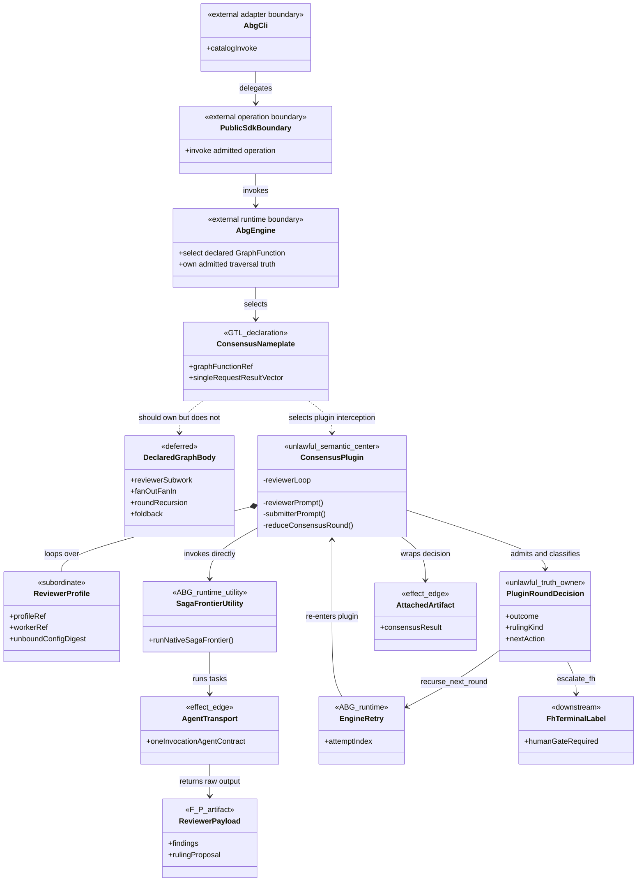
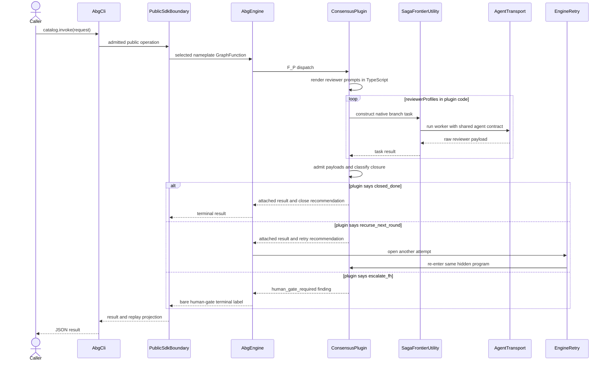
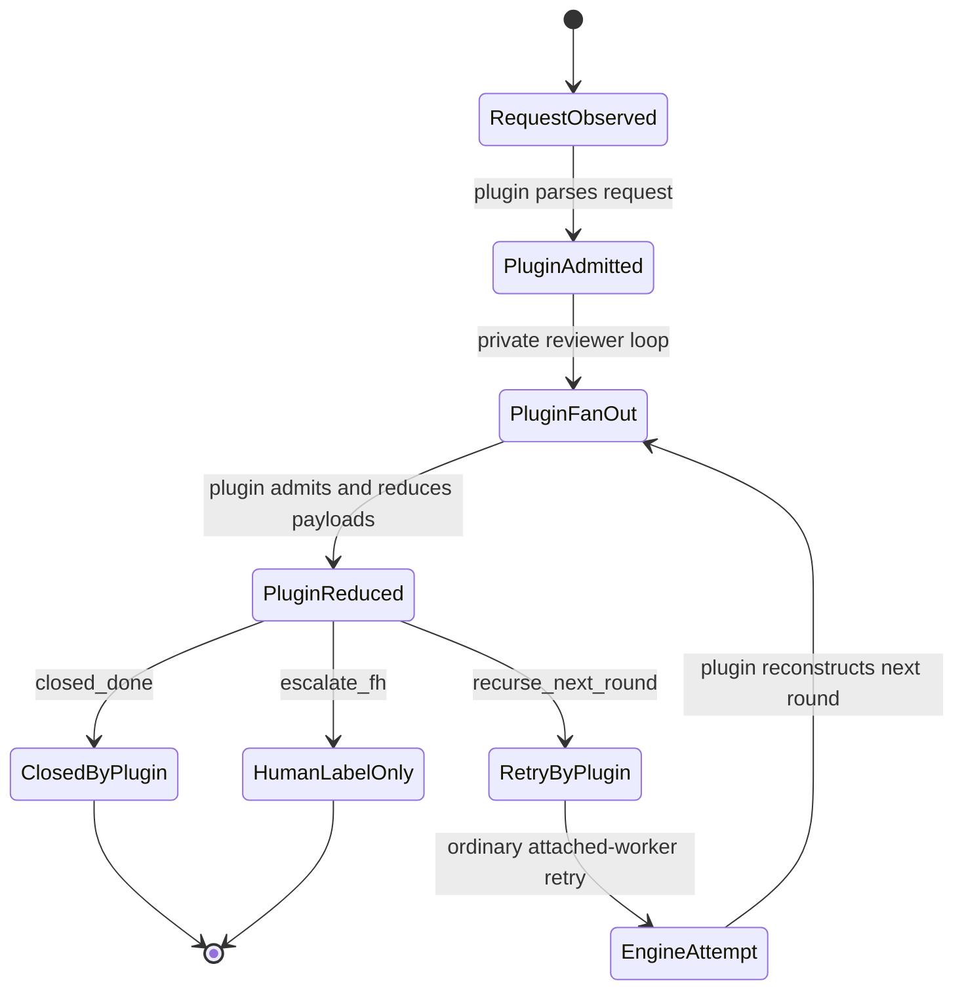

# M03 Consensus Rejected As-Built Behavior Design

**Design verdict**: `rejected`
**Status**: Retrospective calibration of reverted commit `945b5a2`
**Revert**: `2c85a88`
**Owning module claimed by the rejected code**: M03 engine kernel
**Method authority**: `DESIGN_MODULE_METHOD.md` section 5E and [TYPESCRIPT_REALIZATION_GUARDRAILS.md](./TYPESCRIPT_REALIZATION_GUARDRAILS.md)
**Product authority**: `PRODUCT.md` graph-function, configuration, handler, and atom criteria
**Requirements**: `REQ-L-GTL3-C-ALGEBRA`, `REQ-R-ABG3-CCALL`, `REQ-R-ABG3-HANDLERS`

## Boundary

This asset documents why the reverted implementation was the wrong category.
It is not a design for rebuilding Consensus and does not authorize retention of
its contracts, schemas, plugins, tests, or generated publication.

The implementation published a GraphFunction nameplate but placed the
constructive program in a Consensus-specific engine plugin. Drawing that
implementation makes the missing graph, hidden prompt shell, private fan-out,
retry-owned rounds, and plugin-owned closure visible.

## Domain Model

The domain model fails because `ConsensusPlugin` and `PluginRoundDecision` have
no lawful product-layer ownership. `DeclaredGraphBody` is absent from the
implementation even though it is the constructive carrier the feature owes.

## Execution Sequence

This sequence fails the gate at the prompt, reviewer loop, closure, and
recursion messages. They are owned by a plugin rather than declared graph/C
constructors and ABG/F_H transition law.

## Lifecycle State Machine

The round state is reconstructed from plugin inputs and retry attempts. There
is no declared graph recursion state, reviewer GraphCall/Frame lifecycle, or
governed F_H escalation transition.

## Cross-View Invariants

| Check | Evidence | Verdict |
|---|---|---|
| Every sequence participant exists in the domain model or is external | Participants are represented | `pass` |
| Constructive GraphFunction decomposes into declared graph entities | `DeclaredGraphBody` is absent | `fail` |
| Every message names a typed transform, graph/C constructor, interpreter act, or effect boundary | Prompt, fan-out, reduction, and rounds are plugin methods | `fail` |
| Every lifecycle transition names an admitted or replay-derived owner | Plugin owns round and closure transitions | `fail` |
| Raw F_P output cannot transition directly to accepted or closed | Reviewer subwork used a feature-local parser without a declared graph-call response-contract identity | `fail` |
| Plugins and handlers own interiors only | Plugin owns workflow, prompts, recursion, and closure classification | `fail` |
| Batch, retry, recursion, and nested workflow use declared algebra | `C.batch`, `C.retry`, and `workflow.C` were bypassed | `fail` |

## Axiom Evaluation

| Axiom | Authority | Domain evidence | Sequence evidence | State evidence | Native enforcement | Admission/compiler enforcement | Verdict | Gap owner |
|---|---|---|---|---|---|---|---|---|
| Graph functions are the primary constructive carrier | `PRODUCT.md`; ODD method | Nameplate has no body | Engine selects plugin instead of declared traversal | No graph lifecycle | None for hidden body | Compiler never sees body | `fail` | future Consensus design |
| Higher-order panels are free constructions over atoms | PRODUCT atom criterion | New Consensus semantic center in M03 | Plugin performs the whole panel | Plugin owns round machine | Consensus-specific TypeScript | No atom-sufficiency gap emitted | `fail` | GTL/C runtime realization |
| Workflow shape, prompts, contracts, and policy are declarations | `REQ-R-ABG3-HANDLERS-015` | Prompt and workflow live in plugin | Plugin renders prompts and loops reviewers | Plugin reconstructs rounds | Private functions | No declaration admission | `fail` | GTL instruction and C algebra |
| Product code does not implement a standard-path worker loop | `REQ-R-ABG3-HANDLERS` ontology and non-closure | Plugin owns reviewer loop | Loop encloses saga-frontier calls | Loop progression is private | Imperative loop compiles | No semantic compiler visibility | `fail` | future Consensus design |
| `workflow.C`, `C.batch`, and `C.retry` remain honest realization gaps | `REQ-L-GTL3-C-ALGEBRA`; T-220 | Required constructors are absent | Plugin substitutes all three | Retry attempts substitute round recursion | T-220 types expose terms | Compiler reports `semantic_not_realized` only when terms are authored | `fail` | GTL/C runtime realization |
| ABG owns admission, events, continuation, and closure | PRODUCT runtime boundary; `REQ-R-ABG3-CCALL` | Plugin decision is rival closure truth | Plugin recommends close/retry/F_H | Plugin outcome drives terminal path | Typed outcome does not restore authority | Ordinary F_H carrier is bypassed | `fail` | future Consensus design and ABG F_H path |
| Malformed F_P output fails closed through the selected response contract | T-220 malformed-output law | Reviewer subwork has no declared graph-call response-contract carrier | Feature-local parser consumes hidden reviewer calls | Plugin states are not ordinary GraphCall admission states | A strict local parser exists but does not restore the missing declared boundary | Semantic compiler and ordinary response-contract admission never see reviewer subwork | `fail` | future Consensus graph and response-contract design |

## Gap And Exclusion Register

| Gap or exclusion | Why outside or blocking | Owner | Re-entry condition |
|---|---|---|---|
| `workflow.C` runtime realization | Required to compose named reviewer/submission functions | GTL/C runtime | Semantic compiler and interpreter accept the declared lift |
| `C.batch` runtime realization | Required for declared reviewer panel fan-out/fan-in | GTL/C runtime | Batch becomes admitted traversal, not a plugin loop |
| `C.retry` runtime realization | Required for bounded declared rounds | GTL/C runtime | Retry carries explicit termination and foldback law |
| Engine-rendered Consensus instructions | Local prompt shell is forbidden | GTL instruction surface | Prompts are declared instruction categories consumed by standard handlers |
| Governed F_H escalation | A terminal label is not an F_H act or resumable gate | ABG public F_H surface | `FhEscalationTransition` and public response path are used |
| Reviewer subwork response-contract admission | Hidden reviewer calls bypass the declared GraphCall and selected-contract boundary | future Consensus graph design | Each reviewer invocation is declared subwork with an addressable response contract admitted by the standard M03 path |

## Design Verdict

`rejected`. Commit `945b5a2` implemented the feature in the wrong category and
was reverted by `2c85a88`. None of its implementation or contracts is retained
by presumption. A future Consensus design starts from the domain, sequence, and
state models, authors the graph in GTL, and treats every inexpressible step as
a typed gap. No code is authorized by this asset.
