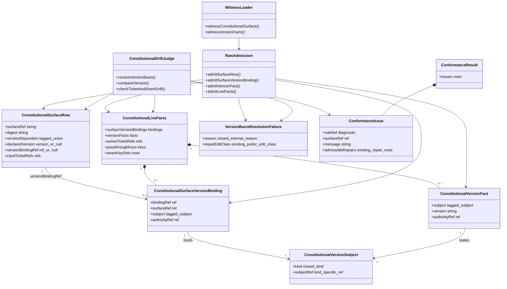
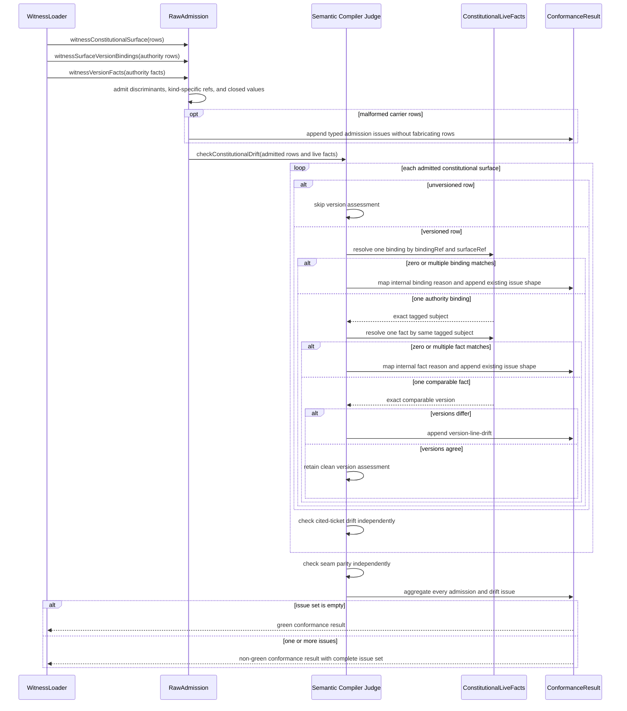
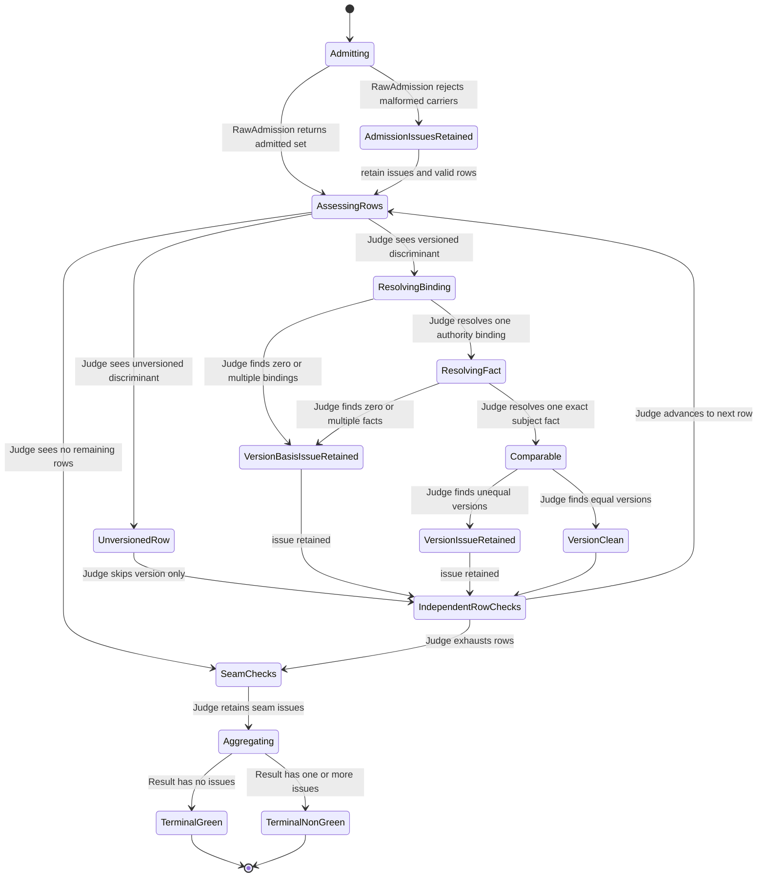

# M03 Constitutional Version Basis Behavior Design

**Status**: Accepted - F_H continuation after independent review `f7148c6`
**Ticket**: T-250
**Requirement re-entry**: `REQ-L-GTL3-LAWS-028`
**IACS**: [M03_GTL_PROGRAM_CONFORMANCE_GATE_FIRST_SLICE_IACS.md](./M03_GTL_PROGRAM_CONFORMANCE_GATE_FIRST_SLICE_IACS.md), [ABG_3_FIRST_SLICE_IACS.md](./ABG_3_FIRST_SLICE_IACS.md)
**Structural carrier**: [M03_GTL_PROGRAM_CONFORMANCE_GATE_STRUCTURAL_CARRIER_DIAGRAM.md](./M03_GTL_PROGRAM_CONFORMANCE_GATE_STRUCTURAL_CARRIER_DIAGRAM.md)

## Purpose

Prevent constitutional drift checks from comparing versions of different
subjects. Mutable source-project facts, immutable published-RC, tapped-release,
and product facts, and stamped installed-product facts remain distinct. A
separate authority-bearing surface binding resolves before the exact subject
fact and version comparison.

## Domain Model



## Authority And Payload Roles

| Carrier or participant | Role | Authority / downstream position |
|---|---|---|
| LAWS-028 plus F_H reprice | version-subject law | authoritative |
| `WitnessLoader` | witnesses surface bytes, external bindings, and facts | upstream witness only; no verdict authority |
| `ConstitutionalSurfaceVersionBinding` | exact surface-to-subject authority declaration | authoritative input under its `authorityRef` |
| `ConstitutionalVersionFact` | exact subject-version telemetry | authoritative fact only for its tagged subject and `authorityRef` |
| `RawAdmission` | closed shape, discriminant, and kind/ref admission | authoritative ingress; no relation or drift verdict |
| `ConstitutionalDriftJudge` | binding/fact resolution and LAWS-028 evaluation | sole drift-decision owner |
| `VersionBasisResolutionFailure` | compiler-internal typed reason mapped to an existing public repair edit class | subordinate internal result shared by raw admission and the judge; not a public carrier or persisted lifecycle |
| `ConformanceIssue` / `ConformanceResult` | existing typed diagnostic rows and aggregate disposition | downstream projection of the judge; public shape is unchanged |
| README, guides, bootloader, and release note | witnessed constitutional/release-facing surfaces | downstream subjects; never self-authorize a binding |

`ConstitutionalSurfaceVersionBinding`, `ConstitutionalVersionSubject`, and
`ConstitutionalVersionFact` are subordinate payloads under the existing prime
`GtlProgramConformanceInput`; they do not become new prime carriers. A basis
reason is compiler-internal typed control data and maps to the existing public
`GtlProgramRepairEditClass`. It is projected through the existing issue
`message` and `admissibleRepairs`, not added to the public issue schema. The
state view below models a pure compiler transform; it does not introduce a
persisted lifecycle carrier. Raw admission owns local discriminant and
kind/ref coherence; the judge owns binding/fact relational cardinality and
version comparison. This boundary has no worker, event, traversal,
materialization, continuation, or closure effect edge.

## Execution Sequence



## Lifecycle State Machine



## Carrier Contract

```ts
type SourceProjectRef = string & { readonly kind: "source_project_ref" };
type PublishedRcCutRef = string & { readonly kind: "published_rc_cut_ref" };
type ReleaseCutRef = string & { readonly kind: "release_cut_ref" };
type ProductRef = string & { readonly kind: "product_ref" };
type InstalledProductRef = string & { readonly kind: "installed_product_ref" };

type ConstitutionalVersionSubject =
  | { readonly kind: "source_project"; readonly subjectRef: SourceProjectRef }
  | { readonly kind: "published_rc_cut"; readonly subjectRef: PublishedRcCutRef }
  | { readonly kind: "release_cut"; readonly subjectRef: ReleaseCutRef }
  | { readonly kind: "product"; readonly subjectRef: ProductRef }
  | { readonly kind: "installed_product"; readonly subjectRef: InstalledProductRef };

interface ConstitutionalSurfaceRowBase {
  readonly surfaceRef: string;
  readonly digest: string;
  readonly citedTicketRefs: readonly string[];
}

type GtlProgramConstitutionalSurfaceRow = ConstitutionalSurfaceRowBase & (
  | {
      readonly versionDisposition: "unversioned";
      readonly declaredVersion: null;
      readonly versionBindingRef: null;
    }
  | {
      readonly versionDisposition: "versioned";
      readonly declaredVersion: string;
      readonly versionBindingRef: string;
    }
);

interface GtlProgramConstitutionalSurfaceVersionBinding {
  readonly bindingRef: string;
  readonly surfaceRef: string;
  readonly subject: ConstitutionalVersionSubject;
  readonly authorityRef: string;
}

interface GtlProgramConstitutionalVersionFact {
  readonly subject: ConstitutionalVersionSubject;
  readonly version: string;
  readonly authorityRef: string;
}

interface GtlProgramConstitutionalLiveFacts {
  readonly surfaceVersionBindings:
    readonly GtlProgramConstitutionalSurfaceVersionBinding[];
  readonly versionFacts: readonly GtlProgramConstitutionalVersionFact[];
  // Existing ticket and seam facts remain.
}

type ConstitutionalVersionBasisReason =
  | "subject_kind_ref_incoherent"
  | "surface_binding_missing"
  | "surface_binding_ambiguous"
  | "version_fact_missing"
  | "version_fact_ambiguous";

const VERSION_BASIS_REPAIR_EDIT_CLASS = {
  subject_kind_ref_incoherent: "correct_reference",
  surface_binding_missing: "add_missing_declaration",
  surface_binding_ambiguous: "remove_duplicate_declaration",
  version_fact_missing: "add_missing_declaration",
  version_fact_ambiguous: "remove_duplicate_declaration"
} as const satisfies Readonly<
  Record<ConstitutionalVersionBasisReason, GtlProgramRepairEditClass>
>;
```

Raw admission brands kind-specific refs once and rejects a kind/prefix mismatch
with `version-basis-unresolved`; its compiler-internal reason is
`subject_kind_ref_incoherent`. The compiler owns relation cardinality: exactly
one separate binding must resolve by `versionBindingRef + surfaceRef`, then
exactly one fact must resolve by the binding's tagged subject. Admission
preserves duplicates as witnessed rows so the judge can report ambiguity; it
never collapses them. The internal reason is rendered into a stable issue
message and selects an existing `GtlProgramAdmissibleRepair`; the public
`GtlProgramConformanceIssue` schema does not gain a `reason` field.

The reason-to-repair mapping is exact in declaration order:

| Compiler-internal reason | Existing public repair edit class |
|---|---|
| `subject_kind_ref_incoherent` | `correct_reference` |
| `surface_binding_missing` | `add_missing_declaration` |
| `surface_binding_ambiguous` | `remove_duplicate_declaration` |
| `version_fact_missing` | `add_missing_declaration` |
| `version_fact_ambiguous` | `remove_duplicate_declaration` |

## Invariants And Axiom Check

| Invariant | Authority | Design consequence |
|---|---|---|
| Source project, published RC cut, tapped release cut, product, and install are distinct subjects | SPEC_METHOD; RELEASE_METHOD | Represent all five kinds and compare only identical tagged subjects. |
| Loaders witness; the semantic compiler judges | LAWS-028 | No second docs checker decides drift. |
| A surface cannot select its own subject authority | No-inference law | Resolve a separate authority-bearing surface binding before the version fact. |
| Missing or ambiguous basis is typed non-green truth | Malformed-input and no-inference law | Admission owns local kind/ref coherence; the judge owns binding/fact cardinality; their compiler-internal reasons map to existing public repairs and issues accumulate with other drift families. |
| Immutable release bytes retain their release identity | RELEASE_METHOD | rc.3 bootloader and note bytes are not relabeled as 5.0 source. |
| Diagnostic evolution is explicit | LAWS-019, LAWS-026 | Retain `version-line-drift`; admit one reasoned `version-basis-unresolved` identity and exact repairs. |
| Installed truth is not inferred | install/product identity law | No installed-product fact exists without exact installed evidence. |
| Independent drift checks are conserved | LAWS-028 | Version failure never suppresses ticket or seam diagnostics. |

## Cross-View Axiom Matrix

| Axiom | Authority | Domain evidence | Sequence evidence | State evidence | Native enforcement | Admission/compiler enforcement | Verdict | Gap owner |
|---|---|---|---|---|---|---|---|---|
| Five version subjects remain distinct | SPEC_METHOD; RELEASE_METHOD | Tagged subject union has source, published RC, tapped release, product, install | Judge compares one identical tagged subject only | `Comparable` follows exact binding and fact resolution | Discriminated union plus kind-specific branded refs | Raw admission validates kind/ref coherence | pass | T-250 |
| Loaders witness and the compiler judges | LAWS-028 | `WitnessLoader`, `RawAdmission`, and `ConstitutionalDriftJudge` are separate | Loader/admission messages precede the one judge call | Admission issues are retained before row assessment | Loader constructs data only | Compiler alone owns relation resolution and drift | pass | T-250 |
| Surface-to-subject authority is separate | No-inference law | Binding row is distinct from surface row and version fact | Judge resolves binding by binding ref and surface ref | `ResolvingBinding` precedes `ResolvingFact` | Versioned row carries binding ref, not subject | Exact binding multiplicity and authority ref are compiler-checked | pass | T-250 |
| Missing or ambiguous basis is non-green | No-inference law | Versioned row, binding, and fact are subordinate typed payloads | Admission maps local incoherence; the judge maps zero/multiple binding or fact into the existing issue shape | Basis issue flows to independent checks then aggregate, including zero-row seam path | Native union forbids partial versioned rows | One diagnostic; compiler-internal reasons map to existing public repair edit classes | pass | T-250 |
| Independent drift families are conserved | LAWS-028 | Result aggregates issue rows | Ticket check runs for every admitted row; seam check runs after rows | Every version path reaches `IndependentRowChecks` | Result is an issue collection, not early-return boolean | Compiler aggregates before terminal verdict | pass | T-250 |
| Immutable rc.3 truth is not rewritten by source advancement | RELEASE_METHOD | Published-RC facts have distinct refs from source and tapped release | rc.3 binding cannot resolve a 5.0 source fact | Only identical subject equality reaches `VersionClean` | Exact tagged refs and versions | Real-tree authority comes from tag/snapshot, not latest inference | pass | T-250 |
| Installed facts require stamped install evidence | SPEC_METHOD install taxonomy | Installed subject is a distinct tagged kind and no current fact is proposed | Loader cannot supply it without an install authority ref | Missing installed basis remains non-green | Closed kind does not imply existence | Binding/fact authority admission requires exact install evidence | pass | T-250 |
| GraphFunction construction checks | ODD/GTL executable design gate | This is a conformance meta-carrier, not a GraphFunction | No traversal, worker, prompt, recursion, or closure path exists | No ABG runtime lifecycle is introduced | No graph carrier added | Existing semantic compiler boundary only | not_applicable | none |

**Design verdict**: `accepted`. The views are internally aligned, render, and
passed independent and F_H review. T-251 closed the ordered entry-proof
prerequisite at `338ba7b`; active realization must preserve this carrier and
ownership boundary.

## Required Differentials

1. Mixed source-project, published-RC-cut, tapped-release-cut, product, and
   installed-product facts are clean when each row resolves its exact binding
   and subject fact.
2. Same-subject unequal versions emit `version-line-drift` while ticket and
   seam checks still run.
3. Missing, duplicate, and kind-incoherent bindings/facts emit
   `version-basis-unresolved`; the stable message identifies the typed internal
   reason and `admissibleRepairs` contains its mapped existing edit class.
4. An unversioned row skips version assessment but still receives ticket and
   seam assessment.
5. A stale surface row plus a matching stale fact fails when no separately
   admitted exact surface binding authorizes that subject.
6. Real-tree source facts bind to the mutable package; rc.3 bootloader and note
   facts bind to exact published-RC evidence.
7. Release-note integrity separately proves title, predecessor, digest,
   manifest release identity, and package version without using mutable source
   version as the comparator.

## Proposed Current-Tree Bindings

| Witnessed surface or fact | Kind | Subject ref | Version authority | Expected version |
|---|---|---|---|---|
| Mutable TypeScript `package.json` version fact and explicitly source-package guide fields | `source_project` | `source-project://abiogenesis/typescript/main` | exact source snapshot plus package manifest; this is mutable source-package metadata, not an operative release version | `5.0.0-dev.0` |
| `AGENTS.md` and `CLAUDE.md` embedded GTL bootloader blocks | `published_rc_cut` | `published-rc-cut://abiogenesis/typescript/4.6.0-rc.3` | byte equality with tag `v4.6.0-rc.3` and rc.3 snapshot/package evidence | `4.6.0-rc.3` |
| Current RC note | `published_rc_cut` | `published-rc-cut://abiogenesis/typescript/4.6.0-rc.3` | exact rc.3 snapshot manifest, note digest, and tag | `4.6.0-rc.3` |
| Published-RC-line labels in README and user/LLM guides | `published_rc_cut` | `published-rc-cut://abiogenesis/typescript/4.6.0-rc.3` | exact rc.3 predecessor record, snapshot manifest, and tag | `4.6.0-rc.3` |
| Tapped release cut | `release_cut` | none | 4.6 did not tap a final release | no fact admitted |
| Released product | `product` | none | no 4.6 final product exists | no fact admitted |
| Installed product | `installed_product` | none | no exact install manifest is bound to this source workspace | no fact admitted |

The table is a design proposal for review, not evidence that a tapped release,
released product, or install exists. Exact loaders derive binding and fact
authority refs from the named immutable evidence; path text, a surface's own
version text, or "latest" inference cannot mint either carrier.

## Separate Release-Note Integrity Proof

Version-basis drift and release-note integrity remain two F_D checks. The
semantic compiler judges whether a versioned surface agrees with the exact
subject fact selected by its authority binding. The focused T-195
RELEASE_METHOD proof separately verifies the rc.3 note title, predecessor,
digest, manifest release identity, manifest package version, and tag. A
version fact's existing `authorityRef` may reference that T-195 evidence
carrier; the proof does not add evidence fields, create a second constitutional
drift judge, or enlarge the version-fact carrier.

## Implementation Break Order

1. Ratify the LAWS-028 wording and the closed subject-kind and diagnostic
   vocabulary.
2. Change the native carrier, raw admission, uniqueness checks, and inventory
   digest coverage together.
3. Migrate constructed differentials before changing the real-tree loader.
4. Bind real-tree facts and repair only role-specific stale guide labels.
5. Run focused T-193/T-195, full semantic, and immutable-rc.3 diff checks.

No intermediate checkpoint may make missing basis fall back to
`package.json` or mutate a release-derived surface to make a test green.

## Pre-Code Applicability

- Python derivation: `not_applicable`; Python is a withdrawn reference and the
  change extends the current TypeScript conformance carrier.
- Prime carriers: the existing `GtlProgramConformanceInput`, admission, issue,
  and result shapes remain prime. Surface binding, tagged subject, version
  fact, and the versioned/unversioned surface-row union are subordinate typed
  payloads under that input; the state diagram is a transform model, not a
  lifecycle carrier.
- Strict typing lane: semantic-strict TypeScript build plus T-193 type and
  runtime differentials.
- Module-derived proof lane: LAWS-028 through the M03 conformance module and its
  existing T-193/T-195 tests.
- Governance versus builder boundary: requirement/F_H owns subject law;
  loaders witness; the compiler judges; release artifacts are immutable inputs.
- Negative proof: missing, duplicate, kind-incoherent, and unequal same-subject
  fixtures all fail closed.

## Non-Scope

No release artifact mutation, universal identity framework, installed fact by
inference, or weakening of ticket/seam drift checks. Implementation remains
blocked until this design and the LAWS-028 reprice are accepted.
