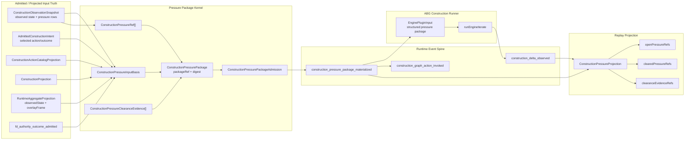

# M03 Construction Pressure Package Structural Carrier Diagram

**Status**: Active
**Date**: 2026-05-16
**Ticket**: T-139

## Authority Notes

- The package derives from admitted or projected runtime truth only.
- Prompt text and display summaries are subordinate renderings.
- `construction_pressure_package_materialized` must precede graph action
  invocation so the action is causally bound to the pressure it received.
- Pressure opens when the package is materialized.
- Pressure clears only from replayed construction delta evidence for the same
  selected intent.
- The downstream product may consume and render the package, but must not own a
  rival pressure package reconstruction path.
