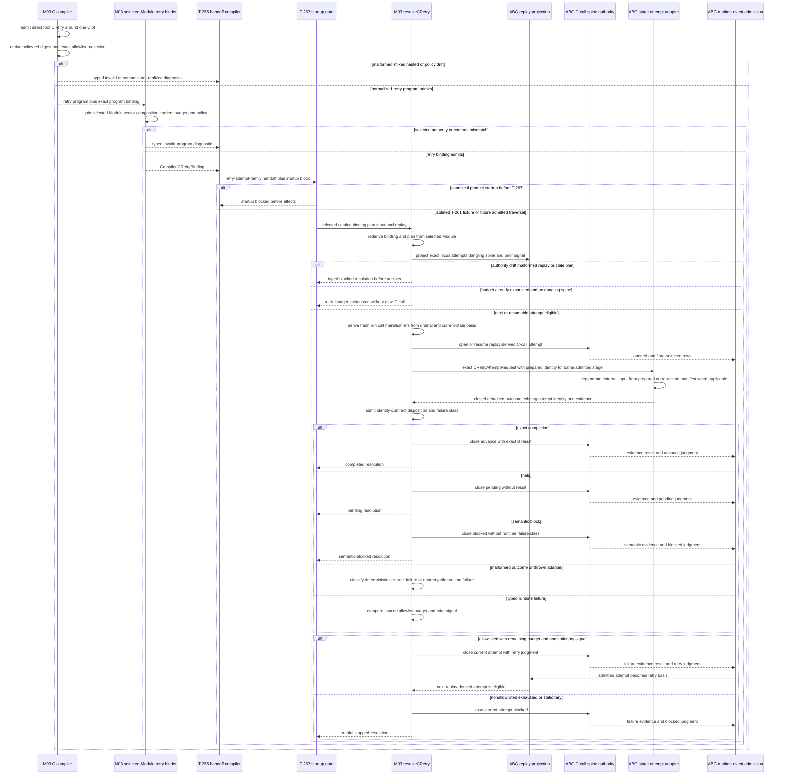
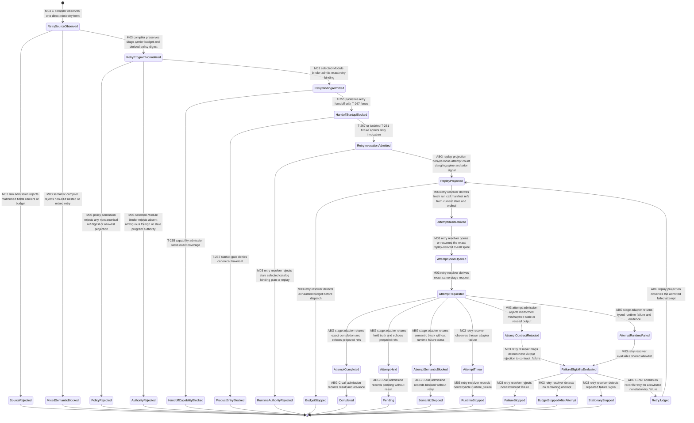

# M03 `C.retry` Runtime And Policy Behavior Design

**Status**: Accepted under delegated F_H authority after bounded self-review
**Date**: 2026-07-13
**Ticket**: `T-261`
**Method authority**: `../../../../.genesis/docs/standards/DESIGN_MODULE_METHOD.md` section 5E
**Tenant authority**: [TYPESCRIPT_REALIZATION_GUARDRAILS.md](./TYPESCRIPT_REALIZATION_GUARDRAILS.md)

## Boundary

This design realizes one generic retry relation:

```text
direct root C.retry(C.of<A,B>(stage), budget)
  -> one normalized retry program preserving A -> B
  -> one selected-Module retry binding
  -> replay-derived attempt eligibility at the exact C-call locus
  -> repeated invocation of the same admitted stage contract
  -> advance, pending, semantic block, runtime block, or budget stop
```

The `budget` is the maximum number of invoking C-call attempts, including the
first attempt. It is a positive authored value. Budget `1` invokes once and
cannot retry; budget `2` permits one further attempt after one admitted
retryable failure. The runtime evaluates the budget before dispatching the
next expensive attempt.

Retry eligibility comes from one shared typed authority:

```text
RETRYABLE_RUNTIME_FAILURE_CLASS_VALUES
  = transport_failure | no_output | contract_failure
```

The normalized program and runtime plan carry a digest-bound projection of
that authority. They do not admit an authored, caller-supplied, per-stage, or
per-fibre allowlist. A semantic dispute, held interaction, non-retryable
runtime failure, exhausted budget, or stationary repeated failure never
re-enters the stage through `C.retry`.

This ticket makes the unchanged T-252 review-one-profile term statically
compilable while retaining its authored budget `2` and the exact shared
allowlist. It does not authorize canonical product effects. T-267 remains the
startup and traversal-conservation gate, T-262 still owns typed recursion, and
T-268 still owns tenant-conformance publication.

### Requirements

- `REQ-L-GTL3-C-ALGEBRA-001`, `-008`, `-009`, `-014`, and `-016`
- `REQ-L-GTL3-LAWS` T-200 one-allowlist amendment
- `REQ-R-ABG3-CCALL-001`, `-004`, `-008`, `-009`, `-013`, and `-014`
- `REQ-R-ABG3-RETRY-001..-009`
- `REQ-R-ABG3-LINEAGE-002`
- `T-261` gap family `c_retry_runtime_and_policy_join`

### Explicit exclusions

- a Consensus reviewer loop, panel term, product branch, or retry default;
- a second retryable-failure allowlist or copied policy value home;
- retry because semantic findings disagree, remain open, or fail to converge;
- inference of failure class from prose, missing fields, null payload, or
  stage fibre;
- caller-authored attempt count, remaining budget, or retry eligibility;
- reuse of the outer engine attempt as the C-call retry attempt;
- unbounded retry, backoff, timers, scheduling, concurrency, leases, or
  cancellation;
- direct workspace, prompt, or actor-manifest construction inside the retry
  semantic kernel;
- replacement of the existing graph-level `RetryRepairDecision` authority;
- arbitrary `C.retry` around compose, edge, workflow, batch, recurse, or a
  nested retry. T-261 realizes the direct root wrapper over one `C.of` leaf
  demanded by the current canonical body;
- top-level `TraversalUnit` and result conservation owned by T-267; and
- tenant capability publication owned by T-268.

## Design Decisions

### D1. Retry is a closed normalized HoG program variant

`HogProgramDeclaration` gains one direct-retry variant:

```text
HogRetryProgramDeclaration
  = empty stages
  + one HogRetryDeclaration

HogRetryDeclaration
  = positive maxAttempts
  + one direct HogProgramStage
  + retryPolicyRef
  + retryPolicyDigest
```

The stage is the exact wrapped `C.of` leaf. It retains role, fibre, arm,
result-bearing status, instruction categories, and input/output carrier refs.
The wrapper preserves the same carrier pair. The policy ref and digest derive
from the shared typed allowlist at compile time; raw admission recomputes and
compares them rather than trusting serialized policy truth.

Only a direct root `c_retry` wrapping one direct `c_of` lowers in T-261.
Nested or mixed retry terms retain `gtl-c-unrealized-retry` before effects.
Flat, workflow, and batch normalized variants remain unchanged, and the flat
runner rejects retry as a non-flat program.

### D2. One selected-Module binding joins syntax, policy, and execution locus

`compileCRetryBinding` consumes:

- the admitted normalized retry program;
- the exact T-254 program binding;
- the declaration-owning GraphFunction and GraphVector inside one selected
  Module;
- the exact composition selection;
- the target carrier binding; and
- the shared retry-policy projection.

It emits one immutable `CompiledCRetryBinding` whose digest covers the Module,
GraphFunction, vector, program, stage, carrier pair, composition, budget, and
policy digest. The T-255 handoff exposes this binding and a distinct
`retry_attempt_family` disposition. Runtime rederives the binding from the
already selected public catalog entry before any attempt. It never searches
other entries for a matching stage or helper.

### D3. The retry plan is a projection, not a policy authority

`compileCRetryPlan` projects the accepted binding into one
`CompiledCRetryPlan`. The plan carries:

```text
planRef
bindingRef
programRef
stageRole
regime
armId
inputCarrierRef
outputCarrierRef
maxAttempts
retryPolicyRef
retryPolicyDigest
retryableFailureClasses derived snapshot
```

The class list is a read-only projection used for evidence and public
inspection. Plan admission recomputes it from
`RETRYABLE_RUNTIME_FAILURE_CLASS_VALUES` and requires exact order, membership,
ref, and digest. The plan cannot widen or narrow policy.

### D4. Replay owns attempt number and budget consumption

`resolveCRetry` identifies one exact C-call locus from parent basis,
GraphCall, frame, vector, stage role, and task ordinal. Before each attempt it
projects replay at that locus:

- a dangling open spine resumes under its existing attempt identity;
- otherwise the next attempt is one greater than the count of admitted opens;
- attempts opened before the current process count against the budget; and
- a caller-supplied or outer engine attempt cannot override that count.

The attempt ordinal is therefore replay-global per locus. The runtime checks
`openedAttempts < maxAttempts` before requesting another attempt. Exhaustion
returns a typed blocked resolution without opening a new spine or invoking the
adapter.

### D5. ABG prepares fresh attempt identity before the effect edge

The retry resolver derives one closed `CRetryAttemptBasis` before invoking the
stage adapter. It combines the replay-derived ordinal with the exact plan,
parent locus, input payload, and current `attemptStateRef` to mint fresh:

```text
attemptRunRef
cCallRef exact spine identity
attemptManifestRef
attemptStateRef current input basis
```

The run, C-call, and manifest refs include the attempt ordinal and basis
digest; they cannot equal a prior attempt at the same locus. `cCallRef` is the
existing C-call spine identity, not a rival attempt-call namespace. The
resulting
`CRetryAttemptRequest` contains that prepared basis, selected Module identity,
exact stage contract, maximum attempts, prior admitted failure projection, and
C-call identity. The stage adapter owns only the attempt interior. It must echo
the prepared refs and provide admitted evidence. For prompt-bearing or external
work it regenerates its prompt and invocation input from the declared current
state and prepared manifest. For a purely deterministic interior, the same
refs identify the fresh ABG attempt envelope and current input basis rather
than pretending that an actor prompt exists.

Every local attempt retains the admitted invocation's exact A input and state
basis. Freshness comes from the replay-derived ordinal and new run, C-call, and
manifest identity, not by silently replacing A between attempts. When an outer
same-edge repair changes workspace or input state, the existing graph repair
authority opens a fresh invocation with a new admitted A basis. A dangling
spine therefore rederives the same local attempt basis from replay; mutable
caller state cannot silently change an uncertain in-flight effect. Malformed
output cannot erase attempt identity because ABG knew the basis before
dispatch and can close the C-call truthfully.

The adapter does not decide whether another attempt is lawful, emit C-call
truth, consume budget, or close the retry resolution. Existing graph-level
repair remains responsible for workspace mutation, prompt regeneration,
continuation repair, and fresh graph run/call/manifest construction when a
same-edge repair leaves this local C-call boundary.

### D6. Attempt outcomes are a closed semantic/runtime union

The raw attempt result admits into exactly one variant:

```text
completed
  = exact B payload + response contract + echoed attempt refs + evidence

held
  = no B payload + reason + echoed attempt refs + evidence

semantic_blocked
  = no B payload + typed semantic reason + echoed attempt refs + evidence
  + no runtime failure class

runtime_failed
  = no B payload + RuntimeFailureClass + failureSignalRef
  + reason + echoed attempt refs + evidence
```

`transport_failure`, `no_output`, and `contract_failure` are retryable only
because the shared allowlist admits them. Timeout and transport classes must be
mapped before the outcome reaches this resolver. `contract_failure` requires
deterministic output admission evidence. A malformed returned outcome is
itself deterministically classified as `contract_failure`; a thrown adapter
error is `runtime_failure` and stops rather than being guessed into the
allowlist.

For a runtime failure, `c_call_result_admitted.outcomeStatus` is the exact
typed failure-class value and `c_call_judged.reasonRef` is the admitted
`failureSignalRef`. Replay therefore needs no prose parser or second retry
event. Attempt identity and general diagnostic evidence remain evidence refs;
they do not contaminate progress comparison.

Semantic findings never carry `RuntimeFailureClass`. A semantic block closes
the C call with `blocked`, not `retry`, even when the stage uses `F_P`.

### D7. One C-call spine closes every attempt truthfully

Each attempt uses the existing five-row C-call spine. Its close judgment is:

| Outcome | Judgment | Retry decision |
|---|---|---|
| exact completion | `advance` | stop completed |
| held | `pending` | stop pending |
| semantic block | `blocked` | stop blocked |
| non-allowlisted runtime failure | `blocked` | stop runtime-blocked |
| allowlisted failure with remaining budget and new signal | `retry` | open next attempt |
| allowlisted failure at budget or stationary signal | `blocked` | stop exhausted or stationary |

Every retry judgment therefore has a following eligible attempt. The last
attempt is never judged `retry` after the resolver already knows that no next
attempt is lawful. Evidence records the attempt refs, failure class when
present, policy ref/digest, and reason; result and judgment rows retain the
exact failure class and signal ref needed for replay projection.

### D8. Stationary failure stops before another expensive attempt

For each admitted runtime failure, the resolver derives a stable failure
signal digest from the typed failure class and admitted `failureSignalRef`. A
candidate retry is stationary when that digest equals the immediately
preceding retryable failure signal. Replay obtains both fields from the joined
C-call result and judgment rows. Fresh run, call, manifest, and diagnostic
evidence refs cannot manufacture apparent progress, and stationarity cannot be
supplied by the caller.

The resolver evaluates stationarity together with budget and allowlist before
the next adapter call. It returns a typed `stationary_failure` stop rather than
silently looping or escalating. Product-specific escalation remains a
declared traversal or F_H concern outside this atom.

### D9. T-262, T-267, and T-268 remain visible

T-261 removes only `c_retry_runtime_and_policy_join` from the T-252 census.
Typed recurse remains a T-262 gap. Every canonical handoff remains
`startup_blocked_awaiting_t267`, and T-261 proof invokes only isolated generic
fixtures. Tenant conformance coverage remains T-268 work. No generated proof
may claim product traversal or Consensus completion from this local atom.

## Irreducible Architectural Carrier Set

| Carrier | Visibility | Authority | Role |
|---|---|---|---|
| admitted direct `CRetryNode` | GTL authored input | prime | exact wrapper, preserved carrier pair, and positive budget |
| shared retryable-failure allowlist | ABG typed constant | authoritative | sole retryability value home |
| retry-policy projection | M03 compiler | subordinate | stable ref/digest and exact class snapshot derived from authority |
| `HogRetryProgramDeclaration` | normalized M03 program | subordinate | closed direct-root retry representation |
| `CompiledCRetryBinding` | M03 selected-Module binder | prime | exact Module, program, stage, composition, carrier, budget, and policy join |
| `CompiledCRetryPlan` | M03 semantic kernel | prime | immutable runtime plan rederived before effects |
| `CatalogExecutionBinding` | admitted runtime catalog | authoritative | selected public entry and exact Module |
| replayed C-call events | ABG event authority | authoritative | attempts consumed, dangling spine, prior outcome, and signal evidence |
| `CRetryAttemptBasis` | M03 retry resolver | authoritative runtime identity | fresh run, call, manifest, and current-state basis for one ordinal |
| `CRetryAttemptRequest` | internal M03 effect edge | effect-edge | exact same-stage request for one replay-derived attempt |
| `CRetryAttemptOutcome` | ABG-admitted adapter output | subordinate evidence | completion, hold, semantic block, or typed runtime failure |
| C-call close rows | ABG event authority | authoritative | evidence, result, and judgment for one attempt |
| `CRetryResolution` | M03 runtime result | downstream | completed or truthful non-success across the bounded family |
| graph-level `RetryRepairDecision` | existing M03 repair authority | authoritative adjacent | workspace/manifest/continuation repair outside local C retry |
| `TraversalStartupBlock` | T-255/T-267 boundary | authoritative block | prevents canonical effects before conservation closes |

## Domain Model

```mermaid
classDiagram
  direction LR

  class DirectCRetryNode {
    <<prime>>
    +inputCarrierRef
    +outputCarrierRef
    +budget positive
    +term direct COf
  }
  class RetryableFailureAllowlist {
    <<authoritative>>
    +transport_failure
    +no_output
    +contract_failure
  }
  class RetryPolicyProjection {
    <<subordinate>>
    +policyRef
    +policyDigest
    +failureClasses exact
  }
  class HogRetryProgramDeclaration {
    <<subordinate>>
    +programRef
    +stage
    +maxAttempts
    +policyDigest
  }
  class CompiledCRetryBinding {
    <<prime>>
    +bindingRef
    +moduleDigest
    +graphFunctionRef
    +graphVectorRef
    +compositionRef
    +carrierRefs
    +maxAttempts
    +policyDigest
  }
  class CompiledCRetryPlan {
    <<prime>>
    +planRef
    +bindingRef
    +stageRole
    +regime
    +armId
    +maxAttempts
    +policyDigest
  }
  class CatalogExecutionBinding {
    <<authoritative>>
    +selectedEntryRef
    +moduleName
    +moduleDigest
  }
  class ReplayedCCallEvents {
    <<authoritative>>
    +attemptsOpened
    +danglingAttempt optional
    +priorFailureSignal optional
  }
  class CRetryAttemptBasis {
    <<authoritative-runtime-identity>>
    +attemptOrdinal
    +attemptRunRef
    +cCallRef
    +attemptManifestRef
    +attemptStateRef
  }
  class CRetryAttemptRequest {
    <<effect-edge>>
    +planRef
    +cCallRef
    +attemptOrdinal
    +attemptRunRef
    +attemptManifestRef
    +attemptStateRef
    +sameStageContract
    +priorFailure optional
  }
  class CRetryAttemptOutcome {
    <<subordinate>>
    +disposition
    +freshAttemptRefs
    +payload optional
    +failureClass optional
    +failureSignalRef optional
    +evidenceRefs
  }
  class CCallRuntimeEvents {
    <<authoritative>>
    +opened
    +fibreSelected
    +evidenced
    +resultAdmitted
    +judged
  }
  class CRetryResolution {
    <<downstream>>
    +status
    +attempts
    +payload optional
    +reason optional
  }
  class RetryRepairDecision {
    <<adjacent-authority>>
    +freshGraphRunCallManifest
    +currentWorkspaceProjection
    +continuationRepair
  }
  class TraversalStartupBlock {
    <<authoritative>>
    +effectsPermitted false
  }
  class TypedRecurseRuntime {
    <<deferred>>
    +owner T262
  }

  DirectCRetryNode --> HogRetryProgramDeclaration : M03 normalizes
  RetryableFailureAllowlist --> RetryPolicyProjection : M03 derives exact projection
  RetryPolicyProjection --> HogRetryProgramDeclaration : compiler binds digest
  HogRetryProgramDeclaration --> CompiledCRetryBinding : selected Module binds
  CatalogExecutionBinding --> CompiledCRetryBinding : selects exact authority
  CompiledCRetryBinding --> CompiledCRetryPlan : M03 projects and seals
  ReplayedCCallEvents --> CompiledCRetryPlan : resolver derives eligibility
  CompiledCRetryPlan --> CRetryAttemptBasis : resolver derives fresh identity
  ReplayedCCallEvents --> CRetryAttemptBasis : supplies ordinal and current basis
  CRetryAttemptBasis --> CRetryAttemptRequest : resolver owns request identity
  CRetryAttemptRequest --> CRetryAttemptOutcome : ABG adapter executes interior
  CRetryAttemptOutcome --> CCallRuntimeEvents : resolver admits and closes
  CCallRuntimeEvents --> ReplayedCCallEvents : event admission becomes replay truth
  CCallRuntimeEvents --> CRetryResolution : resolver projects bounded result
  RetryRepairDecision ..> CRetryAttemptBasis : graph repair supplies admitted current state when applicable
  TraversalStartupBlock ..> CompiledCRetryPlan : blocks canonical product entry
  TypedRecurseRuntime ..> CRetryResolution : remains separate successor
```



## Execution Sequence



The compiler and binder own static meaning. Replay and the retry resolver own
eligibility. The adapter owns only one attempt interior. Event admission owns
attempt truth. Graph-level repair remains separately authoritative for
workspace, prompt, manifest, and continuation regeneration.

## Lifecycle State Model



Every transition names its compiler, admission, binder, handoff, gate,
resolver, replay projection, adapter, or event owner. There is no semantic-gap
to retry transition, no caller-local budget transition, and no retry judgment
without a remaining replay-derived attempt.

## Cross-View Checks

| Check | Evidence | Verdict |
|---|---|---|
| Every sequence participant exists in the domain model or is an owned boundary | compiler, binder, handoff, gate, retry resolver, replay, spine, adapter, events, and graph repair map to modeled carriers or authorities | `pass` |
| Every lifecycle carrier exists in the domain model | source, normalized program, binding, plan, replay, request, outcome, events, resolution, and startup block are represented | `pass` |
| Every transition names its owner | all state edges name M03, T-255, T-267, ABG replay, adapter, or C-call admission | `pass` |
| Retry preserves the exact C contract | wrapper, normalized stage, binding, request, and completion retain the same input/output refs | `pass` |
| One allowlist owns retryability | plan projection derives from and revalidates the shared typed constant | `pass` |
| Replay owns attempts | count, dangling resume, budget use, and prior signal derive at the exact locus | `pass` |
| Semantic disagreement cannot retry | semantic outcome has no runtime failure class and transitions only to blocked stop | `pass` |
| Budget is checked before effects | exhausted state has no spine-open or adapter edge | `pass` |
| Stationary failure cannot loop | prior and current admitted signal digests are compared before next request | `pass` |
| Selected catalog authority remains exact | runtime rederives binding within one selected digest-bound Module | `pass` |
| Adapter cannot mint runtime truth | outcome is subordinate until resolver admission and C-call event closure | `pass` |
| Graph repair is not duplicated | existing repair authority remains adjacent and supplies current attempt truth only when applicable | `pass` |
| Product effects remain fenced | T-267 block appears in all three views | `pass` |

## Axiom Evaluation

| Axiom | Authority | Domain evidence | Sequence evidence | State evidence | Native enforcement | Admission/compiler enforcement | Verdict | Gap owner |
|---|---|---|---|---|---|---|---|---|
| Retry preserves `C<A,B>` | `C-ALGEBRA-008` | source, binding, plan, request, and result retain one carrier pair | binder validates before runtime | carrier mismatch enters rejection | native `C.retry` constructor | raw admission and selected-Module rederivation | `pass` | none |
| Budget is positive and bounded | `C-ALGEBRA-008`; `RETRY-004/-006/-009` | one positive max-attempt field | resolver checks before dispatch | exhausted states have no effect edge | native positive-integer guard | raw admission and replay budget projection | `pass` | none |
| One shared allowlist governs every fibre | `CCALL-009`; Laws amendment | one authority and one derived projection | no per-stage or per-fibre branch | every failure enters one eligibility state | closed `RuntimeFailureClass` union | exact ref/digest/class comparison | `pass` | none |
| Semantic dispute never retries | ticket exit; `C-ALGEBRA-008` | semantic outcome excludes failure class | semantic branch closes blocked | no semantic-to-retry edge | discriminated outcome union | cross-field outcome admission | `pass` | none |
| Attempt count is replay-global per locus | `CCALL-004`; `RETRY-007` | replay projection is authoritative | resolver queries replay before each attempt | no caller-count state | immutable locus carrier | replay join and dangling-spine admission | `pass` | none |
| Retry judgment implies a lawful next attempt | `CCALL-008`; `RETRY-009` | plan retains remaining budget and policy | eligibility evaluated before retry close | retry edge exists only from eligible state | closed judgment vocabulary | resolver checks allowlist budget and stationarity | `pass` | none |
| Fresh attempt identity is preserved | `RETRY-001/-002` | prepared attempt basis carries run call manifest and state refs | resolver mints before dispatch; adapter regenerates and echoes | reused stale or mismatched refs reject | closed required refs | deterministic identity derivation and detached outcome checks | `pass` | none |
| Timeout and contract failures are typed before retry | `RETRY-008` | runtime outcome carries one failure class and evidence | adapter maps before resolver; malformed output maps deterministically | only typed runtime failure reaches eligibility | closed failure vocabulary | outcome admission and deterministic rejection path | `pass` | none |
| Stationary failure stops | `RETRY-006` | prior signal projection is replay-owned | resolver compares before next request | stationary has terminal stop only | stable digest carrier | evidence-derived signal comparison | `pass` | none |
| Selected Module owns runtime identity | catalog and T-255 law | binding covers exact selected Module | runtime rederives before replay/effects | authority drift terminates | no all-catalog input | selected-entry resolver and exact digest checks | `pass` | none |
| ABG owns retry control and event truth | `RETRY-004/-005`; ODD law | adapter is effect-edge only; events authoritative | resolver decides and spine records | adapter cannot transition directly to success or retry | closed request/outcome unions | result admission and event factories | `pass` | none |
| Existing graph repair remains authoritative | `RETRY-001..-007` | separate adjacent `RetryRepairDecision` carrier | local resolver consumes current attempt truth without rebuilding repair planner | no local workspace-repair state | distinct module types | boundary validation and proof fixtures | `pass` | none |
| Unresolved semantics stop before effects | `C-ALGEBRA-016` | mixed retry and startup block explicit | compiler and gate precede adapter | both terminate before attempt | closed normalized union | semantic compiler and T-267 gate | `pass` | T-262 and T-267 remain |
| Closure is proportional to current demand | T-261 boundary | direct root retry over one leaf only | no scheduler backoff or product loop | unsupported shapes stop | no base-algebra redesign | focused generic and T-252 probes | `pass` | future mixed-expression owner if demanded |

## Proof Contract

T-261 closure requires:

1. one direct root `C.retry(C.of(...), budget)` lowers to the closed retry
   program variant while flat, workflow, and batch serialization remains
   unchanged;
2. zero, negative, fractional, wrong-carrier, nested, mixed, or non-`C.of`
   retry terms fail before effects;
3. policy ref, digest, ordering, membership, copied allowlist, per-fibre
   override, or caller-supplied eligibility drift fails before effects;
4. the exact selected Module, GraphFunction, GraphVector, program,
   composition, stage, and carrier pair rederive before runtime;
5. replay-derived attempt count and dangling-spine resume reject caller-local
   and outer-engine attempt drift;
6. budget `1` invokes once, budget `2` invokes at most twice, and exhausted
   replay opens no further spine or adapter call;
7. completed, held, semantic-blocked, allowlisted runtime-failed,
   non-allowlisted runtime-failed, malformed, thrown, exhausted, and
   stationary outcomes each close with the declared judgment and no false
   result truth;
8. only `transport_failure`, `no_output`, and `contract_failure` can produce a
   retry judgment, and every such judgment has a subsequent eligible attempt;
9. semantic disagreement never retries regardless of fibre or remaining
   budget;
10. each attempt preserves the same stage and carrier pair, uses fresh attempt
    refs, emits exactly one C-call spine, and retains policy and failure
    evidence;
11. a non-Consensus correction fixture fails once with an admitted retryable
    class, regenerates current attempt truth, then completes on the second
    attempt;
12. the existing graph retry-repair unit lane remains green and no duplicate
    workspace or manifest planner is introduced;
13. the unchanged T-252 body digest remains exact, budget `2` and the exact
    shared allowlist are observed from compiler/runtime authority, and only
    `c_retry_runtime_and_policy_join` leaves the census;
14. typed recurse, traversal conservation, and tenant conformance remain owned
    by T-262, T-267, and T-268; every canonical handoff remains startup
    blocked; and
15. focused T-261, T-252, GTL, T-223, semantic, TypeScript, publication,
    Mermaid, lint, and diff gates pass.

## Design Verdict

`accepted`. The design is intentionally narrower than a general retry
scheduler or arbitrary nested C interpreter. It preserves one C contract,
derives eligibility from replay plus one typed allowlist, closes every attempt
through the existing C-call spine, and retains graph-level repair as a
separate authority. Bounded self-review repaired attempt-identity ownership
and replay-stationarity ambiguity before acceptance. Delegated F_H authority
permits implementation against this exact boundary.
