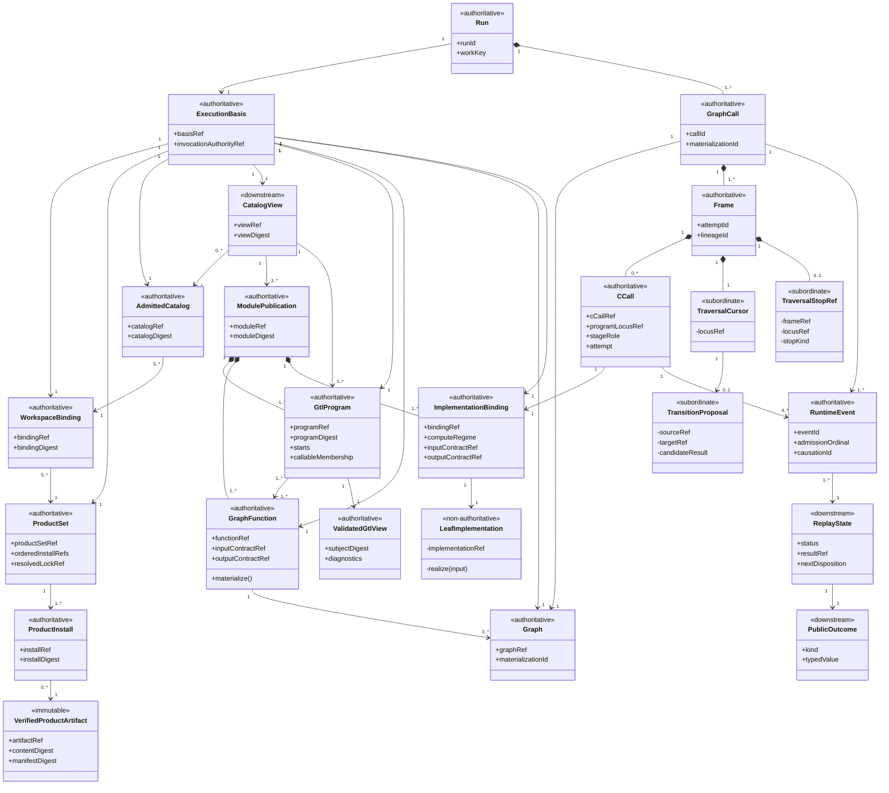
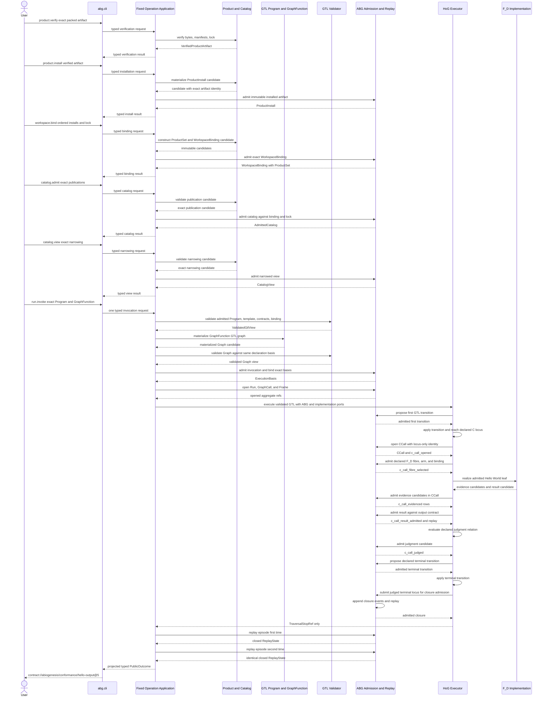
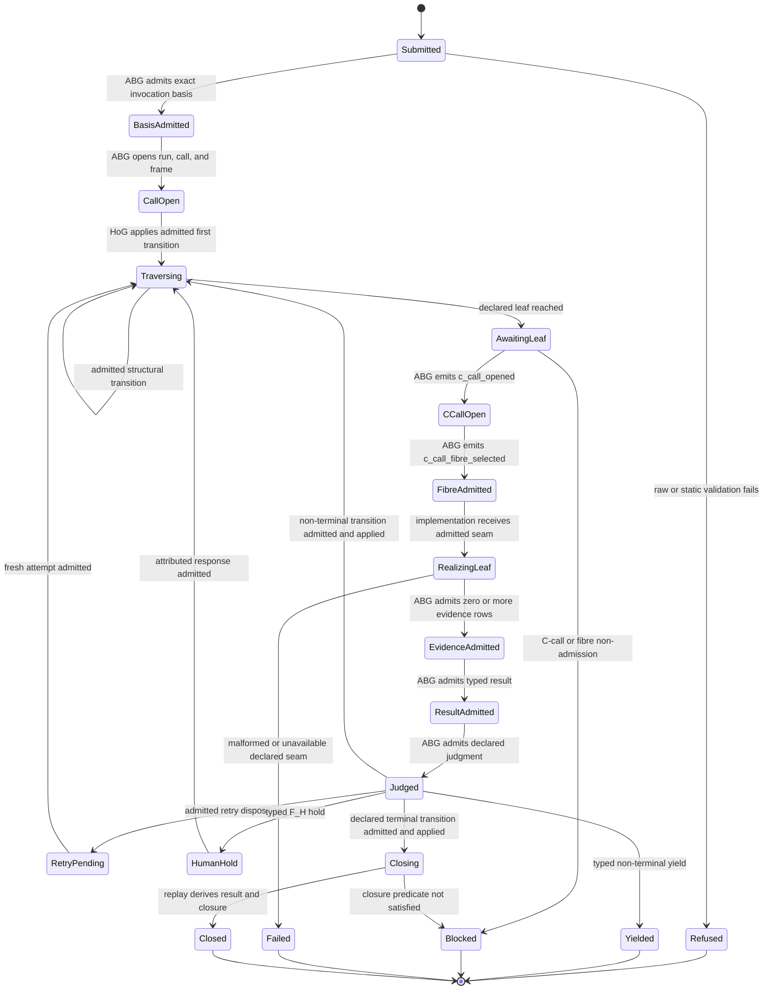

# M03 Direct GTL Traversal Behavior Design

## Status

| Field | Value |
|---|---|
| Ticket | T-285 |
| Change class | design_reframe |
| Boundary | direct GTL validation, traversal, runtime admission, replay, and public projection |
| Product basis | accepted ABIogenesis 5.0 Product |
| Requirement basis | accepted T-284 aggregate c0dcdc264db854f5a4d4f429a35a96e8bd8b4f9481a05cdf532cdfee60722473 |
| Correction basis | 048a9fbca17736a544b4f3af9aabdbdf00a13ce41dd003d8cb29a015556466f4 |
| Design status | candidate; independent review and direct F_H acceptance pending |
| Implementation authority | none until this exact design is accepted |

This document is the single candidate M3 realization surface. It derives HOW
from accepted Product and requirements. It does not amend Product meaning,
requirements, the root outcome, or donor disposition.

## 1. Design Claim

ABIogenesis 5.0 needs one execution relation:

```text
admitted GTL.TypeScript
  -> non-lowering validation
  -> ABG invocation admission
  -> direct HoG traversal
  -> ABG C-call opening and declared-fibre admission
  -> declared implementation seam
  -> ABG evidence, result, judgment, transition, and closure admission
  -> replay-derived continuation or terminal outcome
  -> thin public projection
```

The GTL composition is the program. HoG is its executor. ABG is the sole
runtime-truth substrate. No compiler, generated program, SDK, CLI, catalog,
plugin, worker, fixture, or feature runner owns another execution relation.

The first realization slice is exact ABI5-ROOT-001: one packed all-F_D Hello
World GraphFunction through clean installation, catalog admission, direct HoG
traversal, ABG replay, and typed CLI outcome. The design preserves extension
points for the retained traversal algebra without implementing those deferred
families in the first slice.

## 2. Constitutional Derivation

| Design claim | Owning authority |
|---|---|
| GTL.TypeScript is the sole program language | PRODUCT, GTL Language Contract |
| a GTL composition is the program | PRODUCT, REQ-L-GTL3-CONTRACT-LAW-API-003 |
| GraphFunction is the sole named callable and publishes a replayable graph template | PRODUCT, REQ-L-GTL3-CONTRACT-LAW-API-004 |
| validator checks whole-program law without lowering | PRODUCT Validation Contract, REQ-L-GTL3-CONTRACT-LAW-API-009 and 016 |
| HoG directly traverses admitted GTL | PRODUCT HoG, REQ-L-GTL3-CONTRACT-LAW-API-010, REQ-R-ABG3-INTERPRET-005 |
| ABG owns runtime admission and truth | PRODUCT ABG, REQ-L-GTL3-CONTRACT-LAW-API-011, REQ-R-ABG3-INTERPRET-009 |
| implementation bindings realize leaf seams only | PRODUCT Module, Catalog, And Implementation; REQ-L-GTL3-CONTRACT-LAW-API-007 |
| public ingress cannot own control | PRODUCT SDK And CLI, REQ-R-ABG3-INTERPRET-011 |
| events are the only written runtime truth | REQ-R-ABG3-EVENTS-001 through 006 |
| replay and Event Calculus derive state | REQ-R-ABG3-EVENTS-018 and 027; PRODUCT HoG And ABG Runtime Contract |
| exact product, workspace, program, callable, and implementation bases precede traversal | REQ-R-ABG3-INTERPRET-002 and REQ-R-ABG3-BINDING-003 through 007 |
| direct root is ABI5-ROOT-001 R1 through R10 | PRODUCT Root Product Outcome, REQ-P-SCENARIOS-008 |

## 3. Boundary And Deferred Scope

### In the M3 boundary

- Product, install, workspace, and narrowed catalog binding needed by the root.
- GTL Program, GraphFunction, Graph, GraphVector, C.of, and one all-F_D leaf.
- Native TypeScript checking, raw admission, and non-lowering GTL validation.
- Invocation, run, GraphCall, Frame, C-call, event, replay, and closure truth.
- Direct HoG traversal and traversal-monad bind.
- One typed SDK contract and an abg.cli projection.
- Positive intended-authority proof and real-path rival-authority mutations.

### Deferred without loss of identity

| Family | Deferred realization gate |
|---|---|
| remaining graph relations and six remaining C constructors | M5 traversal-conservation expansion after root green |
| F_P worker transport and B-001 conservation | before the first F_P Product slice |
| F_H hold, response, and same-run continuation | ABG5-S03 |
| One Surface recursive supervision | ABG5-S03 after generic continuation |
| Consensus | ABG5-S05 through ordinary GTL and runtime paths |
| complete public operation family | after the root contract is stable; no new controller |
| qualification and release | M6 and M7 |

Deferred means not implemented in the root slice. It does not mean deleted,
weakened, or delegated to imperative glue.

## 4. Candidate Ontology

### 4.1 Entities And Relationships

| Identity | Kind | Authority | Required relationship |
|---|---|---|---|
| VerifiedProductArtifact | immutable verification result | Product verification | binds exact packed bytes, descriptor, contribution, dependency, compatibility, and content identities without installing them |
| ProductInstall | authoritative entity | product.install plus ABG artifact admission | materializes one VerifiedProductArtifact under one immutable installed product identity |
| ProductSet | authoritative entity | Product workspace contract | contains an ordered non-empty set of exact ProductInstall identities plus its resolved lock |
| WorkspaceBinding | authoritative entity | Product contract and ABG admission | immutably joins workspace authority to ProductSet, resolved lock, and declared roots |
| ModulePublication | authoritative declaration | GTL module | publishes Program, GraphFunction, Graph, contracts, and implementation references |
| AdmittedCatalog | authoritative admission | ABG catalog admission | admits exact ModulePublications against WorkspaceBinding and resolved lock |
| CatalogView | admitted projection | catalog.view plus ABG admission | narrows one AdmittedCatalog without creating execution authority |
| GtlProgram | authoritative declaration | GTL | owns topology, starts, callable membership, policies, results, and proof obligations |
| GraphFunction | authoritative declaration | GTL | belongs to one or more admitted programs and materializes one replayable Graph |
| Graph | authoritative materialized GTL value | GraphFunction constructor | preserves one materialization identity and the original declared topology |
| ImplementationBinding | authoritative leaf declaration | Module publication | binds one declared compute seam to typed contracts without topology or runtime authority |
| LeafImplementation | non-authoritative realization carrier | src/implementation | one exact host function addressed by an ImplementationBinding; receives no event, transition, or closure port |
| ValidatedGtlView | authoritative static judgment | GTL validator | preserves exact declaration identity and digest; adds diagnostics only |
| ExecutionBasis | authoritative runtime binding | ABG | joins ProductSet, WorkspaceBinding, AdmittedCatalog, CatalogView, Program, GraphFunction, materialized Graph, contracts, input, implementation, and authority |
| Run | runtime aggregate | ABG | owns one causal execution episode |
| GraphCall | runtime aggregate | ABG | realizes one GraphFunction invocation within one Run |
| Frame | runtime aggregate | ABG | owns one invocation attempt and recursive lineage |
| CCall | runtime aggregate | ABG | owns one compute locus and the uniform opened, fibre-selected, evidenced, result-admitted, and judged spine |
| TraversalCursor | subordinate runtime state | HoG under one Frame | points to one current GTL locus; never becomes a program |
| TransitionProposal | candidate payload | HoG | proposes one declared step against current GTL and replay state; a later leaf disposition remains input to HoG rather than truth |
| TraversalStopRef | subordinate invocation payload | HoG under one Frame | identifies where traversal stopped without claiming result or closure truth |
| RuntimeEvent | authoritative event family | ABG event admission | records one admitted runtime fact with causal identity and ordinal |
| ReplayState | downstream runtime projection | ABG replay | derives current fluents and lawful continuation from events plus GTL |
| PublicOutcome | downstream projection | SDK and CLI | renders typed admitted result, refusal, hold, block, or failure |

### 4.2 Cardinality And Invariants

1. One VerifiedProductArtifact may produce zero or more ProductInstalls; each
   ProductInstall materializes exactly one verified artifact identity.
2. One ProductSet contains one or more ordered ProductInstall identities. One
   invocation binds exactly one ProductSet, WorkspaceBinding, AdmittedCatalog,
   CatalogView, GtlProgram, selected GraphFunction, input contract, output
   contract, materialized Graph, selected ImplementationBinding, and
   ExecutionBasis. The root ProductSet contains one ABIogenesis install; the
   model does not impose that cardinality on later multi-product workspaces.
3. One GraphFunction materialization produces exactly one Graph identity for
   one materialization basis.
4. Each selected ImplementationBinding resolves exactly one packaged
   LeafImplementation identity before the C-call fibre is admitted. The
   function may return only evidence and result candidates.
5. One GraphCall belongs to exactly one Run and one materialized
   GraphFunction. Retries or replacement calls mint new GraphCall identities.
6. One Frame belongs to one GraphCall. Reopen or retry mints a new attempt
   identity while preserving frame lineage.
7. Each invoked C stage creates one CCall under one Frame. Its event order is
   exactly `opened -> fibre_selected -> evidenced(0..n) -> result_admitted ->
   judged`; no fibre or implementation may replace or bypass that spine.
   The all-F_D root admits at least one deterministic evidence artifact.
8. A TraversalCursor belongs to one Frame and one admitted Program. It cannot
   be serialized, published, or resumed as an independent program.
9. A TransitionProposal has no runtime authority. Exactly one ABG admission
   disposition accepts or rejects it against current replay truth.
10. A TraversalStopRef belongs to one Frame and current cursor. It reports only
   a stop locus and kind and cannot carry admitted result, judgment, or closure.
11. Only ABG event admission assigns event identity, event time, and admission
   ordinal and appends RuntimeEvent truth.
12. ReplayState is fully derivable from ordered RuntimeEvents plus admitted GTL.
   No caller, cache, fixture, or log may supplement missing truth.
13. PublicOutcome is derived from ReplayState and the selected output contract.
   It never writes back into runtime truth.
14. Any identity, digest, membership, contract, basis, or ordinal conflict
    fails closed before the next effectful step.

### 4.3 Entity Lifecycle Completeness

| Entity | Declare or create | Read or project | Transition | Retire or close |
|---|---|---|---|---|
| VerifiedProductArtifact | product.verify over exact packed bytes and manifests | verification result | immutable value; no install or runtime transition | expires only as an operation result |
| ProductInstall | product.install over VerifiedProductArtifact plus ABG artifact admission | installed-product projection | immutable | uninstall is outside 5.0 |
| ProductSet | product/workspace contract over ordered ProductInstall identities and resolved lock | binding and invocation projection | immutable; changed membership or order creates a new set | superseded by a separately bound set |
| WorkspaceBinding | workspace.bind admission | binding projection | immutable; changed authority creates a new binding | outside 5.0 root |
| ModulePublication | typed GTL authoring and raw admission | catalog publication | new version or digest creates new identity | superseded publication |
| AdmittedCatalog | catalog.admit | catalog projections | immutable for one binding and publication basis | replaced by separately admitted catalog |
| CatalogView | catalog.view narrowing | catalog.view | new narrowing creates new view basis | invocation-local expiry |
| GtlProgram | typed GTL authoring and module admission | validator and catalog projection | immutable versioned declaration | superseded declaration |
| GraphFunction | typed GTL authoring and module admission | callable catalog projection | immutable versioned declaration | superseded declaration |
| Graph | GraphFunction materialization | validator and HoG | immutable for one materialization basis | expires with its GraphCall basis |
| ImplementationBinding | typed module publication | catalog and validator projection | immutable versioned declaration | superseded declaration |
| LeafImplementation | package build under src/implementation | invoked only through an admitted binding | stateless function execution | superseded package identity |
| ValidatedGtlView | validator result | diagnostics and invocation admission | rerun for changed declaration basis | stale when source digest changes |
| ExecutionBasis | ABG invocation admission | runtime and audit projection | immutable; basis change requires new admission | terminal or refused invocation |
| Run | ABG opens run | replay projection | active, held, blocked, failed, closed | terminal event truth |
| GraphCall | ABG opens call | replay projection | active, retry-replaced, failed, closed | terminal event truth |
| Frame | ABG opens attempt | replay projection | active, yielded, retry-replaced, folded back, failed, closed | terminal event truth |
| CCall | ABG opens declared compute locus | replay projection | opened, fibre-selected, evidenced, result-admitted, judged | judged spine remains immutable event truth |
| TraversalCursor | HoG derives under Frame | invocation-local inspection | advances only after ABG-admitted transition | discarded after terminal Frame |
| TransitionProposal | HoG derives from GTL and replay | ABG admission input | candidate only; accepted or refused exactly once | discarded after disposition |
| TraversalStopRef | HoG returns under Frame | invocation-local inspection | immutable stop payload | discarded after public composition obtains replay |
| RuntimeEvent | ABG admits and appends | replay | immutable | never deleted |
| ReplayState | replay fold | SDK and CLI | rederived after each admitted event | superseded projection only |
| PublicOutcome | typed projection | caller | immutable response | no runtime lifecycle |

### 4.4 Authority Matrix

| Decision or effect | Declares or proposes | Validates | Admits truth | Applies or executes | Projects |
|---|---|---|---|---|---|
| topology and callable membership | GTL Program | GTL validator | ABG invocation admission | HoG traverses | catalog |
| GraphFunction materialization | GraphFunction template | TypeScript plus validator | ABG binds materialization | HoG reads Graph | catalog and replay |
| workspace and Product basis | Product or caller supplies exact ProductInstall rows and lock | Product set and workspace checks | ABG binding admission | none | SDK and CLI |
| product installation | VerifiedProductArtifact | artifact and destination checks | ABG admits the immutable installed artifact boundary | installer materializes exact bytes | SDK and CLI |
| catalog admission | ModulePublication and WorkspaceBinding | catalog contracts | ABG catalog admission | none | catalog reads |
| next GTL locus | GTL relation; HoG proposes current step | validator plus current replay guard | ABG transition admission | HoG applies admitted transition | replay |
| C-call and fibre | GTL locus, role, fibre, and ImplementationBinding | validator plus current basis | ABG opens the locus and admits fibre selection | none | replay |
| F_D leaf evidence and result | selected implementation returns candidates | input, output, and evidence contracts | ABG admits evidence and result separately | src/implementation executes leaf | replay and outcome |
| C-call judgment | HoG applies the declared judgment relation to replay | GTL predicate and result contract | ABG admits judgment | none | replay |
| event identity and append | candidate fact from owning boundary | ABG event contract | ABG event store | ABG emit only | replay |
| continuation or terminal state | GTL policy and result contract | validator plus replay predicate | ABG state admission | HoG continues only admitted route | replay and outcome |
| public invocation | caller or CLI submits | public contract | ABG invocation admission | HoG | SDK and CLI |

No row assigns semantic choice to catalog, SDK, CLI, installer, plugin, worker,
fixture, or implementation binding.

## 5. Function Derivation And Traversal Monad

### 5.1 Atomic Function Families

| Function family | Type-level contract | Owner | Effect |
|---|---|---|---|
| verifyProduct | artifact bytes x manifests x lock -> VerifiedProductArtifact or typed refusal | Product boundary | reads artifacts only |
| installProduct | VerifiedProductArtifact x target -> ProductInstall candidate or typed refusal | Product boundary | materializes exact bytes |
| admitProductInstall | ProductInstall candidate x operation basis -> ProductInstall or refusal | ABG | emits public_operation_artifact_admitted |
| constructProductSet | ordered ProductInstall identities x resolved lock -> ProductSet or refusal | Product boundary | no runtime effect |
| constructWorkspaceBinding | workspace authority x ProductSet x lock x declared roots -> binding candidate or refusal | Product boundary | no runtime effect |
| admitWorkspaceBinding | binding candidate x authority -> WorkspaceBinding or refusal | ABG | emits binding event when admitted |
| admitCatalog | publication x binding x lock -> AdmittedCatalog or refusal | ABG | emits catalog admission event |
| narrowCatalogView | AdmittedCatalog x allowlist -> CatalogView or refusal | ABG | emits view admission event |
| validateGtl | declaration set -> ValidatedGtlView or typed diagnostics | GTL validator | no runtime effect |
| admitInvocation | public request x all exact bases -> ExecutionBasis or refusal | ABG | emits invocation and basis events |
| materializeGraph | GraphFunction x admitted input -> Graph candidate | GraphFunction constructor | no runtime truth |
| openCall | ExecutionBasis x Graph -> Run, GraphCall, Frame refs | ABG | emits lifecycle events |
| proposeStep | GTL x TraversalCursor x ReplayState -> TransitionProposal | HoG | no runtime truth |
| admitTransition | TransitionProposal x ReplayState -> admitted transition or refusal | ABG | appends transition event |
| applyStep | TraversalCursor x admitted transition -> TraversalCursor | HoG | invocation-local state only |
| openCCall | Frame x declared C locus -> CCall or refusal | ABG | emits c_call_opened |
| admitFibre | CCall x declared role/fibre/arm x selected ImplementationBinding -> admitted fibre or refusal | ABG | emits c_call_fibre_selected |
| realizeLeaf | admitted F_D binding x typed input -> evidence candidates x result candidate | src/implementation | declared leaf effect only |
| admitEvidence | CCall x evidence candidate -> admitted evidence or refusal | ABG | emits c_call_evidenced |
| admitResult | CCall x result candidate x output contract -> admitted result or refusal | ABG | emits c_call_result_admitted |
| proposeJudgment | GTL judgment relation x ReplayState -> judgment candidate | HoG | no runtime truth |
| admitJudgment | CCall x judgment candidate x ReplayState -> admitted judgment or refusal | ABG | emits c_call_judged |
| closeCall | admitted terminal transition x judged CCall x ReplayState -> closure or refusal | ABG | emits frame, GraphCall, and Run closure events |
| replay | ordered RuntimeEvents x GTL -> ReplayState | ABG | pure projection |
| projectOutcome | ReplayState x output contract -> PublicOutcome | public projection | no runtime effect |

### 5.2 Higher-Order Composition

The HoG executor is one higher-order traversal relation:

```text
traverse<A, B>(
  validatedProgram,
  validatedGraph,
  executionBasis,
  graphFunction,
  abgAdmission,
  selectedImplementation
) -> TraversalStopRef
```

TraversalStopRef is a subordinate invocation payload identifying where HoG
stopped. It is not result or closure truth. The public run.invoke composition
admits the invocation, calls traverse, asks ABG replay to derive the outcome,
and transports that projection. It owns no branch or state of its own.

Its recursive bind is:

```text
TraversalUnit<A, B>
  -> HoG.proposeStep
  -> ABG.admitTransition
  -> HoG.applyStep
  -> ABG.replay
  -> next TraversalUnit | retry | recurse | foldback | hold | yield | block | terminal
```

When the admitted transition reaches a C leaf, the same bind expands without
changing the traversal relation:

```text
ABG.openCCall(locus only)
  -> ABG.admitFibre(declared role x fibre x arm x binding)
  -> implementation.realizeLeaf
  -> ABG.admitEvidence(0..n)
  -> ABG.admitResult
  -> HoG.proposeJudgment(declared relation x replay)
  -> ABG.admitJudgment
  -> HoG.proposeStep
  -> ABG.admitTransition
  -> HoG.applyStep
  -> ABG.closeCall when the admitted transition is terminal
```

The order is invariant across fibres. The implementation receives no event
writer and cannot claim admission, judgment, transition, or closure.

The monadic bind preserves one Program, ExecutionBasis, Run, GraphCall, Frame,
and CCall lineage. The selected compute fibre changes only the leaf realization
and evidence contract. It does not change the traversal relation.

For ABI5-ROOT-001 the relation degenerates to one all-F_D path:

```text
input
  -> C.of(F_D HelloWorld) uniform C-call spine
  -> admitted evidence, result, and judgment
  -> declared terminal output
```

This is the smallest Product proof. It is not a special executor.

## 6. Whole-Family Prime Contraction

### 6.1 Candidate Family

The source requirements expose many nouns: artifact, Product, install, product
set, workspace, module, catalog, program, function, implementation, graph,
vector, C stage, basis, run, call, frame, cursor, proposal, event, ledger,
replay, result, and public response.
They do not justify one peer service or public operation each.

### 6.2 Contracted Prime Carrier Families

| Prime family | Members or subordinate payloads | Why irreducible |
|---|---|---|
| declaration | Module, Program, GraphFunction, Graph, GraphVector, contracts, implementation refs | owns versioned GTL meaning |
| validation | ValidatedGtlView and diagnostics | distinct static judgment boundary without runtime effect |
| environment | VerifiedProductArtifact, ProductInstall, ProductSet, WorkspaceBinding, AdmittedCatalog, CatalogView | exact artifact, installed, and environmental authority |
| invocation | ExecutionBasis | singular ABG admission boundary for one execution |
| traversal | Run, GraphCall, Frame, CCall; subordinate TraversalCursor, TransitionProposal, and TraversalStopRef | one direct executor and recursive compute locus |
| leaf realization | ImplementationBinding and its bound host function | independently selected effect seam; cannot collapse into traversal or runtime truth |
| runtime truth | canonical RuntimeEvent family | only append-only written truth |
| projection | ReplayState and PublicOutcome | read-only derived state and consumer result |

### 6.3 Rejected Peer Carriers

The following are not architectural carriers:

- CompiledCProgramPlan;
- generated HoG program;
- compiled execution declaration;
- runtime-program catalog;
- HoG-local default program or selector;
- SDK or CLI controller state;
- installer-authored execution basis;
- plugin-authored event or closure;
- feature-specific runner;
- fixture-authored result;
- parallel result, retry, continuation, or closure ledger.

They add no irreducible lawful authority and create rival truth or execution
surfaces.

### 6.4 Governance Cost

One ticket, one design pack, one review subject, and one eventual acceptance
receipt govern this boundary. The three Mermaid views below are projections of
the same Ontology, not additional design authorities.

## 7. Irreducible Architectural Carrier Set

| Carrier family | Authority role | Public status | Persistence |
|---|---|---|---|
| GTL declaration family | authoritative semantic source | Program and GraphFunction are inspectable; GraphFunction callable | canonical package serialization |
| ValidatedGtlView | static validator judgment over same declaration identity | inspectable diagnostics | optional evidence; never executable |
| VerifiedProductArtifact, ProductInstall, ProductSet, WorkspaceBinding, AdmittedCatalog, and CatalogView | verified and admitted environment basis | inspectable | immutable verification, install, binding, and admission evidence |
| ExecutionBasis | authoritative runtime admission | opaque ref in public outcome | ABG event truth |
| Run, GraphCall, Frame, and CCall | authoritative runtime aggregate identities | replay-visible | ABG event truth |
| ImplementationBinding and bound leaf function | declared and admitted effect seam | binding inspectable; function private | package code addressed by immutable binding identity |
| TraversalCursor, TransitionProposal, and TraversalStopRef | subordinate invocation payloads | private | no independent persistence |
| RuntimeEvent | authoritative runtime fact | replay-readable | append-only event store |
| ReplayState and PublicOutcome | downstream projections | public | reproducible cache only |

Every implementation-specific shape remains subordinate unless it is later
shown to be independently versioned, admitted, persisted, or publicly
pattern-matched. The root slice adds no other top-level carrier.

## 8. Target Module Architecture

The successor uses the canonical TypeScript tenant path after donor removal.
The directories below are ownership boundaries, not semantic peers.

| Module | Owns | May depend on | Must not own |
|---|---|---|---|
| src/gtl | typed declarations, constructors, canonical serialization | shared primitives only | runtime state or effects |
| src/validator | raw admission and whole-program diagnostics | gtl | execution plan or runtime truth |
| src/product | Product verification, install/ProductSet/workspace candidates, module publication, catalog candidates, and public operation contracts | gtl and validator types | traversal, event admission, or closure |
| src/implementation | concrete host functions addressed by published ImplementationBindings | gtl contract types | topology, selection, events, judgment, or closure |
| src/abg | runtime admission ports, event store, Event Calculus effects, replay, aggregate and closure truth | gtl, validator, and product contract types | GTL topology, leaf effects, or scheduling |
| src/hog | direct traversal monad and invocation-local cursor | gtl values, validated view types, ABG admission port, implementation invocation port | event authorship, program selection, hidden defaults, or leaf implementation |
| src/public | typed SDK and abg.cli plus stateless fixed operation composition | product, gtl, validator, ABG public ports/projections, and HoG public invoke | semantic selection, private state, retry, continuation, or closure |

Dependency law (`A -> B` means A may import B):

```text
validator -> gtl
product -> gtl, validator(type-only)
implementation -> gtl(type-only)
abg -> gtl(type-only), validator(type-only), product(type-only)
hog -> gtl, validator(type-only), abg(admission-port), implementation(invocation-port)
public -> product, gtl, validator, abg(public-port), hog(public-invoke)
```

There is no dependency from GTL, validator, Product, or implementation to HoG
or an ABG implementation. ABG does not call HoG. HoG receives already
validated values, calls only the ABG admission port while owning traversal,
and invokes only the exact selected implementation port after fibre admission.
The public composition root wires concrete ports in the fixed order declared
by each public operation; it has no selector, fallback, replay state, or event
writer. CLI parsing and rendering cannot interleave private traversal steps.

The first implementation transaction removes donor implementation from the
canonical source and test paths before adding these seven modules. Donor code enters
only by a row-wise admission that names its Product claim, destination owner,
authority stripping, and proof.

## 9. Three-View Behavioral Design

### 9.1 Domain View



### 9.2 Sunny Root Sequence

| Participant | Domain identity or boundary |
|---|---|
| User | explicitly external actor |
| abg.cli | parser, transport, PublicOutcome renderer |
| Operation Application | stateless wiring of one declared public operation contract to owner ports |
| Product and Catalog | VerifiedProductArtifact, ProductInstall, ProductSet, WorkspaceBinding, ModulePublication, AdmittedCatalog, and CatalogView |
| GTL | GtlProgram, GraphFunction, Graph, and ImplementationBinding declarations |
| GTL Validator | ValidatedGtlView authority |
| ABG | ExecutionBasis, Run, GraphCall, Frame, CCall, RuntimeEvent, and ReplayState |
| HoG | TraversalCursor and TransitionProposal execution boundary |
| F_D Implementation | selected ImplementationBinding realization in src/implementation |



The CLI transports each explicit public operation and renders its typed
response. It never supplies omitted defaults or internally chains operations.
The Operation Application is the stateless composition root for one operation:
its order is fixed by the published operation contract, all semantic choices
remain typed inputs or owner results, and it holds no selector, retry,
continuation, event, replay, or closure state. HoG receives validated values;
it never invokes the validator. Product emits candidates; it never calls ABG.

### 9.3 Runtime Lifecycle View



Retry, F_H hold, and yield states are retained lifecycle identities but are
deferred outside the first all-F_D root realization. Their presence prevents
the first implementation from collapsing non-terminal outcomes into success
or generic failure.

## 10. Event Calculus Relationship

Event Calculus is the derivation law for ABG runtime fluents. It is not a
scheduler and does not choose GTL topology.

| Admitted event family | Initiates | Terminates | Consumer |
|---|---|---|---|
| public operation artifact admitted | installed artifact available for exact scope | none | workspace binding admission |
| basis and run opened | basis_admitted, run_active | none | HoG entry guard |
| graph call and frame opened | call_active, frame_active | none | HoG cursor creation |
| transition admitted | target_locus_eligible | prior_locus_active when crossed | HoG applyStep |
| C-call opened | c_call_active | none | fibre-selection guard; carries locus only |
| C-call fibre selected | fibre_admitted | none | implementation invocation guard |
| C-call evidence admitted | evidence_available | none | result and audit predicates |
| C-call result admitted | result_available | none | judgment predicate |
| C-call judgment admitted | judgment_available | c_call_active | transition and closure predicates |
| retry admitted | retry_pending | current attempt active | HoG fresh attempt |
| hold or yield admitted | hold_active or yielded | frame_active when suspended | public projection |
| closure admitted | run_closed, call_closed, frame_closed | corresponding active fluents | PublicOutcome |
| correction admitted | corrected fact | superseded fact | replay and re-entry |

Each event kind used by implementation must bind to the published event-kind
census and declare its exact initiates, terminates, clips, and declips effects.
The table names fluent roles, not a new event roster.

HoG consults replay-derived fluents only to determine whether the next
GTL-declared relation is currently admissible. ABG admission resolves
conflicting or stale runtime pressure. Neither operation authors a new edge.

## 11. Native Constructability

| Concern | Current substrate | Design ruling |
|---|---|---|
| typed carriers and variants | TypeScript readonly records, generics, discriminated unions | native |
| GTL authoring | ordinary GTL.TypeScript constructors | native; selectively re-adopt declaration interiors |
| static whole-program checks | deterministic TypeScript functions over admitted values | native; validator emits diagnostics only |
| direct graph traversal | TypeScript tail loop or async iterator over original graph values | native; no IR required |
| F_D leaf execution | src/implementation total TypeScript function addressed by admitted ImplementationBinding | native; no adapter or event access required |
| event append and replay | append-only store plus pure folds | native; ABG owns admission ordinal |
| Event Calculus | declared event-effect table plus deterministic fold | native |
| operation composition | ordinary stateless function composition over typed owner ports | native; no controller state or dependency cycle |
| package and CLI | Node 20 ESM package and thin binary | native |
| source-independent proof | npm pack, temporary install, child process | native |

No future GTL, ABG, GLC, registry, or external service capability is required
for the root. Live F_P workers, Consensus, and STDO 2.0 qualification are later
Product slices and do not block native construction of this boundary.

## 12. ABI5-ROOT-001 Design Mapping

| Obligation | Owning module and function | Required evidence |
|---|---|---|
| R1 exact artifacts verified | product.verifyProduct | package digest and manifest verification from packed bytes |
| R2 clean install complete | product.install -> ProductInstall | source-blind temporary installation with no source import |
| R3 workspace bound | product.bindWorkspace plus ABG admission | immutable WorkspaceBinding and basis event |
| R4 catalog admitted and narrowed | product publication plus ABG admitCatalog and narrowCatalogView | exact Module, Program, GraphFunction, contract, and implementation rows |
| R5 target Program selected and admitted | ABG admitInvocation | exact Program identity and membership evidence |
| R6 GraphFunction and contracts resolved | validator plus ABG binding admission | exact function/input/output/implementation identities |
| R7 materialized graph validated | GraphFunction materialize plus validator | same GTL identity, graph digest, and typed diagnostics |
| R8 HoG entered through public invocation | public shell plus HoG execute | public request causally linked to Run, GraphCall, and Frame |
| R9 ABG admitted causal result and closure | ABG openCCall, admitFibre, admitEvidence, admitResult, admitJudgment, admitTransition, closeCall, and replay | exact uniform C-call order plus transition and close events |
| R10 replay and CLI agree | ABG replay plus public projectOutcome | two identical replay folds and typed CLI output |

The root governor executes after every promoted M4 implementation checkpoint.
The first typed frontier is R1. Only strict frontier reduction counts as
Product progress.

## 13. Positive And Negative Proof Contract

### 13.1 Positive supported-path proof

One installed test must:

1. pack the exact candidate;
2. create an empty temporary consumer with no source-path access;
3. install the package;
4. invoke only installed abg.cli;
5. execute the exact root identities and contracts;
6. prove the exact uniform C-call event order and selected F_D binding;
7. retain the durable ABG replay log;
8. replay the same episode twice;
9. compare both replay states with the typed CLI outcome; and
10. report R1 through R10 from real evidence rather than writing those states
   into the fixture.

### 13.2 Structural absence checks

The installed package and reachable dependency graph must contain no exported
or executable:

- CompiledCProgramPlan or compiled execution declaration;
- generated HoG program;
- runtime-program catalog or hidden default;
- publicControlLoop or feature runner;
- installer- or CLI-authored ExecutionBasis;
- implementation-authored RuntimeEvent;
- second event store, result ledger, continuation loop, or closure state.

### 13.3 Real-path mutation negatives

| Mutation | Required failure |
|---|---|
| change one valid GTL leaf or edge while leaving a deliberately stale hidden plan unchanged | replay and output follow the changed GTL identity; any stale-plan result or plan identity fails R8-R10 |
| disable the direct HoG entry while installing a callable CompiledCProgramPlan rival | invocation fails before effects; the rival path cannot recover a result |
| route run.invoke through a renamed feature runner or controller with the same output | causal Run, GraphCall, Frame, CCall, and HoG transition evidence is absent or contradictory, so R8-R10 fail |
| inject a default Program or GraphFunction in CLI | ABG rejects missing exact membership |
| replace GraphFunction template with implementation-only callable | validation rejects missing constructive graph |
| allow host result to bypass ABG admission | replay remains non-terminal and root stays red |
| remove one required event while fixture writes expected output | R9 or R10 fails |
| change event order or collide admission ordinals | replay admission rejects |
| let SDK choose a non-view implementation | binding admission rejects |
| let HoG apply an unadmitted TransitionProposal | transition guard rejects and emits no false success |
| make fixture author closed state | replay disagreement leaves R10 red |

The positive and negative halves are both required. Identifier scans alone do
not prove the intended authority works; sunny output alone does not prove a
rival path is absent.

## 14. Donor Admission And Retirement

The correction vector remains the complete donor ledger. This design selects
only the first-slice destinations:

| Donor class | Potentially reusable interior | Successor destination | Admission proof |
|---|---|---|---|
| RC5 GTL contracts and constructors | declaration identities and typed constructors | src/gtl | type law, serialization round-trip, Product trace |
| RC5 package metadata | package-name and source-independent installation claims | new package manifest, rewritten | R1 and R2 |
| X validator diagnostics | deterministic whole-program predicates that do not lower | src/validator | mutation tests against same GTL value |
| X event and replay kernels | canonical envelopes, Event Calculus declarations, pure folds | src/abg | ordinal, append, replay, and authority tests |
| X graph and C interiors | only laws that operate on original GTL values | src/hog, src/gtl, or src/implementation according to accepted owner | direct-path proof; no compiled-plan dependency |
| X public contract shapes | only thin request/outcome schemas | src/public | no-controller dependency test |

### 14.1 Exact Root-Slice Donor Rows

| Admission cut | Exact vector rows dispositioned by this cut | Destination | Transactional retirement | Owning proof |
|---|---|---|---|---|
| D1 package and environment | RCI-04, RCI-06, RCI-07, RCI-08, RCI-11; XC04, XC14, XC30, XC31, XC32, XC34, XC36, XC38, XC45, XC46, XC47, XC48 | src/product and minimal package/test surfaces | XC31 and XC32 never enter; old package and installer exports retire when the new packed candidate satisfies R1-R4 | package identity, source-blind install, binding/catalog tests, private-runtime mutations |
| D2 GTL and validation | RCI-02, RCI-06, RCI-08; XC01, XC02, XC03, XC05, XC06, XC38, XC42, XC46, XC47 | src/gtl and src/validator | compiler-named helpers may contribute total predicates only after compiled output types and imports are absent | type tests, round-trip, valid/invalid corpus, no-plan mutation |
| D3 direct root runtime | RCI-03, RCI-04, RCI-06, RCI-07, RCI-08; XC11, XC13, XC15, XC16, XC29, XC30, XC38, XC41, XC42, XC43, XC45, XC46, XC47 | src/abg, src/hog, src/implementation, src/public, and root proof lane | old engine runner, private CLI binding, and feature-runner entrypoints retire before the installed root is invoked | R8-R10 positive path, uniform C-call spine, causal replay, controller/event/closure absence mutations |

No final-integration Y row enters the all-F_D root. Y01, Y03, and Y04 remain
archived. Y02 remains deferred to D4 and the first F_P transport slice. Every
RCI or XC row not named above retains its T-284 disposition and cannot enter
the root by adjacency.

No donor file crosses wholesale. Admission strips invalid imports, controllers,
plan types, private registries, mutable singleton truth, and feature-specific
execution. A donor interior that cannot be separated from those authorities is
rewritten from requirements.

The successor is assembled in an isolated fresh worktree where donor
implementation and tests are absent. The first promoted implementation
checkpoint transactionally replaces the canonical code, test, and package
surfaces only after the new candidate proves at least the current typed root
frontier. Old package exports retire in that same promotion; no compatibility
facade preserves prohibited identity.

## 15. Cross-View Axiom Evaluation

| Axiom | Ontology evidence | Authority | Domain evidence | Sequence evidence | State evidence | Native enforcement | Admission or validator enforcement | Verdict | Gap owner |
|---|---|---|---|---|---|---|---|---|---|
| one GTL language and Program authority | GtlProgram and declaration family | GTL | Program relates to GraphFunction | original GTL enters validator and HoG | invalid GTL refuses before call | TypeScript types | whole-program validator | pass | none |
| GraphFunction has constructive graph | GraphFunction entity | GTL | materialize relation | materialization precedes call opening | missing graph refuses | typed constructor | materialized graph validation | pass | none |
| validator does not lower | ValidatedGtlView | validator | static judgment over same identity | same subject returns to HoG | no execution state | return type excludes plan | validator output contract | pass | none |
| one HoG executor | traversal family | HoG | cursor subordinate to Frame | HoG alone proposes and applies steps | Traversing follows HoG relation | module dependency | admitted-transition guard | pass | none |
| ABG owns runtime truth | RuntimeEvent family | ABG | events feed ReplayState | every candidate crosses ABG | runtime states replay-derived | private emit API | event and result admission | pass | none |
| uniform C-call spine | CCall aggregate | ABG | CCall relates to ordered events | open, select, evidence, result, judgment are explicit | state path preserves order | event constructors private to ABG | spine-order admission | pass | none |
| F_D candidate is not truth | leaf realization family | implementation proposes; ABG admits | binding addresses private function | host returns evidence and result separately through HoG to ABG | result unavailable before admission | opaque candidate types and no event port | ABG evidence and result admission | pass | none |
| public shell is thin | PublicOutcome | public projection | downstream only | CLI calls one fixed operation application and renders once | no public-owned state | stateless composition and import boundary | invocation admission | pass | none |
| Event Calculus derives fluents only | event-effect relation | ABG replay | no topology relation | replay guards HoG entry | fluent changes follow events | exhaustive effect table | event census and ordinal checks | pass | none |
| exact binding precedes effects | ExecutionBasis | ABG | joins all exact refs | admission precedes call opening | refused basis is terminal | constructor-private basis | binding admission | pass | none |
| no rival compiler or controller | rejected carrier list | GTL, HoG, ABG | no rival entity | Operation Application wires owners without selection or state | no rival lifecycle | package dependency gate | semantic-differential and disabled-HoG mutations | pass | none |
| root is exact R1-R10 | root mapping | Product governor | all required identities present | sunny sequence spans R1-R10 | Closed requires replay agreement | installed driver | root governor | pass | none |
| deferred families remain visible | deferred table | Product scenarios | no fake peer carrier | absent from sunny path | retained typed states | later module slices | later scenario gates | pass | none |

No blocking native-capability or authority gap is known. The design remains a
candidate until an independent review attempts to falsify these verdicts and
direct F_H accepts the exact subject.

## 16. Implementation Handoff

After design acceptance, one M4 implementation ticket shall:

1. create the fresh successor implementation line with donor implementation
   absent;
2. establish only the seven module boundaries named here;
3. implement R1 through R4 prerequisites with no executable placeholder;
4. implement one all-F_D Program and GraphFunction;
5. implement the direct HoG and ABG bind through R10;
6. expose only the installed thin abg.cli path;
7. run the root governor after each promoted checkpoint; and
8. stop horizontal expansion until ABI5-ROOT-001 is green.

The implementation ticket may split review cuts for reliability. It may not
create another design authority, module family, program identity, or controller.

## 17. Candidate Decision

The exact M3 review subject is this design file alone at one recorded blob
digest. T-285, the design README, self-review, independent review, and F_H
receipt are mutable workflow or evidence carriers outside the subject. They
must bind the exact design digest and may not silently revise its bytes.

Review must attempt to falsify:

1. Product and requirement trace;
2. Ontology completeness and Prime contraction;
3. GTL, validator, HoG, ABG, host, catalog, and public authority separation;
4. native constructability without a compiler or adapter fiction;
5. positive root-path sufficiency;
6. behavioral absence proof for rival authorities; and
7. the feasibility of a fresh, selective-donor implementation steel thread.

Acceptance authorizes implementation of this boundary. It does not close the
root, traversal matrix, remaining Product scenarios, qualification, or release.
