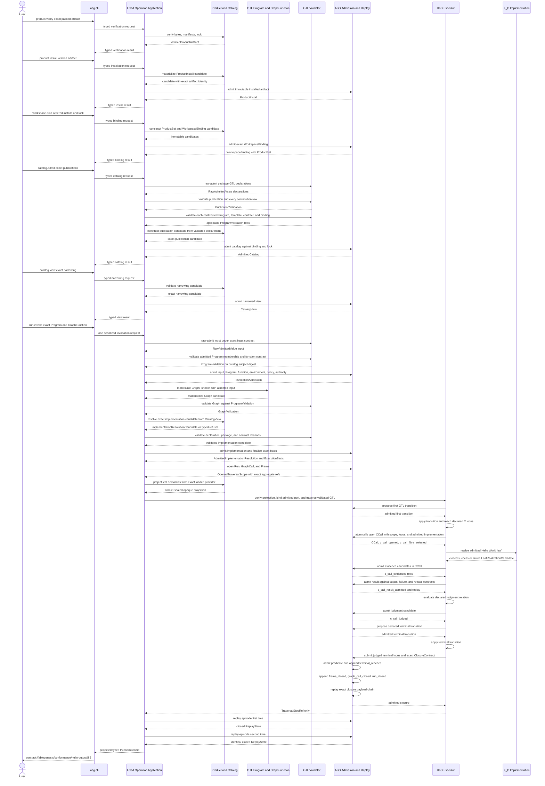

# M03 Direct GTL Traversal Behavior Design

**Status**: Accepted direct-GTL base; the T-270 narrow Product leaf-verifier
amendment is provisional pending exact-cut review

## Status

| Field | Value |
|---|---|
| Ticket | T-285 |
| Change class | design_reframe |
| Boundary | direct GTL validation, traversal, runtime admission, replay, and public projection |
| Product basis | accepted ABIogenesis 5.0 Product |
| Historical requirement basis | accepted T-284 aggregate c0dcdc264db854f5a4d4f429a35a96e8bd8b4f9481a05cdf532cdfee60722473; preserved as the accepted M3 construction basis |
| Current qualification-law basis | Product-selected STDO `v2.2.0`; this identity-only propagation does not alter the direct-GTL architecture |
| Correction basis | 048a9fbca17736a544b4f3af9aabdbdf00a13ce41dd003d8cb29a015556466f4 |
| Historical accepted design | SHA-256 `9faeb41ddac839edc9cd2ccb83ae11b05bb54d32168fc35e74a1a9cfb97e92f0`; preserved in repository history |
| Current design status | direct-GTL architecture conserved; T-270 provisionally adds one narrow HoG dependency on the Product-owned opaque leaf-semantics verifier |
| Implementation authority | current GOALS selection and T-270; this design does not select work |

This document preserves the accepted M3 realization surface. It derives HOW
from accepted Product and requirements. The selected qualification identity
does not alter Product meaning, direct-GTL architecture, the root outcome, or
donor disposition. T-270's provisional verifier amendment makes one existing
leaf-semantics authority relation explicit; it cannot self-accept or enlarge
the S03 boundary.

## 1. Design Claim

ABIogenesis 5.0 needs one execution relation:

```text
raw-admitted GTL.TypeScript
  -> non-lowering validation
  -> ABG input and invocation admission
  -> GraphFunction materialization and graph validation
  -> Product resolution proposal and ABG implementation admission
  -> direct HoG traversal
  -> ABG C-call opening and declared-fibre admission
  -> declared implementation seam
  -> ABG evidence, result, judgment, transition, and closure admission
  -> replay-derived continuation or terminal outcome
  -> thin public projection
```

The GTL composition is the program. HoG is its executor. ABG is the sole
runtime-truth substrate. No compiler, generated program, SDK, CLI, catalog,
plugin, worker, fixture, or feature runner owns another execution relation.

The first realization slice is exact ABI5-ROOT-001: one packed all-F_D Hello
World GraphFunction through clean installation, catalog admission, direct HoG
traversal, ABG replay, and typed CLI outcome. The design preserves extension
points for the retained traversal algebra without implementing those deferred
families in the first slice.

## 2. Constitutional Derivation

| Design claim | Owning authority |
|---|---|
| GTL.TypeScript is the sole program language | PRODUCT, GTL Language Contract |
| a GTL composition is the program | PRODUCT, REQ-L-GTL3-CONTRACT-LAW-API-003 |
| GraphFunction is the sole named callable and publishes a replayable graph template | PRODUCT, REQ-L-GTL3-CONTRACT-LAW-API-004 |
| validator checks whole-program law without lowering | PRODUCT Validation Contract, REQ-L-GTL3-CONTRACT-LAW-API-009 and 016 |
| HoG directly traverses admitted GTL | PRODUCT HoG, REQ-L-GTL3-CONTRACT-LAW-API-010, REQ-R-ABG3-INTERPRET-005 |
| ABG owns runtime admission and truth | PRODUCT ABG, REQ-L-GTL3-CONTRACT-LAW-API-011, REQ-R-ABG3-INTERPRET-009 |
| implementation bindings realize leaf seams only | PRODUCT Module, Catalog, And Implementation; REQ-L-GTL3-CONTRACT-LAW-API-007 |
| public ingress cannot own control | PRODUCT SDK And CLI, REQ-R-ABG3-INTERPRET-011 |
| events are the only written runtime truth | REQ-R-ABG3-EVENTS-001 through 006 |
| replay and Event Calculus derive state | REQ-R-ABG3-EVENTS-018 and 027; PRODUCT HoG And ABG Runtime Contract |
| exact product, workspace, program, callable, and implementation bases precede traversal | REQ-R-ABG3-INTERPRET-002 and REQ-R-ABG3-BINDING-003 through 007 |
| direct root is ABI5-ROOT-001 R1 through R10 | PRODUCT Root Product Outcome, REQ-P-SCENARIOS-008 |

## 3. Boundary And Deferred Scope

### In the M3 boundary

- Product, install, workspace, and narrowed catalog binding needed by the root.
- GTL Program, GraphFunction, Graph, GraphVector, C.of, and one all-F_D leaf.
- Native TypeScript checking, raw admission, and non-lowering GTL validation.
- Invocation, run, GraphCall, Frame, C-call, event, replay, and closure truth.
- Direct HoG traversal and traversal-monad bind.
- One typed SDK contract and an abg.cli projection.
- Positive intended-authority proof and real-path rival-authority mutations.

### Deferred without loss of identity

| Family | Deferred realization gate |
|---|---|
| remaining graph relations and six remaining C constructors | M5 traversal-conservation expansion after root green |
| F_P worker transport and B-001 conservation | before the first F_P Product slice |
| F_H hold, response, and same-run continuation | ABG5-S03 |
| One Surface recursive supervision | ABG5-S03 after generic continuation |
| Consensus | ABG5-S05 through ordinary GTL and runtime paths |
| complete public operation family | after the root contract is stable; no new controller |
| qualification and release | M6 and M7 |

Deferred means not implemented in the root slice. It does not mean deleted,
weakened, or delegated to imperative glue.

## 4. Candidate Ontology

### 4.1 Entities And Relationships

| Identity | Kind | Authority | Required relationship |
|---|---|---|---|
| VerifiedProductArtifact | immutable verification result | Product verification | binds exact packed bytes, descriptor, contribution, dependency, compatibility, and content identities without installing them |
| ProductInstall | authoritative entity | product.install plus ABG artifact admission | materializes one VerifiedProductArtifact under one immutable installed product identity |
| ProductSet | authoritative entity | Product workspace contract | contains an ordered non-empty set of exact ProductInstall identities plus its resolved lock |
| WorkspaceBinding | authoritative entity | Product contract and ABG admission | immutably joins workspace authority to ProductSet, resolved lock, and declared roots |
| ModulePublication | authoritative declaration | GTL module | publishes one or more typed contribution rows; any Program, GraphFunction, Graph, contract, or implementation reference is present only when required by that contribution kind |
| CatalogContribution | subordinate publication payload | ModulePublication | declares one `graph_function`, `node_type`, or `overlay` row with its exact declaration or contract reference; only `graph_function` may carry callable membership |
| AdmittedCatalog | authoritative admission | ABG catalog admission | admits exact ModulePublications against WorkspaceBinding and resolved lock |
| CatalogView | admitted projection | catalog.view plus ABG admission | narrows one AdmittedCatalog without creating execution authority |
| GtlProgram | authoritative declaration | GTL | owns topology, starts, callable membership, policies, results, and proof obligations |
| GraphFunction | authoritative declaration | GTL | belongs to one or more admitted programs and materializes one replayable Graph |
| Graph | authoritative materialized GTL value | GraphFunction constructor | preserves one materialization identity and the original declared topology |
| ImplementationBinding | authoritative leaf declaration | Module publication | binds one declared compute seam to typed contracts without topology or runtime authority |
| LeafImplementation | non-authoritative realization carrier | src/implementation | one exact host function addressed by an ImplementationBinding; receives no event, transition, or closure port |
| RawAdmittedValue<S> | authoritative boundary judgment | raw admission | preserves one erased package or request value, selected contract, canonical digest, and typed kind without creating runtime truth |
| PublicationValidation | authoritative static judgment | GTL validator | validates one ModulePublication and every typed CatalogContribution row without requiring a Program or callable row |
| ProgramValidation | authoritative static judgment | GTL validator | validates exact Program membership, GraphFunction template, contracts, implementation declarations, and whole-program relations without lowering |
| GraphValidation | authoritative static judgment | GTL validator | validates one materialized Graph against the exact ProgramValidation and original GraphFunction declaration |
| InvocationAdmission | authoritative runtime admission | ABG | admits exact Program, GraphFunction, raw-admitted input, workspace, catalog view, policy, capability, and invocation authority before graph materialization |
| ImplementationResolutionCandidate | candidate payload | Product catalog projection | deterministically resolves one exact declared binding and packaged LeafImplementation from CatalogView or returns ambiguity or absence |
| AdmittedImplementationResolution | authoritative runtime admission | ABG | admits the exact declaration, package, implementation, contracts, catalog membership, and invocation basis; selection is complete before HoG entry |
| ExecutionBasis | authoritative runtime binding | ABG | joins InvocationAdmission, ProgramValidation, GraphValidation, materialized Graph, AdmittedImplementationResolution, closure contract, and all environmental bases |
| Run | runtime aggregate | ABG | owns one causal execution episode |
| GraphCall | runtime aggregate | ABG | realizes one GraphFunction invocation within one Run |
| Frame | runtime aggregate | ABG | owns one invocation attempt and recursive lineage |
| CCall | runtime aggregate | ABG | owns one compute locus and the uniform opened, fibre-selected, evidenced, result-admitted, and judged spine |
| OpenedTraversalScope | subordinate invocation payload | ABG openCall result | carries the exact Run, GraphCall, and Frame refs into HoG; it contains no mutable state or selection authority |
| TraversalCursor | subordinate runtime state | HoG under one Frame | points to one current GTL locus; never becomes a program |
| TransitionProposal | candidate payload | HoG | proposes one declared step against current GTL and replay state; a later leaf disposition remains input to HoG rather than truth |
| TraversalStopRef | subordinate invocation payload | HoG under one Frame | identifies where traversal stopped without claiming result or closure truth |
| LeafRealizationCandidate | candidate payload | selected LeafImplementation | a closed success or failure value containing evidence candidates and one typed result candidate; never runtime truth |
| CCallAdmissionRejection | effect-edge payload | ABG contract admission | records the real stage, rejected candidate digest, contract ref, and diagnostic ref needed to complete an already-open CCall without fabricating success |
| ClosureContract | authoritative declaration | GTL composition | names the F_D closure predicate, evidence and rejection refs, replay projection, exact closure event kinds, and payload contracts |
| RuntimeEvent | authoritative event family | ABG event admission | records one admitted runtime fact with causal identity and ordinal |
| ReplayState | downstream runtime projection | ABG replay | derives current fluents and lawful continuation from events plus GTL |
| PublicOutcome | downstream projection | SDK and CLI | renders typed admitted result, refusal, hold, block, or failure |

### 4.2 Cardinality And Invariants

1. One VerifiedProductArtifact may produce zero or more ProductInstalls; each
   ProductInstall materializes exactly one verified artifact identity.
2. One ProductSet contains one or more ordered ProductInstall identities. One
   ModulePublication contains one or more CatalogContribution rows and may
   contain zero Programs, zero GraphFunctions, and zero ImplementationBindings.
   A `node_type`-only or `overlay`-only publication is therefore lawful and
   non-callable. A
   CatalogView may contain zero Modules, Programs, GraphFunctions, or callable
   rows after lawful narrowing; emptiness never activates fallback. One
   invocation requires exact membership for one ProductSet, WorkspaceBinding,
   AdmittedCatalog, non-empty selected CatalogView row, GtlProgram,
   GraphFunction, input contract, output contract, materialized Graph,
   ImplementationBinding, and ExecutionBasis. The root ProductSet contains one
   ABIogenesis install; the model does not impose that cardinality on later
   multi-product workspaces.
3. One GraphFunction materialization produces exactly one Graph identity for
   one materialization basis.
4. RawAdmittedValue, PublicationValidation, ProgramValidation, and
   GraphValidation remain distinct members of one ValidationFamily.
   PublicationValidation is sufficient for a non-callable-only publication.
   ProgramValidation precedes InvocationAdmission. GraphValidation follows
   materialization and the applicable validation identities enter ExecutionBasis.
5. Product catalog resolution deterministically proposes exactly one
   ImplementationResolutionCandidate from the selected CatalogView and
   declared graph locus. The validator checks its static declaration and
   contract relations. ABG alone creates AdmittedImplementationResolution;
   absence, ambiguity, or conflict refuses before HoG entry.
6. Each admitted ImplementationBinding resolves exactly one packaged
   LeafImplementation identity before the C-call is opened. The function
   returns only one closed LeafRealizationCandidate containing evidence and a
   typed success or failure result candidate.
7. One GraphCall belongs to exactly one Run and one materialized
   GraphFunction. Retries or replacement calls mint new GraphCall identities.
8. One Frame belongs to one GraphCall. Reopen or retry mints a new attempt
   identity while preserving frame lineage.
9. One OpenedTraversalScope contains exactly the Run, GraphCall, and Frame
   refs created by one openCall. HoG receives that scope explicitly; no ambient
   aggregate lookup or invocation-local closure may supply lineage.
10. Each invoked C stage creates one CCall under one Frame. CCall opening and
    fibre selection are one ABG transaction: refusal creates no CCall, while
    success emits `c_call_opened` followed by `c_call_fibre_selected`. Every
    `c_call_opened` payload remains locus-only; the transaction may precheck
    the admitted implementation but writes its identity only in the following
    fibre-selection event. Every
    opened CCall then emits exactly `opened -> fibre_selected ->
    evidenced(0..n) -> result_admitted -> judged`, including typed
    implementation failure. If evidence, result, or judgment admission rejects
    after opening, ABG consumes a CCallAdmissionRejection and appends only the
    missing suffix of that same spine under the declared rejection contract.
    No bare refusal may strand an opened CCall, and no fibre or implementation
    may replace or bypass the spine. The all-F_D root admits at least one
    deterministic evidence artifact.
11. A TraversalCursor belongs to one Frame and one admitted Program. It cannot
    be serialized, published, or resumed as an independent program.
12. A TransitionProposal has no runtime authority. Exactly one ABG admission
    disposition accepts or rejects it against current replay truth.
13. A TraversalStopRef belongs to one Frame and current cursor. It reports only
    a stop locus and kind and cannot carry admitted result, judgment, or closure.
14. Only ABG event admission assigns event identity, event time, and admission
    ordinal and appends RuntimeEvent truth.
15. ReplayState is fully derivable from ordered RuntimeEvents plus admitted GTL.
    No caller, cache, fixture, or log may supplement missing truth.
16. PublicOutcome is derived from ReplayState and the selected output contract.
    It never writes back into runtime truth.
17. Closure consumes one exact ClosureContract. Successful terminal admission
    emits `terminal_reached -> frame_closed -> graph_call_closed -> run_closed`
    with exact causal refs and payload contracts; M4 may not invent alternative
    closure kinds or infer closure from output presence.
18. Once InvocationAdmission exists, Graph validation, implementation
    resolution, implementation validation, or ExecutionBasis refusal is
    admitted by ABG as `invocation_refused` against that exact admission. The
    resulting PublicOutcome is replay-derived; no post-invocation refusal exits
    through an unrecorded error path.
19. Any identity, digest, membership, contract, basis, or ordinal conflict
    fails closed before the next effectful step.

### 4.3 Entity Lifecycle Completeness

| Entity | Declare or create | Read or project | Transition | Retire or close |
|---|---|---|---|---|
| VerifiedProductArtifact | product.verify over exact packed bytes and manifests | verification result | immutable value; no install or runtime transition | expires only as an operation result |
| ProductInstall | product.install over VerifiedProductArtifact plus ABG artifact admission | installed-product projection | immutable | uninstall is outside 5.0 |
| ProductSet | product/workspace contract over ordered ProductInstall identities and resolved lock | binding and invocation projection | immutable; changed membership or order creates a new set | superseded by a separately bound set |
| WorkspaceBinding | workspace.bind admission | binding projection | immutable; changed authority creates a new binding | outside 5.0 root |
| ModulePublication | typed GTL authoring and raw admission | catalog publication | new version or digest creates new identity | superseded publication |
| CatalogContribution | ModulePublication construction | catalog list and describe | immutable row; changed kind or declaration creates a new publication | superseded with its ModulePublication |
| AdmittedCatalog | catalog.admit | catalog projections | immutable for one binding and publication basis | replaced by separately admitted catalog |
| CatalogView | catalog.view narrowing | catalog.view | new narrowing, including an empty effective callable view, creates new view basis | invocation-local expiry |
| GtlProgram | typed GTL authoring and module admission | validator and catalog projection | immutable versioned declaration | superseded declaration |
| GraphFunction | typed GTL authoring and module admission | callable catalog projection | immutable versioned declaration | superseded declaration |
| Graph | GraphFunction materialization | validator and HoG | immutable for one materialization basis | expires with its GraphCall basis |
| ImplementationBinding | typed module publication | catalog and validator projection | immutable versioned declaration | superseded declaration |
| LeafImplementation | package build under src/implementation | invoked only through an admitted binding | stateless function execution | superseded package identity |
| RawAdmittedValue<S> | raw contract admission | validator or ABG admission input | immutable; changed bytes, contract, or kind creates a new value | discarded after refusal or superseded input |
| PublicationValidation | contribution-manifest validator | diagnostics and catalog admission | rerun for changed publication or contribution basis | stale when either digest changes |
| ProgramValidation | whole-program validator | diagnostics, catalog, and invocation admission | rerun for changed declaration basis | stale when source digest changes |
| GraphValidation | graph validator after materialization | diagnostics and basis finalization | rerun for changed graph or ProgramValidation | stale when either digest changes |
| InvocationAdmission | ABG input and invocation admission | materialization and audit projection | immutable; changed constituent requires new admission | refused before ExecutionBasis or superseded by terminal invocation |
| ImplementationResolutionCandidate | Product catalog projection | validator and ABG admission input | candidate only; accepted or refused once | discarded after disposition |
| AdmittedImplementationResolution | ABG binding admission | ExecutionBasis and replay | immutable; changed binding, package, or catalog creates new admission | terminal with invocation |
| ExecutionBasis | ABG basis finalization after GraphValidation and implementation admission | runtime and audit projection | immutable; basis change requires new admission | terminal or refused invocation |
| Run | ABG opens run | replay projection | active, held, blocked, failed, closed | terminal event truth |
| GraphCall | ABG opens call | replay projection | active, retry-replaced, failed, closed | terminal event truth |
| Frame | ABG opens attempt | replay projection | active, yielded, retry-replaced, folded back, failed, closed | terminal event truth |
| CCall | ABG opens declared compute locus | replay projection | opened, fibre-selected, evidenced, result-admitted, judged | judged spine remains immutable event truth |
| OpenedTraversalScope | ABG openCall result | HoG input and audit projection | immutable refs only | discarded after traversal returns |
| TraversalCursor | HoG derives under Frame | invocation-local inspection | advances only after ABG-admitted transition | discarded after terminal Frame |
| TransitionProposal | HoG derives from GTL and replay | ABG admission input | candidate only; accepted or refused exactly once | discarded after disposition |
| TraversalStopRef | HoG returns under Frame | invocation-local inspection | immutable stop payload | discarded after public composition obtains replay |
| LeafRealizationCandidate | bound implementation invocation | ABG evidence and result admission input | candidate only; success and failure share one closed union | discarded after admission |
| CCallAdmissionRejection | failed ABG contract admission after CCall opening | CCall completion input and replay evidence | consumed once to append the missing mandatory spine suffix | discarded after admitted completion |
| ClosureContract | GTL composition declaration | validator, ABG closure admission, replay | immutable versioned declaration | superseded declaration |
| RuntimeEvent | ABG admits and appends | replay | immutable | never deleted |
| ReplayState | replay fold | SDK and CLI | rederived after each admitted event | superseded projection only |
| PublicOutcome | typed projection | caller | immutable response | no runtime lifecycle |

### 4.4 Authority Matrix

| Decision or effect | Declares or proposes | Validates | Admits truth | Applies or executes | Projects |
|---|---|---|---|---|---|
| erased GTL and request values | caller or package bytes | raw admission against exact contract | none until catalog or invocation admission | none | diagnostics |
| topology and callable membership | GTL Program | ProgramValidation | catalog and ABG InvocationAdmission | HoG traverses | catalog |
| GraphFunction materialization | GraphFunction template and admitted input | GraphValidation against ProgramValidation | ABG finalizes ExecutionBasis | HoG reads Graph | catalog and replay |
| workspace and Product basis | Product or caller supplies exact ProductInstall rows and lock | Product set and workspace checks | ABG binding admission | none | SDK and CLI |
| product installation | VerifiedProductArtifact | artifact and destination checks | ABG admits the immutable installed artifact boundary | installer materializes exact bytes | SDK and CLI |
| catalog admission | ModulePublication, CatalogContribution rows, and WorkspaceBinding | PublicationValidation plus ProgramValidation for each contributed Program | ABG catalog admission with one disposition per row | none | catalog reads |
| implementation resolution | Product derives one exact candidate from CatalogView and declared locus | validator checks declaration, package, and contract relations | ABG AdmittedImplementationResolution | selected LeafImplementation realizes only its port | catalog and replay |
| next GTL locus | GTL relation; HoG proposes current step | validator plus current replay guard | ABG transition admission | HoG applies admitted transition | replay |
| C-call and fibre | GTL locus, role, fibre, arm, and admitted implementation resolution | validator plus current basis | ABG atomically opens the locus and admits fibre selection or creates no CCall | none | replay |
| F_D leaf evidence and result | selected implementation returns one success or failure candidate | input, output, failure, and evidence contracts | ABG admits evidence and typed result separately | src/implementation executes leaf | replay and outcome |
| C-call judgment | HoG applies the declared judgment relation to replay | GTL predicate and result contract | ABG admits judgment | none | replay |
| event identity and append | candidate fact from owning boundary | ABG event contract | ABG event store | ABG emit only | replay |
| continuation or terminal state | GTL policy, result contract, and ClosureContract | validator plus replay and closure predicates | ABG transition and closure admission | HoG applies only admitted route | replay and outcome |
| public invocation | caller or CLI submits | public contract | ABG invocation admission | HoG | SDK and CLI |
| post-invocation refusal | validator, Product resolution, or ABG basis admission returns a typed rejected candidate | exact stage contract and InvocationAdmission basis | ABG appends `invocation_refused` | none | replay-derived PublicOutcome |

No row assigns semantic choice to catalog, SDK, CLI, installer, plugin, worker,
fixture, or implementation binding.

## 5. Function Derivation And Traversal Monad

### 5.1 Atomic Function Families

| Function family | Type-level contract | Owner | Effect |
|---|---|---|---|
| verifyProduct | artifact bytes x manifests x lock -> VerifiedProductArtifact or typed refusal | Product boundary | reads artifacts only |
| installProduct | VerifiedProductArtifact x target -> ProductInstall candidate or typed refusal | Product boundary | materializes exact bytes |
| admitProductInstall | ProductInstall candidate x operation basis -> ProductInstall or refusal | ABG | emits public_operation_artifact_admitted |
| constructProductSet | ordered ProductInstall identities x resolved lock -> ProductSet or refusal | Product boundary | no runtime effect |
| constructWorkspaceBinding | workspace authority x ProductSet x lock x declared roots -> binding candidate or refusal | Product boundary | no runtime effect |
| admitWorkspaceBinding | binding candidate x authority -> WorkspaceBinding or refusal | ABG | emits binding event when admitted |
| admitCatalog | ModulePublication x PublicationValidation x applicable ProgramValidation rows x binding x lock -> AdmittedCatalog or refusal | ABG | emits catalog admission event plus one typed disposition per contribution row; no ProgramValidation is required when no Program is contributed |
| narrowCatalogView | AdmittedCatalog x allowlist -> CatalogView or refusal | ABG | emits view admission event |
| rawAdmitValue | unknown value x exact contract x expected kind -> RawAdmittedValue<S> or typed refusal | raw admission | no runtime effect |
| validatePublication | raw-admitted ModulePublication and CatalogContribution rows -> PublicationValidation or diagnostics | GTL validator | no runtime effect; validates graph_function, node_type, and overlay rows without inventing missing kinds |
| validateProgram | raw-admitted Program, GraphFunction, contracts, Module, and implementation declarations -> ProgramValidation or diagnostics | GTL validator | no runtime effect |
| admitInvocation | raw-admitted request x ProgramValidation x exact environment, policy, capability, and authority bases -> InvocationAdmission or refusal | ABG | emits invocation admission event; no ExecutionBasis yet |
| materializeGraph | GraphFunction x InvocationAdmission.admittedInput -> Graph candidate | GraphFunction constructor | no runtime truth |
| validateGraph | Graph candidate x ProgramValidation -> GraphValidation or diagnostics | GTL validator | no runtime effect |
| resolveImplementation | CatalogView x ProgramValidation x GraphValidation x declared leaf requirements -> ImplementationResolutionCandidate or typed refusal | Product catalog projection | no runtime effect and no semantic choice under ambiguity |
| validateImplementation | ImplementationResolutionCandidate x declaration, package, and contract bases -> validated candidate or diagnostics | GTL validator | no runtime effect |
| admitExecutionBasis | InvocationAdmission x GraphValidation x validated implementation candidate x ClosureContract -> ExecutionBasis plus AdmittedImplementationResolution or refusal | ABG | emits implementation-binding and basis admission events |
| admitInvocationRefusal | InvocationAdmission x rejected stage x typed diagnostic or refusal refs -> admitted invocation refusal | ABG | emits `invocation_refused`; required for every refusal after InvocationAdmission and before openCall |
| openCall | ExecutionBasis -> OpenedTraversalScope | ABG | emits Run, GraphCall, and Frame open events and returns their exact refs |
| proposeStep | GTL x TraversalCursor x ReplayState -> TransitionProposal | HoG | no runtime truth |
| admitTransition | TransitionProposal x ReplayState -> admitted transition or refusal | ABG | appends transition event |
| applyStep | TraversalCursor x admitted transition -> TraversalCursor | HoG | invocation-local state only |
| openCCall | OpenedTraversalScope x declared C locus x AdmittedImplementationResolution -> CCall or pre-call refusal | ABG | on success atomically emits c_call_opened then c_call_fibre_selected; refusal creates no CCall |
| realizeLeaf | admitted F_D implementation port x typed input -> LeafRealizationCandidate<success or failure> | src/implementation | declared total leaf effect only |
| admitEvidence | CCall x evidence candidate x evidence contract -> admitted evidence or CCallAdmissionRejection | ABG | emits c_call_evidenced only for admitted evidence |
| admitResult | CCall x result candidate x output, failure, and refusal contracts -> admitted result or CCallAdmissionRejection | ABG | emits c_call_result_admitted for either a valid success or typed failure/refusal result |
| proposeJudgment | GTL judgment relation x ReplayState -> judgment candidate | HoG | no runtime truth |
| admitJudgment | CCall x judgment candidate x ReplayState x judgment and rejection contracts -> admitted judgment | ABG | emits c_call_judged; an invalid candidate is totalized to the declared rejection judgment rather than left bare |
| completeRejectedCCall | CCall x current spine state x CCallAdmissionRejection x declared refusal and rejection contracts -> admitted missing spine suffix | ABG | before result, records actual rejection evidence then admits typed refusal result and rejection judgment; after result, admits only the declared rejection judgment |
| admitClosure | admitted terminal transition x judged CCall x ReplayState x ClosureContract -> admitted closure or refusal | ABG | on success emits terminal_reached, frame_closed, graph_call_closed, and run_closed with exact payloads |
| replay | ordered RuntimeEvents x GTL -> ReplayState | ABG | pure projection |
| projectOutcome | ReplayState x output contract -> PublicOutcome | public projection | no runtime effect |

After InvocationAdmission, a rejected result from validateGraph,
resolveImplementation, validateImplementation, or admitExecutionBasis is never
returned directly to public code. The fixed Operation Application submits the
typed rejection to admitInvocationRefusal and projects only the resulting replay.

### 5.2 Higher-Order Composition

The HoG executor is one higher-order traversal relation:

```text
traverse<A, B>(
  programValidation,
  graphValidation,
  executionBasis,
  openedTraversalScope,
  abgAdmission,
  admittedImplementationPort
) -> TraversalStopRef
```

TraversalStopRef is a subordinate invocation payload identifying where HoG
stopped. It is not result or closure truth. The public run.invoke composition
admits the request, materializes and validates the graph, asks ABG to finalize
ExecutionBasis and open one OpenedTraversalScope, calls traverse with those
exact refs, asks ABG replay to derive the outcome, and transports that
projection. It owns no branch or state of its own.

Its recursive bind is:

```text
TraversalUnit<A, B>
  -> HoG.proposeStep
  -> ABG.admitTransition
  -> HoG.applyStep
  -> ABG.replay
  -> next TraversalUnit | retry | recurse | foldback | hold | yield | block | terminal
```

When the admitted transition reaches a C leaf, the same bind expands without
changing the traversal relation:

```text
ABG.openCCall(scope x locus x admitted implementation)
  -> c_call_opened
  -> c_call_fibre_selected
  -> implementation.realizeLeaf
  -> ABG.admitEvidence(0..n) | completeRejectedCCall
  -> ABG.admitResult(output | failure | refusal contract) | completeRejectedCCall
  -> HoG.proposeJudgment(declared relation x replay)
  -> ABG.admitJudgment(candidate | declared rejection judgment)
  -> HoG.proposeStep
  -> ABG.admitTransition
  -> HoG.applyStep
  -> ABG.admitClosure under the exact ClosureContract when terminal
```

The order is invariant across fibres. The atomic transaction constructs the
opened event only from the declared locus tuple and writes implementation truth
only in the following selected-fibre event. A binding or fibre conflict refuses the
atomic open before a CCall identity exists. After `c_call_opened`, success and
typed implementation failure both continue through evidence, result, and
judgment. A rejected evidence or result candidate records the actual contract
rejection as C-call evidence and admits the declared typed refusal result plus
rejection judgment. A rejected judgment candidate admits the declared rejection
judgment against the already-admitted result. No post-open direct Failed,
Blocked, or bare-refusal exit exists. The implementation receives no event
writer and cannot claim admission, judgment, transition, or closure.

The monadic bind preserves one Program, ExecutionBasis, and explicit
OpenedTraversalScope containing Run, GraphCall, and Frame refs, plus each CCall
lineage. The selected compute fibre changes only the leaf realization and
evidence contract. It does not change the traversal relation.

For ABI5-ROOT-001 the relation degenerates to one all-F_D path:

```text
input
  -> C.of(F_D HelloWorld) uniform C-call spine
  -> admitted evidence, result, and judgment
  -> declared terminal output
```

This is the smallest Product proof. It is not a special executor.

## 6. Whole-Family Prime Contraction

### 6.1 Candidate Family

The source requirements expose many nouns: artifact, Product, install, product
set, workspace, module, catalog, program, function, implementation, graph,
vector, C stage, basis, run, call, frame, cursor, proposal, event, ledger,
replay, result, and public response.
They do not justify one peer service or public operation each.

### 6.2 Contracted Prime Carrier Families

| Prime family | Members or subordinate payloads | Why irreducible |
|---|---|---|
| declaration | Module, Program, GraphFunction, Graph, GraphVector, contracts, implementation refs | owns versioned GTL meaning |
| validation | RawAdmittedValue, PublicationValidation, ProgramValidation, GraphValidation, and diagnostics | distinct staged static judgments without runtime effect or lowering |
| environment | VerifiedProductArtifact, ProductInstall, ProductSet, WorkspaceBinding, AdmittedCatalog, CatalogView | exact artifact, installed, and environmental authority |
| invocation | InvocationAdmission, AdmittedImplementationResolution, and ExecutionBasis | staged but singular ABG admission family for one execution |
| traversal | Run, GraphCall, Frame, CCall; subordinate OpenedTraversalScope, TraversalCursor, TransitionProposal, and TraversalStopRef | one direct executor and recursive compute locus with explicit lineage |
| leaf realization | ImplementationBinding and its bound host function; LeafRealizationCandidate subordinate | independently admitted effect seam; cannot collapse into traversal or runtime truth |
| runtime truth | canonical RuntimeEvent family | only append-only written truth |
| projection | ReplayState and PublicOutcome | read-only derived state and consumer result |

### 6.3 Rejected Peer Carriers

The following are not architectural carriers:

- CompiledCProgramPlan;
- generated HoG program;
- compiled execution declaration;
- runtime-program catalog;
- HoG-local default program or selector;
- SDK or CLI controller state;
- installer-authored execution basis;
- plugin-authored event or closure;
- feature-specific runner;
- fixture-authored result;
- parallel result, retry, continuation, or closure ledger.

They add no irreducible lawful authority and create rival truth or execution
surfaces.

### 6.4 Governance Cost

One ticket, one design pack, one review subject, and one eventual acceptance
receipt govern this boundary. The three Mermaid views below are projections of
the same Ontology, not additional design authorities.

### 6.5 Prime Contraction Evidence

Prime carrier count, semantic authority count, and maintained authoring-source
count are different measures. The eight IACS families include one downstream
projection family; they are not eight authority sources.

The semantic authority inventory is explicit:

| State | Semantic authority sources |
|---|---|
| before contraction, lawful | Product definition source; GTL declaration source; static validation-judgment source; ABG runtime-truth source |
| before contraction, rivals | semantic-compiler plan source; compiled-execution-declaration source; generated-HoG-program source; runtime-program-catalog source; HoG-default-selector source; SDK/CLI-controller source; installer-authored-basis source; plugin/worker-runtime-truth source; feature-runner source; fixture-result source; parallel-lifecycle-ledger source |
| after contraction | Product definition source; GTL declaration source; static validation-judgment source; ABG runtime-truth source |

That is `15 -> 4` semantic authority sources. HoG executes declared topology,
and the selected host realizes a leaf effect; neither authors semantic or
runtime truth. ReplayProjectionFamily is Prime because projection is an
irreducible boundary, but it is explicitly downstream and absent from
`authoritativeCarriers`.

The maintained authoring-source inventory is independently enumerated:

| State | Maintained authoring sources |
|---|---|
| before contraction | GTL M01/M02 declarations (`XC01..XC04`); whole-program validator (`XC05`); compiler-named helpers (`XC06`); HoG runtime syntax/catalog (`XC07`); C/execution lowering (`XC08`); GraphVector handoff (`XC09`); complete-C planner (`XC10`); complete-C runtime (`XC11`); feature runtimes (`XC12`); engine runner (`XC13`); runtime registry/context (`XC14`); ABG events/replay (`XC15..XC17`); plugin selection/live runners (`XC18..XC20`); public SDK/CLI (`XC27..XC30`); installer-generated runtime (`XC31`); workspace runtime override (`XC32`); M04 control/max-autonomy (`XC33`); fixture/proof authors (`XC37`, `XC38`) |
| after contraction | `src/gtl`; `src/validator`; `src/product`; `src/implementation`; `src/abg`; `src/hog`; `src/public` |

The first row has eighteen named authoring families; the target has seven, so
the independent authoring measure is `18 -> 7`. These are maintained source
families, not carrier, file, or class counts. Subordinate typed payloads remain
explicit because compression must not erase lineage or admission staging.

```json prime-contraction
{
  "schemaVersion": 1,
  "iacs": [
    "GtlDeclarationFamily",
    "ValidationFamily",
    "EnvironmentBasis",
    "InvocationBasis",
    "TraversalAggregateFamily",
    "LeafRealizationBoundary",
    "RuntimeEventFamily",
    "ReplayProjectionFamily"
  ],
  "authoritativeCarriers": [
    "GtlDeclarationFamily",
    "ValidationFamily",
    "EnvironmentBasis",
    "InvocationBasis",
    "TraversalAggregateFamily",
    "LeafRealizationBoundary",
    "RuntimeEventFamily"
  ],
  "subordinatePayloads": [
    "CatalogContribution",
    "RawAdmittedValue<S>",
    "ImplementationResolutionCandidate",
    "OpenedTraversalScope",
    "TraversalCursor",
    "TransitionProposal",
    "TraversalStopRef",
    "LeafRealizationCandidate",
    "CCallAdmissionRejection",
    "typed diagnostics",
    "closure event payloads"
  ],
  "promotionTests": [
    {"candidate": "GtlDeclarationFamily", "verdict": "promote", "reason": "Program, GraphFunction, Graph, contracts, implementation declarations, and ClosureContract are independently versioned and pattern-matched as the sole semantic source."},
    {"candidate": "ValidationFamily", "verdict": "promote", "reason": "Raw admission plus PublicationValidation, ProgramValidation, and GraphValidation form one independently consumed static-judgment boundary and cannot become runtime truth or an execution plan."},
    {"candidate": "EnvironmentBasis", "verdict": "promote", "reason": "Verified artifacts, installs, ProductSet, WorkspaceBinding, AdmittedCatalog, and CatalogView have independent immutable identity and admission lifecycles."},
    {"candidate": "InvocationBasis", "verdict": "promote", "reason": "InvocationAdmission, admitted implementation resolution, and ExecutionBasis are ABG-owned staged runtime admissions consumed before any effect."},
    {"candidate": "TraversalAggregateFamily", "verdict": "promote", "reason": "Run, GraphCall, Frame, and CCall are independently replayed causal aggregates while traversal payloads remain subordinate."},
    {"candidate": "LeafRealizationBoundary", "verdict": "promote", "reason": "The admitted ImplementationBinding and exact packaged leaf function form the only effect seam and expose no event or control authority."},
    {"candidate": "RuntimeEventFamily", "verdict": "promote", "reason": "Canonical ABG events are the only append-only written runtime truth and independently drive replay and audit."},
    {"candidate": "ReplayProjectionFamily", "verdict": "promote", "reason": "ReplayState and PublicOutcome are independently consumed deterministic read models that cannot be collapsed into event authorship."},
    {"candidate": "OpenedTraversalScope", "verdict": "remain_subordinate", "reason": "It transports exact Run, GraphCall, and Frame refs into HoG but has no independent lifecycle, selection, or persistence authority."},
    {"candidate": "LeafRealizationCandidate", "verdict": "remain_subordinate", "reason": "It is a closed success-or-failure candidate consumed by ABG admission and never becomes truth by itself."}
  ],
  "recurrenceReview": {"status": "consume_existing", "ref": "PC-007 and PC-011: consume one execution basis and one standing Prime gate without recreating session, compiler, controller, or ledger authority"},
  "authoritySourceCount": {"before": 15, "after": 4},
  "authoringSourceCount": {"before": 18, "after": 7},
  "disposition": "migrate_authority",
  "ownerTicket": "T-285"
}
```

## 7. Irreducible Architectural Carrier Set

| Carrier family | Authority role | Public status | Persistence |
|---|---|---|---|
| GtlDeclarationFamily | authoritative semantic source including ClosureContract | Program and GraphFunction are inspectable; GraphFunction callable | canonical package serialization |
| ValidationFamily | RawAdmittedValue, PublicationValidation, ProgramValidation, GraphValidation, and diagnostics over exact subject identities | inspectable diagnostics | optional evidence; never executable |
| EnvironmentBasis | VerifiedProductArtifact, ProductInstall, ProductSet, WorkspaceBinding, AdmittedCatalog, and CatalogView | inspectable | immutable verification, install, binding, and admission evidence |
| InvocationBasis | InvocationAdmission, AdmittedImplementationResolution, and ExecutionBasis | opaque refs in public outcome | ABG event truth |
| TraversalAggregateFamily | Run, GraphCall, Frame, and CCall authoritative identities; OpenedTraversalScope, cursor, proposals, and stop refs subordinate | replay-visible | ABG event truth; subordinate payloads are invocation-local |
| LeafRealizationBoundary | ImplementationBinding and bound leaf function; realization candidate subordinate | binding inspectable; function private | package code addressed by immutable binding identity |
| RuntimeEventFamily | authoritative runtime facts | replay-readable | append-only event store |
| ReplayProjectionFamily | ReplayState and PublicOutcome downstream projections | public | reproducible cache only |

Every implementation-specific shape remains subordinate unless it is later
shown to be independently versioned, admitted, persisted, or publicly
pattern-matched. The root slice adds no other top-level carrier.

## 8. Target Module Architecture

The successor uses the canonical TypeScript tenant path after donor removal.
The directories below are ownership boundaries, not semantic peers.

| Module | Owns | May depend on | Must not own |
|---|---|---|---|
| src/gtl | typed declarations, constructors, canonical serialization | shared primitives only | runtime state or effects |
| src/validator | raw admission, PublicationValidation, ProgramValidation, GraphValidation, implementation-resolution diagnostics | gtl | execution plan or runtime truth |
| src/product | Product verification, install/ProductSet/workspace candidates, module publication, catalog candidates, deterministic implementation-resolution candidates, public operation contracts, and the private mint plus verifier for an opaque installed leaf-semantics projection | gtl and validator types | traversal, event admission, implementation selection under ambiguity, or closure |
| src/implementation | concrete host functions addressed by published ImplementationBindings | gtl contract types | topology, selection, events, judgment, or closure |
| src/abg | invocation, implementation, basis, transition, result, and closure admission ports; event store; Event Calculus; replay and aggregate truth | gtl, validator, and product contract types | GTL topology, leaf effects, implementation resolution, or scheduling |
| src/hog | direct traversal monad and invocation-local cursor under explicit OpenedTraversalScope | gtl values, validation types, ABG admission port, Product opaque leaf-semantics verifier, admitted implementation invocation port | Product semantic evaluation, event authorship, program or implementation selection, hidden defaults, ambient lineage, or leaf implementation |
| src/public | typed SDK and abg.cli plus stateless fixed operation composition | product, gtl, validator, ABG public ports/projections, and HoG public invoke | semantic selection, private state, retry, continuation, or closure |

Dependency law (`A -> B` means A may import B):

```text
validator -> gtl
product -> gtl, validator(type-only)
implementation -> gtl(type-only)
abg -> gtl(type-only), validator(type-only), product(type-only)
hog -> gtl, validator(type-only), abg(admission-port), product(opaque-leaf-verifier), implementation(invocation-port)
public -> product, gtl, validator, abg(public-port), hog(public-invoke)
```

There is no dependency from GTL, validator, Product, or implementation to HoG
or an ABG implementation. ABG does not call HoG. HoG receives already
validated values, one exact OpenedTraversalScope, and one ABG-admitted
implementation port. Its sole Product dependency verifies that a leaf-only
projection was minted by Product from the exact loaded provider; that verifier
does not expose Product input/F_H evaluation, catalog selection, install
resolution, or event authority. HoG calls only the ABG admission port while
owning traversal. Product catalog projection proposes a unique implementation
row or refuses absence or ambiguity; it never admits or invokes that row. The
public composition root wires concrete ports in the fixed order declared by
each public operation; it has no selector, fallback, replay state, or event
writer. CLI parsing and rendering cannot interleave private traversal steps.

The first implementation transaction removes donor implementation from the
canonical source and test paths before adding these seven modules. Donor code enters
only by a row-wise admission that names its Product claim, destination owner,
authority stripping, and proof.

## 9. Three-View Behavioral Design

### 9.1 Domain View

```mermaid
classDiagram
    class GtlDeclarationFamily {
      <<prime>>
      <<authoritative>>
      +versioned GTL meaning
    }
    class ValidationFamily {
      <<prime>>
      <<authoritative>>
      +static judgments
    }
    class EnvironmentBasis {
      <<prime>>
      <<authoritative>>
      +artifact and workspace basis
    }
    class InvocationBasis {
      <<prime>>
      <<authoritative>>
      +staged runtime admission
    }
    class TraversalAggregateFamily {
      <<prime>>
      <<authoritative>>
      +causal aggregate identity
    }
    class LeafRealizationBoundary {
      <<prime>>
      <<authoritative>>
      +admitted effect seam
    }
    class RuntimeEventFamily {
      <<prime>>
      <<authoritative>>
      +append-only runtime truth
    }
    class ReplayProjectionFamily {
      <<prime>>
      <<downstream>>
      +derived state and outcome
    }
    class DeferredProductFamilies {
      <<deferred>>
      -F_P worker transport
      -F_H continuation
      -One Surface and Consensus
      -qualification and release
    }
    class VerifiedProductArtifact {
      <<immutable>>
      +artifactRef
      +contentDigest
      +manifestDigest
    }
    class ProductSet {
      <<authoritative>>
      +productSetRef
      +orderedInstallRefs
      +resolvedLockRef
    }
    class ProductInstall {
      <<authoritative>>
      +installRef
      +installDigest
    }
    class WorkspaceBinding {
      <<authoritative>>
      +bindingRef
      +bindingDigest
    }
    class CatalogView {
      <<downstream>>
      +viewRef
      +viewDigest
    }
    class AdmittedCatalog {
      <<authoritative>>
      +catalogRef
      +catalogDigest
    }
    class ModulePublication {
      <<authoritative>>
      +moduleRef
      +moduleDigest
    }
    class CatalogContribution {
      <<subordinate>>
      +kind graph_function|node_type|overlay
      +handle
      +declarationOrContractRef
    }
    class GtlProgram {
      <<authoritative>>
      +programRef
      +programDigest
      +starts
      +callableMembership
    }
    class ClosureContract {
      <<authoritative>>
      +closureContractRef
      +predicateRef
      +eventKindRefs
      +payloadContractRefs
    }
    class GraphFunction {
      <<authoritative>>
      +functionRef
      +inputContractRef
      +outputContractRef
      +materialize()
    }
    class Graph {
      <<authoritative>>
      +graphRef
      +materializationId
    }
    class ImplementationBinding {
      <<authoritative>>
      +bindingRef
      +computeRegime
      +inputContractRef
      +outputContractRef
    }
    class LeafImplementation {
      <<non-authoritative>>
      -implementationRef
      -realize(input)
    }
    class ProductLeafSemanticsProjection {
      <<subordinate>>
      <<effect-edge>>
      -projectionRef
      -projectionDigest
      -Product-private provenance
    }
    class RawAdmittedValue {
      <<authoritative>>
      +subjectDigest
      +contractRef
      +subjectKind
    }
    class ProgramValidation {
      <<authoritative>>
      +validationRef
      +subjectDigest
      +diagnostics
    }
    class PublicationValidation {
      <<authoritative>>
      +validationRef
      +publicationDigest
      +rowDispositions
    }
    class GraphValidation {
      <<authoritative>>
      +validationRef
      +graphDigest
      +diagnostics
    }
    class InvocationAdmission {
      <<authoritative>>
      +invocationAdmissionRef
      +inputRef
      +authorityRef
    }
    class ImplementationResolutionCandidate {
      <<subordinate>>
      <<effect-edge>>
      -bindingRef
      -implementationRef
      -packageRef
    }
    class AdmittedImplementationResolution {
      <<authoritative>>
      +resolutionRef
      +bindingRef
      +implementationRef
    }
    class ExecutionBasis {
      <<authoritative>>
      +basisRef
      +invocationAuthorityRef
    }
    class Run {
      <<authoritative>>
      +runId
      +workKey
    }
    class GraphCall {
      <<authoritative>>
      +callId
      +materializationId
    }
    class Frame {
      <<authoritative>>
      +attemptId
      +lineageId
    }
    class CCall {
      <<authoritative>>
      +cCallRef
      +programLocusRef
      +stageRole
      +attempt
    }
    class OpenedTraversalScope {
      <<subordinate>>
      -runRef
      -graphCallRef
      -frameRef
    }
    class TraversalCursor {
      <<subordinate>>
      -locusRef
    }
    class TransitionProposal {
      <<subordinate>>
      <<effect-edge>>
      -sourceRef
      -targetRef
      -candidateResult
    }
    class TraversalStopRef {
      <<subordinate>>
      -frameRef
      -locusRef
      -stopKind
    }
    class LeafRealizationCandidate {
      <<subordinate>>
      <<effect-edge>>
      -kind
      -evidenceCandidates
      -resultCandidate
    }
    class CCallAdmissionRejection {
      <<subordinate>>
      <<effect-edge>>
      -stage
      -candidateDigest
      -contractRef
      -diagnosticRef
    }
    class RuntimeEvent {
      <<authoritative>>
      +eventId
      +admissionOrdinal
      +causationId
    }
    class ReplayState {
      <<downstream>>
      +status
      +resultRef
      +nextDisposition
    }
    class PublicOutcome {
      <<downstream>>
      +kind
      +typedValue
    }

    ProductInstall "0..*" --> "1" VerifiedProductArtifact
    ProductSet "1" --> "1..*" ProductInstall
    WorkspaceBinding "0..*" --> "1" ProductSet
    AdmittedCatalog "0..*" --> "1" WorkspaceBinding
    CatalogView "0..*" --> "1" AdmittedCatalog
    CatalogView "1" --> "0..*" ModulePublication
    ModulePublication "1" *-- "1..*" CatalogContribution
    ModulePublication "1" *-- "0..*" GtlProgram
    ModulePublication "1" *-- "0..*" GraphFunction
    ModulePublication "1" *-- "0..*" ImplementationBinding
    CatalogContribution "0..*" --> "0..1" GtlProgram
    CatalogContribution "0..*" --> "0..1" GraphFunction
    CatalogContribution "0..*" --> "0..1" ImplementationBinding
    ImplementationBinding "1" --> "1" LeafImplementation
    ProductLeafSemanticsProjection "0..*" --> "1" ProductInstall
    CatalogView "1" --> "0..*" GtlProgram
    CatalogView "1" --> "0..*" GraphFunction
    CatalogView "1" --> "0..*" ImplementationBinding
    GtlProgram "1..*" --> "1..*" GraphFunction
    GtlProgram "1" --> "1" ClosureContract
    GraphFunction "1" --> "0..*" Graph
    ProgramValidation "1" --> "1..*" RawAdmittedValue
    ProgramValidation "0..*" --> "1" GtlProgram
    PublicationValidation "1" --> "1..*" RawAdmittedValue
    PublicationValidation "1" --> "1" ModulePublication
    PublicationValidation "1" --> "1..*" CatalogContribution
    GraphValidation "0..*" --> "1" Graph
    GraphValidation "1" --> "1" ProgramValidation
    InvocationAdmission "1" --> "1" RawAdmittedValue
    InvocationAdmission "1" --> "1" ProgramValidation
    InvocationAdmission "1" --> "1" WorkspaceBinding
    InvocationAdmission "1" --> "1" CatalogView
    ImplementationResolutionCandidate "0..*" --> "1" CatalogView
    ImplementationResolutionCandidate "0..*" --> "1" GraphValidation
    ImplementationResolutionCandidate "0..*" --> "1" ImplementationBinding
    ImplementationResolutionCandidate "0..*" --> "1" LeafImplementation
    AdmittedImplementationResolution "1" --> "1" ImplementationResolutionCandidate
    ExecutionBasis "1" --> "1" InvocationAdmission
    ExecutionBasis "1" --> "1" ProgramValidation
    ExecutionBasis "1" --> "1" GraphValidation
    ExecutionBasis "1" --> "1" AdmittedImplementationResolution
    ExecutionBasis "1" --> "1" ClosureContract
    ExecutionBasis "1" --> "1" WorkspaceBinding
    ExecutionBasis "1" --> "1" ProductSet
    ExecutionBasis "1" --> "1" AdmittedCatalog
    ExecutionBasis "1" --> "1" CatalogView
    ExecutionBasis "1" --> "1" GtlProgram
    ExecutionBasis "1" --> "1" GraphFunction
    ExecutionBasis "1" --> "1" Graph
    ExecutionBasis "1" --> "1" ImplementationBinding
    Run "1" --> "1" ExecutionBasis
    Run "1" *-- "1..*" GraphCall
    GraphCall "1" --> "1" Graph
    GraphCall "1" *-- "1..*" Frame
    Frame "1" *-- "0..*" CCall
    OpenedTraversalScope "1" --> "1" Run
    OpenedTraversalScope "1" --> "1" GraphCall
    OpenedTraversalScope "1" --> "1" Frame
    CCall "1" --> "1" AdmittedImplementationResolution
    CCall "1" --> "1" LeafRealizationCandidate
    CCall "1" --> "0..*" CCallAdmissionRejection
    Frame "1" *-- "1" TraversalCursor
    Frame "1" *-- "0..1" TraversalStopRef
    TraversalCursor "1" --> "0..1" TransitionProposal
    GraphCall "1" --> "1..*" RuntimeEvent
    CCall "1" --> "4..*" RuntimeEvent
    RuntimeEvent "1..*" --> "1" ReplayState
    ReplayState "1" --> "1" PublicOutcome
    GtlDeclarationFamily "1" *-- "1..*" ModulePublication
    GtlDeclarationFamily "1" *-- "1..*" GtlProgram
    GtlDeclarationFamily "1" *-- "1..*" GraphFunction
    GtlDeclarationFamily "1" *-- "1..*" ClosureContract
    ValidationFamily "1" *-- "1..*" RawAdmittedValue
    ValidationFamily "1" *-- "1..*" PublicationValidation
    ValidationFamily "1" *-- "1..*" ProgramValidation
    ValidationFamily "1" *-- "0..*" GraphValidation
    EnvironmentBasis "1" *-- "1" ProductSet
    EnvironmentBasis "1" *-- "1" WorkspaceBinding
    EnvironmentBasis "1" *-- "1" AdmittedCatalog
    EnvironmentBasis "1" *-- "1" CatalogView
    InvocationBasis "1" *-- "1" InvocationAdmission
    InvocationBasis "1" *-- "1" AdmittedImplementationResolution
    InvocationBasis "1" *-- "1" ExecutionBasis
    TraversalAggregateFamily "1" *-- "1" Run
    TraversalAggregateFamily "1" *-- "1..*" GraphCall
    TraversalAggregateFamily "1" *-- "1..*" Frame
    TraversalAggregateFamily "1" *-- "0..*" CCall
    LeafRealizationBoundary "1" *-- "1" ImplementationBinding
    LeafRealizationBoundary "1" *-- "1" LeafImplementation
    LeafRealizationBoundary "1" *-- "1" ProductLeafSemanticsProjection
    RuntimeEventFamily "1" *-- "1..*" RuntimeEvent
    ReplayProjectionFamily "1" *-- "1" ReplayState
    ReplayProjectionFamily "1" *-- "1" PublicOutcome
```



### 9.2 Sunny Root Sequence

| Participant | Domain identity or boundary |
|---|---|
| User | explicitly external actor |
| abg.cli | parser, transport, PublicOutcome renderer |
| Operation Application | stateless wiring of one declared public operation contract to owner ports |
| Product and Catalog | VerifiedProductArtifact, ProductInstall, ProductSet, WorkspaceBinding, ModulePublication, AdmittedCatalog, and CatalogView |
| GTL | GtlProgram, GraphFunction, Graph, ImplementationBinding, and ClosureContract declarations |
| GTL Validator | RawAdmittedValue, PublicationValidation, ProgramValidation, GraphValidation, and implementation-resolution diagnostics |
| ABG | InvocationAdmission, AdmittedImplementationResolution, ExecutionBasis, Run, GraphCall, Frame, CCall, RuntimeEvent, and ReplayState |
| HoG | OpenedTraversalScope consumer, TraversalCursor, and TransitionProposal execution boundary |
| F_D Implementation | selected ImplementationBinding realization in src/implementation |



The CLI transports each explicit public operation and renders its typed
response. It never supplies omitted defaults or internally chains operations.
The Operation Application is the stateless composition root for one operation:
its order is fixed by the published operation contract, all semantic choices
remain typed inputs or owner results, and it holds no selector, retry,
continuation, event, replay, or closure state. HoG receives validated values;
it never invokes the validator. Product emits candidates; it never calls ABG.

### 9.3 Runtime Lifecycle View

```mermaid
stateDiagram-v2
    [*] --> Submitted
    Submitted --> RawAdmitted: raw input admission succeeds
    Submitted --> Refused: raw admission fails
    RawAdmitted --> ProgramValidated: whole-program validation succeeds
    RawAdmitted --> Refused: Program validation fails
    ProgramValidated --> InvocationAdmitted: ABG admits input and invocation
    InvocationAdmitted --> GraphMaterialized: GraphFunction constructs Graph
    GraphMaterialized --> GraphValidated: Graph validation succeeds
    GraphMaterialized --> InvocationRefused: Graph validation fails and ABG admits invocation_refused
    GraphValidated --> BasisAdmitted: implementation resolution and basis admitted
    GraphValidated --> InvocationRefused: resolution, validation, or basis admission refuses
    BasisAdmitted --> CallOpen: ABG opens run, call, and frame
    CallOpen --> LeafPortBound: Product seals projection; HoG verifies and binds port
    LeafPortBound --> Traversing: HoG applies admitted first transition
    Traversing --> Traversing: admitted structural transition
    Traversing --> AwaitingLeaf: declared leaf reached
    AwaitingLeaf --> PreCallRefused: atomic open and fibre admission refuses before CCall identity
    AwaitingLeaf --> CCallReady: ABG atomically emits c_call_opened then c_call_fibre_selected
    CCallReady --> RealizingLeaf: implementation receives admitted seam
    RealizingLeaf --> EvidenceAdmitted: ABG admits zero or more evidence rows
    RealizingLeaf --> ResultAdmitted: zero evidence rows then typed result admitted
    RealizingLeaf --> CallAdmissionRejected: evidence or result contract rejects
    EvidenceAdmitted --> EvidenceAdmitted: next evidence row admitted
    EvidenceAdmitted --> ResultAdmitted: ABG admits typed result
    EvidenceAdmitted --> CallAdmissionRejected: later evidence or result contract rejects
    CallAdmissionRejected --> ResultAdmitted: ABG admits actual rejection evidence and declared typed refusal result
    ResultAdmitted --> Judged: ABG admits proposed or declared rejection judgment
    Judged --> Traversing: non-terminal transition admitted and applied
    Judged --> RetryPending: admitted retry disposition
    RetryPending --> Traversing: fresh attempt admitted
    Judged --> HumanHold: typed F_H hold
    HumanHold --> Traversing: attributed response admitted
    Judged --> Yielded: typed non-terminal yield
    Judged --> TerminalAdmitted: success, blocked, or failed transition admitted
    TerminalAdmitted --> Closing: HoG applies admitted terminal transition
    Closing --> Closed: exact closure event chain admitted and replayed
    Closing --> ClosureRefused: closure predicate or payload contract refuses
    PreCallRefused --> RefusedAfterOpen: typed runtime refusal event admitted
    Refused --> [*]
    InvocationRefused --> [*]
    RefusedAfterOpen --> [*]
    Yielded --> [*]
    ClosureRefused --> [*]
    Closed --> [*]
```



Retry, F_H hold, and yield states are retained lifecycle identities but are
deferred outside the first all-F_D root realization. Their presence prevents
the first implementation from collapsing non-terminal outcomes into success
or generic failure. Once a CCall exists, typed success, blocked, and failed
results all pass through result admission and judgment before any terminal
transition. Contract rejection after opening completes the missing spine suffix
from an actual CCallAdmissionRejection; it never exits from CallAdmissionRejected.
Pre-call refusal is the only runtime failure path without a CCall spine.

## 10. Event Calculus Relationship

Event Calculus is the derivation law for ABG runtime fluents. It is not a
scheduler and does not choose GTL topology.

| Admitted event family | Initiates | Terminates | Consumer |
|---|---|---|---|
| public operation artifact admitted | installed artifact available for exact scope | none | workspace binding admission |
| invocation admitted | invocation_admitted | none | graph materialization guard |
| invocation refused after admission | typed invocation_refused | invocation_admitted | replay-derived PublicOutcome |
| implementation binding and basis admitted | implementation_admitted, basis_admitted | none | openCall guard |
| run_segment_opened | run_active | none | aggregate opening guard |
| graph_call_opened and frame_opened | call_active, frame_active | none | OpenedTraversalScope creation and HoG cursor guard |
| transition admitted | target_locus_eligible | prior_locus_active when crossed | HoG applyStep |
| C-call opened | c_call_active | none | fibre-selection guard; carries locus only |
| C-call fibre selected | fibre_admitted | none | implementation invocation guard |
| C-call evidence admitted | evidence_available, including an actual admission-rejection row when a pre-result contract rejects | none | result and audit predicates |
| C-call result admitted | typed success, failure, or refusal result_available | none | judgment predicate |
| C-call judgment admitted | proposed or declared-rejection judgment_available | c_call_active | transition and closure predicates |
| retry admitted | retry_pending | current attempt active | HoG fresh attempt |
| hold or yield admitted | hold_active or yielded | frame_active when suspended | public projection |
| runtime_failure_observed before CCall or at closure admission | typed refusal or closure_refused | affected active fluent | PublicOutcome without a fabricated CCall or close |
| terminal_reached | terminal_admitted | none | ordered aggregate closure guard |
| frame_closed | frame_closed | frame_active | graph-call closure guard |
| graph_call_closed | call_closed | call_active | run closure guard |
| run_closed | run_closed | run_active | PublicOutcome |
| correction admitted | corrected fact | superseded fact | replay and re-entry |

Each event kind used by implementation must bind to the published event-kind
census and declare its exact initiates, terminates, clips, and declips effects.
The table names fluent roles, not a new event roster.

`invocation_refused` carries `invocationAdmissionRef`, `stage`,
`subjectDigest`, `contractOrDiagnosticRefs`, `causationEventRefs`, and
`correlationId`. It is the mandatory terminal fact for Graph validation,
implementation resolution, implementation validation, or basis-admission
failure after `invocation_admitted`. A C-call contract rejection uses the
ordinary spine: before result admission, `c_call_evidenced` records
`evidenceClass: admission_rejection` with the rejected stage, candidate digest,
contract ref, and diagnostic ref; `c_call_result_admitted` then carries the
declared typed refusal result; `c_call_judged` carries the declared rejection
judgment and reason ref. A judgment-stage rejection appends only that final
declared rejection judgment because its result is already admitted. These rows
are derived from actual admission failure and cannot be fixture-authored.

M4 extends the canonical event-kind roster with `frame_closed`,
`graph_call_closed`, and `run_closed`; those identities are fixed here rather
than selected during implementation. The existing `terminal_reached` kind
precedes them. Every event uses the canonical envelope. Closure payloads are:

| Event kind | Required payload beyond the canonical envelope |
|---|---|
| terminal_reached | basisId, runId, graphCallId, frameId, cCallRef, resultRef, judgmentEventRef, closureContractRef, terminalKind, causationEventRefs, correlationId |
| frame_closed | basisId, runId, graphCallId, frameId, terminalReachedEventRef, closureContractRef, causationEventRefs, correlationId |
| graph_call_closed | basisId, runId, graphCallId, frameClosedEventRef, closureContractRef, causationEventRefs, correlationId |
| run_closed | basisId, runId, graphCallClosedEventRef, closureContractRef, causationEventRefs, correlationId |

ABG appends those four events in that order only after the named F_D closure
predicate accepts the exact judged CCall and replay basis. A predicate,
evidence, payload, or causal-reference failure emits no close event; it records
a typed refusal through the existing failure event family. This contract is
the sole closure choice available to M4.

HoG consults replay-derived fluents only to determine whether the next
GTL-declared relation is currently admissible. ABG admission resolves
conflicting or stale runtime pressure. Neither operation authors a new edge.

## 11. Native Constructability

| Concern | Current substrate | Design ruling |
|---|---|---|
| typed carriers and variants | TypeScript readonly records, generics, discriminated unions | native |
| GTL authoring | ordinary GTL.TypeScript constructors | native; selectively re-adopt declaration interiors |
| raw and static checks | discriminated RawAdmittedValue plus deterministic PublicationValidation, ProgramValidation, and GraphValidation functions | native; validator emits judgments and diagnostics only |
| direct graph traversal | TypeScript tail loop or async iterator over original graph values | native; no IR required |
| F_D leaf execution | src/implementation total TypeScript function addressed by admitted ImplementationBinding | native; no adapter or event access required |
| event append and replay | append-only discriminated event union plus pure folds | native; M4 adds invocation_refused, the three fixed aggregate-close variants, and the admission-rejection evidence/result/judgment payloads; ABG owns admission ordinal |
| Event Calculus | declared event-effect table plus deterministic fold | native |
| operation composition | ordinary stateless function composition over typed owner ports | native; no controller state or dependency cycle |
| package and CLI | Node 20 ESM package and thin binary | native |
| source-independent proof | npm pack, temporary install, child process | native |

The implementation invocation port totalizes the declared F_D result domain:
an implementation exception or malformed return becomes a typed failure
LeafRealizationCandidate and still crosses evidence, result, and judgment
admission. It cannot become a direct runtime Failed state.

No future GTL, ABG, GLC, registry, or external service capability is required
for the root. Live F_P workers, Consensus, and STDO `v2.2.0` qualification are
later Product slices and do not block native construction of this boundary.

## 12. ABI5-ROOT-001 Design Mapping

| Obligation | Owning module and function | Required evidence |
|---|---|---|
| R1 exact artifacts verified | product.verifyProduct | package digest and manifest verification from packed bytes |
| R2 clean install complete | product.install -> ProductInstall | source-blind temporary installation with no source import |
| R3 workspace bound | product.bindWorkspace plus ABG admission | immutable WorkspaceBinding and basis event |
| R4 catalog admitted and narrowed | rawAdmitValue, validatePublication, applicable validateProgram calls, product publication, admitCatalog, narrowCatalogView | exact Module, CatalogContribution dispositions, PublicationValidation, any applicable ProgramValidation, and possibly-empty view rows; root view contains the selected graph_function row |
| R5 target Program selected and admitted | ABG admitInvocation | exact ProgramValidation, Program membership, raw-admitted input, environment, policy, capability, and authority evidence |
| R6 GraphFunction and contracts resolved | resolveImplementation, validateImplementation, and ABG admission | exact function, input, output, failure, binding, package, and LeafImplementation identities |
| R7 materialized graph validated | GraphFunction materialize, validateGraph, admitExecutionBasis | same GTL identity, GraphValidation, graph digest, admitted implementation resolution, and final basis |
| R8 HoG entered through public invocation | ABG openCall plus public shell and HoG traverse | public request causally linked to explicit OpenedTraversalScope carrying Run, GraphCall, and Frame refs |
| R9 ABG admitted causal result and closure | ABG atomic openCCall, admitEvidence, admitResult, completeRejectedCCall, admitJudgment, admitTransition, admitClosure, and replay | exact uniform C-call order on success or real contract rejection plus terminal_reached, frame_closed, graph_call_closed, and run_closed payload chain |
| R10 replay and CLI agree | ABG replay plus public projectOutcome | two identical replay folds and typed CLI output |

The root governor executes after every promoted M4 implementation checkpoint.
The first typed frontier is R1. Only strict frontier reduction counts as
Product progress.

## 13. Positive And Negative Proof Contract

### 13.1 Positive supported-path proof

One installed test must:

1. pack the exact candidate;
2. create an empty temporary consumer with no source-path access;
3. install the package;
4. invoke only installed abg.cli;
5. execute the exact root identities and contracts;
6. prove the exact uniform C-call event order and selected F_D binding;
7. retain the durable ABG replay log;
8. replay the same episode twice;
9. compare both replay states with the typed CLI outcome; and
10. report R1 through R10 from real evidence rather than writing those states
   into the fixture.

### 13.2 Structural absence checks

The installed package and reachable dependency graph must contain no exported
or executable:

- CompiledCProgramPlan or compiled execution declaration;
- generated HoG program;
- runtime-program catalog or hidden default;
- publicControlLoop or feature runner;
- installer- or CLI-authored ExecutionBasis;
- implementation-authored RuntimeEvent;
- second event store, result ledger, continuation loop, or closure state.

### 13.3 Real-path mutation negatives

| Mutation | Required failure |
|---|---|
| change one valid GTL leaf or edge while leaving a deliberately stale hidden plan unchanged | replay and output follow the changed GTL identity; any stale-plan result or plan identity fails R8-R10 |
| disable the direct HoG entry while installing a callable CompiledCProgramPlan rival | invocation fails before effects; the rival path cannot recover a result |
| route run.invoke through a renamed feature runner or controller with the same output | causal Run, GraphCall, Frame, CCall, and HoG transition evidence is absent or contradictory, so R8-R10 fail |
| inject a default Program or GraphFunction in CLI | ABG rejects missing exact membership |
| bypass raw admission for package GTL or invocation input | ProgramValidation or InvocationAdmission cannot be formed |
| reuse ProgramValidation after the Program digest changes or bind GraphValidation from another materialization | admitExecutionBasis rejects the mismatched validation basis |
| fail Graph validation or implementation resolution after invocation_admitted and return a direct error | missing invocation_refused leaves replay without a terminal PublicOutcome and R7-R10 fail |
| replace GraphFunction template with implementation-only callable | validation rejects missing constructive graph |
| omit one Run, GraphCall, or Frame ref from OpenedTraversalScope and recover it from ambient state | HoG entry rejects the incomplete scope before traversal |
| add a second eligible implementation row or let public select one | deterministic Product resolution refuses ambiguity and ABG emits no ExecutionBasis |
| allow host result to bypass ABG admission | replay remains non-terminal and root stays red |
| turn an implementation failure into a direct Failed state after c_call_opened | missing result_admitted or judged event breaks the uniform spine and R9 fails |
| reject evidence, result, or judgment after c_call_opened and stop without completing the declared rejection suffix | the open spine remains incomplete and R9 fails |
| let a fixture write admission-rejection evidence or a typed refusal result without a real ABG contract rejection | causal and rejected-candidate refs are absent, so event admission rejects |
| remove one required event while fixture writes expected output | R9 or R10 fails |
| change event order or collide admission ordinals | replay admission rejects |
| let SDK choose a non-view implementation | Product resolution or ABG implementation admission rejects |
| let HoG apply an unadmitted TransitionProposal | transition guard rejects and emits no false success |
| omit, reorder, or alter one terminal_reached, frame_closed, graph_call_closed, or run_closed payload ref | closure admission or replay rejects and R9 remains red |
| make fixture author closed state | replay disagreement leaves R10 red |

The positive and negative halves are both required. Identifier scans alone do
not prove the intended authority works; sunny output alone does not prove a
rival path is absent.

## 14. Donor Admission And Retirement

The correction vector remains the complete donor ledger. This design selects
only the first-slice destinations:

| Donor class | Potentially reusable interior | Successor destination | Admission proof |
|---|---|---|---|
| RC5 GTL contracts and constructors | declaration identities and typed constructors | src/gtl | type law, serialization round-trip, Product trace |
| RC5 package metadata | package-name and source-independent installation claims | new package manifest, rewritten | R1 and R2 |
| X validator diagnostics | deterministic whole-program predicates that do not lower | src/validator | mutation tests against same GTL value |
| X event and replay kernels | canonical envelopes, Event Calculus declarations, pure folds | src/abg | ordinal, append, replay, and authority tests |
| X graph and C interiors | only laws that operate on original GTL values | src/hog, src/gtl, or src/implementation according to accepted owner | direct-path proof; no compiled-plan dependency |
| X public contract shapes | only thin request/outcome schemas | src/public | no-controller dependency test |

### 14.1 Exact Root-Slice Donor Rows

| Admission cut | Exact vector rows dispositioned by this cut | Destination | Transactional retirement | Owning proof |
|---|---|---|---|---|
| D1 package and environment | RCI-04, RCI-06, RCI-07, RCI-08, RCI-11; XC04, XC14, XC30, XC31, XC32, XC34, XC36, XC38, XC45, XC46, XC47, XC48 | src/product and minimal package/test surfaces | XC31 and XC32 never enter; old package and installer exports retire when the new packed candidate satisfies R1-R4 | package identity, source-blind install, binding/catalog tests, private-runtime mutations |
| D2 GTL and validation | RCI-02, RCI-06, RCI-08; XC01, XC02, XC03, XC05, XC06, XC38, XC42, XC46, XC47 | src/gtl and src/validator | compiler-named helpers may contribute total predicates only after compiled output types and imports are absent | type tests, round-trip, valid/invalid corpus, no-plan mutation |
| D3 direct root runtime | RCI-03, RCI-04, RCI-06, RCI-07, RCI-08; XC11, XC13, XC15, XC16, XC29, XC30, XC38, XC41, XC42, XC43, XC45, XC46, XC47 | src/abg, src/hog, src/implementation, src/public, and root proof lane | old engine runner, private CLI binding, and feature-runner entrypoints retire before the installed root is invoked | R8-R10 positive path, uniform C-call spine, causal replay, controller/event/closure absence mutations |

No final-integration Y row enters the all-F_D root. Y01, Y03, and Y04 remain
archived. Y02 remains deferred to D4 and the first F_P transport slice. Every
RCI or XC row not named above retains its T-284 disposition and cannot enter
the root by adjacency.

No donor file crosses wholesale. Admission strips invalid imports, controllers,
plan types, private registries, mutable singleton truth, and feature-specific
execution. A donor interior that cannot be separated from those authorities is
rewritten from requirements.

The successor is assembled in an isolated fresh worktree where donor
implementation and tests are absent. The first promoted implementation
checkpoint transactionally replaces the canonical code, test, and package
surfaces only after the new candidate proves at least the current typed root
frontier. Old package exports retire in that same promotion; no compatibility
facade preserves prohibited identity.

## 15. Cross-View Axiom Evaluation

| Axiom | Ontology evidence | Authority | Domain evidence | Sequence evidence | State evidence | Native enforcement | Admission or validator enforcement | Verdict | Gap owner |
|---|---|---|---|---|---|---|---|---|---|
| one GTL language and Program authority | GtlProgram and declaration family | GTL | Program relates to GraphFunction | raw-admitted GTL enters validator; validated original enters HoG | invalid GTL refuses before call | TypeScript types and raw admission | ProgramValidation | pass | none |
| GraphFunction has constructive graph | GraphFunction entity | GTL | materialize relation | materialization precedes call opening | missing graph refuses | typed constructor | materialized graph validation | pass | none |
| validator does not lower | PublicationValidation, ProgramValidation, and GraphValidation | validator | static judgments over exact publication, source, and materialization identities | applicable exact views enter catalog admission or ExecutionBasis and HoG | no execution state | return types exclude plan | validator output contracts | pass | none |
| one HoG executor | traversal family | HoG | cursor subordinate to explicit OpenedTraversalScope and Frame | HoG alone proposes and applies steps | Traversing follows HoG relation | module dependency and required scope parameter | admitted-transition guard | pass | none |
| ABG owns runtime truth | RuntimeEvent family | ABG | events feed ReplayState | every candidate crosses ABG | runtime states replay-derived | private emit API | event and result admission | pass | none |
| uniform C-call spine | CCall aggregate | ABG | CCall relates to ordered events | atomic open/select then evidence, result, judgment are explicit | all post-open success and failure paths preserve order | event constructors private to ABG | spine-order admission | pass | none |
| F_D candidate is not truth | leaf realization family | implementation proposes; ABG admits | admitted resolution addresses private function | host returns one closed success-or-failure candidate through HoG to ABG | result unavailable before admission | opaque candidate union and no event port | ABG evidence and result admission | pass | none |
| public shell is thin | PublicOutcome | public projection | downstream only | CLI calls one fixed operation application and renders once | no public-owned state | stateless composition and import boundary | invocation admission | pass | none |
| Event Calculus derives fluents only | event-effect relation | ABG replay | no topology relation | replay guards HoG entry | fluent changes follow events | exhaustive effect table | event census and ordinal checks | pass | none |
| exact binding precedes effects | InvocationAdmission, AdmittedImplementationResolution, and ExecutionBasis | ABG | joins both validation refs and all exact bases | staged admission precedes OpenedTraversalScope and call opening | refused stage is terminal | constructor-private admissions | invocation, implementation, and basis admission | pass | none |
| closure events are fixed and replayable | ClosureContract and RuntimeEvent family | GTL declares; ABG admits | exact four-event payload chain closes Frame, GraphCall, and Run | terminal_reached precedes three aggregate closes | no close fluent without all payload refs | closed event union | predicate, payload, order, and causal admission | pass | none |
| no rival compiler or controller | rejected carrier list | GTL, HoG, ABG | no rival entity | Operation Application wires owners without selection or state | no rival lifecycle | package dependency gate | semantic-differential and disabled-HoG mutations | pass | none |
| root is exact R1-R10 | root mapping | Product governor | all required identities present | sunny sequence spans R1-R10 | Closed requires replay agreement | installed driver | root governor | pass | none |
| deferred families remain visible | deferred table | Product scenarios | no fake peer carrier | absent from sunny path | retained typed states | later module slices | later scenario gates | pass | none |

No blocking native-capability or authority gap is known. The design remains a
candidate until an independent review attempts to falsify these verdicts and
direct F_H accepts the exact subject.

## 16. Implementation Handoff

After design acceptance, one M4 implementation ticket shall:

1. create the fresh successor implementation line with donor implementation
   absent;
2. establish only the seven module boundaries named here;
3. implement R1 through R4 prerequisites with no executable placeholder;
4. implement raw admission, PublicationValidation, ProgramValidation, one
   all-F_D Program and GraphFunction, GraphValidation, and staged ABG basis
   admission;
5. implement Product implementation-resolution proposal, ABG admission,
   explicit OpenedTraversalScope, and the direct HoG and ABG bind through R10;
6. expose only the installed thin abg.cli path;
7. implement the fixed terminal and aggregate-close event payload family;
8. run the root governor after each promoted checkpoint; and
9. stop horizontal expansion until ABI5-ROOT-001 is green.

The implementation ticket may split review cuts for reliability. It may not
create another design authority, module family, program identity, or controller.

## 17. Candidate Decision

The exact M3 review subject is this design file alone at one recorded blob
digest. T-285, the design README, self-review, independent review, and F_H
receipt are mutable workflow or evidence carriers outside the subject. They
must bind the exact design digest and may not silently revise its bytes.

Review must attempt to falsify:

1. Product and requirement trace;
2. Ontology completeness and Prime contraction;
3. GTL, validator, HoG, ABG, host, catalog, and public authority separation;
4. native constructability without a compiler or adapter fiction;
5. positive root-path sufficiency;
6. behavioral absence proof for rival authorities; and
7. the feasibility of a fresh, selective-donor implementation steel thread.

Acceptance authorizes implementation of this boundary. It does not close the
root, traversal matrix, remaining Product scenarios, qualification, or release.
