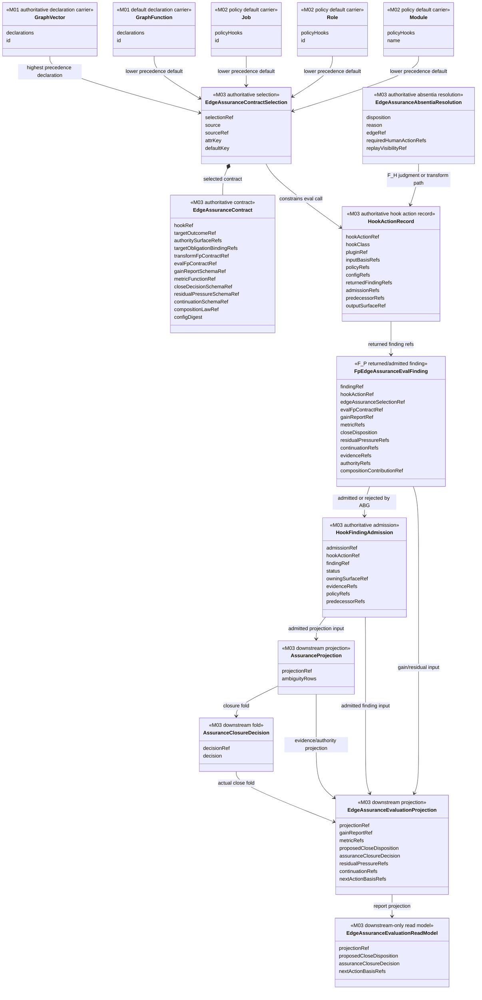

# M03 Edge Assurance Contract Structural Carrier Diagram

**Status**: Active
**Date**: 2026-05-13
**Derived from**: [M03_EDGE_ASSURANCE_CONTRACT_DERIVATION.md](./M03_EDGE_ASSURANCE_CONTRACT_DERIVATION.md), [M03_EDGE_ASSURANCE_CONTRACT_FIRST_SLICE_IACS.md](./M03_EDGE_ASSURANCE_CONTRACT_FIRST_SLICE_IACS.md)

## Purpose

Show the carrier boundary for declared GTL edge assurance, recorded F_P hook
actions, admitted findings, and downstream assurance projection.

## Structural Carrier Diagram

## Functional Reading

- Declaration carriers are immutable inputs to contract resolution.
- `EdgeAssuranceContractSelection` is the replay-visible result of precedence
  resolution.
- `EdgeAssuranceAbsentiaResolution` is the replay-visible result when no
  contract exists.
- `HookActionRecord` records the effect-shell boundary before returned findings
  can influence assurance.
- `FpEdgeAssuranceEvalFinding` is a returned/admitted value carrier, not runtime
  truth.
- `HookFindingAdmission` is the ABG-owned value that allows a finding to feed
  projection.
- `EdgeAssuranceEvaluationProjection` renders gain, proposed close disposition,
  residual pressure, continuation, and next-action basis from an admitted
  finding and assurance fold.
- `EdgeAssuranceEvaluationReadModel` is report/read-model shape. It is not
  closure authority.
- `AssuranceClosureDecision` remains the only closure fold.

## Sign-Off Claim

This design is lawful only if implementation preserves these carrier roles as
pure construction, resolution, and admission functions, with plugin invocation
and event emission kept at the effect shell.
