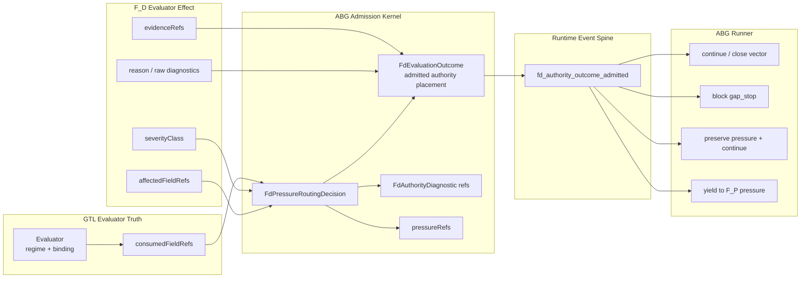

# M03 F_D Authority Placement Structural Carrier Diagram

**Status**: Active
**Date**: 2026-05-16
**Ticket**: T-138

## Authority Notes

- `Evaluator.consumedFieldRefs` is admitted GTL truth.
- Raw validator diagnostics remain subordinate until admitted as severity,
  affected fields, evidence refs, diagnostics, or pressure refs.
- Plugins may report severity and affected fields; ABG derives routing.
- `diagnostic_shape_invalid` only blocks when the malformed field is in the
  consumed-field set.
- `content_unproven` does not become deterministic closure failure; it routes
  to F_P/content pressure.
