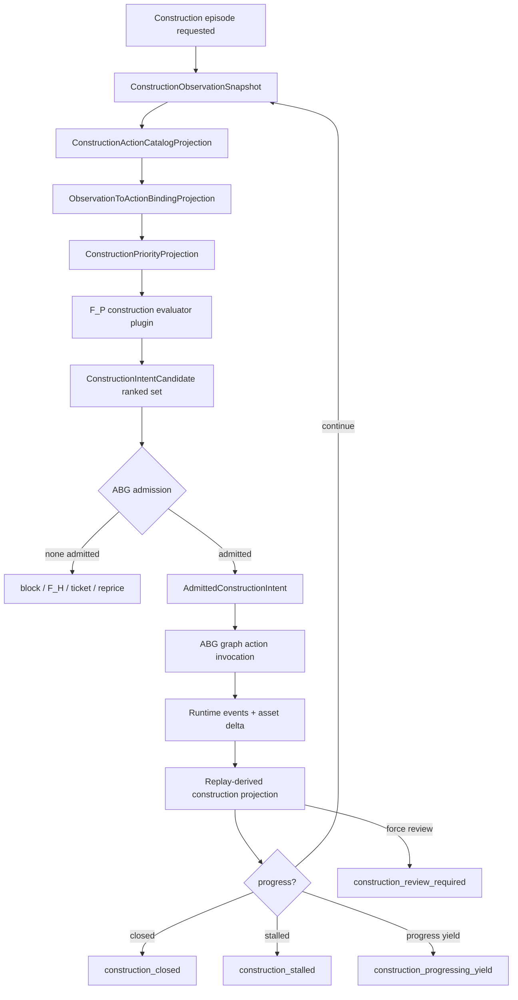
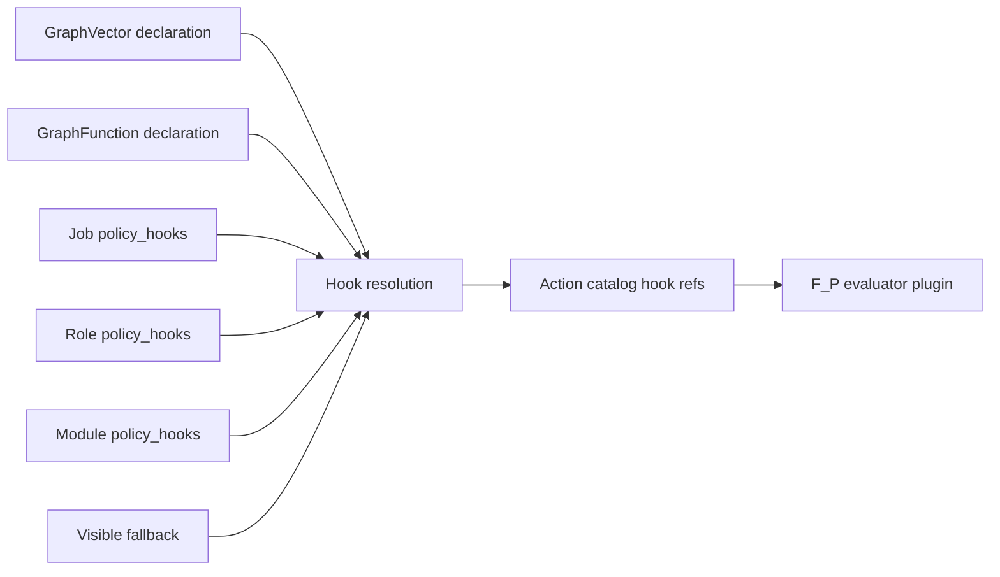
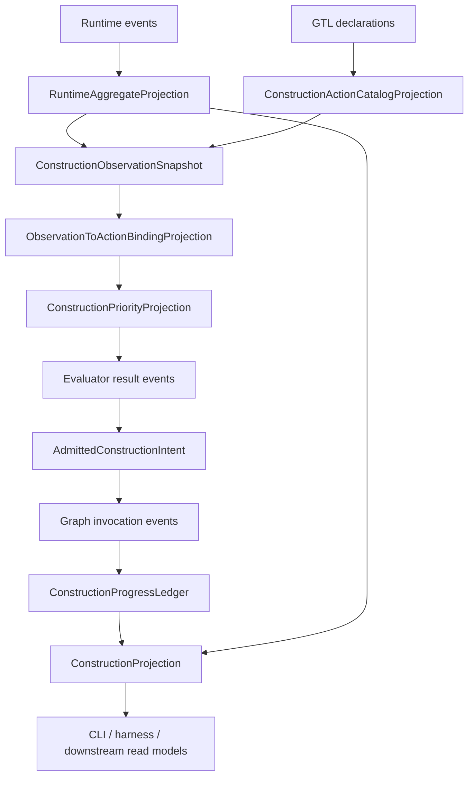

# M03 F_P Consciousness Loop Derivation

**Status**: Design candidate for `T-127`
**Date**: 2026-05-07
**Derived from**: [INTENT.md](../../../../specification/INTENT.md), [PRODUCT.md](../../../../specification/PRODUCT.md), [REQ-R-ABG3-FP-CONSCIOUSNESS.md](../../../../specification/requirements/abg/REQ-R-ABG3-FP-CONSCIOUSNESS.md), [REQ-R-ABG3-PROJECTION.md](../../../../specification/requirements/abg/REQ-R-ABG3-PROJECTION.md), [REQ-R-ABG3-RETRY.md](../../../../specification/requirements/abg/REQ-R-ABG3-RETRY.md), [REQ-L-GTL3-HOOKS.md](../../../../specification/requirements/gtl/REQ-L-GTL3-HOOKS.md), [M03_GRAPH_SPAN_FOLDBACK_REENTRY_DERIVATION.md](./M03_GRAPH_SPAN_FOLDBACK_REENTRY_DERIVATION.md), [M03_TRAVERSAL_NON_PROGRESS_CONTINUATION_DERIVATION.md](./M03_TRAVERSAL_NON_PROGRESS_CONTINUATION_DERIVATION.md), [M03_TRAVERSAL_MODULATION_DERIVATION.md](./M03_TRAVERSAL_MODULATION_DERIVATION.md), [M03_M04_PLUGIN_CONTRACT_MODEL_DERIVATION.md](./M03_M04_PLUGIN_CONTRACT_MODEL_DERIVATION.md), [T-127](../../../../.ai-workspace/tickets/completed/T-127-define-generic-fp-consciousness-loop-with-gtl-plugin-overrides.md)

## Purpose

Define the TypeScript ABG design for a generic `F_P` consciousness loop:
an event-sourced construction episode that can be entered from gaps,
evaluation failure, F_D ambiguity, F_H feedback, runtime non-progress,
temporal pressure, or public start, then choose the next lawful graph action
through product-owned evaluator intent and ABG-owned admission/projection.

The term "consciousness" names the product-level evaluator pattern:

```text
observer -> evaluator -> intent -> graph invocation -> projection -> observer
```

The design name does not create a special runtime mind. It is a precise
construction loop over typed assets, admitted runtime events, declared graph
actions, and replay-derived progress truth.

## STDO Decision

`T-127` is a `requirement_reprice`.

The active product law already says:

- ABG is event-sourced control truth.
- `iterate()` advances replay-derived projection under evaluator truth.
- the primary workflow must not replace ABG with a second local controller.
- F_D evidence must not absorb product HOW as framework law.

The missing law is the higher-order construction episode. Current ABG law
governs one traversal and several specialized repair/reentry projections, but
it does not name the generic evaluator-controlled recurrence that can choose
between all admissible graph actions. That omission lets CLI, harness, product,
or prompt prose become the de facto controller.

This design makes the recurrence explicit while preserving the edge traversal
as the bounded probabilistic compute unit.

## Problem

Downstream products need incremental repair:

```text
build site -> test/evaluate -> observe gap -> repair implicated asset
-> test/evaluate -> observe new gap or progress -> continue
```

The substrate currently has good pieces:

- graph-function iteration
- graph-span foldback and reentry
- traversal non-progress continuation
- traversal modulation
- retry and repair leaf tasks
- plugin contracts
- public gap projection

The pieces are not yet one generic evaluator loop. When a gap appears, several
layers can partially decide what to do next:

- same-edge retry projection
- graph-span reentry frontier
- public gap summary
- CLI or harness retry loop
- product-local repair schedule
- prompt prose

That creates duplicate truth. The defect is not that ABG lacks iteration. The
defect is that the evaluator decision over admissible graph actions is not a
first-class carrier with event, ledger, and projection consequences.

## Target Contract

The target construction episode is:

```text
ConstructionEpisode
  observes current linked asset state
  projects admissible graph/action catalog
  binds observation pressure to lawful action rows
  applies configured priority and affect adjustments
  invokes F_P construction evaluator plugin
  admits ranked construction intent candidates
  selects one admitted intent under declared policy
  invokes the selected graph function or reentry path through ABG
  records runtime and asset deltas
  derives construction progress or stagnation
  recurs, yields, closes, blocks, or escalates
```

ABG owns:

- runtime aggregate identity
- event admission
- replay and projection
- graph-call, frame, continuation, and lineage truth
- construction-intent admission
- selected graph invocation mechanics
- progress/stagnation ledger derivation
- public next-action projection

The product or GTL plugin owns:

- domain observation adaptation
- action-catalog refinement
- value function
- admissibility refinements within declared policy
- progress semantics when source authority disambiguates them
- escalation policy
- construction intent rendering for the selected worker or F_H gate

ABG does not decide product strategy. It admits and executes product-owned
evaluator intent against declared graph/action authority.

## Read-Only Gaps Projection

Public `gaps` is a read-only evaluator view of what the construction episode
would rank from current replay truth. It is the observation/ranking side of the
same evaluator surface, not a separate next-action calculator and not a runtime
loop.

The projection shape is:

```text
replay truth + typed asset registry
  -> incomplete typed assets
  -> blocking asset obligations and missing truth refs
  -> ObservationPressureRow
  -> ObservationToActionBindingProjection
  -> lawful graph/action catalog rows that can complete or induce the asset
  -> ConstructionPriorityProjection
  -> read-only evaluator ranking
  -> public recommendation rows with highest asset/action, ranking reasons, and blockers
```

The gaps view may expose:

- incomplete typed asset refs and asset kinds
- required-by refs and open obligation refs
- missing input, output, proof, or publication truth refs
- blocking reason refs
- eligible completion or induction action refs
- best graph function, graph vector, or terminal route refs when available
- admission blocker refs for actions that look relevant but are not lawful
- priority rank, value pressure, and ranking reason refs

The gaps view must not:

- append construction events
- admit a construction intent
- select or dispatch graph work
- retry privately
- publish a next-action truth that can disagree with `ConstructionProjection`

This keeps `gaps` useful as an operator preview: incomplete typed assets map to
the graph functions or terminal actions that could complete them, with the
highest-value or blocking asset surfaced first by the same evaluator ranking
surface, but state changes still require the ABG-owned construction episode
entry point.

## Bootstrap Entry

Bootstrap enters the same construction law from sparse replay state. If the
runtime has too little typed asset inventory, publication truth, or obligation
truth to choose downstream work, the first construction pressure is asset
induction.

Asset induction is not setup-script glue. It must be represented as a published
graph function or lawful action catalog row that:

- names the asset kind it can discover or induce
- names the expected typed asset output refs or output class
- declares required authority and input refs
- binds to the typed asset gap projection
- is admitted as `AdmittedConstructionIntent` before graph invocation

The bootstrap sequence is therefore:

```text
sparse replay state
  -> read-only gaps projection over missing typed assets
  -> highest-value or blocking induction action
  -> construction episode start
  -> candidate admission
  -> ABG graph invocation
  -> asset delta
  -> replay-derived progress or next gap
```

## Core Algorithm

The generic loop is tail recursion over projection state.

```text
construct(S0):
  O = observe(S0)
  A = project_action_catalog(O)
  M = bind_observation_to_actions(O, A)
  P = apply_priority_scheme(M)
  C = evaluate(O, A, P)
  R = admit_candidates(C)

  if R has terminal projection:
    return R.projection

  I = select_next_intent(R)
  E = invoke_graph_action(I)
  S1 = project(S0 + E)
  P = derive_progress(S0, S1, I)

  if P is stalled or blocked:
    return P.projection

  return construct(S1)
```

This is not an imperative loop hidden in a CLI. Each step is recoverable from
events, declared GTL truth, and replay-derived projections.



## Entry Points

The evaluator can be entered from several runtime paths. They all collapse to
the same construction episode surface.

| Trigger | Observation pressure | Example next action |
|---|---|---|
| public `gen-start --until` | requested product outcome not yet fulfilled | invoke first graph function |
| public `gen-gaps` | incomplete typed assets and open gap dossier | read-only ranked completion or induction recommendations |
| bootstrap entrypoint | sparse typed asset inventory or missing publication truth | admit asset induction through a published graph function/action row |
| F_D rejection | hard mechanical carrier defect | re-run admissible transform after repair |
| F_D ambiguity | source does not disambiguate enough for deterministic failure | ask F_P to decide product meaning or request F_H input |
| F_P partial progress | output exists but obligations remain | continue same edge with progress ledger |
| graph-span foldback | terminal artifact violates upstream obligation | reenter implicated earlier vector |
| runtime non-progress | no artifact/report/progress | retry, escalate, or switch action under policy |
| F_H input | operator supplied decision or clarified authority | apply decision and continue |
| temporal pressure | deadline or schedule projection | reprioritize or escalate |

No trigger owns a private controller. Each trigger creates observation pressure
for the same evaluator/admission/projection path.

## Carrier Family

### `ConstructionObservationSnapshot`

Replay-derived observation for one construction decision.

Required fields:

- `episodeId`
- `observationId`
- `basisRef`
- `currentProjectionRef`
- `iterationOrdinal`
- `basisProjectionRef`
- `priorIntentId`
- `causationRef`
- `correlationId`
- `runtimeAggregateRefs`
- `linkedAssetRefs`
- `passedInputRefs`
- `gapProjectionRefs`
- `foldbackRefs`
- `retryFrontierRefs`
- `reentryFrontierRefs`
- `assuranceRefs`
- `fhInputRefs`
- `priorIntentRefs`
- `priorProgressRefs`
- `actionCatalogRef`
- `authorityDigest`

### `ObservationPressureRow`

Replay-derived row naming one reason the construction episode needs a next
action.

Pressure kinds:

- `open_obligation`
- `admitted_error`
- `gap_row`
- `retry_frontier`
- `reentry_frontier`
- `workspace_delta`
- `temporal_pressure`
- `fh_feedback`
- `affect_signal`

Required fields:

- `pressureRef`
- `pressureKind`
- `sourceRef`
- `affectedAssetRefs`
- `targetOutcomeRefs`
- `evidenceRefs`
- `severity`
- `ambiguityClass`
- `authorityRefs`

### `TypedAssetGapProjection`

Read-only public gaps rows derived from replay truth, typed asset inventory, and
obligation truth.

Fields:

- `gapRef`
- `assetRef`
- `assetKind`
- `requiredByRef`
- `missingTruthRefs`
- `blockingReasonRefs`
- `eligibleActionRefs`
- `bestActionRef`
- `bestGraphFunctionRef`
- `bestGraphVectorRef`
- `terminalRouteRef`
- `admissionBlockerRefs`
- `priorityRank`
- `rankingReasonRefs`
- `sourceProjectionRefs`
- `observationId`
- `actionCatalogRef`
- `priorityProjectionRef`

`TypedAssetGapProjection` is subordinate read-model truth. It is derived from
the same observation, action-catalog, and priority/evaluator surfaces that
construction admission consumes, but it does not write events, admit intent, or
dispatch graph work. A row that cannot bind to a lawful catalog action remains
a typed block, not an excuse for private bootstrap code.

### `ConstructionActionCatalogProjection`

Read model of admissible graph actions.

Action kinds:

- `invoke_graph_function`
- `continue_graph_call`
- `repair_same_edge`
- `reenter_graph_span`
- `invoke_prior_vector`
- `invoke_later_vector`
- `open_fh_gate`
- `create_ticket`
- `propose_reprice`
- `yield_progress`
- `close_episode`
- `block_episode`

Each action row carries:

- `actionRef`
- `actionKind`
- `graphFunctionRef`
- `graphVectorRef`
- `refinementBoundaryRef`
- `candidateFamilyRef`
- `publishedTraversalTargetRef`
- `targetOutcomeRef`
- `inputAssetRefs`
- `expectedOutputAssetRefs`
- `requiredAuthorityRefs`
- `eligibleReasonRefs`
- `ineligibleReasonRefs`
- `hookSourceRefs`
- `defaultPolicyRefs`

Rows that target internal graph-vector boundaries must carry at least one
lawful published traversal target authority:

```text
refinementBoundaryRef | candidateFamilyRef | publishedTraversalTargetRef
```

The catalog may omit those refs only when the action targets an already
published public graph-function carrier and does not select a bare internal
vector. Missing traversal publication fails candidate admission before worker
prompting or graph invocation.

### `ObservationToActionBindingProjection`

Replay-derived projection that maps observation pressure to lawful catalog
actions before ranking.

Rows:

- `bindingRef`
- `pressureRef`
- `actionRef`
- `targetOutcomeRef`
- `providedOutputRefs`
- `requiredInputRefs`
- `availableInputRefs`
- `missingInputRefs`
- `matchReasonRefs`
- `ineligibleReasonRefs`
- `bindingScore`

The resolver is not free-form text matching. It may use declared target
outcome, provided output, required input, affected asset, evidence class,
ledger row, retry/reentry frontier, temporal pressure, and affect signal refs.
It cannot create a new action. It can only bind observation pressure to rows
already present in `ConstructionActionCatalogProjection`.

### `ConstructionPriorityScheme`

Visible configured ranking policy over lawful observation-action bindings.

Configured priority axes may include:

- `steel_thread`
- `full_breadth`
- `gap_repair`
- `danger_first`
- `operator_requested`
- `release_blocking`
- `deadline_sensitive`
- `workspace_risk`
- `highest_expected_delta`
- `lowest_missing_binding`
- `least_recently_attempted`

Each priority rule carries:

- `priorityRuleRef`
- `axis`
- `weight`
- `appliesToActionKinds`
- `appliesToOutcomeRefs`
- `sourcePolicyRef`
- `strategyLabel`

Strategy labels such as steel-thread are descriptive product policy metadata.
ABG treats them as configured ranking pressure over already-lawful action rows,
not as hardcoded traversal semantics.

### `AffectPriorityPolicy`

Visible declared policy for interpreting admitted affect signals.

Rows:

- `policyRef`
- `signalKind`
- `appliesToOutcomeRefs`
- `appliesToActionKinds`
- `boostWeight`
- `attenuationWeight`
- `forceReviewThreshold`
- `fhInputThreshold`
- `escalationThreshold`
- `terminalRouteRefs`
- `sourcePolicyRef`

`AffectPriorityPolicy` is GTL/product policy config. It does not emit runtime
truth and does not rank actions by itself.

### `AffectPriorityAdjustment`

ABG replay-derived projection row over admitted affect signal, current
observation pressure, visible `AffectPriorityPolicy`, and lawful action
bindings.

Affect signal kinds may include:

- `concern`
- `urgency`
- `danger`
- `fear`
- `operator_distress`
- `risk`
- `confidence`

Adjustment actions:

- `boost`
- `attenuate`
- `force_review`
- `request_fh_input`
- `escalate`

Rows:

- `affectRef`
- `signalKind`
- `sourceRef`
- `targetOutcomeRefs`
- `affectedActionRefs`
- `intensity`
- `adjustment`
- `weightDelta`
- `policyRef`
- `reviewReasonRefs`
- `terminalRouteRef`
- `escalationRequired`
- `evidenceRefs`

Affect never bypasses admission. It may alter rank, force review, request F_H,
or escalate under policy, but it cannot make an unavailable graph function,
unpublished vector, or missing input binding lawful.

`affect_signal` pressure does not bind directly to constructive graph actions.
It may:

- adjust already-lawful observation-to-action bindings;
- bind to review/F_H/escalation/terminal action rows declared in the catalog;
- force terminal projection under policy.

This prevents double counting affect as both a constructive binding source and
a priority adjustment source.

### `ConstructionPriorityProjection`

Replay-derived ranking input for the evaluator.

Rows:

- `rankInputRef`
- `bindingRef`
- `rankOrdinal`
- `baseScore`
- `priorityScore`
- `affectAdjustmentRefs`
- `finalScore`
- `rankReasonRefs`
- `forcedReview`
- `fhInputRequired`
- `escalationRequired`
- `terminalRouteRef`
- `reviewReasonRefs`
- `tieBreakKey`

Deterministic ordering:

1. terminal disposition selected by policy blocks invocation before evaluator
   dispatch: `escalate` > `request_fh_input` > `force_review`;
2. higher `finalScore` wins for non-terminal invocation rows;
3. stable lexical `targetOutcomeRef` wins ties;
4. stable lexical `actionRef` wins ties;
5. stable lexical `bindingRef` wins ties;
6. stable lexical `sourcePolicyRef` wins ties.

`rankOrdinal` is assigned after this order. Tests must assert the exact ordinal
sequence for equal scores.

### `ConstructionIntentCandidate`

Evaluator-owned candidate returned by the `F_P` construction evaluator.

Required fields:

- `candidateId`
- `rank`
- `valueScore`
- `priorityScore`
- `affectAdjustmentRefs`
- `selectedActionRef`
- `selectedOutcomeRef`
- `targetGraphFunctionRef`
- `targetVectorRef`
- `targetReentryRef`
- `inputAssetRefs`
- `expectedOutputAssetRefs`
- `gapRefs`
- `obligationRefs`
- `lawfulBasisRefs`
- `expectedDelta`
- `progressCondition`
- `stopCondition`
- `escalationCondition`
- `rejectedAlternativeRefs`
- `rationale`

The evaluator may rank candidates. ABG does not need to trust the ranking
blindly; it admits each candidate and selects the first admitted candidate
under declared selection policy.

### `AdmittedConstructionIntent`

ABG-owned admitted intent selected for one invocation.

Required fields:

- `intentId`
- `candidateId`
- `episodeId`
- `selectedActionRef`
- `selectedGraphFunctionRef`
- `selectedVectorRef`
- `selectedReentryRef`
- `iterationOrdinal`
- `basisProjectionRef`
- `priorIntentId`
- `causationRef`
- `runtimeInvocationPlanRef`
- `lineageRefs`
- `authorityRefs`
- `admissionDecisionRef`
- `correlationId`

An admitted intent has no authority to emit events directly. It authorizes ABG
to invoke a graph action through existing graph-call/frame/continuation law.

### `ConstructionProgressLedger`

Replay-derived ledger over construction attempts and deltas.

Rows:

- `episodeId`
- `progressRowId`
- `iterationOrdinal`
- `attemptOrdinal`
- `eventSequence`
- `intentId`
- `attemptRef`
- `basisProjectionRef`
- `priorIntentId`
- `causationRef`
- `correlationId`
- `beforeProjectionRef`
- `afterProjectionRef`
- `assetDeltaRefs`
- `artifactDigestBefore`
- `artifactDigestAfter`
- `blockerBefore`
- `blockerAfter`
- `fulfilledObligationRefs`
- `remainingObligationRefs`
- `newEvidenceRefs`
- `progressKind`
- `stagnationReason`

Progress kinds:

- `new_artifact_digest`
- `new_admitted_progress_row`
- `narrowed_blocker`
- `fulfilled_obligation`
- `accepted_fh_decision`
- `lawful_reentry_moved`
- `closed`
- `no_material_progress`

Progress rows are replay ordered by canonical event sequence, then
iteration ordinal, attempt ordinal, intent identity, and attempt identity.
Projection code must not treat caller-provided array order as latest truth.

### `ConstructionProjection`

Public read model for the current episode.

States:

- `construction_closed`
- `construction_progressing_yield`
- `construction_blocked`
- `construction_stalled`
- `construction_review_required`
- `construction_escalated`
- `fh_input_required`
- `ticket_created`
- `reprice_required`

`force_review` affect or policy disposition maps to
`construction_review_required` and blocks graph invocation.

The public summary, CLI renderer, harness, and downstream adapters render this
projection. They do not recompute it.

## Hook Resolution

The hook key is:

```text
abg.fp_consciousness
```

Override concerns:

- `observer_adapter`
- `action_catalog_adapter`
- `observation_to_action_resolver`
- `priority_scheme`
- `affect_priority_policy`
- `admissibility_policy`
- `value_function`
- `progress_policy`
- `escalation_policy`
- `intent_renderer`

Default precedence for a selected action:

```text
GraphVector.declarations["abg.fp_consciousness"]
  > GraphFunction.declarations["abg.fp_consciousness"]
  > Job.policy_hooks["abg.fp_consciousness"]
  > Role.policy_hooks["abg.fp_consciousness"]
  > Module.policy_hooks["abg.fp_consciousness"]
  > visible installed fallback/config, or visible source-default fallback for
    direct source API use without an installed bundle
```

Rules:

- malformed present hook config fails closed
- duplicate same-precedence hook config fails closed
- absent hook config selects the visible installed fallback when present, or the
  visible source-default fallback in direct source API contexts
- fallback identity and digest are rendered in the action catalog
- hook refs are declarations, not injected callables
- plugin implementation returns carriers, not runtime events
- priority and affect hooks produce ranking pressure only; admission remains
  ABG-owned



## Admission Law

`ConstructionIntentCandidate` admission rejects:

- missing episode, basis, candidate, or action identity
- action ref not present in the action catalog
- candidate selected without an observation-to-action binding row
- priority or affect adjustment without visible policy/hook source
- graph function or vector ref not available from declared GTL truth
- internal graph-vector target without `RefinementBoundary`,
  `CandidateFamily`, or published traversal target authority
- target outcome absent or contradictory
- source/input asset ref not bound to current observation
- expected output asset ref not conformant with selected action
- hidden runtime config or unrecorded hook source
- candidate that attempts to emit runtime events directly
- candidate that attempts to close traversal without evaluator/assurance truth
- candidate that collapses F_D ambiguity into a forced semantic failure
- candidate that bypasses graph-call/frame/continuation mechanics

Admission may produce terminal projection if:

- all candidates are malformed
- all candidates are ineligible under policy
- F_H input is required before any lawful candidate exists
- the only lawful route is ticket creation or constitutional reprice

## Event And Event Calculus Law

Minimum admitted primary event family:

```text
construction_episode_started
construction_evaluator_invoked
construction_intent_candidate_returned
construction_intent_candidate_admitted
construction_intent_candidate_rejected
construction_intent_selected
construction_graph_action_invoked
construction_delta_observed
construction_terminal_disposition_projected
```

Each event carries:

- run, work key, graph call, frame, and continuation refs when present
- graph function and vector refs when selected
- episode and correlation ids
- causation refs
- authority refs and digests
- hook source refs
- evidence refs

Replay-aid snapshot events may be materialized for archive inspection:

```text
construction_observation_snapshot_materialized
construction_action_catalog_projected
```

Those snapshot events do not own runtime fluent transition law unless their
event kind declares Event Calculus effects. They preserve evidence/digest truth
for replay and audit.

Derived fluent/projection family:

```text
ConstructionEpisodeOpen
ConstructionEvaluatorAwaitingOutcome
ConstructionObservationBoundToAction
ConstructionPriorityApplied
ConstructionIntentAdmitted
ConstructionIntentSelected
ConstructionGraphActionInFlight
ConstructionDeltaAvailable
ConstructionProgressing
ConstructionStalled
ConstructionTerminal
ConstructionProjection
```

`ConstructionProgressing`, `ConstructionStalled`, and terminal public states
are derived from admitted primary events, material asset deltas, policy, and
progress rules. They are not primary event authority.

Initial Event Calculus axiom sketch:

| Event kind | Initiates | Terminates | Derived-fluent consequence |
|---|---|---|---|
| `construction_episode_started` | `ConstructionEpisodeOpen` | none | observation becomes eligible |
| `construction_evaluator_invoked` | `ConstructionEvaluatorAwaitingOutcome` | none | candidate outcome expected |
| `construction_intent_candidate_returned` | none | `ConstructionEvaluatorAwaitingOutcome` | candidate admission rows eligible |
| `construction_intent_candidate_admitted` | `ConstructionIntentAdmitted(candidateId)` | none | selected-intent derivation eligible |
| `construction_intent_selected` | `ConstructionIntentSelected(intentId)` | none | graph-action invocation eligible |
| `construction_graph_action_invoked` | `ConstructionGraphActionInFlight(intentId)` | none | runtime aggregate linkage active |
| `construction_delta_observed` | `ConstructionDeltaAvailable(intentId)` | `ConstructionGraphActionInFlight(intentId)` | progress/stagnation derivation eligible |
| `construction_terminal_disposition_projected` | terminal public-state fluent, and `ConstructionEpisodeClosed` when public state is `construction_closed` | `ConstructionEpisodeOpen` when public state is `construction_closed` | terminal/review/F_H/escalation/ticket/reprice projection visible |

Derived-fluent rules compare before/after projection refs, material asset
digests, blocker identity, obligation rows, F_H decisions, and lawful reentry
movement. The first TypeScript slice encodes this as `RuntimeDerivedFluentRule`
truth feeding `ConstructionProgressLedger` and `ConstructionProjection`.

Observation-to-action binding and priority projection are derived-fluent rules
over observation pressure rows, action catalog rows, configured priority
schemes, and affect adjustments. They do not dispatch work directly.

Adapters may append admitted events. Adapters may not synthesize a different
next action for the same event stream.

## Projection Law

Projection is pure:

```text
Runtime events
+ GTL declarations
+ policy/fallback declarations
+ asset digest observations
+ evaluator results
-> ConstructionProjection
```

Construction projection does not replace existing projections. It composes
them:

- runtime aggregate projection supplies run/call/frame/continuation truth
- traversal non-progress projection supplies no-output retry pressure
- graph-span reentry projection supplies legal graph reentry candidates
- traversal modulation projection supplies attempt envelope/progress rows
- assurance projection supplies closure and ambiguity pressure
- temporal projection supplies schedule/deadline pressure

There is one public next action for one episode projection.



## Progress And Stagnation

Progress is material only when a replay-derived `RuntimeDerivedFluentRule`
comparison shows new signal.

Progress examples:

- artifact digest changed for a selected target asset
- admitted typed progress row added a fulfilled obligation
- blocker narrowed from broad unknown to a specific remaining gap
- same edge repaired a different row under the same selected action
- graph-span reentry moved to an implicated upstream vector
- F_H supplied accepted clarification
- ticket/reprice route was created as a typed terminal outcome

Stagnation examples:

- same blocker, same artifact digest, same action, no new evidence
- repeated same-edge retry with no typed progress row
- timeout without artifact, report, stream, or admitted progress signal
- F_D keeps requiring a canonical semantic choice not disambiguated by source
  authority
- evaluator returns the same inadmissible candidate after rejection

Stagnation is a derived fluent, not a primary event. It projects
`construction_stalled` or escalates under policy. It is not reported as
progress.

## F_D And F_P Boundary

F_D is an optimization and mechanical assurance surface.

F_D may fail:

- malformed carrier shape
- missing required discriminator
- invalid digest or ref
- impossible graph/action identity
- contradicted declared authority
- exact protocol violation where the protocol is explicitly declared

F_D may not fail merely because:

- source authority allows multiple semantic aliases
- source did not canonicalize product terminology
- the worker chose a lawful equivalent domain representation
- the deterministic checker can prefer a narrower form

In those cases F_D emits ambiguity/evaluator pressure. The construction
evaluator decides whether to accept the ambiguity, ask F_H, repair the source,
invoke another graph function, or create a ticket/reprice route.

## Composition With Existing Designs

| Surface | Relationship |
|---|---|
| T-100 zoom/foldback | supplies asset obligations, schedules, and per-edge foldback truth |
| T-103 graph-span reentry | supplies lawful reentry candidates for span failures |
| T-106 non-progress | supplies no-output/runtime retry pressure |
| T-107 traversal modulation | supplies bounded attempt envelopes and progress row constraints |
| T-116 plugin observer bindings | supplies plugin hook binding precedent |
| M03/M04 plugin model | supplies admitted plugin input/outcome boundary |
| M04 public gaps | renders read-only typed asset gaps and construction projection rather than recomputing, admitting, or dispatching next action |
| F_H admission | supplies human input as admitted construction observation or terminal route |

The consciousness loop is the coordinator projection over these surfaces. It
does not duplicate their internal law.

## Downstream Consumption Rule

Downstream products consume:

- `ConstructionProjection`
- `ConstructionProgressLedger`
- selected `AdmittedConstructionIntent`
- public terminal route refs

They do not own:

- retry/reentry iteration
- construction candidate selection outside declared evaluator plugin
- public next action recomputation
- hidden harness timeout repair loops
- prompt-only repair schedules as authority

For odd_sdlc-style installed runs, a harness may observe that construction is
progressing, stalled, blocked, or awaiting F_H. It must not become the loop
that decides which graph function to run next.

## Test Strategy

Deterministic tests:

- construction-episode gap pressure triggers evaluator invocation
- public gaps renders the same evaluator ranking in read-only mode, projecting
  incomplete typed assets to candidate completion or induction actions without
  appending events, admitting intent, or dispatching graph work
- a blocking or highest-value typed asset gap ranks above non-blocking gaps under
  declared priority policy
- bootstrap from sparse replay state selects a published asset-induction graph
  function/action row rather than setup-script glue
- F_D ambiguity emits evaluator pressure, not forced failure
- observation pressure rows bind only to lawful action catalog rows
- configured priority scheme ranks bindings without overriding admission
- affect boost/attenuation changes rank or review/escalation pressure without
  making inadmissible actions lawful
- malformed exact protocol still fails before evaluator intent
- hook precedence resolves vector > function > job > role > module > default
- action catalog rows targeting internal vectors require `RefinementBoundary`
  or `CandidateFamily` traversal publication refs
- malformed present hook fails closed
- ranked candidates admit first lawful candidate
- candidate with hidden event authority is rejected
- construction event kinds declare Event Calculus effects or remain replay-aid
  snapshot/projection rows
- same-edge repair with new artifact digest projects progress
- same-edge repair with same blocker and same digest projects stagnation
- graph-span reentry candidate invokes implicated earlier vector
- F_H-required candidate projects `fh_input_required`
- public summary matches construction projection exactly
- CLI/harness adapter cannot publish rival next action

Sandbox/live-equivalent tests:

- installed bootstrap first renders a read-only typed asset gap preview, then an
  ABG-owned construction episode admits and invokes the selected induction action
- progressive repair of one failing build/test asset yields typed progress
- repeated unproductive retry projects stalled
- downstream adapter consumes projection without private retry loop

## Non-Closure Conditions

Do not close T-127 if:

- the loop is implemented as CLI, harness, or product-local while loop
- evaluator output remains prompt prose rather than admitted carriers
- ABG chooses product strategy without F_P evaluator intent
- plugin override is hidden runtime config
- same-edge progress has no construction progress ledger
- stagnation is indistinguishable from progress
- F_D still forces semantic failure on undisambiguated source authority
- public gaps appends events, admits evaluator output as construction intent,
  dispatches graph work, or owns a retry/bootstrap loop
- bootstrap asset induction is hardcoded in CLI, harness, or setup code instead
  of admitted through published graph/action authority
- public summaries can disagree with construction projection
- downstream products still need private graph-action selection loops
