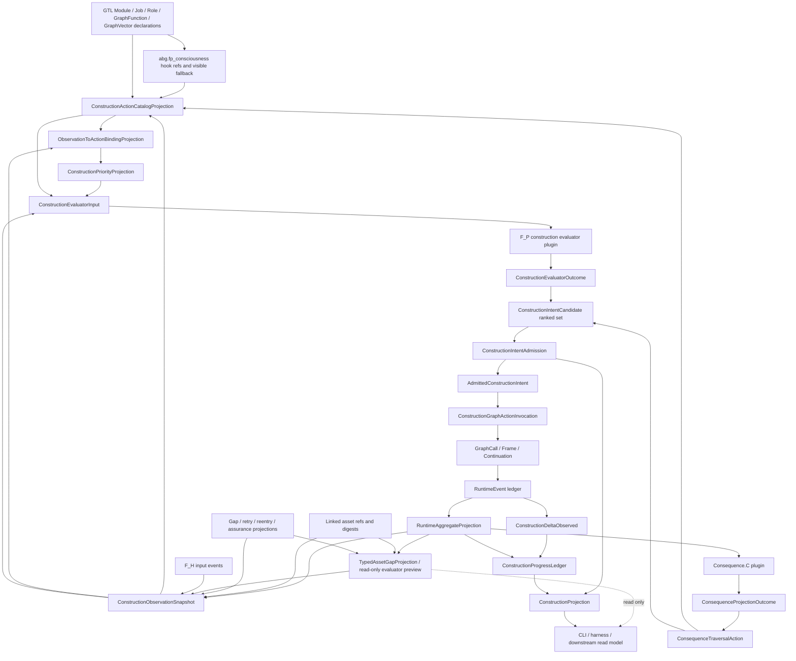
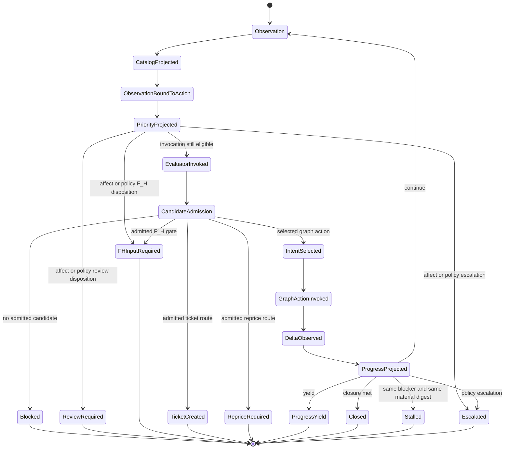
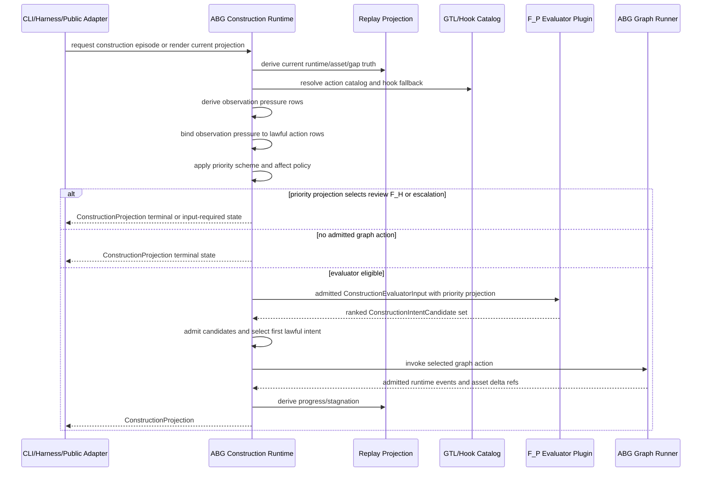

# M03 F_P Consciousness Loop Structural Carrier Diagram

**Status**: Design candidate for `T-127`
**Date**: 2026-05-07
**Derived from**: [M03_FP_CONSCIOUSNESS_LOOP_DERIVATION.md](./M03_FP_CONSCIOUSNESS_LOOP_DERIVATION.md), [M03_FP_CONSCIOUSNESS_LOOP_FIRST_SLICE_IACS.md](./M03_FP_CONSCIOUSNESS_LOOP_FIRST_SLICE_IACS.md), [M03_GRAPH_SPAN_FOLDBACK_REENTRY_DERIVATION.md](./M03_GRAPH_SPAN_FOLDBACK_REENTRY_DERIVATION.md), [M03_TRAVERSAL_NON_PROGRESS_CONTINUATION_DERIVATION.md](./M03_TRAVERSAL_NON_PROGRESS_CONTINUATION_DERIVATION.md), [M03_TRAVERSAL_MODULATION_DERIVATION.md](./M03_TRAVERSAL_MODULATION_DERIVATION.md), [T-127](../../../../.ai-workspace/tickets/completed/T-127-define-generic-fp-consciousness-loop-with-gtl-plugin-overrides.md)

## Purpose

Render the generic `F_P` consciousness loop as ABG-owned carrier topology. The
diagram makes the collapse decision visible: product evaluator intent selects
the desired construction outcome, while ABG owns admission, graph invocation,
events, ledgers, replay, and public projection.

## Structural Carrier Diagram

```mermaid
classDiagram
  class ConstructionEpisodeRef {
    <<prime>>
    <<authoritative>>
    +episodeId
    +basisRef
    +workKey
    +correlationId
  }

  class ConstructionObservationSnapshot {
    <<prime>>
    <<authoritative>>
    +observationId
    +currentProjectionRef
    +authorityDigest
    +actionCatalogRef
  }

  class ConstructionActionCatalogProjection {
    <<prime>>
    <<authoritative>>
    +catalogRef
    +fallbackDigest
    +hookSourceRefs
  }

  class ObservationPressureRow {
    <<subordinate>>
    <<authoritative>>
    +pressureRef
    +pressureKind
    +affectedAssetRefs
    +targetOutcomeRefs
    +severity
  }

  class TypedAssetGapProjection {
    <<subordinate>>
    <<downstream>>
    +gapRef
    +observationId
    +assetRef
    +assetKind
    +missingTruthRefs
    +eligibleActionRefs
    +bestActionRef
    +priorityRank
    +rankingReasonRefs
    +sourceProjectionRefs
  }

  class ConstructionActionRow {
    <<subordinate>>
    <<authoritative>>
    +actionRef
    +actionKind
    +graphFunctionRef
    +graphVectorRef
    +targetOutcomeRef
    +refinementBoundaryRef
    +candidateFamilyRef
    +publishedTraversalTargetRef
  }

  class ConstructionEvaluatorInput {
    <<effect-edge>>
    <<subordinate>>
    -inputDigest
    -observationRef
    -catalogRef
  }

  class ConstructionEvaluatorOutcome {
    <<effect-edge>>
    <<subordinate>>
    -outcomeDigest
    -candidateSetDigest
  }

  class ConsequenceProjectionOutcome {
    <<effect-edge>>
    <<subordinate>>
    -consequenceRef
    -domainReadModelRefs
    -traversalActionRef
  }

  class ConsequenceTraversalAction {
    <<effect-edge>>
    <<subordinate>>
    -actionRef
    -actionKind
    -selectedGraphFunctionRef
    -graphVectorRef
    -graphSpanRef
    -reentryTargetRef
    -requiredAuthorityRefs
  }

  class ConstructionIntentCandidate {
    <<subordinate>>
    <<authoritative>>
    +candidateId
    +rank
    +valueScore
    +priorityScore
    +selectedActionRef
    +selectedOutcomeRef
    +lawfulBasisRefs
  }

  class ObservationToActionBindingProjection {
    <<prime>>
    <<downstream>>
    +bindingRef
    +pressureRef
    +actionRef
    +bindingScore
  }

  class ConstructionPriorityScheme {
    <<subordinate>>
    <<authoritative>>
    +priorityRuleRef
    +axis
    +weight
    +strategyLabel
  }

  class AffectPriorityPolicy {
    <<subordinate>>
    <<authoritative>>
    +policyRef
    +signalKind
    +forceReviewThreshold
    +fhInputThreshold
    +escalationThreshold
  }

  class AffectPriorityAdjustment {
    <<subordinate>>
    <<downstream>>
    +affectRef
    +signalKind
    +intensity
    +adjustment
    +weightDelta
    +terminalRouteRef
    +escalationRequired
  }

  class ConstructionPriorityProjection {
    <<prime>>
    <<downstream>>
    +rankInputRef
    +baseScore
    +priorityScore
    +finalScore
    +rankOrdinal
    +tieBreakKey
    +forcedReview
    +fhInputRequired
    +escalationRequired
    +terminalRouteRef
    +reviewReasonRefs
  }

  class ConstructionIntentAdmission {
    <<prime>>
    <<authoritative>>
    +candidateId
    +decision
    +reason
    +authorityRefs
  }

  class AdmittedConstructionIntent {
    <<prime>>
    <<authoritative>>
    +intentId
    +selectedActionRef
    +selectedGraphFunctionRef
    +selectedVectorRef
    +runtimeInvocationPlanRef
  }

  class ConstructionGraphActionInvocation {
    <<effect-edge>>
    <<subordinate>>
    -graphCallId
    -frameId
    -continuationId
    -dispatchRef
  }

  class ConstructionDeltaObservation {
    <<prime>>
    <<authoritative>>
    +deltaRef
    +assetDeltaRefs
    +runtimeEventRefs
  }

  class ConstructionProgressLedger {
    <<prime>>
    <<downstream>>
    +ledgerRef
    +deriveRows()
  }

  class ConstructionProgressRow {
    <<subordinate>>
    <<downstream>>
    +progressRowId
    +progressKind
    +stagnationReason
    +beforeProjectionRef
    +afterProjectionRef
  }

  class ConstructionProjection {
    <<prime>>
    <<downstream>>
    +episodeId
    +publicState
    +nextActionRef
    +terminalRouteRefs
  }

  class RuntimeEventCalculusAxiom {
    <<prime>>
    <<authoritative>>
    +eventKind
    +deriveEffects()
  }

  class RuntimeDerivedFluentRule {
    <<prime>>
    <<authoritative>>
    +ruleRef
    +derive()
  }

  class RuntimeEvent {
    <<prime>>
    <<authoritative>>
    +eventId
    +eventKind
    +aggregateRefs
    +causationRefs
  }

  class GTLHookDeclaration {
    <<subordinate>>
    <<authoritative>>
    +hookKey
    +hookRef
    +configDigest
  }

  class RefinementBoundaryRef {
    <<subordinate>>
    <<authoritative>>
    +ref
  }

  class CandidateFamilyRef {
    <<subordinate>>
    <<authoritative>>
    +ref
  }

  class AdapterRenderedSummary {
    <<downstream>>
    +publicState
    +nextActionRef
  }

  class DownstreamLiveProofLane {
    <<deferred>>
    <<downstream>>
    +proofRef
  }

  class ConstructionTemporalPriorityOverride {
    <<deferred>>
    <<subordinate>>
    -policyRef
  }

  ConstructionObservationSnapshot --> ConstructionEpisodeRef : observes
  ConstructionObservationSnapshot --> RuntimeEvent : replay source
  ConstructionObservationSnapshot *-- ObservationPressureRow
  ConstructionObservationSnapshot *-- TypedAssetGapProjection
  TypedAssetGapProjection --> ObservationPressureRow : feeds pressure
  ConstructionActionCatalogProjection *-- ConstructionActionRow
  ConstructionActionCatalogProjection *-- GTLHookDeclaration
  ConstructionActionRow --> RefinementBoundaryRef : lawful target
  ConstructionActionRow --> CandidateFamilyRef : lawful target
  ObservationToActionBindingProjection --> ObservationPressureRow
  ObservationToActionBindingProjection --> ConstructionActionRow
  ConstructionPriorityProjection --> ObservationToActionBindingProjection
  ConstructionPriorityProjection --> ConstructionPriorityScheme
  ConstructionPriorityProjection --> AffectPriorityPolicy
  ConstructionPriorityProjection --> AffectPriorityAdjustment
  AffectPriorityAdjustment --> AffectPriorityPolicy
  ConstructionEvaluatorInput --> ConstructionObservationSnapshot
  ConstructionEvaluatorInput --> ConstructionActionCatalogProjection
  ConstructionEvaluatorInput --> ConstructionPriorityProjection
  ConstructionEvaluatorOutcome *-- ConstructionIntentCandidate
  ConsequenceProjectionOutcome *-- ConsequenceTraversalAction
  ConsequenceTraversalAction --> ConstructionActionRow : projects to
  ConsequenceTraversalAction --> ConstructionIntentCandidate : projects to
  ConstructionIntentAdmission --> ConstructionIntentCandidate
  AdmittedConstructionIntent --> ConstructionIntentAdmission
  AdmittedConstructionIntent --> ConstructionActionRow
  ConstructionGraphActionInvocation --> AdmittedConstructionIntent
  ConstructionGraphActionInvocation --> RuntimeEvent : emits admitted facts
  ConstructionDeltaObservation --> RuntimeEvent : replay source
  ConstructionProgressLedger *-- ConstructionProgressRow
  ConstructionProgressLedger --> RuntimeDerivedFluentRule
  ConstructionProgressLedger --> ConstructionDeltaObservation
  ConstructionProjection --> ConstructionProgressLedger
  ConstructionProjection --> RuntimeDerivedFluentRule
  RuntimeEvent --> RuntimeEventCalculusAxiom : effects declared when fluent changes
  RuntimeDerivedFluentRule --> RuntimeEvent : derives HoldsAt truth
  AdapterRenderedSummary --> ConstructionProjection : renders only
  AdapterRenderedSummary --> TypedAssetGapProjection : renders read-only
  DownstreamLiveProofLane ..> ConstructionProjection : later proof
  ConstructionTemporalPriorityOverride ..> ConstructionActionCatalogProjection : later policy input
```

## Supplemental Flow Topology

## Episode State Flow

## Evaluator Sequence

## Reading Rules

- `ConstructionProjection` is the public next-action authority for a
  construction episode.
- `ConstructionIntentCandidate` is product evaluator intent, not runtime truth.
- `ConsequenceTraversalAction` is consequence-stage selection intent admitted by
  ABG and projected into construction carriers. It is not direct runtime truth.
- `AdmittedConstructionIntent` is ABG runtime authority to invoke one graph
  action.
- `TypedAssetGapProjection` is a public read-only evaluator preview. It may
  expose typed asset incompleteness, candidate completion or induction actions,
  highest-ranked asset/action, ranking reasons, and blockers from the same
  evaluator ranking surface, but it does not append events, admit intent,
  dispatch graph work, or retry.
- Hook refs are declaration truth. The executable evaluator plugin returns
  outcomes that ABG admits.
- CLI, harness, and downstream read models render projection. They do not rank
  candidates, retry, reenter, or publish rival next actions.
- Bootstrap uses the same construction episode path: sparse state can rank asset
  induction, but the induction action must be published and admitted before
  invocation.
- Same-edge retry is one possible admitted graph action. It is not the generic
  loop itself.

## Sign-Off Claim

This topology is lawful only if future TypeScript implementation:

- derives observation and action catalog from replay/declaration truth,
- admits evaluator candidates before invocation,
- invokes graph work through graph-call/frame/continuation lineage,
- derives progress and stagnation from material deltas,
- converts undisambiguated F_D semantic pressure into evaluator ambiguity
  pressure,
- exposes one public construction projection, and
- prevents adapters from owning hidden construction loops.
