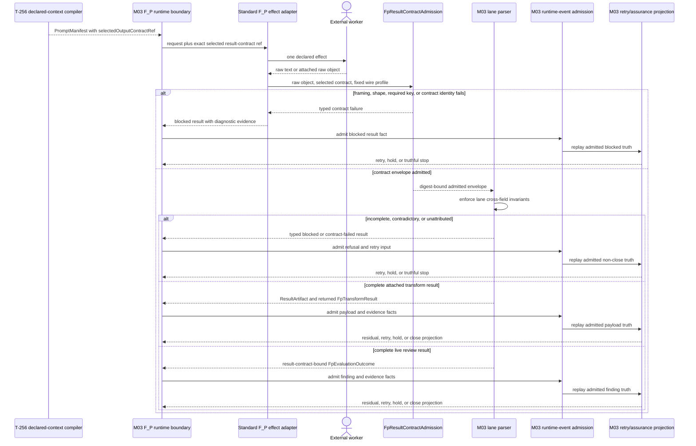
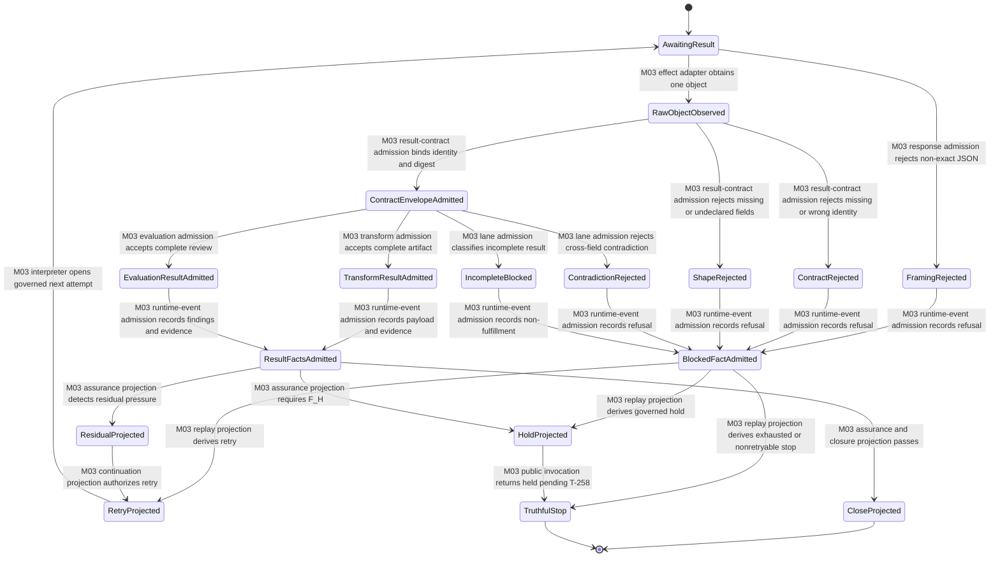

# M03 F_P Result-Contract Admission Behavior Design

**Status**: Accepted under delegated F_H authority; realization authorized
**Date**: 2026-07-13
**Ticket**: `T-257`
**Method authority**: `specification_methodology/specification/standards/DESIGN_MODULE_METHOD.md` section 5E
**Tenant authority**: [TYPESCRIPT_REALIZATION_GUARDRAILS.md](./TYPESCRIPT_REALIZATION_GUARDRAILS.md)

## Boundary

This design closes the standard external `F_P` result-admission boundary used
by transform, reviewer, reducer, submitter, and reassessment work. A raw result
must bind the exact result-contract identity selected by the canonical T-256
instruction join and satisfy one declared standard wire profile. It then
becomes either:

- one admitted result carrier; or
- one typed blocked/retry input.

Neither result is traversal or closure truth. ABG events, replay, assurance,
and the selected composition remain the only route to retry, continuation, or
closure.

### Requirements

- `REQ-L-GTL3-C-ALGEBRA-018`
- `REQ-R-ABG3-PAYLOAD-002`, `-006`, `-010`, `-012`, `-018`, `-021`, `-024`,
  and `-028`
- `REQ-R-ABG3-INSTRUCTION-ASSEMBLY-005`, `-014`, and `-017`
- `T-257` gap family `fp_result_contract_admission`

### Explicit exclusions

- arbitrary domain-extension schema execution, which remains the named
  `REQ-R-ABG3-PAYLOAD-028` gap routed by the T-244 feature register; its
  singular realization leaf is not yet admitted;
- hostile in-process object forgery or filesystem tamper resistance;
- semantic truth inferred from worker prose;
- traversal-result conservation, owned by `T-267`;
- F_H interaction, owned by `T-258`;
- any Consensus-specific parser, schema, controller, or runtime branch.

## Design Decisions

### D1. One selected-contract admission atom

`FpResultContractAdmission` is the single module-owned ingress atom. It
receives:

```text
selected result-contract ref
+ raw object
+ one module-owned standard wire profile
-> admitted contract envelope | typed contract failure
```

The atom performs only locally decidable admission:

1. require one non-empty selected contract ref;
2. require an object carrying that exact contract ref;
3. require the profile's exact wire vocabulary;
4. require every profile-required key;
5. reject every undeclared key;
6. preserve the selected contract ref and payload digest.

The worker cannot submit the allowed-key set, required-key set, or selected
contract identity. Those are supplied by the admitted request and the
module-owned parser profile.

Contract-ref equality is lineage conservation, not proof that arbitrary domain
content satisfies the named contract. This slice validates the standard plugin
result interface and admits only its declared fields. Contract-specific domain
content is either absent or rejected until the selected declared-schema path is
realized. The atom must not mint a successful domain-schema verdict from an
echoed ref.

### D2. Two standard wire profiles, one atom

The current product has two external response profiles:

| Profile | Contract-ref key | Profile owner | Downstream parser |
|---|---|---|---|
| attached transform artifact | `result_contract_ref` | M03 transport admission | fulfillment artifact parser |
| standard live review | `resultContractRef` | M03 standard evaluator adapter | review parser |

Alternate spellings fail. This distinction is serialization law, not two
semantic authorities. Both profiles use `FpResultContractAdmission` before
their lane-specific parser.

Domain-extension fields are not accepted by these standard profiles. A later
declared artifact-schema implementation may add a governed extension section;
until then an extension is a typed contract failure, not silently dropped data.

### D3. Selected identity is conserved

The selected result-contract ref flows unchanged through:

```text
DeclaredFpExecutionRequest / PromptManifest
  -> FpTransformRequest or live evaluator input
  -> DispatchRequest when the attached lane is used
  -> FpResultContractAdmission
  -> ResultArtifact / FpTransformResult / FpEvaluationOutcome
  -> payload or finding admission evidence
```

No plugin chooses, widens, or substitutes this identity.

### D4. Transform results are a closed status family

| Status | `reason` | `artifactRef` | evidence candidates | Meaning |
|---|---|---|---|---|
| `returned` | must be null | required | non-empty, complete, non-contradictory, non-deferred | contract-admitted result proposal |
| `blocked` | required | optional | may preserve partial candidates | admitted non-fulfillment proposal |
| `runtime_failed` | required | optional | must be empty | substrate failure truth |
| `contract_failed` | required | optional | must be empty | malformed or contradictory result truth |

Construction and raw admission enforce the same table. Invalid combinations
do not normalize into a valid status.

### D5. Exact JSON framing

Standard live external output is exactly one JSON object surrounded only by
JSON whitespace. Prose, Markdown fences, prefixes, suffixes, multiple objects,
arrays, and scalars are contract failures. Raw text remains diagnostic
evidence, but no first-brace/last-brace extraction is allowed.

### D6. Review output cannot close by omission

The standard live review profile requires all five keys:

```text
resultContractRef
accepted
closeDisposition
assessmentIds
reasons
```

Cross-field law is closed:

- `accepted: true` requires `closeDisposition: close` and exact attestation of
  all expected assessment identities;
- `accepted: false` requires `closeDisposition: retry` and at least one reason;
- unexpected or duplicate assessment identities fail admission;
- missing fields never receive defaults.

An admitted close candidate remains a proposal consumed by ABG event and
assurance folds.

## Irreducible Architectural Carrier Set

| Carrier | Visibility | Authority | Role |
|---|---|---|---|
| `SelectedFpResultContract` | public field relation | prime input | exact T-256-selected result-contract identity |
| `FpStandardWireProfile` | module-local | subordinate policy | exact field vocabulary for one standard external response family |
| `AdmittedFpResultContractEnvelope` | public | prime admitted result basis | selected identity plus digest-bound raw object |
| `FpResultContractFailure` | public typed disposition | subordinate | malformed, missing, wrong-contract, or contradictory refusal |
| `FpTransformRequest` | public | prime request | transform identity, actor, result, retry, and selected result contract |
| `DispatchRequest` | public | prime request | attached-result expectation and selected result contract |
| `ResultArtifact` | public | subordinate admitted proposal | request-bound fulfillment artifact |
| `FpTransformResult` | public | subordinate admitted proposal | closed transform status family |
| `FpEvaluationOutcome` | public | subordinate admitted proposal | result-contract-bound evaluator findings |
| `RuntimeEvent` stream | public | authoritative | admitted runtime truth |
| retry and closure projections | public downstream | downstream | replay-derived continuation or truthful stop |

## Domain Model

```mermaid
classDiagram
  direction LR

  class DeclaredFpExecutionRequest {
    <<prime>>
    <<authoritative>>
    +resultContractRef
    +envelopeRef
  }
  class PromptManifest {
    <<prime>>
    +selectedOutputContractRef
    +promptDigest
  }
  class FpTransformRequest {
    <<prime>>
    +requestRef
    +resultRef
    +selectedResultContractRef
  }
  class DispatchRequest {
    <<prime>>
    +dispatchRef
    +selectedResultContractRef
  }
  class RawFpResult {
    <<effect-edge>>
    +unknown object
  }
  class FpStandardWireProfile {
    <<subordinate>>
    -contractRefField
    -allowedFields
    -requiredFields
  }
  class FpResultContractAdmission {
    <<authoritative>>
    +admit selected identity
    +close wire vocabulary
    +digest payload
  }
  class AdmittedFpResultContractEnvelope {
    <<prime>>
    +resultContractRef
    +payloadDigest
    +payload
  }
  class FpResultContractFailure {
    <<subordinate>>
    +failureClass
    +detail
  }
  class ResultArtifact {
    <<subordinate>>
    +resultContractRef
    +fulfillmentAssessments
    +identityIssues
  }
  class FpTransformResult {
    <<subordinate>>
    +resultContractRef
    +status
    +reason
  }
  class FpEvaluationOutcome {
    <<subordinate>>
    +resultContractRef
    +status
    +findings
  }
  class RuntimeEventLog {
    <<authoritative>>
    +admitted payload facts
    +admitted finding facts
    +retry facts
  }
  class AssuranceProjection {
    <<downstream>>
    +retry
    +hold
    +close
    +blocked
  }
  class DeclaredArtifactSchemaExecution {
    <<deferred>>
    +unadmitted realization leaf
  }

  DeclaredFpExecutionRequest --> PromptManifest : conserves selection
  PromptManifest --> FpTransformRequest : supplies selected contract
  FpTransformRequest --> DispatchRequest : supplies selected contract
  RawFpResult --> FpResultContractAdmission : submitted to
  FpStandardWireProfile --> FpResultContractAdmission : constrains
  PromptManifest --> FpResultContractAdmission : selects contract
  FpResultContractAdmission --> AdmittedFpResultContractEnvelope : admits
  FpResultContractAdmission --> FpResultContractFailure : refuses
  AdmittedFpResultContractEnvelope --> ResultArtifact : attached profile parse
  AdmittedFpResultContractEnvelope --> FpEvaluationOutcome : review profile parse
  ResultArtifact --> FpTransformResult : request-bound classification
  FpTransformResult --> RuntimeEventLog : admitted proposal only
  FpEvaluationOutcome --> RuntimeEventLog : admitted proposal only
  RuntimeEventLog --> AssuranceProjection : replay input
  DeclaredArtifactSchemaExecution ..> FpResultContractAdmission : future extension
```



## Execution Sequence



The external worker is the only effect actor. The admission atom does not
invoke workers, emit events, select continuation, or close traversal.

## Lifecycle State Model



Every transition names its owning admission, adapter, interpreter, event, or
projection. There is no raw-output-to-close transition.

## Cross-View Checks

| Check | Evidence | Verdict |
|---|---|---|
| Every sequence participant exists in the domain model or is external | compiler/request, runtime, adapter, worker, admission, lane parsers, events, and replay are represented | `pass` |
| Every lifecycle carrier exists in the domain model | raw, admitted envelope, failures, result variants, events, and projections are represented | `pass` |
| Every message binds a declared transform or effect | one worker effect; all later steps are admissions or replay projections | `pass` |
| Every transition names its owner | state labels name M03 admission, adapter, interpreter, event, or projection | `pass` |
| Raw F_P output cannot become accepted or closed directly | contract envelope and lane admission precede events; replay precedes close | `pass` |
| Contract identity remains exact | one selected ref is conserved and checked against the worker response | `pass` |
| Incomplete or contradictory output remains non-closing | closed status/review tables produce blocked or contract failure | `pass` |
| Arbitrary domain extension schema execution is claimed | explicitly deferred to a singular realization leaf routed by the T-244 register, and undeclared fields fail | `not_applicable` |

## Axiom Evaluation

| Axiom | Authority | Domain evidence | Sequence evidence | State evidence | Native enforcement | Admission/compiler enforcement | Verdict | Gap owner |
|---|---|---|---|---|---|---|---|---|
| F_P output is data, not closure truth | `C-ALGEBRA-018`; `PAYLOAD-012` | raw output is effect-edge-only | admission and replay are mandatory | no raw-to-close edge | distinct carriers | closed ingress plus event folds | `pass` | none |
| Selected result contract is exact and addressable | `INSTRUCTION-ASSEMBLY-005/-014` | selected ref is prime request truth | same ref reaches admission | wrong ref enters refusal | required carrier field on declared path | equality check at one atom | `pass` | none |
| Standard response schemas are closed | `C-ALGEBRA-018` | fixed profiles and admitted envelope | profile precedes lane parser | unknown key enters refusal | readonly closed normalized carriers | exact allowed/required key checks | `pass` | none |
| Contract-ref echo is not domain validation | `PAYLOAD-024/-028` | admitted envelope separates lineage from deferred domain schema | only standard profile fields proceed | domain content enters refusal | no fabricated schema-success field | selected-ref equality plus explicit deferral to an unadmitted realization leaf | `pass` | none |
| Status families are contradiction-free | `C-ALGEBRA-018` | four transform variants have explicit relations | contradictions refuse before events | contradiction state is non-closing | discriminant plus field invariants | constructor and raw admission share checks | `pass` | none |
| Incomplete evaluation cannot close by omission | `PAYLOAD-006`; `INSTRUCTION-ASSEMBLY-014` | review keys and assessment identity are required | no defaults are introduced | incomplete enters blocked | required normalized fields | exact expected-set and cross-field checks | `pass` | none |
| Plugins do not own runtime truth | `PAYLOAD-010/-021` | plugin outputs are subordinate | runtime owns events and replay | only replay projects continuation/close | plugin API has no emit/close capability | engine event admission | `pass` | none |
| Producer and result identity are request-owned | `PAYLOAD-002/-003` | request carriers own actor/result/contract identity | worker echo is checked, not trusted | mismatch refuses | required refs | request-result equality checks | `pass` | none |
| Domain extensions use declared schemas | `PAYLOAD-028` | future schema execution is deferred | standard profiles reject extensions | extension enters shape refusal | no extension carrier in this slice | universal adoption remains named | `not_applicable` | unadmitted realization leaf routed by T-244 |
| Defensive scope is proportional | operating trust boundary | external raw data defended; typed in-process values trusted | no hostile-local branch | no tamper states | ordinary readonly carriers | response-boundary checks only | `pass` | none |

## G1-G5 Disposition

| Gap | Proportional disposition | Closure evidence |
|---|---|---|
| G1 | close standard base vocabularies; reject undeclared extensions; leave universal declared-schema execution to a singular realization leaf routed by T-244 | unknown top-level and closure-like fields fail on both profiles |
| G2 | enforce the four-status relation table in construction and raw admission | contradictory status/reason/evidence combinations fail |
| G3 | exercise malformed, incomplete, contradictory, unattributed, nonretryable, exhausted, and valid results through the supported attached/live path | focused runtime differential plus absence of accepted payload/close facts on refusal |
| G4 | carry the T-256 selected contract through request, admission, result, and evidence | wrong/missing contract fails; admitted result preserves exact ref |
| G5 | exact trimmed JSON object only | prose, fences, suffixes, multiple objects, arrays, and scalars fail |

## Proof Contract

Closure requires all of the following:

1. one generic admission atom serves both standard profiles;
2. one non-Consensus F_P fixture exercises that atom;
3. every canonical T-252 F_P stage invokes the same atom against its compiled
   target result-contract compatibility surface;
4. T-252 body bytes remain at
   `sha256:e4555c21cdb4292b64f7f4d5a625c2a520195aa8d6e9c759498eed4bf28d0ea0`;
5. malformed, incomplete, contradictory, unattributed, nonretryable, and
   exhausted cases remain non-closing on the supported path;
6. exact valid output reaches admitted payload/finding facts but does not mint
   traversal closure;
7. semantic, GTL, T-252, focused T-257, packed-publication, Mermaid, and
   source-lint gates pass.

T-252 remains startup-blocked for effects until T-267 closes traversal-result
and conservation authority. T-257 proves that the declared F_P result boundary
is available and exact; it does not claim that the Consensus graph has run.

## Design Verdict

`accepted`. G1-G5 are resolved at design level without introducing a
Consensus-specific runtime or widening T-257 into universal artifact-schema
execution. The adversarial review confirmed cross-view consistency, named
transition ownership, requirement alignment, and bounded implementation
feasibility. Delegated F_H authority authorizes realization against this exact
boundary.
