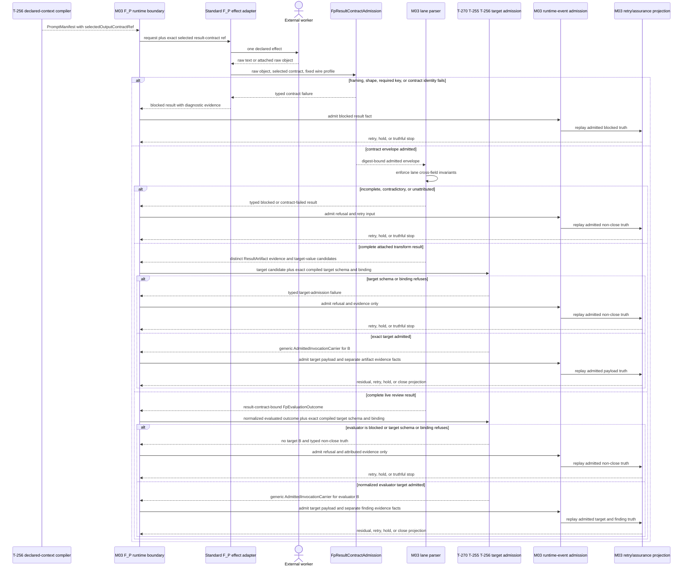
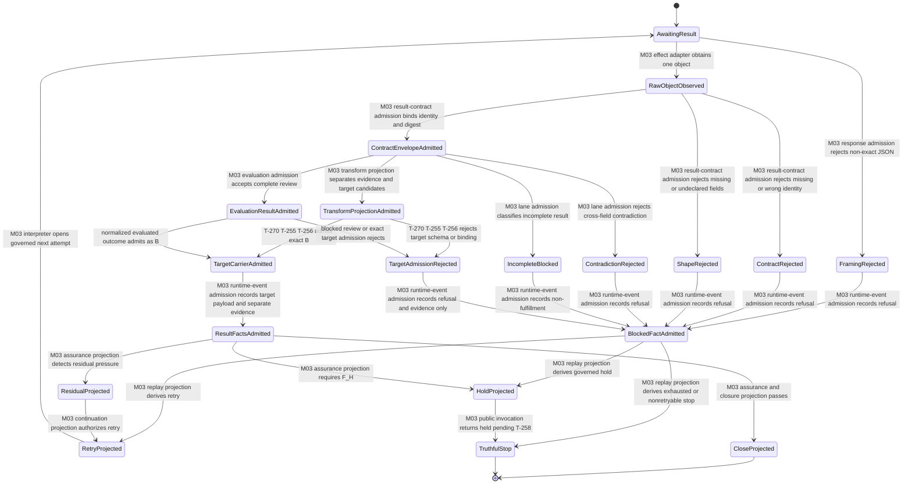

# M03 F_P Result-Contract Admission Behavior Design

**Status**: Accepted under delegated F_H authority; bounded target-separation amendment accepted
**Date**: 2026-07-13; amended 2026-07-19 after T-270/T-271 conformance audit
**Ticket**: `T-257`
**Method authority**: `../../../../.genesis/docs/standards/DESIGN_MODULE_METHOD.md` section 5E
**Tenant authority**: [TYPESCRIPT_REALIZATION_GUARDRAILS.md](./TYPESCRIPT_REALIZATION_GUARDRAILS.md)

## Boundary

This design closes the standard external `F_P` result-admission boundary used
by transform, reviewer, reducer, submitter, and reassessment work. A raw result
must bind the exact result-contract identity selected by the canonical T-256
instruction join and satisfy one declared standard wire profile. It then
becomes either:

- one admitted transform wire projection containing a distinct evidence
  candidate and target-value candidate;
- one admitted evaluator-result projection; or
- one typed blocked/retry input.

Wire admission does not admit the target value as `B`. The exact compiler-
selected target schema, target binding, and generic target carrier remain the
downstream authority owned by T-270 over the T-255/T-256 handoff. Neither a
wire projection nor its evidence is traversal or closure truth. ABG events,
replay, assurance, and the selected composition remain the only route to retry,
continuation, or closure.

### Requirements

- `REQ-L-GTL3-C-ALGEBRA-018`
- `REQ-R-ABG3-PAYLOAD-002`, `-006`, `-010`, `-012`, `-018`, `-021`, `-024`,
  and `-028`
- `REQ-R-ABG3-INSTRUCTION-ASSEMBLY-005`, `-014`, and `-017`
- `T-257` gap family `fp_result_contract_admission`

### Explicit exclusions

- exact target-schema and generic target-carrier admission, owned by T-270 over
  the T-255/T-256 compiled execution handoff;
- hostile in-process object forgery or filesystem tamper resistance;
- semantic truth inferred from worker prose;
- traversal-result conservation, owned by `T-267`;
- F_H interaction, owned by `T-258`;
- any Consensus-specific parser, schema, controller, or runtime branch.

## Design Decisions

### D1. One selected-contract admission atom

`FpResultContractAdmission` is the single module-owned ingress atom. It
receives:

```text
selected result-contract ref
+ raw object
+ one module-owned standard wire profile
-> admitted contract envelope | typed contract failure
```

The atom performs only locally decidable admission:

1. require one non-empty selected contract ref;
2. require an object carrying that exact contract ref;
3. require the profile's exact wire vocabulary;
4. require every profile-required key;
5. reject every undeclared key;
6. preserve the selected contract ref and payload digest.

The worker cannot submit the allowed-key set, required-key set, or selected
contract identity. Those are supplied by the admitted request and the
module-owned parser profile.

Contract-ref equality is lineage conservation, not proof that target content
satisfies the named contract. This atom validates the standard plugin result
interface and admits only its declared top-level fields. For the transform
profile, `target_value` is retained as an opaque candidate; the atom does not
inspect it against the selected target schema or mint a successful domain-
schema verdict from an echoed ref. That exact admission occurs downstream
through the T-270/T-255/T-256 authority chain.

### D2. Two standard wire profiles, one admission family

The current product has two external response profiles:

| Profile | Contract-ref key | Exact top-level vocabulary | Projection |
|---|---|---|---|
| `attached_transform_result` | `result_contract_ref` | `result_contract_ref`, `edge`, `actor`, `fulfillment_assessments`, `target_value` | evidence-only `ResultArtifact` candidate plus distinct target-value candidate |
| `standard_live_review` | `resultContractRef` | `resultContractRef`, `accepted`, `closeDisposition`, `assessmentIds`, `reasons` | normalized `FpEvaluationOutcome` target candidate plus attributed finding evidence |

Alternate spellings fail. The former `attached_result_artifact` identity is
retired with no alias or compatibility branch. This distinction is
serialization law, not two semantic authorities: one
`FpResultContractAdmission` family owns both projections. `target_value` is
mandatory for `attached_transform_result` and forbidden for
`standard_live_review`. Other undeclared top-level fields fail; domain fields
inside `target_value` remain opaque until exact downstream target admission.
For an admitted evaluator response, the normalized `FpEvaluationOutcome`
itself is the evaluator locus candidate `B`; `blocked` evaluator output carries
no target candidate. Both candidate forms cross the same compiler-selected
target-schema and target-binding admission before payload truth.

### D3. Selected identity is conserved

The selected result-contract ref flows unchanged through:

```text
DeclaredFpExecutionRequest / PromptManifest
  -> FpTransformRequest or live evaluator input
  -> DispatchRequest when the attached lane is used
  -> FpResultContractAdmission
  -> attached transform projection
       -> ResultArtifact evidence candidate
       -> distinct target-value candidate
  -> or normalized FpEvaluationOutcome candidate plus finding evidence
  -> exact downstream target admission and separate evidence/finding admission
```

No plugin chooses, widens, or substitutes this identity.

For `attached_transform_result`, the response `edge` must also equal the
compiler-selected `GraphVector.name` used as the T-271 C-call edge coordinate.
The vector edge is conserved through actor-result evidence, target admission,
and C-call enclosure. AST `sourcePath` and `nodeRef` remain program-locus
coordinates and cannot substitute for that graph edge.

### D4. Transform results are a closed status family

| Status | `reason` | `artifactRef` | evidence candidates | Meaning |
|---|---|---|---|---|
| `returned` | must be null | required | non-empty, complete, non-contradictory, non-deferred | contract-admitted evidence proposal with a distinct required target-value candidate |
| `blocked` | required | optional | may preserve partial candidates | admitted non-fulfillment proposal |
| `runtime_failed` | required | optional | must be empty | substrate failure truth |
| `contract_failed` | required | optional | must be empty | malformed or contradictory result truth |

Construction and raw admission enforce the same table. Invalid combinations
do not normalize into a valid status.

### D5. Exact JSON framing

Standard live external output is exactly one JSON object surrounded only by
JSON whitespace. Prose, Markdown fences, prefixes, suffixes, multiple objects,
arrays, and scalars are contract failures. Raw text remains diagnostic
evidence, but no first-brace/last-brace extraction is allowed.

### D6. Review output cannot close by omission

The standard live review profile requires all five keys:

```text
resultContractRef
accepted
closeDisposition
assessmentIds
reasons
```

Cross-field law is closed:

- `accepted: true` requires `closeDisposition: close` and exact attestation of
  all expected assessment identities;
- `accepted: false` requires `closeDisposition: retry` and at least one reason;
- unexpected or duplicate assessment identities fail admission;
- missing fields never receive defaults.

An admitted close candidate remains a proposal consumed by ABG event and
assurance folds.

## Irreducible Architectural Carrier Set

| Carrier | Visibility | Authority | Role |
|---|---|---|---|
| `SelectedFpResultContract` | public field relation | prime input | exact T-256-selected result-contract identity |
| `FpStandardWireProfile` | module-local | subordinate policy | exact field vocabulary for one standard external response family |
| `AdmittedFpResultContractEnvelope` | public | prime admitted result basis | selected identity plus digest-bound raw object |
| `FpResultContractFailure` | public typed disposition | subordinate | malformed, missing, wrong-contract, or contradictory refusal |
| `FpTransformRequest` | public | prime request | transform identity, actor, result, retry, and selected result contract |
| `DispatchRequest` | public | prime request | attached-result expectation and selected result contract |
| `FpTransformWireProjection` | public | subordinate admitted proposal | one admitted wire envelope projected into distinct evidence and target-value candidates |
| `ResultArtifact` | public | subordinate evidence proposal | request-bound fulfillment evidence; never the target `B` |
| `FpTargetValueCandidate` | public | subordinate target candidate | opaque `target_value` retained for exact downstream target-schema admission |
| `FpTransformResult` | public | subordinate admitted proposal | closed transform status family |
| `FpEvaluationOutcome` | public | subordinate target candidate and evidence proposal | normalized evaluated outcome is evaluator-locus `B`; blocked outcome carries no `B` |
| `AdmittedInvocationCarrier` | public downstream | prime target admission | exact compiler-selected `B` admitted by T-270/T-255/T-256, not by this wire atom |
| `RuntimeEvent` stream | public | authoritative | admitted runtime truth |
| retry and closure projections | public downstream | downstream | replay-derived continuation or truthful stop |

## Domain Model

```mermaid
classDiagram
  direction LR

  class DeclaredFpExecutionRequest {
    <<prime>>
    <<authoritative>>
    +resultContractRef
    +envelopeRef
  }
  class PromptManifest {
    <<prime>>
    +selectedOutputContractRef
    +promptDigest
  }
  class FpTransformRequest {
    <<prime>>
    +requestRef
    +resultRef
    +selectedResultContractRef
  }
  class DispatchRequest {
    <<prime>>
    +dispatchRef
    +selectedResultContractRef
  }
  class RawFpResult {
    <<effect-edge>>
    +unknown object
  }
  class FpStandardWireProfile {
    <<subordinate>>
    -contractRefField
    -allowedFields
    -requiredFields
  }
  class FpResultContractAdmission {
    <<authoritative>>
    +admit selected identity
    +close wire vocabulary
    +digest payload
  }
  class AdmittedFpResultContractEnvelope {
    <<prime>>
    +resultContractRef
    +payloadDigest
    +payload
  }
  class FpResultContractFailure {
    <<subordinate>>
    +failureClass
    +detail
  }
  class ResultArtifact {
    <<subordinate>>
    +resultContractRef
    +fulfillmentAssessments
    +identityIssues
    +evidence only
  }
  class FpTargetValueCandidate {
    <<subordinate>>
    +unknown targetValue
    +selectedResultContractRef
  }
  class FpTransformWireProjection {
    <<subordinate>>
    +resultArtifactCandidate
    +targetValueCandidate
  }
  class FpTransformResult {
    <<subordinate>>
    +resultContractRef
    +status
    +reason
  }
  class FpEvaluationOutcome {
    <<subordinate>>
    +resultContractRef
    +status
    +findings
  }
  class AdmittedInvocationCarrier {
    <<downstream-prime>>
    +targetContractRef
    +admittedValue
    +valueDigest
  }
  class RuntimeEventLog {
    <<authoritative>>
    +admitted payload facts
    +admitted finding facts
    +retry facts
  }
  class AssuranceProjection {
    <<downstream>>
    +retry
    +hold
    +close
    +blocked
  }
  class ExactTargetSchemaAdmission {
    <<downstream-authoritative>>
    +compiler selected schema
    +target binding
  }

  DeclaredFpExecutionRequest --> PromptManifest : conserves selection
  PromptManifest --> FpTransformRequest : supplies selected contract
  FpTransformRequest --> DispatchRequest : supplies selected contract
  RawFpResult --> FpResultContractAdmission : submitted to
  FpStandardWireProfile --> FpResultContractAdmission : constrains
  PromptManifest --> FpResultContractAdmission : selects contract
  FpResultContractAdmission --> AdmittedFpResultContractEnvelope : admits
  FpResultContractAdmission --> FpResultContractFailure : refuses
  AdmittedFpResultContractEnvelope --> FpTransformWireProjection : transform profile projection
  AdmittedFpResultContractEnvelope --> FpEvaluationOutcome : review profile parse
  FpTransformWireProjection *-- ResultArtifact : evidence candidate
  FpTransformWireProjection *-- FpTargetValueCandidate : target candidate
  ResultArtifact --> FpTransformResult : request-bound evidence classification
  FpTargetValueCandidate --> ExactTargetSchemaAdmission : candidate only
  FpEvaluationOutcome --> ExactTargetSchemaAdmission : evaluated candidate B only
  ExactTargetSchemaAdmission --> AdmittedInvocationCarrier : T-270 T-255 T-256 exact target admission
  FpTransformResult --> RuntimeEventLog : admitted proposal only
  AdmittedInvocationCarrier --> RuntimeEventLog : admitted target payload only
  FpEvaluationOutcome --> RuntimeEventLog : attributed finding evidence only
  RuntimeEventLog --> AssuranceProjection : replay input
```



## Execution Sequence



The external worker is the only effect actor. The admission atom does not
invoke workers, emit events, select continuation, or close traversal.

## Lifecycle State Model



Every transition names its owning admission, adapter, interpreter, event, or
projection. There is no raw-output-to-close transition.

## Cross-View Checks

| Check | Evidence | Verdict |
|---|---|---|
| Every sequence participant exists in the domain model or is external | compiler/request, runtime, adapter, worker, wire admission, lane projection, downstream target admission, events, and replay are represented | `pass` |
| Every lifecycle carrier exists in the domain model | raw, admitted envelope, failures, evidence and target candidates, exact target carrier, result variants, events, and projections are represented | `pass` |
| Every message binds a declared transform or effect | one worker effect; all later steps are admissions or replay projections | `pass` |
| Every transition names its owner | state labels name M03 admission, adapter, interpreter, event, or projection | `pass` |
| Raw F_P output cannot become accepted or closed directly | contract envelope and lane admission precede events; replay precedes close | `pass` |
| Contract identity remains exact | one selected ref is conserved and checked against the worker response | `pass` |
| Incomplete or contradictory output remains non-closing | closed status/review tables produce blocked or contract failure | `pass` |
| Evidence is not substituted for target `B` | transform wire projection owns distinct `ResultArtifact` evidence and `target_value` candidates; only downstream exact target admission creates `AdmittedInvocationCarrier` | `pass` |
| Wire profiles remain Prime | one admission family produces two projections; no second parser or schema authority is introduced | `pass` |

## Axiom Evaluation

| Axiom | Authority | Domain evidence | Sequence evidence | State evidence | Native enforcement | Admission/compiler enforcement | Verdict | Gap owner |
|---|---|---|---|---|---|---|---|---|
| F_P output is data, not closure truth | `C-ALGEBRA-018`; `PAYLOAD-012` | raw output is effect-edge-only | admission and replay are mandatory | no raw-to-close edge | distinct carriers | closed ingress plus event folds | `pass` | none |
| Selected result contract is exact and addressable | `INSTRUCTION-ASSEMBLY-005/-014` | selected ref is prime request truth | same ref reaches admission | wrong ref enters refusal | required carrier field on declared path | equality check at one atom | `pass` | none |
| Standard response schemas are closed | `C-ALGEBRA-018` | fixed profiles and admitted envelope | profile precedes lane parser | unknown key enters refusal | readonly closed normalized carriers | exact allowed/required key checks | `pass` | none |
| Contract-ref echo is not domain validation | `PAYLOAD-024/-028` | admitted envelope separates lineage from target admission | opaque target candidate proceeds only to exact downstream admission | target refusal is non-closing | no fabricated schema-success field | selected-ref equality here; exact schema and binding under T-270/T-255/T-256 | `pass` | T-270 realization |
| Status families are contradiction-free | `C-ALGEBRA-018` | four transform variants have explicit relations | contradictions refuse before events | contradiction state is non-closing | discriminant plus field invariants | constructor and raw admission share checks | `pass` | none |
| Incomplete evaluation cannot close by omission | `PAYLOAD-006`; `INSTRUCTION-ASSEMBLY-014` | review keys and assessment identity are required | no defaults are introduced | incomplete enters blocked | required normalized fields | exact expected-set and cross-field checks | `pass` | none |
| Plugins do not own runtime truth | `PAYLOAD-010/-021` | plugin outputs are subordinate | runtime owns events and replay | only replay projects continuation/close | plugin API has no emit/close capability | engine event admission | `pass` | none |
| Producer and result identity are request-owned | `PAYLOAD-002/-003` | request carriers own actor/result/contract identity | worker echo is checked, not trusted | mismatch refuses | required refs | request-result equality checks | `pass` | none |
| Target values use the compiler-selected declared schema | `PAYLOAD-028` | `target_value` remains a distinct opaque candidate at this boundary | target candidate crosses to downstream exact admission, never directly to events | schema or binding refusal is non-closing | generic candidate and admitted target carriers stay distinct | target admission owned by T-270 over T-255/T-256 | `pass` | T-270 realization |
| Transform edge conserves the compiler-selected graph edge | `CCALL-001..017`; compiler GraphVector authority | response edge is subordinate lineage, not a selector | the same GraphVector edge reaches wire admission and T-271 enclosure | edge mismatch enters contract failure | one required transform edge field | exact equality with compiler-selected `GraphVector.name`; AST locus cannot substitute | `pass` | T-270 realization |
| Transform and evaluator vocabularies cannot blur | `C-ALGEBRA-018` | one family exposes two closed projections | profile is selected before lane projection | transform without `target_value`, or evaluator with it, enters refusal | discriminated profile vocabulary | exact required and forbidden keys | `pass` | none |
| Evaluator output remains a typed traversal value | `C-ALGEBRA-002/-018`; `PAYLOAD-024` | normalized evaluated outcome is evaluator candidate `B`; blocked outcome has none | evaluator candidate crosses the same exact target admission as transform `B` | target refusal is non-closing | one generic admitted target carrier | compiler-selected target schema and binding admit the normalized outcome | `pass` | T-270 realization |
| Defensive scope is proportional | operating trust boundary | external raw data defended; typed in-process values trusted | no hostile-local branch | no tamper states | ordinary readonly carriers | response-boundary checks only | `pass` | none |

## G1-G5 Disposition

| Gap | Proportional disposition | Closure evidence |
|---|---|---|
| G1 | close both top-level vocabularies; retain nested `target_value` as an opaque candidate for exact downstream schema admission | unknown top-level and closure-like fields fail; domain target fields are neither dropped nor treated as admitted here |
| G2 | enforce the four-status relation table in construction and raw admission | contradictory status/reason/evidence combinations fail |
| G3 | exercise malformed, incomplete, contradictory, unattributed, nonretryable, exhausted, and valid results through the supported attached/live path | focused runtime differential plus absence of accepted payload/close facts on refusal |
| G4 | carry the T-256 selected contract through request, admission, result, and evidence | wrong/missing contract fails; admitted result preserves exact ref |
| G5 | exact trimmed JSON object only | prose, fences, suffixes, multiple objects, arrays, and scalars fail |

## Proof Contract

Closure requires all of the following:

1. one generic admission family serves both standard profiles and produces two
   profile-specific projections;
2. one non-Consensus F_P fixture exercises that atom;
3. every canonical T-252 F_P stage invokes the same atom against its compiled
   target result-contract compatibility surface;
4. T-252 body bytes remain at
   `sha256:e1344106d4e90c8883f72c6e1490742b98a839433b89855315fec4b571ca8695`;
5. malformed, incomplete, contradictory, unattributed, nonretryable, and
   exhausted cases remain non-closing on the supported path;
6. `attached_transform_result` requires `target_value`; the former
   `attached_result_artifact` identity has no alias;
7. `standard_live_review` rejects `target_value`;
8. valid transform wire output yields distinct evidence and target candidates;
   only exact downstream T-270/T-255/T-256 target admission may yield the
   generic carrier for `B` and admitted payload facts;
9. a normalized evaluated `FpEvaluationOutcome` is the evaluator-locus target
   candidate and must pass that same exact downstream admission; a blocked
   evaluator outcome carries no target candidate;
10. exact valid output reaches admitted payload/finding facts but does not mint
   traversal closure;
11. semantic, GTL, T-252, focused T-257, packed-publication, Mermaid, and
   source-lint gates pass.

T-257 proves the closed external wire boundary only. The 2026-07-19 audit
corrected its former evidence/target conflation: T-270 owns integration with the
already accepted T-255/T-256 target admission and T-271 traversal interpreter.
This design does not claim that the canonical Consensus graph has run.

## 2026-07-19 Bounded Conformance Amendment

The T-270/T-271 steel-thread audit found that the original transform profile
could admit fulfillment evidence but did not carry the graph target `B` as a
separate candidate. Treating `ResultArtifact` or its assessment-shaped payload
as `B` would violate typed target conservation.

The correction is a hard-break wire re-entry, not a new runtime architecture:

```text
attached_transform_result wire object
  -> one generic F_P result admission family
  -> ResultArtifact evidence candidate
     + distinct target-value candidate
  -> T-270/T-255/T-256 exact target admission
  -> generic admitted target carrier
```

No new public operation, event kind, fluent, graph controller, C-call, target
schema authority, or profile alias is introduced. `ResultArtifact` remains
evidence-only. The evaluator profile remains the second projection of the same
admission family and forbids `target_value`; its normalized evaluated outcome,
not a second wire field, is the evaluator-locus target candidate.

## Design Verdict

`accepted`. G1-G5 and the bounded evidence/target correction are resolved at
design level without introducing a Consensus-specific runtime, a second wire
admission authority, or a local target-schema path. Cross-view consistency now
requires a distinct target candidate and downstream compiler-selected target
admission. Delegated F_H authority authorizes the T-270 realization against
this exact amended boundary.
