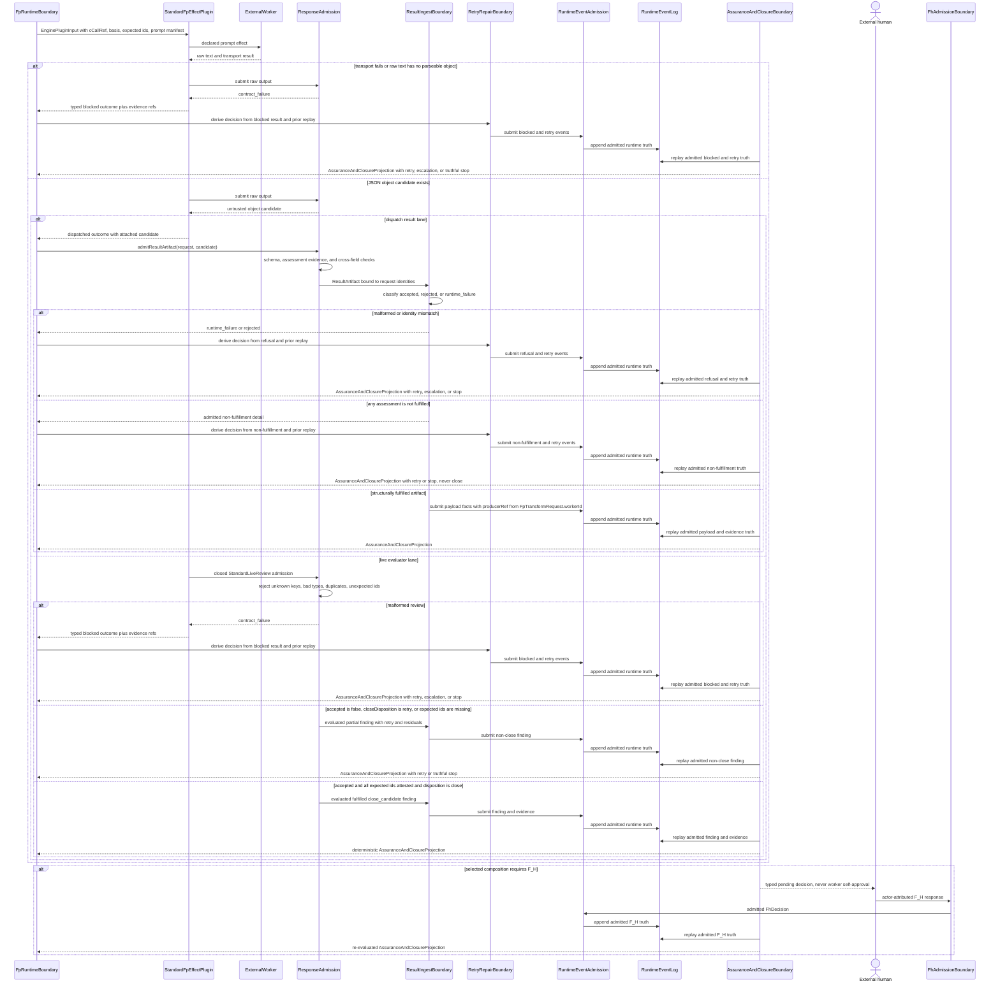
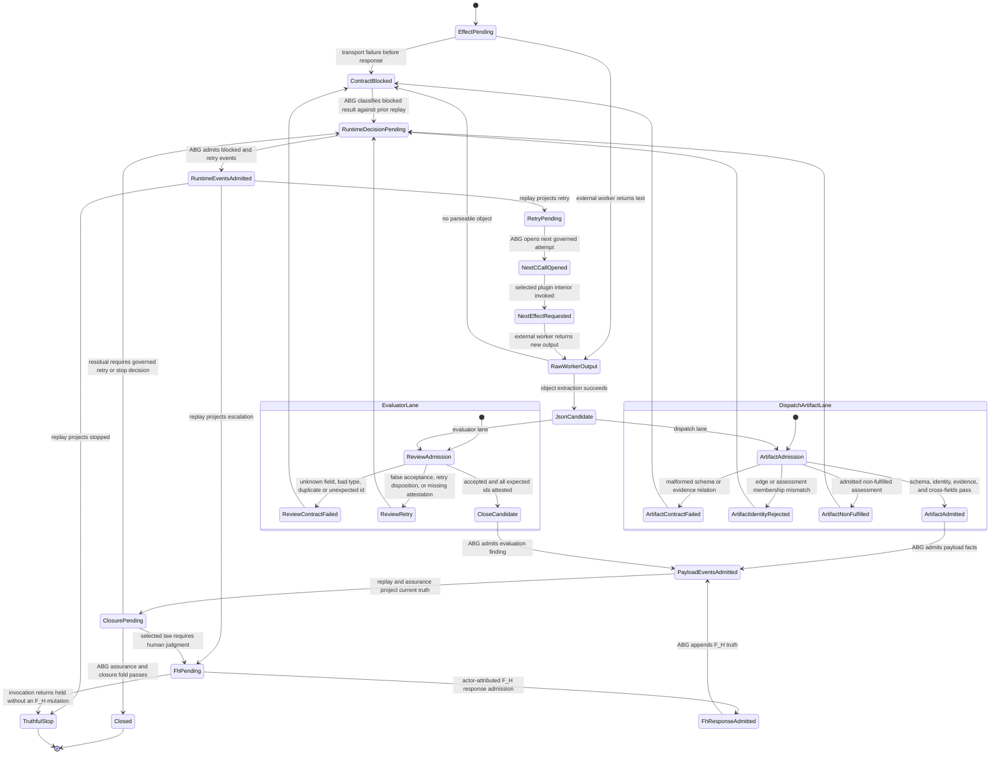

# M03 F_P Output Admission Behavior Design

**Status**: Retrospective three-view design blocked
**Date**: 2026-07-12
**Checkpoints**: `014448f` (`T-220` F_P output admission) and `28da030`
(`T-223` ABG-owned producer attribution)
**Method authority**: `specification_methodology/specification/standards/DESIGN_MODULE_METHOD.md` section 5E
**Tenant authority**: [TYPESCRIPT_REALIZATION_GUARDRAILS.md](./TYPESCRIPT_REALIZATION_GUARDRAILS.md)

## Boundary

- **Design verdict**: `blocked`. Independent axiom review and explicit F_H
  disposition are required; failed applicable axioms prevent acceptance
- **Owning module**: M03 ABG admission, effect-result normalization, payload
  event projection, assurance input, and retry/closure handoff
- **Requirements**: `PRODUCT.md` Conformance And Reflective Product and GTL/ABG
  boundary; `REQ-R-ABG3-PAYLOAD-002`, `-006`, `-010`, `-012`, `-018`, `-021`,
  `-024`; `REQ-R-ABG3-INSTRUCTION-ASSEMBLY-014`; T-220 `AX-T220-05`,
  `AX-T220-08`, and `AX-T220-10`; `REQ-L-GTL3-C-ALGEBRA-018`
- **Ticket or intake**: completed `T-220` phase P4 response boundary plus the
  producer-attribution correction carried by completed `T-223`
- **Code scope at the checkpoint**:
  `contracts/fp_stages.ts`, `runner/standard_live_plugins.ts`,
  `transport/admission.ts`, the attached-result ingest/fold path, and
  `test_t220_fp_output_admission.test.mjs`
- **Dependencies**: selected `ExecutionBasis`; canonical `CCall` and
  `cCallRef`; declared instruction prompt manifest; `DispatchRequest` carrying
  expected edge and assessment identities; standard plugin contracts; ABG
  payload events, assurance projection, retry fold, and closure fold
- **Explicit exclusions**: private worker reasoning; domain-specific semantic
  judgment; hostile in-process object forgery; hostile filesystem or archive
  tampering; final F_H judgment; any claim that an F_P self-report closes a
  graph vector by itself

The defended boundary is likely malformed or contradictory probabilistic
output on one trusted developer desktop. Raw worker text is effect-edge data.
It may become an admitted artifact or an admitted evaluation finding only
after response-shape, request-identity, evidence, expected-membership, and
cross-field checks. An admitted `close_candidate` remains an input to ABG's
assurance and closure folds; it is not closure truth.

## Irreducible Carrier And Role Matrix

| Carrier | Owner | Role | Ingress or construction | Consumers |
|---|---|---|---|---|
| `ExecutionBasis` | M03 ABG | prime authoritative runtime basis | admitted GTL and runtime binding | request construction, payload events, assurance |
| `CCall` / `cCallRef` | M03 ABG | prime authoritative effect identity | engine C-call enclosure | live effect plugin, archive evidence, replay |
| `FpTransformRequest` | M03 ABG | prime request carrier including admitted worker assignment | basis, actor invocation, retry frontier | transform result admission, producer attribution, and event projection |
| `DispatchRequest` | M03 transport | prime effect expectation | selected basis and transition | result-artifact admission and ingest |
| `RawWorkerOutput` | external worker | subordinate untrusted effect payload | agent transport | JSON extraction only |
| `StandardLiveReview` | M03 standard evaluator plugin | subordinate normalized response | closed review admission | evaluation finding construction |
| `ResultArtifact` | M03 transport admission | prime admitted effect-result carrier | response parsing and request binding | result ingest and attached F_P fold |
| `FpTransformResult` | M03 stage admission | prime admitted stage-result carrier | closed result admission and request match | payload, authority, and evidence event construction |
| `FpEvaluationOutcome` | M03 plugin contract | subordinate proposed evaluation-set result | plugin outcome construction/admission | ABG evaluation events and assurance |
| `ResultIngestOutcome` | M03 transport | subordinate total classification | admitted artifact plus request | retry/stop or payload-event path |
| `RuntimeEvent` stream | M03 ABG | prime authoritative runtime truth | ABG event factories and `emit()` | replay, assurance, continuation, closure |
| `RetryRepairDecision` | M03 ABG | subordinate derived decision carrier | prior replay plus blocked/rejected/runtime-failed disposition | retry-event admission; not public transition truth by itself |
| F_H decision | external human through M03 F_H admission | prime external judgment when selected | explicit F_H request/response carrier | ABG continuation and closure fold |

`RawWorkerOutput`, transport archives, `StandardLiveReview`, and plugin-returned
objects are not runtime truth. The `ResultArtifact`, `FpTransformResult`, and
`FpEvaluationOutcome` carriers are also not independent closure authorities:
they become closure-relevant only through ABG admission, events, assurance, and
the selected composition's deterministic closure predicate.

## Domain Model

```mermaid
classDiagram
  direction LR

  class ExecutionBasis {
    <<prime authoritative>>
    +basisId
    +selectedCompositionRef
    +resolvedPolicyRef
  }
  class CCall {
    <<prime effect identity>>
    +cCallRef
    +role
    +fibre: F_P
  }
  class FpRuntimeBoundary {
    <<M03 interpreter boundary>>
    +open selected CCall interior
    +construct request
    +consume typed dispositions
  }
  class FpTransformRequest {
    <<prime request>>
    +requestRef
    +actorInvocationId
    +workerId
    +resultRef
    +expectedAssessmentIds
  }
  class DispatchRequest {
    <<prime effect expectation>>
    +dispatchRef
    +resultRef
    +expectedEdge
    +expectedAssessmentIds
  }
  class ExternalWorker {
    <<external effect>>
    +no runtime authority
  }
  class StandardFpEffectPlugin {
    <<effect handler>>
    +dispatch or evaluate one selected C interior
    +no event or closure authority
  }
  class RawWorkerOutput {
    <<subordinate untrusted>>
    +text
  }
  class JsonObjectCandidate {
    <<subordinate ingress value>>
    +unknown fields
  }
  class ResponseAdmission {
    <<M03 ingress boundary>>
    +extract object
    +validate selected grammar
    +classify refusal
  }
  class StandardLiveReview {
    <<subordinate normalized>>
    +accepted
    +closeDisposition
    +assessmentIds
    +reasons
  }
  class FpEvaluationOutcome {
    <<proposed evaluation result>>
    +status
    +ambiguityStatus
    +findings
  }
  class FpEvaluationFinding {
    <<subordinate finding>>
    +closeDisposition
    +residualPressureRefs
    +continuationRefs
    +evidenceRefs
  }
  class ResultArtifact {
    <<prime admitted effect result>>
    +basisId
    +dispatchRef
    +resultRef
    +artifactPayload
    +identityIssues
    +runtimeFailure
  }
  class FulfillmentAssessment {
    <<subordinate admitted row>>
    +id
    +status
    +blockingReasons
    +evidenceRefs
  }
  class FpTransformResult {
    <<prime admitted stage result>>
    +requestRef
    +actorInvocationId
    +resultRef
    +status
    +evidenceCandidates
  }
  class EvidenceCandidate {
    <<subordinate admitted evidence>>
    +candidateRef
    +authorityRef
    +evidenceRefs
    +complete
    +contradictsAuthority
  }
  class ResultIngestOutcome {
    <<total classification>>
    +accepted | rejected | runtime_failure
  }
  class ResultIngestBoundary {
    <<M03 classification boundary>>
    +ingest request-bound artifact
  }
  class RuntimeEventLog {
    <<prime authoritative truth>>
    +payloadObserved
    +payloadValidated
    +authorityAdmitted
    +evidenceAdmitted
  }
  class RetryRepairDecision {
    <<subordinate derived decision>>
    +retry_planned | retry_escalated | retry_stopped
  }
  class RetryRepairBoundary {
    <<M03 projection boundary>>
    +derive decision from prior replay and current disposition
  }
  class PayloadObservedEvent {
    <<subordinate admitted event>>
    +producerRef
    +payloadRef
    +contractRef
  }
  class RuntimeEventAdmission {
    <<authoritative boundary>>
    +admit blocked, retry, payload, evidence, and F_H events
  }
  class AssuranceAndClosureBoundary {
    <<M03 projection boundary>>
    +fold admitted runtime truth
  }
  class AssuranceAndClosureProjection {
    <<prime downstream projection>>
    +close | retry | block | hold
  }
  class FhDecision {
    <<admitted external judgment carrier>>
    +approve | reject | respond
  }
  class FhAdmissionBoundary {
    <<M03 external-act admission>>
    +admit actor-attributed F_H response
  }

  FpRuntimeBoundary --> ExecutionBasis : consumes
  FpRuntimeBoundary --> CCall : opens
  ExecutionBasis "1" *-- "0..*" CCall : encloses
  FpRuntimeBoundary --> FpTransformRequest : constructs
  CCall --> DispatchRequest : binds expected effect
  CCall --> StandardFpEffectPlugin : selects one effect interior
  StandardFpEffectPlugin --> ExternalWorker : invokes declared effect
  ExternalWorker --> RawWorkerOutput : produces
  RawWorkerOutput --> ResponseAdmission : submits
  ResponseAdmission --> JsonObjectCandidate : JSON extraction
  ResponseAdmission --> StandardLiveReview : evaluator admission
  StandardLiveReview --> FpEvaluationOutcome : normalized by one predicate
  FpEvaluationOutcome "1" *-- "0..*" FpEvaluationFinding : contains
  ResponseAdmission --> ResultArtifact : dispatch artifact admission
  ResultArtifact "1" *-- "0..*" FulfillmentAssessment : contains
  ResultArtifact --> ResultIngestBoundary : submits
  ResultIngestBoundary --> ResultIngestOutcome : classifies
  FpTransformRequest --> FpTransformResult : request-bound admission
  FpTransformResult "1" *-- "0..*" EvidenceCandidate : contains
  ResultIngestOutcome --> RuntimeEventAdmission : accepted payload facts only
  FpTransformResult --> RuntimeEventAdmission : returned admitted evidence only
  FpEvaluationOutcome --> RuntimeEventAdmission : submits admitted findings
  ResultIngestOutcome --> RetryRepairBoundary : rejected or failed
  RetryRepairBoundary --> RetryRepairDecision : produces
  RetryRepairBoundary --> RuntimeEventAdmission : submits retry-event request with decision payload
  RuntimeEventLog --> AssuranceAndClosureBoundary : replay input
  AssuranceAndClosureBoundary --> AssuranceAndClosureProjection : produces
  RuntimeEventAdmission --> RetryRepairDecision : consumes decision payload
  RuntimeEventAdmission --> RuntimeEventLog : appends admitted truth
  RuntimeEventLog "1" *-- "0..*" PayloadObservedEvent : contains
  FpTransformRequest --> PayloadObservedEvent : supplies ABG-owned producerRef
  AssuranceAndClosureBoundary --> FhAdmissionBoundary : requests external judgment when projection holds
  FhAdmissionBoundary --> FhDecision : produces admitted act
  RuntimeEventAdmission --> FhDecision : consumes admitted response payload
```



The three result families are deliberately distinct. A transport
`ResultArtifact` proves that a declared effect returned a structurally and
identity-admissible fulfillment payload. An `FpTransformResult` proposes
evidence under one active transform request. An `FpEvaluationOutcome` proposes
semantic findings. None owns traversal or closure.

## Execution Sequence



The plugin may parse and normalize its one effect interior. It may return a
blocked outcome, an attached artifact candidate, or an evaluation finding. The
engine owns every retry, event, continuation, F_H transition, and final closure
decision after that boundary.

## Lifecycle State Machine



There is no transition from `RawWorkerOutput`, `JsonCandidate`, or
`CloseCandidate` directly to `Closed`. `Closed` is reachable only through
admitted runtime facts and the ABG assurance/closure fold. F_H is an explicit
external act, not an inference from worker output.

## Cross-View Invariants

| Check | Evidence | Verdict |
|---|---|---|
| Every sequence participant exists in the domain model or is external | Engine, plugin effect, worker, admission, event truth, folds, and F_H all have modeled owners | `pass` |
| Every lifecycle carrier exists in the domain model | Raw output, admitted artifacts/findings, retry, event, closure, and F_H families are represented | `pass` |
| Every message names a typed transform, interpreter act, admission, or effect boundary | Worker call is the only external effect; later messages are admissions or ABG projections | `pass` |
| Every transition names an admission, compiler, interpreter, event, projection, or external owner | Admission owns refusal; ABG owns retry/stop/close; F_H owns human judgment | `pass` |
| Raw F_P output cannot transition directly to accepted or closed | Both views require response admission and ABG event/fold consumption, but G3 records that the full engine differential is absent | `fail` |
| Plugins and handlers own interiors only | Standard plugin parses one response and proposes an outcome; it does not emit events or close | `pass` |
| Contradictory output cannot remain close-eligible | The live-review predicate is closed, but G2 shows the broader transform-result status/field family is not | `fail` |
| Fulfilled artifact evidence is non-empty | Fulfilled assessment admission requires at least one evidence ref | `pass` |
| Request identity is conserved | Transform request/result refs are matched; dispatch edge and assessment membership become rejection issues | `pass` |
| Producer attribution is ABG-owned | `FpTransformRequest.workerId`, not worker output, supplies `PayloadObservedEvent.producerRef` | `pass` |
| The selected response contract is explicit and addressable | Standard evaluator response shape is private to the plugin; dispatch admission neither rejects undeclared top-level keys nor binds a selected schema for declared extension sections | `fail` |
| Batch, recursion, nested workflow, and fan-out use declared algebra | This is one scalar effect-result boundary; those families are not implemented here | `not_applicable` |

## Axiom Evaluation

| Axiom | Authority | Domain evidence | Sequence evidence | State evidence | Native enforcement | Admission/compiler enforcement | Verdict | Gap owner |
|---|---|---|---|---|---|---|---|---|
| F_P output is response data, not accepted assessment or closure truth | `REQ-L-GTL3-C-ALGEBRA-018`; T-220 `AX-T220-10`; PRODUCT GTL/ABG boundary | Raw output is subordinate and external | The designed path passes response admission, events, and fold | No designed raw-to-closed transition | Distinct readonly request/result/outcome carriers | Focused boundaries exist, but no full engine differential proves the composition | `fail` | G3 |
| Worker success and parseable shape are insufficient for closure | `REQ-R-ABG3-INSTRUCTION-ASSEMBLY-014`; `REQ-R-ABG3-PAYLOAD-012` | Transport output is not a runtime prime | Parse success leads only to response admission | JSON candidate is non-terminal | Plugin outcome lacks event or closure capability | Later artifact/finding admission and assurance remain mandatory | `pass` | none |
| Missing, malformed, contradictory, and accepted states are classified | `REQ-R-ABG3-PAYLOAD-006`; `REQ-L-GTL3-C-ALGEBRA-018` | Distinct blocked, rejected, retry, candidate, and admitted carriers exist, but the transform-result shell permits contradictory status/field combinations | Malformed blocks; contradiction should retry; complete response becomes candidate | G2 lacks refusal states for invalid status/field combinations | Status is discriminated but subordinate fields are optional across variants | Parsers classify many cases but do not close the full family | `fail` | G2 and G3 |
| Closure-relevant payload has an ABG-admitted envelope and identity | `REQ-R-ABG3-PAYLOAD-002`, `-003`, `-024` | `ResultArtifact` and `FpTransformResult` bind basis/request/result identity | Ingest precedes payload events | Identity mismatch enters rejected, not admitted | Typed refs and constructors | Request matching and identity issue projection | `pass` | none |
| Fulfilled evidence cannot be empty or contradictory | T-220 `AX-T220-10`; `REQ-R-ABG3-PAYLOAD-008`, `-018` | Assessment and evidence-candidate rows carry evidence and authority refs | Evidence checks occur before admitted facts | Bad evidence enters contract failure | Required typed fields | Complete evidence requires refs; fulfilled assessment rejects blocking reasons | `pass` | proof gap G3 |
| Plugins do not own traversal, retry, events, continuation, or closure | T-220 `AX-T220-05`; `REQ-R-ABG3-PAYLOAD-010` | Plugin outputs are subordinate to ABG truth | Engine consumes proposed outcomes and owns folds | Retry and close transitions are ABG-owned | Plugin interfaces expose effect methods, not emit/close methods | Engine admits outcomes and emits events | `pass` | none |
| Worker output cannot author producer identity | `REQ-R-ABG3-PAYLOAD-002/-010`; ABG event ownership | transform request and payload-observed event carry the producer relation | accepted payload event takes producerRef from admitted request workerId | producer attribution appears only after event admission | `FpTransformRequest.workerId` is required | event construction ignores any worker-supplied producer field | `pass` | none |
| Serialized response admission is closed under the selected contract | `REQ-L-GTL3-C-ALGEBRA-018`; T-220 `AX-T220-08`, `AX-T220-10` | Evaluator shape is closed; attached artifact base fields and extension content are not distinguished by a selected contract | Dispatch path normalizes known fields but silently drops undeclared top-level keys | Undeclared keys and unbound extension sections have no refusal state | Normalized carrier drops unknown fields | Assessment rows and runtime failures are closed; no selected artifact schema governs extensions | `fail` | G1 and G4 |
| Result status and fields form a contradiction-free carrier family | T-220 `AX-T220-10`; tenant carrier-closure law | `FpTransformResult` is one optional-field shell across four statuses | Non-returned results do not emit evidence events, but contradictory combinations can be admitted | Invalid combinations lack distinct refusal transitions | Status union exists without status-indexed payload relation | No full cross-field check for reason, artifact, and evidence by status | `fail` | G2 |
| Defensive scope is proportional to one trusted desktop | GOALS operating boundary; T-220 operating assumption | Foreign worker output is defended; native local objects remain trusted | Checks focus on probable worker malformation and contradiction | No hostile-local tamper states are invented | Ordinary readonly snapshots and types | Runtime response admission, not cryptographic defense | `pass` | none |

## Gap And Exclusion Register

| Gap or exclusion | Why outside or blocking | Owner | Re-entry condition |
|---|---|---|---|
| `G1` attached artifact base and extension admission are not distinguished | `parseNormalizedArtifactPayload` validates required values and closed assessment rows but silently ignores other top-level fields; it neither rejects an undeclared key nor validates a declared domain extension against the selected artifact schema required by `C-ALGEBRA-018` | M03 transport admission plus selected artifact contract | Close the base envelope, name an explicit governed extension section and schema identity when extensions are allowed, reject undeclared keys, validate declared extension content, and pin a closure-like undeclared field |
| `G2` `FpTransformResult` status is not a closed discriminated family | `returned`, `blocked`, `runtime_failed`, and `contract_failed` share optional reason, artifact, and evidence fields without status-specific invariants | M03 stage contracts | Ratify allowed field relations per status, enforce them in construction and raw admission, and pin contradictory combinations |
| `G3` full raw-to-close impossibility lacks one engine-level differential | Focused tests prove parser and plugin outcomes but do not drive malformed and contradictory raw outputs through event admission, assurance, retry, and closure projection in one fixture | M03 proof harness | Add a supported-path negative proving no accepted payload/finding or closed vector appears before all gates pass |
| `G4` selected evaluator response-contract identity is implicit | The standard review grammar is a private plugin interface selected by plugin identity; no explicit response-contract ref/digest is shown at this boundary | GTL declaration plus M03 plugin contract | Independent review either proves plugin-contract identity is sufficient or requires an addressable selected response contract carried into admission |
| `G5` surrounding-text grammar is undecided | Extraction accepts a parseable first-brace-to-last-brace object even though adjacent commentary calls prose wrapping a contract failure | F_H product/design ruling | State whether surrounding prose is lawful transport framing or malformed output, then align parser, comments, and tests |
| Hostile local-object and filesystem tamper resistance | Probability and supported environment do not justify it for 5.0 | product boundary | Re-enter only if the supported deployment or observed incidents change |
| Domain semantic correctness | F_D admission can validate shape, identity, evidence presence, and declared relations, not decide probabilistic semantic truth | selected F_P/F_H composition | Domain evaluator or explicit F_H decision supplies judgment; ABG still owns admission and closure fold |

## Design Verdict

`blocked`. The as-built slice establishes part of the intended safety spine:

```text
raw worker output
  -> response parsing and contract admission
  -> request identity, evidence, expected-membership, and cross-field checks
  -> typed blocked/retry truth or admitted artifact/finding
  -> ABG events and assurance/closure fold
  -> optional explicit F_H act
  -> continuation or closure
```

No retained path is intended to move raw F_P output directly to closure, but
multiple applicable axioms currently fail and the full composed guarantee is not
proved. Independent review must resolve G1, G2, G4, and G5, verify G3, and
record an explicit F_H disposition. This document authorizes no further coding
and does not convert T-220's completed ticket status into design acceptance.
