# M03 Graph-Function Iteration Structural Carrier Diagram

**Status**: Active
**Date**: 2026-04-25
**Derived from**: [M03_GRAPH_FUNCTION_ITERATION_DERIVATION.md](./M03_GRAPH_FUNCTION_ITERATION_DERIVATION.md), [M03_GRAPH_FUNCTION_ITERATION_FIRST_SLICE_IACS.md](./M03_GRAPH_FUNCTION_ITERATION_FIRST_SLICE_IACS.md), [ABG_3_M03_STRUCTURAL_CARRIER_DIAGRAM.md](./ABG_3_M03_STRUCTURAL_CARRIER_DIAGRAM.md), [T-041](../../.ai-workspace/tickets/completed/T-041-design-typescript-m03-replay-derived-graph-function-iteration-and-aggregate-projection.md)

## Purpose

Render the replay-derived TypeScript `M03` graph-function iteration boundary as
one module-bounded carrier topology.

The diagram makes the authority chain visible:

`ExecutionBasis + RuntimeEvent replay -> RuntimeAggregateProjection -> IterationAdvanceDecision -> emitted facts/effect plans`.

Diagnostic exploration remains downstream of that authority chain:

`ExecutionBasis + RuntimeEvent replay -> RuntimeAggregateProjection + IterationAdvanceDecision + AdvancementTransition -> TraversalStructureProbe`.

## Diagram

```mermaid
classDiagram

class ExecutionBasis {
  <<existing prime>>
  <<authoritative>>
  +graphFunction
  +graph
  +job
  +runId
  +workKey
}

class RuntimeEvent {
  <<existing prime>>
  <<authoritative>>
}

class GraphCallEvent {
  <<RuntimeEvent variant>>
}

class FrameEvent {
  <<RuntimeEvent variant>>
}

class VectorTraversalEvent {
  <<RuntimeEvent variant>>
}

class ContinuationEvent {
  <<RuntimeEvent variant>>
}

class RuntimeAggregateProjection {
  <<new prime>>
  <<replay-derived>>
}

class RunProjection {
  <<projection variant>>
}

class GraphCallProjection {
  <<projection variant>>
  +callId
  +graphFunctionId
  +materializationId
}

class FrameProjection {
  <<projection variant>>
  +frameId
  +parentCallId
  +lineageId
}

class ContinuationProjection {
  <<projection variant>>
  +continuationId
  +continuationKind
  +status
}

class IterationAdvanceDecision {
  <<new prime>>
  <<authoritative>>
}

class AdvancementTransition {
  <<existing prime>>
  <<authoritative>>
}

class OpenGraphCallDecision {
  <<decision variant>>
}

class OpenFrameDecision {
  <<decision variant>>
}

class TraverseVectorDecision {
  <<decision variant>>
}

class AwaitVectorClosureDecision {
  <<decision variant>>
}

class CloseFrameDecision {
  <<decision variant>>
}

class CloseGraphCallDecision {
  <<decision variant>>
}

class YieldContinuationDecision {
  <<decision variant>>
}

class TerminalIterationDecision {
  <<decision variant>>
}

class VectorTraversalPlan {
  <<subordinate>>
  -vectorId
  -sourceNodeId
  -targetNodeId
}

class TraversalStructureProbe {
  <<downstream>>
  <<diagnostic projection>>
  +structureKind
  +edge
  +policyRegime
  +transitionKind
  +allowedClaims
  +notAllowedClaims
}

class TraversalNodeProbe {
  <<subordinate>>
  -schemaRef
  -assetKind
}

class TraversalOperatorProbe {
  <<subordinate>>
  -regime
  -binding
}

class TraversalEvaluatorProbe {
  <<subordinate>>
  -regime
  -binding
}

class TraversalRuleProbe {
  <<subordinate>>
  -kind
}

class EffectiveRuntimeBinding {
  <<subordinate>>
  -workspaceRoot
  -carriedContextRefs
  -requiredAssetSurfaceRefs
}

class PublicStart {
  <<M04 ignition only>>
}

class M04StopTaxonomy {
  <<deferred>>
}

RuntimeEvent <|-- GraphCallEvent
RuntimeEvent <|-- FrameEvent
RuntimeEvent <|-- VectorTraversalEvent
RuntimeEvent <|-- ContinuationEvent

RuntimeAggregateProjection *-- RunProjection
RuntimeAggregateProjection *-- GraphCallProjection
RuntimeAggregateProjection *-- FrameProjection
RuntimeAggregateProjection *-- ContinuationProjection

RuntimeAggregateProjection ..> RuntimeEvent : replay
RuntimeAggregateProjection --> ExecutionBasis : scoped by

IterationAdvanceDecision <|-- OpenGraphCallDecision
IterationAdvanceDecision <|-- OpenFrameDecision
IterationAdvanceDecision <|-- TraverseVectorDecision
IterationAdvanceDecision <|-- AwaitVectorClosureDecision
IterationAdvanceDecision <|-- CloseFrameDecision
IterationAdvanceDecision <|-- CloseGraphCallDecision
IterationAdvanceDecision <|-- YieldContinuationDecision
IterationAdvanceDecision <|-- TerminalIterationDecision

IterationAdvanceDecision --> RuntimeAggregateProjection : derives from
IterationAdvanceDecision --> ExecutionBasis : reads graph/job truth
TraverseVectorDecision *-- VectorTraversalPlan
VectorTraversalPlan *-- EffectiveRuntimeBinding

TraversalStructureProbe ..> ExecutionBasis : reads
TraversalStructureProbe ..> RuntimeAggregateProjection : reads
TraversalStructureProbe ..> IterationAdvanceDecision : reads
TraversalStructureProbe ..> AdvancementTransition : reads
TraversalStructureProbe *-- TraversalNodeProbe
TraversalStructureProbe *-- TraversalOperatorProbe
TraversalStructureProbe *-- TraversalEvaluatorProbe
TraversalStructureProbe *-- TraversalRuleProbe

PublicStart ..> ExecutionBasis : admits/resumes only
PublicStart ..> IterationAdvanceDecision : does not replace
IterationAdvanceDecision ..> RuntimeEvent : emits next facts
IterationAdvanceDecision ..> M04StopTaxonomy : consumed later
```

## Reading Rules

- `ExecutionBasis` and `RuntimeEvent` are existing prime `M03` carriers.
- `RuntimeAggregateProjection` and `IterationAdvanceDecision` are the two new
  prime families for this boundary.
- `AdvancementTransition` is an existing prime `M03` carrier consumed by the
  diagnostic projection. This slice does not redefine it.
- `GraphCallEvent`, `FrameEvent`, `VectorTraversalEvent`, and
  `ContinuationEvent` are variants of the existing runtime event family.
- `RunProjection`, `GraphCallProjection`, `FrameProjection`, and
  `ContinuationProjection` must remain separately inspectable even if a first
  implementation returns one aggregate object.
- `VectorTraversalPlan` is subordinate to one `traverse_vector` decision.
- `TraversalStructureProbe` is a downstream diagnostic projection. It is not a
  prime runtime carrier and does not choose traversal, emit facts, or classify
  public stop state.
- `TraversalNodeProbe`, `TraversalOperatorProbe`, `TraversalEvaluatorProbe`,
  and `TraversalRuleProbe` are subordinate payloads inside the diagnostic
  projection only.
- `PublicStart` is an ignition/resume consumer. It is not the internal iterate
  engine.
- Public stop taxonomy remains deferred to `T-035` and `B-030-TS`.

## Sign-Off Claim

This diagram is lawful only if future TypeScript code:

- derives the next internal vector from replayed runtime facts,
- preserves graph-call and frame truth outside run projection alone,
- records vector-local traversal, evaluation, proof, and closure facts,
- keeps diagnostic exploration downstream of `ExecutionBasis`,
  `RuntimeAggregateProjection`, `IterationAdvanceDecision`, and
  `AdvancementTransition`,
- rejects local loop counters as authority, and
- rejects first-vector-only dispatch as graph-function execution parity.
