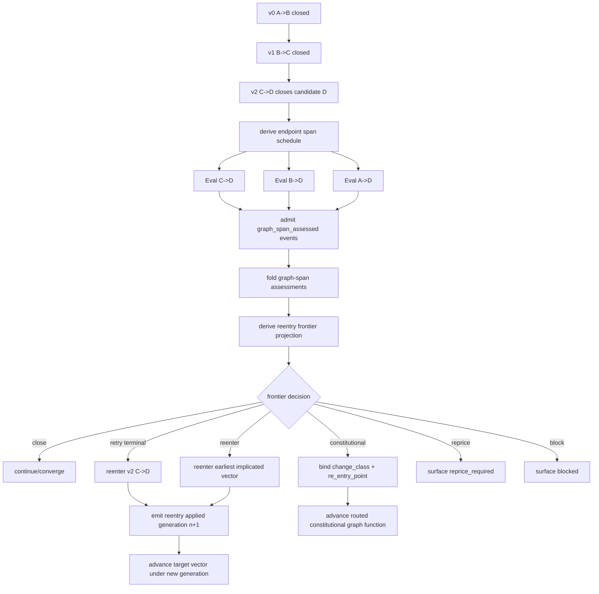
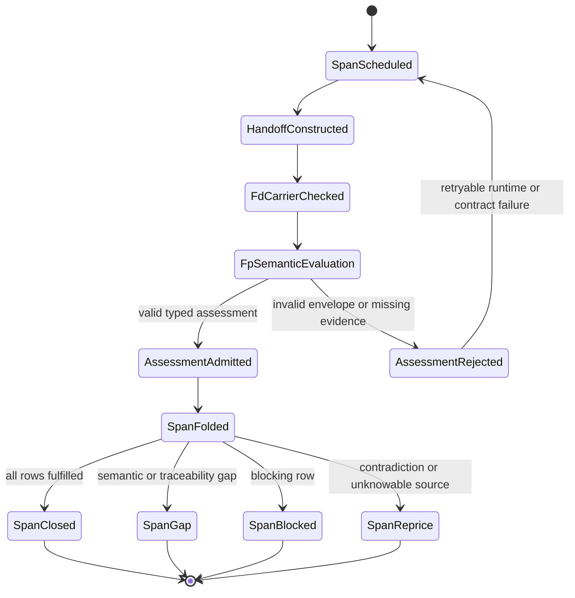
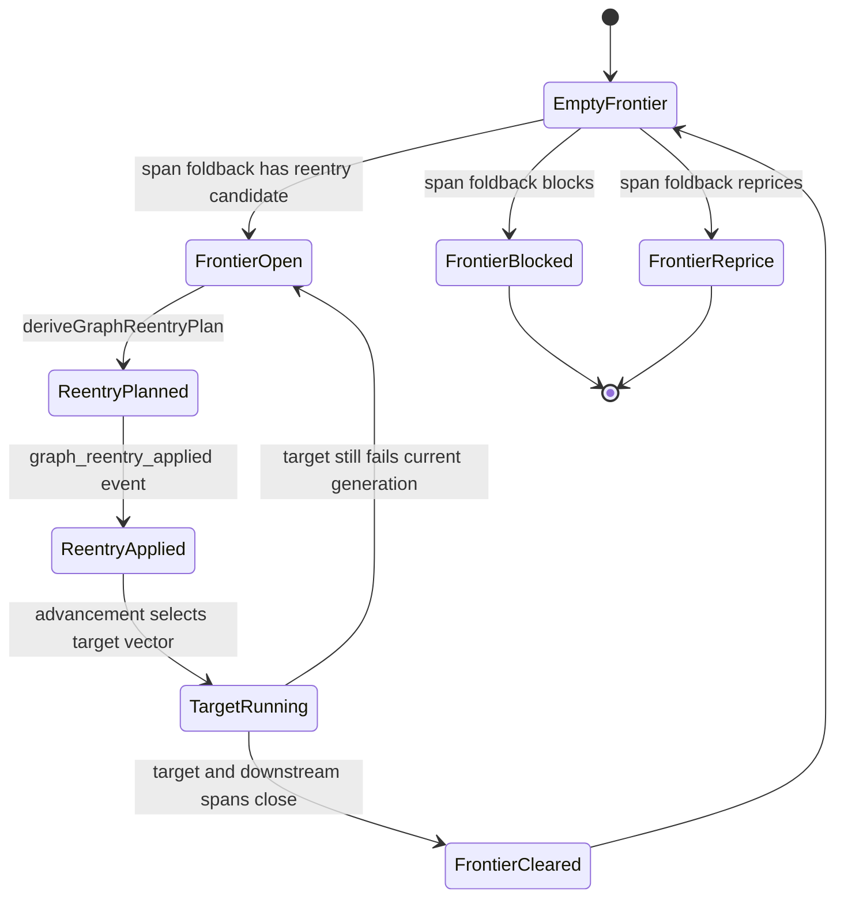
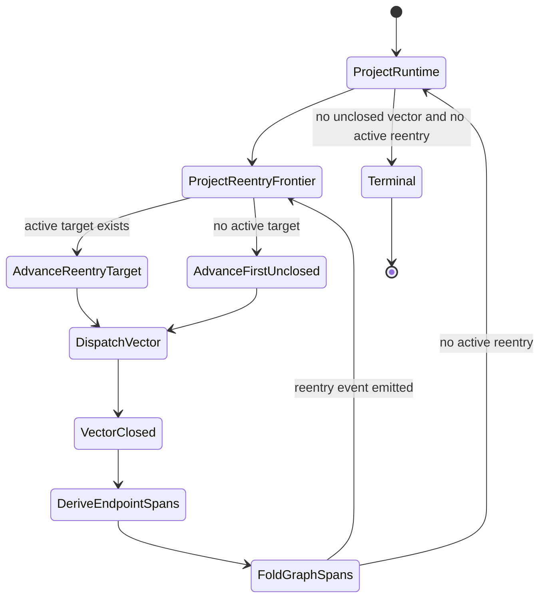
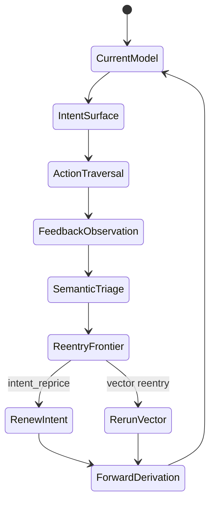
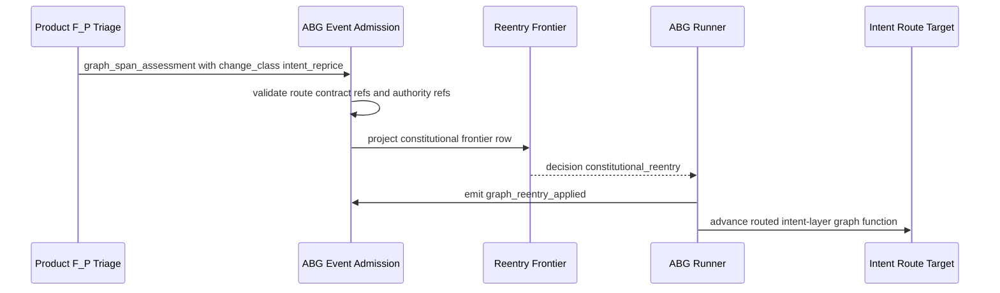
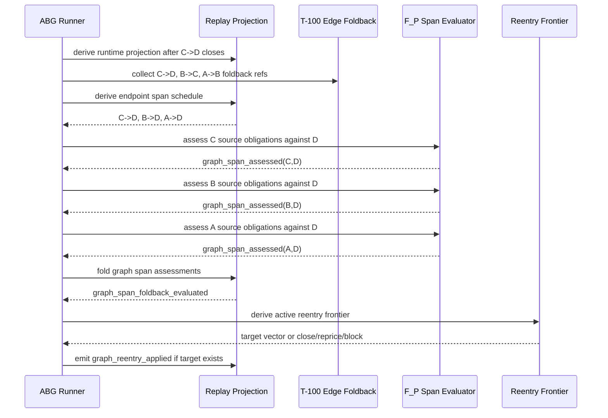
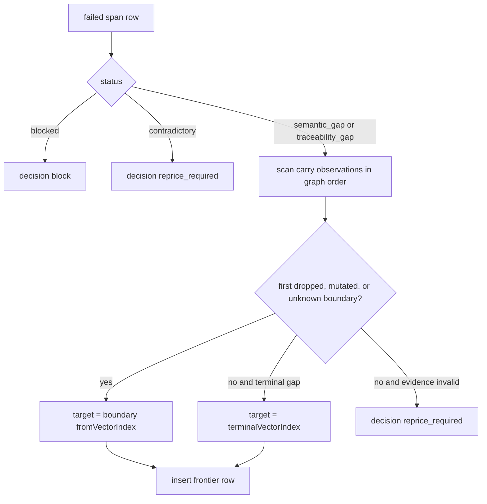
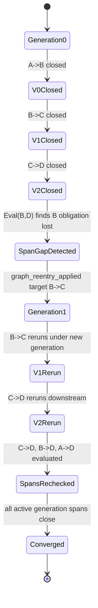
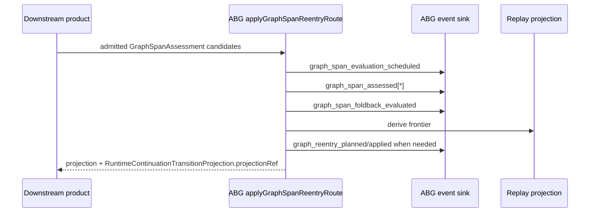

# M03 Graph-Span Foldback And Reentry Derivation

## Status

Design candidate for `T-103`.

This document defines the ABG M03 mechanism for evaluating a completed graph
span such as `A->D` after a composed traversal reaches `D`, projecting a
reentry frontier from admitted span evidence, and routing the next traversal
back to the graph vector or constitutional layer implicated by the failed span.

## Problem

T-100 gives ABG a ledger, schedule, and foldback mechanism for one edge-like
outer boundary:

```text
A -> B
```

That is necessary but not sufficient for SDLC-shaped work. The failing shape is
composed traversal:

```text
A -> B -> C -> D
```

Each local edge may look complete while the terminal artifact `D` no longer
satisfies obligations that entered at `A` or `B`. If ABG only advances by
"first unclosed vector", a downstream product has to invent its own loop:

```text
if Eval(A, D) fails, decide where to restart
```

That is the wrong ownership boundary. ABG owns traversal, projection,
lineage, correction, and reentry. Downstream products own semantic judgment,
not graph-loop control.

There is a second failing shape. Endpoint feedback may prove not merely that an
intermediate vector dropped an obligation, but that the governing intent,
product target, or requirement surface is insufficient. That case must still
enter through ABG replay truth instead of a downstream side loop:

```text
intent -> action/traversal -> feedback/eval -> lawful re-entry -> renewed intent
```

## Governing Truth

This design derives from:

- `specification/PRODUCT.md`: ABG owns replayable control loop and lawful
  re-entry.
- `specification/INTENT.md`: ABG appends events, projects the next surface,
  and advances only through declared graph/function/context truth.
- `REQ-R-ABG3-EVENTS`: runtime truth is reconstructable from events plus GTL
  declarations.
- `REQ-R-ABG3-PROJECTION`: projections are deterministic and replay-derived.
- `REQ-R-ABG3-LINEAGE`: runtime facts preserve graph/function/frame lineage.
- `REQ-R-ABG3-CORRECTION`: correction shadows stale truth without erasing
  history.
- `REQ-R-ABG3-ASSURANCE`: closure is a total projection over current authority
  and admitted runtime events.
- `M03_OUTPUT_ALLOCATION_AND_WORKSPACE_ZOOM_FOLDBACK_DERIVATION.md`: T-100
  per-edge obligation ledger, schedule, assessment, and foldback.
- `/Users/jim/src/apps/specification_methodology/specification/standards/TICKET_METHOD.md`:
  `change_class` is the lawful constitutional re-entry classification and
  `change_intent` is the declared direction of work.
- `.ai-workspace/comments/codex/20260326T024802_STRATEGY_intent-governed-homeostatic-self-evolution.md`:
  the ABIogenesis intent loop is feedback-driven model revision and renewed
  intent.
- `/Users/jim/src/apps/odd_sdlc/.ai-workspace/tickets/completed/T-004-restore-homeostatic-gap-triage-and-intent-renewal.md`:
  the SDLC homeostatic reverse path is observed mismatch, semantic triage,
  lawful re-entry, and renewed forward derivation.
- `/Users/jim/src/apps/odd_sdlc/.ai-workspace/tickets/completed/T-036-realize-typescript-gap-triage-homeostatic-loop-and-ticket-routing.md`:
  downstream products keep observation, classification, route binding,
  repricing proposal, and loopback as separate carriers.
- `/Users/jim/src/apps/odd_sdlc/build_tenants/python/design/TICKET_WORK_ITEM_REENTRY_ROUTING.md`:
  ticket/work-item route contracts carry `change_class`, `re_entry_point`, and
  reentry vector through a published product-owned asset route.

## Core Mechanism

Given a completed path:

```text
v0 = A -> B
v1 = B -> C
v2 = C -> D
```

When `v2` produces candidate terminal artifact `D`, ABG derives endpoint spans:

| Span | Source | Terminal | Covered vectors | Purpose |
| --- | --- | --- | --- | --- |
| `s2` | `C` | `D` | `[v2]` | local terminal-edge correctness |
| `s1` | `B` | `D` | `[v1, v2]` | preservation of B-origin obligations through D |
| `s0` | `A` | `D` | `[v0, v1, v2]` | end-to-end preservation of A-origin obligations through D |

Each span is evaluated against source obligations and the terminal artifact.
The evaluator returns typed semantic observations and may attach a proposed
constitutional re-entry classification. ABG admits those observations, folds
them, and projects the active reentry frontier.

### Step 1: Derive Endpoint Span Schedule

Pure function:

```ts
deriveEndpointSpanSchedule(input: {
  graph: Graph;
  basis: ExecutionBasis;
  terminalVectorIndex: number;
  closedVectorIndexes: readonly number[];
  policy: GraphSpanEvaluationPolicy;
}) -> GraphSpanEvaluationSchedule
```

Default policy for a linear path ending at `terminalVectorIndex`:

```text
for sourceVectorIndex in terminalVectorIndex down to 0:
  span = sourceNode(sourceVectorIndex) -> targetNode(terminalVectorIndex)
```

For `A->B->C->D` after `v2`, the schedule is:

```text
C->D, B->D, A->D
```

The policy may later support bounded windows, declared checkpoint nodes, or
product-specific span hooks, but the default proof must cover the full prefix
set.

### Step 2: Evaluate Each Span

The span evaluator receives:

- source asset ref
- terminal asset ref
- source obligation ledger ref
- covered vector refs
- per-edge T-100 foldback refs
- admitted evidence refs
- current authority and input digests

F_D may verify carrier mechanics, schema, digest, path, and event admissibility.
F_D does not judge semantic correctness.

F_P owns semantic judgment:

```text
Does D materially satisfy A.req_i?
Does D materially satisfy B.req_i?
Does D materially satisfy C.req_i?
```

The evaluator returns a `GraphSpanAssessment`. It may report carry-path
observations, but it does not select the next vector.

### Step 3: Admit Span Assessment

Carrier:

```ts
type GraphChangeClass =
  | "goal_reprice"
  | "intent_reprice"
  | "product_reprice"
  | "requirement_reprice"
  | "design_reframe"
  | "realization_refactor";

type GraphReentryPoint =
  | "goals"
  | "intent"
  | "product_definition"
  | "requirements"
  | "design_surface"
  | "realization"
  | "proof";

interface GraphConstitutionalReentry {
  readonly kind: "graph_constitutional_reentry";
  readonly changeClass: GraphChangeClass;
  readonly reEntryPoint: GraphReentryPoint;
  readonly targetGraphFunctionRef: string | null;
  readonly targetVectorIndex: number | null;
  readonly routeContractRefs: readonly string[];
  readonly authorityRefs: readonly string[];
  readonly rationale: string;
}

interface GraphSpanAssessment {
  readonly kind: "graph_span_assessment";
  readonly spanId: string;
  readonly assessmentId: string;
  readonly sourceNodeRef: string;
  readonly terminalNodeRef: string;
  readonly sourceVectorIndex: number;
  readonly terminalVectorIndex: number;
  readonly coveredVectorIndexes: readonly number[];
  readonly attemptIndex: number;
  readonly assessmentRegime: RuntimeRegime;
  readonly obligationRows: readonly GraphSpanObligationAssessmentRow[];
  readonly constitutionalReentry: GraphConstitutionalReentry | null;
  readonly evidenceRefs: readonly string[];
  readonly edgeFoldbackRefs: readonly string[];
  readonly detail: string | null;
}
```

Row:

```ts
type GraphSpanObligationAssessmentStatus =
  | "fulfilled"
  | "semantic_gap"
  | "traceability_gap"
  | "constitutional_gap"
  | "stale_input"
  | "contradictory_evidence"
  | "blocked";

interface GraphSpanObligationAssessmentRow {
  readonly obligationId: string;
  readonly sourceAuthorityRef: string;
  readonly status: GraphSpanObligationAssessmentStatus;
  readonly terminalEvidenceRefs: readonly string[];
  readonly carryObservations: readonly GraphSpanCarryObservation[];
  readonly detail: string | null;
}
```

Carry observation:

```ts
type GraphSpanCarryObservationStatus =
  | "carried"
  | "dropped"
  | "mutated"
  | "unknown";

interface GraphSpanCarryObservation {
  readonly fromVectorIndex: number;
  readonly toVectorIndex: number;
  readonly status: GraphSpanCarryObservationStatus;
  readonly evidenceRefs: readonly string[];
}
```

Admission validates:

- span belongs to the active `ExecutionBasis`
- covered vectors are contiguous and in graph order
- source and terminal refs match graph topology
- evidence refs are non-empty for fulfilled rows
- carry observations only reference vectors inside the span
- assessment regime is F_P for semantic rows, except mechanical F_D defect rows
- constitutional reentry proposals carry `changeClass`, `reEntryPoint`,
  authority refs, and route contract refs when a downstream product supplies
  them

### Step 4: Fold Span Assessments

Carrier:

```ts
type GraphSpanFoldbackDecision =
  | "close"
  | "retry_terminal_edge"
  | "reenter_at_vector"
  | "constitutional_reentry"
  | "reprice_required"
  | "blocked";

interface GraphSpanFoldbackEvaluation {
  readonly kind: "graph_span_foldback_evaluation";
  readonly foldbackRef: string;
  readonly basisId: string;
  readonly graphFunctionId: string;
  readonly terminalVectorIndex: number;
  readonly spanAssessmentRefs: readonly string[];
  readonly decision: GraphSpanFoldbackDecision;
  readonly fulfilledCount: number;
  readonly gapCount: number;
  readonly staleInputCount: number;
  readonly blockedCount: number;
  readonly contradictoryCount: number;
  readonly reentryCandidateVectorIndexes: readonly number[];
  readonly earliestReentryVectorIndex: number | null;
  readonly constitutionalReentries: readonly GraphConstitutionalReentry[];
  readonly causingObligationRefs: readonly string[];
}
```

Pure function:

```ts
foldGraphSpanAssessments(input: {
  basis: ExecutionBasis;
  terminalVectorIndex: number;
  schedule: GraphSpanEvaluationSchedule;
  assessments: readonly GraphSpanAssessment[];
  edgeFoldbacks: readonly ZoomFoldbackEvaluation[];
}) -> GraphSpanFoldbackEvaluation
```

Decision law:

1. If any span row is `blocked`, decision is `blocked`.
2. If any row has contradictory authority, contradictory evidence, or malformed
   constitutional route evidence, decision is `reprice_required`.
3. If any admitted assessment carries a constitutional reentry proposal, decision
   is `constitutional_reentry`.
4. If all required rows are fulfilled, decision is `close`.
5. If `Eval(C,D)` fails for the terminal edge, decision is
   `retry_terminal_edge` with `earliestReentryVectorIndex = v2`.
6. If an upstream span fails and carry-path evidence identifies the first bad
   vector, decision is `reenter_at_vector`.
7. If an upstream span fails but first bad vector cannot be derived, decision
   is `reprice_required`, not arbitrary retry.

### Step 5: Derive First Bad Vector

Pure function:

```ts
deriveFirstBadVector(input: {
  span: GraphSpanRef;
  row: GraphSpanObligationAssessmentRow;
}) -> number | null
```

Rule:

1. Walk carry observations in graph order.
2. The first observation whose status is `dropped`, `mutated`, or `unknown`
   is the first bad boundary.
3. Return that observation's `fromVectorIndex`.
4. If no carry observation explains the gap but the terminal row is still a
   semantic gap, return the terminal vector index.
5. If the assessment carries a constitutional reentry proposal, the graph vector
   target may be null because the target is a lawful constitutional layer.
6. If evidence is contradictory or structurally invalid, return null and let
   foldback reprice or block.

Example:

| Evaluation | Carry evidence | Reentry |
| --- | --- | --- |
| `Eval(C,D)` fails | terminal transform did not satisfy C obligation | `C->D` |
| `Eval(B,D)` fails | B obligation was dropped during `B->C` | `B->C` |
| `Eval(A,D)` fails | A obligation was dropped during `A->B` | `A->B` |
| `Eval(A,D)` fails | evaluator cannot locate where it was dropped | reprice/block |

### Step 6: Project Reentry Frontier

Carrier:

```ts
interface GraphReentryFrontierRow {
  readonly kind: "graph_reentry_frontier_row";
  readonly rowId: string;
  readonly basisId: string;
  readonly graphFunctionId: string;
  readonly terminalVectorIndex: number;
  readonly targetVectorIndex: number | null;
  readonly changeClass: GraphChangeClass | null;
  readonly reEntryPoint: GraphReentryPoint | null;
  readonly constitutionalReentry: GraphConstitutionalReentry | null;
  readonly routeContractRefs: readonly string[];
  readonly spanFoldbackRef: string;
  readonly causingSpanAssessmentRefs: readonly string[];
  readonly causingObligationRefs: readonly string[];
  readonly severity: "retry" | "constitutional_reentry" | "reprice" | "block";
  readonly generation: number;
  readonly clearedByGeneration: number | null;
}

interface GraphReentryFrontierProjection {
  readonly kind: "graph_reentry_frontier_projection";
  readonly basisId: string;
  readonly graphFunctionId: string;
  readonly generation: number;
  readonly activeRows: readonly GraphReentryFrontierRow[];
  readonly activeTargetVectorIndex: number | null;
  readonly activeReEntryPoint: GraphReentryPoint | null;
  readonly activeChangeClass: GraphChangeClass | null;
  readonly decision: "advance" | "reenter" | "constitutional_reentry" | "reprice" | "block";
  readonly projectionRef: string;
}
```

Pure function:

```ts
deriveGraphReentryFrontierProjection(input: {
  basis: ExecutionBasis;
  events: readonly RuntimeEvent[];
}) -> GraphReentryFrontierProjection
```

Projection rules:

- The frontier is derived from events only.
- Earlier graph-order targets outrank later targets.
- `block` outranks retry.
- Constitutional reentry with admitted route authority outranks graph-vector
  retry, because upstream constitutional truth governs downstream realization.
- `reprice` outranks retry when the target is not derivable.
- A later close in a higher generation clears rows for the same target and
  causing obligation.
- Prior events remain visible; projection determines the active frontier.

### Step 7: Derive And Apply Reentry Plan

Carrier:

```ts
interface GraphReentryPlan {
  readonly kind: "graph_reentry_plan";
  readonly planRef: string;
  readonly basisId: string;
  readonly graphFunctionId: string;
  readonly fromTerminalVectorIndex: number;
  readonly targetVectorIndex: number | null;
  readonly changeClass: GraphChangeClass | null;
  readonly reEntryPoint: GraphReentryPoint | null;
  readonly routeContractRefs: readonly string[];
  readonly generation: number;
  readonly causingFrontierRowRefs: readonly string[];
  readonly shadowedVectorIndexes: readonly number[];
  readonly reason: string;
}
```

Pure function:

```ts
deriveGraphReentryPlan(input: {
  basis: ExecutionBasis;
  runtimeProjection: RuntimeAggregateProjection;
  frontier: GraphReentryFrontierProjection;
}) -> GraphReentryPlan | null
```

When a plan is applied, ABG emits a reentry event. The event does not delete
prior `vector_closed` facts. It establishes a new generation where the target
vector and all downstream vectors, or the routed constitutional layer and its
downstream derivation surface, must be reclosed against current authority.

Runtime advancement then reads the active reentry frontier before default
`first unclosed vector` logic:

```text
if active reentry frontier has target:
  if target is graph vector:
    advance target vector in current generation
  if target is constitutional layer:
    bind declared route contract and advance that layer's graph function
else:
  advance first unclosed vector
```

## Events

New M03 event families:

```ts
type RuntimeEvent =
  | GraphSpanEvaluationScheduledEvent
  | GraphSpanAssessedEvent
  | GraphSpanFoldbackEvaluatedEvent
  | GraphReentryPlannedEvent
  | GraphReentryAppliedEvent
  | ExistingRuntimeEvent;
```

Required fields:

- `basisId`
- `graphFunctionId`
- `runId`
- `workKey`
- `graphCallId`
- `frameId`
- `frameLineageId`
- `terminalVectorIndex`
- `sourceVectorIndex` where applicable
- `coveredVectorIndexes`
- `spanId`
- `assessmentId` or `foldbackRef` or `planRef`
- `changeClass` and `reEntryPoint` when the event carries constitutional
  reentry
- `routeContractRefs` when the event applies a downstream route contract
- `generation`
- `causationEventRefs`
- `correlationId`

## Register Semantics

The phrase "update the register" means:

```text
append admitted runtime events
derive GraphReentryFrontierProjection by replay
```

There is no mutable authoritative register file. Materialized register files
may exist under `.ai-workspace/runtime/` for operator inspection, but they are
read models over event truth.

This matches existing ABG law:

- event stream is append-only
- projection is replay-derived
- correction shadows stale truth
- assurance and lineage registers are projections, not independent ledgers

## Intent Loop Integration

The prior intent-loop discussion is not a separate runtime. It is the higher
order case of the same foldback/reentry mechanism.

The ABIogenesis strategy surface describes the loop as:

```text
self-model -> intent -> action -> feedback -> model revision -> renewed intent
```

The SDLC product surfaces describe the executable loop as:

```text
observation -> triage -> route -> repricing
current surface -> observed mismatch -> semantic triage -> lawful re-entry -> renewed forward derivation
```

T-103 maps those into ABG terms:

| Intent-loop term | ABG/T-103 realization |
| --- | --- |
| current model | replay-derived runtime, assurance, lineage, and product asset projections |
| intent | admitted product/ticket intent surfaces and route contracts |
| action | graph traversal and vector execution |
| feedback | T-100 edge foldback plus T-103 endpoint span evaluation |
| model revision | admitted events, span foldback, and frontier projection |
| renewed intent | constitutional reentry row with `changeClass = "intent_reprice"` and `reEntryPoint = "intent"` |

The important constraint is separation of authority. ABG carries the event,
lineage, projection, route-contract reference, and next traversal binding.
Downstream products decide whether the semantic meaning is really an
`intent_reprice`, `requirement_reprice`, `design_reframe`, or local repair. F_H
may still be required to admit an actual intent change.

## Mermaid Flow



## Example: A->B->C->D

### All Spans Close

```text
Eval(C,D) = close
Eval(B,D) = close
Eval(A,D) = close
frontier = empty
next = converge or next graph vector
```

### Terminal Edge Gap

```text
Eval(C,D) = semantic_gap
Eval(B,D) = not needed for target but may still be recorded
Eval(A,D) = not needed for target but may still be recorded
firstBadVector = v2
next = C->D
```

### Mid-Path Carry Gap

```text
Eval(C,D) = close
Eval(B,D) = semantic_gap
carry path says B obligation dropped at B->C
firstBadVector = v1
next = B->C
```

### Root Carry Gap

```text
Eval(C,D) = close
Eval(B,D) = close
Eval(A,D) = semantic_gap
carry path says A obligation dropped at A->B
firstBadVector = v0
next = A->B
```

### Ambiguous Gap

```text
Eval(A,D) = semantic_gap
carry path cannot locate first bad boundary
next = reprice_required or blocked
```

ABG must not guess a retry vector when the first bad boundary is not derivable.

### Intent-Layer Gap

```text
Eval(A,D) = constitutional_gap
F_P assessment says D is coherent against the literal requirement set, but the
terminal feedback proves the governing target condition is insufficient
constitutionalReentry.changeClass = intent_reprice
constitutionalReentry.reEntryPoint = intent
next = route contract target such as derive_intent_surface
```

ABG must not rewrite intent itself. It must carry the admitted constitutional
reentry route and preserve the feedback evidence that forced the route.

## Functional Core

The M03 functional core should expose:

```ts
deriveEndpointSpanSchedule(...)
admitGraphSpanAssessment(...)
foldGraphSpanAssessments(...)
deriveFirstBadVector(...)
constructGraphSpanEvaluationScheduledEvent(...)
constructGraphSpanAssessedEvent(...)
constructGraphSpanFoldbackEvaluatedEvent(...)
deriveGraphReentryFrontierProjection(...)
deriveGraphReentryPlan(...)
deriveAdvancementTransitionWithReentry(...)
deriveConstitutionalReentryBinding(...)
```

Effects stay outside:

- filesystem observation
- plugin dispatch
- event append
- register materialization for operator display
- CLI rendering

## Relationship To Existing Surfaces

### T-100 Edge Foldback

T-100 remains the per-edge or per-outer-boundary ledger/schedule/foldback
primitive. T-103 consumes T-100 foldbacks as evidence for graph-span foldback.
It does not duplicate per-obligation slice scheduling.

### Runtime Aggregate Projection

Current runtime projection selects the first unclosed vector. T-103 introduces
one new prior step:

```text
derive active reentry frontier
if frontier has target, advance that target in the active generation
else use first-unclosed-vector projection
```

### Assurance Register

The graph reentry frontier is not a second assurance register. It is a
graph-control projection that can consume assurance and span foldback facts.
Assurance answers whether authority/evidence is closeable. The reentry
frontier answers where the graph must run next when span assurance fails.

### odd_sdlc

`odd_sdlc` should consume this ABG feature. It should not build a product-local
loop that decides, after `A->D` fails, which SDLC edge or constitutional layer
to re-run.

`odd_sdlc` still owns ticket/work-item semantics. Its published route contract
maps `change_class`, `re_entry_point`, and `reentry_vector` into a domain-owned
graph-function target. ABG consumes that as admitted route evidence; ABG does not
create or close SDLC tickets as runtime law.

## Negative Rules

- No plugin-owned reentry target.
- No mutable authoritative register file.
- No erasure of prior closure events.
- No F_D semantic substitution for F_P domain evaluation.
- No SDLC-specific edge names in ABG core.
- No hidden controller-local loop state.
- No span closure inferred from absence of gaps.
- No collapse of `change_class` into graph vector selection.
- No ABG-owned interpretation of ticket/process semantics.

## Proof Obligations

Unit proof:

- derives `C->D`, `B->D`, `A->D` spans for a closed `A->B->C->D` path
- closes when all span rows are fulfilled
- derives `C->D` reentry from terminal span failure
- derives `B->C` reentry from `B->D` failure with first bad boundary at `B->C`
- derives `A->B` reentry from `A->D` failure with first bad boundary at `A->B`
- chooses earliest implicated vector when multiple span rows fail
- reprices or blocks when first bad boundary is ambiguous
- preserves prior closure events and projects new active generation
- reconstructs frontier from events alone
- carries `intent_reprice` as constitutional reentry while keeping the graph
  vector target separate
- routes a constitutional frontier row through an admitted route contract

Sandbox proof:

- materializes `A`, `B`, `C`, `D` assets under T-082 allocation
- writes T-100 edge ledgers/foldbacks
- runs endpoint span evals after `D`
- persists span assessments, foldback, frontier, reentry plan, and postmortem
- lets the operator inspect all assets under `test_runs`
- includes a case where endpoint feedback produces an intent-layer reentry row

Downstream proof:

- `odd_sdlc` T-109 consumes the ABG reentry frontier rather than implementing
  an SDLC-local traversal loop.
- `odd_sdlc` ticket/work-item routing can publish a route contract whose
  `change_class` and `re_entry_point` are carried by the ABG frontier without
  moving ticket authority into ABG.

## Open Questions

- Should endpoint span scheduling be exhaustive by default for all prior
  source nodes, or policy-bounded for large graphs?
- Should reentry generation be attached to `Frame`, `Continuation`, or a new
  subordinate graph-frontier identity?
- Should `GraphSpanFoldbackEvaluation` be represented as a reducer graph
  function, an M03 pure projection, or both?
- How much carry-path observation must a domain evaluator provide before ABG
  can derive first bad vector without repricing?
- Which route-contract fields are mandatory before ABG may apply an
  `intent_reprice` frontier row instead of surfacing `reprice_required`?

## STDO Method Analysis

### S: Specification

Current specification and product truth already place this capability inside
ABG:

- `specification/PRODUCT.md` says ABG owns traversal governance, binding,
  runs, lineage, correction, provenance, outcome-compute iteration, and lawful
  re-entry.
- `specification/INTENT.md` says ABG appends lawful runtime events, derives
  the next surface by projection, and advances through declared graph/function
  truth.
- `REQ-R-ABG3-PROJECTION` says current state must be replay-derived.
- `REQ-R-ABG3-CORRECTION` says correction shadows stale truth without erasing
  history.
- `REQ-R-ABG3-ASSURANCE` says closure cannot be inferred from worker success
  or absent gaps.
- `TICKET_METHOD.md` says `change_intent` is declared direction while
  `change_class` is lawful constitutional re-entry.

The gap is not constitutional ownership. The gap is that current M03 design and
code do not yet name graph-span evaluation and reentry-frontier routing as the
ABG mechanism that realizes that ownership across a composed graph path and
across constitutional reentry layers such as intent.

### T: Ticket

`T-103` is the controlling ticket. The ticket is correctly classified as
`requirement_reprice` because the current active design/proof only closes the
single-edge zoom/fold building block. The new requirement is graph-span
foldback plus constitutional reentry classification:

```text
A -> B -> C -> D
after D exists, evaluate C->D, B->D, A->D
derive active reentry frontier
route traversal back to the implicated vector
or route to the implicated constitutional layer
```

The acceptance criteria must stay blocking until a test proves all four target
cases:

- terminal gap reenters `C->D`
- mid-path carry gap reenters `B->C`
- root carry gap reenters `A->B`
- intent-layer gap carries `intent_reprice` to an admitted intent route

### D: Design

The design must extend M03, not M04 and not downstream `odd_sdlc`.

M03 already owns:

- graph-function iteration
- frame and continuation truth
- event admission
- projection
- lineage
- correction
- retry frontier
- total assurance projection

The design change is to add a graph-span layer above current vector-local
projection and below app/public-start surfaces:

```text
RuntimeEvent
  -> RuntimeAggregateProjection
  -> T-100 edge foldback projection
  -> GraphSpanFoldbackEvaluation
  -> GraphReentryFrontierProjection
  -> GraphReentryPlan
  -> AdvancementTransition
```

This preserves the functional-core shape. Span schedule, first-bad-vector
derivation, constitutional reentry binding, foldback, frontier projection, and
reentry planning are pure functions. Event append, plugin dispatch, filesystem
observation, and CLI rendering remain effect edges.

### O: ODD

For ODD-shaped downstream products, this is the boundary:

- ABG owns graph-span lineage, evaluation schedule, event truth, register
  projection, and reentry routing.
- The product owns domain obligation meaning.
- The product owns intent, ticket, and route-contract meaning.
- The F_P evaluator judges whether `A.req_i -> D.result_i` is materially
  fulfilled.
- F_D validates mechanics only.

This prevents the prior failure mode where `odd_sdlc` would become a hidden
second ABG by deciding that an end-to-end `A->D` gap should loop back to an
earlier SDLC edge or constitutional layer.

## Current Code Points

These are the concrete code surfaces the implementation must touch or consume.

| Code point | Current role | T-103 implication |
| --- | --- | --- |
| `code/src/abg/m03/contracts/carriers.ts` `AdvancementTransition` | Transition algebra currently has F_D, F_P, F_H, terminal only. | Add or derive a reentry-capable transition shape without letting runners use ad hoc targets. |
| `code/src/abg/m03/contracts/carriers.ts` `RunProjection` and `FrameProjection` | Projection exposes `nextVectorIndex` and closed vector indexes. | Add generation/frontier visibility or keep it in a sibling `GraphReentryFrontierProjection`. |
| `code/src/abg/m03/contracts/projection.ts` `closeVectorFromReplay` | Closure is monotonic and rejects out-of-order closure. | Preserve historical closure, but add generation-aware active closure shadowing for reentry. |
| `code/src/abg/m03/contracts/projection.ts` `nextVectorIndex` derivation | Current next vector is first unclosed vector. | Reentry frontier must be checked before default first-unclosed-vector advancement. |
| `code/src/abg/m03/contracts/iteration.ts` `deriveIterationAdvanceDecision` | Iteration only sees runtime aggregate projection. | Add reentry-aware decision derivation or a wrapper that composes runtime projection plus reentry frontier. |
| `code/src/abg/m03/contracts/workspace_zoom_foldback.ts` | T-100 per-edge ledger/schedule/foldback carriers. | Reuse edge foldback refs as evidence inputs to graph-span foldback; do not duplicate per-edge schedule law. |
| `code/src/abg/m03/contracts/assurance_register.ts` | Assurance lifecycle register projects close/deepen/block over assurance hops. | Reentry frontier is separate graph-control projection, but may consume assurance-register hop decisions. |
| `code/src/abg/m03/contracts/event_admission.ts` | Central event field admission rules. | Add graph-span scheduled, assessed, foldback, reentry planned, and reentry applied event rules. |
| `code/src/abg/m03/runner/engine_runner.ts` | Runner repeatedly derives projection, decision, and transition, then dispatches the vector. | Runner must use reentry-aware transition derivation and emit graph-span/reentry events at the right boundary. |
| `code/src/abg/m03/contracts/index.ts` | Public M03 contract export surface. | Export the new graph-span foldback module and event constructors. |
| `test_env/tests/test_t100_workspace_zoom_foldback_unit.test.mjs` | Proves per-edge foldback. | Keep as lower proof; add T-103 tests for graph-span frontier over multiple edges. |
| `/Users/jim/src/apps/odd_sdlc/build_tenants/python/code/odd_sdlc/work_item_routing.py` | Downstream product route contract precedent. | Consume as shape evidence only; ABG must not import SDLC ticket semantics. |
| `/Users/jim/src/apps/odd_sdlc/build_tenants/python/code/odd_sdlc/triage.py` | Downstream semantic triage precedent. | Confirms F_P/product-owned classification before ABG carries route lineage. |

Expected new module:

```text
code/src/abg/m03/contracts/graph_span_reentry.ts
```

Expected tests:

```text
test_env/tests/test_t103_graph_span_reentry_unit.test.mjs
test_env/tests/test_t103_constitutional_reentry_unit.test.mjs
test_env/sandbox/test_t103_graph_span_reentry_sandbox.test.mjs
```

## UML State And Flow Diagrams

### Graph-Span Assessment State



### Reentry Frontier State



### Advancement With Reentry State



### Intent/Homeostasis Loop State



### Constitutional Reentry Sequence



### A-B-C-D Span Evaluation Sequence



### First Bad Vector Derivation



### Generation Shadowing Flow



## T-154 Consumer Route Addendum

Downstream products may supply semantic span assessment candidates, but they do
not own graph-span runtime event authorship, foldback event ordering, frontier
projection, or reentry plan/apply events.

ABG exposes `applyGraphSpanReentryRoute(...)` as the consumer-safe route. The
route derives the endpoint span schedule, admits/folds supplied
`GraphSpanAssessment` carriers, emits schedule/assessment/foldback events
through the ABG event sink, derives the reentry frontier, emits plan/apply
events when a frontier row requires graph or constitutional reentry, derives the
runtime continuation transition projection, and returns the replay projection
plus `transitionProjection.projectionRef` as the stable `transitionRef`.

The downstream product may keep product-domain evidence and assessment meaning.
It must not call graph-span or graph-reentry event constructors directly as a
substitute for this route.


