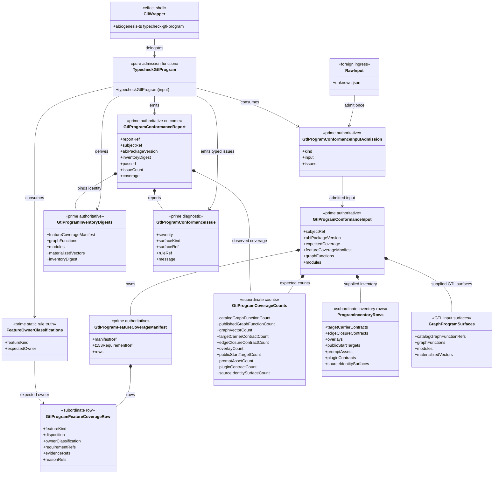

# M03 GTL Program Conformance Gate Structural Carrier Diagram

**Status**: Active
**Date**: 2026-06-09
**Ticket**: T-152
**Derived from**: [M03_GTL_PROGRAM_CONFORMANCE_GATE_FIRST_SLICE_IACS.md](./M03_GTL_PROGRAM_CONFORMANCE_GATE_FIRST_SLICE_IACS.md)

## Purpose

Show the Design Module Method carrier boundary for the ABG-owned GTL program
conformance gate. The diagram distinguishes prime outcome/admission carriers
from subordinate inventory rows and the CLI render shell.

## Structural Carrier Diagram

