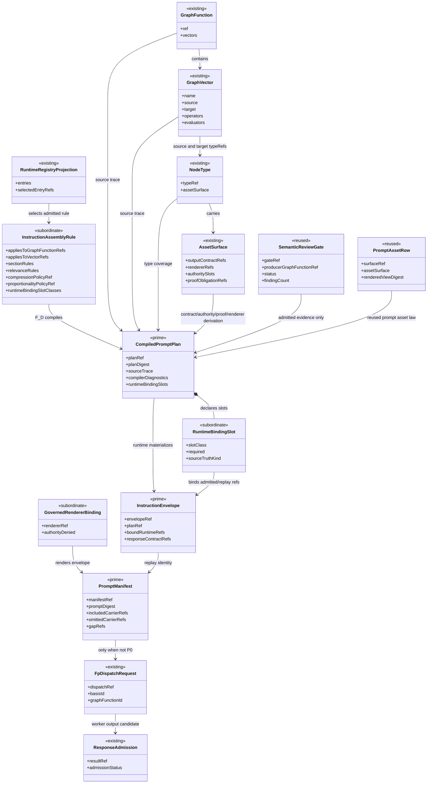

# M03 Instruction Assembly Structural Carrier Diagram

**Ticket**: T-183
**Status**: Active design
**Date**: 2026-07-01
**Derived from**: [M03_INSTRUCTION_ASSEMBLY_DERIVATION.md](./M03_INSTRUCTION_ASSEMBLY_DERIVATION.md), [M03_INSTRUCTION_ASSEMBLY_FIRST_SLICE_IACS.md](./M03_INSTRUCTION_ASSEMBLY_FIRST_SLICE_IACS.md), [M03_RUNTIME_GRAPH_FUNCTION_REGISTRY_STRUCTURAL_CARRIER_DIAGRAM.md](./M03_RUNTIME_GRAPH_FUNCTION_REGISTRY_STRUCTURAL_CARRIER_DIAGRAM.md), [M03_TRANSPORT_PROTOCOL_STRUCTURAL_CARRIER_DIAGRAM.md](./M03_TRANSPORT_PROTOCOL_STRUCTURAL_CARRIER_DIAGRAM.md), [T-183](../../../../.ai-workspace/tickets/active/T-183-design-and-realize-abg-instruction-assembly-semantic-compiler.md)

## Structural Relationships



## Carrier Flow

```text
GTL graph/module/product declarations
  + product/system registry startup config
  + instruction assembly rules
        |
        v
ABG startup admission and registry projection
        |
        v
semantic compiler F_D checks over known algebras
        |
        +--> optional existing semantic review gate evidence
        |
        v
CompiledPromptPlan admitted or rejected
        |
        v
runtime graph call / vector / frame / selected function / replay truth
        |
        v
InstructionEnvelope materialized from declared slots
        |
        v
ABG-owned renderer or authority-denied governed renderer
        |
        v
PromptManifest emitted or projected
        |
        +--> P0: no F_P dispatch
        |
        v
F_P dispatch and response admission
```

## Visibility Split

| Surface | Downstream public? | ABG runtime internal? | Notes |
| --- | --- | --- | --- |
| Instruction assembly declaration | yes, as data declaration/config | consumed by ABG | No runtime authority. |
| Compiler acceptance/rejection | query/proof only | yes | ABG emits/admit projections. |
| Compiled prompt plan | read-only ref/proof surface | yes | Downstream cannot mint. |
| Runtime binding slot | no direct mutation | yes | Slots are compiled from plan and resolved from replay. |
| Instruction envelope | no | yes | Immutable pre-render runtime payload. |
| Renderer binding | data-only declaration when downstream supplied | yes | Delegated renderer must be authority-denied. |
| Prompt manifest | read-only replay surface | yes | Reconstructs digest and carrier decisions. |
| F_P dispatch | no direct downstream call | yes | Transport remains ABG-owned. |

## DMM Reading Notes

- `CompiledPromptPlan`, `InstructionEnvelope`, and `PromptManifest` are the
  only new prime carriers in this slice.
- `InstructionAssemblyRule`, `RuntimeBindingSlot`, `PromptCompilerDiagnostic`,
  and `GovernedRendererBinding` stay subordinate.
- `SemanticReviewGate` and `PromptAssetRow` are reused existing surfaces.
- This diagram is not a runtime registry diagram. Registry lookup and selection
  remain governed by T-177 surfaces.
- This diagram is not a response-admission diagram. Worker response truth
  remains governed by transport and response-contract admission.

