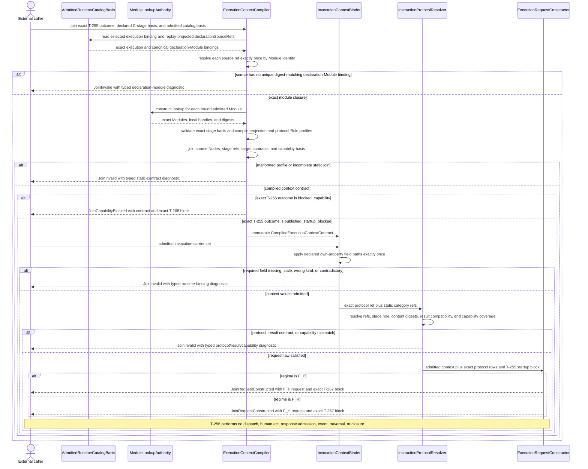
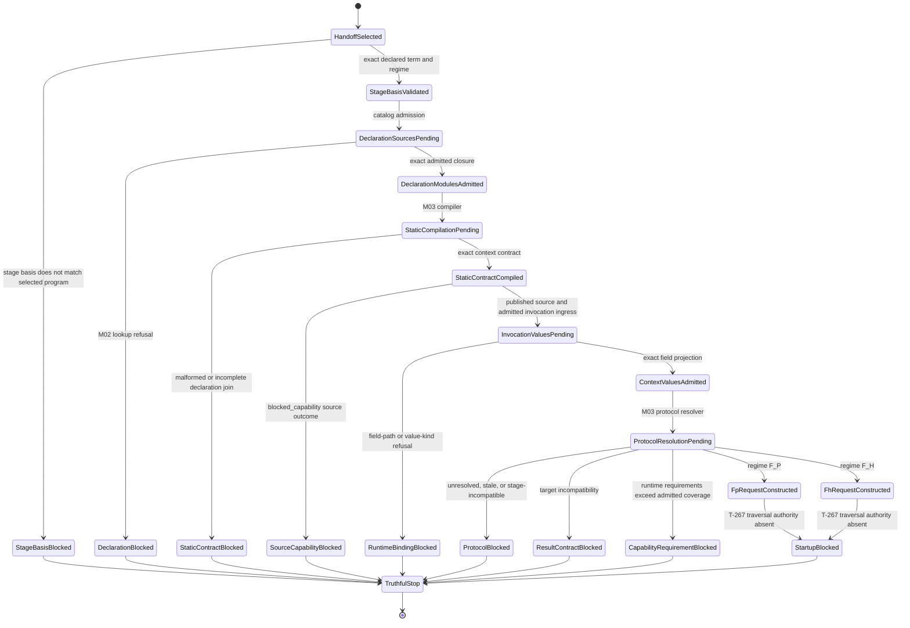

# M03 Declared Execution Context And Instruction Protocol Behavior Design

**Status**: Candidate three-view design; implementation blocked pending independent review and explicit F_H acceptance
**Date**: 2026-07-13
**Ticket**: T-256
**Method authority**: `specification_methodology/specification/standards/DESIGN_MODULE_METHOD.md` section 5E
**Tenant authority**: [TYPESCRIPT_REALIZATION_GUARDRAILS.md](./TYPESCRIPT_REALIZATION_GUARDRAILS.md)

## Boundary

T-256 closes one generic relation:

```text
T-255 exact published or capability-blocked handoff outcome
  + exact declared C-stage invocation basis
  + admitted GTL declaration-module closure
  + admitted invocation carrier values
    -> compiled execution-context contract
    -> declared F_P request | declared F_H interaction request | typed block
```

The design replaces the current code-owned protocol source. It does not add a
prompt service, runtime controller, worker dispatcher, response admission,
event writer, continuation, or closure path.

### Ownership

- M01 GTL owns existing `Rule`, `AssetSurface`, C-stage
  `instructionCategoryRefs`, target-carrier, and composition declarations.
- M02 GTL owns `Module`, strict raw admission, module imports, and exact
  per-Module lookup authority.
- M03 runtime-catalog admission owns the cross-Module
  `AdmittedRuntimeCatalogBasis` and its exact `CatalogExecutionBinding` rows.
- M03 ABG compiles strict profiles over admitted `Rule` values, resolves exact
  carrier fields, joins target/capability truth, and constructs immutable
  request carriers.
- T-255 owns the selected GraphVector/program/composition/target outcome
  consumed here. T-256 may compile static context law from an exact
  `published_startup_blocked` or `blocked_capability` outcome because both
  preserve the same selected program, composition, target, and closure basis.
  Invalid, structural-only, and successor-constructor-blocked outcomes cannot
  enter this boundary.
- A `DeclaredCStageInvocationBasis` names one exact stage index, role, regime,
  term digest, and program-binding digest already selected by the caller or
  future C runtime. T-256 validates it against the T-255 program and selected
  composition. It does not choose the next stage or execution order; T-259
  owns workflow C runtime sequencing.
- T-257 owns raw F_P output admission.
- T-258 owns public F_H hold, act, and resume.
- T-267 owns traversal result-interface and bind-conservation closeability.
- T-268 owns the ABG 5.0 tenant-conformance manifest.

An absent capability projection remains a T-268 block and cannot produce a
request. Every request produced from a published T-255 outcome retains T-255's
T-267 startup block. Constructing a request does not authorize traversal or
effects.

## Carrier Decision

T-256 introduces no new first-class GTL ontology and no second registry.

Two closed profiles reuse existing GTL `Rule` values published by an admitted
companion `Module`:

1. `gtl.execution_context_projection` declares how named admitted source
   carriers supply generic execution-context slots.
2. `gtl.instruction_protocol` declares versioned instruction content and
   resolves one existing GTL Node `AssetSurface` that owns prompt-interface
   truth.

The profiles are GTL declaration data. Their M03 compiled forms are internal
interpreter carriers, not new public language terms. The instruction profile
compiles into inputs for the existing instruction-assembly compiler; it does
not replace that compiler or pre-admit a compiled prompt plan.

The selected runtime catalog declaration binds the declaration-module closure
through its existing `declarationSourceRefs`. M03 resolves each source ref to
exactly one `CatalogDeclarationModuleBinding.moduleRef` in the existing
`AdmittedRuntimeCatalogBasis`, verifies the bound Module digest, and then uses
the existing per-Module lookup authority inside that Module. Query-only lookup,
an arbitrary caller-supplied Module, or filesystem discovery cannot supply
declaration truth.

Current registry admission events, runtime registry projections, and execution
bindings omit `declarationSourceRefs` after admitting the source
`GtlLibraryEntryDeclaration`. T-256 must preserve that existing field on
`RegistryEntryAdmittedRuntimeEvent`, `RuntimeRegistryEntryProjection`, and
`CatalogExecutionBinding`; include it in canonical event, projection, and
binding identity checks; and derive module closure only from replay-projected
truth. Re-reading the raw declaration after startup is not lawful selection
truth.

The current admitted runtime catalog also retains a bound Module only for
callable `graph_function` execution rows. T-256 adds one subordinate
`CatalogDeclarationModuleBinding` for each unique admitted module identity
contributed by a runtime-library row that can lawfully carry declaration truth,
including `node_type`. Multiple rows over the same module ref, name, and digest
coalesce into one binding with ordered contributing entry, declaration, and
source-event refs. The same module ref with conflicting identity fails catalog
admission. The binding grants no invocation authority and is not a second
registry.

The companion instruction Module is admitted through a `node_type` catalog
row. The row must satisfy the existing identity-GraphFunction node-type law.
Its identity GraphFunction remains a type/declaration carrier and cannot become
public work merely because its Node hosts `AssetSurface` truth.

`blocked_capability` intentionally carries the exact T-255 program binding but
not a second normalized program body. T-256 resolves the selected program from
the selected work `CatalogExecutionBinding.module`, then verifies its
GraphFunction, program ref, ordered interface, and digest relation against the
T-255 binding. A caller-supplied program, display-name lookup, or reconstructed
program body is invalid.

This permits the T-252 Consensus `Module` bytes to remain unchanged. Consensus
field maps and protocol declarations are product data in a separately admitted
companion Module. The same generic compiler is proved with a non-Consensus
fixture. The Consensus catalog entry is reissued with the companion module ref
added to its ordered `declarationSourceRefs`; its declaration digest therefore
changes and must be regenerated. That catalog-data change does not change the
T-252 GTL body digest.

## Irreducible Architectural Carrier Set

| Carrier | Owner | Role | Visibility |
|---|---|---|---|
| exact T-255 handoff outcome | T-255 M03 | exact function/vector/program/composition/target basis plus compatible capability truth or a typed capability block | public M03 contract |
| `DeclaredCStageInvocationBasis` | caller or future T-259, validated by T-256 | exact stage index/role/regime/term identity within the selected T-255 program; no ordering authority | admitted module-local input |
| admitted registry event/projection plus `AdmittedRuntimeCatalogBasis`, execution binding, and declaration-module bindings | M03 registry and catalog admission | replay-preserved declaration refs, selected work identity, and cross-Module declaration source/digest authority | admitted ABG runtime truth |
| admitted declaration `Module` closure | M02 GTL under catalog bindings | sole source of projection and protocol Rule profiles | admitted GTL |
| `CompiledExecutionContextContract` | T-256 M03 | exact static join from one handoff to named carrier slots and protocol/result/capability law | module-local prime |
| `AdmittedExecutionContextValues` | T-256 M03 | invocation-local values extracted from admitted carriers under the compiled contract | module-local prime |
| `DeclaredExecutionContextJoinOutcome` | T-256 M03 | one public discriminated outcome: request constructed, exact capability block preserved, or typed invalid | public M03 contract |
| `DeclaredExecutionRequest` | T-256 M03 | immutable `F_P` or `F_H` request variant, still startup-blocked | public M03 contract |
| `ExecutionContextDiagnostic` | T-256 M03 | total typed refusal or unrealized relation | public M03 diagnostic |

Subordinate field rows, instruction-asset Nodes, protocol sections, resolved
refs, and capability rows remain owned by these carriers. They do not become
peer registries or public request types.

## Declaration Profiles

### Canonical Rule encoding

Both profiles use the existing `Rule.config: SerializedAttrs` carrier. Scalar
refs and versions use `scalar`, ref collections use `string_list`, and ordered
row structures use one tagged `json_blob`. M03 decodes tagged JSON only through
the existing M01 `serializedJsonValueToPlain` function. Plain-object shortcuts,
duplicate config keys, unknown keys, wrong value kinds, and alternate spellings
fail profile admission.

The execution-context profile has exactly these config keys:

```text
version
source_node_ref
source_schema_ref
source_type_ref
applies_to_regime
field_rows
policy_refs
```

The instruction-protocol profile has exactly these config keys:

```text
version
instruction_asset_node_ref
allowed_stage_roles
sections
relevance_policy_refs
compression_policy_ref
proportionality_policy_ref
policy_refs
```

### Digest law

Every digest is canonical `sha256:` plus 64 lowercase hexadecimal characters;
case normalization is not admission. Protocol content uses the existing
`sha256DigestForText` over the exact declared UTF-8 text. Structured carrier,
closure, stage, and request digests use `stableSha256Digest` over the fully
admitted canonical basis. A derived ref and its digest fields are excluded from
their own digest basis, then added once. Supplied configuration, carrier,
declaration, Module, protocol, target, capability, and startup-block digests are
verified rather than rewritten.

### Execution-context projection Rule

An admitted Rule is an execution-context projection declaration only when:

```text
Rule.kind = "gtl.execution_context_projection"
Rule.name = projectionRef
```

Its closed config declares:

```text
version
sourceNodeRef
sourceSchemaRef
sourceTypeRef nullable
appliesToRegime = F_P | F_H
fieldRows[]
policyRefs[]
```

Each ordered `fieldRows[]` member declares:

```text
slot = role_or_worker_selection_ref
     | configuration_digest
     | instruction_protocol_ref
     | result_contract_ref
     | capability_requirement_refs
     | interaction_subject_ref
fieldPath
valueKind = ref | digest | ref_list
required
```

Field paths reuse the target-carrier contract's dot-separated own-property
semantics. Empty segments, inherited properties, array indexes, wildcards,
coercion, aliases, and implicit fallback are invalid. A compiled projection
may read only a source Node present in the selected C program's exact ordered
input interface.

`F_P` requires role-or-worker selection, configuration digest, instruction
protocol, result contract, and capability requirements. `F_H` requires an
interaction subject, instruction protocol, result contract, and capability
requirements; role/worker selection is not inferred for an external human.

### Instruction-protocol Rule

An admitted Rule is an instruction-protocol declaration only when:

```text
Rule.kind = "gtl.instruction_protocol"
Rule.name = instructionProtocolRef
```

Its closed config declares:

```text
version
instructionAssetNodeRef
allowedStageRoles[]
sections[]
relevancePolicyRefs[]
compressionPolicyRef
proportionalityPolicyRef
policyRefs[]
```

Each ordered section declares:

```text
sectionRef
sectionKindRef
content
contentDigest
```

M03 recomputes every content digest. `instructionAssetNodeRef` must resolve
exactly once to a Node hosted by a GraphFunction in the same admitted module
closure. That Node's existing `AssetSurface` owns constructor, renderer,
rendered-view digest policy, section/clause kinds, authority slots, prompt-asset
output contracts, and prompt proof obligations. The Rule cannot redeclare
those fields.

The profile declares policy refs; it does not declare compiled include/omit or
compression decisions. The existing instruction-assembly compiler derives
relevance, compression, proportionality, and non-tautology outcomes from those
refs plus admitted runtime truth.

Protocol text is declaration data, not an authority source. It may describe
response grammar, but the worker result contract and target-carrier truth are
derived independently from the T-255 target projection and selected work-target
`AssetSurface`. Prompt-asset output contracts and worker-result contracts are
different relations and cannot substitute for one another.

The invocation-local `instruction_protocol_ref` is mandatory for binding-driven
F_P and F_H work. Any static C-stage `instructionCategoryRefs` are ordered
additional section selections: each ref must resolve exactly once to a
`ProtocolSection.sectionRef` in the same admitted module closure, and the
owning protocol must permit the selected stage role. Repeated selection of the
same section or content digest is invalid. M03 never supplies a code-owned
default category.

## Static Compilation Law

For one exact T-255 handoff outcome, M03 derives a
`CompiledExecutionContextContract` only
when all of the following hold:

1. the outcome is the exact T-254/T-255 selection and is either
   `published_startup_blocked` or `blocked_capability`; it has not been
   reconstructed;
2. the selected work `CatalogExecutionBinding` resolves the exact program from
   its admitted Module and that program agrees with every T-255 binding field;
3. the declared C-stage invocation basis resolves exactly one term in that
   program; its program-binding digest, stage index, role, regime, term digest,
   and ordered `instructionCategoryRefs` agree, and its regime is `F_P` or
   `F_H`;
4. the selected `CatalogExecutionBinding` and its admitted runtime-catalog
   basis preserve the admitted declaration's exact `declarationSourceRefs`
   through registry event and replay projection, and resolve every source ref
   through exactly one digest-matching `CatalogDeclarationModuleBinding`;
5. every applicable projection Rule resolves exactly once;
6. each projection source Node is in the selected program's ordered input interface;
7. required slots are present exactly once and value kinds agree;
8. each protocol Rule resolves exactly one instruction-asset Node whose
   `AssetSurface` is complete for the selected renderer-backed prompt policy;
9. static instruction category refs resolve exactly once to protocol sections,
   permit the selected stage role, and introduce no duplicate section or
   content identity;
10. the result-contract compatibility set is derivable from the target
   `AssetSurface`, target schema, and T-255 target-carrier binding;
11. capability state is preserved exactly: requirements are checked against a
   present T-255 basis-preserving projection, while absence remains the typed
   T-268 capability block; and
12. no Rule, field row, protocol section, or module source is duplicated,
   ambiguous, stale, or digest-mismatched.

Static compilation does not read invocation payloads and does not claim a
request exists. A `blocked_capability` source may yield the same static contract
for census and migration proof, but it returns that contract with the exact
T-268 block and stops before invocation binding. Only a
`published_startup_blocked` source may continue to invocation binding.

## Invocation Binding Law

M03 receives only payloads already admitted against their selected carrier
schemas. Each admitted carrier row binds one exact source Node ref, schema ref,
carrier ref, carrier digest, admission ref, and immutable value. The binder
resolves every projection source Node to exactly one such row; positional,
display-name, and schema-only matching are invalid. It applies the compiled
field rows exactly once, validates each value kind, and constructs
`AdmittedExecutionContextValues`. Every carrier-row Node must belong to the
selected program's ordered input interface. An input row not selected by a
projection may remain as work context, but it cannot supply a named execution
slot implicitly.

The request join then requires:

```text
runtime instruction protocol ref resolves in compiled module closure
runtime result contract ref is target-compatible
runtime capability refs are covered by present T-255 admitted capability truth
runtime configuration digest and source carrier digests are retained
runtime interaction subject is present for F_H
```

The resulting closed variants are:

```text
DeclaredFpExecutionRequest
DeclaredFhInteractionRequest
```

Both preserve handoff, declaration-module, projection, protocol, target,
capability, source-carrier, request, and exact T-255 startup-block truth.
Neither carries a concrete backend selected from actor identity, performs an
effect, emits an event, or claims traversal closeability.

The one public join function returns `DeclaredExecutionContextJoinOutcome` with
exactly one variant:

```text
request_constructed  -> one DeclaredExecutionRequest
blocked_capability   -> one CompiledExecutionContextContract plus the exact
                        T-255 blocked_capability outcome
invalid              -> one or more ExecutionContextDiagnostic rows
```

No variant carries both a request and a capability block, and no invalid
variant carries a partially usable request.

## Typed Diagnostic Algebra

The one public T-256 join entrypoint is total. Module-local constructors and
transforms may reject malformed internal input, but the public boundary maps
those failures into `JoinInvalid` and `ExecutionContextDiagnostic`; it does not
leak an untyped throw.

The closed classifications are:

```text
invalid_program
invalid_runtime_binding
semantic_not_realized
```

The closed diagnostic IDs are:

```text
execution-context-source-outcome-invalid
execution-context-stage-basis-invalid
execution-context-program-binding-mismatch
execution-context-declaration-source-projection-missing
execution-context-declaration-module-unresolved
execution-context-declaration-module-ambiguous
execution-context-declaration-module-digest-mismatch
execution-context-profile-shape-invalid
execution-context-projection-source-invalid
execution-context-carrier-row-invalid
execution-context-field-path-invalid
execution-context-field-value-invalid
execution-context-protocol-ref-invalid
execution-context-protocol-content-digest-mismatch
execution-context-protocol-stage-incompatible
execution-context-instruction-asset-invalid
execution-context-result-contract-incompatible
execution-context-capability-incompatible
```

Each diagnostic carries `path`, expected and actual relation, evidence refs,
and one closed repair affordance:

```text
correct_source_outcome
restore_replay_projection
admit_declaration_module
correct_reference
correct_field_shape
admit_runtime_carrier
repair_digest
correct_protocol
correct_result_contract
correct_capability_requirements
repair_tenant_capability_coverage
```

Missing tenant-conformance truth returns the exact T-255/T-268 capability block
and diagnostic. A constructed request preserves the exact T-255/T-267 traversal
startup block. T-256 does not translate either into a locally authored success,
failure, or substitute block.

## Domain Model

The interpreter-action classes below name semantic owners used by the sequence
view. They are module-local transforms, not public services, registries, or new
GTL language terms.

```mermaid
classDiagram
  direction LR

  class RegistryEntryAdmittedRuntimeEvent {
    <<effect-edge>>
    +entryRef
    +declarationRef
    +declarationSourceRefs
    +declarationDigest
  }
  class RuntimeRegistryEntryProjection {
    <<authoritative>>
    +entryRef
    +declarationRef
    +declarationSourceRefs
    +declarationDigest
  }
  class CatalogAdmission {
    <<authoritative>>
    -admitRuntimeCatalog()
  }
  class AdmittedRuntimeCatalogBasis {
    <<authoritative>>
    +catalogId
    +resolvedLockRef
    +executionBindings
    +declarationModuleBindings
  }
  class CatalogExecutionBinding {
    <<authoritative>>
    +entryRef
    +declarationSourceRefs
    +moduleRef
    +moduleName
    +moduleDigest
  }
  class CatalogDeclarationModuleBinding {
    <<authoritative>>
    +moduleRef
    +moduleName
    +moduleDigest
    +sourceEntryRefs
    +sourceDeclarationRefs
    +sourceEventRefs
    +invocationAuthority false
  }
  class ModuleLookupAuthority {
    <<authoritative>>
    +moduleName
    +graphFunctionHandles
  }
  class Module {
    <<prime>>
    +name
    +rules
    +graphFunctions
  }
  class ExecutionContextProjectionRule {
    <<subordinate>>
    +projectionRef
    +sourceNodeRef
    +sourceSchemaRef
    +regime
  }
  class FieldRow {
    <<subordinate>>
    +slot
    +fieldPath
    +valueKind
    +required
  }
  class InstructionProtocolRule {
    <<subordinate>>
    +instructionProtocolRef
    +version
    +instructionAssetNodeRef
    +allowedStageRoles
    +relevancePolicyRefs
    +compressionPolicyRef
    +proportionalityPolicyRef
  }
  class GraphFunction {
    <<subordinate>>
    +id
    +inputs
    +outputs
  }
  class Node {
    <<subordinate>>
    +id
    +schema
    +assetSurface
  }
  class AssetSurface {
    <<subordinate>>
    +constructorRefs
    +rendererRefs
    +outputContractRefs
    +proofObligationRefs
  }
  class ProtocolSection {
    <<subordinate>>
    +sectionRef
    +contentDigest
  }
  class ExactT255HandoffOutcome {
    <<prime>>
    +status
  }
  class PublishedT255HandoffOutcome {
    <<prime>>
    +status published_startup_blocked
    +handoff
  }
  class CapabilityBlockedT255HandoffOutcome {
    <<prime>>
    +status blocked_capability
    +programBinding
    +compositionSelection
    +targetCarrierBinding
    +admittedManifestRef nullable
    +diagnostics
  }
  class CompiledGraphVectorExecutionHandoff {
    <<prime>>
    +handoffRef
    +programBinding
    +normalizedProgram
    +compositionSelection
    +targetCarrierBinding
    +capabilityCompatibility
    +startupBlock
  }
  class TraversalStartupBlock {
    <<subordinate>>
    +status startup_blocked_awaiting_t267
    +effectsPermitted false
    +blockDigest
  }
  class DeclaredCStageInvocationBasis {
    <<prime>>
    -programBindingDigest
    -stageIndex
    -stageRole
    -regime F_P or F_H
    -termDigest
    -instructionCategoryRefs
  }
  class ExecutionContextCompiler {
    <<authoritative>>
    -compileStaticContract()
  }
  class InvocationContextBinder {
    <<authoritative>>
    -bindAdmittedValues()
  }
  class InstructionProtocolResolver {
    <<authoritative>>
    -resolveProtocolAndTarget()
  }
  class ExecutionRequestConstructor {
    <<authoritative>>
    -constructBlockedRequest()
  }
  class CompiledExecutionContextContract {
    <<prime>>
    -contractRef
    -sourceOutcomeStatus
    -sourceBasisDigest
    -publishedHandoffRef nullable
    -selectedStageDigest
    -selectedStageRole
    -selectedRegime
    -declarationClosureDigest
    -fieldRows
    -staticProtocolRefs
    -targetCompatibilityRefs
    -contractDigest
  }
  class AdmittedInvocationCarrierSet {
    <<prime>>
    -carriers
  }
  class AdmittedInvocationCarrier {
    <<subordinate>>
    -sourceNodeRef
    -schemaRef
    -carrierRef
    -carrierDigest
    -admissionRef
    -value
  }
  class AdmittedExecutionContextValues {
    <<prime>>
    -selectionContractRef
    -configurationDigest
    -instructionProtocolRef
    -resultContractRef
    -capabilityRequirementRefs
    -interactionSubjectRef
  }
  class DeclaredExecutionRequest {
    <<prime>>
    +requestRef
    +requestDigest
    +handoffRef
    +stageRole
    +stageTermDigest
    +contextContractRef
    +contextContractDigest
    +declarationClosureDigest
    +protocolRefs
    +protocolClosureDigest
    +resultContractRef
    +targetBindingDigest
    +capabilityRefs
    +capabilityBasisDigest
    +sourceCarrierRefs
    +sourceCarrierDigests
    +startupBlockDigest
  }
  class DeclaredExecutionContextJoinOutcome {
    <<downstream>>
    +status
  }
  class JoinRequestConstructed {
    <<downstream>>
    +status request_constructed
    +request
  }
  class JoinCapabilityBlocked {
    <<downstream>>
    +status blocked_capability
    +compiledContractRef
    +compiledContractDigest
    +sourceCapabilityOutcome
  }
  class JoinInvalid {
    <<downstream>>
    +status invalid
    +diagnostics
  }
  class DeclaredFpExecutionRequest {
    <<downstream>>
    +regime F_P
    +selectionContractRef
    +configurationDigest
  }
  class DeclaredFhInteractionRequest {
    <<downstream>>
    +regime F_H
    +interactionSubjectRef
  }
  class ExecutionContextDiagnostic {
    <<downstream>>
    +classification
    +diagnosticId
    +path
    +expectedRelation
    +actualRelation
    +evidenceRefs
    +repairAffordance
  }
  class T257ResponseAdmission {
    <<deferred>>
  }
  class T258FhHoldActResume {
    <<deferred>>
  }
  class T267TraversalClosure {
    <<deferred>>
  }

  RegistryEntryAdmittedRuntimeEvent "1..*" --> "1" RuntimeRegistryEntryProjection : replay projects
  CatalogAdmission "1" --> "1" AdmittedRuntimeCatalogBasis : constructs
  AdmittedRuntimeCatalogBasis "1" *-- "0..*" CatalogExecutionBinding : admits callable rows
  AdmittedRuntimeCatalogBasis "1" *-- "0..*" CatalogDeclarationModuleBinding : admits declaration Modules
  RuntimeRegistryEntryProjection "1..*" --> "0..*" CatalogDeclarationModuleBinding : source refs resolve
  CatalogExecutionBinding "1" --> "1" Module : binds callable work Module
  CatalogDeclarationModuleBinding "1" --> "1" Module : binds exact digest
  Module "1" --> "1" ModuleLookupAuthority : constructs local lookup
  Module "1" *-- "0..*" ExecutionContextProjectionRule : publishes profile
  ExecutionContextProjectionRule "1" *-- "1..*" FieldRow : owns ordered rows
  Module "1" *-- "0..*" InstructionProtocolRule : publishes profile
  InstructionProtocolRule "1" *-- "1..*" ProtocolSection : owns ordered sections
  Module "1" *-- "1..*" GraphFunction : publishes declaration carrier
  GraphFunction "1" *-- "1..*" Node : hosts typed interface
  Node "1" *-- "1" AssetSurface : owns interface truth
  InstructionProtocolRule "1" --> "1" Node : resolves exact prompt interface
  ExactT255HandoffOutcome <|-- PublishedT255HandoffOutcome
  ExactT255HandoffOutcome <|-- CapabilityBlockedT255HandoffOutcome
  ExactT255HandoffOutcome "1" --> "1" CatalogExecutionBinding : verified against selected work
  PublishedT255HandoffOutcome "1" *-- "1" CompiledGraphVectorExecutionHandoff : carries
  CompiledGraphVectorExecutionHandoff "1" *-- "1" TraversalStartupBlock : preserves
  ExecutionContextCompiler "1" --> "1" CompiledExecutionContextContract : constructs
  ExactT255HandoffOutcome "1" --> "0..1" CompiledExecutionContextContract : exact static basis
  DeclaredCStageInvocationBasis "1" --> "0..1" CompiledExecutionContextContract : validated stage basis
  AdmittedRuntimeCatalogBasis "1" --> "1" ExecutionContextCompiler : supplies replay basis
  ModuleLookupAuthority "1..*" --> "1" ExecutionContextCompiler : supplies exact local handles
  Module "1..*" --> "0..1" CompiledExecutionContextContract : supplies declaration truth
  InvocationContextBinder "1" --> "0..1" AdmittedExecutionContextValues : constructs
  AdmittedInvocationCarrierSet "1" *-- "1..*" AdmittedInvocationCarrier : owns ordered rows
  AdmittedInvocationCarrierSet "1" --> "0..1" AdmittedExecutionContextValues : projected under contract
  CompiledExecutionContextContract "1" --> "0..1" AdmittedExecutionContextValues : governs extraction
  InstructionProtocolResolver "1" --> "0..1" DeclaredExecutionRequest : admits request basis
  ExecutionRequestConstructor "1" --> "0..1" DeclaredExecutionRequest : constructs
  AdmittedExecutionContextValues "1" --> "0..1" DeclaredExecutionRequest : binds
  CompiledExecutionContextContract "1" --> "0..1" DeclaredExecutionRequest : preserves static truth
  TraversalStartupBlock "1" --> "0..*" DeclaredExecutionRequest : preserved exactly
  DeclaredExecutionContextJoinOutcome <|-- JoinRequestConstructed
  DeclaredExecutionContextJoinOutcome <|-- JoinCapabilityBlocked
  DeclaredExecutionContextJoinOutcome <|-- JoinInvalid
  JoinRequestConstructed "1" *-- "1" DeclaredExecutionRequest : returns
  JoinCapabilityBlocked "1" --> "1" CompiledExecutionContextContract : proves static join
  JoinCapabilityBlocked "1" --> "1" CapabilityBlockedT255HandoffOutcome : preserves exact block
  JoinInvalid "1" *-- "1..*" ExecutionContextDiagnostic : returns typed refusal
  ExecutionRequestConstructor "1" --> "0..1" JoinRequestConstructed : returns public variant
  ExecutionContextCompiler "1" --> "0..1" JoinCapabilityBlocked : returns exact capability block
  ExecutionContextCompiler "1" --> "0..*" JoinInvalid : may refuse
  InvocationContextBinder "1" --> "0..*" JoinInvalid : may refuse
  InstructionProtocolResolver "1" --> "0..*" JoinInvalid : may refuse
  DeclaredExecutionRequest <|-- DeclaredFpExecutionRequest
  DeclaredExecutionRequest <|-- DeclaredFhInteractionRequest
  DeclaredFpExecutionRequest "1" --> "0..1" T257ResponseAdmission : later binds raw response
  DeclaredFhInteractionRequest "1" --> "0..1" T258FhHoldActResume : later interaction basis
  DeclaredExecutionRequest "1" --> "1" T267TraversalClosure : remains blocked
  CompiledExecutionContextContract "1" --> "0..*" ExecutionContextDiagnostic : total refusal
  AdmittedExecutionContextValues "1" --> "0..*" ExecutionContextDiagnostic : total refusal
```



## Execution Sequence



## Lifecycle State Machine



No T-256 state is `dispatched`, `executed`, `admitted_result`, `resumed`, or
`closed`.

`DeclarationBlocked`, `StageBasisBlocked`, `StaticContractBlocked`,
`RuntimeBindingBlocked`, `ProtocolBlocked`, `ResultContractBlocked`, and
`CapabilityRequirementBlocked` return `JoinInvalid`.
`SourceCapabilityBlocked` returns `JoinCapabilityBlocked`.
`StartupBlocked` returns `JoinRequestConstructed` whose request preserves the
exact T-267 block.

## Cross-View Invariants

| Check | Evidence | Verdict |
|---|---|---|
| Every sequence participant exists in the domain model or is external | admitted catalog, lookup authority, compiler, binder, protocol resolver, request constructor, and external caller are modeled | `pass` |
| Every lifecycle carrier exists in the domain model | declaration modules, compiled contract, invocation carriers, context values, requests, and diagnostics are modeled | `pass` |
| Every message is a declared admission or total transform | lookup, compilation, field projection, protocol resolution, and request construction are explicit | `pass` |
| GTL remains the protocol source | content and field maps are strict Rule profiles; prompt-interface truth remains on an existing Node AssetSurface | `pass` |
| Registry selection remains replay-derived | admitted registry events carry declaration source refs into the runtime projection and canonical module bindings | `pass` |
| No second registry appears | admitted declarationSourceRefs survive into the runtime-catalog basis, then resolve through deduplicated non-invoking declaration-Module bindings and per-Module lookup | `pass` |
| Product field names do not enter M03 code | product-specific mappings are declaration rows; the compiler sees generic slots | `pass` |
| Target and capability truth are not reconstructed | exact T-255 outcome projections are consumed directly; capability absence stays blocked | `pass` |
| Raw F_P output cannot become accepted | output does not enter this boundary; T-257 remains explicit | `pass` |
| F_H remains an external act | T-256 constructs only an interaction request; T-258 owns hold/act/resume | `pass` |
| Runtime effects remain blocked | every request retains T-255's T-267 startup fence | `pass` |
| Stage choice is not hidden orchestration | the caller supplies an exact declared stage basis; T-256 validates but does not choose order or advance the C program | `pass` |

## Axiom Evaluation

| Axiom | Authority | Domain evidence | Sequence evidence | State evidence | Native enforcement | Admission/compiler enforcement | Verdict | Gap owner |
|---|---|---|---|---|---|---|---|---|
| Product-visible prompt construction is GTL-expressible | CONTRACT-LAW-API-008 | protocol Rules own content and resolve typed Node AssetSurfaces | module lookup precedes protocol compilation | no code-synthesis state exists | typed profile constructors may narrow local authoring | M03 rejects unknown fields, stale digests, incomplete AssetSurfaces, and dangling refs | `pass` | T-256 realization |
| Rule profiles remain passive immutable declarations | RULE-001..006; ATTRS-001..006 | profiles are Rule/SerializedAttrs data subordinate to Module | ABG compiles and enforces; Rule performs no action | no Rule-executing state exists | ordered typed config and duplicate-key refusal | strict profile admission owns global shape and refs | `pass` | T-256 realization |
| Module remains the singular GTL publication boundary | MODULE-001..006 | companion truth is published as Module rules plus an identity GraphFunction/Node AssetSurface | catalog-bound Module lookup precedes compilation | missing Module closure blocks | existing Module and lookup types | registry/catalog admission preserves exact Module identity | `pass` | T-256 realization |
| No prompt or contract law is hidden in code | CONTRACT-LAW-API-010/-012 | static and dynamic protocol refs are explicit | code-owned fallback is absent | missing declaration blocks | no default protocol in request constructor | exact module/ref resolution required | `pass` | T-256 realization |
| Instruction assembly adds no second GTL surface | INSTRUCTION-ASSEMBLY-001/-002 | profiles reuse Rule, Node AssetSurface, and Module | admitted runtime catalog then per-Module lookup is singular | no parallel lookup state | no new public GTL term | runtime-catalog preserves source refs and non-invoking Module bindings; M02 and M03 admission remain distinct | `pass` | T-256 realization |
| Registry selection is replay-derived | INSTRUCTION-ASSEMBLY-012/-013 | registry event, projection, and execution binding preserve admitted declarationSourceRefs; catalog admission canonically binds source Modules | compiler consumes the admitted catalog basis, not raw startup input | missing projected source truth blocks | projection fields are immutable | event, projection, and binding identities include ordered source refs and exact Module identity; exact duplicates coalesce | `pass` | T-256 realization |
| Declaration Modules grant no work invocation | ASSET-SURFACE-001; PRODUCT GraphFunction boundary | companion row is `node_type`; identity GraphFunction and declaration binding have no invocation authority | compiler reads declarations but invokes no GraphFunction | no invocation state exists | carrier omits callable handle | catalog enforces node-type identity and keeps declaration and execution bindings distinct | `pass` | T-256 realization |
| Carrier, target, proof, authority, and renderer truth are derived | INSTRUCTION-ASSEMBLY-003; ASSET-SURFACE-002..011 | T-255 work target and protocol asset Node remain prime | compiler joins rather than accepts asserted refs | incompatibility blocks | request type cannot author interface truth | exact prompt-asset and target/result derivation checks | `pass` | T-256 realization |
| F_D decisions are total over a known algebra | INSTRUCTION-ASSEMBLY-004/-004A | closed profiles, slots, paths, and outcomes | every branch returns contract, request, or diagnostic | all refusal states terminate truthfully | discriminated carriers | total compiler and binder issue families | `pass` | T-256 realization |
| Stage identity derives from the declared C program | C-ALGEBRA-009/-011/-013/-016; CCALL-014/-016 | stage basis carries exact program, index, role, regime, term, and category identity | compiler validates the stage without choosing execution order | invalid basis reaches StageBasisBlocked | closed F_P/F_H regime and stage fields | exact program/composition comparison | `pass` | T-256 realization; T-259 owns sequencing |
| F_P dispatch requires plan, envelope, and manifest | INSTRUCTION-ASSEMBLY-005/-017 | request is not plan/envelope/manifest | absent capability stops before request and every request stops before dispatch | SourceCapabilityBlocked, CapabilityRequirementBlocked, or StartupBlocked is terminal here | no effect method on request | T-268 or T-267 remains required | `pass` | T-267/T-268 |
| Runtime refs fail closed | INSTRUCTION-ASSEMBLY-008 | admitted carrier rows bind exact Node, schema, carrier, admission, and digest identity | binder precedes request | malformed value reaches RuntimeBindingBlocked | closed value kinds | unique source-Node binding plus schema admission and exact field projection | `pass` | T-256 realization |
| Relevance, compression, and proportionality dispatch decisions | INSTRUCTION-ASSEMBLY-006/-007 | T-256 preserves policy refs but creates no compiled prompt plan | no render or dispatch action exists | StartupBlocked is terminal | no dispatch carrier exists | existing instruction compiler and later dispatch gate retain ownership | `not_applicable` | Existing instruction compiler |
| Rendering and prompt-manifest replay | INSTRUCTION-ASSEMBLY-009/-010 | protocol content differs from rendered manifest | no rendering participant in T-256 | no rendered state | request has protocol refs, not renderer authority | existing renderer consumes later admitted truth | `not_applicable` | Existing instruction renderer |
| Prompt non-tautology and optional F_P plan review | INSTRUCTION-ASSEMBLY-011/-015 | no prompt plan or envelope is produced | no validation traversal exists | no validated-plan state exists | protocol carriers have no dispatch authority | existing compiler retains non-tautology and review-evidence admission | `not_applicable` | Existing instruction compiler |
| Dependency sufficiency before target dispatch | INSTRUCTION-ASSEMBLY-016 | request construction is not target dispatch | no dispatch action exists | StartupBlocked is terminal | request has no dispatch method | existing dependency compiler remains the downstream gate | `not_applicable` | Existing instruction compiler |
| Worker response is admitted before truth | INSTRUCTION-ASSEMBLY-014 | T-257 is deferred and distinct | no response message exists | no result state exists | no response field on request outcome | T-257 owns admission | `not_applicable` | T-257 |
| F_H act and resume | COMPUTE-NOTATION-017 | F_H request is distinct from human act | request returns to caller without act | no act/resume state here | variant lacks authority methods | T-258 admission required | `not_applicable` | T-258 |
| Consensus remains a free construction | PRODUCT atom criterion; CONSENSUS-009/-010 | companion Module is product data over generic profiles | generic compiler has no Consensus participant | generic states only | no feature-specific M03 type | non-Consensus fixture required | `pass` | T-256 realization |
| Actor identity cannot select worker/backend | CONSENSUS-005/-011 | selection contract and actor/subject are separate slots | request preserves but does not resolve backend | no worker-selected state | F_P and F_H variants differ | contradictory slot use rejects | `pass` | T-256 realization |

`pass` evaluates the candidate design shape only; it is not implementation
evidence. `not_applicable` marks law whose operative transform is outside the
T-256 boundary and names its retained owner.

## Required Proof Matrix

| Proof | Required observation |
|---|---|
| native/raw profile equivalence | strict Rule-profile constructors and raw Module admission converge on identical declaration digests |
| closed profile shape | unknown fields, duplicate slots, duplicate refs, empty paths, invalid value kinds, and wrong regimes refuse |
| total typed refusal | every malformed public compiler/binder input returns only a closed diagnostic, exact T-268 capability block, or exact T-267 startup block; no untyped exception crosses the public boundary |
| digest law | uppercase, malformed, stale, self-referential, or recomputed-over-a-different-basis digests refuse; exact text and structured canonical bases reproduce identity |
| module authority | source-ref projection loss plus absent, unadmitted, ambiguous, stale, or digest-mismatched declaration-Module bindings block; exact repeated module rows coalesce and conflicting module identity refuses |
| registry replay law | admitted registry events, replay projections, and execution bindings preserve the same ordered declarationSourceRefs and digest identity |
| node-type declaration law | the companion row resolves an admitted identity GraphFunction and grants no callable execution binding |
| carrier-row identity | source Node refs resolve exactly once to admitted carrier rows; positional, label-only, schema-only, duplicate, and missing matches refuse |
| field-path law | own-property nested paths resolve; inherited properties, wildcards, arrays, aliases, and coercion refuse |
| ordered interface law | a projection cannot read a Node outside the selected C program input interface |
| selected-stage law | wrong program binding, index, role, regime, term digest, or instruction-category order refuses; T-256 does not choose the next stage |
| blocked-outcome program law | capability-blocked input resolves the program only from the exact catalog-bound Module and rejects any T-255 binding disagreement |
| protocol law | missing refs, duplicate refs, role mismatch, mutated text, content-digest mismatch, dangling asset Node, and incomplete prompt AssetSurface refuse |
| target law | runtime result-contract ref must match the T-255 target/AssetSurface compatibility set |
| capability law | runtime capability requirements must be covered by the T-255 admitted manifest basis; absent basis remains a T-268 block and produces no request |
| request identity | changing stage identity, any field value, source digest, protocol content, target contract, capability basis, or startup block changes request digest |
| startup-block identity | every constructed request preserves the exact T-255 TraversalStartupBlock and its digest; capability-blocked input constructs no request |
| no fallback | deleting the declaration or carrier field blocks; M03 does not call `defaultInstructionSectionText` or read `FpTransportConfig.prompt` |
| genericity | one non-Consensus single-stage fixture and one multi-source fixture compile without feature branches |
| T-252 preservation | canonical body digest remains `sha256:e4555c21cdb4292b64f7f4d5a625c2a520195aa8d6e9c759498eed4bf28d0ea0`; the catalog declaration digest changes when its ordered companion source ref is admitted; companion declarations close only the two T-256 census families while the same 28 paths remain T-268 capability blocks |
| no effects | source closure reaches no runner, plugin, worker, transport, event, archive, continuation, or closure module |
| packed publication | public exports and packed install preserve the same request and diagnostic surfaces without private imports |

## Migration And Break Order

1. Preserve admitted `declarationSourceRefs` through registry admission events,
   runtime projections, and execution-binding identity checks; add a
   non-invoking declaration-Module binding to the same admitted runtime catalog
   basis.
2. Add strict profile constructors/admitters over existing Rule, Node
   `AssetSurface`, and Module carriers.
   Do not add a new top-level GTL term.
3. Add the module-closure compiler and static context contract using existing
   catalog `declarationSourceRefs`, `AdmittedRuntimeCatalogBasis`, exact
   execution bindings, and per-Module lookup authority.
4. Add invocation carrier projection and the closed F_P/F_H request variants.
5. Bind exact T-255 target and capability projections; preserve T-268 when
   capability truth is absent and retain T-267 startup blocking when it is
   present.
6. Publish a non-Consensus declaration Module and fixtures.
7. Publish the Consensus companion declaration Module as product data without
   changing T-252 body bytes or adding Consensus logic to M03.
8. Rebind the 5.0-reachable instruction startup path to the compiled contract.
9. Remove or make unreachable code-owned protocol synthesis and
   `FpTransportConfig.prompt` on the supported path.
10. Recompute the T-252 census, regenerate packed/public inventories, run all
   focused and full gates, and perform an authority-first self-review.

Inside-out migration is mandatory. A mixed path where compiled declarations
exist but code-owned text can still dispatch is non-closure.

## Gap And Exclusion Register

| Gap or exclusion | Disposition |
|---|---|
| Raw F_P response admission | T-257; not implemented here |
| F_H hold, actor-attributed act, and resume | T-258; not implemented here |
| Traversal result interface and bind conservation | T-267; every T-256 request remains startup-blocked |
| ABG 5.0 tenant manifest publication | T-268; T-256 consumes only T-255 admitted capability truth |
| Renderer, PromptManifest, and replay | existing lawful latter half retained; no redesign here |
| Dependency/proof-depth instruction truth | existing instruction compiler law retained; T-256 does not fabricate it |
| Hostile local tamper defense | excluded by trusted-desktop scope |
| Multi-user registry, hosted prompt marketplace, or dynamic remote protocol discovery | outside 5.0 product scope |

## Non-Closure

- a new instruction registry, product-local prompt loader, filesystem scan, or
  caller-supplied declaration Module;
- instruction or response protocol inferred from stage role, vector name,
  tags, schema spelling, actor identity, worker identity, or code defaults;
- product field names or Consensus branches in M03;
- target, proof, authority, renderer, result-contract, or capability truth
  copied into a second request authority;
- raw invocation payload inspected after admission by more than one semantic
  path;
- `defaultInstructionSectionText` or `FpTransportConfig.prompt` remaining
  reachable on a 5.0-supported path;
- request construction treated as dispatch, F_H admission, event truth,
  traversal closeability, or closure;
- T-252 body bytes changed merely to host companion declaration data; or
- implementation beginning before independent review and explicit F_H
  acceptance.

## Design Verdict

**Candidate; implementation blocked.** The three views and axiom evaluation
define a complete bounded repair. The design reuses existing GTL carriers,
keeps one module/catalog authority path, separates product field mappings from
engine logic, and preserves all downstream gates.

Independent review must challenge the Rule-profile decision, companion Module
authority, field-path law, target/result compatibility, capability join, and
the unchanged T-252 body claim. Only explicit F_H acceptance may change this
verdict to `accepted` and admit implementation.
