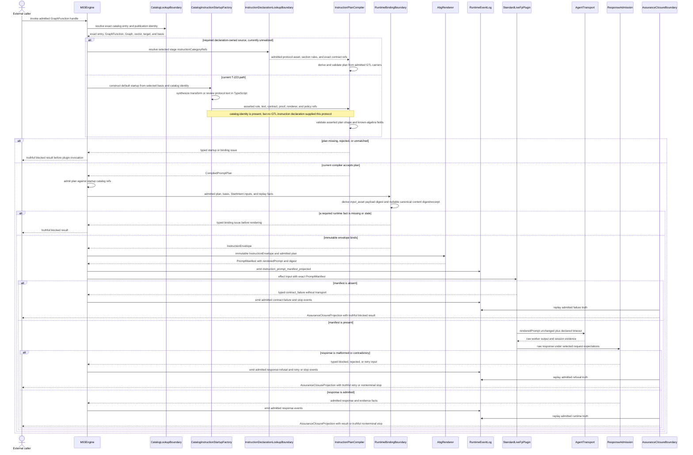
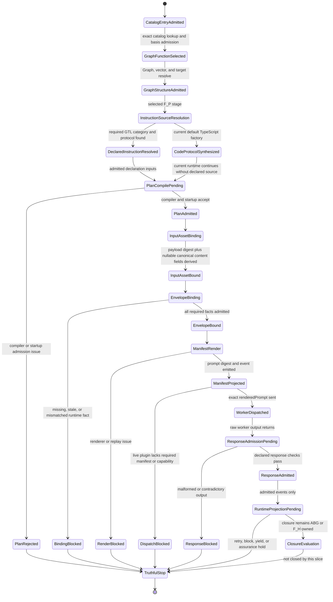

# M03 Instruction Protocol Behavior Design

**Status**: Retrospective three-view design blocked
**Date**: 2026-07-12
**Checkpoints**: `b445eb1` and `28da030` (`T-223` instruction startup,
input binding, and standard transform/review protocol slice)
**Method authority**: `specification_methodology/specification/standards/DESIGN_MODULE_METHOD.md` section 5E
**Tenant authority**: [TYPESCRIPT_REALIZATION_GUARDRAILS.md](./TYPESCRIPT_REALIZATION_GUARDRAILS.md)

## Boundary

- **Design verdict**: `blocked`; the realized runtime path is operational, but
  its instruction-protocol source violates the GTL/ABG ownership boundary and
  cannot be accepted retrospectively
- **Owning modules**: M01/M02 GTL for declared instruction categories and prompt
  construction surfaces; M03 ABG for plan compilation, runtime binding,
  rendering, manifest projection, dispatch admission, and replay
- **Requirements**: `PRODUCT.md` LLM-first and GTL/ABG boundary law;
  `REQ-L-GTL3-CONTRACT-LAW-API-008`, `-010`, and `-012`;
  `REQ-L-GTL3-LANGUAGE-CAPABILITY-MODEL` asset-and-prompt surface;
  `REQ-R-ABG3-HANDLERS-005`, `-011`, `-015`, and `-016`;
  `REQ-R-ABG3-INSTRUCTION-ASSEMBLY-001` through `-017`
- **Ticket or intake**: completed `T-223`, specifically its public SDK/CLI and
  packed-installed vertical checkpoints
- **Code scope at the checkpoints**:
  `contracts/default_instruction_startup.ts`,
  `contracts/instruction_assembly.ts`, the instruction binding and manifest
  path in `runner/engine_runner.ts`, `runner/standard_live_plugins.ts`, the
  legacy extra-stage path in `runner/standard_handlers.ts`, and T-223's packed
  fixture and instruction assertions
- **Dependencies**: exact admitted catalog selection; selected
  `ExecutionBasis`; selected `GraphFunction` and `GraphVector`; target
  `AssetSurface`; instruction-assembly compiler; runtime binding facts; ABG
  renderer; prompt-manifest event; governed F_P transport; response admission
- **Explicit exclusions**: redesign or code repair; worker response-admission
  internals covered by `M03_FP_OUTPUT_ADMISSION_BEHAVIOR_DESIGN.md`; final
  assurance/closure behavior; downstream product-specific wording; hostile
  desktop or in-process tamper hardening

Implementation remains prohibited while this verdict is `blocked`. The
accepted T-223 live evidence proves that the packed path ran and emitted
replayable manifests. It does not prove that the prompt's constructive source
was lawfully declared.

## Retrospective Finding

The completed path has a lawful latter half and an unlawful first half.

1. Catalog selection binds the exact admitted GraphFunction and execution
   basis. This is the correct GTL-to-ABG entry boundary.
2. `defaultCatalogInstructionAssemblyStartup()` passes selected catalog
   identity and policy refs into
   `constructDefaultInstructionAssemblyStartupForBasis()`.
3. The selected catalog entry and the Hello World GTL module carry no
   instruction-category declaration or declared transform/review protocol.
4. `defaultInstructionSectionText()` imperatively constructs both response
   protocols in M03 TypeScript. `compiledInstructionPlanFor()` also synthesizes
   response-contract, proof, authority, renderer, dependency, and proof-depth
   refs instead of deriving each one from the admitted GTL carriers named by
   the selected graph program.
5. The generated text is inserted directly into an
   `InstructionSectionDecision`, then accepted as a compiled plan because its
   catalog entry ref exists. Catalog identity admits the plan's association;
   it does not make code-owned prompt content into GTL declaration truth.
6. After that point the path is correctly governed: M03 admits the plan at
   startup, binds immutable runtime facts, renders one prompt manifest, emits
   replay truth, and the standard live plugins pass the manifest's exact
   `renderedPrompt` to transport without a second prompt shell.
7. `FpTransportConfig.prompt` is a separate known placement violation in the
   generic extra-stage handler. T-223's live GraphFunction path does not use
   that handler, but its existence prevents a global claim that all standard
   F_P prompts are declaration-owned.

The source defect is not cosmetic. The missing declaration prevents the GTL
program, the semantic compiler, and catalog inspection from answering which
instruction category and response protocol govern the selected stage. It also
lets tests pin TypeScript strings instead of qualifying a declared protocol.

## Carrier And Ownership Matrix

| Carrier or concept | Lawful owner | Current source | Authority role | Retrospective result |
|---|---|---|---|---|
| `GtlLibraryEntryDeclaration` | M02 GTL | admitted catalog product | selected publication identity | lawful |
| selected `GraphFunction` / `GraphVector` | M01 GTL | admitted Module | constructive workflow and transition identity | lawful |
| target `AssetSurface` output/proof refs | M01 GTL | admitted target node | response and proof source truth | present but not used as the default plan's exact derived refs |
| instruction-category declaration | M01/M02 GTL | absent from T-223 fixture and selected entry | prompt construction and stage protocol source | blocking gap |
| transform/review response protocol | GTL declaration data | `defaultInstructionSectionText()` | worker instruction and response grammar | unlawfully code-owned |
| `InstructionAssemblyRule` | ABG startup over GTL refs | constructed in M03 | narrow section/relevance/policy binding | shape is lawful; source refs are incomplete |
| `CompiledPromptPlan` | M03 semantic compiler | compiled from M03-assembled inputs | admitted dispatch plan | runtime-typed, but its asserted declaration basis is incomplete |
| `InstructionEnvelope` | M03 ABG | runtime binding over admitted/replay facts | immutable invocation-local instruction input | lawful |
| `PromptManifest` | M03 ABG | governed renderer | replayable rendered prompt identity | lawful |
| `StandardLiveFpPlugin` | M03 effect seam | standard plugin catalog | transports exactly one manifest prompt | lawful interior |
| `FpTransportConfig.prompt` | should be GTL declaration data | generic handler config | extra-stage worker instruction | separate active placement gap |
| raw worker output | external F_P worker | transport | untrusted effect output | subordinate until response admission |
| runtime event stream | M03 ABG | `emit()` after manifest/response admission | authoritative replay truth | lawful |

## Domain Model

The domain model shows both the current code-owned protocol route and the
required declaration-owned route. A dashed dependency from the selected stage
to `InstructionCategoryDeclaration` is required GTL law; it is not realized by
the T-223 fixture.

```mermaid
classDiagram
  direction LR

  class CatalogEntry {
    <<prime admitted GTL>>
    +entryRef
    +declarationRef
    +graphFunctionRef
    +policyRefs
  }
  class GraphFunction {
    <<prime GTL constructive carrier>>
    +graphFunctionRef
    +declarations
  }
  class Graph {
    <<GTL constructive body>>
    +graphRef
  }
  class SourceNode {
    <<GTL node>>
    +nodeRef
  }
  class TargetNode {
    <<GTL node>>
    +nodeRef
  }
  class GraphVector {
    <<subordinate GTL transition>>
    +vectorRef
    +sourceRefs
    +targetRef
  }
  class TargetAssetSurface {
    <<subordinate GTL contract truth>>
    +outputContractRefs
    +proofObligationRefs
    +rendererRefs
  }
  class InstructionCategoryDeclaration {
    <<required unrealized GTL>>
    +categoryRef
    +stageRole
    +sectionRefs
    +protocolRef
  }
  class InstructionDeclarationLookupBoundary {
    <<GTL/M03 admission boundary>>
    +resolve selected category and protocol assets
  }
  class DeclaredProtocolAsset {
    <<required unrealized GTL data>>
    +protocolRef
    +responseContractRef
    +contentDigest
  }
  class M03Engine {
    <<ABG interpreter>>
    +select plan
    +bind envelope
    +emit events
  }
  class CatalogLookupBoundary {
    <<M03 admission boundary>>
    +resolve exact catalog entry
  }
  class CatalogInstructionStartupFactory {
    <<M03 runtime constructor>>
    +construct plans for basis
  }
  class CodeOwnedProtocolText {
    <<current unlawful source>>
    +transform response protocol
    +review response protocol
  }
  class InstructionPlanCompiler {
    <<M03 F_D compiler>>
    +derive and validate plan
    +typed issues
  }
  class InstructionAssemblyRule {
    <<subordinate ABG rule>>
    +sectionRules
    +relevanceRules
    +policyRefs
  }
  class CompiledPromptPlan {
    <<prime admitted startup projection>>
    +planRef
    +planDigest
    +sectionDecisions
    +outputContractRefs
  }
  class RuntimeBindingFact {
    <<prime admitted or replay fact>>
    +slotClass
    +ref
    +digest
  }
  class InvocationInputBinding {
    <<admitted StartIntent input>>
    +assetRef
    +assetType
    +dataUri
  }
  class InputAssetRuntimeBinding {
    <<subordinate admitted fact>>
    +payloadDigest
    +contentRef
    +contentDigest nullable
    +contentExcerpt nullable
  }
  class RuntimeBindingBoundary {
    <<M03 admission boundary>>
    +derive input_asset fact
    +bind immutable envelope
  }
  class InstructionEnvelope {
    <<prime invocation carrier>>
    +envelopeRef
    +planRef
    +boundRuntimeRefs
  }
  class PromptManifest {
    <<prime replay payload>>
    +manifestRef
    +rendererRef
    +promptDigest
    +renderedPrompt
  }
  class AbgRenderer {
    <<authority denied renderer>>
    +render immutable envelope
  }
  class StandardLiveFpPlugin {
    <<effect interior>>
    +dispatch or evaluate
    +no event authority
  }
  class AgentTransport {
    <<external effect adapter>>
    +prompt
    +timeout
  }
  class RawWorkerOutput {
    <<subordinate untrusted>>
    +text
  }
  class ResponseAdmission {
    <<M03 admission boundary>>
    +admit declared response
  }
  class RuntimeEventLog {
    <<prime ABG truth>>
    +manifest projected
    +response admitted
  }
  class AssuranceClosureBoundary {
    <<M03 projection boundary>>
    +fold admitted runtime truth
  }
  class AssuranceClosureProjection {
    <<downstream projection carrier>>
    +retry or block or hold or close
  }
  class FpTransportConfig {
    <<legacy placement gap>>
    +prompt
    +timeoutMs
  }
  class StandardFpTransportHandler {
    <<extra-stage effect handler>>
    +invoke declared io
  }

  CatalogEntry --> GraphFunction : selects exact handle
  M03Engine --> CatalogLookupBoundary : requests exact lookup
  CatalogLookupBoundary --> CatalogEntry : returns admitted execution input
  GraphFunction "1" *-- "1" Graph : owns body
  Graph "1" *-- "1..*" GraphVector : owns transitions
  Graph "1" *-- "1..*" SourceNode : contains
  Graph "1" *-- "1..*" TargetNode : contains
  GraphVector --> SourceNode : sources
  GraphVector --> TargetNode : targets
  TargetNode "1" *-- "1" TargetAssetSurface : owns contract truth
  GraphVector ..> InstructionCategoryDeclaration : must select
  M03Engine --> InstructionDeclarationLookupBoundary : resolves required source
  InstructionDeclarationLookupBoundary --> InstructionCategoryDeclaration : returns admitted declaration
  InstructionCategoryDeclaration "1" *-- "1..*" DeclaredProtocolAsset : declares
  DeclaredProtocolAsset --> InstructionAssemblyRule : lawful source
  M03Engine --> CatalogInstructionStartupFactory : requests current startup
  CatalogEntry --> CatalogInstructionStartupFactory : current identity input
  GraphFunction --> CatalogInstructionStartupFactory : current basis input
  CatalogInstructionStartupFactory --> CodeOwnedProtocolText : currently synthesizes
  CatalogInstructionStartupFactory --> InstructionAssemblyRule : constructs
  CodeOwnedProtocolText --> InstructionPlanCompiler : currently embedded
  InstructionAssemblyRule --> InstructionPlanCompiler : compile input
  InstructionPlanCompiler --> CompiledPromptPlan : accepted output
  TargetAssetSurface ..> CompiledPromptPlan : should derive exact refs
  CompiledPromptPlan "1" *-- "1..*" RuntimeBindingFact : declares slots for
  CompiledPromptPlan --> M03Engine : startup admitted
  InvocationInputBinding --> RuntimeBindingBoundary : admitted input
  RuntimeBindingBoundary --> InputAssetRuntimeBinding : derives canonical fact
  InputAssetRuntimeBinding --> RuntimeBindingFact : realizes input_asset slot
  RuntimeBindingFact --> RuntimeBindingBoundary : supplies facts
  CompiledPromptPlan --> RuntimeBindingBoundary : invocation-local bind
  RuntimeBindingBoundary --> InstructionEnvelope : produces
  InstructionEnvelope --> AbgRenderer : render input
  AbgRenderer --> PromptManifest : rendered output
  PromptManifest --> StandardLiveFpPlugin : exact prompt input
  StandardLiveFpPlugin --> AgentTransport : invokes
  AgentTransport --> RawWorkerOutput : returns
  RawWorkerOutput --> ResponseAdmission : must admit
  PromptManifest --> RuntimeEventLog : projected by ABG
  ResponseAdmission --> M03Engine : returns admitted facts only
  M03Engine --> RuntimeEventLog : emits admitted manifest and response events
  RuntimeEventLog --> AssuranceClosureBoundary : replay input
  AssuranceClosureBoundary --> AssuranceClosureProjection : produces
  FpTransportConfig --> StandardFpTransportHandler : separate known gap
```

The `CatalogEntry` does not contain or transitively resolve the protocol text
in the current fixture. Its relationship to the startup factory therefore
cannot replace the missing `InstructionCategoryDeclaration` association.

## Execution Sequence

The standard live plugin does not append a local instruction shell. It archives
and transports `PromptManifest.renderedPrompt`. The category error happens
before manifest construction, where M03 code creates protocol content that GTL
was required to declare.

The generic `standardFpTransportHandler` is not a participant in this T-223
sequence. Its `FpTransportConfig.prompt` path remains a separately registered
gap and must not be used to justify or repair this path.

## Lifecycle State Machine

`PlanAdmitted` means that the current runtime accepted the plan carrier. It
does not mean the retrospective design gate accepted the plan's constitutional
source. The current transition from `CodeProtocolSynthesized` to
`PlanCompilePending` is the exact path that must be removed or re-homed. The
axiom matrix, not a synthetic runtime state, records why implementation is
frozen.

## Cross-View Invariants

| Check | Evidence across the three views | Verdict |
|---|---|---|
| Every sequence participant exists in the domain model or is external | Catalog, engine-owned constructors, compiler, renderer, event log, plugin, transport, and admission are modeled | `pass` |
| Every lifecycle carrier exists in the domain model | Catalog entry, declarations, input-asset fact, plan, envelope, manifest, worker output, admission, and event truth are represented | `pass` |
| Every message names a typed declaration, compiler act, runtime bind, renderer act, admission, or effect edge | The current factory-to-compiler message carries code-owned protocol content rather than a declared semantic input | `fail` |
| Every transition names an admission, compiler, interpreter, event, projection, or external owner | Runtime transitions do; the code-owned protocol synthesis has only a local function as semantic owner | `fail` |
| GraphFunction decomposition remains in GTL | The selected GraphFunction owns its Graph, Nodes, vector, target AssetSurface, and declarations; instruction assembly does not create a rival graph | `pass` |
| Prompt and policy content are declarations | The T-223 protocols and several asserted plan refs are synthesized inside M03 code | `fail` |
| Engine rendering is singular and governed | One ABG renderer builds one manifest from one immutable envelope | `pass` |
| The standard live plugin has no local prompt shell | It transports the manifest's exact `renderedPrompt`; missing manifest blocks | `pass` |
| Runtime facts are admitted before prompt consumption | Startup admission, explicit input-asset derivation, envelope binding, and manifest projection precede plugin invocation | `pass` |
| Raw F_P output cannot become accepted or closed directly | The intended path enters response admission before runtime truth, but the separate F_P design is blocked pending G1-G5 | `fail` |
| Plugins and handlers own interiors only | The live plugin owns transport/parse effects and emits no runtime or closure truth | `pass` |
| Retry, recursion, fan-out, or nested workflow is hidden in this boundary | This slice owns none of those control structures | `pass` |
| Current and required instruction sources are unambiguous | The diagrams explicitly distinguish missing GTL declarations from the current code factory | `pass` |

## Axiom Evaluation

| Axiom | Authority | Domain evidence | Sequence evidence | State evidence | Native enforcement | Admission/compiler enforcement | Verdict | Gap owner |
|---|---|---|---|---|---|---|---|---|
| Product-visible prompt construction is GTL-expressible | `PRODUCT.md`; `REQ-L-GTL3-CONTRACT-LAW-API-008` | Required instruction category and protocol classes are absent from the selected fixture | Current branch synthesizes protocol text in M03 | `CodeProtocolSynthesized` is reachable without `DeclaredInstructionResolved` | Types allow `InstructionSectionDecision.text` from any caller | Compiler receives asserted text; it does not require a declaration ref for that text | `fail` | replacement demand-sized 5.0 instruction leaf |
| No language or contract law is hidden only in code or prompt prose | `REQ-L-GTL3-CONTRACT-LAW-API-010`, `-012` | Response grammar exists as `CodeOwnedProtocolText` | Catalog identity is used without protocol declaration lookup | Current runtime proceeds from code synthesis | No native type links section text to a GTL declaration | Registry-ref admission proves association only | `fail` | same leaf |
| Handler config carries system/environment bindings only; prompts are GTL | `REQ-R-ABG3-HANDLERS-015` | T-223 path avoids handler config, but `FpTransportConfig.prompt` remains | Generic handler path is excluded from the T-223 sequence | No state in this slice closes the legacy gap | `FpTransportConfig` still includes `prompt` | No GTL-category check guards that handler config | `fail` | stale requirement owner T-227 requires re-routing |
| One interpretation seam, no product-local prompt shell | `REQ-R-ABG3-HANDLERS-011` | Standard live plugin consumes one manifest | Exact `renderedPrompt` crosses the effect edge once | Missing manifest reaches `DispatchBlocked` | Plugin input requires the manifest field at the governed path | Engine and plugin both fail closed when manifest is absent | `pass` | none for T-223 path |
| Instruction assembly adds no second prompt authority | `REQ-R-ABG3-INSTRUCTION-ASSEMBLY-001` | `CodeOwnedProtocolText` is a second constructive source beside GTL prompt law | Factory produces text without declaration resolution | Code-source and declared-source states diverge | Local helper is callable without a GTL prompt carrier | Plan compiler admits its output | `fail` | replacement instruction leaf |
| Assembly rules remain narrow | `REQ-R-ABG3-INSTRUCTION-ASSEMBLY-002` | Rule fields contain section, relevance, compression, proportionality, and slot refs only | Rule construction does not redeclare node objects | Rule proceeds to plan compilation | Closed rule constructor rejects forbidden fields | Compiler checks forbidden/duplicate fields | `pass` | none |
| Compiler derives carrier, contract, proof, authority, and renderer truth from admitted carriers | `REQ-R-ABG3-INSTRUCTION-ASSEMBLY-003` | Target AssetSurface has exact refs, while factory synthesizes parallel refs | Factory supplies asserted derived truth to compiler | Current path never enters declared derivation state | Structural types distinguish derived truth but not its producer | Compiler validates supplied values rather than proving their origin | `fail` | replacement instruction leaf |
| Claimed F_D instruction decisions are total over known admitted algebra | `REQ-R-ABG3-INSTRUCTION-ASSEMBLY-004`, `-004A` | Known algebra and typed issue families exist | Compiler returns accepted or typed issues | Plan compile reaches admitted or rejected | Discriminated result types cover both outcomes | Local plan validation is total for its input carrier | `pass` | source-authority failure remains under `-003` |
| F_P dispatch requires plan, immutable envelope, and replayable manifest | `REQ-R-ABG3-INSTRUCTION-ASSEMBLY-005`, `-017` | Plan, envelope, manifest, and live plugin are distinct | All precede transport; absent manifest blocks | No worker dispatch before `ManifestProjected` | Plugin contract accepts manifest-bearing input | Engine plan match, binding, and render fail closed | `pass` | none |
| Relevance, compression, and proportionality derive from admitted dependencies and policy | `REQ-R-ABG3-INSTRUCTION-ASSEMBLY-006`, `-007` | Current section declares digest compression but carries code-authored full protocol text; P1 is fixed | Factory asserts current-vector relevance and P1 rather than resolving declared policy | Current state has no declaration-resolution step for these decisions | Literal constructors permit the assertions | Compiler checks consistency of supplied rows, not selected policy provenance | `fail` | replacement instruction leaf |
| Runtime refs fail closed before weakened dispatch | `REQ-R-ABG3-INSTRUCTION-ASSEMBLY-008` | RuntimeBindingFacts and envelope are explicit | Binding precedes render and plugin effect | Missing or mismatched fact reaches `BindingBlocked` | Typed slot classes constrain facts | Envelope binder returns typed issues | `pass` | none |
| Input assets enter instruction binding as explicit runtime facts | `REQ-R-ABG3-INSTRUCTION-ASSEMBLY-005`, `-008`; T-223 input-binding path | admitted StartIntent input and `InputAssetRuntimeBinding` are distinct | binder always derives the payload digest; non-canonical or non-JSON data yields nullable content digest/excerpt | `InputAssetBound` precedes `EnvelopeBinding` without inventing a malformed-input refusal | closed binding and runtime-fact carriers allow nullable content fields | stable payload digest is required; canonical content fields are populated only when derivable | `pass` | none |
| Final rendering is ABG-owned and authority-denied | `REQ-R-ABG3-INSTRUCTION-ASSEMBLY-009` | Renderer and manifest are ABG carriers | Renderer receives immutable envelope and plan | Render failure blocks dispatch | Live plugin has no alternate prompt field | Manifest digest and event admission govern output | `pass` | none |
| Manifest replay reproduces prompt identity | `REQ-R-ABG3-INSTRUCTION-ASSEMBLY-010` | Manifest contains plan, envelope, renderer, and prompt digests | Manifest event precedes transport | `ManifestProjected` is replay-visible | Stable digest helpers cover plan and prompt | Replay checker can emit typed mismatch | `pass` | none |
| Prompt is not answer-shaped | `REQ-R-ABG3-INSTRUCTION-ASSEMBLY-011` | Current protocols state response grammar but do not contain a concrete Hello World answer | Compiler receives an expected-answer marker set | Answer-shaped input can reject plan | Section and diagnostic carriers exist | Non-tautology checks run during compilation | `pass` for the bounded T-223 fixture | broader policy remains independently reviewable |
| Instruction plans enter through canonical startup and registry truth | `REQ-R-ABG3-INSTRUCTION-ASSEMBLY-012`, `-013` | Plan references the exact catalog entry | Runtime selects exact entry before startup | Startup admission precedes plan use | Catalog and basis identities are typed | Admission verifies entry refs, but not protocol-content declaration lineage | `fail` | replacement instruction leaf |
| Worker response is admitted before assurance or closure | `REQ-R-ABG3-INSTRUCTION-ASSEMBLY-014`; `REQ-L-GTL3-C-ALGEBRA-018` | ResponseAdmission and event log are separate from raw output | The intended path enters admission before events | No designed raw-output-to-close transition exists | Companion response carriers exist | The separate retrospective F_P design records failed closure and proof axioms | `fail` | `M03_FP_OUTPUT_ADMISSION_BEHAVIOR_DESIGN.md` G1-G5 |
| The declared design forbids hidden prompt text at runtime binding | `M03_INSTRUCTION_ASSEMBLY_FIRST_SLICE_IACS.md` | IACS says the rule owns no prompt text and runtime cannot bind hidden prompt text | Current factory injects text before runtime binding | Current code path bypasses the required declaration source | No native provenance field on section text prevents this | Existing compiler does not require it | `fail` | design reframe before repair |

## Gap And Exclusion Register

| Gap or exclusion | Why outside or blocking | Owner | Re-entry condition |
|---|---|---|---|
| Declared instruction category and response-protocol asset are absent | Blocks the core GTL ownership axioms and makes the prompt uninspectable from the selected program | 5.0 register; a singular replacement for superseded T-227 work | Selected stage resolves admitted `instructionCategoryRefs` and protocol content through the canonical catalog/startup path |
| Default plan invents response-contract, proof, authority, renderer, dependency, and proof-depth refs | Blocks `INSTRUCTION-ASSEMBLY-003`; synthetic refs can diverge from target AssetSurface and selected policy | same instruction leaf | Compiler derives the exact refs from admitted GraphFunction, vector, node, AssetSurface, composition, and policy carriers and rejects missing derivation |
| Section compression/digest semantics do not prove protocol-content provenance | Current section labels digest compression while rendering full code-owned text; section `digestRef` is not a declared protocol-asset lineage ref | same instruction leaf | Declared protocol content has an admitted digest and renderer behavior matches the declared compression disposition |
| `FpTransportConfig.prompt` remains in generic handler config | Outside the T-223 live path but explicitly violates `HANDLERS-015` | requirement currently names superseded T-227; re-route before execution | Extra F_P stage binds a GTL instruction category and handler config contains system/environment fields only |
| T-223 fixture and tests pin hard-coded protocol phrases | Operational proof does not qualify declaration-driven prompt construction | T-223 proof successor | Fixture publishes instruction declarations; tests remove phrase authority and prove declared protocol identity, digest, selection, render, and malformed absence |
| Response admission internals | Covered by a separate three-view boundary to keep this design singular | `M03_FP_OUTPUT_ADMISSION_BEHAVIOR_DESIGN.md` | Review that design together with this one before changing the effect boundary |
| Hostile local tamper defense | Trusted single-developer desktop scope makes it non-proportional | none for 5.0 | Re-enter only on a concrete multi-user or hostile-process product requirement |

## Required Lawful Shape Before Coding

The remediation is a design reframe, not a prompt-string move.

1. Define the smallest existing GTL declaration carrier that can publish an
   instruction category and response-protocol asset. Do not introduce a rival
   graph or product-local registry.
2. Bind each F_P stage's `instructionCategoryRefs` to that admitted identity.
3. Make the instruction semantic compiler derive section content, exact target
   response contract, proof, authority, renderer, relevance, compression, and
   proportionality from the selected GTL program and policy carriers.
4. Reject an F_P stage with absent, ambiguous, stale, or mismatched instruction
   declarations before envelope binding or plugin invocation.
5. Retain the existing lawful latter half: immutable envelope, ABG renderer,
   replayable manifest, manifest-as-prompt live plugin, response admission, and
   ABG-owned events/closure.
6. Remove prompt content from `FpTransportConfig` when the replacement
   declaration path reaches extra F_P stages.
7. Qualify the exact packed Hello World path by changing declaration content
   and proving that the rendered manifest changes by declared identity/digest,
   while removing the declaration produces a typed pre-dispatch block.

No service loop, plugin-local prompt builder, handler config string, or
runtime-derived default text is an acceptable bridge.

## Design Verdict

**Blocked.** The completed T-223 instruction path may remain as current-tree
operational evidence, but this retrospective design does not accept it as
GTL/ABG-conformant. The manifest, renderer, replay, and live-plugin boundaries
are reusable. The protocol source and asserted plan derivation are not.

Coding must remain paused until independent review and F_H acceptance choose a
declaration carrier, resolve the failed axioms above, and change this design
verdict to `accepted`. This document itself authorizes no repair and no further
feature implementation.
