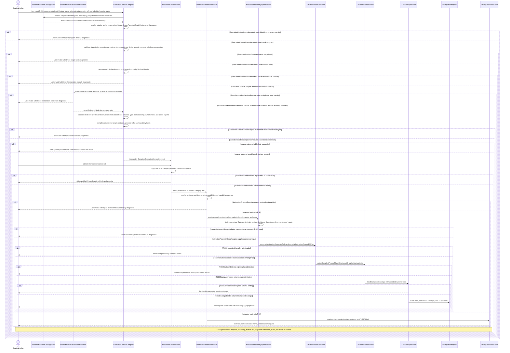
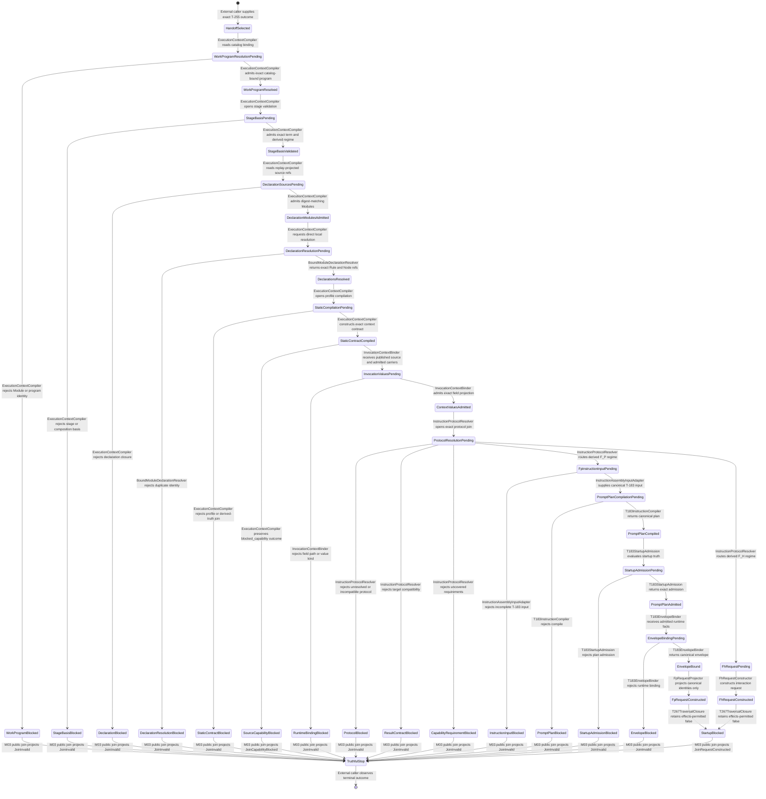

# M03 Declared Execution Context And Instruction Protocol Behavior Design

**Status**: Accepted boundary; proportional implementation repair complete; independent re-review pending
**Date**: 2026-07-13
**Ticket**: T-256
**Method authority**: `specification_methodology/specification/standards/DESIGN_MODULE_METHOD.md` section 5E
**Tenant authority**: [TYPESCRIPT_REALIZATION_GUARDRAILS.md](./TYPESCRIPT_REALIZATION_GUARDRAILS.md)

## Boundary

T-256 closes one generic relation:

```text
T-255 exact published or capability-blocked handoff outcome
  + exact declared C-stage invocation basis
  + exact selected catalog entry ref
  + admitted GTL declaration-module closure
  + admitted invocation carrier values
    -> compiled execution-context contract
    -> canonical T-183 instruction-assembly input and carriers for F_P
       | declared F_H interaction request
       | typed block
```

The design replaces the current code-owned protocol source. It does not add a
prompt service, runtime controller, worker dispatcher, response admission,
event writer, continuation, or closure path.

### Ownership

- M01 GTL owns existing `Rule`, `AssetSurface`, C-stage
  `instructionCategoryRefs`, target-carrier, and composition declarations.
- M02 GTL owns `Module`, strict raw admission, module imports, and its existing
  callable GraphFunction/Job lookup authority. That lookup does not index
  `Rule` or `Node` declarations and T-256 does not widen it.
- M03 runtime-catalog admission owns the cross-Module
  `AdmittedRuntimeCatalogBasis` and its exact `CatalogExecutionBinding` rows.
- M03 ABG compiles strict profiles over admitted `Rule` values, resolves exact
  carrier fields, joins target/capability truth, and adapts the resulting F_P
  truth into the existing T-183 `InstructionAssemblyRule ->
  CompiledPromptPlan -> CompiledPromptPlanStartupAdmission ->
  InstructionEnvelope` path. An F_P request is a read-only projection over
  those canonical carriers, not a parallel instruction carrier.
- M03 uses one stateless `BoundModuleDeclarationResolver` over each already
  catalog-bound Module. The resolver scans the exact immutable Module value for
  unique local `Rule` and `Node` refs, retains no index, and grants no selection
  or invocation authority.
- T-255 owns the selected GraphVector/program/composition/target outcome
  consumed here. T-256 may compile static context law from an exact
  `published_startup_blocked` or `blocked_capability` outcome because both
  preserve the same selected program, composition, target, and closure basis.
  Invalid, structural-only, and successor-constructor-blocked outcomes cannot
  enter this boundary.
- A `DeclaredCStageInvocationBasis` names one exact stage index, role, regime,
  term digest, and program-binding digest already selected by the caller or
  future C runtime. T-256 validates it against the T-255 program and selected
  composition. It does not choose the next stage or execution order; T-259
  owns workflow C runtime sequencing.
- T-257 owns raw F_P output admission.
- T-258 owns public F_H hold, act, and resume.
- T-267 owns traversal result-interface and bind-conservation closeability.
- T-268 owns the ABG 5.0 tenant-conformance manifest.

An absent capability projection remains a T-268 block and cannot produce a
request. Every request produced from a published T-255 outcome retains T-255's
T-267 startup block. Constructing a request does not authorize traversal or
effects.

## Carrier Decision

T-256 introduces no new first-class GTL ontology and no second registry.

Two closed profiles reuse existing GTL `Rule` values published by an admitted
companion `Module`:

1. `gtl.execution_context_projection` declares how named admitted source
   carriers supply generic execution-context slots.
2. `gtl.instruction_protocol` declares versioned instruction content and
   resolves one existing GTL Node `AssetSurface` that owns prompt-interface
   truth.

The profiles are GTL declaration data. Their M03 compiled forms are internal
interpreter carriers, not new public language terms. The instruction profile
compiles into exact inputs for the existing instruction-assembly compiler; it
does not replace that compiler, mint plan admission, or pre-admit a compiled
prompt plan.

The caller preserves the exact selected catalog entry ref from the admitted
catalog invocation. T-256 resolves exactly that `CatalogExecutionBinding`,
verifies that its public GraphFunction is the T-255 execution subject and that
its Module contains the exact T-255-selected helper GraphFunction, and rejects
an absent, duplicate, sibling, or substituted binding. Helper containment may
verify the selected binding; it may not select one.

The selected runtime catalog declaration binds the declaration-module closure
through its existing `declarationSourceRefs`. M03 resolves each source ref to
exactly one `CatalogDeclarationModuleBinding.moduleRef` in the existing
`AdmittedRuntimeCatalogBasis`, verifies the bound Module digest, and then
applies a stateless `BoundModuleDeclarationResolver` to that exact Module
value. The existing M02 `ModuleLookupAuthority` remains limited to its
GraphFunction and Job handles. Query-only lookup, an arbitrary caller-supplied
Module, retained local indexes, or filesystem discovery cannot supply
declaration truth.

Current registry admission events, runtime registry projections, and execution
bindings omit `declarationSourceRefs` after admitting the source
`GtlLibraryEntryDeclaration`. T-256 must preserve that existing field on
`RegistryEntryAdmittedRuntimeEvent`, `RuntimeRegistryEntryProjection`, and
`CatalogExecutionBinding`; include it in canonical event, projection, and
binding identity checks; and derive module closure only from replay-projected
truth. Re-reading the raw declaration after startup is not lawful selection
truth.

The current admitted runtime catalog also retains a bound Module only for
callable `graph_function` execution rows. T-256 adds one subordinate
`CatalogDeclarationModuleBinding` for each unique admitted module identity
contributed by a runtime-library row that can lawfully carry declaration truth,
including `node_type`. Multiple rows over the same module ref, name, and digest
coalesce into one binding with ordered contributing entry, declaration, and
source-event refs. The same module ref with conflicting identity fails catalog
admission. The binding grants no invocation authority and is not a second
registry.

The companion instruction Module is admitted through a `node_type` catalog
row. The row must satisfy the existing identity-GraphFunction node-type law.
Its identity GraphFunction remains a type/declaration carrier and cannot become
public work merely because its Node hosts `AssetSurface` truth.

`blocked_capability` intentionally carries the exact T-255 program binding but
not a second normalized program body. T-256 resolves the selected program from
the selected work `CatalogExecutionBinding.module`. The public catalog entry
remains the invocation authority, while the exact T-255
`hostGraphFunctionRef` resolves one contained helper GraphFunction in that
admitted Module. T-256 then verifies the helper GraphFunction, GraphVector,
program ref, ordered interface, and digest relation against the T-255 binding.
A helper need not be separately catalog-published. A caller-supplied program,
display-name lookup, reconstructed program body, or second helper invocation
authority is invalid.

This permits the T-252 Consensus `Module` bytes to remain unchanged. Consensus
field maps and protocol declarations are product data in a separately admitted
companion Module. The same generic compiler is proved with a non-Consensus
fixture. The Consensus catalog entry is reissued with the companion module ref
added to its ordered `declarationSourceRefs`; its declaration digest therefore
changes and must be regenerated. That catalog-data change does not change the
T-252 GTL body digest.

## Irreducible Architectural Carrier Set

| Carrier | Owner | Role | Visibility |
|---|---|---|---|
| exact T-255 handoff outcome | T-255 M03 | exact function/vector/program/composition/target basis plus compatible capability truth or a typed capability block | public M03 contract |
| `DeclaredCStageInvocationBasis` | caller or future T-259, validated by T-256 | exact stage index/role/regime/term identity within the selected T-255 program; no ordering authority | admitted module-local input |
| admitted registry event/projection plus `AdmittedRuntimeCatalogBasis`, execution binding, and declaration-module bindings | M03 registry and catalog admission | replay-preserved declaration refs, selected work identity, and cross-Module declaration source/digest authority | admitted ABG runtime truth |
| admitted declaration `Module` closure | M02 GTL under catalog bindings | sole source of projection and protocol Rule profiles | admitted GTL |
| `CompiledExecutionContextContract` | T-256 M03 | exact static join from one handoff to named carrier slots and protocol/result/capability law | module-local prime |
| `AdmittedExecutionContextValues` | T-256 M03 | invocation-local values extracted from admitted carriers under the compiled contract | module-local prime |
| canonical T-183 instruction carriers | existing M03 instruction assembly | sole F_P rule, plan, startup-admission, and envelope authority | existing public M03 contracts |
| `DeclaredExecutionContextJoinOutcome` | T-256 M03 | one public discriminated outcome: request constructed, exact capability block preserved, or typed invalid | public M03 contract |
| `DeclaredExecutionRequest` | T-256 M03 | immutable `F_P` projection over canonical T-183 carriers or `F_H` interaction request; both remain startup-blocked | public M03 contract |
| `ExecutionContextDiagnostic` | T-256 M03 | total typed refusal or unrealized relation | public M03 diagnostic |

Subordinate field rows, instruction-asset Nodes, protocol sections, resolved
refs, and capability rows remain owned by these carriers. They do not become
peer registries or public request types.

## Declaration Profiles

### Canonical Rule encoding

Both profiles use the existing `Rule.config: SerializedAttrs` carrier. Scalar
refs and versions use `scalar`, ref collections use `string_list`, and ordered
row structures use one tagged `json_blob`. M03 decodes tagged JSON only through
the existing M01 `serializedJsonValueToPlain` function. Plain-object shortcuts,
duplicate config keys, unknown keys, wrong value kinds, and alternate spellings
fail profile admission.

The execution-context profile has exactly these config keys:

```text
version
source_node_ref
field_rows
policy_refs
```

The instruction-protocol profile has exactly these config keys:

```text
version
instruction_asset_node_ref
allowed_stage_roles
sections
relevance_policies
compression_policy
proportionality_policy_ref
runtime_binding_slot_classes
policy_refs
```

These are serialized wire keys. Strict profile decoding maps them once to
native TypeScript properties:

| Wire key | Decoded native property |
|---|---|
| `source_node_ref` | `sourceNodeRef` |
| `field_rows` | `fieldRows` |
| `policy_refs` | `policyRefs` |
| `instruction_asset_node_ref` | `instructionAssetNodeRef` |
| `allowed_stage_roles` | `allowedStageRoles` |
| `relevance_policies` | `relevancePolicies` |
| `compression_policy` | `compressionPolicy` |
| `proportionality_policy_ref` | `proportionalityPolicyRef` |
| `runtime_binding_slot_classes` | `runtimeBindingSlotClasses` |

`version` and `sections` retain their names in the decoded representation.
Nested JSON rows decode under the same rule:

| Nested wire key | Decoded native property |
|---|---|
| `field_path` | `fieldPath` |
| `value_kind` | `valueKind` |
| `section_ref` | `sectionRef` |
| `section_kind_ref` | `sectionKindRef` |
| `content_digest` | `contentDigest` |
| `policy_refs` | `policyRefs` |

`slot`, `required`, and `content` retain their names. The exact wire members of
one `field_rows` entry are `slot`, `field_path`, `value_kind`, and `required`.
The exact wire members of one `sections` entry are `section_ref`,
`section_kind_ref`, `content`, `content_digest`, `required`, and `policy_refs`.
Camel-case names are never accepted as wire aliases. Snake-case names do not
survive as duplicate native properties after admission.

### Digest law

Every digest is canonical `sha256:` plus 64 lowercase hexadecimal characters;
case normalization is not admission. Protocol content uses the existing
`sha256DigestForText` over the exact declared UTF-8 text. Structured carrier,
closure, stage, and request digests use `stableSha256Digest` over the fully
admitted canonical basis. A derived ref and its digest fields are excluded from
their own digest basis, then added once. Supplied configuration, carrier,
declaration, Module, protocol, target, capability, and startup-block digests are
verified rather than rewritten.

### Execution-context projection Rule

An admitted Rule is an execution-context projection declaration only when:

```text
Rule.kind = "gtl.execution_context_projection"
Rule.name = projectionRef
```

Its decoded native representation declares:

```text
version
sourceNodeRef
fieldRows[]
policyRefs[]
```

Each ordered decoded `fieldRows[]` member declares:

```text
slot = role_or_worker_selection_ref
     | configuration_digest
     | instruction_protocol_ref
     | result_contract_ref
     | capability_requirement_refs
     | interaction_subject_ref
fieldPath
valueKind = ref | digest | ref_list
required
```

Field paths reuse the target-carrier contract's dot-separated own-property
semantics. Empty segments, inherited properties, array indexes, wildcards,
coercion, aliases, and implicit fallback are invalid. A compiled projection
may read only a source Node present in the selected GraphVector and selected C
program's exact ordered input interface. Module-local vector inputs are lawful
even when they are carried by, rather than public inputs of, the containing
GraphFunction.

The Rule does not author source schema, source type, or active regime. The
compiler resolves `sourceNodeRef` through the exact selected GraphVector source
interface, verifies that interface against the selected C-program binding,
derives schema and type from that admitted Node, and derives active regime from
the catalog-bound C program term and selected composition. Supplying
`source_schema_ref`, `source_type_ref`,
`applies_to_regime`, or their native spellings is an unknown-field rejection.

The derived regime selects one closed required-slot set. `F_P` requires
role-or-worker selection, configuration digest, instruction protocol, result
contract, and capability requirements. `F_H` requires an interaction subject,
instruction protocol, result contract, and capability requirements;
role/worker selection is not inferred for an external human. The compiler
collects only rows in the derived set and requires each active slot exactly
once across the admitted Module closure. A known row for the other regime is
passive declaration data for this compilation; duplicate or missing active
slots fail closed.

### Instruction-protocol Rule

An admitted Rule is an instruction-protocol declaration only when:

```text
Rule.kind = "gtl.instruction_protocol"
Rule.name = instructionProtocolRef
```

Its decoded native representation declares:

```text
version
instructionAssetNodeRef
allowedStageRoles[]
sections[]
relevancePolicies[] = { policyRef, mode = selected_vector_source_closure }
compressionPolicy = { policyRef, mode = full_admitted_content }
proportionalityPolicyRef
runtimeBindingSlotClasses[]
policyRefs[]
```

Each ordered decoded section declares:

```text
sectionRef
sectionKindRef
content
contentDigest
required
policyRefs[]
```

M03 recomputes every content digest. `instructionAssetNodeRef` must resolve
exactly once to a Node hosted by a GraphFunction in the same admitted module
closure. That Node's existing `AssetSurface` owns constructor, renderer,
rendered-view digest policy, section/clause kinds, authority slots, prompt-asset
output contracts, and prompt proof obligations. The Rule cannot redeclare
those fields.

The profile declares closed relevance and compression policies as identity plus
mode. T-256 currently admits only `selected_vector_source_closure` and
`full_admitted_content`. The first computes required inputs from the exact
selected GraphVector source interface and admitted one-to-one carrier closure.
The second includes required declared sections only when their complete content
and digest are admitted; optional sections or any unavailable policy mode stop
with a typed instruction-input gap. No opaque policy ref is treated as an
engine default, and no general policy language is introduced.

`runtimeBindingSlotClasses` is the profile's only runtime-binding declaration.
The active `RuntimeBindingSlot` rows, their requiredness, source-truth kinds,
and evidence refs are derived from the selected GraphFunction, vector, stage,
admitted carrier values, and replay/startup projections. The profile cannot
author a source or target type, active regime, result contract, proof,
authority, renderer, or required carrier class.

The protocol does not author instruction work classification. T-256 derives the
class from the exact selected composition role. The current slice maps
`observe`, `validate`, `gate`, and `rank` to `semantic_work`; maps `diagnose` to
`dependency_disambiguation`; and maps `construct` and `repair` to
`target_work`. Unsupported roles stop. `dependency_disambiguation` is accepted
only with non-null matching derived dependency truth that names a target and at
least one candidate node, candidate edge, or typed prerequisite gap.
`target_work` retains the existing dependency and proof-depth gates.

Protocol text is declaration data, not an authority source. It may describe
response grammar, but the worker result contract and target-carrier truth are
derived independently from the T-255 target projection and selected work-target
`AssetSurface`. Prompt-asset output contracts and worker-result contracts are
different relations and cannot substitute for one another.

The invocation-local `instruction_protocol_ref` is mandatory for binding-driven
F_P and F_H work. Any static C-stage `instructionCategoryRefs` are ordered
additional section selections: each ref must resolve exactly once to a
`ProtocolSection.sectionRef` in the same admitted module closure, and the
owning protocol must permit the selected stage role. Repeated selection of the
same section or content digest is invalid. M03 never supplies a code-owned
default category.

## Canonical T-183 Instruction Assembly Bridge

T-256 does not define a second F_P instruction path. Its
`InstructionAssemblyInputAdapter` is an F_D transform into the existing T-183
contracts and functions:

```text
strict protocol Rule plus compiled execution-context truth
  -> InstructionAssemblyRule
  -> CompileInstructionAssemblyPlanInput
  -> CompiledPromptPlan
  -> CompiledPromptPlanStartupAdmission
  -> InstructionEnvelope
  -> DeclaredFpExecutionRequest projection
```

The mapping is exact:

| T-183 input | Derived source |
|---|---|
| `appliesToGraphFunctionRefs`, `appliesToVectorRefs` | exact T-255 selected GraphFunction and GraphVector |
| `sectionRules` | protocol sections' `sectionRef`, `required`, and `policyRefs` |
| `relevanceRules` | protocol `relevancePolicies` evaluated under `selected_vector_source_closure` against the exact selected source interface |
| compression and proportionality policy refs | exact admitted protocol policy identities; compression behavior is evaluated from its closed mode |
| `runtimeBindingSlotClasses` | exact protocol Rule declaration |
| `planRef`, compiler evidence refs | canonical identity over the compiled context, protocol closure, selected stage, and admitted evidence basis |
| compute stage role | exact generic role from the selected admitted composition binding; the C term's domain stage role remains separate protocol identity |
| graph function, vector, registry, source Node, and target Node refs | exact T-255 handoff, selected catalog binding, replay registry basis, ordered selected-GraphVector interface, and target-carrier binding |
| `DerivedInstructionCarrierTruth` | selected source/target Nodes, their `AssetSurface` values, selected C term, target-carrier binding, and admitted composition; never profile-authored |
| known algebra refs | the existing closed T-183 algebra constant; the profile cannot add or remove members |
| required and available input refs | selected GraphVector/C-program interface joined exactly to admitted invocation carriers and replay/startup truth |
| `InstructionSectionDecision` rows | deterministic evaluation of the admitted relevance/compression modes against selected-stage, selected-source, section-content, digest, and admitted-carrier truth; no omission or compression fallback |
| `RuntimeBindingSlot` rows | selected GraphFunction/vector/stage plus admitted carrier and replay/startup truth |
| proportionality class | selected admitted C-program declaration |
| instruction work kind | derived from the exact selected composition role; protocol data cannot select a weaker class |
| expected-answer markers and optional F_P validation evidence | admitted non-tautology policy and validation evidence; absence is passed only where the existing compiler admits absence |
| `RuntimeBindingFact` rows | exact selected source Nodes, admitted source carriers, selected graph/vector/target, protocol, and replay catalog truth according to declared slot classes |
| dependency and proof-depth truth | existing admitted T-183 compiler inputs; absence or an open typed gap blocks rather than being synthesized |
| optional calibration, latitude, artifact schema, and excerpt policy | existing admitted GTL/ABG carrier truth; T-256 neither invents defaults nor changes the T-183 optionality rules |

The adapter calls the existing `constructInstructionAssemblyRule`,
`compileInstructionAssemblyPlan`, `admitCompiledPromptPlanAtStartup`, and
`bindInstructionEnvelope` boundaries. It cannot construct equivalent local
carriers, pre-mark a plan admitted, or discard compiler/admission/binding
issues. Startup admission is evaluated against existing startup event and
registry truth; T-256 does not mint it.

`DeclaredFpExecutionRequest` contains identity references to the accepted
`CompiledPromptPlan` and bound `InstructionEnvelope`, plus a canonical basis
digest over the exact `CompiledPromptPlanStartupAdmission` fields and the exact
T-267 startup block. That digest is a checksum projection, not a second
admission claim. The request carries no
independent section text, prompt text, response contract, renderer, inclusion
decision, or runtime binding authority. Any disagreement between the request
projection and those canonical carriers is invalid.

The F_H branch does not compile an F_P prompt plan. It constructs the distinct
`DeclaredFhInteractionRequest` from the same derived execution-context law and
returns it under the T-267 block; T-258 remains the sole owner of hold, human
act, and resume.

## Static Compilation Law

For one exact T-255 handoff outcome, M03 derives a
`CompiledExecutionContextContract` only
when all of the following hold:

1. the outcome is the exact T-254/T-255 selection and is either
   `published_startup_blocked` or `blocked_capability`; it has not been
   reconstructed;
2. the selected work `CatalogExecutionBinding` resolves the exact program from
   its admitted Module and that program agrees with every T-255 binding field;
3. the declared C-stage invocation basis resolves exactly one term in that
   program; its program-binding digest, stage index, role, regime, term digest,
   and ordered `instructionCategoryRefs` agree, and its regime is `F_P` or
   `F_H`;
4. the selected `CatalogExecutionBinding` and its admitted runtime-catalog
   basis preserve the admitted declaration's exact `declarationSourceRefs`
   through registry event and replay projection, and resolve every source ref
   through exactly one digest-matching `CatalogDeclarationModuleBinding`;
5. `BoundModuleDeclarationResolver` scans each exact bound Module directly;
   duplicate local Rule or Node identity rejects resolution, no local index is
   retained, and no M02 callable lookup is widened;
6. every active projection Rule resolves exactly once, contains only the
   closed wire vocabulary, and does not assert source schema, source type, or
   regime;
7. each projection source Node is in the selected GraphVector and selected
   program's ordered input interface, and its schema and type derive from that
   exact Node;
8. the domain stage role derives from the selected C term, while the generic
   T-183 compute role derives from the exact regime-matched composition; the
   closed required-slot set is present exactly once and value kinds agree;
9. each protocol Rule resolves exactly one instruction-asset Node whose
   `AssetSurface` is complete for the selected renderer-backed prompt policy;
10. static instruction category refs resolve exactly once to protocol sections,
   permit the selected stage role, and introduce no duplicate section or
   content identity;
11. the result-contract compatibility set is derivable from the target
   `AssetSurface`, target schema, and T-255 target-carrier binding;
12. capability state is preserved exactly: requirements are checked against a
   present T-255 basis-preserving projection, while absence remains the typed
   T-268 capability block;
13. the F_P adapter can derive every canonical T-183 rule and compiler input
   from admitted truth without a default, local admission claim, or parallel
   instruction carrier; and
14. no Rule, field row, protocol section, module source, or derived compiler
   input is duplicated, ambiguous, stale, or digest-mismatched.

Static compilation does not read invocation payloads and does not claim a
request exists. A `blocked_capability` source may yield the same static contract
for census and migration proof, but it returns that contract with the exact
T-268 block and stops before invocation binding. Only a
`published_startup_blocked` source may continue to invocation binding.

## Invocation Binding Law

M03 receives only payloads already admitted against their selected carrier
schemas. Each admitted carrier row binds one exact source Node ref, schema ref,
carrier ref, carrier digest, admission ref, and immutable value. The binder
requires an exact one-to-one carrier closure over the selected GraphVector and
C-program source interface; missing, duplicate, or extra carrier rows fail.
Positional, display-name, and schema-only matching are invalid. It applies the
compiled field rows exactly once, validates each value kind, and constructs
`AdmittedExecutionContextValues`. A selected input not named by a projection
remains admitted work context and contributes to derived input and runtime-fact
truth, but it cannot supply a named execution slot implicitly.

The request join then requires:

```text
runtime instruction protocol ref resolves in compiled module closure
runtime result contract ref is target-compatible
runtime capability refs are covered by present T-255 admitted capability truth
runtime configuration digest and source carrier digests are retained
runtime interaction subject is present for F_H
```

For `F_P`, the bound values do not directly construct a request. They first
enter the canonical bridge: construct the existing `InstructionAssemblyRule`,
derive and compile `CompileInstructionAssemblyPlanInput`, admit the resulting
`CompiledPromptPlan` against startup truth, and bind the immutable
`InstructionEnvelope`. The exact selected result-contract ref is carried by the
compiled plan, envelope, and `DeclaredFpExecutionRequest`; the complete target
compatibility set remains separate derived truth. Any rejection at those
existing boundaries becomes a typed `JoinInvalid`. Only then may T-256 project
the canonical carrier refs and digests into `DeclaredFpExecutionRequest`.

For `F_H`, the bound values construct the separate interaction request and do
not enter the F_P instruction compiler. The resulting closed variants are:

```text
DeclaredFpExecutionRequest
DeclaredFhInteractionRequest
```

Both preserve handoff, context-contract, request, and exact T-255 startup-block
truth. The F_P variant preserves declaration, protocol, target, capability,
and source-carrier truth transitively through exact plan, plan-admission, and
envelope identities and cannot duplicate their content. The F_H variant
retains its own interaction-context refs because no F_P envelope exists on
that branch. Neither carries a concrete backend selected from actor identity,
performs an effect, emits an event, or claims traversal closeability.

The one public join function returns `DeclaredExecutionContextJoinOutcome` with
exactly one variant:

```text
request_constructed  -> one DeclaredExecutionRequest
blocked_capability   -> one CompiledExecutionContextContract plus the exact
                        T-255 blocked_capability outcome
invalid              -> one or more ExecutionContextDiagnostic rows
```

No variant carries both a request and a capability block, and no invalid
variant carries a partially usable request.

## Typed Diagnostic Algebra

The one public T-256 join entrypoint is total. Module-local constructors and
transforms may reject malformed internal input, but the public boundary maps
those failures into `JoinInvalid` and `ExecutionContextDiagnostic`; it does not
leak an untyped throw.

The closed classifications are:

```text
invalid_program
invalid_runtime_binding
semantic_not_realized
```

The closed diagnostic IDs are:

```text
execution-context-source-outcome-invalid
execution-context-stage-basis-invalid
execution-context-program-binding-mismatch
execution-context-declaration-source-projection-missing
execution-context-declaration-module-unresolved
execution-context-declaration-module-ambiguous
execution-context-declaration-module-digest-mismatch
execution-context-bound-module-declaration-invalid
execution-context-profile-shape-invalid
execution-context-profile-wire-vocabulary-invalid
execution-context-derived-truth-redeclared
execution-context-projection-source-invalid
execution-context-carrier-row-invalid
execution-context-field-path-invalid
execution-context-field-value-invalid
execution-context-protocol-ref-invalid
execution-context-protocol-content-digest-mismatch
execution-context-protocol-stage-incompatible
execution-context-instruction-asset-invalid
execution-context-result-contract-incompatible
execution-context-capability-incompatible
execution-context-instruction-rule-invalid
execution-context-prompt-plan-rejected
execution-context-prompt-plan-startup-rejected
execution-context-instruction-envelope-rejected
```

Each diagnostic carries `path`, expected and actual relation, evidence refs,
and one closed repair affordance:

```text
correct_source_outcome
restore_replay_projection
admit_declaration_module
correct_reference
correct_field_shape
admit_runtime_carrier
repair_digest
correct_protocol
correct_result_contract
correct_capability_requirements
repair_tenant_capability_coverage
restore_instruction_compiler_input
restore_startup_admission
restore_runtime_binding_truth
```

Missing tenant-conformance truth returns the exact T-255/T-268 capability block
and diagnostic. A constructed request preserves the exact T-255/T-267 traversal
startup block. T-256 does not translate either into a locally authored success,
failure, or substitute block.

## Domain Model

The interpreter-action classes below name semantic owners used by the sequence
view. They are module-local transforms, not public services, registries, or new
GTL language terms.

```mermaid
classDiagram
  direction LR

  class RegistryEntryAdmittedRuntimeEvent {
    <<effect-edge>>
    +entryRef
    +declarationRef
    +declarationSourceRefs
    +declarationDigest
  }
  class RuntimeRegistryEntryProjection {
    <<authoritative>>
    +entryRef
    +declarationRef
    +declarationSourceRefs
    +declarationDigest
  }
  class CatalogAdmission {
    <<authoritative>>
    -admitRuntimeCatalog()
  }
  class AdmittedRuntimeCatalogBasis {
    <<authoritative>>
    +catalogId
    +resolvedLockRef
    +executionBindings
    +declarationModuleBindings
  }
  class CatalogExecutionBinding {
    <<authoritative>>
    +entryRef
    +declarationSourceRefs
    +moduleRef
    +moduleName
    +moduleDigest
  }
  class CatalogDeclarationModuleBinding {
    <<authoritative>>
    +moduleRef
    +moduleName
    +moduleDigest
    +sourceEntryRefs
    +sourceDeclarationRefs
    +sourceEventRefs
    +invocationAuthority false
  }
  class BoundModuleDeclarationResolver {
    <<interpreter>>
    -resolveExactRuleAndNode()
    +retainedIndex false
    +invocationAuthority false
  }
  class Module {
    <<prime>>
    +name
    +rules
    +graphFunctions
  }
  class ExecutionContextProjectionRule {
    <<subordinate>>
    +projectionRef
    +sourceNodeRef
    +fieldRows
    +policyRefs
  }
  class FieldRow {
    <<subordinate>>
    +slot
    +fieldPath
    +valueKind
    +required
  }
  class InstructionProtocolRule {
    <<subordinate>>
    +instructionProtocolRef
    +version
    +instructionAssetNodeRef
    +allowedStageRoles
    +relevancePolicies
    +compressionPolicy
    +proportionalityPolicyRef
    +runtimeBindingSlotClasses
  }
  class GraphFunction {
    <<subordinate>>
    +id
    +inputs
    +outputs
  }
  class GraphVector {
    <<subordinate>>
    +id
    +source
    +target
  }
  class Node {
    <<subordinate>>
    +id
    +schema
    +assetSurface
  }
  class AssetSurface {
    <<subordinate>>
    +constructorRefs
    +rendererRefs
    +outputContractRefs
    +proofObligationRefs
  }
  class ProtocolSection {
    <<subordinate>>
    +sectionRef
    +contentDigest
  }
  class ExactT255HandoffOutcome {
    <<prime>>
    +status
  }
  class PublishedT255HandoffOutcome {
    <<prime>>
    +status published_startup_blocked
    +handoff
  }
  class CapabilityBlockedT255HandoffOutcome {
    <<prime>>
    +status blocked_capability
    +programBinding
    +compositionSelection
    +targetCarrierBinding
    +admittedManifestRef nullable
    +diagnostics
  }
  class CompiledGraphVectorExecutionHandoff {
    <<prime>>
    +handoffRef
    +programBinding
    +normalizedProgram
    +compositionSelection
    +targetCarrierBinding
    +capabilityCompatibility
    +startupBlock
  }
  class TraversalStartupBlock {
    <<subordinate>>
    +status startup_blocked_awaiting_t267
    +effectsPermitted false
    +blockDigest
  }
  class DeclaredCStageInvocationBasis {
    <<prime>>
    -programBindingDigest
    -stageIndex
    -stageRole
    -regime F_P or F_H
    -termDigest
    -instructionCategoryRefs
  }
  class ExecutionContextCompiler {
    <<authoritative>>
    -compileStaticContract()
  }
  class InvocationContextBinder {
    <<authoritative>>
    -bindAdmittedValues()
  }
  class InstructionProtocolResolver {
    <<authoritative>>
    -resolveProtocolAndTarget()
  }
  class InstructionAssemblyInputAdapter {
    <<authoritative>>
    -deriveCanonicalT183Input()
  }
  class InstructionAssemblyRule {
    <<prime>>
    +ruleRef
    +sectionRules
    +relevanceRules
    +runtimeBindingSlotClasses
  }
  class T183InstructionCompiler {
    <<authoritative>>
    -compileInstructionAssemblyPlan()
  }
  class CompiledPromptPlan {
    <<prime>>
    +planRef
    +planDigest
    +derivedTruth
    +sectionDecisions
    +bindingSlots
  }
  class T183StartupAdmission {
    <<authoritative>>
    -admitCompiledPromptPlanAtStartup()
  }
  class CompiledPromptPlanStartupAdmission {
    <<prime>>
    +admitted
    +planRef
    +planDigest
    +startupEventRefs
    +registryEntryRefs
    +issues
  }
  class T183EnvelopeBinder {
    <<authoritative>>
    -bindInstructionEnvelope()
  }
  class InstructionEnvelope {
    <<prime>>
    +envelopeRef
    +envelopeDigest
    +planRef
    +planDigest
    +boundRuntimeRefs
    +outputContractRefs
    +selectedOutputContractRef
  }
  class FpRequestProjector {
    <<authoritative>>
    -projectCanonicalRequest()
  }
  class FhRequestConstructor {
    <<authoritative>>
    -constructInteractionRequest()
  }
  class CompiledExecutionContextContract {
    <<prime>>
    -contractRef
    -sourceOutcomeStatus
    -sourceBasisDigest
    -publishedHandoffRef nullable
    -selectedStageDigest
    -selectedStageRole
    -selectedComputeStageRole
    -selectedCompositionRole
    -selectedRegime
    -declarationClosureDigest
    -fieldRows
    -staticProtocolRefs
    -targetCompatibilityRefs
    -contractDigest
  }
  class AdmittedInvocationCarrierSet {
    <<prime>>
    -carriers
  }
  class AdmittedInvocationCarrier {
    <<subordinate>>
    -sourceNodeRef
    -schemaRef
    -carrierRef
    -carrierDigest
    -admissionRef
    -value
  }
  class AdmittedExecutionContextValues {
    <<prime>>
    -selectionContractRef
    -configurationDigest
    -instructionProtocolRef
    -resultContractRef
    -capabilityRequirementRefs
    -interactionSubjectRef
  }
  class DeclaredExecutionRequest {
    <<prime>>
    +requestRef
    +requestDigest
    +handoffRef
    +stageRole
    +stageTermDigest
    +contextContractRef
    +contextContractDigest
    +startupBlockDigest
  }
  class DeclaredExecutionContextJoinOutcome {
    <<downstream>>
    +status
  }
  class JoinRequestConstructed {
    <<downstream>>
    +status request_constructed
    +request
  }
  class JoinCapabilityBlocked {
    <<downstream>>
    +status blocked_capability
    +compiledContractRef
    +compiledContractDigest
    +sourceCapabilityOutcome
  }
  class JoinInvalid {
    <<downstream>>
    +status invalid
    +diagnostics
  }
  class DeclaredFpExecutionRequest {
    <<downstream>>
    +regime F_P
    +planRef
    +planDigest
    +startupAdmissionBasisDigest
    +envelopeRef
    +envelopeDigest
    +resultContractRef
  }
  class DeclaredFhInteractionRequest {
    <<downstream>>
    +regime F_H
    +interactionSubjectRef
    +declarationClosureDigest
    +protocolRefs
    +protocolClosureDigest
    +resultContractRef
    +targetBindingDigest
    +capabilityRefs
    +capabilityBasisDigest
    +sourceCarrierRefs
    +sourceCarrierDigests
  }
  class ExecutionContextDiagnostic {
    <<downstream>>
    +classification
    +diagnosticId
    +path
    +expectedRelation
    +actualRelation
    +evidenceRefs
    +repairAffordance
  }
  class T257ResponseAdmission {
    <<deferred>>
  }
  class T258FhHoldActResume {
    <<deferred>>
  }
  class T267TraversalClosure {
    <<deferred>>
  }

  RegistryEntryAdmittedRuntimeEvent "1..*" --> "1" RuntimeRegistryEntryProjection : replay projects
  CatalogAdmission "1" --> "1" AdmittedRuntimeCatalogBasis : constructs
  AdmittedRuntimeCatalogBasis "1" *-- "0..*" CatalogExecutionBinding : admits callable rows
  AdmittedRuntimeCatalogBasis "1" *-- "0..*" CatalogDeclarationModuleBinding : admits declaration Modules
  RuntimeRegistryEntryProjection "1..*" --> "0..*" CatalogDeclarationModuleBinding : source refs resolve
  CatalogExecutionBinding "1" --> "1" Module : binds callable work Module
  CatalogDeclarationModuleBinding "1" --> "1" Module : binds exact digest
  Module "1" --> "1" BoundModuleDeclarationResolver : scanned after catalog binding
  Module "1" *-- "0..*" ExecutionContextProjectionRule : publishes profile
  ExecutionContextProjectionRule "1" *-- "1..*" FieldRow : owns ordered rows
  Module "1" *-- "0..*" InstructionProtocolRule : publishes profile
  InstructionProtocolRule "1" *-- "1..*" ProtocolSection : owns ordered sections
  Module "1" *-- "1..*" GraphFunction : publishes declaration carrier
  GraphFunction "1" *-- "0..*" GraphVector : contains exact selected vectors
  GraphVector "1" --> "1..*" Node : owns ordered source interface
  GraphFunction "1" *-- "1..*" Node : hosts typed interface
  Node "1" *-- "1" AssetSurface : owns interface truth
  InstructionProtocolRule "1" --> "1" Node : resolves exact prompt interface
  InstructionProtocolRule "1" --> "1" InstructionProtocolResolver : supplies declared protocol
  ExactT255HandoffOutcome <|-- PublishedT255HandoffOutcome
  ExactT255HandoffOutcome <|-- CapabilityBlockedT255HandoffOutcome
  ExactT255HandoffOutcome "1" --> "1" CatalogExecutionBinding : verified against selected work
  CatalogExecutionBinding "1" --> "1" GraphFunction : public invocation authority
  CatalogExecutionBinding "1" --> "0..*" GraphFunction : admitted Module contains helpers
  PublishedT255HandoffOutcome "1" *-- "1" CompiledGraphVectorExecutionHandoff : carries
  CompiledGraphVectorExecutionHandoff "1" *-- "1" TraversalStartupBlock : preserves
  ExecutionContextCompiler "1" --> "1" CompiledExecutionContextContract : constructs
  ExactT255HandoffOutcome "1" --> "0..1" CompiledExecutionContextContract : exact static basis
  DeclaredCStageInvocationBasis "1" --> "0..1" CompiledExecutionContextContract : validated stage basis
  AdmittedRuntimeCatalogBasis "1" --> "1" ExecutionContextCompiler : supplies replay basis
  BoundModuleDeclarationResolver "1" --> "1" ExecutionContextCompiler : supplies exact Rule and Node refs
  Module "1..*" --> "0..1" CompiledExecutionContextContract : supplies declaration truth
  InvocationContextBinder "1" --> "0..1" AdmittedExecutionContextValues : constructs
  AdmittedInvocationCarrierSet "1" *-- "1..*" AdmittedInvocationCarrier : owns ordered rows
  AdmittedInvocationCarrierSet "1" --> "0..1" AdmittedExecutionContextValues : projected under contract
  CompiledExecutionContextContract "1" --> "0..1" AdmittedExecutionContextValues : governs extraction
  CompiledExecutionContextContract "1" --> "1" InstructionProtocolResolver : supplies static protocol and target basis
  AdmittedExecutionContextValues "1" --> "1" InstructionProtocolResolver : supplies runtime refs
  InstructionProtocolResolver "1" --> "1" InstructionAssemblyInputAdapter : supplies exact F_P protocol basis
  InstructionProtocolResolver "1" --> "1" FhRequestConstructor : supplies exact F_H protocol basis
  AdmittedExecutionContextValues "1" --> "1" InstructionAssemblyInputAdapter : supplies F_P values
  CompiledExecutionContextContract "1" --> "1" InstructionAssemblyInputAdapter : supplies derived truth
  InstructionAssemblyInputAdapter "1" --> "1" InstructionAssemblyRule : constructs canonical input
  InstructionAssemblyInputAdapter "1" --> "1" T183InstructionCompiler : supplies complete compiler input
  T183InstructionCompiler "1" --> "0..1" CompiledPromptPlan : constructs canonical plan
  CompiledPromptPlan "1" --> "1" T183StartupAdmission : requests existing admission
  T183StartupAdmission "1" --> "0..1" CompiledPromptPlanStartupAdmission : admits against startup truth
  CompiledPromptPlanStartupAdmission "1" --> "1" T183EnvelopeBinder : authorizes envelope binding
  AdmittedExecutionContextValues "1" --> "1" T183EnvelopeBinder : supplies admitted runtime facts
  T183EnvelopeBinder "1" --> "0..1" InstructionEnvelope : constructs canonical envelope
  CompiledPromptPlan "1" --> "1" FpRequestProjector : supplies exact plan identity
  CompiledPromptPlanStartupAdmission "1" --> "1" FpRequestProjector : supplies exact admission basis
  InstructionEnvelope "1" --> "1" FpRequestProjector : supplies exact envelope identity
  FpRequestProjector "1" --> "0..1" DeclaredFpExecutionRequest : projects without duplicate truth
  AdmittedExecutionContextValues "1" --> "1" FhRequestConstructor : supplies F_H values
  CompiledExecutionContextContract "1" --> "1" FhRequestConstructor : preserves static truth
  FhRequestConstructor "1" --> "0..1" DeclaredFhInteractionRequest : constructs interaction request
  TraversalStartupBlock "1" --> "0..*" DeclaredExecutionRequest : preserved exactly
  DeclaredExecutionContextJoinOutcome <|-- JoinRequestConstructed
  DeclaredExecutionContextJoinOutcome <|-- JoinCapabilityBlocked
  DeclaredExecutionContextJoinOutcome <|-- JoinInvalid
  JoinRequestConstructed "1" *-- "1" DeclaredExecutionRequest : returns
  JoinCapabilityBlocked "1" --> "1" CompiledExecutionContextContract : proves static join
  JoinCapabilityBlocked "1" --> "1" CapabilityBlockedT255HandoffOutcome : preserves exact block
  JoinInvalid "1" *-- "1..*" ExecutionContextDiagnostic : returns typed refusal
  FpRequestProjector "1" --> "0..1" JoinRequestConstructed : returns F_P variant
  FhRequestConstructor "1" --> "0..1" JoinRequestConstructed : returns F_H variant
  ExecutionContextCompiler "1" --> "0..1" JoinCapabilityBlocked : returns exact capability block
  ExecutionContextCompiler "1" --> "0..*" JoinInvalid : may refuse
  InvocationContextBinder "1" --> "0..*" JoinInvalid : may refuse
  InstructionProtocolResolver "1" --> "0..*" JoinInvalid : may refuse
  InstructionAssemblyInputAdapter "1" --> "0..*" JoinInvalid : may refuse
  T183InstructionCompiler "1" --> "0..*" JoinInvalid : may refuse
  T183StartupAdmission "1" --> "0..*" JoinInvalid : may refuse
  T183EnvelopeBinder "1" --> "0..*" JoinInvalid : may refuse
  DeclaredExecutionRequest <|-- DeclaredFpExecutionRequest
  DeclaredExecutionRequest <|-- DeclaredFhInteractionRequest
  DeclaredFpExecutionRequest "1" --> "0..1" T257ResponseAdmission : later binds raw response
  DeclaredFhInteractionRequest "1" --> "0..1" T258FhHoldActResume : later interaction basis
  DeclaredExecutionRequest "1" --> "1" T267TraversalClosure : remains blocked
  CompiledExecutionContextContract "1" --> "0..*" ExecutionContextDiagnostic : total refusal
  AdmittedExecutionContextValues "1" --> "0..*" ExecutionContextDiagnostic : total refusal
```



## Execution Sequence



## Lifecycle State Machine



No T-256 state is `dispatched`, `executed`, `admitted_result`, `resumed`, or
`closed`.

`WorkProgramBlocked`, `DeclarationBlocked`, `DeclarationResolutionBlocked`,
`StageBasisBlocked`, `StaticContractBlocked`, `RuntimeBindingBlocked`,
`ProtocolBlocked`, `ResultContractBlocked`, `CapabilityRequirementBlocked`,
`InstructionInputBlocked`, `PromptPlanBlocked`, `StartupAdmissionBlocked`, and
`EnvelopeBlocked` return `JoinInvalid`.
`SourceCapabilityBlocked` returns `JoinCapabilityBlocked`.
`StartupBlocked` returns `JoinRequestConstructed` whose request preserves the
exact T-267 block.

## Cross-View Invariants

| Check | Evidence | Verdict |
|---|---|---|
| Every sequence participant exists in the domain model or is external | admitted catalog, stateless bound-Module declaration resolver, context compiler, binder, protocol resolver, T-183 adapter/compiler/admission/envelope owners, request owners, and external caller are modeled | `pass` |
| Every lifecycle carrier exists in the domain model | declaration modules, compiled contract, invocation carriers, context values, canonical T-183 plan/admission/envelope, requests, and diagnostics are modeled | `pass` |
| Every message is a declared admission or total transform | catalog/program resolution, direct declaration resolution, stage validation, profile compilation, field projection, protocol resolution, T-183 compilation/admission/binding, and request projection are explicit | `pass` |
| GTL remains the protocol source | content and field maps are strict Rule profiles; prompt-interface truth remains on an existing Node AssetSurface | `pass` |
| Registry selection remains replay-derived | admitted registry events carry declaration source refs into the runtime projection and canonical module bindings | `pass` |
| No second registry appears | admitted declarationSourceRefs survive into the runtime-catalog basis, then resolve through deduplicated non-invoking declaration-Module bindings and a stateless direct Module scan; no local index is retained and existing M02 callable lookup is unchanged | `pass` |
| Profile truth is narrow and derived | source schema, source type, active regime, and work class derive from selected Nodes, C program, and composition; strict Rules carry only source ref, field rows, sections, closed relevance/compression policies, policy refs, and allowed runtime slot classes | `pass` |
| Domain and compute roles stay distinct | the selected C term retains the domain protocol role while the exact composition supplies the generic T-183 compute role | `pass` |
| Module-contained helpers remain catalog-governed | the exact caller-selected public catalog entry supplies invocation authority and its admitted Module contains the exact T-255-selected helper GraphFunction and GraphVector; containment never selects a sibling entry | `pass` |
| F_P instruction authority remains singular | F_P reaches the existing InstructionAssemblyRule, CompiledPromptPlan, startup admission, and InstructionEnvelope carriers before request projection, preserving the exact selected result contract throughout | `pass` |
| Product field names do not enter M03 code | product-specific mappings are declaration rows; the compiler sees generic slots | `pass` |
| Target and capability truth are not reconstructed | exact T-255 outcome projections are consumed directly; capability absence stays blocked | `pass` |
| Raw F_P output cannot become accepted | output does not enter this boundary; T-257 remains explicit | `pass` |
| F_H remains an external act | T-256 constructs only an interaction request; T-258 owns hold/act/resume | `pass` |
| Runtime effects remain blocked | every request retains T-255's T-267 startup fence | `pass` |
| Stage choice is not hidden orchestration | the caller supplies an exact declared stage basis; T-256 validates but does not choose order or advance the C program | `pass` |

## Axiom Evaluation

| Axiom | Authority | Domain evidence | Sequence evidence | State evidence | Native enforcement | Admission/compiler enforcement | Verdict | Gap owner |
|---|---|---|---|---|---|---|---|---|
| Product-visible prompt construction is GTL-expressible | CONTRACT-LAW-API-008 | protocol Rules own content and resolve typed Node AssetSurfaces | catalog-bound Module and direct declaration resolution precede protocol compilation | no code-synthesis state exists | typed profile constructors may narrow local authoring | M03 rejects unknown fields, stale digests, incomplete AssetSurfaces, and dangling refs | `pass` | T-256 realization |
| Rule profiles remain passive immutable declarations | RULE-001..006; ATTRS-001..006 | profiles are Rule/SerializedAttrs data subordinate to Module | ABG compiles and enforces; Rule performs no action | no Rule-executing state exists | ordered typed config and duplicate-key refusal | strict profile admission owns global shape and refs | `pass` | T-256 realization |
| Module remains the singular GTL publication boundary | MODULE-001..006 | companion truth is published as Module rules plus an identity GraphFunction/Node AssetSurface | catalog-bound Module resolution and direct stateless declaration resolution precede compilation | missing Module closure blocks | existing Module remains prime; no local index is retained | registry/catalog admission preserves exact Module identity | `pass` | T-256 realization |
| No prompt or contract law is hidden in code | CONTRACT-LAW-API-010/-012 | static and dynamic protocol refs are explicit | code-owned fallback is absent | missing declaration blocks | no default protocol in adapter or request projection | exact module/ref resolution required | `pass` | T-256 realization |
| Instruction assembly adds no second GTL surface | INSTRUCTION-ASSEMBLY-001/-002 | profiles reuse Rule, Node AssetSurface, and Module and omit source/type/regime truth | admitted runtime catalog then direct Rule/Node resolution is singular | no parallel registry state | no new public GTL term, no retained local index, and M02 callable lookup is unchanged | runtime-catalog preserves source refs and non-invoking Module bindings; direct resolution grants no authority | `pass` | T-256 realization |
| Registry selection is replay-derived | INSTRUCTION-ASSEMBLY-012/-013 | registry event, projection, and execution binding preserve admitted declarationSourceRefs; catalog admission canonically binds source Modules | compiler consumes the admitted catalog basis, not raw startup input | missing projected source truth blocks | projection fields are immutable | event, projection, and binding identities include ordered source refs and exact Module identity; exact duplicates coalesce | `pass` | T-256 realization |
| Declaration Modules grant no work invocation | ASSET-SURFACE-001; PRODUCT GraphFunction boundary | companion row is `node_type`; identity GraphFunction and declaration binding have no invocation authority | compiler reads declarations but invokes no GraphFunction | no invocation state exists | carrier omits callable handle | catalog enforces node-type identity and keeps declaration and execution bindings distinct | `pass` | T-256 realization |
| Carrier, target, proof, authority, renderer, and regime truth are derived | INSTRUCTION-ASSEMBLY-003; ASSET-SURFACE-002..011 | T-255 work target, selected GraphVector source Nodes, C term/composition, and protocol asset Node remain prime | compiler derives schema/type/regime and rejects profile assertions | incompatibility or redeclaration blocks | request and profile types cannot author interface truth | exact prompt-asset, selected-vector Node, C-term, composition, and target/result derivation checks | `pass` | T-256 realization |
| F_D decisions are total over a known algebra | INSTRUCTION-ASSEMBLY-004/-004A | closed profiles, slots, paths, and outcomes | every branch returns contract, request, or diagnostic | all refusal states terminate truthfully | discriminated carriers | total compiler and binder issue families | `pass` | T-256 realization |
| Stage identity derives from the declared C program | C-ALGEBRA-009/-011/-013/-016; CCALL-014/-016 | stage basis carries exact program, index, role, regime, term, and category identity | compiler validates the stage without choosing execution order | invalid basis reaches StageBasisBlocked | closed F_P/F_H regime and stage fields | exact program/composition comparison | `pass` | T-256 realization; T-259 owns sequencing |
| F_P dispatch requires plan, envelope, and manifest | INSTRUCTION-ASSEMBLY-005/-017 | F_P request projects an admitted canonical plan and envelope but is not a manifest or dispatch authority | absent capability stops before plan; accepted F_P path compiles/admit/binds canonical carriers then stops before rendering or dispatch | plan, admission, envelope refusals terminate; StartupBlocked is terminal | request stores only canonical identities and has no effect method | existing T-183 boundaries enforce plan/admission/envelope; T-267 and later manifest rendering remain required | `pass` | T-256 realization; T-267 retains effect gate |
| Runtime refs fail closed | INSTRUCTION-ASSEMBLY-008 | admitted carrier rows bind exact Node, schema, carrier, admission, and digest identity | binder precedes request | malformed value reaches RuntimeBindingBlocked | closed value kinds | unique source-Node binding plus schema admission and exact field projection | `pass` | T-256 realization |
| Relevance, compression, and proportionality dispatch decisions | INSTRUCTION-ASSEMBLY-006/-007 | narrow protocol refs and admitted carrier truth feed the canonical T-183 rule and plan | F_D adapter derives decisions and existing compiler validates them before plan acceptance | incomplete input or rejected plan terminates before request | no product-authored include/omit or proportionality verdict exists | canonical compiler inputs and issues remain authoritative; T-256 cannot bypass them | `pass` | T-256 adapter plus existing instruction compiler |
| Rendering and prompt-manifest replay | INSTRUCTION-ASSEMBLY-009/-010 | protocol content differs from rendered manifest | no rendering participant in T-256 | no rendered state | F_P request preserves only canonical plan/envelope identity and F_H protocol refs carry no renderer authority | existing renderer consumes later admitted truth | `not_applicable` | Existing instruction renderer |
| Prompt non-tautology and optional F_P plan review | INSTRUCTION-ASSEMBLY-011/-015 | canonical plan and envelope retain existing non-tautology and evidence fields | adapter supplies admitted evidence and existing compiler decides acceptance | rejected plan cannot reach request projection | protocol Rule cannot approve its own plan | existing compiler retains non-tautology and review-evidence admission | `pass` | Existing instruction compiler |
| Dependency sufficiency before target dispatch | INSTRUCTION-ASSEMBLY-016 | canonical plan consumes existing dependency and proof-depth truth | missing or open target-work dependency truth rejects canonical compilation | PromptPlanBlocked or StartupBlocked terminates | request cannot author dependency closure or dispatch | existing dependency compiler input remains mandatory and T-256 cannot synthesize it | `pass` | T-256 adapter plus existing instruction compiler |
| Worker response is admitted before truth | INSTRUCTION-ASSEMBLY-014 | T-257 is deferred and distinct | no response message exists | no result state exists | no response field on request outcome | T-257 owns admission | `not_applicable` | T-257 |
| F_H act and resume | COMPUTE-NOTATION-017 | F_H request is distinct from human act | request returns to caller without act | no act/resume state here | variant lacks authority methods | T-258 admission required | `not_applicable` | T-258 |
| Consensus remains a free construction | PRODUCT atom criterion; CONSENSUS-009/-010 | companion Module is product data over generic profiles | generic compiler has no Consensus participant | generic states only | no feature-specific M03 type | non-Consensus fixture required | `pass` | T-256 realization |
| Actor identity cannot select worker/backend | CONSENSUS-005/-011 | selection contract and actor/subject are separate slots | request preserves but does not resolve backend | no worker-selected state | F_P and F_H variants differ | contradictory slot use rejects | `pass` | T-256 realization |

`pass` evaluates the candidate design shape only; it is not implementation
evidence. `not_applicable` marks law whose operative transform is outside the
T-256 boundary and names its retained owner.

## Required Proof Matrix

| Proof | Required observation |
|---|---|
| native/raw profile equivalence | strict Rule-profile constructors and raw Module admission converge on identical declaration digests |
| closed profile shape | unknown fields, duplicate slots, duplicate refs, empty paths, invalid value kinds, and invalid profile versions refuse |
| wire/native vocabulary | snake-case wire keys decode once to the specified camel-case native properties; camel-case wire input, alternate spellings, and residual duplicate properties refuse |
| derived profile truth | authored source schema, source type, or active regime fields refuse; changing the selected Node, C term, or composition changes the derived truth and contract digest |
| total typed refusal | every malformed public compiler/binder input returns only a closed diagnostic, exact T-268 capability block, or exact T-267 startup block; no untyped exception crosses the public boundary |
| digest law | uppercase, malformed, stale, self-referential, or recomputed-over-a-different-basis digests refuse; exact text and structured canonical bases reproduce identity |
| module authority | absent, duplicate, sibling, or substituted selected catalog entry plus source-ref projection loss and absent, unadmitted, ambiguous, stale, or digest-mismatched declaration-Module bindings block; helper containment cannot select authority; direct Rule/Node resolution retains no index, grants no invocation authority, and does not widen `ModuleLookupAuthority` |
| registry replay law | admitted registry events, replay projections, and execution bindings preserve the same ordered declarationSourceRefs and digest identity |
| node-type declaration law | the companion row resolves an admitted identity GraphFunction and grants no callable execution binding |
| carrier-row identity | source Node refs resolve exactly once to admitted carrier rows; positional, label-only, schema-only, duplicate, and missing matches refuse |
| field-path law | own-property nested paths resolve; inherited properties, wildcards, arrays, aliases, and coercion refuse |
| ordered interface law | a projection cannot read a Node outside the exact selected GraphVector/C-program input interface; all selected source Nodes require one admitted carrier and extras refuse |
| selected-stage law | wrong program binding, index, domain role, regime, term digest, or instruction-category order refuses; generic compute role derives only from the exact composition and T-256 does not choose the next stage |
| work-class law | protocol-authored work class is absent; semantic work derives from an eligible exact composition role; dependency disambiguation without matching target/candidate/gap truth and target work without dependency/proof truth refuse |
| policy-decision law | relevance and compression policy identity is bound to one admitted closed mode; selected-source/full-content behavior is computed from exact vector, carrier, section, and digest truth; unsupported modes and optional undecided sections refuse |
| blocked-outcome program law | capability-blocked input resolves the exact helper GraphFunction, GraphVector, and program only by containment in the catalog-bound Module and rejects any T-255 binding disagreement |
| protocol law | missing refs, duplicate refs, role mismatch, mutated text, content-digest mismatch, dangling asset Node, and incomplete prompt AssetSurface refuse |
| target law | runtime result-contract ref must match the T-255 target/AssetSurface compatibility set and remain exact on plan, envelope, and F_P request carriers |
| capability law | runtime capability requirements must be covered by the T-255 admitted manifest basis; absent basis remains a T-268 block and produces no request |
| canonical T-183 bridge | an F_P join must call the existing Rule constructor, compiler, startup admission, and envelope binder in order; compiler/admission/binding rejection produces `JoinInvalid`, and no parallel local plan or envelope type is reachable |
| request identity | changing stage identity, any field value, source digest, protocol content, target contract, capability basis, canonical plan/admission/envelope identity, or startup block changes request digest |
| startup-block identity | every constructed request preserves the exact T-255 TraversalStartupBlock and its digest; capability-blocked input constructs no request |
| no fallback | deleting a declaration, carrier field, canonical T-183 compiler input, or startup-admission input blocks; M03 does not call `defaultInstructionSectionText` or read `FpTransportConfig.prompt` |
| genericity | one non-Consensus single-stage fixture and one multi-source fixture compile without feature branches |
| T-252 preservation | canonical body digest remains `sha256:e4555c21cdb4292b64f7f4d5a625c2a520195aa8d6e9c759498eed4bf28d0ea0`; the catalog declaration digest changes when its ordered companion source ref is admitted; the census invokes the real join for every F_P/F_H capability-blocked consumer and closes the two T-256 families only when field and protocol-role closure are observed; the same 28 paths remain T-268 capability blocks |
| no effects | source closure reaches no runner, plugin, worker, transport, event, archive, continuation, or closure module |
| packed publication | public exports and packed install preserve the same request and diagnostic surfaces without private imports |

## Migration And Break Order

1. Preserve admitted `declarationSourceRefs` through registry admission events,
   runtime projections, and execution-binding identity checks; add a
   non-invoking declaration-Module binding to the same admitted runtime catalog
   basis.
2. Add strict profile constructors/admitters over existing Rule, Node
   `AssetSurface`, and Module carriers.
   Do not add a new top-level GTL term.
3. Add the module-closure compiler and static context contract using existing
   catalog `declarationSourceRefs`, `AdmittedRuntimeCatalogBasis`, exact
   execution bindings, and stateless `BoundModuleDeclarationResolver`. Do not
   retain a local index or widen the existing M02 callable lookup.
4. Add invocation carrier projection and bind exact T-255 target and
   capability projections; preserve T-268 when
   capability truth is absent and retain T-267 startup blocking when it is
   present.
5. Adapt the F_P branch into the existing T-183 Rule constructor, compiler,
   startup admission, and envelope binder; only then add the read-only F_P
   request projection and the distinct F_H interaction request.
6. Publish a non-Consensus declaration Module and fixtures.
7. Publish the Consensus companion declaration Module as product data without
   changing T-252 body bytes or adding Consensus logic to M03.
8. Rebind the 5.0-reachable instruction startup path to the compiled contract.
9. Remove or make unreachable code-owned protocol synthesis and
   `FpTransportConfig.prompt` on the supported path.
10. Recompute the T-252 census, regenerate packed/public inventories, run all
   focused and full gates, and perform an authority-first self-review.

Inside-out migration is mandatory. A mixed path where compiled declarations
exist but code-owned text can still dispatch is non-closure.

## Gap And Exclusion Register

| Gap or exclusion | Disposition |
|---|---|
| Raw F_P response admission | T-257; not implemented here |
| F_H hold, actor-attributed act, and resume | T-258; not implemented here |
| Traversal result interface and bind conservation | T-267; every T-256 request remains startup-blocked |
| ABG 5.0 tenant manifest publication | T-268; T-256 consumes only T-255 admitted capability truth |
| Renderer, PromptManifest, and replay | existing lawful latter half retained; no redesign here |
| Dependency/proof-depth instruction truth | existing instruction compiler law retained; T-256 does not fabricate it |
| Hostile local tamper defense | excluded by trusted-desktop scope |
| Multi-user registry, hosted prompt marketplace, or dynamic remote protocol discovery | outside 5.0 product scope |

## Non-Closure

- a new instruction registry, product-local prompt loader, filesystem scan, or
  caller-supplied declaration Module;
- instruction or response protocol inferred from stage role, vector name,
  tags, schema spelling, actor identity, worker identity, or code defaults;
- product field names or Consensus branches in M03;
- source schema, source type, or active regime authored in a projection Rule;
- camel-case wire aliases or snake-case/native dual truth after profile decode;
- retaining a local Rule/Node index or widening M02
  `ModuleLookupAuthority` to resolve those declarations;
- target, proof, authority, renderer, result-contract, or capability truth
  copied into a second request authority;
- an F_P request, plan, startup admission, or envelope constructed outside the
  canonical T-183 carriers and functions;
- caller-authored relevance decisions, section decisions, runtime slots,
  runtime facts, proportionality class, or complete instruction-assembly
  basis accepted by the public join;
- prompt-asset output contracts promoted into worker-result contract truth;
- raw invocation payload inspected after admission by more than one semantic
  path;
- `defaultInstructionSectionText` or `FpTransportConfig.prompt` remaining
  reachable on a 5.0-supported path;
- request construction treated as dispatch, F_H admission, event truth,
  traversal closeability, or closure;
- T-252 body bytes changed merely to host companion declaration data; or
- implementation diverging from this accepted design without lawful re-entry.

## Design Verdict

**Accepted design; repaired implementation awaits independent closure
review.** Explicit F_H acceptance on 2026-07-13 authorized this bounded design.
The repaired realization reuses existing GTL carriers, keeps one
module/catalog authority path, derives rather than redeclares
source/type/regime and instruction-input truth, joins the canonical T-183
instruction path, and preserves all downstream gates.

Independent closure review must challenge the Rule-profile decision,
wire/native vocabulary, stateless declaration resolution, canonical T-183
bridge, field-path law, target/result compatibility, capability join,
lifecycle ownership, unchanged T-252 body claim, and the retained T-267/T-268
blocks.
