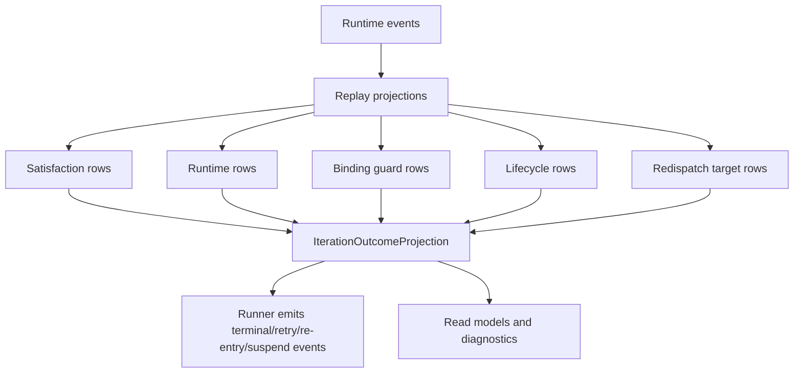
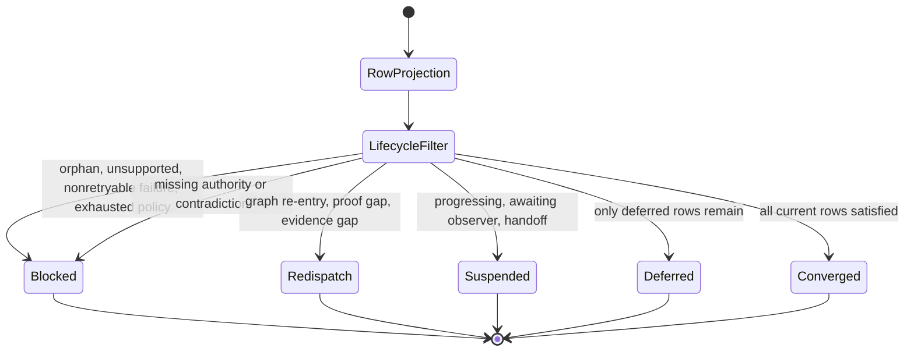

# M03 Iteration Outcome Algebra Derivation

**Status**: Active
**Date**: 2026-06-05
**Purpose**: Ratify one ABG-owned active-iteration outcome algebra that replaces
scattered retry, re-entry, closure, continuation, and fallback transition
deciders.

## Source Authority

- `specification/PRODUCT.md`
- `specification/requirements/abg/REQ-R-ABG3-ITERATION.md`
- `specification/requirements/abg/REQ-R-ABG3-PROJECTION.md`
- `specification/requirements/abg/REQ-R-ABG3-ASSURANCE.md`
- `specification/requirements/abg/REQ-R-ABG3-PAYLOAD.md`
- `specification/requirements/abg/REQ-R-ABG3-RUN.md`
- `specification/requirements/abg/REQ-R-ABG3-CORRECTION.md`
- `M03_TOTAL_ASSURANCE_PROJECTION_DERIVATION.md`
- `M03_PAYLOAD_LEDGER_EVENT_TOPOLOGY_DERIVATION.md`
- `M03_RUNTIME_CONTINUATION_TRANSITION_DERIVATION.md`
- `M03_GRAPH_SPAN_FOLDBACK_REENTRY_DERIVATION.md`
- `T-149`

## Problem

ABG already owns replay, payload admission, payload ledgers, assurance, retry,
re-entry, continuation, and terminalization. The TypeScript realization grew
separate deterministic deciders over those surfaces. That produced more than
one local answer to the same active-boundary question:

```text
what does this boundary do next?
```

The live failure this ticket addresses is a symptom of that split. Re-entry can
leave prior-attempt evidence in replay history without a first-class lifecycle
classification. Assurance can then treat superseded evidence as orphan evidence
and block a boundary that current evidence has fulfilled.

## Decision

ABG owns `IterationOutcomeProjection`.

It is the only active-boundary next-transition truth surface. It is pure and
replay-derived. It consumes typed row projections and returns one primitive
outcome:

- `terminate`
- `redispatch`
- `suspend`

Named outcomes such as close, block, retry, evaluator retry, graph re-entry,
reprice, defer, and yield are not separate primitives. They are represented as
dispositions, redispatch targets, lawful re-entry refs, reasons, or runtime rows
over the three constructors.

## Prime Rule

No new iteration state, outcome constructor, enum value, carrier family, or
branch is lawful until implementation proves it cannot be represented by:

```text
typed rows -> lifecycle filter -> priority fold -> terminate | redispatch | suspend
```

If the primitive can represent it, the primitive must represent it.

## Row Families

The fold consumes orthogonal row families:

| Row family | Source | Role |
|---|---|---|
| satisfaction rows | evaluator/assurance facts | whether current authority is satisfied, unsatisfied, or deferred |
| runtime rows | worker, evaluator, transport, liveness | whether the runtime boundary is progressing, suspended, retryable, or failed |
| binding guard rows | payload/authority/evidence projection | whether evidence has current authority binding or is orphan |
| lifecycle rows | attempt/re-entry lineage | whether evidence is active, preserved/rebased, or superseded |
| redispatch target rows | graph re-entry and policy | where redispatch is lawful |

Evaluator output contributes semantic satisfaction only. It never emits runtime
authority, lifecycle authority, events, ledgers, or outcome truth.

## Evidence Lifecycle

Evidence lifecycle is applied before the satisfaction fold:

- `active`: evidence belongs to the current attempt and current authority scope
- `preserved_rebased`: evidence was produced by an earlier attempt but remains
  bound to current authority after re-entry
- `superseded`: evidence remains replay-visible but cannot satisfy or block
  current closure

Orphan is not a lifecycle state. It is a binding guard failure: evidence has no
lawful current authority/scope binding.

## Priority Fold

The fold is worst-wins and total:

1. Normalize lifecycle.
   - discard superseded rows from satisfaction and blocking
   - keep preserved/rebased rows only when authority binding remains current
   - emit binding guard rows for evidence with no current binding
2. Hard guards select `terminate(blocked)`.
   - orphan current binding
   - unsupported state
   - non-retryable runtime/evaluator failure
   - exhausted retry policy
3. Constitutional blockers select `terminate(blocked, reEntryPoint)`.
   - missing authority -> `requirements`
   - requirement contradiction -> `requirements`
   - realization-structure contradiction -> `design_surface`
4. Runtime wait states select `suspend(...)`.
   - progressing
   - awaiting observer
   - handoff
5. Runtime-local gaps select bounded `redispatch(...)`.
   - graph re-entry frontier -> `redispatch(realization, targetVector)`
   - retryable evaluator/proof failure -> `redispatch(proof, currentVector)`
   - missing proof or wrong-stage proof -> `redispatch(proof, currentVector)`
   - missing/partial/stale evidence -> `redispatch(realization, currentVector)`
6. Deferred selects `terminate(deferred)` only when no higher row matched.
7. Converged selects `terminate(converged)` only when every active or
   preserved/rebased satisfaction row is satisfied and no higher row matched.
   A compact close-eligible flag is accepted only under the same no-current-
   unsatisfied-row condition; it cannot bypass satisfaction rows.
8. Terminal fallback refs select bounded redispatch only when no typed row above
   matched and no current active or preserved/rebased row set converges or
   defers.

## Program Flow



## State Diagram



## Pseudocode

```ts
function deriveIterationOutcomeProjection(input) {
  const rows = deriveIterationRowProjection(input);

  const normalized = normalizeLifecycle(rows);
  if (hasHardGuard(normalized)) return terminate("blocked");
  if (hasConstitutionalBlocker(normalized)) {
    return terminate("blocked", blockerReEntryPoint(normalized));
  }
  if (hasSuspendRow(normalized)) return suspend(suspendReason(normalized));
  if (hasRuntimeLocalRedispatch(normalized)) {
    return redispatch(redispatchTarget(normalized));
  }
  if (onlyDeferredRowsRemain(normalized)) return terminate("deferred");
  if (allCurrentRowsSatisfied(normalized)) return terminate("converged");
  if (hasTerminalFallback(normalized)) {
    return redispatch(fallbackTarget(normalized));
  }
  return terminate("blocked");
}
```

## Inside-Out Migration

T-149 applies Spec Method refactoring:

1. Requirement law is added first.
2. This design owns the carrier shape.
3. `iteration_state_action.ts` owns the primitive fold.
4. Existing deciders are migrated inward to rows or deleted.
5. Proof runs after old transition authority is gone.

Compatibility wrappers are not a closure strategy for the iteration-boundary
transition path.

## Boundaries

- Frontier logic stays separate: it decides which boundary is ready.
- Event admission and event calculus stay separate: they decide runtime truth.
- Iteration outcome decides what the active boundary does next.
- Downstream products may map domain findings to generic rows, but they do not
  own the fold.
- Plugins do not emit outcome truth, runtime events, ledgers, or closure.

## Proof

- Mixed rows prove explicit priority ordering.
- Re-entry with superseded evidence proves superseded rows cannot block.
- Re-entry with preserved/rebased evidence proves incremental repair can close.
- True orphan evidence proves binding guard block and diagnostic visibility.
- Runner integration proves retry, terminal, suspend, and graph re-entry events
  are emitted only after consuming `IterationOutcomeProjection`.
- Structural guard proves no local transition table remains outside the module.
