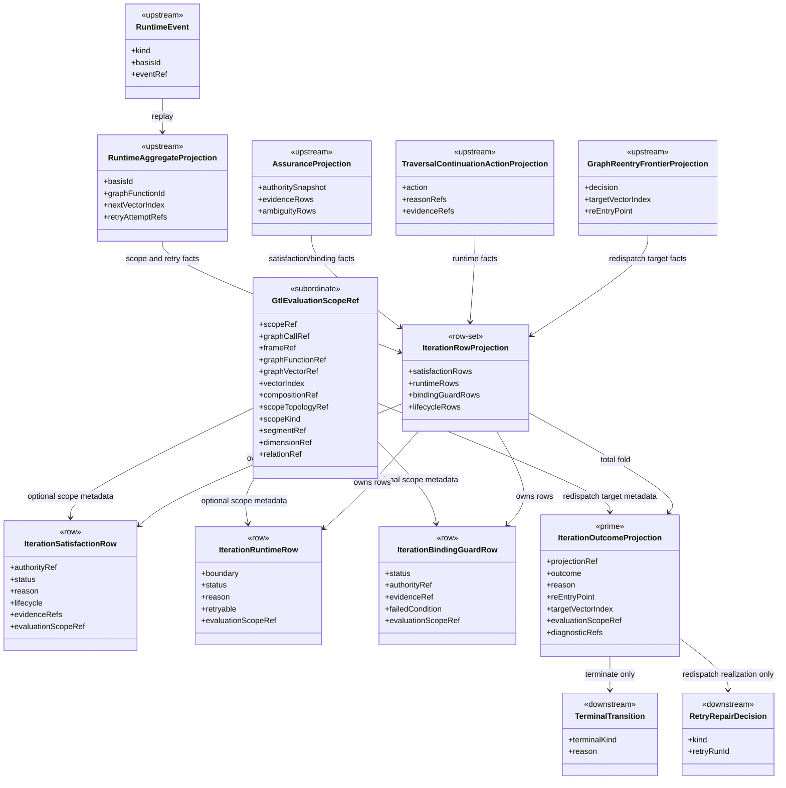
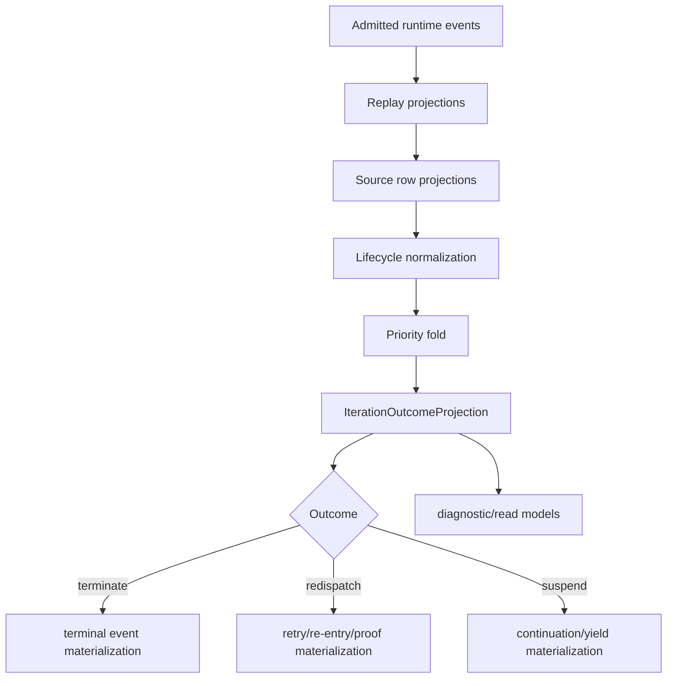
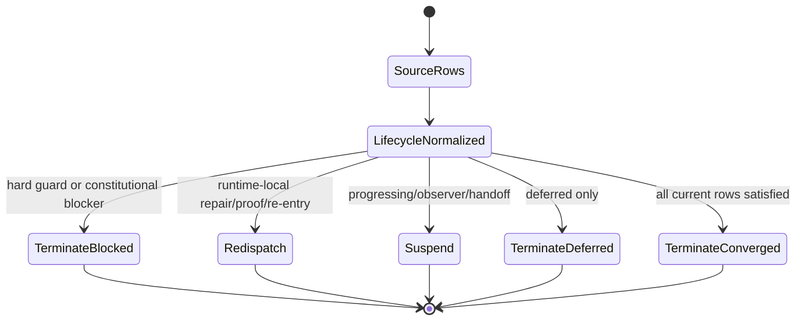

# M03 Iteration Outcome Algebra Structural Carrier Diagram

**Status**: Active
**Date**: 2026-06-05
**Derived from**:
[M03_ITERATION_STATE_ACTION_ALGEBRA_DERIVATION.md](./M03_ITERATION_STATE_ACTION_ALGEBRA_DERIVATION.md),
[M03_ITERATION_STATE_ACTION_ALGEBRA_FIRST_SLICE_IACS.md](./M03_ITERATION_STATE_ACTION_ALGEBRA_FIRST_SLICE_IACS.md)

## Diagram

## Program Flow

## State Diagram

## Carrier Notes

- `IterationOutcomeProjection` is the only prime carrier in this slice.
- Row projections are source facts. They are not transition authority.
- `GraphReentryPoint` names redispatch or constitutional re-entry surface.
- `GraphChangeClass` is provenance and never a parallel transition
  discriminator.
- `GtlEvaluationScopeRef` is optional subordinate row/target metadata for
  scoped evaluator facts inside one graph-vector boundary.
- Scoped redispatch remains the `redispatch` outcome constructor with scope
  metadata on the target, not a new outcome.
- Superseded evidence remains replay-visible but is removed before satisfaction
  or blocking.
- Orphan evidence is exposed as a binding guard failure.
