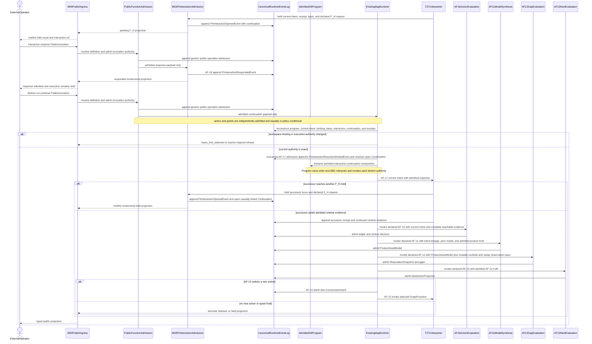
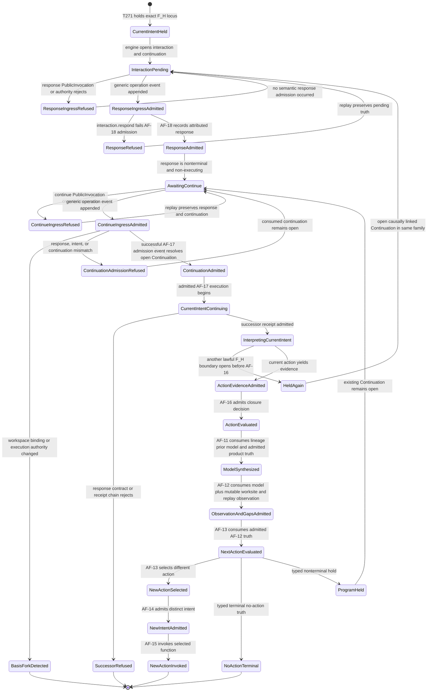

# M03-M04 F_H Runtime Continuation Behavior Design

**Status**: Accepted - reconciled to the ratified Ontology for runtime reconciliation
**Date**: 2026-07-16
**Ticket**: `T-272`
**Method authority**: `specification_methodology/specification/standards/DESIGN_MODULE_METHOD.md` section 5E
**Prime authority**: [ADR-044](./adrs/ADR-044-prime-contraction-is-a-cross-boundary-design-gate.md)
**Ontology authority**: [ABIogenesis Public Control Plane Ontology](./ABIOGENESIS_PUBLIC_CONTROL_PLANE_ONTOLOGY.md), commit `59e9dce4f47c1a2b6e7cb9ef140dbae39ea4143c`, digest `f817a7e730bec935f053138e85cb09aa6e0f693e558eaf287be502803da20ee8`
**Accepted T-270 authority**: [M03-M04 Public Catalog Invocation Authority Behavior Design](./M03_M04_PUBLIC_CATALOG_INVOCATION_AUTHORITY_BEHAVIOR_DESIGN.md), digest `71076f364d06a9725b5482ee0cdc84e64d29a4c18447a5ab4c41e1b62ba7f430`, decision `.ai-workspace/comments/codex/20260716T062747Z_DECISION_fh_accept_t270_reconciled_run_invoke_design.md`

## Boundary

This design connects one engine-held F_H C-program atom to two distinct
instances of the existing public contract family:

1. `abg.operation.interaction.respond` admits one attributed F_H response
   through `AF-18 admitHumanResponse`; and
2. a later `abg.operation.run.continue` asks the admitted GTL program and ABG
   to consume the replay-derived continuation.

Each operation is governed by its `PublicFunctionDefinition<K>`, enters as one
immutable `PublicInvocation<K>`, admits one operation-indexed
`InvocationAuthority<K>`, and emits the generic
`PublicOperationAdmittedRuntimeEvent` before AF-18 or AF-17. No operation-
specific request authority is introduced.

The two invocations are never one combined public operation. Response
admission does not continue execution, select work, or decide closure.
Continuation does not accept a caller-authored frame, cursor, intent, action,
or traversal plan. Each invocation independently admits actor attribution and
capability grants; equality across them is required only when declared policy
explicitly says so.

The active current-intent lifecycle is:

```text
run.invoke interpreted through the admitted GtlProgram
  -> T-271 F_H atom holds the current ConstructionIntent
  -> engine-derived FhInteractionOpenedEvent + replay Continuation
  -> interaction.respond PublicInvocation and generic operation admission
  -> AF-18 response admission
  -> actor-attributed FhInteractionRespondedEvent
  -> distinct run.continue PublicInvocation and generic operation admission
  -> successful AF-17 admission emits FhInteractionResumeAdmittedEvent
     and resolves the open Continuation once
  -> AF-17 continues the same ConstructionIntent
  -> successor CProgramAtomReceipt in the existing receipt family
  -> T-271 interprets the same GtlProgram and plan
  -> another F_H hold opens a linked Continuation, or evidence enters AF-16
  -> ordinary One Surface post-disposition evaluation
```

When post-disposition `AF-13 evaluateNext` selects a different action, the path
is `AF-14 admitConstructionIntent -> AF-15 invokeGraphFunction`. It is not an
`AF-17` continuation. A newer `ObservationSnapshot` or replay cursor under the
same `WorkspaceBinding` and `ExecutionBasis` reruns affected functions in this
order: `AF-11` consumes admitted intent lineage, the prior model when present,
and admitted product truth to synthesize `ProductAssetModel`; `AF-12` then
consumes that model plus mutable worksite/replay observation input to admit
`ObservationSnapshot` and gaps; `AF-13` consumes the admitted AF-12 truth to
produce `NextActionProjection`. That is ordinary progress, not a basis fork.

M04 admits and transports public requests. The admitted GTL program owns the
composition and ABG owns replay, runtime admission, continuation consumption,
event truth, and projection.

### Requirements

- `REQ-P-PUBLIC-CONTRACTS-008..010`
- `REQ-P-POLICY-023..025`, `-031..033`, and `-041..046`
- `REQ-R-ABG3-CONTINUATION-001..006` and `-011..014`
- `REQ-R-ABG3-EVENTS-002..004`, `-011`, `-021`, and `-030..031`
- `REQ-R-ABG3-PROJECTION-003`, `-006`, `-019`, and `-022..024`
- `REQ-R-ABG3-WITNESS-003`, `-006`, `-009`, and `-017`
- `REQ-R-ABG3-FN-COMP-015`, `-017`, and `-021..024`
- the ratified Ontology's `AF-11..AF-18`, interactive-continuation
  composition, and 19-operation projection
- T-256 declared F_H request, T-258 public interaction, T-267 static
  authority, accepted T-270 public invocation design digest
  `71076f364d06a9725b5482ee0cdc84e64d29a4c18447a5ab4c41e1b62ba7f430`,
  and T-271 interpreter carriers

### Explicit exclusions

- legacy `run.resume` as a public identity, alias, fallback, or default;
- five independent public `fh.*` operation identities;
- a combined response-and-continuation request;
- an operation-specific response or continuation request authority outside
  `PublicInvocation<K>`;
- a second continuation aggregate, controller, or receipt family;
- an automatic wake controller, scheduler, watcher, or session object;
- caller-authored graph call, frame, vector, C-call, cursor, plan, current
  construction intent, action selection, or continuation state;
- using `AF-17` for a newly selected action;
- treating response admission as closure or execution;
- requiring response actor/grant equality with continuation actor/grant truth
  without an explicit declared policy;
- treating a newer observation or replay cursor as an authority fork;
- continuing after an actual workspace-binding or execution-basis change
  without an exact covering reprice; and
- product-specific Consensus response semantics.

## Ontology Trace

| Design concern | Ratified Ontology authority | Required realization consequence |
|---|---|---|
| F_H response | `AF-18 admitHumanResponse`; `abg.operation.interaction.respond` | one closed response-kind family; admission emits attributed response truth only |
| current-intent continuation | `AF-17 continueExecution`; `abg.operation.run.continue` | replay consumes the existing intent and continuation; no new intent or selector |
| common public admission | `PublicFunctionDefinition<K>`, `PublicInvocation<K>`, `InvocationAuthority<K>`, EVENTS-031 | each operation traverses the same definition and admission chain and emits generic operation truth before AF-18/AF-17 |
| actor and grant scope | operation-indexed `InvocationAuthority<K>` | response and continuation independently admit actor/grant truth; equality is a declared-policy constraint only |
| new selected action | `AF-13 -> AF-14 -> AF-15` | a new action crosses ordinary intent admission and invocation, never AF-17 |
| observation freshness | Ontology invariants 25; `ProductAssetModel` and `ObservationSnapshot` lifecycle | AF-11 lineage/prior-model/product-truth synthesis -> AF-12 model plus mutable worksite/replay observation -> AF-13 admitted-gap evaluation under unchanged authority; no rebind or basis fork |
| authority fork | `WorkspaceBinding`, `ExecutionBasis`, CONTINUATION-014 | changed authority refuses before effects unless an exact covering reprice exists |
| public ingress | One Surface composition and EVENTS-031 | ingress admits/transports; the GTL program and ABG own ordering and continuation |
| hard break | accepted 19-operation projection | no `run.resume`, five `fh.*` definitions, facade, parallel register, or fallback |
| Prime boundary | interactive-continuation composition | keep generic ingress attribution distinct from internal continuation admission; add no second continuation aggregate |

## Irreducible Architectural Carrier Set

| Carrier | Authority | Role |
|---|---|---|
| `GtlProgram` | admitted GTL declaration | Owns the interactive-continuation composition and published GraphFunction membership. |
| `PublicFunctionDefinition<K>` | accepted public definition family | Governs exact response and continuation operation contracts and variants. |
| `PublicInvocation<K>` | admitted public ingress family | One immutable operation instance; response and continuation are distinct instances. |
| `InvocationAuthority<K>` | operation-indexed admission authority | Independently binds actor, grants, policy, and stable authority for each invocation. |
| `WorkspaceBinding` | immutable workspace/product binding | Conserved through response and continuation; observation never mutates it. |
| `ExecutionBasis` | M03 runtime authority | Exact current runtime authority for the held and continued intent. |
| `BasisAdmittedEvent` | canonical replay event | Records the existing execution basis once for replay re-admission. |
| `ConstructionIntent` | ABG construction-intent admission | The current intent that AF-17 alone may continue. |
| `Continuation` | run-local replay truth | The open obligation consumed by run.continue. |
| `DeclaredFhInteractionRequest` | declared F_H contract | Exact subject, response kinds, result contract, capabilities, and source carriers. |
| `CProgramAtomReceipt` | T-271 interpreter replay | Existing held and successor receipt family for the exact C-program locus. |
| `FhInteractionOpenedEvent` | canonical F_H event | Opens one interaction from the current intent and continuation. |
| `FhInteractionRespondedEvent` | canonical F_H event | Records AF-18 response admission without continuing. |
| `FhInteractionResumeAdmittedEvent` | canonical F_H event | Records successful AF-17 continuation admission and resolves the open Continuation at that same transition after distinct run.continue ingress and exact replay checks. |
| `FhInteractionProjection` | replay-derived public projection | Exposes pending/responded status and opaque refs without new authority. |
| `PublicOperationAdmittedRuntimeEvent` | generic public-operation event | Attributes interaction.respond and run.continue ingress without a route-specific controller. |
| `ProductAssetModel` | admitted AF-11 model | The synthesized model consumed by AF-12 before observation/gap admission. |
| `ObservationSnapshot` | admitted immutable observation | Carries fresher worksite/replay truth under unchanged authority. |
| `NextActionProjection` | admitted AF-13 result | Distinguishes current-intent continuation from a newly selected action. |

Subordinate values are response and continuation request payloads, response
value and evidence, actor and capability provenance, replay cursor, basis replay seed, opaque
interaction and continuation refs, receipt predecessor/successor refs, and
resumed C-call attempt coordinate. None is independently selectable authority.

`PublicOperationAdmittedRuntimeEvent` and
`FhInteractionResumeAdmittedEvent` are not duplicate authorities. The former
attests public ingress under EVENTS-031. The latter records that ABG admitted
the response, current intent, and replay continuation for AF-17 after exact
basis checks. Neither replaces the run-local `Continuation` aggregate.
The F_H continuation-admitted event resolves the open continuation once at
successful AF-17 admission. If the continued action holds again, the later
interaction-opened event opens a
causally linked continuation in the same existing aggregate family. No later
transition resolves the already consumed continuation a second time.

## Prime Contraction Review

```json prime-contraction
{
  "schemaVersion": 1,
  "iacs": [
    "GtlProgram",
    "PublicFunctionDefinition<K>",
    "PublicInvocation<K>",
    "InvocationAuthority<K>",
    "WorkspaceBinding",
    "ExecutionBasis",
    "BasisAdmittedEvent",
    "ConstructionIntent",
    "Continuation",
    "DeclaredFhInteractionRequest",
    "CProgramAtomReceipt",
    "FhInteractionOpenedEvent",
    "FhInteractionRespondedEvent",
    "FhInteractionResumeAdmittedEvent",
    "FhInteractionProjection",
    "PublicOperationAdmittedRuntimeEvent",
    "ProductAssetModel",
    "ObservationSnapshot",
    "NextActionProjection"
  ],
  "authoritativeCarriers": [
    "GtlProgram",
    "PublicFunctionDefinition<K>",
    "PublicInvocation<K>",
    "InvocationAuthority<K>",
    "WorkspaceBinding",
    "ExecutionBasis",
    "BasisAdmittedEvent",
    "ConstructionIntent",
    "Continuation",
    "DeclaredFhInteractionRequest",
    "CProgramAtomReceipt",
    "FhInteractionOpenedEvent",
    "FhInteractionRespondedEvent",
    "FhInteractionResumeAdmittedEvent",
    "PublicOperationAdmittedRuntimeEvent",
    "ProductAssetModel",
    "ObservationSnapshot",
    "NextActionProjection"
  ],
  "subordinatePayloads": [
    "response and continuation request payloads",
    "F_H response value and evidence",
    "actor and capability provenance",
    "execution-basis replay seed",
    "opaque interaction and continuation refs",
    "receipt predecessor and successor refs",
    "resumed C-call attempt coordinate",
    "public interaction and runtime projections"
  ],
  "promotionTests": [
    {"candidate": "GtlProgram", "verdict": "promote", "reason": "The admitted program independently owns the composition interpreted by ABG."},
    {"candidate": "PublicFunctionDefinition<K>", "verdict": "promote", "reason": "The published definition is independently pattern-matched by catalog, schema, SDK, CLI, and ingress."},
    {"candidate": "PublicInvocation<K>", "verdict": "promote", "reason": "Each immutable public invocation is independently admitted and produces one closed outcome."},
    {"candidate": "InvocationAuthority<K>", "verdict": "promote", "reason": "Each operation independently admits its exact actor, grants, policy, and stable authority set."},
    {"candidate": "WorkspaceBinding", "verdict": "promote", "reason": "The immutable binding independently governs workspace and installed-product authority."},
    {"candidate": "ExecutionBasis", "verdict": "promote", "reason": "The held and continued runtime independently pattern-match exact execution authority."},
    {"candidate": "BasisAdmittedEvent", "verdict": "promote", "reason": "Replay independently reconstructs the execution basis from this canonical event."},
    {"candidate": "ConstructionIntent", "verdict": "promote", "reason": "AF-17 must pattern-match the current intent and AF-14 must create a different one."},
    {"candidate": "Continuation", "verdict": "promote", "reason": "The run-local open obligation has an independent replay lifecycle."},
    {"candidate": "DeclaredFhInteractionRequest", "verdict": "promote", "reason": "Response admission independently matches the declared contract and capability basis."},
    {"candidate": "CProgramAtomReceipt", "verdict": "promote", "reason": "The structural interpreter directly pattern-matches held and successor receipt truth."},
    {"candidate": "FhInteractionOpenedEvent", "verdict": "promote", "reason": "The event independently opens addressable interaction truth from runtime authority."},
    {"candidate": "FhInteractionRespondedEvent", "verdict": "promote", "reason": "The event independently records attributed AF-18 response admission."},
    {"candidate": "FhInteractionResumeAdmittedEvent", "verdict": "promote", "reason": "The event independently records successful AF-17 admission and resolves the open continuation once at that same transition after exact replay checks."},
    {"candidate": "FhInteractionProjection", "verdict": "promote", "reason": "The public replay projection crosses the M03-M04 boundary and is directly pattern-matched."},
    {"candidate": "PublicOperationAdmittedRuntimeEvent", "verdict": "promote", "reason": "One generic event independently attributes every public-operation admission."},
    {"candidate": "ProductAssetModel", "verdict": "promote", "reason": "AF-11 produces an independently versioned model that AF-12 directly pattern-matches."},
    {"candidate": "ObservationSnapshot", "verdict": "promote", "reason": "Fresh mutable truth must vary independently of immutable authority."},
    {"candidate": "NextActionProjection", "verdict": "promote", "reason": "The admitted AF-13 result independently distinguishes no action from a newly selected action."}
  ],
  "recurrenceReview": {"status": "consume_existing", "ref": "PC-007"},
  "authoritySourceCount": {"before": 18, "after": 18},
  "authoringSourceCount": {"before": 18, "after": 18},
  "disposition": "consume_existing",
  "ownerTicket": "T-272"
}
```

The design consumes eighteen existing authoritative carriers plus one
downstream interaction projection. The authoritative-carrier list and source
counts therefore both equal eighteen; `FhInteractionProjection` remains
downstream. No controller, aggregate, selector, request family, or authored
authority is added. Public identity contraction does not merge ingress,
response admission, continuation admission, or replay continuation.

## Domain Model

```mermaid
classDiagram
  direction LR
  class ExternalOperator {
    <<effect-edge>>
  }
  class GtlProgram {
    <<prime>>
    <<authoritative>>
    +programRef
    +programDigest
  }
  class PublicFunctionDefinition {
    <<prime>>
    <<authoritative>>
    +operationId
    +variantDomain
  }
  class PublicInvocation {
    <<prime>>
    <<authoritative>>
    +invocationRef
    +operationId
  }
  class InvocationAuthority {
    <<prime>>
    <<authoritative>>
    +actorRef
    +grantSetDigest
  }
  class WorkspaceBinding {
    <<prime>>
    <<authoritative>>
    +bindingRef
    +bindingDigest
  }
  class ExecutionBasis {
    <<prime>>
    <<authoritative>>
    +basisRef
    +basisDigest
  }
  class BasisAdmittedEvent {
    <<prime>>
    <<authoritative>>
    +basisRef
  }
  class ConstructionIntent {
    <<prime>>
    <<authoritative>>
    +intentRef
    +selectedActionRef
  }
  class Continuation {
    <<prime>>
    <<authoritative>>
    +continuationRef
    +runRef
  }
  class DeclaredFhInteractionRequest {
    <<prime>>
    <<authoritative>>
    +requestRef
    +resultContractRef
  }
  class CProgramAtomReceipt {
    <<prime>>
    <<authoritative>>
    +status
    +predecessorReceiptRef
  }
  class FhInteractionOpenedEvent {
    <<prime>>
    <<authoritative>>
    +interactionRef
    +continuationRef
  }
  class FhInteractionRespondedEvent {
    <<prime>>
    <<authoritative>>
    +responseRef
    +responseKind
  }
  class FhInteractionResumeAdmittedEvent {
    <<prime>>
    <<authoritative>>
    +resumeRef
    +continuationRef
  }
  class FhInteractionProjection {
    <<prime>>
    <<downstream>>
    +status
    +replayRefs
  }
  class PublicOperationAdmittedRuntimeEvent {
    <<prime>>
    <<authoritative>>
    +operationId
    +invocationRef
  }
  class WorksiteReplayInput {
    <<subordinate>>
    +worksiteDigest
    +replayCursor
  }
  class ProductAssetModel {
    <<prime>>
    <<authoritative>>
    +modelRef
    +modelDigest
  }
  class ObservationSnapshot {
    <<prime>>
    <<authoritative>>
    +snapshotRef
    +replayCursor
  }
  class NextActionProjection {
    <<prime>>
    <<authoritative>>
    +projectionRef
    +selectedActionRef
  }
  class T271Interpreter {
    <<authoritative>>
  }

  ExternalOperator --> PublicInvocation : submits two distinct instances
  PublicFunctionDefinition --> PublicInvocation : governs exact operation
  PublicInvocation --> InvocationAuthority : requires operation indexed authority
  PublicInvocation --> PublicOperationAdmittedRuntimeEvent : admits before semantic AF
  GtlProgram --> ConstructionIntent : owns current intent
  WorkspaceBinding --> ConstructionIntent : constrains
  ExecutionBasis --> BasisAdmittedEvent : records once
  ExecutionBasis --> ConstructionIntent : constrains
  ConstructionIntent --> Continuation : opens run-local obligation
  DeclaredFhInteractionRequest --> FhInteractionOpenedEvent : supplies response contract
  CProgramAtomReceipt --> FhInteractionOpenedEvent : supplies held locus
  FhInteractionOpenedEvent --> Continuation : opens causally linked obligation
  FhInteractionOpenedEvent --> FhInteractionProjection : replay projects
  FhInteractionRespondedEvent --> FhInteractionProjection : replay projects
  PublicOperationAdmittedRuntimeEvent --> FhInteractionRespondedEvent : interaction respond precedes AF-18
  PublicOperationAdmittedRuntimeEvent --> FhInteractionResumeAdmittedEvent : run continue precedes AF-17
  FhInteractionRespondedEvent --> Continuation : supplies admitted input
  Continuation --> FhInteractionResumeAdmittedEvent : supplies replay obligation
  FhInteractionResumeAdmittedEvent --> CProgramAtomReceipt : authorizes current-intent successor
  FhInteractionResumeAdmittedEvent --> Continuation : resolves open obligation once at AF-17 admission
  CProgramAtomReceipt --> T271Interpreter : AF-17 continues
  ProductAssetModel --> ProductAssetModel : AF-11 versions from lineage prior model and admitted product truth
  ProductAssetModel --> ObservationSnapshot : AF-12 consumes model
  WorksiteReplayInput --> ObservationSnapshot : AF-12 adds mutable observation input
  ObservationSnapshot --> NextActionProjection : AF-13 evaluates next
  NextActionProjection --> ConstructionIntent : AF-14 only when new action
  ConstructionIntent --> T271Interpreter : AF-15 invokes new action
```



## Execution Sequence



## Lifecycle State Model



## Lifecycle And Authority Derivation

| Subject | Create/admit | Continue/transition | Authority conservation |
|---|---|---|---|
| `PublicInvocation<K>` | owning definition admits one operation instance and its own InvocationAuthority | response and continuation are separate immutable instances and outcomes | common family and generic operation event; no operation-specific request authority |
| `FhInteraction` | engine opens from current intent, held receipt, request, and replay continuation | AF-18 admits one response; run.continue later admits one internal continuation event; projection remains nonterminal until AF-17 runs | same program, binding, basis, run, intent, interaction, and continuation; operation actors/grants remain independently admitted unless policy joins them |
| `ConstructionIntent` | AF-14 admits only from a selected `NextActionProjection` | AF-17 continues an existing intent only | current intent cannot be relabeled; a new action creates a new intent |
| `Continuation` | ABG opens from unresolved run-local event truth | successful AF-17 admission emits FhInteractionResumeAdmittedEvent and resolves the open continuation once; repeated hold opens a causally linked member through FhInteractionOpenedEvent | caller supplies opaque ref only; replay owns state; no second aggregate or duplicate resolution transition |
| `ProductAssetModel` | AF-11 synthesizes from admitted intent lineage, the prior model when present, and admitted product truth | later AF-12 directly consumes it | immutable admitted model version under unchanged workspace/execution authority; mutable observation is excluded from AF-11 |
| `ObservationSnapshot` | AF-12 admits immutable observed truth against the AF-11 model and current worksite/replay input | a newer snapshot replaces dependent projections, not authority | workspace binding and execution basis remain unchanged |
| `NextActionProjection` | AF-13 admits one total selection result | new selection crosses AF-14/AF-15 | projection cannot continue the prior intent itself |
| `CProgramAtomReceipt` | T-271 admits held/completed receipts | AF-17 yields one exact successor in the same family | predecessor, plan, locus, cursor, input, contract, and C-call lineage remain exact |

| Function or public route | Input authority | Output/effect | Forbidden authority |
|---|---|---|---|
| common public admission | PublicFunctionDefinition, PublicInvocation, operation-indexed InvocationAuthority | generic PublicOperationAdmittedRuntimeEvent before owning semantic function | semantic AF work, ordering, cursor, intent, or action choice |
| `interaction.respond` / AF-18 | admitted response invocation, pending interaction, its actor/grants, response contract, current basis | attributed response event and projection | continuation, action selection, closure, new intent, or inferred actor equality |
| `run.continue` ingress | admitted continuation invocation, run/continuation refs, its actor/grants, optional declared input | transport to ABG after generic public-operation admission | orchestration, private cursor, intent/action choice, or inherited response grants |
| AF-17 `continueExecution` | current intent, replay continuation, admitted input, unchanged binding and basis | current-intent interpreter continuation | new action or new construction intent |
| AF-11..AF-13 refresh | AF-11 intent lineage, prior model, and admitted product truth; AF-12 model plus mutable worksite/replay observation; AF-13 admitted AF-12 truth | AF-11 model, then AF-12 snapshot/gaps, then AF-13 next-action projection | mutable observation entering AF-11, reordered evaluation, workspace rebind, or basis-fork inference |
| AF-14/AF-15 new action | fresh selected action and exact authority | new construction intent then graph invocation | relabeling as prior continuation |
| AF-16 `evaluateAction` | current intent plus complete reachable evidence | ledger and closure decision | response-only or single-evidence closure |

## Legacy-To-Target Function Derivation

| Legacy label/carrier | Target derivation | Disposition |
|---|---|---|
| `fh.select`, `fh.approve`, `fh.reject`, `fh.assess`, `fh.answer-escalation` | closed variants of `abg.operation.interaction.respond` through AF-18 | retire five public definitions; no facade or fallback |
| `run.resume` | `abg.operation.run.continue` over replay `Continuation` | retire identity and defaults; no alias |
| combined response/resume request | two distinct `PublicInvocation<K>` instances: interaction.respond then run.continue | split by lifecycle and authority; no new request family |
| `FhInteractionResumeAdmittedEvent` | internal ABG event derived only after run.continue ingress and exact replay checks | retain as non-public continuation-admission truth; never a public operation or second Continuation |
| current-intent response consumption | AF-17 | retain exact existing intent |
| post-disposition new action | AF-13 -> AF-14 -> AF-15 | never AF-17 |
| newer observation/replay | AF-11 refreshes from stable admitted inputs, AF-12 alone adds mutable observation, then AF-13 evaluates admitted gap truth | ordinary progress; never basis fork |

## Cross-View Axiom Evaluation

| Axiom | Authority | Domain evidence | Sequence evidence | State evidence | Native enforcement | Admission/compiler enforcement | Verdict | Gap owner |
|---|---|---|---|---|---|---|---|---|
| response and continuation are distinct | POLICY-031..033 | two PublicInvocation instances of one family | response returns before run.continue | ResponseAdmitted enters AwaitingContinue | closed operation variants | definition-indexed public admission | pass | none |
| common admission precedes semantic AF | PUBLIC-CONTRACTS-008..010; EVENTS-031 | definition, invocation, authority, and generic event are explicit | generic event precedes AF-18 and AF-17 | ingress-admitted states precede semantic states | shared nominal public families | operation definition and invocation-authority admission | pass | none |
| actor and grants are independently scoped | POLICY-031..032; InvocationAuthority | each invocation owns one operation-indexed authority | both invocations admit authority separately | no state transition copies actor or grants | separate immutable authority values | equality only through declared policy predicate | pass | none |
| current intent is conserved | CONTINUATION-011; AF-17 | ConstructionIntent links to Continuation and receipt | AF-17 receives current intent only | CurrentIntentContinuing has no new-intent edge | nominal current-intent carrier | replay ref/digest equality | pass | none |
| new action cannot use AF-17 | CONTINUATION-012; AF-14/15 | NextActionProjection creates distinct intent | new branch crosses AF-14 then AF-15 | NewActionSelected cannot reach CurrentIntentContinuing | distinct constructor APIs | selected-action and intent admission | pass | none |
| observation freshness is ordered and not authority change | BINDING-016..017; CONTINUATION-013 | ProductAssetModel excludes mutable worksite input; WorksiteReplayInput enters ObservationSnapshot only; NextActionProjection follows | ABG invokes distinct AF-11 over lineage/prior-model/product truth, AF-12 over model plus mutable observation, then AF-13 over admitted AF-12 truth | ActionEvaluated reaches ModelSynthesized then ObservationAndGapsAdmitted then NextActionEvaluated | separate nominal carriers | stage input/output admission and basis comparison exclude observation fields | pass | none |
| actual authority fork fails before effects | WITNESS-017; CONTINUATION-014 | immutable binding and basis are explicit | changed-authority branch returns refusal | BasisForkDetected is terminal | closed basis identity fields | exact covering-reprice admission | pass | none |
| public ingress owns no orchestration | EVENTS-031; FPC-001 | common invocation and generic event have no program cursor | ingress hands admitted invocation to AF-18 or ABG | no public-ingress controller state | PublicInvocation omits private carriers | program membership and ABG authority admission | pass | none |
| response is not closure | POLICY-032; ASSURANCE-033 | response event is distinct from receipt and decision | AF-16 occurs only after continued evidence | ResponseAdmitted is nonterminal | closed event variants | selected-contract and evidence admission | pass | none |
| ingress and continuation admission remain distinct | EVENTS-031; CONTINUATION-011 | generic ingress event, internal F_H admission event, and Continuation have separate roles | run.continue ingress precedes exact AF-17 admission | AwaitingContinue precedes CurrentIntentContinuing | distinct closed event types | exact response, intent, continuation, and basis joins | pass | none |
| consumed continuation has explicit lifecycle truth | CONTINUATION-004..005; EVENTS-011 | F_H continuation event targets existing Continuation | successful AF-17 admission emits the event and resolves the open obligation once | ContinuationAdmitted is the single resolution transition before interpretation branches to a new hold or evidence | existing F_H event and Continuation types | causal predecessor and disposition admission | pass | none |
| repeated F_H holds are nonterminal | POLICY-033; CONTINUATION-005 | opened event creates another Continuation in same family | later hold returns to interaction admission | HeldAgain loops to InteractionPending | no terminal held union variant | continuation causal-link admission | pass | none |
| hard break is exact | PUBLIC-CONTRACTS-008 | only two target public identities appear | no legacy public route | no compatibility state | closed operation definition union | catalog and publication parity gates | pass | none |

## Proof Contract

Implementation acceptance requires:

1. the public definition family publishes `interaction.respond` and
   `run.continue` and publishes no `run.resume` or five independent `fh.*`
   identities, aliases, defaults, or fallbacks;
2. each operation consumes the existing `PublicFunctionDefinition<K>`, a
   distinct `PublicInvocation<K>`, and an independently admitted
   `InvocationAuthority<K>`, then emits `PublicOperationAdmittedRuntimeEvent`
   before AF-18 or AF-17;
3. response and continuation actor/grant admission is independently proven,
   with cross-operation equality enforced only by an explicit declared policy;
4. a real T-270 engine run opens one F_H interaction without a caller-seeded
   runtime locus;
5. `interaction.respond` admits one response and returns a nonterminal
   projection without invoking AF-17 or the interpreter;
6. a later `run.continue` conserves the same program, current intent, workspace
   binding, execution basis, interaction, continuation, graph call, plan,
   locus, and receipt lineage;
7. the current-intent path uses AF-17, while a fresh selected action is proven
   to cross AF-14 then AF-15 and cannot enter AF-17;
8. AF-11 consumes admitted intent lineage, the prior model when present, and
   admitted product truth; AF-12 alone adds fresher worksite/replay observation
   input to the admitted model; AF-13 consumes the admitted AF-12 truth; a
   changed authority basis refuses before effects;
9. response value admission occurs against the selected result contract before
   successor receipt creation;
10. replay after restart is idempotent and rejects wrong interaction, response,
    operation actor/grant, continuation, intent, binding, basis, contract,
    receipt, or reprice according to each operation's declared policy;
11. the internal continuation-admitted event is emitted only from distinct
   run.continue ingress after exact replay admission, and no second
   continuation, receipt, or controller family exists;
12. successful AF-17 admission emits the F_H continuation-admitted event and
    resolves the open Continuation once at that transition; a second lawful F_H
    hold opens a causally linked Continuation in the same family while remaining
    nonterminal;
13. the unchanged T-252 Consensus body uses only the generic path; and
14. focused, semantic, GTL, packed, publication, Prime, governance, and design
    gates are green from one exact tree.

## Migration And Stop Conditions

- remove legacy public operation definitions and generated artifacts by hard
  break; do not retain compatibility adapters;
- preserve the existing `GtlProgram`, `ConstructionIntent`,
  `WorkspaceBinding`, `ExecutionBasis`, `Continuation`, interaction, and
  receipt families;
- consume the existing PublicFunctionDefinition, PublicInvocation,
  InvocationAuthority, and generic public-operation event families; no
  operation-specific request family is permitted;
- retain generic public-operation ingress attribution and internal successful
  continuation admission as separate replay facts over one Continuation;
- reject mixed legacy/current operation or event truth before effects;
- preserve the accepted T-270 public invocation boundary exactly: ingress admits
  and transports, the admitted program owns composition order, and ABG
  interprets it through distinct semantic authorities;
- stop if implementation would require a new public operation, session
  controller, request family, action selector, intent family, continuation
  family, basis family, or compatibility facade;
- stop and emit a typed design/compiler gap if AF-17 cannot be constrained to
  the current intent or AF-14/AF-15 cannot express the new-action path; and
- stop if any observation or replay freshness field enters `WorkspaceBinding`
  or `ExecutionBasis` identity.

The independently accepted T-270 design is consumed at digest
`71076f364d06a9725b5482ee0cdc84e64d29a4c18447a5ab4c41e1b62ba7f430`.
Runtime reconciliation must not begin until F_H explicitly accepts this T-272
design against that exact dependency.

## Design Verdict

`accepted_for_runtime_reconciliation` on the ratified Ontology basis. The
existing dirty runtime wave remains preserved but provisional and does not prove
this target. Runtime changes are authorized only within this accepted boundary
and still require independent closure review.
