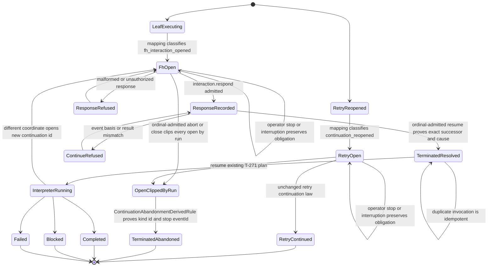

# M03-M04 F_H Runtime Continuation Behavior Design

> **T-283 authority disposition (2026-07-20):**
> `invalidated_for_5_0_implementation_by_upstream_intent_reprice`. This file is
> retained as historical and current-state evidence only. Prior acceptance
> records its former basis; it does not authorize design, code, proof, Product
> scope, or closure under the T-283 candidate. Reusable local contracts must be
> re-derived under the accepted direct-GTL replacement design after T-283
> closes.

**Prior status**: Candidate - repaired event-basis and lifecycle design pending independent F_H review
**Date**: 2026-07-18
**Ticket**: `T-272`
**Change class**: `design_reframe`
**Method authority**: `specification_methodology/specification/standards/DESIGN_MODULE_METHOD.md`
**Prime authority**: [ADR-044](./adrs/ADR-044-prime-contraction-is-a-cross-boundary-design-gate.md)
**Product authority**: `REQ-P-CONSENSUS-008..018`, `REQ-R-ABG3-CONTINUATION`, `REQ-R-ABG3-EVENTS`, and the accepted 19-operation One Surface
**Prerequisite design**: [M03-M04 Public Catalog Invocation Authority Behavior Design](./M03_M04_PUBLIC_CATALOG_INVOCATION_AUTHORITY_BEHAVIOR_DESIGN.md), including the pending T-270 contracts-owned held-execution checkpoint basis

## Boundary

This design resumes one held `F_H` leaf in the existing T-271 complete-C
interpreter. It does not restart a graph, select another action, rebuild a
traversal, or create a feature controller.

The public lifecycle has two distinct operations:

1. `abg.operation.interaction.respond` admits one actor-attributed response
   against the interaction's declared result contract and records it. It does
   not execute the response.
2. `abg.operation.run.continue` reconstructs the exact held authority and
   admitted values from replay, replaces the held receipt at the same T-271
   coordinate with one schema-admitted result receipt, and resumes the existing
   interpreter from that coordinate. Reconstruction cannot begin until replay
   has returned and verified the exact `FhInteractionOpenedEvent` projection.

The exact conserved coordinate is:

```text
execution basis
+ graph call
+ frame
+ vector index
+ compiled C plan ref/digest
+ leaf node ref/digest
+ cursor ref
+ C-call ref
+ input payload ref
+ input lineage ref
+ task ordinal
+ retry attempt/path
+ held receipt ref/digest
```

Any change to one member refuses before replacement or interpretation. A lawful
post-action selection is a different One Surface transition through ordinary
intent admission and `run.invoke`; it is outside this continuation.

The admitted GTL program still owns graph order and recursion. ABG owns the held
receipt, interaction events, response admission, run-local continuation,
same-coordinate replacement, interpreter re-entry, replay, and projection.

## Canonical Consensus Correction

The canonical Consensus body has two `F_H` leaves:

- `graph-vector://abg/consensus/fh-initial`; and
- `graph-vector://abg/consensus/fh-post-submitter`.

Both leaves have `ConsensusRoundDisposition` as their declared target and
selected result contract. `FhPendingInteraction` is not a GTL node, graph
target, result, or foldback value. Pending/responded state is the existing ABG
interaction event/projection truth while the leaf receipt remains held.

T-275 supplies the declared interaction subject, policy basis, allowed response
shape, and `ConsensusRoundDisposition` result-contract binding through the
existing `FhInteractionBinding`. The accepted T-252 source/key family and later
T-274B native-definition delivery own the graph-private schema identities and
definitions. T-275 supplies neither those schema authorities nor an
`interactionRef`. ABG derives the interaction identity from the execution
basis, graph call, frame, vector, C-call, held receipt, and declared request
digest.

The bounded-round recurse law is exhaustive:

| Admitted `ConsensusRoundDisposition.outcome` | Recurse disposition |
|---|---|
| `closed_done` | terminate |
| `escalate_fh` | terminate after the held F_H result is admitted |
| `recurse_next_round` | apply the declared next-round foldback and recurse |

No other value is admissible. Foldback is impossible for `closed_done` and
`escalate_fh`; termination is impossible for `recurse_next_round`. An open F_H
interaction is not `escalate_fh`: the latter exists only after an admitted
`ConsensusRoundDisposition` replaces the held receipt.

## Contracts-Owned Held-Execution Event Basis

T-270 supplies the one canonical `FhHeldExecutionCheckpointBasis`: a
dependency-leaf, immutable, invocation-local subordinate value in the M03
contracts layer. T-272 imports and consumes that exact type; it does not copy,
redeclare, narrow, or widen its fields. The owning T-270 design must carry the
complete same-locus evidence needed here, including the exact execution,
graph, frame, plan, node, cursor, C-call, input payload and lineage, retry, held
receipt, and ordered admitted-value environment facts. Run identity remains on
the enclosing existing F_H lifecycle event rather than becoming duplicated
checkpoint content.

The canonical value is defined with primitive readonly fields and
`IJsonValue`. It imports no runner, declared-execution-context, public-ingress,
Consensus, or product-specific type. Rows are frozen, ordered by admitted
ordinal, unique by ordinal and carrier identity, and contain the canonical
I-JSON body that was actually admitted. Refs without bodies are insufficient.

The value has no `checkpointRef`, `checkpointDigest`, or independent
lifecycle. Its existing value-environment digest and other plan, node, cursor,
carrier, admission, and receipt digests remain constituent authority evidence;
none is a checkpoint identity or seal. The existing
`FhInteractionOpenedEvent` embeds the full basis, and the event's existing
`interactionBasisDigest` is the single checkpoint seal over the declared F_H
request, the exact held coordinate, and every checkpoint row. The canonical
event ref is the only replay identity.

An upper T-270 adapter may prove exact equality between internal runtime
carriers and this contracts-owned value while opening the interaction. The
adapter then disappears: it cannot be serialized, replayed, or accepted as a
continuation input. `run.continue` first reads the exact opened-event
projection, validates canonical I-JSON, row ordering, all constituent digests,
and recomputes the one `interactionBasisDigest`. Only then may it reconstruct
the value environment and compare it to the response event and current
execution basis. There is no checkpoint store, lookup callback, ref-to-body
inference, new event family, or alternate reconstruction path. General or
non-F_H value rehydration remains a typed T-270 gap.

## Lifecycle And Event Calculus Law

The existing run-local `Continuation` aggregate and F_H event family are
extended; no route-specific aggregate or event family is added. Each F_H
lifecycle event names `continuationId`, `continuationKind: "fh_interaction"`,
`runId`, and `causedByEventRef`. `continuationId` is the sole aggregate-member
identity. Any public `continuationRef` is its opaque projection, not another
authored identity.

| Existing carrier | Bounded role |
|---|---|
| `FhInteractionOpenedEvent` | records the exact held coordinate and embedded checkpoint basis; names the continuation identity/kind/run/cause |
| `FhInteractionRespondedEvent` | records the schema-admitted actor response without changing continuation state or running the interpreter |
| `FhInteractionResumeAdmittedEvent` | names the same continuation identity/kind/run/cause, replaced held receipt ref/digest, and successor receipt ref/digest |
| `RunStoppedEvent` | for `operator_abort` or `campaign_close`, abandons every still-open continuation in that run; stop/interruption leaves it open |
| `Continuation` | singular generic run-local replay aggregate; this slice derives `open`, `terminated(resolved)`, and `terminated(abandoned)` truth |
| `CProgramAtomReceipt` | existing T-271 receipt family; held predecessor and admitted successor share the exact coordinate and input lineage |
| `FhInteractionProjection` | derived pending/responded/resolved read model; never result or execution authority |

The current `continuation_terminated` and `continuation_reopened` events cannot
lawfully carry this transition: they require `causedByRetryRunId`, hard-code
`reason: retry_repair`, and describe termination/reopening across retry repair.
F_H continuation remains in the same run and is therefore expressed by Event
Calculus effects declared for the existing F_H and run-lifecycle events. The
retry events remain unchanged; the generic abandonment algorithm consumes the
`continuation_open` effect already emitted by `continuation_reopened`.

| Admitted event | Preconditions | Declared Event Calculus effects |
|---|---|---|
| `fh_interaction_opened` | exact held receipt and checkpoint basis admitted; id/kind/run/cause present | initiates `continuation_open(id, run)` |
| `fh_interaction_responded` | one open member and matching request/response basis | no continuation fluent change |
| `fh_interaction_resume_admitted` | open member, admitted response, verified opened-event basis, and exact successor receipt | terminates `continuation_open(id, run)` and initiates `continuation_terminated(id, run, resolved)` |
| `run_stopped(operator_abort | campaign_close)` | named run exists | clips `continuation_open` by exact run; it initiates no per-member terminal fluent because the event authors no continuation ids |
| `run_stopped(operator_stop | external_interruption)` | named run exists | no continuation fluent change; the obligation remains open |

The calculus retains the existing `continuation_open` and
`continuation_terminated` fluent names. `resolved`, `superseded`, and
`abandoned` remain the closed generic terminal-status vocabulary, not three new
fluent families. This slice emits only `resolved` and `abandoned`. Replay
rejects an untyped termination.

One subordinate `RuntimeDerivedFluentRule` algorithm,
`runtime-derived-fluent-rule://abg/continuation-abandonment-from-effect-history`,
lives inside the existing Event Calculus authority and closes abandonment for
every fluent clipped by the run-stop axiom. It is not an independent semantic
authority. Before Event Calculus runs, canonical replay is validated and
ordered by `sortReplayByAdmissionOrdinalFailClosed`. Missing or colliding
admission ordinals refuse before an effect row exists. The rule then processes
the mechanically ordered `RuntimeEventCalculusEffectRow` sequence as a
deterministic fold:

This ordering is not a caller promise. The single
`deriveRuntimeEventCalculusProjection` replay entry first calls
`assertCanonicalRuntimeEventSequence`, then
`sortReplayByAdmissionOrdinalFailClosed`, and only then constructs effect rows
and invokes derived rules. Every direct and projection consumer therefore sees
the same collision-free ordinal order.

1. each row that initiates `continuation_open` must belong to the one closed
   event-kind mapping and contributes the exact fluent it initiated;
2. each later terminal effect removes its exact continuation id from the
   unresolved set;
3. a qualifying `run_stopped` row selects the still-unresolved opens whose
   `runId` equals the stopped run and derives one existing
   `continuation_terminated` fluent per selected id, with terminal status
   `abandoned` and cause equal to that canonical `run_stopped.eventId`; and
4. the fold removes those ids before examining later rows, so no later stop or
   replay pass can abandon them twice.

The closed mapping is:

| Open event kind | Continuation kind |
|---|---|
| `fh_interaction_opened` | `fh_interaction` |
| `continuation_reopened` | `retry_repair` |

The rule requires canonical effect-row source events and refuses if an open
effect's event kind is absent from the mapping, if the opened/reopened row lacks
continuation id/run/cause truth required by its kind, if the stop lacks a
canonical event id, or if one id has conflicting open or terminal history. It
does not change retry events, extend `RuntimeEventCalculusEffectRow`, add ids to
`run_stopped`, or inspect public ingress. The existing
`RuntimeDerivedFluentRule` receives all strictly ordered effect rows after every
admitted event, so no pre-clip hold snapshot is required.

Each derived physical fluent uses the existing carrier fields:
`name = continuation_terminated`, `scope = continuation`, the exact basis,
graph-call, frame, run, vector, edge, and continuation id copied from the open
fluent, and `ref = run_stopped.eventId` as cause. The direct resolved axiom uses
the corresponding resume event id as `ref`. Terminal status remains a closed
projection discriminator proven from which admitted rule/effect produced the
terminated fluent; no status is parsed from a free-form ref.

The continuation lifecycle projection folds the same rows and emits exact
`{ continuationId, continuationKind, runId, status, causedByEventRef }` rows.
For resume, status/cause are `resolved` and the canonical resume event id. For
the derived rule, they are `abandoned` and the qualifying stop event id. The
projection must agree one-for-one with the open/terminated fluents; it is a read
model, not a second lifecycle authority.

`superseded` remains part of the generic constitutional vocabulary but is not
emitted or derived by this same-locus slice. Under
`REQ-R-ABG3-CONTINUATION-004`, correction or supersession terminates the old
continuation and opens a causally linked new continuation in a new run through
the existing new-run law. A later ordinary F_H hold after resolution simply
opens a new continuation id; it is not supersession.

The admitted resume event names the replacement completely. It carries:

```text
continuationId/continuationKind/runId/causedByEventRef
interactionRef/interactionBasisDigest/responseRef/responseDigest
replacedHeldReceiptRef/replacedHeldReceiptDigest
successorReceiptRef/successorReceiptDigest
successorPlanRef/successorPlanDigest
successorNodeRef/successorNodeDigest
successorCursorRef/successorCursorDigest
successorCCallRef
successorInputPayloadRef/successorInputLineageRef
successorTaskOrdinal/successorRetryAttempt/successorRetryPath
successorStatus/successorOutputCarrierRef/successorOutputPayloadRef
successorResponseContractRef/successorOutputLineageRef
successorReasonRef/successorFailureClass/successorJudgment
successorEvidenceRefs/successorSourceEventRefs
```

These fields are the contracts-owned event projection of the existing
`CProgramAtomReceipt` truth; they do not import its runner interface. The event
admitter proves every projected field equals the newly sealed receipt before
append. Replay proves the same equality before selecting the successor.

The full `FhHeldExecutionCheckpointBasis` body remains canonical event/replay
truth. For checkpoint addressing and sealing, the public interaction
projection adds no field: it continues to expose the existing
`interactionRef` and `interactionBasisDigest` alongside its other existing
interaction fields. It does not expose checkpoint rows, mint a checkpoint ref,
or add a public schema. T-270 owns the private checkpoint-basis shape and
admission. T-252 owns the reachable graph-schema source/key family; T-274B
derives and delivers its asserted native definitions. T-275 owns the
interaction subject/policy/response/result binding only. T-272 consumes those
contracts and authors no graph-private or public schema.

The predecessor held receipt remains immutable evidence. The effective replay
receipt at that coordinate becomes the successor receipt named by
`FhInteractionResumeAdmittedEvent`. The successor has the same plan, node,
cursor, C-call, input payload, input lineage, task ordinal, retry attempt, and
retry path, and carries the schema-admitted result payload and lineage.

The resume event, successor receipt selection, and
`open -> terminated(resolved)` effect are one admitted transition. A failure
before that transition leaves the held
receipt and open continuation unchanged. Replaying the same admitted
`run.continue` is idempotent. It cannot append another resume event, successor
receipt, or interaction-open event. A later F_H hold is lawful only at a
different effective interpreter coordinate or attempt and opens a causally
linked member of the same aggregate family.

## Explicit Exclusions

- graph restart, root invocation, post-action selection, or AF-13/AF-14 work;
- caller-authored plan, node, cursor, C-call, input lineage, checkpoint basis,
  result contract, continuation, or interaction identity;
- `FhPendingInteraction` as a Consensus graph value;
- a response handler that directly calls the interpreter;
- runner or declared-execution-context types in the replay carrier;
- a checkpoint ref, checkpoint-owned digest, second environment digest, store, lookup
  callback, or ref resolver;
- a continuation controller, scheduler, watcher, or session;
- a second continuation aggregate, receipt family, event family, or runtime
  value authority;
- reuse or widening of retry-specific `continuation_terminated` or
  `continuation_reopened` for same-run F_H;
- same-run correction/supersession or a `superseded` status emitted by T-272;
- inferring schema bodies or admitted values from refs;
- changing an F_H vector's target after the hold;
- folding `closed_done` or `escalate_fh`, or terminating
  `recurse_next_round`;
- exposing `run.resume` or any `abg.operation.fh.*` compatibility identity; and
- product-specific orchestration in M04 or the CLI.

## Irreducible Architectural Carrier Set

| Carrier | Authority | Independent role |
|---|---|---|
| `GtlProgram` | admitted GTL declaration | owns graph order, the two F_H leaves, and recurse/foldback law |
| `PublicFunctionDefinition<K>` | accepted public definition family | governs exact respond/continue variants and contracts |
| `PublicInvocation<K>` | public ingress | immutable respond or continue invocation |
| `InvocationAuthority<K>` | operation-indexed admission | actor, grants, policy, and stable authority |
| `WorkspaceBinding` | workspace/product authority | immutable workspace and installed-product binding |
| `ExecutionBasis` | M03 runtime authority | exact basis shared by held and replacement receipts |
| `ConstructionIntent` | One Surface intent authority | current intent containing the held execution |
| `DeclaredFhInteractionRequest` | declared F_H contract | T-275 subject, policy, response, and result-contract binding truth; no schema identity |
| `ConsensusRoundDisposition` | Consensus contract family | exact result type for both F_H leaves and recurse decision |
| `CProgramAtomReceipt` | T-271 interpreter truth | held predecessor and admitted same-coordinate successor |
| `Continuation` | existing run-local replay aggregate | open and typed terminal obligation truth over the held coordinate |
| `FhInteractionOpenedEvent` | canonical runtime event | opens derived interaction truth with embedded contracts-owned checkpoint basis |
| `FhInteractionRespondedEvent` | canonical runtime event | records admitted response without execution |
| `FhInteractionResumeAdmittedEvent` | canonical runtime event | records replacement/resolution before interpreter continuation |
| `RunStoppedEvent` | canonical run event | typed abort/close abandons open members; stop/interruption preserves them |
| `RuntimeEventCalculusAxiom` | existing ABG Event Calculus | initiates/resolves exact F_H members and clips open members by stopped run |
| `PublicOperationAdmittedRuntimeEvent` | generic ingress event | attributes each public operation without owning semantics |

Subordinate projections are the held-coordinate projection,
`FhHeldExecutionCheckpointBasis`, response payload, successor-receipt
projection, `ContinuationAbandonmentDerivedRule`, the closed open-event-kind
mapping, `ContinuationLifecycleProjection`, interaction projection,
actor/capability provenance, and opaque public refs. None has an independent
identity, lifecycle, or selector role.

## Prime Contraction Review

```json prime-contraction
{
  "schemaVersion": 1,
  "iacs": [
    "GtlProgram",
    "PublicFunctionDefinition<K>",
    "PublicInvocation<K>",
    "InvocationAuthority<K>",
    "WorkspaceBinding",
    "ExecutionBasis",
    "ConstructionIntent",
    "DeclaredFhInteractionRequest",
    "ConsensusRoundDisposition",
    "CProgramAtomReceipt",
    "Continuation",
    "FhInteractionOpenedEvent",
    "FhInteractionRespondedEvent",
    "FhInteractionResumeAdmittedEvent",
    "RunStoppedEvent",
    "RuntimeEventCalculusAxiom",
    "PublicOperationAdmittedRuntimeEvent"
  ],
  "authoritativeCarriers": [
    "GtlProgram",
    "PublicFunctionDefinition<K>",
    "PublicInvocation<K>",
    "InvocationAuthority<K>",
    "WorkspaceBinding",
    "ExecutionBasis",
    "ConstructionIntent",
    "DeclaredFhInteractionRequest",
    "ConsensusRoundDisposition",
    "CProgramAtomReceipt",
    "Continuation",
    "FhInteractionOpenedEvent",
    "FhInteractionRespondedEvent",
    "FhInteractionResumeAdmittedEvent",
    "RunStoppedEvent",
    "RuntimeEventCalculusAxiom",
    "PublicOperationAdmittedRuntimeEvent"
  ],
  "subordinatePayloads": [
    "held C-program coordinate projection",
    "FhHeldExecutionCheckpointBasis",
    "F_H response payload and evidence",
    "successor receipt projection",
    "ContinuationAbandonmentDerivedRule",
    "closed continuation-open event-kind mapping",
    "ContinuationLifecycleProjection",
    "FhInteractionProjection",
    "actor and capability provenance",
    "opaque public refs"
  ],
  "promotionTests": [
    {"candidate":"GtlProgram","verdict":"promote","reason":"ABG independently interprets its declared F_H targets and recurse law."},
    {"candidate":"PublicFunctionDefinition<K>","verdict":"promote","reason":"Catalog, schema, SDK, CLI, and ingress independently match the operation contract."},
    {"candidate":"PublicInvocation<K>","verdict":"promote","reason":"Each respond or continue ingress has an independent immutable lifecycle."},
    {"candidate":"InvocationAuthority<K>","verdict":"promote","reason":"Admission independently matches actor, grants, policy, and stable authority."},
    {"candidate":"WorkspaceBinding","verdict":"promote","reason":"Workspace and installed-product authority is independently conserved."},
    {"candidate":"ExecutionBasis","verdict":"promote","reason":"Held and replacement receipts independently match one runtime authority."},
    {"candidate":"ConstructionIntent","verdict":"promote","reason":"The held execution belongs to one independently admitted current intent."},
    {"candidate":"DeclaredFhInteractionRequest","verdict":"promote","reason":"Response and result admission independently match the declared contract."},
    {"candidate":"ConsensusRoundDisposition","verdict":"promote","reason":"Both F_H leaves and recurse independently match its closed outcome domain."},
    {"candidate":"CProgramAtomReceipt","verdict":"promote","reason":"Replay and the interpreter independently match held and successor receipt truth."},
    {"candidate":"Continuation","verdict":"promote","reason":"The run-local open obligation has an independent replay lifecycle."},
    {"candidate":"FhInteractionOpenedEvent","verdict":"promote","reason":"Replay independently opens the exact held interaction and embeds reconstruction truth."},
    {"candidate":"FhInteractionRespondedEvent","verdict":"promote","reason":"Replay independently records schema-admitted actor response truth."},
    {"candidate":"FhInteractionResumeAdmittedEvent","verdict":"promote","reason":"Replay independently records one same-coordinate replacement and resolution."},
    {"candidate":"RunStoppedEvent","verdict":"promote","reason":"Replay independently distinguishes abandoning run termination from a preserving stop or interruption."},
    {"candidate":"RuntimeEventCalculusAxiom","verdict":"promote","reason":"ABG independently initiates, terminates, and clips continuation fluents from admitted events."},
    {"candidate":"PublicOperationAdmittedRuntimeEvent","verdict":"promote","reason":"One generic event independently attributes public ingress before semantic admission."},
    {"candidate":"FhHeldExecutionCheckpointBasis","verdict":"remain_subordinate","reason":"It is an identity-free contracts-owned value embedded in opened truth and sealed only by the event interaction-basis digest."},
    {"candidate":"ContinuationAbandonmentDerivedRule","verdict":"remain_subordinate","reason":"It is one algorithm inside existing Event Calculus authority and derives no truth outside strictly ordered admitted effect history."},
    {"candidate":"closed continuation-open event-kind mapping","verdict":"remain_subordinate","reason":"It classifies the live F_H-open and retry-reopen producers for the generic abandonment fold without becoming a selector."},
    {"candidate":"ContinuationLifecycleProjection","verdict":"remain_subordinate","reason":"It derives exact status and cause from the same effect-row history and owns no lifecycle transition."}
  ],
  "recurrenceReview": {"status":"consume_existing","ref":"PC-007"},
  "authoritySourceCount": {"before":17,"after":17},
  "authoringSourceCount": {"before":17,"after":17},
  "disposition":"consume_existing",
  "ownerTicket":"T-272"
}
```

The contraction adds no authority. The checkpoint basis remains subordinate to
the execution basis, held receipt, admitted values, and opened event. The
abandonment algorithm, closed event-kind map, strict replay-order call, and
lifecycle projection remain subordinate implementation inside the existing
Event Calculus/replay authority. Extending that authority is smaller than a
store, lookup contract, retry-event widening, or second continuation aggregate,
while keeping replay self-sufficient.

## Domain Model

```mermaid
classDiagram
  direction LR
  class GtlProgram {
    <<prime>>
    +twoFhLeaves
    +recurseLaw
  }
  class T275FhBinding {
    <<prime>>
    +subject
    +policy
    +resultContract
  }
  class HeldReceipt {
    <<prime>>
    +planNodeCursor
    +cCallInputLineage
  }
  class FhHeldExecutionCheckpointBasis {
    <<subordinate>>
    +primitiveExactCoordinate
    +orderedCanonicalIJsonRows
    +noCheckpointIdentityOrSeal
  }
  class FhOpenedEvent {
    <<prime>>
    +derivedInteractionRef
    +interactionBasisDigest
    +continuationIdKindRunCause
  }
  class FhRespondedEvent {
    <<prime>>
    +admittedResponse
  }
  class Continuation {
    <<prime>>
    +open
    +terminatedStatus
  }
  class EventCalculus {
    <<authoritative>>
    +FhLifecycleEffects
  }
  class ContinuationAbandonmentDerivedRule {
    <<subordinate>>
    +orderedEffectRowFold
    +exactStopEventCause
  }
  class ContinuationOpenKindMapping {
    <<subordinate>>
    +fhInteractionOpened
    +continuationReopened
  }
  class ReplayOrdinalAdmission {
    <<subordinate existing gate>>
    +sortFailClosed
    +rejectMissingOrCollision
  }
  class ContinuationLifecycleProjection {
    <<subordinate>>
    +terminalStatus
    +causedByEventRef
  }
  class RunStoppedEvent {
    <<prime>>
    +typedReason
  }
  class SuccessorReceipt {
    <<prime>>
    +sameCoordinate
    +roundDisposition
  }
  class T271Interpreter {
    <<authoritative>>
  }

  GtlProgram --> T275FhBinding : declares F_H leaf contract
  GtlProgram --> HeldReceipt : interpreter reaches leaf
  HeldReceipt --> FhHeldExecutionCheckpointBasis : upper adapter proves equality
  HeldReceipt --> FhOpenedEvent : supplies exact coordinate
  FhOpenedEvent *-- FhHeldExecutionCheckpointBasis : embeds identity-free basis
  T275FhBinding --> FhOpenedEvent : supplies subject policy contract
  FhOpenedEvent --> EventCalculus : initiates exact open
  FhOpenedEvent --> FhRespondedEvent : response admits only
  FhRespondedEvent --> SuccessorReceipt : run continue schema admits
  FhHeldExecutionCheckpointBasis --> SuccessorReceipt : verified replay reconstructs
  SuccessorReceipt --> EventCalculus : resume event resolves once
  RunStoppedEvent --> EventCalculus : abort or close clips open by run
  EventCalculus *-- ReplayOrdinalAdmission : admits ordered replay first
  EventCalculus *-- ContinuationAbandonmentDerivedRule : owns algorithm
  ContinuationAbandonmentDerivedRule *-- ContinuationOpenKindMapping : classifies open producers
  EventCalculus --> ContinuationAbandonmentDerivedRule : supplies ordered effect rows
  ContinuationAbandonmentDerivedRule --> Continuation : derives terminated abandoned
  EventCalculus --> Continuation : derives open and terminated resolved
  Continuation --> ContinuationLifecycleProjection : projects exact status and cause
  SuccessorReceipt --> T271Interpreter : resumes same plan and cursor
```



## Execution Sequence

```mermaid
sequenceDiagram
  actor Caller
  participant M04 as PublicIngress
  participant Adapter as T270UpperAdapter
  participant Replay as CanonicalReplay
  participant Ordinal as StrictReplayOrdinalAdmission
  participant Fh as ExistingFhLifecycle
  participant EC as EventCalculus
  participant Rule as ContinuationAbandonmentDerivedRule
  participant Projection as ContinuationLifecycleProjection
  participant T271 as CompleteCInterpreter

  T271->>Fh: held leaf receipt plus T275 declared request
  Fh->>Adapter: exact runtime coordinate and admitted carriers
  Adapter->>Adapter: prove equality and construct contracts-owned I-JSON basis
  Adapter->>Fh: identity-free FhHeldExecutionCheckpointBasis
  Fh->>Fh: derive interaction and continuation ids plus one interactionBasisDigest
  Fh->>Replay: append opened event embedding exact checkpoint basis
  Replay->>Ordinal: sortReplayByAdmissionOrdinalFailClosed
  Ordinal-->>EC: collision-free ordered canonical replay
  EC->>EC: apply fh_interaction_opened effects
  EC->>EC: initiate continuation_open in named run
  EC->>Projection: project open with opened-event cause
  Fh-->>Caller: pending interaction projection

  alt typed response and same-locus continuation
    Caller->>M04: interaction.respond invocation
    M04->>Replay: append generic operation admission
    M04->>Fh: admitted actor response
    Fh->>Fh: validate declared response schema
    Fh->>Replay: append responded event
    Fh-->>Caller: responded, execution still held

    Caller->>M04: distinct run.continue invocation
    M04->>Replay: append generic operation admission
    M04->>Fh: opaque interaction and continuation refs
    Fh->>Replay: request exact opened-event and response projections
    Replay-->>Fh: canonical event bodies in admitted order
    Fh->>Fh: verify coordinates, canonical I-JSON rows, constituent digests, and one seal
    Fh->>Fh: reconstruct only after exact projection verification
    Fh->>Fh: admit ConsensusRoundDisposition result contract
    Fh->>Replay: append resume event naming old and successor receipts
    Replay->>Ordinal: re-admit full replay order
    Ordinal-->>EC: ordered effect input
    EC->>EC: terminate open and initiate terminated status resolved
    EC->>Projection: project resolved with resume eventId cause
    Replay->>Replay: select exact successor receipt once
    Fh->>T271: same plan, node, cursor, C-call, input lineage, admitted result
    T271-->>Caller: completed, held at another coordinate, blocked, or failed
  else run abort or campaign close while open
    Caller->>M04: existing typed run stop invocation
    M04->>Replay: append canonical run_stopped with no continuation ids
    Replay->>Ordinal: re-admit full replay order
    Ordinal-->>EC: ordered F_H and retry continuation events
    EC->>EC: clip every continuation_open by exact run
    EC->>Rule: ordered effect rows including opened and stopped
    Rule->>Rule: map F_H open and retry reopen, then subtract all terminal effects
    Rule->>EC: derive terminated abandoned per unresolved id
    EC->>Projection: project abandoned with run_stopped eventId cause
    Projection-->>Caller: terminal abandoned read model
  end

  Note over M04,T271: ingress never selects graph work or restarts the graph
  Note over Adapter,Replay: adapter types never enter the event or replay carrier
  Note over Ordinal,Rule: missing or colliding ordinals refuse before the fold
  Note over Replay,T271: duplicate run.continue reuses prior admitted transition
  Note over M04,Projection: operator stop or interruption clips nothing and preserves open
```



## State Model



## Cross-View Axioms

| Axiom | Domain evidence | Sequence evidence | State evidence | Enforcement |
|---|---|---|---|---|
| GTL owns construction | program declares both leaves and recurse law | M04 only admits/transports | no controller state exists | static body and dependency scan |
| re-entry is same locus | held and successor receipts share exact coordinate | exact opened-event projection verifies before reconstruction | only `TerminatedResolved` resumes | native equality plus single-seal admission |
| response is not execution | responded event is distinct from receipt | response returns while held | `ResponseRecorded` precedes replacement | event-count and interpreter-call negative |
| pending is runtime truth | no pending GTL target exists | opened event produces projection | pending state owns no graph result | compiler target and schema census |
| result is typed | both F_H targets are round disposition | run.continue admits selected contract | malformed result reaches refusal | declared-schema admission |
| recurse is exhaustive | three outcomes map to one disposition each | foldback only on recurse | no ambiguous transition | semantic compiler and runtime table |
| continuation is singular | existing aggregate owns open and typed terminal truth across F_H and retry kinds | strict replay admission precedes axioms and one subordinate ordered-row rule | resolved is direct; abandonment passes through `OpenClippedByRun` | Event Calculus, closed-kind mapping, derived-rule, projection-parity, and no-second-aggregate gates |
| replay order is authority | ordinal admission is an existing Event Calculus prerequisite | every effect-row fold consumes fail-closed sorted replay | missing/collision reaches refusal before lifecycle transition | missing/colliding ordinal negatives and physical-order permutation |
| checkpoint is subordinate | embedded identity-free I-JSON rows derive from existing truth | upper adapter disappears before replay | no checkpoint lifecycle state | dependency scan, single-seal proof, and no-store negative |
| hard break is atomic | only respond and continue definitions remain | no legacy ingress path | no compatibility state | P2 catalog SDK CLI parity gate |

## Negative Proof Matrix

- wrong basis, graph call, frame, vector, plan, node, cursor, C-call, input
  payload, input lineage, task ordinal, retry attempt/path, or held receipt
  refuses before a successor receipt exists;
- missing, reordered, duplicate, extra, non-canonical-I-JSON, or
  digest-divergent checkpoint entries refuse;
- an opened event without the embedded checkpoint body refuses; no resolver is
  called;
- a checkpoint ref/digest, second environment digest, or adapter-owned serialized
  carrier fails the dependency and single-seal gates;
- malformed, wrong-contract, or extra-field response refuses schema admission;
- `interaction.respond` changes no effective receipt and invokes no atom;
- `run.continue` with no admitted response refuses;
- the successor receipt cannot change the F_H target contract;
- a duplicate continue emits no second event, receipt, or interaction;
- a continuation event missing id, kind, run, cause, or successor receipt truth
  refuses before Event Calculus application;
- retry-specific continuation events cannot resolve an F_H member;
- an `operator_abort` or `campaign_close` leaves no open member in its run;
- an `operator_stop` or `external_interruption` cannot abandon one;
- `run_stopped` and public ingress carry no authored continuation ids;
- missing or colliding admission ordinals refuse before Event Calculus and the
  abandonment fold; physical input order cannot change the result;
- an event kind that initiates `continuation_open` but is absent from the
  closed F_H-open/retry-reopen mapping refuses;
- unresolved F_H-open and retry-reopen members in the stopped run both derive
  abandoned terminal truth; the retry events themselves remain unchanged;
- missing canonical stop identity, conflicting open/terminal history, a
  terminal member selected as unresolved, or derived/projection disagreement
  refuses abandonment;
- this slice emits no `superseded` status; correction/supersession remains on
  the required terminate-old/open-new-run path;
- a held interaction cannot satisfy `ConsensusRoundDisposition`;
- `closed_done` and `escalate_fh` cannot enter foldback;
- `recurse_next_round` cannot terminate or project a terminal result;
- a later hold at the same effective coordinate is a duplicate and refuses;
- a later hold at a different lawful coordinate stays in the same Continuation
  aggregate family;
- no M04 or CLI module imports a Consensus runtime controller; and
- P2 publication contains no `run.resume` or `abg.operation.fh.*` definition,
  schema, SDK method, CLI route, alias, or fallback.

## Realization Order And Exit

1. Accept the repaired T-270 design and expose the contracts-owned,
   identity-free checkpoint basis from the same admitted runtime values used
   for initial execution. Prove the upper adapter is absent from event and
   replay dependency closures.
2. Correct the T-252 canonical body: both F_H targets become
   `ConsensusRoundDisposition`; pending interaction leaves GTL data; recurse
   terminates on `closed_done | escalate_fh` and folds only
   `recurse_next_round`; and the Module derives exact flat reachable-schema
   metadata rows from the closed T-252 public/private source-key family.
3. Admit T-275's subject, policy, response, and result-contract binding without
   an authored interaction identity.
4. Extend the existing opened/responded/resume event fields and declare their
   Event Calculus effects over the existing `continuation_open` and
   `continuation_terminated` fluents. Before calculus, call the existing strict
   replay-ordinal admission. Add one subordinate
   `ContinuationAbandonmentDerivedRule` inside Event Calculus that maps every
   declared F_H-open or retry-reopen initiation, subtracts all terminal
   effects, derives `abandoned` after a qualifying run clip, and projects exact
   status/cause rows from the same trace. Add no ids to `run_stopped`, and no
   new authority, fluent family, event family, aggregate, or store. Keep retry
   events and new-run supersession law unchanged.
5. Implement schema-only `interaction.respond` and exact same-coordinate
   `run.continue` replacement through the existing T-271 interpreter.
6. At P2, remove all legacy F_H public identities atomically with the accepted
   19-operation catalog/SDK/CLI publication.
7. Prove converge, recurse, F_H hold/respond/continue, duplicate continue,
   malformed response, forged coordinate, F_H and retry abandonment, ordinal
   permutation/collision, and source-blind installed paths.

Closure requires one installed Consensus F_H case to hold at a real T-271 leaf,
record a typed response without execution, continue from the same coordinate,
verify the exact opened-event checkpoint projection before reconstruction,
produce an admitted `ConsensusRoundDisposition`, and either terminate or fold
according to the exhaustive recurse table. Replay must derive open and
resolved truth from declared effects and all-kind abandoned truth from the one
strictly ordered effect-row algorithm, with exact status/cause projection
parity. Generic
supersession remains outside this same-locus slice. No graph
restart, selector, alternate runner, source import, compatibility operation,
or duplicate hold may participate.
