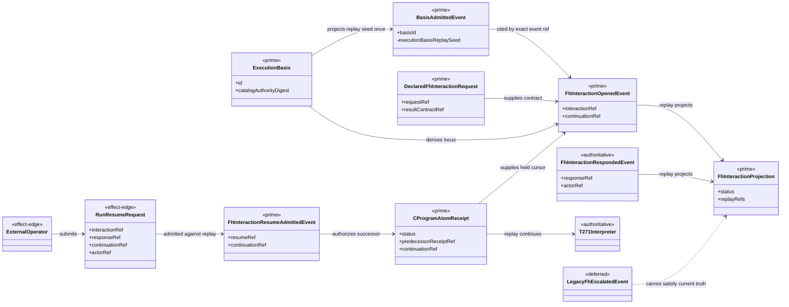
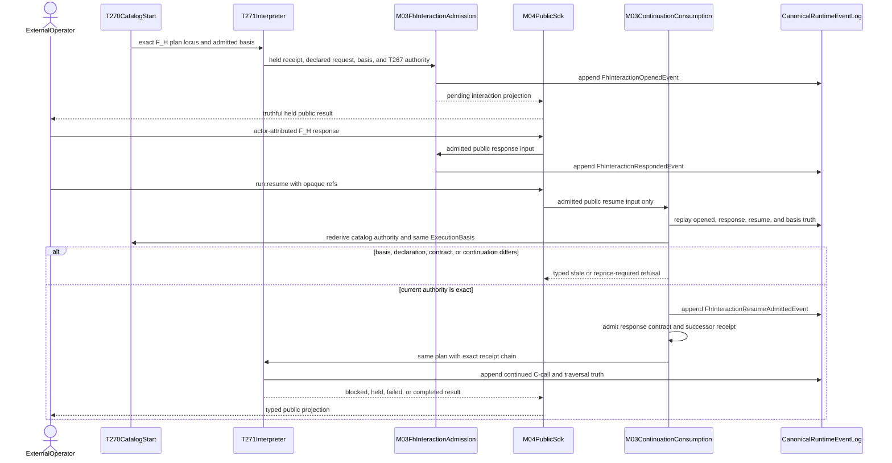
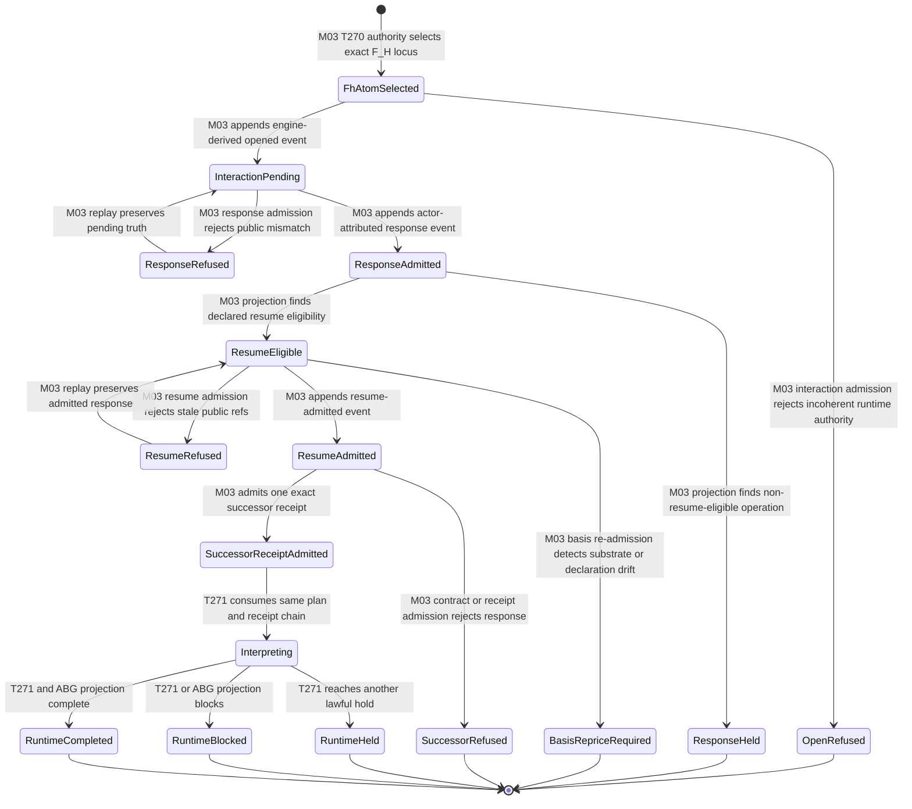

# M03-M04 F_H Runtime Continuation Behavior Design

**Status**: Candidate for PC-007 review
**Date**: 2026-07-15
**Ticket**: `T-272`
**Method authority**: `specification_methodology/specification/standards/DESIGN_MODULE_METHOD.md` section 5E
**Prime authority**: [ADR-044](./adrs/ADR-044-prime-contraction-is-a-cross-boundary-design-gate.md)

## Boundary

This design connects one engine-held F_H C-program atom to the existing public
interaction, response, resume, and runtime-continuation carriers. It replaces
the disconnected `fh_escalated` endpoint and test-seeded interaction opening.

The active lifecycle is:

```text
exact T-270 catalog start authority
  -> T-271 F_H atom held receipt
  -> engine-derived FhInteractionOpenedEvent
  -> actor-attributed FhInteractionRespondedEvent
  -> FhInteractionResumeAdmittedEvent
  -> successor receipt in the existing CProgramAtomReceipt family
  -> T-271 replay continues the same plan
  -> ordinary ABG traversal projection
```

M04 admits public requests and supplies effects. M03 derives every graph call,
frame, vector, C-call, continuation, request, plan, catalog, and execution-basis
identity from current admitted runtime truth.

### Requirements

- `REQ-P-POLICY-024`, `-031..033`, and `-041..046`
- `REQ-R-ABG3-CONTINUATION-002`, `-005..007`
- `REQ-R-ABG3-EVENTS-004`, `-011`
- `REQ-R-ABG3-PROJECTION-003`, `-006`, `-019`
- `REQ-R-ABG3-WITNESS-003`, `-006`
- `REQ-R-ABG3-FN-COMP-015`, `-017`, `-021..024`
- ADR-043 runtime basis and transition ownership
- T-256 declared F_H request, T-258 public interaction, T-267 static
  authority, T-270 public start, and T-271 interpreter carriers

### Explicit exclusions

- an automatic wake controller, scheduler, watcher, or session object;
- a second execution-basis, continuation, or C-program receipt family;
- caller-authored graph call, frame, vector, C-call, cursor, plan, or
  continuation state;
- treating actor response as closure without selected-contract admission;
- overwriting or deleting the original held receipt;
- reusing `fh_escalated` as current interaction truth;
- continuing after declaration, catalog, policy, or capability drift without
  an admitted reprice; and
- product-specific Consensus response semantics.

## Irreducible Architectural Carrier Set

| Carrier | Authority | Role |
|---|---|---|
| `ExecutionBasis` | M03 authoritative runtime basis | Exact catalog-start and graph runtime identity from T-270. |
| `BasisAdmittedEvent` | M03 authoritative replay event | One existing event carrying the subordinate T-270 seed used to re-admit current basis truth. |
| `DeclaredFhInteractionRequest` | M03 authoritative interaction contract | Exact subject, operations, choices, result contract, capabilities, and source carriers. |
| `CProgramAtomReceipt` | M03 authoritative interpreter replay | Existing held or completed receipt family for one exact C-program locus. |
| `FhInteractionOpenedEvent` | M03 authoritative lifecycle event | Opens one interaction and opaque continuation from engine-owned truth. |
| `FhInteractionProjection` | M03 replay-derived projection | Current pending, responded, held, or resume-admitted interaction truth. |
| `FhInteractionResumeAdmittedEvent` | M03 authoritative lifecycle event | Actor-attributed admission to consume one exact response and continuation. |

The following remain subordinate:

- the execution-basis replay seed nested once in `BasisAdmittedEvent`,
  containing only the catalog, binding, start-intent, runtime, policy, and
  authority refs and digests needed to re-admit the same basis;
- response value and evidence;
- predecessor/successor receipt refs inside `CProgramAtomReceipt`;
- the resumed C-call attempt coordinate; and
- public result and status projections.

The replay seed is not independently selectable or writable. M03 uses it only
to re-resolve current installed truth and prove equality with the original
`ExecutionBasis`. Each F_H interaction cites the same basis-admission event;
it does not copy the seed.

## Decisions

### D1. The engine opens the interaction

The active T-271 F_H atom returns `held` only after M03 has selected the exact
declared F_H request and T-267 result authority for its plan locus. M03 derives
the interaction from:

- `ExecutionBasis`;
- current `FhEscalationTransition`;
- exact T-271 plan, cursor, and held receipt;
- exact `DeclaredFhInteractionRequest`;
- exact T-267 admission; and
- canonical causation events.

`openFhInteraction` no longer accepts separately authored basis, graph,
frame, vector, edge, and C-call scalar identities on the production path. It
accepts the authoritative carriers above and derives those fields.

### D2. The opened event is the current F_H continuation truth

`FhInteractionOpenedEvent` retains the opaque continuation identity and cites
the exact `BasisAdmittedEvent`, T-270 authority set, plan, cursor, held receipt,
and T-267 admission refs and digests. The basis event's subordinate seed covers
exact catalog, Module, GraphFunction, start intent, runtime identity, policy
identity, and T-270 authority-set truth once per basis.

Neither event embeds mutable Module or GraphFunction objects. Resume
re-resolves those objects from the current admitted catalog and compares every
digest before reconstructing the same `ExecutionBasis`.

### D3. `fh_escalated` is historical compatibility, not current authority

The supported engine path stops producing `fh_escalated`. Event admission and
read projections may retain that variant for existing logs during the 5.0
migration, but it cannot open, satisfy, or resume an interaction. Current F_H
truth requires `fh_interaction_opened`.

Current F_H terminal producers contract from two disconnected paths to one
engine-owned interaction-opening path.

### D4. Response admission precedes result admission

The five public F_H operations continue to emit one actor-attributed response
event after exact interaction, operation, choice, capability, provenance,
evidence, and basis checks.

Before a response may complete the held C-program atom, M03 resolves the
selected result contract from the T-267 authority and current installed
contract catalog. The response value must pass that contract's native or
canonical schema admission. Contract identity equality without value
admission is insufficient.

### D5. Resume extends the existing receipt family

`run.resume` first emits the existing resume-admitted event. M03 then derives a
successor `CProgramAtomReceipt` for the same plan node and cursor lineage. The
successor records the held predecessor receipt, continuation ref, response
event, selected result contract, and a distinct resumed C-call attempt.

The original held receipt remains immutable replay truth. The successor is a
member of the existing receipt family, not a new continuation receipt family.
Receipt projection rejects forks, cycles, missing predecessors, a second
successor, or a successor whose plan, node, cursor, input, contract,
continuation, response, or C-call identity differs.

### D6. Resume re-admits current basis before effects

M03 rehydrates the current catalog basis, resolves the recorded selected entry,
re-derives the T-270 authority table, and re-admits `ExecutionBasis` from the
opened event's replay seed. Any product, lock, catalog, declaration, policy,
capability, plan, request, or admission change yields a typed stale-basis or
reprice-required stop before a successor receipt or effect. Re-admission uses
the exact basis event's replay seed, not interaction-owned state.

The public request supplies only interaction, response, continuation, actor,
and public invocation identity. It never supplies the replay seed or private
runtime carriers.

### D7. The same T-271 interpreter continues

After successor-receipt admission, M03 reconstructs the complete receipt chain
from canonical events and invokes the same T-271 interpreter with the same
plan and input lineage. The interpreter consumes the successor as the current
result for the held locus, continues remaining authored stages, and returns
ordinary blocked, held, failed, or completed truth.

Repeated equivalent resume is idempotent. A different response, actor,
continuation, basis, or successor receipt refuses. No public adapter loops.

An interaction opened by the old caller-seeded path has no exact T-270 basis
event, authority-set digest, plan receipt, or T-267 admission chain. It remains
readable as historical interaction evidence but is not resume-eligible on the
new runtime path. It must restart through current catalog admission or enter an
explicit declaration/substrate reprice; it cannot be silently upgraded.

## Prime Contraction Review

```json prime-contraction
{
  "schemaVersion": 1,
  "iacs": [
    "ExecutionBasis",
    "BasisAdmittedEvent",
    "DeclaredFhInteractionRequest",
    "CProgramAtomReceipt",
    "FhInteractionOpenedEvent",
    "FhInteractionProjection",
    "FhInteractionResumeAdmittedEvent"
  ],
  "authoritativeCarriers": [
    "ExecutionBasis",
    "BasisAdmittedEvent",
    "DeclaredFhInteractionRequest",
    "CProgramAtomReceipt",
    "FhInteractionOpenedEvent",
    "FhInteractionResumeAdmittedEvent"
  ],
  "subordinatePayloads": [
    "execution-basis replay seed",
    "F_H response value and evidence",
    "receipt predecessor and successor refs",
    "resumed C-call attempt coordinate",
    "public interaction result projection"
  ],
  "promotionTests": [
    {"candidate": "ExecutionBasis", "verdict": "promote", "reason": "Existing immutable admitted runtime basis governs the held and resumed execution."},
    {"candidate": "BasisAdmittedEvent", "verdict": "promote", "reason": "Existing authoritative replay event records one basis admission independently of later interactions."},
    {"candidate": "DeclaredFhInteractionRequest", "verdict": "promote", "reason": "Existing independently admitted interaction contract is matched by response and runtime admission."},
    {"candidate": "CProgramAtomReceipt", "verdict": "promote", "reason": "Existing replay carrier is directly pattern-matched by the structural interpreter."},
    {"candidate": "FhInteractionOpenedEvent", "verdict": "promote", "reason": "Existing authoritative event opens independently addressable public interaction truth."},
    {"candidate": "FhInteractionProjection", "verdict": "promote", "reason": "Existing public replay projection crosses the M03 to M04 boundary and is directly pattern-matched."},
    {"candidate": "FhInteractionResumeAdmittedEvent", "verdict": "promote", "reason": "Existing authoritative event admits the actor response into one exact continuation."}
  ],
  "recurrenceReview": {"status": "consume_existing", "ref": "PC-007"},
  "authoritySourceCount": {"before": 7, "after": 7},
  "authoringSourceCount": {"before": 7, "after": 7},
  "disposition": "consume_existing",
  "ownerTicket": "T-272"
}
```

Current F_H opening producers contract `2 -> 1`. Production callers that can
author private runtime-locus scalar fields contract `1 -> 0`. Public catalog
start and resume remain two separate semantic routes.

## Domain Model



## Execution Sequence



## Lifecycle State Model



## Cross-View Axiom Evaluation

| Axiom | Authority | Domain evidence | Sequence evidence | State evidence | Native enforcement | Admission/compiler enforcement | Verdict | Gap owner |
|---|---|---|---|---|---|---|---|---|
| engine owns interaction opening | POLICY-032; FN-COMP-017 | opened event derives from basis and receipt | no external open message | only M03 reaches pending | production input excludes scalar locus | exact T270/T267/receipt joins | pass | none |
| continuation identity is replay-owned | CONTINUATION-002; PROJECTION-006 | opened/resume events and projection are prime | resume reads events before action | stale refs refuse | opaque public refs | replay projection and digest checks | pass | none |
| response is not closure | POLICY-032; ASSURANCE-033 | response event is distinct from receipt/result | contract admission follows response | ResponseAdmitted is nonterminal | closed event variants | selected-contract admission | pass | none |
| original held truth is immutable | EVENTS-011; T271 | predecessor and successor remain one receipt family | successor cites held receipt | fork/cycle refuses | sealed receipt union | chain projection validates exact predecessor | pass | none |
| current substrate is re-admitted | POLICY-024; WITNESS-003 | replay seed is subordinate to basis event | catalog and basis rederive before resume | drift enters reprice-required | closed seed fields | current catalog and T270 recompilation | pass | none |
| same interpreter continues | FN-COMP-015; T271 | one receipt family feeds T271 | resume calls T271, not local loop | Interpreting owns all next states | existing plan/receipt types | exact receipt-chain admission | pass | none |
| legacy escalation cannot satisfy current truth | POLICY-033 | legacy event is deferred | no active producer message | no transition from legacy event | distinct event kind | projection requires opened event | pass | none |

## Proof Contract

Implementation acceptance requires:

1. one real T-270 engine run opening an F_H interaction without direct test
   invocation of `openFhInteraction`;
2. public response and resume continuing the same graph call, frame, plan,
   locus, cursor lineage, continuation, and execution basis;
3. selected-contract value admission before successor receipt creation;
4. negatives for forged basis seed, stale catalog/module/program/request,
   wrong result contract, receipt fork, duplicate successor, wrong response,
   wrong actor, wrong continuation, and declaration drift without reprice;
5. idempotent replay after process restart using event-derived receipts;
6. no active `fh_escalated` producer and no caller-seeded production opening;
7. a second lawful F_H hold remaining nonterminal without an automatic loop;
8. the unchanged T-252 body using the generic path with no Consensus branch;
   and
9. focused, semantic, GTL, packed, publication, governance, and design gates
   green from one tree.

## Migration

- the production engine stops emitting `fh_escalated`; event admission retains
  it only for historical logs during the migration window;
- production interaction opening moves from caller-supplied scalar locus
  fields to exact T-270/T-271/T-267 carriers;
- the existing `CProgramAtomReceipt` seal gains closed predecessor,
  continuation, and resumed-attempt fields instead of adding another receipt
  family;
- old test-seeded interactions remain readable but cannot resume without an
  exact basis-admission event and held receipt; and
- mixed old/new interaction, basis, receipt, or event truth fails before a
  successor receipt or runtime effect.

## Design Verdict

`candidate`. The design preserves existing execution, interaction, event, and
receipt families and introduces no session/controller carrier. Implementation
remains blocked until PC-007 review confirms the replay-seed proportionality,
successor-receipt relation, and exact T-270 dependency.
