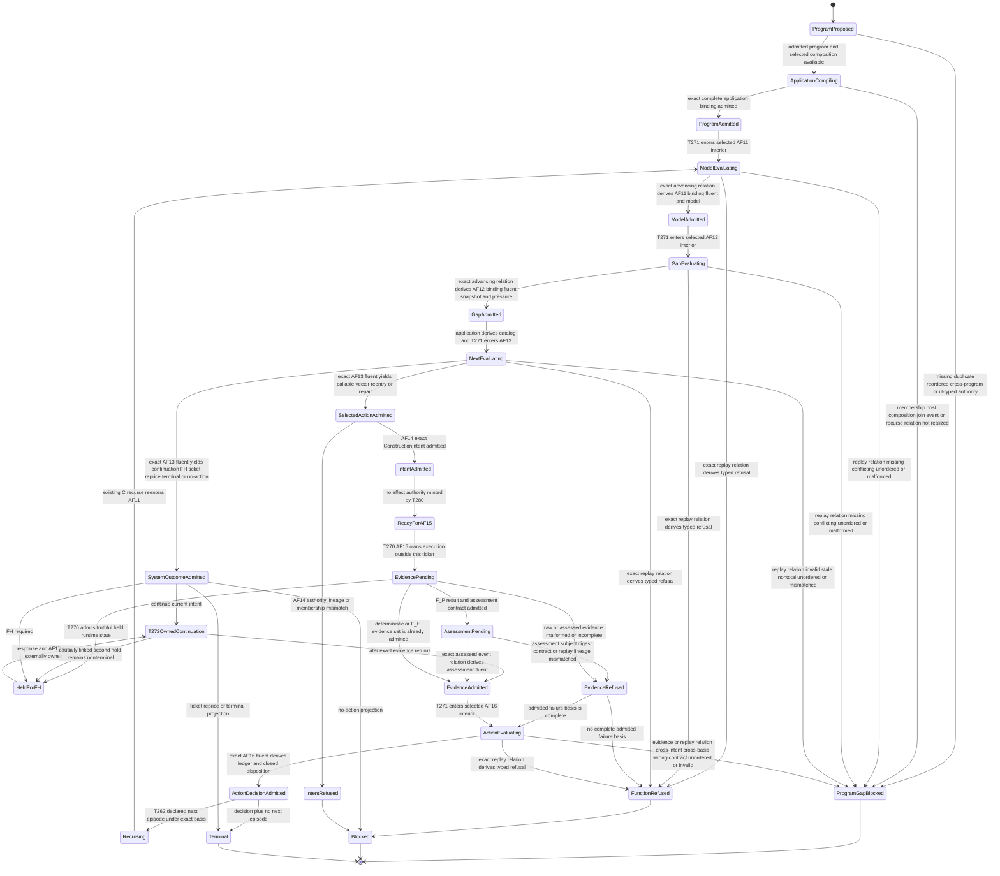

# M03-M04 One Surface Authority Behavior Design

**Status**: Accepted and implemented - independently reviewed for T-280 closure

**Date**: 2026-07-17

**Ticket**: `T-280`

**Ontology authority**: `ABIOGENESIS_PUBLIC_CONTROL_PLANE_ONTOLOGY.md` accepted semantic candidate `1ca39b2b5c536be6d16eecfb30d8310e798853232ae7c03f71ac655a7f97bf40`; current projection digest `bcbacd4a4b4dd3b5b6db2a3ad281c92bf76a7a889da38562d5b6301e85764615`

**Method authority**: `specification_methodology/specification/standards/DESIGN_MODULE_METHOD.md`

**Prime authority**: [ADR-044](./adrs/ADR-044-prime-contraction-is-a-cross-boundary-design-gate.md)

**2026-07-18 F_H increment**: the existing `assessed` event now binds one
stable result-assessment identity to its exact runtime subject and declared
assessment contract. Replay derives the assessment relation and
`result_assessment_admitted` fluent before AF-16 consumes the evidence. This
bounded increment does not change T-280's four semantic authorities, public
operation count, C-call carrier shapes, or reviewed AF-15/T-272 boundaries.

## Boundary

This design realizes the four missing One Surface semantic authorities and the
construction-intent admission boundary that precedes execution:

```text
AF-11 synthesizeModel
AF-12 evalGap
AF-13 evaluateNext
AF-14 admitConstructionIntent
AF-16 evaluateAction
```

AF-11, AF-12, AF-13, and AF-16 are distinct product/ABG authority functions.
One admitted `GtlProgram` declares how they compose. The semantic compiler
must derive one `OneSurfaceProgramApplicationBinding` that proves the exact
program membership, selected `abg.fn_composition`, typed inter-function joins,
AF-14 target, T-270 AF-15 slot, AF-16 return, and T-262 recurse/foldback path.
T-271 compiles and interprets only each selected function's C-program interior;
it does not own the program-level One Surface sequence. T-262 alone owns the
declared recurse termination, foldback, and parent rebind. A shared native
family may commonize definition, construction, admission, and projection
mechanics; it cannot merge semantic authority or introduce a controller.

AF-14 is a separate ABG admission boundary. It consumes exactly one
effect-intent-eligible selected AF-13 result and emits one exact
`ConstructionIntent` or a typed refusal. The
intent binds the admitted program, selected member function or other lawful
action, narrowed catalog view, immutable workspace binding, operation-indexed
invocation authority, target obligations, current causal basis, and lineage.
AF-14 does not choose or rank work.

T-280 stops at the AF-15 boundary. T-270 alone joins the admitted intent to the
compiled execution chain, admits the sole effect-authorizing `ExecutionBasis`,
and invokes the selected GraphFunction. T-272 alone continues a current intent
after F_H response. T-280 neither absorbs nor emulates either ticket.

The construction-observation, action-catalog, priority, intent, assurance, and
projection libraries are reconciled subordinate libraries under the admitted
One Surface authority family. Generic `AdmittedConstructionIntent` data alone
is not AF-14 authority; `OneSurfaceConstructionIntentAdmission` validates and
seals the exact program, application, selection, target, workspace, catalog,
and invocation-authority envelope. The `construction_runner` and
`engine_runner` remain non-authoritative and are not the One Surface program or
controller. A join that the semantic compiler cannot prove from admitted
structure yields `one_surface_semantic_not_realized` and executes no authority
function.

### Requirements

- `REQ-R-ABG3-FPC-001..017`, especially `002A`, `003`, `004..007`, `009`,
  `011A..011E`, and `013..016`;
- `REQ-R-ABG3-FN-COMP-001..015`, `019..024`, and `026..027`;
- `REQ-R-ABG3-INTERPRET-029..030`;
- `REQ-R-ABG3-CCALL-001..006`;
- `REQ-R-ABG3-PAYLOAD-001..009`;
- `REQ-R-ABG3-EVENTS-021` and `030`;
- `REQ-R-ABG3-EVENTS-018` and `REQ-P-POLICY-034` for exact assessed-result
  event/replay truth;
- `REQ-L-GTL3-CONTRACT-LAW-API` One Surface and ownership rows;
- `REQ-P-POLICY-054` and `REQ-P-SCENARIOS-003`, `012`;
- PRODUCT `Outcome Compute Contract` and One Surface; and
- GOALS current critical path `O -> T-270`.

### Explicit Exclusions

- AF-15 execution admission, effect basis, GraphCall, or interpreter entry;
- AF-17 continuation and AF-18 F_H response admission;
- a new public operation, CLI verb, SDK command, service, or endpoint;
- a GraphFunction, Module, catalog row, or ingress adapter treated as the
  owning GTL program;
- an imperative loop in ingress, SDK, CLI, `construction_runner`,
  `engine_runner`, a plugin, or a product-local service;
- a second selector, direct catalog selection, or AF-14 re-ranking;
- a second event store, replay store, session controller, execution basis, or
  mutable current-binding pointer;
- Consensus-specific types, branches, prompts, policies, or proof shortcuts;
- hostile in-process forgery defense, filesystem tamper resistance, or
  cryptographic session machinery on the trusted desktop; and
- interpreting a missing semantic authority as an empty successful function.
- a new C constructor, synthesized canonical stage chain, or program-level
  imperative coordinator; and
- a new runtime event kind or using a read-model event as unearned primary
  semantic authority.
- adding semantic authority, invocation inputs, or result payload riders to
  the locus-only `c_call_opened` carrier; and
- changing the existing C-call spine or result-event payload shape.

## Ontology Basis

- **Ontology verdict**: ratified
- **Ontology identity/version**: `ABIogenesisPublicControlPlaneOntology/9`
- **Accepted semantic candidate**: `1ca39b2b5c536be6d16eecfb30d8310e798853232ae7c03f71ac655a7f97bf40`
- **Current Ontology projection digest**: `bcbacd4a4b4dd3b5b6db2a3ad281c92bf76a7a889da38562d5b6301e85764615`
- **Ontology acceptance**: `.ai-workspace/comments/codex/20260716T055554Z_DECISION_t278_ontology_ratified.md`
- **Staleness rule**: a semantic change to any authority source or accepted
  T-270/T-272 boundary below returns this design to candidate and forbids
  implementation reconciliation until its digest and axiom matrix are
  refreshed. The GOALS change since acceptance is delivery-state and owner
  topology only; the 27/7/19 semantic target and T-280 boundary are unchanged.

### Constitutional Source Digests

| Source | SHA-256 |
|---|---|
| `specification/GOALS.md` | `5a0c8dac3a731443037a03cfe824896b98b881e5193f40ae00fdbf4b9fd7203a` |
| `specification/INTENT.md` | `a24c6bcbe4605d8ef0444c063ce61a58d43632b2bcc42b4752e42935d93d9b9f` |
| `specification/PRODUCT.md` | `5baa698c8d398118649260ce350f3dc2bd2d33c60ef66078d4a2a0a927fb15f2` |
| `REQ-L-GTL3-CONTRACT-LAW-API.md` | `c2380d7798e1bd8eec80b7b603ca2a3dba963a9ab5ba337d9ce28649f7118473` |
| `REQ-R-ABG3-FP-CONSCIOUSNESS.md` | `8ab5dcce84df9ac077afbc358bd980f19149dbd39dff1b19aa9636070ef019c7` |
| `REQ-R-ABG3-FN-COMPOSITION.md` | `39d9e8a2678a1cacff0ffd2a518b2857e378660022d51c81ac0d3d9429619677` |
| `REQ-R-ABG3-INTERPRET.md` | `6abd6e6c40195bc99a23f1bbf4e69cdaf43b8f04d5f4a7c9ea02831ff86c6092` |
| `REQ-R-ABG3-CCALL.md` | `dc34f29659e7d72a26d9cdbe498204bf090c34ebddd7fc7f5d6646b251e55276` |
| `REQ-R-ABG3-PAYLOAD.md` | `2724e23c09777250c329701cd2c85cd9fd1ae67f681b70e475d0f5176686f6e4` |
| `REQ-R-ABG3-EVENTS.md` | `eee93a090f45576b2e76b3a9f8379c71ffbd8e2009057297da1bed27e04a03a2` |
| `REQ-P-POLICY.md` | `89cf57e14f74cd4ea433c277f88d89a5972e49b421801878d44b7481801c022f` |
| `REQ-P-SCENARIOS.md` | `a7430bb1468f6d26d46bfdd41be43c81220954e793ff47052488b206b54b0562` |
| ratified control-plane Ontology projection | `bcbacd4a4b4dd3b5b6db2a3ad281c92bf76a7a889da38562d5b6301e85764615` |
| accepted T-270 design | `71076f364d06a9725b5482ee0cdc84e64d29a4c18447a5ab4c41e1b62ba7f430` |
| accepted T-272 design | `1b879535201080f5ed7da4bc781bd447fa46c72ad5f500c71e73e0b0ed62b0b2` |
| T-271 complete C-program interpreter design | `9f2c44a4a254dec00ae8ea1000450c24f9cf34d4e10b3f6368fec057c970c953` |
| T-262 typed recurse runtime design | `ee2302d6903907074bdffa272a4bf6144b106c2546929ecc415112344f30ebcb` |
| selected `abg.fn_composition` design | `f2aba1f7b072685e7d49e8c954f6df2aac4cb498454381f1a853d7d6c2f35df7` |
| ABG Event Calculus IACS | `ebb605654866c3576810447256ef803ba70d372d90d3820072ac5075849b4845` |
| ABG Event Calculus structural carrier design | `3da014a934815cd346e5381c34593f4531a0bef7480bfb1b4f38b26784084e6a` |
| ADR-044 | `42f390392b8841e8d8cdf3ce145bd6f91ef18bb90c0b1e77110fac02f4e238d6` |

## Ontology Completeness

### Semantic Function Contracts

| ID | Function | Exact inputs | Exact outputs | Authority and prohibited transfer |
|---|---|---|---|---|
| `AF-11` | `synthesizeModel` | admitted intent lineage, prior `ProductAssetModel` when present, admitted product truth, exact program/function binding | one versioned `ProductAssetModel` or typed refusal | owns desired and known typed product-asset truth; cannot observe worksite, evaluate gaps, select, admit intent, invoke, or close |
| `AF-12` | `evalGap` | immutable `WorkspaceBinding`, current model, replay cursor and aggregates, worksite/asset observations, obligation/retry/reentry/evaluator/F_H/prior-intent truth | one immutable `ObservationSnapshot` plus typed `GapPressureRow[]`, or typed refusal | owns fresh observation and gap pressure; cannot change binding, rank, select, admit intent, invoke, or close |
| `AF-13` | `evaluateNext` | exact `NextActionBasis`, fresh snapshot and pressure, target obligations, program/view-derived `ActionCatalog`, runtime frontier, visible priority/affect policy | `TargetObligationBinding[]`, one `PriorityProjection`, and one total `NextActionProjection`, or typed refusal | sole current eligibility/ranking/selected-or-no-action authority; cannot invoke, continue, or close |
| `AF-14` | `admitConstructionIntent` | exact AF-13 selected result, lineage, admitted program and member, catalog view, workspace binding, invocation authority, target obligations, current causal basis | one immutable `ConstructionIntent` or typed refusal | validates and admits one selected new action; cannot re-rank, infer membership, mint effect authority, or invoke |
| `AF-16` | `evaluateAction` | one admitted intent, that action's complete admitted evidence set, immutable workspace binding, declared closure policy | one immutable `EdgeFulfillmentLedger` plus one closed `EdgeClosureDecision`, or typed refusal | sole `close | yield | retry | repair | re-enter | reprice | block` action truth; cannot select the next action |

The definition family is a closed discriminated relation over these exact
function IDs. AF-15, AF-17, and AF-18 are references to other accepted owners,
not variants in the T-280 family.

Each `OneSurfaceAuthorityDefinition<K>` binds all of the following. None may be
inferred from runtime naming or hidden configuration:

- one closed host kind: `graph_function | graph_vector | evaluator | rule |
  operator`;
- the exact host ref, owning declaration ref, admitted program ref/digest, and
  program-membership ref/digest;
- the exact selected per-member complete-C program ref/digest interpreted by
  T-271, its result-bearing program-locus ref, selected regime, and selected
  arm ID; these are distinct from the admitted GTL program identity;
- the selected `abg.fn_composition` contract ref/digest and its causal
  selection ref;
- every applicable graph-function declaration, hook-resolution ref/digest,
  policy ref/digest, and visible fallback/template ref under FPC-013;
- nominal input and output contract refs/digests, regime, effect class,
  admission profile, exact result-bearing program-locus ref, and result event
  relation.

The compiler rejects an unknown host kind, a host/member mismatch, an
inapplicable hook, a policy or fallback not visible from the admitted program,
or a selected composition whose host binding does not match the owning GTL
surface. One Surface notation never manufactures another carrier or execution
target from the selected composition.

### Program Application Binding

`OneSurfaceProgramApplicationBinding` is the Prime compiled relation between
the admitted GTL program and runtime atoms. It carries one application
ref/digest and proves:

1. exact admitted program ref/digest and ordered membership for AF-11, AF-12,
   AF-13, AF-14, AF-16, and the T-270 AF-15 slot;
2. the exact `OneSurfaceAuthorityDefinition<K>` ref/digest and selected
   `abg.fn_composition` ref/digest plus selected per-member complete-C program
   ref/digest, result-bearing program-locus ref, regime, and arm ID for each
   semantic function;
3. nominal output-to-input joins AF-11 -> AF-12 -> AF-13 -> AF-14 target ->
   T-270 AF-15 -> AF-16;
4. the exact AF-16 result-to-T-262 recurse application, termination,
   foldback, and parent-rebind contracts; and
5. the same binding at every published refinement boundary.

The binding is not an authored program, controller, execution plan, or eighth
C constructor. The compiler derives it from the admitted program and selected
composition contracts. T-271 compiles each member's declared C interior only.
T-270 owns the effect slot. T-262 owns recursion and foldback. If any
membership, composition selection, type join, effect slot, event relation, or
recurse/foldback relation cannot be proven statically, the application is
`one_surface_semantic_not_realized` and no partial application executes.

### Closed AF-13/AF-14 Action Union

`NextActionProjection` owns one closed `AF14SelectionDisposition`:

| Variant | Existing action kind | AF-14 result | T-270 AF-15 routing |
|---|---|---|---|
| `callable_member_action` | `invoke_graph_function` | admit a new exact `ConstructionIntent` | yes |
| `internal_vector_action` | `invoke_prior_vector | invoke_later_vector` | admit a new exact `ConstructionIntent` | yes |
| `refinement_reentry_action` | `reenter_graph_span` | admit a new exact `ConstructionIntent` with span/refinement/reentry refs | yes |
| `repair_action` | `repair_same_edge` | admit a new exact `ConstructionIntent` | yes |
| `continue_current_intent` | `continue_graph_call` | no new intent; typed continuation result | no; T-272 AF-17 owns continuation |
| `fh_outcome` | `open_fh_gate` | typed F_H-required result | no; existing F_H/T-272 boundary |
| `ticket_outcome` | `create_ticket` | typed ticket-required result | no |
| `reprice_outcome` | `propose_reprice` | typed reprice-required result | no |
| `terminal_outcome` | `yield_progress | close_episode | block_episode` | typed terminal/progress result | no |
| `no_action` | no action kind | typed no-action result | no |

AF-14 accepts only the first four variants. It validates their exact selection
basis and admits at most one matching new intent. Every other variant remains
an admitted system/no-action outcome; it neither mints a `ConstructionIntent`
nor crosses the T-270 boundary. AF-14 cannot reinterpret one variant as
another, and `continue_graph_call` cannot be converted into a new intent.

### Entity Lifecycle Matrix

| Entity | Identity | Authority owner | Declare/create | Read/project | Update/transition | Delete/retire |
|---|---|---|---|---|---|---|
| `GtlProgram` | program ref + digest | GTL declaration plus ABG admission | admitted GTL composition | conformance and replay projection | immutable; new program identity for semantic change | retires with published program version; history retained |
| `OneSurfaceProgramApplicationBinding` | application ref + digest | semantic compiler over admitted program and selected composition truth | derived only after every exact join proves | compiler/conformance projection | immutable; changed membership/composition/join creates a new binding | retired with owning program; never mutated or hand-authored |
| `OneSurfaceAuthorityDefinition<K>` | program + function ID + host ref + contract digest | admitted program and product semantic owner | program declaration, compiler admission | conformance projection only | immutable; changed contract creates new digest/program basis | retires with program; no mutable override |
| `ProductAssetModel` | model ref + version + basis digest | AF-11 product meaning plus ABG admission | AF-11 only | `project.read` derived view | AF-11 emits a new immutable version | older versions remain causal evidence |
| `WorkspaceBinding` | binding ref + digest | workspace/product/install/root authority | existing binding admission | referenced by snapshots, intents, decisions | immutable; new authority requires a new binding and covering reprice | no in-place deletion |
| `ObservationSnapshot` | snapshot ref + digest | AF-12 product meaning plus ABG admission | AF-12 only | gap/evidence projection | re-observation creates a new snapshot under same binding | history retained |
| `GapPressureRow` | pressure ref + snapshot basis | AF-12 product gap meaning plus ABG admission | AF-12 inside snapshot result | public gap projection | fresh evaluation emits new/superseding rows | resolved row remains history; independent row identity and admission retained |
| `ActionCatalog` | program + catalog-view basis digest | admitted program publication projection | existing pure projection | consumed by AF-13 | new program/view basis creates new projection | stale projection cannot select |
| `TargetObligationBinding` | binding ref + snapshot/action/target basis | AF-13 product policy plus ABG admission | AF-13 only | next-action/evidence projection | new AF-13 evaluation creates new binding rows | expires as current truth; independently admitted history retained |
| `PriorityProjection` | projection ref + basis digest | AF-13 product policy plus ABG admission | AF-13 only | ranking projection | new basis creates new immutable ranking | subordinate history retained |
| `NextActionProjection` | projection ref + basis digest | AF-13 product policy plus ABG admission | AF-13 only | lawful-action/result projection | new exact basis creates a new projection | retained as causal selection evidence |
| `ConstructionIntent` | intent ref + digest | AF-14 ABG admission | AF-14 only | intent status/evidence projection | immutable; another selected action creates another intent | retained under ABG lineage law |
| `AdmittedEvidence` | evidence ref + subject/basis/digest | existing ABG payload/result/witness admission | T-257/T-258 and existing event admission | evidence projection | new evidence creates another immutable admitted row | history retained; raw payload never substitutes |
| `EdgeFulfillmentLedger` | ledger ref + version + basis | AF-16 product closure policy plus ABG admission | AF-16 only | fulfillment/evidence projection | AF-16 emits new immutable version from new complete set | history retained |
| `EdgeClosureDecision` | decision ref + basis + disposition | AF-16 product closure policy plus ABG admission | AF-16 only | result/frontier projection | corrected evidence creates new decision/version | history retained; cannot be adapter-deleted |

### Authority Matrix

| Function or transition | Proposer | Evaluator | Verifier | Admitter | Executor | Projector | Retirement owner |
|---|---|---|---|---|---|---|---|
| AF-11 model synthesis | admitted product/program declarations | program-bound model authority | ABG input/type/basis verifier | ABG model-result admission | declared host interior | replay-derived model projection | program/product version law |
| AF-12 gap evaluation | exact binding/model/observation inputs | program-bound gap authority | ABG freshness/type/binding verifier | ABG snapshot/pressure admission | declared read-only host interior | replay-derived gap projection | program/product version law |
| AF-13 next evaluation | exact next basis, fresh gap, catalog, policy | program-bound next-action authority | ABG totality/membership/basis verifier | ABG binding/ranking/selection admission | declared selection host interior | replay-derived lawful-action projection | program/product version law |
| AF-14 intent admission | selected AF-13 projection | ABG admission rules | ABG exact program/member/view/binding/authority verifier | ABG construction-intent admission | not applicable: admission grants no effect | replay-derived intent projection | ABG lineage retention |
| AF-15 invocation | admitted AF-14 intent | T-270 only | T-270 compiler/authority join | T-270 execution-basis admission | T-271 interprets selected per-function C interior only | runtime/evidence projection | T-270/ABG runtime law |
| F_P result admission | raw worker output | T-257 result-contract admission | exact selected contract and profile | ABG typed result/failure admission | worker interior is external | evidence/failure projection | ABG payload retention |
| AF-16 action evaluation | admitted intent plus a subordinate exact complete view over admitted evidence | program-bound deterministic closure authority | ABG completeness/lineage/policy verifier | ABG ledger/decision admission | declared F_D fold | replay-derived result/frontier projection | ABG closure-evidence retention |
| recursive next episode | AF-16 exact decision basis | admitted GTL composition | T-262 program/basis/termination/foldback verifier | existing T-262 recurse event/result admissions | T-262 typed recurse/foldback runtime | replay-derived public projection | program and ABG replay law |

### Function Derivation Matrix

| Discovered functionality | Entity | Atomic function or template | Higher-order composition | Effect class | Required authority | Disposition |
|---|---|---|---|---|---|---|
| desired/known product model | `ProductAssetModel` | AF-11 | One Surface initial/refresh branch | governed semantic compute plus admission | admitted program and product truth | retain distinct authority |
| fresh gap observation | `ObservationSnapshot`, pressure rows | AF-12 | One Surface initial/refresh branch | read-only observation plus admission | binding, model, replay/worksite truth | reconcile precursor libraries |
| candidate projection | `ActionCatalog` | existing pure projection | input to AF-13 | pure read projection | admitted program plus narrowing view | consume existing projection law |
| target binding/ranking/selection | binding, priority, next projection | AF-13 | One Surface selection branch | governed semantic compute plus admission | exact basis/gap/catalog/policy | reconcile precursor libraries |
| selected action admission | `ConstructionIntent` | AF-14 | system bind before AF-15 | admission event, no effect authority | exact AF-13/program/member/view/binding/invocation authority | migrate incomplete precursor |
| graph execution | existing T-270/T-271 carriers | AF-15 external owner | One Surface effect branch | effectful traversal | admitted AF-14 intent then T-270 basis | exclude; T-270 owns |
| raw F_P parsing/admission | existing T-257 carriers | existing T-257 atom | evidence bind before AF-16 | foreign-input admission | selected result contract/profile | consume existing |
| evidence completeness and closure | ledger and decision | AF-16 | One Surface post-effect branch | deterministic F_D fold plus admission | intent, full admitted set, binding, policy | retain distinct authority |
| repeat under exact next basis | existing C/recurse carriers | existing `C.recurse` | One Surface tail recursion | interpreter control from admitted program | program, decision, lineage, foldback | consume existing; no loop |
| public gap/result/lawful action | existing public projection | `project.read` external owner | projection after admitted truth | read-only | replay-derived admitted refs | exclude; no new operation |

### Existing Event-Family Binding

EVENTS-021 requires One Surface truth to use the published construction event
and runtime event families. T-280 adds no event kind and does not overload an
existing event's phase or Event Calculus effects.

`c_call_opened` remains locus-only under CCALL-002. It carries no One Surface
binding, semantic authority, input, output, composition, or contract rider.
`c_call_result_admitted` likewise retains its published shape: it names the
admitted output payload and response contract but does not embed a second
result model.

Each AF-11/12/13/16 member interior instead binds its exact declared
result-bearing C-call spine and the existing payload-ledger facts in this
order. Other C-program stage spines retain their ordinary roles and can never
derive the authority function result:

1. `c_call_opened` records the structural locus only;
2. `c_call_fibre_selected` records the declared program and selected
   composition ref;
3. `authority_snapshot_admitted` records one exact authority/input snapshot;
4. the selected interior performs its declared compute;
5. `payload_observed` admits the complete output envelope and external body
   identity when present;
6. `payload_validated` records that payload's digest and selected contract;
7. `evidence_admitted` binds that output to the authority digest and input
   digest;
8. one applicable `c_call_evidenced` row encloses the exact
   `authoritySnapshotRef`, `validationRef`, and `evidenceRef` in its existing
   `evidenceRefs` array; and
9. `c_call_result_admitted` admits that same payload ref and result-contract
   ref before `c_call_judged` records the exact advancement disposition.

CCALL-001 permits zero-to-many evidence rows. T-280 does not narrow that law.
It requires exactly one complete One Surface enclosure relation to be
derivable across the call's applicable evidence rows; duplicate or competing
complete relations fail closed. An implementation may extend an existing
evidence row or emit another lawful row, but it cannot rely on array order or
silently collapse multiple rows.

The admitted authority snapshot is the runtime witness for the static
`OneSurfaceProgramApplicationBinding`. Its canonical `authorityRefs` sequence
contains the authority definition, application, program/member, selected
composition, selected per-member complete-C program and result-bearing
program-locus ref, selected regime and arm ID, result contract, domain
admission, causal basis, and applicable hook/policy refs. Its
`authorityDigest` is the digest of that typed ordered sequence. Its `inputRefs`
and `inputDigest` carry the exact function input basis. The selected
composition is cited, never selected, by this snapshot and must equal both the
static application binding and the matching
`c_call_fibre_selected.compositionRef`. The typed authority-basis
`cProgramRef` slot is resolved from the exact `authorityRefs` sequence and
digest; it is not a field added to `authority_snapshot_admitted`. The event's
`c_call_fibre_selected.programRef` is the selected complete-C program ref; it
must equal that resolved `cProgramRef` and must never be compared to or used as
the admitted GTL program ref. Its `regime` and `armId` must equal the exact
definition/application slots; neither may be inferred from composition or
ignored by the result join.

`OneSurfaceAuthorityResultBinding` is a deterministic replay projection over a
closed `success | refusal` outcome, not an event payload. A success binding is
derived only when the exact result-bearing locus,
selected fibre, authority snapshot, observed and validated payload, admitted
evidence, enclosure row, result-admission row, and advancing judgment agree on
call, basis, authority/application/program, member/C-program/composition,
regime/arm, input digest, output payload/digest, result contract, domain admission, and
causation in canonical admission-ordinal order. Its stable ref is a digest
over that closed relation. A refusal binding requires the exact admitted typed
refusal contract and its declared non-advance judgment. Retry, pending,
blocked, or escalated truth therefore remains replay-visible without becoming
a successful semantic result. `no_declared_check` is invalid for these
contract-declaring authorities. A non-advance row without an exact typed
refusal, or any conflicting predecessor, yields only an invalid diagnostic.

One total pure `deriveOneSurfaceAuthorityResultProjection` owns the join and
returns exact success/refusal bindings plus typed invalid diagnostics. The compiler/admission
boundary maps every missing or conflicting complete relation to
`one_surface_event_binding_semantic_not_realized`. An application-bound
`RuntimeDerivedFluentRule` with deterministic ref
`rule://abg/one-surface/authority-result/<applicationDigest>` delegates to that
same derivation and emits one existing-shape `RuntimeFluent` for each exact
success or refusal binding. T-280 adds exactly one closed
`RuntimeFluentName`, `one_surface_authority_outcome`; its scope is
`graph_call`, its ordinary basis/locus fields come from the admitted C-call,
and its `ref` is the exact result-binding ref. The fluent is an index into
replay-derived truth; it carries no authority kind, output digest, or private
payload field. Downstream projections pattern-match the binding's
`success | refusal` outcome kind. Unmatched, duplicate, cross-basis,
cross-definition, cross-application, cross-program, wrong-composition,
wrong-contract, wrong-domain-admission, unreferenced-evidence, or causally
unrelated rows derive no fluent and remain present in the total sibling
projection's diagnostic set. The rule's captured application digest is public
declared authority, never hidden configuration.

`c_call_opened`, `c_call_fibre_selected`, `authority_snapshot_admitted`,
`payload_observed`, `payload_validated`, `evidence_admitted`,
`c_call_evidenced`, `c_call_result_admitted`, and `c_call_judged` receive
empty-effect Event Calculus replay-aid registrations where not already
registered. Their canonical admitted source events then enter the effect-row
input consumed by the derivation and rule. The rule alone derives the result
fluent. This is registration of existing kinds, not a new event, field,
resolver, phase, or semantic effect.

| Authority | Existing published kind(s) | Required exact relation | Current disposition |
|---|---|---|---|
| program application start | `construction_episode_started` | admitted program, application, workspace binding, execution basis and lineage | external T-270 startup/integration boundary; not a T-280 gap |
| AF-11 `synthesizeModel` | one exact C-call spine plus authority snapshot, validated payload, admitted evidence, enclosure, and result admission | exact replay relation derives the AF-11 result-binding ref and fluent; `ProductAssetModel` derives from that truth | realized through the shared result family, exact replay projection, and application-bound derived rule |
| AF-12 `evalGap` | exact C-call/payload-ledger relation and derived rule, then `construction_observation_snapshot_materialized` | AF-12 result binding/fluent owns the exact output; observation event binds the resulting snapshot; pressure rows remain derived | realized without changing the construction event's phase or authority |
| AF-13 `evaluateNext` | exact C-call/payload-ledger relation and derived rule; `construction_action_catalog_projected` remains candidate basis; candidate admitted/rejected and `construction_intent_selected` retain AF-14 preparation roles | AF-13 result binding/fluent owns the exact closed selection union; target binding, priority, and next-action read models derive from it | realized for the full closed action union with exact target-obligation conservation |
| AF-14 intent admission | `construction_intent_candidate_admitted | construction_intent_candidate_rejected` and `construction_intent_selected`; system/no-action outcomes use `construction_terminal_disposition_projected` | exact AF-13 projection/program/member-or-internal-target/view/workspace/invocation-authority refs/digests and admitted intent or refusal | realized for callable, internal-vector, re-entry, and repair effects; every non-effect disposition refuses before invocation |
| T-270 AF-15 | `construction_graph_action_invoked` | exact admitted intent, execution basis, GraphCall/frame and selected member/internal target | external T-270 owner; T-280 records only the typed slot |
| AF-16 `evaluateAction` | exact C-call/payload-ledger relation and derived rule, then `construction_delta_observed` and `construction_terminal_disposition_projected` | AF-16 result binding and fluent own the exact admitted output; delta and terminal events retain consequence/projection roles; ledger/decision/terminal read models derive from owning truth | realized over one complete same-intent admitted evidence basis with typed refusal for every incomplete or foreign basis |
| recurse/foldback | existing T-262 typed-recurse event family | exact AF-16 result, termination/foldback application, child result and parent rebind | external T-262 owner; T-280 binds the existing relation only |

`construction_episode_started` binds the episode's admitted program, stable
workspace binding, execution basis, and lineage; it is not AF-11 result
authority. `construction_action_catalog_projected` remains candidate-projection
truth, never selection authority. `construction_evaluator_invoked` retains only
its existing invocation/awaiting-outcome truth where applicable; it never owns
an AF result. `construction_intent_candidate_returned` remains the AF-13
candidate-return phase and is not generalized into a four-function result
event. `construction_observation_snapshot_materialized`, intent, graph-action,
delta, and terminal events retain their exact existing roles.

A single C-call or payload-ledger event never admits the program-level result.
Only the exact replay relation plus the declared derived rule produces the
`one_surface_authority_outcome` fluent.
Model, pressure, target binding, priority, next action, ledger, decision,
progress, terminal, and typed-refusal summaries derive from that fluent and
the owning construction events. If registration or the exact join cannot be
realized, compilation stops at
`one_surface_event_binding_semantic_not_realized`; no event name is invented
and no adjacent event is overloaded by convenience.

### Composition And Effects

The admitted program binds the functions through existing typed C/recurse
constructors. T-280 does not add an eighth C constructor or a private loop.

| Law | Required result |
|---|---|
| identity | program, workspace binding, invocation authority, intent lineage, and exact basis survive every bind unless an admitted reprice explicitly replaces applicable authority |
| sequence | AF-11 precedes AF-12; AF-12 precedes AF-13; selected new work crosses AF-14 then external AF-15; admitted evidence precedes AF-16 |
| associativity | re-parenthesizing admitted C composition cannot change semantic function identity, order, input/output contracts, or authority ownership |
| cardinality | one application binds exactly one AF-11, AF-12, AF-13, and AF-16 definition; AF-13 selects zero or one action; AF-14 admits zero or one matching intent |
| effect | only AF-15/T-270 may open effectful traversal; AF-11/12/13/16 emit candidate results that become truth only after ABG admission; AF-14 emits admission truth but no effect authority |
| closure | only AF-16's complete deterministic fold emits action closure; AF-13 emits selection, never closure |
| retry | retry is an AF-16 disposition interpreted through declared C/retry/recurse law; no helper silently repeats |
| recursion | the exact post-disposition basis re-enters the same visible One Surface composition through existing `C.recurse` |
| nested refinement | every published inner refinement receives the same four-authority composition; opaque worker interior cannot publish a hidden controller |
| projection | public reads render admitted model/gap/next/ledger/decision truth without recomputation |

## Irreducible Architectural Carrier Set

| Carrier | Classification | Reason |
|---|---|---|
| `GtlProgram` | existing prime | independently admitted constructive program and composition owner |
| `OneSurfaceProgramApplicationBinding` | prime compiled relation | independently pattern-matched, digest-bound proof of the complete program-level authority/effect/recurse topology; a partial application cannot execute |
| `OneSurfaceAuthorityDefinition<K>` | shared prime definition family | one versioned closed source defines exact host/input/output/effect/admission shape for four independently identified variants |
| selected `ABGFnCompositionContract` | existing prime | replay-stable host/regime/policy/carrier/assurance/closure truth selected independently for each program member |
| `RuntimeEventCalculusAxiom` | existing prime | registers the existing C-call and payload-ledger source kinds as replay aids with no direct semantic fluent effects |
| `RuntimeDerivedFluentRule` | existing prime | one application-bound replay rule owns the exact locus/authority/evidence/result join; no helper or event kind may derive One Surface result truth independently |
| `RuntimeFluent` | existing prime | the closed `one_surface_authority_outcome` name indexes one deterministic replay-derived success/refusal binding through `ref` and adds no private fields |
| `ProductAssetModel` | prime result | independently versioned and pattern-matched AF-11 authority |
| `ObservationSnapshot` | prime result | independently admitted immutable observation under stable binding |
| `GapPressureRow` | prime result row | independently identified and admitted gap meaning with its own resolution/history lifecycle |
| `TargetObligationBinding` | prime result row | independently admitted target-to-obligation authority consumed by ranking, intent, evidence, and replay |
| `NextActionProjection` | prime result | independently admitted total selected-or-no-action authority |
| `ConstructionIntent` | prime admission | independent lifecycle and exact pre-effect ABG authority boundary |
| `AdmittedEvidence` | existing prime input | individually admitted result/witness evidence consumed through an exact derived completeness view; raw output cannot substitute |
| `EdgeFulfillmentLedger` | prime result | independently versioned fulfillment authority |
| `EdgeClosureDecision` | prime result | independently admitted closed action disposition |
| `WorkspaceBinding` | existing prime | stable authority preserved across mutable observation |
| `CatalogView` | existing prime | independently admitted narrowing authority used by AF-13 and bound by AF-14 |
| `InvocationAuthority` | existing prime | operation-indexed actor/grant/view/policy/steering authority |

Subordinate values are function-specific input envelopes, `ActionCatalog`,
`PriorityProjection`, `AF14SelectionDisposition`, the canonical authority
snapshot basis, `OneSurfaceAuthorityResultBinding`,
`RuntimeEventCalculusEffectRow`, `CompleteAdmittedEvidenceView`, exact basis
values, definition/result digests, typed refusal details, and derived public views.
They are selected only through their owning prime and have no independent
registry or lifecycle.

## Decisions

### D1. Four Authorities, One Definition Family

`OneSurfaceAuthorityDefinition<K>` is a closed discriminated native family
whose `K` is exactly `synthesize_model | eval_gap | evaluate_next |
evaluate_action`. Each variant has nominal input and output contracts. One
constructor, one raw admitter, one program-membership verifier, and one
projection generator may share mechanics. A consumer must pattern-match `K`;
structurally similar payloads are not substitutable.

This reduces duplicated authoring without reducing the four semantic
authorities.

### D2. The GTL Program Owns Order

The semantic compiler derives one Prime
`OneSurfaceProgramApplicationBinding` from admitted program structure and the
selected `abg.fn_composition` for every member. It is a compiled topology and
authority relation, not an authored program, runtime controller, or new C
constructor. It proves exact membership and nominal joins across AF-11/12/13,
the AF-14 target, T-270's AF-15 effect slot, AF-16 return, and T-262
recurse/foldback. T-271 compiles and interprets each function's C-program
interior only; it cannot infer or own the surrounding One Surface order. T-262
alone evaluates recurse termination/foldback and parent rebind. No service
method may call the functions in sequence from an imperative loop.

Compiler diagnostics must distinguish:

- `one_surface_authority_missing`;
- `one_surface_authority_duplicate`;
- `one_surface_authority_order_invalid`;
- `one_surface_authority_type_mismatch`;
- `one_surface_authority_cross_program`;
- `one_surface_composition_host_mismatch`;
- `one_surface_program_join_invalid`;
- `one_surface_event_binding_semantic_not_realized`;
- `one_surface_refinement_incomplete`; and
- `one_surface_semantic_not_realized`.

Missing semantics remain a typed gap. Empty defaults and compatibility
fallbacks are forbidden.

### D3. Existing Replay Spine And Derived Rule Own Result Truth

Every AF-11/12/13/16 member interior preserves the existing C-call shapes.
`c_call_opened` remains locus-only. Existing authority-snapshot,
payload-validation, evidence-admission, and C-call-enclosure facts carry and
join the exact invocation and output truth. `c_call_result_admitted` points to
the same admitted payload and contract. One application-bound
`RuntimeDerivedFluentRule` joins only the exact replay relation and derives a
fluent that indexes the deterministic `OneSurfaceAuthorityResultBinding`.
No source event alone, `construction_evaluator_invoked`, runner return value,
or public read model owns that truth.

The involved existing kinds receive empty-effect replay-aid registration.
Their effect rows expose admitted source events to the existing derived-rule
engine. The rule is deterministic and total over its declared input: one exact
relation derives one fluent; a missing or conflicting relation derives none
and exposes a typed invalid/`semantic_not_realized` diagnostic through
compilation/admission. No C-call or payload-ledger carrier grows a T-280 field.

### D4. Existing Runners Are Not Program Authority

Existing construction observation, action-catalog, priority, and intent
functions may remain as pure subordinate libraries after their inputs and
outputs are reconciled. Existing runner call order does not satisfy the
composition requirement and must not be wrapped as if it did. Any retained
helper must be callable only from its owning authority variant or a truly
shared pure library and must not append cross-authority truth.

### D5. AF-11 Owns Product Model Only

AF-11 consumes lineage, an optional prior model, and admitted product truth.
It never reads mutable files, processes, runtime projection, or replay cursor.
Its output is one new versioned model or typed refusal. Product-specific model
meaning is supplied by the admitted program binding; ABG owns admission and
provenance, not downstream domain meaning.

### D6. AF-12 Owns Fresh Observation And Gap

AF-12 consumes one stable `WorkspaceBinding`, current model, and exact mutable
observation inputs. The snapshot carries its own worksite/replay digests.
Re-observation under unchanged workspace authority creates a new snapshot and
does not mutate or invalidate the binding. AF-12 emits pressure; it never
ranks or selects an action.

### D7. AF-13 Is The Sole Selector

`ActionCatalog` derives only from the admitted program and narrowing view. It
contains candidate actions, not current eligibility. AF-13 binds fresh pressure
to target obligations and lawful actions, applies visible priority and affect
policy, produces deterministic stable ranking, and emits one total selected-or-
no-action projection. An exact `run.invoke` function constraint narrows the
candidate catalog; it does not bypass AF-13.

### D8. AF-14 Admits But Does Not Execute

AF-14 admits only an AF-13 selected action whose closed disposition is
`callable_member_action | internal_vector_action |
refinement_reentry_action | repair_action`. Its `ConstructionIntent` must carry
or bind by exact ref and digest:

- intent lineage and the selected `NextActionProjection`/basis;
- admitted program and selected member GraphFunction or other declared action;
- narrowed catalog view;
- immutable workspace binding;
- operation-indexed invocation authority;
- target obligations, input/output asset refs, expected delta, progress, stop,
  and escalation conditions; and
- current causal/execution-authority inputs required by T-270.

`continue_current_intent`, `fh_outcome`, `ticket_outcome`, `reprice_outcome`,
`terminal_outcome`, and `no_action` are admitted typed system results. They do
not enter AF-14, do not create a new intent, and do not cross T-270. T-272 owns
the current-intent continuation path. The existing action-kind vocabulary is
reused exactly; the discriminated union adds no alternate action vocabulary.

Unavailable membership, cross-program/view/binding values, hidden plugin
configuration, missing target outcome or source authority, stale basis, and
contradictory lineage refuse before effect. The current incomplete
`AdmittedConstructionIntent` precursor must be migrated rather than wrapped.

### D9. AF-16 Alone Owns Action Closure

AF-16 receives one intent and that intent's complete admitted evidence set.
It verifies reachability, obligation coverage, rejection evidence, binding,
policy, and causation, then emits the ledger and one closed disposition.
Missing evidence is not absence-of-failure success. F_P, F_H, liveness,
process exit, file presence, or one evidence row remains input only.

Raw F_P output follows the existing T-257 boundary:

```text
raw worker output
-> exact selected result-contract admission
-> admitted result envelope | typed contract failure
-> result/witness assessment admission
-> subordinate CompleteAdmittedEvidenceView over admitted evidence
-> AF-16 complete deterministic fold
```

Malformed, incomplete, contradictory, or unattributed F_P output never becomes
accepted evidence and can never create `close`. A typed admitted failure may
support a governed `block`; stdout or worker prose remains diagnostic only.

### D10. Non-Consensus Genericity Is Structural

The implementation proof includes `Scenario09LabOneSurfaceProgram`, using the
existing lab domain vocabulary:

```text
LabObservation -> NormalizedObservation -> ResearchFinding
```

AF-11 models the desired typed assets, AF-12 observes a missing normalized
observation or research finding, AF-13 selects one published lab GraphFunction,
AF-14 admits its intent, and AF-16 evaluates an exact admitted fixture evidence
set. The fixture proves pre-effect intent and post-effect action evaluation
separately until T-270 supplies AF-15 integration. It uses the same
definition/admission/compiler path and contains no Consensus vocabulary.

### D11. Defensive Work Is Proportional

The boundary validates foreign GTL, raw F_P output, closed discriminants,
exact refs/digests, program membership, and evidence completeness. It trusts
already admitted immutable in-process carriers on a single developer desktop.
It adds no anti-tamper archive, symlink defense, hostile plugin sandbox,
cryptographic nonce, or process-isolation protocol.

## Prime Contraction Review

```json prime-contraction
{
  "schemaVersion": 1,
  "iacs": [
    "GtlProgram",
    "OneSurfaceProgramApplicationBinding",
    "OneSurfaceAuthorityDefinition",
    "ABGFnCompositionContract",
    "RuntimeEventCalculusAxiom",
    "RuntimeDerivedFluentRule",
    "RuntimeFluent",
    "ProductAssetModel",
    "ObservationSnapshot",
    "GapPressureRow",
    "TargetObligationBinding",
    "NextActionProjection",
    "ConstructionIntent",
    "AdmittedEvidence",
    "EdgeFulfillmentLedger",
    "EdgeClosureDecision",
    "WorkspaceBinding",
    "CatalogView",
    "InvocationAuthority"
  ],
  "authoritativeCarriers": [
    "GtlProgram",
    "OneSurfaceProgramApplicationBinding",
    "OneSurfaceAuthorityDefinition",
    "ABGFnCompositionContract",
    "RuntimeEventCalculusAxiom",
    "RuntimeDerivedFluentRule",
    "RuntimeFluent",
    "ProductAssetModel",
    "ObservationSnapshot",
    "GapPressureRow",
    "TargetObligationBinding",
    "NextActionProjection",
    "ConstructionIntent",
    "AdmittedEvidence",
    "EdgeFulfillmentLedger",
    "EdgeClosureDecision",
    "WorkspaceBinding",
    "CatalogView",
    "InvocationAuthority"
  ],
  "subordinatePayloads": [
    "OneSurfaceFunctionInput",
    "ActionCatalog",
    "PriorityProjection",
    "AF14SelectionDisposition",
    "OneSurfaceAuthoritySnapshotBasis",
    "OneSurfaceAuthorityResultBinding",
    "RuntimeEventCalculusEffectRow",
    "CompleteAdmittedEvidenceView",
    "NextActionBasis",
    "TypedRefusalDetail",
    "PublicReadProjection"
  ],
  "promotionTests": [
    {"candidate": "GtlProgram", "verdict": "promote", "reason": "The admitted GTL program remains the independently identified constructive and composition authority; this design consumes rather than duplicates it."},
    {"candidate": "OneSurfaceProgramApplicationBinding", "verdict": "promote", "reason": "The semantic compiler independently admits or refuses the complete program-level membership, composition, nominal-join, AF15-slot, AF16-return, and T262 recurse relation as one exact digest-bound topology."},
    {"candidate": "OneSurfaceAuthorityDefinition", "verdict": "promote", "reason": "The closed program-bound definition family is versioned, admitted, and independently pattern-matched at semantic compilation and runtime admission."},
    {"candidate": "ABGFnCompositionContract", "verdict": "promote", "reason": "Its selected ref and digest remain replay-stable independent authority over each host's regime, policy, carrier, assurance, and closure semantics."},
    {"candidate": "RuntimeEventCalculusAxiom", "verdict": "promote", "reason": "Existing C-call kinds require explicit replay-aid registration whose declared effect remains empty; registration cannot be hidden in the result rule."},
    {"candidate": "RuntimeDerivedFluentRule", "verdict": "promote", "reason": "One application-bound rule delegates to the total replay projection and alone derives semantic result fluents from exact admitted C-call, authority, payload, evidence, result, and judgment truth."},
    {"candidate": "RuntimeFluent", "verdict": "promote", "reason": "The closed one_surface_authority_outcome name and binding ref are independently replay-projected truth consumed by success and refusal read models; event payload helpers cannot substitute."},
    {"candidate": "ProductAssetModel", "verdict": "promote", "reason": "AF-11 emits an independently versioned product-model authority consumed by AF-12 and public projection."},
    {"candidate": "ObservationSnapshot", "verdict": "promote", "reason": "AF-12 admits an immutable independently identified observation under a stable workspace binding."},
    {"candidate": "GapPressureRow", "verdict": "promote", "reason": "Each row has independent identity, admission, projection, resolution, and retained history rather than being replaceable by an unaddressed snapshot field."},
    {"candidate": "TargetObligationBinding", "verdict": "promote", "reason": "Each admitted binding independently connects a target, obligation, snapshot, action and later intent/evidence lineage; collapsing it loses matchable authority."},
    {"candidate": "NextActionProjection", "verdict": "promote", "reason": "AF-13 admits the sole total current selected-or-no-action authority and exact causal basis."},
    {"candidate": "ConstructionIntent", "verdict": "promote", "reason": "AF-14 crosses an independent pre-effect admission boundary and has its own runtime lineage lifecycle."},
    {"candidate": "AdmittedEvidence", "verdict": "promote", "reason": "Each evidence row crosses existing ABG admission and raw output cannot substitute; completeness remains a derived view rather than a new authority."},
    {"candidate": "EdgeFulfillmentLedger", "verdict": "promote", "reason": "The versioned fulfillment ledger is independently projected and retained as closure-evidence authority."},
    {"candidate": "EdgeClosureDecision", "verdict": "promote", "reason": "The closed action disposition independently drives next-basis derivation and replay projection."},
    {"candidate": "WorkspaceBinding", "verdict": "promote", "reason": "The existing immutable workspace authority remains independently addressed across observations and is consumed without re-authoring it."},
    {"candidate": "CatalogView", "verdict": "promote", "reason": "The narrowed catalog view remains independently admitted selection authority and cannot be collapsed into a function definition or request payload."},
    {"candidate": "InvocationAuthority", "verdict": "promote", "reason": "The operation-indexed invocation packet remains independently admitted authority and cannot be inferred from an action or runtime result."},
    {"candidate": "ActionCatalog", "verdict": "remain_subordinate", "reason": "It is a pure program-and-view projection and contains neither eligibility nor selection truth."}
  ],
  "recurrenceReview": {"status": "commonize_tenant", "ref": "PC-007 and PC-011: one closed native definition/admission family, four preserved semantic authority variants"},
  "authoritySourceCount": {"before": 4, "after": 4},
  "authoringSourceCount": {"before": 4, "after": 1},
  "disposition": "commonize_tenant",
  "ownerTicket": "T-280"
}
```

The four authority-source count is deliberately unchanged. The authoring
baseline counts four separately maintained precursor definition/admission
clusters: observation/gap, catalog/priority/selection, intent admission, and
assurance/closure. AF-11 has no exact current source and therefore contributes
no false baseline authority. The target contracts only their repeated
definition metadata into one closed family; distinct semantic implementation
modules remain lawful. Existing partial helper files remain implementation
observations until migration proves they neither author parallel authority nor
reconstruct retired shapes.

## Domain Model

```mermaid
classDiagram
  direction LR
  class AdmittedGtlProgram {
    <<prime program>>
    +programRef
    +programDigest
  }
  class OneSurfaceProgramApplicationBinding {
    <<prime compiled relation>>
    +applicationRef
    +applicationDigest
    +af15SlotRef
    +recurseBindingRef
  }
  class OneSurfaceAuthorityDefinition {
    <<prime closed family>>
    +functionKind
    +hostKind
    +hostRef
    +programMembershipRef
    +selectedCompositionRef
    +selectedCompositionDigest
    +selectedRegime
    +selectedArmId
    +selectedCProgramRef
    +selectedCProgramDigest
    +resultBearingProgramLocusRef
    +hookResolutionRef
    +policyDigest
    +inputContractRef
    +outputContractRef
  }
  class ABGFnCompositionContract {
    <<existing prime>>
    +contractRef
    +contractDigest
    +hostRef
  }
  class SynthesizeModelDefinition {
    <<AF11>>
  }
  class EvalGapDefinition {
    <<AF12>>
  }
  class EvaluateNextDefinition {
    <<AF13>>
  }
  class EvaluateActionDefinition {
    <<AF16>>
  }
  class IntentLineage {
    <<existing authority>>
    +lineageRef
  }
  class ProductAssetModel {
    <<prime AF11 result>>
    +modelRef
    +version
    +basisDigest
  }
  class WorkspaceBinding {
    <<prime stable authority>>
    +bindingRef
    +bindingDigest
  }
  class ObservationSnapshot {
    <<prime AF12 result>>
    +snapshotRef
    +snapshotDigest
  }
  class GapPressureRow {
    <<prime AF12 row>>
    +pressureRef
  }
  class ActionCatalog {
    <<subordinate projection>>
    +catalogRef
    +basisDigest
  }
  class TargetObligationBinding {
    <<prime AF13 row>>
    +bindingRef
  }
  class PriorityProjection {
    <<subordinate AF13 result>>
    +projectionRef
  }
  class NextActionProjection {
    <<prime AF13 result>>
    +projectionRef
    +basisDigest
    +selectionKind
  }
  class AF14SelectionDisposition {
    <<subordinate closed union>>
    +variant
    +actionKind
  }
  class EffectIntentSelection {
    <<AF14 eligible>>
    +callableOrInternalTargetRef
  }
  class SystemOrNoActionOutcome {
    <<not AF14 eligible>>
    +outcomeKind
  }
  class InvocationAuthority {
    <<prime operation authority>>
    +authorityRef
    +authorityDigest
  }
  class CatalogView {
    <<prime narrowing authority>>
    +viewRef
    +viewDigest
  }
  class CallableOrInternalTarget {
    <<program visible target>>
    +actionRef
    +targetKind
    +targetRef
  }
  class ConstructionIntent {
    <<prime AF14 admission>>
    +intentRef
    +intentDigest
  }
  class T270ExecutionAdmission {
    <<external AF15 owner>>
  }
  class T272Continuation {
    <<external AF17 owner>>
  }
  class AdmittedEvidence {
    <<prime existing evidence>>
    +evidenceRef
    +subjectRef
    +basisDigest
  }
  class RuntimeResultAssessmentSubject {
    <<subordinate exact subject>>
    +basisId
    +graphCallId
    +frameId
    +vectorIndex
    +runtimeResultRef
    +runtimeResultDigest
  }
  class AssessedRuntimeEvent {
    <<existing admitted event>>
    +assessmentRef
    +runtimeResultRef
    +runtimeResultDigest
    +assessmentContractRef
    +assessmentContractDigest
  }
  class ResultAssessmentRuntimeSubjectRelation {
    <<subordinate replay relation>>
    +assessmentRef
    +assessmentDigest
    +runtimeSubject
    +assessmentContract
    +obligationIds
    +replayDigest
  }
  class ResultAssessmentAdmittedFluent {
    <<derived runtime fluent>>
    +name_result_assessment_admitted
    +scope_vector
    +constraintRef_runtimeResultRef
    +ref_assessmentRef
  }
  class CompleteAdmittedEvidenceView {
    <<subordinate exact view>>
    +intentRef
    +orderedEvidenceDigest
  }
  class EdgeFulfillmentLedger {
    <<prime AF16 result>>
    +ledgerRef
    +version
  }
  class EdgeClosureDecision {
    <<prime AF16 result>>
    +decisionRef
    +disposition
  }
  class ExactNextActionBasis {
    <<subordinate causal value>>
    +basisKind
    +basisDigest
  }
  class T271FunctionInterior {
    <<existing per function C>>
  }
  class T262TypedRecurse {
    <<existing recurse foldback>>
  }
  class CCallOpenedEvent {
    <<existing runtime event>>
    +cCallRef
    +basisId
    +programLocusRef
  }
  class CCallFibreSelectedEvent {
    <<existing runtime event>>
    +cCallRef
    +programRef_completeC
    +compositionRef
    +regime
    +armId
  }
  class OneSurfaceAuthoritySnapshotBasis {
    <<subordinate canonical basis>>
    +authorityKind
    +definitionRef
    +definitionDigest
    +applicationRef
    +applicationDigest
    +admittedGtlProgramRef
    +admittedGtlProgramDigest
    +programMemberRef
    +programMemberDigest
    +cProgramRef
    +cProgramDigest
    +resultBearingProgramLocusRef
    +compositionRef
    +compositionDigest
    +regime
    +armId
    +inputRefs
    +inputDigest
    +expectedOutputRefs
    +expectedOutputDigest
    +resultContractRef
    +resultContractDigest
    +domainAdmissionRef
    +causalBasisDigest
  }
  class AuthoritySnapshotAdmittedEvent {
    <<existing runtime event>>
    +authoritySnapshotRef
    +authorityRefs
    +inputRefs
    +authorityDigest
    +inputDigest
  }
  class PayloadObservedEvent {
    <<existing runtime event>>
    +payloadRef
    +payloadClass
    +digest
    +producerRef
    +authorityRef
    +inputDigest
  }
  class PayloadValidatedEvent {
    <<existing runtime event>>
    +payloadRef
    +contractRef
    +contractDigest
    +digest
    +validationRef
  }
  class EvidenceAdmittedEvent {
    <<existing runtime event>>
    +evidenceRef
    +payloadRef
    +authorityRef
    +authorityDigest
    +inputDigest
  }
  class CCallEvidencedEvent {
    <<existing runtime event>>
    +cCallRef
    +evidenceRefs
  }
  class CCallResultAdmittedEvent {
    <<existing runtime event>>
    +cCallRef
    +basisId
    +payloadRef
    +responseContractRef
  }
  class CCallJudgedEvent {
    <<existing runtime event>>
    +cCallRef
    +basisId
    +judgment
  }
  class OneSurfaceAuthorityResultBinding {
    <<subordinate derived replay projection>>
    +bindingRef
    +outcomeKind_success_or_refusal
    +cCallRef
    +basisId
    +authorityKind
    +definitionRef
    +definitionDigest
    +applicationRef
    +applicationDigest
    +admittedGtlProgramRef
    +admittedGtlProgramDigest
    +programMemberRef
    +programMemberDigest
    +cProgramRef
    +cProgramDigest
    +resultBearingProgramLocusRef
    +compositionRef
    +compositionDigest
    +regime
    +armId
    +inputRefs
    +inputDigest
    +outputRefs
    +outputDigest
    +resultContractRef
    +resultContractDigest
    +domainAdmissionRef
    +causalBasisDigest
  }
  class RuntimeDerivedFluentRule {
    <<existing prime>>
    +ruleRef
  }
  class RuntimeEventCalculusAxiom {
    <<existing prime>>
    +eventKind
    +deriveEffects
  }
  class RuntimeEventCalculusEffectRow {
    <<subordinate replay row>>
    +eventKind
    +sourceEvent_RuntimeEvent
  }
  class RuntimeFluent {
    <<existing closed prime>>
    +name_one_surface_authority_outcome
    +scope_graph_call
    +basisAndLocusFields
    +ref_resultBindingRef
  }
  class PublicReadProjection {
    <<derived transport>>
  }

  AdmittedGtlProgram --> OneSurfaceProgramApplicationBinding : compiler derives exact topology
  AdmittedGtlProgram *-- OneSurfaceAuthorityDefinition : publishes exact variants
  OneSurfaceProgramApplicationBinding --> OneSurfaceAuthorityDefinition : binds exact four
  OneSurfaceProgramApplicationBinding --> ABGFnCompositionContract : binds selected per member
  ABGFnCompositionContract --> OneSurfaceAuthorityDefinition : host and policy match
  OneSurfaceAuthorityDefinition <|-- SynthesizeModelDefinition
  OneSurfaceAuthorityDefinition <|-- EvalGapDefinition
  OneSurfaceAuthorityDefinition <|-- EvaluateNextDefinition
  OneSurfaceAuthorityDefinition <|-- EvaluateActionDefinition
  IntentLineage --> ProductAssetModel : AF11 input
  ProductAssetModel --> ObservationSnapshot : AF12 input
  WorkspaceBinding --> ObservationSnapshot : stable authority
  ObservationSnapshot *-- GapPressureRow : admits pressure rows
  AdmittedGtlProgram --> ActionCatalog : derives candidate universe
  CatalogView --> ActionCatalog : narrows only
  ObservationSnapshot --> NextActionProjection : AF13 fresh input
  GapPressureRow --> TargetObligationBinding : AF13 binds
  ActionCatalog --> TargetObligationBinding : AF13 lawful targets
  TargetObligationBinding --> PriorityProjection : AF13 ranks
  PriorityProjection --> NextActionProjection : AF13 total selection
  NextActionProjection *-- AF14SelectionDisposition : owns closed result
  AF14SelectionDisposition <|-- EffectIntentSelection
  AF14SelectionDisposition <|-- SystemOrNoActionOutcome
  EffectIntentSelection --> CallableOrInternalTarget : binds callable or internal target
  EffectIntentSelection --> ConstructionIntent : AF14 admits first four only
  AdmittedGtlProgram --> ConstructionIntent : exact program bind
  CatalogView --> ConstructionIntent : exact view bind
  WorkspaceBinding --> ConstructionIntent : exact workspace bind
  InvocationAuthority --> ConstructionIntent : exact invocation bind
  CallableOrInternalTarget --> ConstructionIntent : exact member or internal target bind
  ConstructionIntent ..> T270ExecutionAdmission : sole AF15 handoff
  ConstructionIntent ..> T272Continuation : current intent only after hold
  ConstructionIntent --> CompleteAdmittedEvidenceView : scopes exact subject
  AdmittedEvidence --> CompleteAdmittedEvidenceView : derives ordered complete input
  RuntimeResultAssessmentSubject --> ResultAssessmentRuntimeSubjectRelation : exact result subject
  AuthoritySnapshotAdmittedEvent --> ResultAssessmentRuntimeSubjectRelation : precedes every obligation
  EvidenceAdmittedEvent --> ResultAssessmentRuntimeSubjectRelation : exact obligation evidence
  AssessedRuntimeEvent --> ResultAssessmentRuntimeSubjectRelation : admits result contract and subject identity
  ResultAssessmentRuntimeSubjectRelation --> CompleteAdmittedEvidenceView : supplies exact assessed evidence relation
  CompleteAdmittedEvidenceView --> EdgeFulfillmentLedger : AF16 complete fold
  EdgeFulfillmentLedger --> EdgeClosureDecision : AF16 closed decision
  EdgeClosureDecision --> ExactNextActionBasis : derives exact cause
  OneSurfaceProgramApplicationBinding --> T271FunctionInterior : compiles member interiors only
  ExactNextActionBasis --> T262TypedRecurse : exact AF16 return
  T262TypedRecurse --> OneSurfaceProgramApplicationBinding : foldback and parent rebind
  CCallOpenedEvent --> CCallFibreSelectedEvent : same call
  OneSurfaceAuthorityDefinition --> OneSurfaceAuthoritySnapshotBasis : exact owner
  OneSurfaceProgramApplicationBinding --> OneSurfaceAuthoritySnapshotBasis : exact application
  ABGFnCompositionContract --> OneSurfaceAuthoritySnapshotBasis : exact selected ref
  OneSurfaceAuthoritySnapshotBasis --> AuthoritySnapshotAdmittedEvent : projects admitted refs and digests
  AuthoritySnapshotAdmittedEvent --> CCallEvidencedEvent : enclosed source event
  PayloadObservedEvent --> PayloadValidatedEvent : same output envelope
  PayloadValidatedEvent --> EvidenceAdmittedEvent : same output payload
  EvidenceAdmittedEvent --> CCallEvidencedEvent : enclosed source event
  CCallEvidencedEvent --> CCallResultAdmittedEvent : precedes result admission
  CCallResultAdmittedEvent --> CCallJudgedEvent : exact disposition
  RuntimeEventCalculusAxiom --> CCallOpenedEvent : empty replay aid
  RuntimeEventCalculusAxiom --> CCallFibreSelectedEvent : empty replay aid
  RuntimeEventCalculusAxiom --> AuthoritySnapshotAdmittedEvent : empty replay aid
  RuntimeEventCalculusAxiom --> PayloadObservedEvent : empty replay aid
  RuntimeEventCalculusAxiom --> PayloadValidatedEvent : empty replay aid
  RuntimeEventCalculusAxiom --> EvidenceAdmittedEvent : empty replay aid
  RuntimeEventCalculusAxiom --> CCallEvidencedEvent : empty replay aid
  RuntimeEventCalculusAxiom --> CCallResultAdmittedEvent : empty replay aid
  RuntimeEventCalculusAxiom --> CCallJudgedEvent : empty replay aid
  RuntimeEventCalculusAxiom --> AssessedRuntimeEvent : empty replay aid
  CCallOpenedEvent --> RuntimeEventCalculusEffectRow : source event
  CCallFibreSelectedEvent --> RuntimeEventCalculusEffectRow : source event
  AuthoritySnapshotAdmittedEvent --> RuntimeEventCalculusEffectRow : source event
  PayloadObservedEvent --> RuntimeEventCalculusEffectRow : source event
  PayloadValidatedEvent --> RuntimeEventCalculusEffectRow : source event
  EvidenceAdmittedEvent --> RuntimeEventCalculusEffectRow : source event
  CCallEvidencedEvent --> RuntimeEventCalculusEffectRow : source event
  CCallResultAdmittedEvent --> RuntimeEventCalculusEffectRow : source event
  CCallJudgedEvent --> RuntimeEventCalculusEffectRow : source event
  AssessedRuntimeEvent --> RuntimeEventCalculusEffectRow : source event
  OneSurfaceAuthorityDefinition --> OneSurfaceAuthorityResultBinding : exact owner
  OneSurfaceProgramApplicationBinding --> OneSurfaceAuthorityResultBinding : exact application
  ABGFnCompositionContract --> OneSurfaceAuthorityResultBinding : exact selection
  RuntimeDerivedFluentRule --> RuntimeEventCalculusEffectRow : reads admitted source events
  RuntimeDerivedFluentRule --> OneSurfaceAuthorityResultBinding : derives exact relation
  RuntimeDerivedFluentRule --> ResultAssessmentRuntimeSubjectRelation : derives exact assessed subject relation
  RuntimeDerivedFluentRule --> RuntimeFluent : emits closed outcome name with binding ref only
  RuntimeFluent <|-- ResultAssessmentAdmittedFluent
  ResultAssessmentRuntimeSubjectRelation --> ResultAssessmentAdmittedFluent : exact vector-scoped identity
  RuntimeFluent --> ProductAssetModel : AF11 success binding derives read model
  RuntimeFluent --> ObservationSnapshot : AF12 success binding owns result
  RuntimeFluent --> NextActionProjection : AF13 success binding derives read model
  RuntimeFluent --> EdgeClosureDecision : AF16 success binding derives read model
  RuntimeFluent --> PublicReadProjection : refusal binding derives truthful refusal
  ProductAssetModel --> PublicReadProjection : projects without recompute
  ObservationSnapshot --> PublicReadProjection : projects without recompute
  NextActionProjection --> PublicReadProjection : projects without recompute
  EdgeClosureDecision --> PublicReadProjection : projects without recompute
```



## Execution Sequence

```mermaid
sequenceDiagram
  actor Caller
  participant Ingress as PublicIngress
  participant ABG as ABGAdmissionAndProjection
  participant Program as AdmittedGtlProgram
  participant Compiler as SemanticCompiler
  participant Application as CompiledProgramApplication
  participant T271 as T271PerFunctionCInterior
  participant Model as AF11SynthesizeModel
  participant Gap as AF12EvalGap
  participant Catalog as ProgramActionCatalog
  participant Next as AF13EvaluateNext
  participant Events as ABGEventTruth
  participant Calculus as EventCalculusReplayAid
  participant Rule as OneSurfaceDerivedFluentRule
  participant Intent as AF14IntentAdmission
  participant T270 as T270AF15Boundary
  participant T272 as T272ContinuationBoundary
  participant Result as T257ResultAdmission
  participant Assessment as ResultAssessmentAdmission
  participant Action as AF16EvaluateAction
  participant Recurse as T262TypedRecurseFoldback
  participant Projection as PublicReadProjection

  Caller->>Ingress: propose admitted run invocation inputs
  Ingress->>Events: admit public invocation and exact authority
  Ingress->>Program: ignite admitted program with invocation authority
  Program->>Compiler: derive complete One Surface application from declared topology
  Compiler->>Compiler: bind exact membership host kind composition hooks policies and nominal joins
  alt definition missing duplicate reordered cross-program ill-typed or event relation unrealized
    Compiler-->>ABG: typed semantic gap with zero function execution
    ABG-->>Projection: truthful blocked or gap projection
  else complete program application admitted
    Compiler-->>Application: Prime application ref and digest
    Application->>T271: interpret selected AF11 C interior
    T271->>Events: c_call_opened locus only then fibre_selected with cProgram and composition
    T271->>Model: lineage prior model and admitted product truth
    alt exact typed AF11 refusal
      Model-->>ABG: candidate typed refusal
      ABG->>Events: authority snapshot observed validated refusal evidence enclosure result and nonadvance judgment
      Events->>Calculus: empty-effect rows expose exact AF11 refusal relation
      Calculus->>Rule: exact ordered refusal rows
      Rule-->>ABG: AF11 refusal binding and outcome fluent
      ABG-->>Projection: truthful typed refusal projection
    else model candidate malformed or authority mismatched
      Model-->>ABG: invalid candidate
      ABG-->>Projection: typed invalid relation with no outcome fluent
    else model admitted
      Model-->>ABG: candidate ProductAssetModel
      ABG->>Events: authority snapshot then observed and validated payload plus admitted evidence
      ABG->>Events: c_call_evidenced encloses refs then result and judgment admit outcome
      Events->>Calculus: empty-effect rows expose exact AF11 replay relation
      Calculus->>Rule: locus selection authority evidence and result rows
      Rule-->>ABG: AF11 fluent indexes deterministic result binding
      Application->>T271: interpret selected AF12 C interior
      T271->>Events: c_call_opened locus only then fibre_selected with cProgram and composition
      T271->>Gap: binding model replay and worksite observations
      alt exact typed AF12 refusal
        Gap-->>ABG: candidate typed refusal
        ABG->>Events: authority snapshot observed validated refusal evidence enclosure result and nonadvance judgment
        Events->>Calculus: empty-effect rows expose exact AF12 refusal relation
        Calculus->>Rule: exact ordered refusal rows
        Rule-->>ABG: AF12 refusal binding and outcome fluent
        ABG-->>Projection: truthful typed refusal projection
      else snapshot or pressure candidate malformed
        Gap-->>ABG: invalid candidate
        ABG-->>Projection: typed invalid relation with no outcome fluent
      else fresh gap admitted
        Gap-->>ABG: candidate snapshot and pressure
        ABG->>Events: authority snapshot then observed and validated payload plus admitted evidence
        ABG->>Events: c_call_evidenced encloses refs then result and judgment admit outcome
        Events->>Calculus: empty-effect rows expose exact AF12 replay relation
        Calculus->>Rule: locus selection authority evidence and result rows
        Rule-->>ABG: AF12 fluent indexes deterministic result binding
        ABG->>Events: construction_observation_snapshot_materialized retains snapshot role
        Application->>Catalog: derive program and view candidate actions only
        Catalog-->>Application: exact ActionCatalog
        Application->>T271: interpret selected AF13 C interior
        T271->>Events: c_call_opened locus only then fibre_selected with cProgram and composition
        T271->>Next: basis fresh gap obligations catalog frontier policy
        alt exact typed AF13 refusal
          Next-->>ABG: candidate typed refusal
          ABG->>Events: authority snapshot observed validated refusal evidence enclosure result and nonadvance judgment
          Events->>Calculus: empty-effect rows expose exact AF13 refusal relation
          Calculus->>Rule: exact ordered refusal rows
          Rule-->>ABG: AF13 refusal binding and outcome fluent
          ABG-->>Projection: truthful typed refusal projection
        else ranking candidate malformed nontotal or stale
          Next-->>ABG: invalid candidate
          ABG-->>Projection: typed invalid relation with no outcome fluent
        else continuation FH ticket reprice terminal or no-action result
          Next-->>ABG: candidate typed system or no-action outcome
          ABG->>Events: authority snapshot observed validated evidence enclosure result and judgment
          Events->>Calculus: empty-effect rows expose exact AF13 replay relation
          Calculus->>Rule: locus selection authority evidence and result rows
          Rule-->>ABG: closed typed system or no-action outcome
          ABG->>Events: existing candidate and terminal events retain their roles
          ABG-->>Projection: typed system or no-action truth with no new intent
        else callable internal-vector reentry or repair selected
          Next-->>ABG: candidate effect-intent-eligible selection
          ABG->>Events: authority snapshot observed validated evidence enclosure result and judgment
          Events->>Calculus: empty-effect rows expose exact AF13 replay relation
          Calculus->>Rule: locus selection authority evidence and result rows
          Rule-->>ABG: exact effect-intent-eligible selection
          ABG->>Events: existing candidate and selection kinds retain AF14 preparation roles
          Application->>Intent: AF14 exact program target view binding authority and lineage
          alt intent admission refuses
            Intent-->>ABG: typed pre-effect refusal
            ABG-->>Projection: truthful intent-refusal projection
          else intent admitted
            Intent->>Events: existing candidate-admitted and intent-selected kinds bind immutable intent
            Intent->>T270: exact AF14 handoff only
            Note over T270: AF15 execution admission and effects are outside T280
            T270-->>ABG: admitted runtime outcome
            alt runtime holds for F_H
              ABG->>Events: admit held interaction and replay continuation
              Events-->>T272: current intent continuation boundary only
              Note over T272: response and AF17 continuation are outside T280
              T272-->>Projection: truthful nonterminal held projection
            else runtime returns evidence or failure
              alt raw F_P result returned
                ABG->>Result: exact selected result contract plus raw output
                alt malformed incomplete contradictory or unattributed
                  Result->>Events: admit typed contract failure only
                  Events-->>Action: complete nonfulfillment evidence basis
                else result contract admitted
                  Result->>Events: admit result and evidence truth
                  Result->>Assessment: exact basis graph call frame vector result digest and assessment contract
                  alt assessment subject digest contract or replay lineage mismatched
                    Assessment-->>ABG: typed refusal with no assessment fluent
                    ABG-->>Projection: truthful assessment refusal
                  else exact assessment admitted
                    Assessment->>Events: snapshot observed validated evidence then assessed event
                    Events->>Calculus: assessed event enters an empty-effect replay row
                    Calculus->>Rule: exact result subject contract obligation and ordered replay rows
                    Rule-->>Action: stable assessment relation fluent and complete evidence view
                  end
                end
              else deterministic or already admitted F_H evidence returned
                Events-->>Action: exact complete evidence view
              end
              Application->>T271: interpret selected AF16 C interior
              T271->>Events: c_call_opened locus only then fibre_selected with cProgram and composition
              T271->>Action: intent evidence binding and closure policy
              alt exact typed AF16 refusal
                Action-->>ABG: candidate typed refusal and never close
                ABG->>Events: authority snapshot observed validated refusal evidence enclosure result and nonadvance judgment
                Events->>Calculus: empty-effect rows expose exact AF16 refusal relation
                Calculus->>Rule: exact ordered refusal rows
                Rule-->>ABG: AF16 refusal binding and outcome fluent
                ABG-->>Projection: truthful typed refusal projection
              else evidence relation cross-intent malformed or invalid
                Action-->>ABG: invalid candidate and never close
                ABG-->>Projection: typed invalid relation with no outcome fluent
              else complete governed fold
                Action-->>ABG: candidate ledger and decision
                ABG->>Events: authority snapshot observed validated evidence enclosure result and judgment
                Events->>Calculus: empty-effect rows expose exact AF16 replay relation
                Calculus->>Rule: locus selection authority evidence and result rows
                Rule-->>ABG: AF16 fluent indexes deterministic result binding
                ABG->>Events: delta_observed and terminal projection retain consequence roles
                Action-->>Application: exact AF16 post-disposition basis
                Application->>Recurse: apply declared T262 termination foldback and parent rebind
                alt another episode is declared
                  Recurse->>Application: reenter same visible compiled application
                else terminal under admitted decision
                  Recurse-->>Projection: replay-derived terminal truth
                end
              end
            end
          end
        end
      end
    end
  end
  Projection-->>Ingress: immutable public outcome projection
  Ingress-->>Caller: transport only
```



## Lifecycle State Model



`ReadyForAF15` is an integration handoff, not a runtime terminal or effect.
`HeldForFH` and `T272OwnedContinuation` are externally owned lifecycle
references included to prove that T-280 does not treat a hold as evidence or
continue it. The full public lifecycle remains nonterminal until T-270 and
T-272 integration and T-276 installed proof close.

## Cross-View Axiom Evaluation

| Axiom | Authority | Domain evidence | Sequence evidence | State evidence | Native enforcement | Admission/compiler enforcement | Verdict | Gap owner |
|---|---|---|---|---|---|---|---|---|
| A1 admitted GTL composition is the program | PRODUCT; INTERPRET-029 | program owns Prime application binding | Program asks compiler; binding drives member interiors | ApplicationCompiling precedes ProgramAdmitted | nominal program/application refs/digests | exact membership/order/join compiler checks | pass | none |
| A2 four semantic authorities remain distinct | FPC-002A/003/005/011E | four variants and prime outputs | separate participants/messages | separate evaluation/admission states | discriminated generic family with nominal I/O | wrong-kind and type substitution reject | pass | none |
| A3 program order is not runner order | FPC-001; FN-COMP-026 | compiled application is derived from program | no runner/controller participant; T271 only enters member interiors | T262 recurse returns through application | no orchestration API or new C constructor | compiler topology plus T271/T262 ownership checks | pass | none |
| A4 stable binding is separate from observation | FPC-003; EVENTS-030 | binding and snapshot are distinct primes | AF12 receives same binding with fresh inputs | new GapAdmitted without basis fork | readonly nominal refs | exact binding equality; snapshot digest varies | pass | none |
| A5 ActionCatalog is not selector | FPC-004 | catalog subordinate; projection prime | Catalog feeds Next only | selection occurs only in NextEvaluating | catalog lacks selected field authority | AF13 totality and membership admission | pass | none |
| A6 AF13 selects at most one total result | FPC-005/007 | one projection with selected-or-no-action | selected and no-action branches closed | two disjoint admitted states | closed union and stable ranks | duplicate/nontotal admission refuses | pass | none |
| A7 AF14 cannot re-rank or invoke | FPC-006 | closed union sends only four effect-intent variants to intent | system outcomes bypass AF14/T270 | ReadyForAF15 has no effect | exhaustive discriminated union | cross-ref/digest, variant and hidden-config negatives | pass | none |
| A8 AF15 remains T270-owned | GOALS O->T270; T270 design | external T270 entity | boundary note and handoff | ReadyForAF15 explicitly non-effect | no T280 execution basis type | T280 tests stop at intent; T270 owns effects | pass | none |
| A9 malformed F_P cannot close | T257; FPC-011A..E | raw result absent from evidence prime | result admission precedes AF16 | failure cannot enter ActionDecisionAdmitted as close | closed result/evidence unions | exact contract and evidence-completeness gates | pass | none |
| A10 AF16 alone creates closure | FPC-011E | ledger and decision derive only from AF16 | only Action emits decision event | ActionEvaluating required | owner-only constructors/admitters | no single-evidence or worker-success path | pass | none |
| A11 recursion uses existing algebra | FPC-001/014; INTERPRET-030 | T262 relation owns termination foldback and rebind | Recurse returns to compiled application | Recursing returns to ModelEvaluating | existing T262 typed relation | nested composition and foldback checks | pass | none |
| A12 public ingress and projection are transport/read only | FPC-004C/015 | projection derived from prime results | ingress hands off and later transports | no ingress lifecycle control state | request/result carriers exclude semantic authority | mutation/no-recompute tests | pass | none |
| A13 non-Consensus consumer proves genericity | PRODUCT atom criterion | lab program uses same family | same compiler/function participants | same lifecycle | zero Consensus-specific types | fixture and name scan | pass | none |
| A14 defensive scope is proportional | trusted-desktop boundary | immutable admitted carriers trusted | validation at foreign/type/basis edges only | no hostile-local states | TypeScript nominal/discriminated interfaces | GTL/raw F_P/admission negatives | pass | none |
| A15 no public operation grows | ratified Ontology 19 operations | no operation entity added | run ingress and project read remain external | no public-operation state | no operation definition in T280 | 19-operation parity scan | pass | none |
| A16 plugins and handlers own interiors only | FN-COMP-014/019; ODD law | function definitions bind hosts but ABG owns outputs | every host result returns through ABG admission | no plugin-authored runtime state | host API returns candidate result only | event/ledger/decision constructors remain ABG-owned | pass | none |
| A17 application topology is exact and all-or-nothing | FPC-001/014; INTERPRET-029/030 | Prime application binds AF11/12/13/14/15/16 and T262 | compiler admits before first T271 interior | any missing join enters ProgramGapBlocked | nominal application and join carriers | partial or cross-program application returns semantic_not_realized | pass | none |
| A18 host and composition authority are program-visible | FPC-013; FN-COMP-003/011 | definition binds closed host kind, membership, selected composition, hook and policy | compiler resolves only visible precedence | host mismatch cannot reach ProgramAdmitted | closed host union and exact refs/digests | hidden config, wrong host and stale selection reject | pass | none |
| A19 existing events preserve One Surface ownership | EVENTS-021; CCALL-001..006; PAYLOAD-001..008; FPC-017 | locus-only C-call, authority, payload, evidence, result, and judgment facts remain distinct; one total projection and application-bound rule derive outcome truth | each result-bearing function locus emits the canonical existing sequence; construction events keep their roles | exact advancing relations reach success; exact non-advance refusal relations remain typed; invalid relations yield gaps | existing closed events plus derived result binding, RuntimeDerivedFluentRule, and RuntimeFluent | empty replay-aid registrations add no effects; order/identity/regime/arm/contract/judgment mismatches yield no outcome fluent and a typed diagnostic | pass | none |
| A20 pressure and target binding remain Prime | ADR-044; FPC-003/005 | both have independent identity, admission and history | AF12 admits pressure; AF13 admits target binding | later states reference exact rows | nominal refs and digests | promotion, cross-basis and duplicate-authority tests | pass | none |
| A21 assessed F_P truth remains bound to one exact runtime subject | POLICY-034; EVENTS-018 | existing `assessed` event carries stable assessment, result, contract, and vector-locus identities; one derived relation joins them | result admission precedes assessment; snapshot and obligation evidence precede each assessed event | only an exact replay relation reaches EvidenceAdmitted and AF16 | required typed event fields plus one derived relation and vector-scoped fluent | wrong subject, result digest, assessment contract, authority, evidence, or replay order yields no relation/fluent | pass | none |

## Proof Contract

1. Native compile-time tests prove AF-11, AF-12, AF-13, and AF-16 input/output
   variants cannot substitute for one another, while all four derive common
   definition mechanics from one family. The closed host-kind union and exact
   program-membership/composition/hook/policy fields are mandatory.
2. Static admission accepts one exact
   `OneSurfaceProgramApplicationBinding` and rejects missing, duplicate,
   reordered, unknown-host, wrong-input, wrong-output, cross-program,
   selected-composition-host-mismatch, hidden-config, stale-digest, missing
   AF-15 slot, missing AF-16 return, and missing T-262 foldback mutations.
3. The semantic compiler maps each accepted function definition onto its
   existing T-271 C interior, the exact effect slot onto T-270, and recursion
   onto T-262. It emits `one_surface_semantic_not_realized` for any incomplete
   join and never synthesizes an empty function, controller, or C constructor.
4. AF-11 admits one versioned model from lineage/prior-model/product truth and
   rejects worksite/runtime inputs or cross-program results.
5. AF-12 admits fresh snapshots under one stable binding; changed observation
   digests succeed while changed binding refs fail without covering authority.
6. AF-13 proves stable deterministic rank/tie-break, Prime target binding,
   every closed `AF14SelectionDisposition` variant, affect-only restrictions,
   and zero/one cardinality. Exact-function invoke narrows candidates but
   cannot self-select.
7. AF-14 positive proof covers callable-member, internal-vector, reentry, and
   repair variants and preserves exact program/member-or-internal-target/view/workspace/
   invocation-authority/next-action/lineage/obligation refs and digests.
   Single-field mutations, hidden config, unavailable target, duplicate
   admission, and every continuation/F_H/ticket/reprice/terminal/no-action
   variant refuse intent creation before T-270.
8. T-257 malformed, incomplete, contradictory, prose-wrapped, wrong-contract,
   or unattributed F_P fixtures never enter accepted evidence. One subordinate
   close mapper accepts only the nominally admitted success/refusal union and
   deterministically derives the existing `c_call_result_admitted.outcomeStatus`,
   `c_call_judged.judgment`, and nullable/non-null `reasonRef` relation. Native
   type tests reject raw values at that boundary; production-mapper mutation
   tests reject mismatched status, judgment, and refusal identity. AF-16 cannot
   emit close from malformed output. Under the trusted-desktop boundary,
   already-admitted runtime events remain facts; this proof does not add
   hostile in-process forgery or tamper defense.
9. AF-16 accepts only a complete same-intent admitted evidence set, emits one
   immutable ledger and closed decision, and rejects missing, duplicate,
   cross-intent, cross-binding, stale-policy, or single-row closure proposals.
10. `Scenario09LabOneSurfaceProgram` compiles through the same generic path,
    reaches AF-14 pre-effect intent, and separately proves AF-16 over exact
    admitted evidence. It has no Consensus vocabulary.
11. Nested lab refinement applies the same visible four-authority composition;
    omission at the inner boundary yields `one_surface_refinement_incomplete`.
12. A hard-break scan proves no imperative One Surface controller, second
    selector, new public operation, compatibility fallback, duplicate
    definition registry, or T-280 execution-basis admission exists.
13. Focused semantic and native tests plus GTL, packed, publication, 19-operation
    parity, governance, Prime, direct Mermaid, and full semantic gates pass.
14. Independent implementation review verifies authority placement and the
    exact T-270 handoff before T-280 closes.
15. Event tests prove each AF-11/12/13/16 member's exact result-bearing C-call
    preserves the existing open/selection/authority-snapshot/payload-observed/
    payload-validated/evidence/enclosure/result/judgment sequence. Exact
    advancing relations derive one success binding/fluent; exact declared
    non-advance relations derive one typed refusal binding and no success;
    missing/duplicate/unordered, cross-call, cross-basis, wrong-regime/arm,
    wrong-C-program,
    wrong-definition/application/GTL-program/member/composition, wrong input
    or output contract, wrong selected result contract/domain admission, and
    causally unrelated mutations derive no success and fail typed.
16. Prime tests prove `GapPressureRow`, `TargetObligationBinding`, and
    `OneSurfaceProgramApplicationBinding` remain independently admitted and
    pattern-matchable; no enclosing snapshot/projection or helper may erase
    their identity or lifecycle.
17. Event Calculus tests prove every existing source kind in the exact replay
    relation has an empty-effect replay-aid registration, the one total
    projection plus application-bound `RuntimeDerivedFluentRule` is the only
    One Surface outcome-fluent derivation source, and the emitted
    `one_surface_authority_outcome` fluent uses `scope: graph_call` plus
    `ref: resultBindingRef` without changing the C-call carrier fields;
    `construction_evaluator_invoked` remains invocation/awaiting truth only,
    and construction observation/catalog/intent/action/delta/terminal events
    retain their existing roles. No new runtime event kind appears.
18. Result-assessment tests prove the existing `assessed` event binds one
    stable assessment identity to the exact basis, graph call, frame, vector,
    runtime-result ref/digest, and assessment-contract ref/digest. Exact
    snapshot/evidence/assessed replay derives one
    `result_assessment_admitted` vector fluent. Wrong-subject, wrong-digest,
    missing-authority, and unordered-replay mutations derive no relation or
    fluent. This adds no public operation or runtime event kind.

## Gap And Exclusion Register

| Gap or exclusion | Why outside or blocking | Owner | Re-entry condition |
|---|---|---|---|
| AF-15 execution admission | T-280 must not manufacture execution basis or invoke work | T-270 | accepted T-280 AF-14 carrier and compiler outputs available |
| F_H response/current-intent continuation | separate public invocations and continuation authority | T-272 | T-270 execution and T-280 AF-16 truth integrated |
| `project.read(assessment_evidence)` owner projection | the generic evidence-row contract requires authoritative evidence-contract and stable-basis digests that the current assessed-event chain does not carry; hashing refs would author a second authority | T-281 project-read owner | an admitted carrier supplies those exact digests or the projection contract is lawfully repriced |
| end-to-end installed operator loop | requires public operation parity, T-270, T-272, schemas, manifests, and install proof | T-276 | DS-4 chain complete |
| product-specific semantic policies | downstream product owns domain model/gap/selection/evaluation meaning | program/profile owners | admitted declarations bind exact generic function family |
| arbitrary hostile local tamper defense | low-probability and outside trusted-desktop product boundary | not in 5.0 | explicit threat-model/product reprice |

## Design Verdict

`implemented_and_independently_reviewed_for_t280_closure`.

The repaired design passed independent design review at exact semantic
candidate digest
`de845b3c31f1d1255ab99ce07503078f7b890b09029ad3b847d3f1762051a81a`,
and its implementation passed independent authority-path review. It preserves
the four ratified semantic authorities, derives one exact Prime program-level
application relation without elevating T-271 into a controller, retains T-262
recurse/foldback ownership, restores Prime pressure and target-binding rows,
binds definitions to closed program-visible host/composition/hook/policy truth,
closes AF-14 over the existing action vocabulary, and derives each semantic
member's success or typed refusal from the existing locus-only C-call and
payload-ledger sequence through one total projection and application-bound
`RuntimeDerivedFluentRule`. The implementation seals each result to its exact
authority snapshot and input digest, proves all four effect-intent variants,
and refuses every non-effect disposition before invocation. Construction
events retain their current phases;
`construction_evaluator_invoked` is not result authority. The earlier accepted
candidate embedded semantic bindings in closed C-call event shapes and is
therefore superseded. Any `semantic_not_realized` result still forbids
authority execution. AF-15 execution, F_H continuation, and installed public
proof remain T-270, T-272, and T-276 work; T-280 makes no end-to-end public
operator claim.
