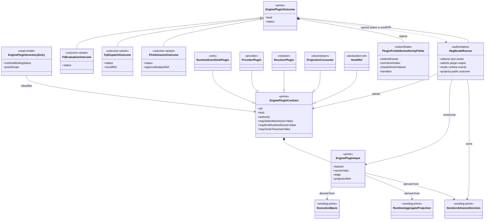

# M03/M04 Plugin Contract Model Structural Carrier Diagram

**Status**: Active
**Date**: 2026-04-26
**Derived from**: [M03_M04_PLUGIN_CONTRACT_MODEL_DERIVATION.md](./M03_M04_PLUGIN_CONTRACT_MODEL_DERIVATION.md), [M03_M04_PLUGIN_CONTRACT_MODEL_IACS.md](./M03_M04_PLUGIN_CONTRACT_MODEL_IACS.md), [T-072](../../.ai-workspace/tickets/completed/T-072-realize-typescript-abg-start-to-iterate-engine-runner.md)

## Purpose

Render the TypeScript ABG plugin boundary as one module-bounded carrier topology.

The diagram keeps ABG engine authority separate from plugin implementation scope.

## Diagram

## Boundary Review

- `EnginePluginContract`, `EnginePluginInput`, and `EnginePluginOutcome` are the
  only new prime families.
- seam-specific details stay as outcome variants or subordinate payloads.
- sink/provider/resolver/projection/declaration roles are classifications inside
  one contract model, not separate framework authority surfaces.
- `EnginePluginInventoryEntry` distinguishes runner-consumed seams from
  classified-only hook families so classification does not overclaim runtime
  migration.
- `AbgIterateRunner` owns selection, event emission, closure, retry,
  continuation, and terminal projection.
