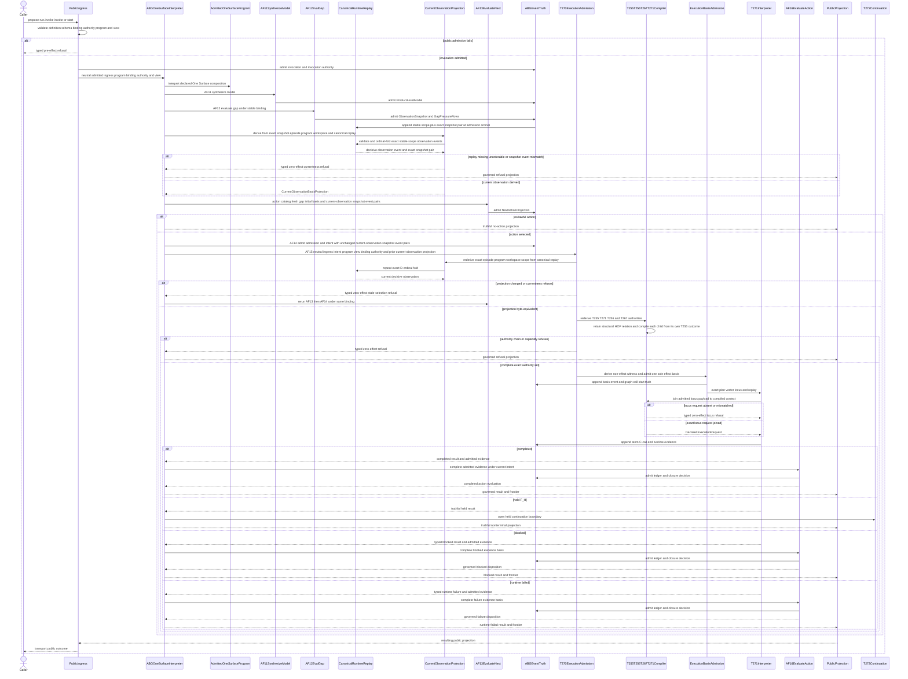
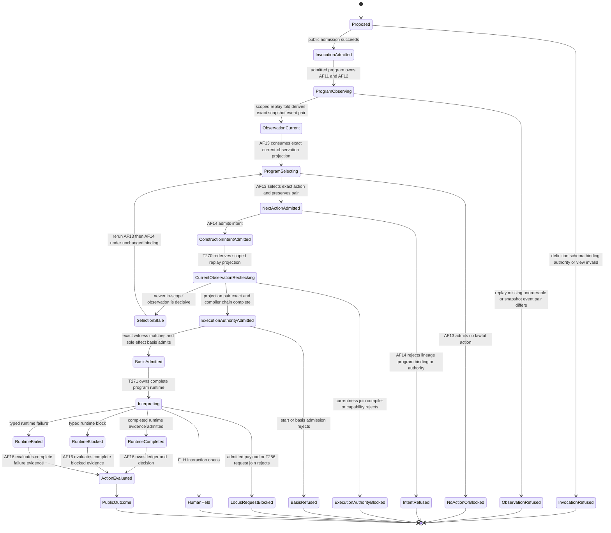

# M03-M04 Public run.invoke Authority Behavior Design

**Status**: Accepted - bounded current-observation repair authorized for implementation

**Date**: 2026-07-16

**Ticket**: `T-270`

**Ontology authority**: `ABIOGENESIS_PUBLIC_CONTROL_PLANE_ONTOLOGY.md` digest `f817a7e730bec935f053138e85cb09aa6e0f693e558eaf287be502803da20ee8`

**Method authority**: `specification_methodology/specification/standards/DESIGN_MODULE_METHOD.md`

**Prime authority**: [ADR-044](./adrs/ADR-044-prime-contraction-is-a-cross-boundary-design-gate.md)

**Bounded delta status**: `fh_accepted_for_implementation` on 2026-07-18 for
the replay-derived current-observation join after independent identity, Prime,
native-constructability, and propagation review. The previously accepted
boundary is unchanged outside this delta.

## Boundary

This design closes the generic execution-admission join after the admitted One
Surface program has selected one lawful action and AF-14 has admitted its
`ConstructionIntent`. Public ingress admits and transports one
`PublicInvocation<run.invoke>` under the exact `PublicFunctionDefinition` and
`InvocationAuthority`; it does not select, order, invoke, evaluate, or close
work.

`InvocationAuthority` is variant-specific. `invoke` carries one exact
canonical catalog-handle constraint plus the selected catalog product's
serialized input contract and request payload identity. The resolved catalog
binding separately preserves the internal GraphFunction identity and its exact
ordered non-empty input Node/schema interface; neither is inferred from the
handle string or collapsed to the first input. `start` carries the admitted program,
workspace scope, target, and stopping constraints only. A `start` packet does
not carry a hidden GraphFunction, input contract, or input payload; AF-13 and
AF-14 supply those authorities later.

The GTL program is the program. A `GraphFunction` is one callable member
published by that program. `invoke` narrows the program-derived `ActionCatalog`
to one exact member and `start` supplies scope, target, and until constraints;
both still pass AF-13 and AF-14. T-270 begins at the admitted
`ConstructionIntent` and performs only AF-15 execution admission.

T-270 verifies one exact program/function/view/binding/invocation-authority/
intent/current-observation join, consumes the immutable
T-255/T-256/T-267/T-271 compiler chain, derives one subordinate
`ProgramExecutionAuthoritySet` and one non-effect `T270StartAdmissionWitness`,
admits one sole effect-authorizing `ExecutionBasis`, and enters the T-271
interpreter. It neither mutates T-267 static truth nor creates a parallel
session, basis, current pointer, or observation store.

Completed runtime evidence returns to program-owned AF-16. Held F_H truth ends
this boundary and enters T-272. Public projection transports the resulting
truth only.

### Requirements

- `REQ-P-PUBLIC-CONTRACTS-008..010`
- `REQ-P-POLICY-019..025`, `-053..054`, and `-062..064`
- `REQ-M-GTL3-PROGRAM-TRAVERSAL-001..010`
- `REQ-R-ABG3-INTERPRET-002`, `-009..013`, and `-029..030`
- `REQ-R-ABG3-BINDING-015..018`
- `REQ-R-ABG3-FN-COMP-022..024` and `-026..027`
- the ratified public control-plane Ontology and PRODUCT One Surface contract
- T-255, T-256, T-267, and T-271 current accepted carriers

### Explicit Exclusions

- `abg.operation.catalog.invoke` or any legacy public invocation identity;
- GraphFunction, Module, catalog row, SDK, CLI, or ingress as the GTL program;
- ingress-owned model synthesis, gap evaluation, action selection, intent
  admission, runtime orchestration, action evaluation, or closure;
- direct catalog selection used as action truth or a bypass around AF-13;
- a caller-authored observation snapshot, replay cursor, replay head, current
  pointer, or freshness assertion;
- caller-authored execution authority, request, plan, frame, C-call, or basis;
- mutation of T-267 or reinterpretation of `effectsPermitted: false`;
- a compatibility, fallback, profile-free, or second start route;
- a Consensus-specific compiler, router, or runtime branch;
- T-270 capability inference or ownership of the final T-268 manifest;
- F_H response or continuation, owned by T-272; and
- direct raw interpreter result to public terminal projection.

## Ontology Slice

### Irreducible Architectural Carrier Set

| Carrier | Authority | Lifecycle role |
|---|---|---|
| `PublicFunctionDefinition<run.invoke>` | public contract family | Defines the one `invoke | start` operation family and its closed schema coordinates. |
| `PublicInvocation<run.invoke>` | public ingress admission | Carries admitted operator input only. |
| `InvocationAuthority<run.invoke>` | operation-indexed admission | Immutably joins actor, grants, view, policy, steering, and authority basis. |
| `WorkspaceBinding` | stable workspace authority | Binds product/install/root/catalog authority; mutable observations do not alter it. |
| `GtlProgram` | admitted constructive program | Owns AF-11 through AF-16 ordering and publishes callable GraphFunctions. |
| `CatalogView` | narrowing catalog authority | Restricts, but cannot enlarge, the admitted program's callable universe. |
| `SerializedInputContract` | selected catalog-product contract authority | Binds the contribution's public contract identity and exact canonical schema asset. It remains distinct from the GraphFunction input Node's symbolic GTL schema ref. |
| `NextActionProjection` | AF-13 selection authority | Carries selected-or-no-action truth and exact causal basis. |
| `ConstructionIntent` | AF-14 intent authority | Admits one selected program-owned action before invocation. |
| `CompiledExecutionContextContract` | existing static locus authority | Supplies the exact payload-independent F_P or F_H context contract before start. |
| `DeclaredExecutionRequest` | existing runtime locus authority | Joins one admitted per-locus payload to its compiled context after the payload exists and before that locus may execute. |
| `TraversalExecutionAdmissionRuntimeAddressable` | T-267 static authority | Proves whole-program/result/capability structure while remaining no-effect truth. |
| `ExecutionBasis` | ABG runtime basis | Governs one admitted execution spine and current replay truth. |
| `BasisAdmittedEvent` | canonical replay authority | Records the one admitted basis and closed subordinate seed. |
| `EngineIterateResult` | event-backed runtime outcome | Preserves completed, held, blocked, and runtime-failed truth. |

### Subordinate Payload

- `ProgramExecutionAuthoritySet` derived from exact upstream authorities;
- one sealed `AdmittedRunInvokeExecutionIngress` neutral M03 projection of the
  admitted public packet; it contains no selection or effect authority;
- ordered vector/locus authority rows;
- T-255 `GraphVectorExecutionHandoffOutcome`;
- T-271 `CompiledCProgramPlan`;
- T-256 compiled execution-context contracts and result-authority projections;
- one `CurrentObservationBasisProjection` derived from the current canonical
  replay and exact admitted snapshot; it is not a basis, authority, selector,
  event, store, or mutable pointer;
- one non-effect `T270StartAdmissionWitness` that never mutates T-267;
- exact catalog, program, binding, intent, compiler-chain, and capability
  digests; and
- one closed execution-basis replay seed.

These values are selected only through their owning primes. None becomes a
public/session/controller authority or independently selectable registry.

### Authority And Function Derivation

```text
PublicFunctionDefinition<run.invoke>
  -> PublicInvocation + InvocationAuthority + WorkspaceBinding
  -> admitted GtlProgram + narrowing CatalogView
  -> AF-11 synthesizeModel
  -> AF-12 ConstructionObservationSnapshot + materialized event
  -> replay-derived CurrentObservationBasisProjection
  -> AF-13 NextActionProjection bound to that projection
  -> AF-14 ConstructionIntent
  -> T-270 re-derives the same CurrentObservationBasisProjection
  -> T-270 exact authority and current-observation join
  -> T-255/T-271/T-256/T-267 compiler chain
  -> subordinate T270StartAdmissionWitness
  -> one sole effect-authorizing ExecutionBasis
  -> AF-15 T-271 interpretation
  -> held truth to T-272 | admitted evidence to AF-16
  -> public projection
```

T-270 owns only the authority join, start-admission-witness derivation, basis
admission, and AF-15 entry. The admitted program owns the sequence. AF-11,
AF-12, AF-13, AF-14, and AF-16 remain distinct authorities.

### Current-Observation Ontology Delta

This bounded slice projects the parent Ontology's existing
`ObservationSnapshot`, `RuntimeEventLog`, `WorkspaceBinding`,
`NextActionProjection`, and `ConstructionIntent` entities. It adds no product
entity, public operation, event kind, mutable current pointer, or selection
authority.

`CurrentObservationBasisProjection` is a module-local, downstream-only value.
Despite its name, it is not an `ExecutionBasis` or `WorkspaceAuthorityBasis`.
It binds the decisive already-admitted observation event to the exact immutable
snapshot consumed by AF-13 within one stable episode/program/workspace scope.
Its constructor and carrier remain M03-internal and absent from public package
exports, schemas, operation definitions, and catalog rows.

| Projection field | Exact source | Law |
|---|---|---|
| `projectionRef`, `projectionDigest` | canonical digest of every field below | Any changed field produces a different projection; no field is inferred from a string. |
| `episodeId` | AF-12 observation episode | Bounds one constructive episode; unrelated episodes cannot stale it. |
| `workspaceBindingRef`, `workspaceBindingDigest` | admitted `WorkspaceBinding` carried by neutral execution ingress and AF-14 | Stable authority only; replay cannot select or mutate it. |
| `admittedProgramRef`, `admittedProgramDigest` | accepted One Surface program binding | Bounds the AF-12/AF-13/AF-14 chain; unrelated programs cannot stale it. |
| `observationId`, `snapshotDigest` | full normalized admitted `ConstructionObservationSnapshot` | `observationId` remains the sole snapshot ref. The digest covers every other normalized snapshot field. No `snapshotRef` alias exists. |
| `materializedEventRef`, `materializedEventDigest`, `materializedEventAdmissionOrdinal` | decisive canonical `construction_observation_snapshot_materialized` event | `materializedEventRef` is the canonical `eventId`. The event carries the exact `observationId`/`snapshotDigest` pair and stable scope. Admission ordinal, never array position, event time, iteration, or event sequence, decides currentness. |

The existing materialization event gains no new authority or lifecycle. Its
payload must retain the exact `observationId` and add the exact `snapshotDigest`,
`workspaceBindingRef`, `workspaceBindingDigest`, `admittedProgramRef`, and
`admittedProgramDigest` that it records. Those fields are additional admitted
content on the existing event family, not a new event or basis constituent.
The old `consequenceConstructionPreludeEvents` emitter cannot construct that
stable scope from its legacy `ExecutionBasis`; T-270 retires that emitter from
the One Surface path. Its replacement consumes the same neutral admitted
workspace/program projection used by AF-12. Optional, inferred, or synthetic
scope fields are forbidden.

The derivation consumes the exact admitted workspace binding and program, one
episode id, one admitted snapshot, and canonical replay. It performs this
closed F_D fold:

1. validate runtime events and order the complete replay with
   `sortReplayByAdmissionOrdinalFailClosed`; missing or colliding admission
   ordinals fail closed;
2. filter observation-materialized events by the exact supplied
   `episodeId + admittedProgramRef/digest + workspaceBindingRef/digest` stable
   scope, never by the proposed `observationId`/`snapshotDigest`;
3. choose the scoped event with the greatest admission ordinal, so a later
   snapshot in the same scope invalidates an earlier AF-13 result while an
   unrelated workspace, program, or episode does not;
4. recompute the full normalized snapshot digest and full canonical event
   digest, then require the decisive event's snapshot pair and stable scope to
   equal the supplied values exactly; require the snapshot episode and
   `basisRef` to equal the supplied episode and workspace-binding ref; and
5. return the frozen projection without appending an event or authorizing an
   effect.

The projection is first derived after AF-12 and supplied to AF-13.
`TargetObligationBinding` preserves only the existing snapshot identity
(`snapshotRef == observationId`) plus `snapshotDigest`.
`NextActionProjection` seals those target-binding digests and the one
`CurrentObservationBasisProjection` ref/digest. AF-14 admission and its admitted
intent preserve the exact `NextActionProjection` ref/digest rather than copying
the projection constituents. Immediately before AF-15 derives a witness, T-270
re-runs the same pure fold over current canonical replay. The re-derived
projection ref/digest must equal the AF-13 seal; the T-270 witness preserves
only the ingress, AF-14 admission, current-observation projection, and compiler
chain ref/digests. A later in-scope observation therefore makes
the AF-13/AF-14 pair stale and routes back through AF-13 and AF-14; it does not
create `basis_fork_detected`, rebind the workspace, or authorize AF-15 to select
another action.

#### Entity Lifecycle Completeness

| Entity | Identity | Authority owner | Declare/create | Read/project | Update/transition | Delete/retire |
|---|---|---|---|---|---|---|
| `WorkspaceBinding` | existing binding ref/digest | workspace-binding admission | existing AF-07 | consumed by AF-12 through AF-15 | immutable; another authority/product/root set is a separately admitted binding | retained as authority evidence |
| `ConstructionObservationSnapshot` | existing `observationId` plus full normalized content digest | AF-12 evaluator admission | AF-12 admits one immutable snapshot | currentness fold and AF-13 consume | a new observation creates another snapshot and invalidates dependants only | retained as evaluator evidence |
| observation-materialized event | canonical event id, admission ordinal, and full-event digest | ABG event admission | append once after snapshot admission | canonical replay fold | immutable; later event may become decisive | retained by replay law |
| `CurrentObservationBasisProjection` | content-derived projection ref/digest | no peer authority; subordinate to AF-12 event truth | pure derivation only | AF-13 consumes and AF-15 re-derives | never mutated; a changed decisive event produces another value | not persisted; discarded after the join |
| `TargetObligationBinding` | existing ref/digest over `snapshotRef == observationId`, snapshot digest, pressure, action, target, and evidence basis | AF-13 | AF-13 derives | `NextActionProjection` consumes | newer in-scope observation creates a new binding | retained as causal evidence |
| `NextActionProjection` | existing ref/digest plus one current-observation projection ref/digest and target-binding digests | AF-13 | AF-13 admits | AF-14 and AF-15 consume | newer in-scope observation makes it stale and requires re-evaluation | retained as causal selection evidence |
| `ConstructionIntent` | existing AF-14 intent identity bound transitively by the exact `NextActionProjection` ref/digest | AF-14 | admit only from exact AF-13 result | AF-15 consumes | immutable; stale observation requires a new AF-13/AF-14 result | retained as intent evidence |

#### Authority Matrix

| Function or transition | Proposer | Evaluator | Verifier | Admitter | Executor | Projector | Retirement owner |
|---|---|---|---|---|---|---|---|
| derive current observation | canonical replay plus exact admitted snapshot | M03 pure F_D replay fold | runtime-event admission, D-ordinal law, snapshot/event digest equality | none; derived read model | none | `CurrentObservationBasisProjection` | not persisted |
| AF-13 bind current observation | admitted One Surface program | AF-13 | exact current-observation projection ref/digest plus target-binding `observationId`/snapshot-digest equality | ABG next-action admission | declared AF-13 evaluator | target binding plus `NextActionProjection` | ABG replay retention |
| AF-14 preserve current observation lineage | selected AF-13 result | AF-14 admission law | exact next-action ref/digest | ABG construction-intent admission | none | admitted intent evidence | ABG replay retention |
| AF-15 currentness join | admitted One Surface program | T-270 pure F_D join | re-derived projection byte equality plus AF-13/AF-14 exact joins | T-270 start-witness admission only after success | no effect until separate `ExecutionBasis` admission | typed zero-effect refusal or subordinate witness | ABG replay retention |

#### Atomic Function And Composition Derivation

| Discovered functionality | Existing Ontology function | Realization function | Composition | Effect | Disposition |
|---|---|---|---|---|---|
| observe mutable worksite/replay truth | AF-12 `evalGap` | existing snapshot admission and observation event | existing One Surface program | governed evaluator plus event admission | retained unchanged |
| decide current admitted observation | AF-12/AF-13 causal boundary | one parameterized pure replay projection | ordinary pure fold over canonical replay | none | bounded T-270 realization delta |
| select lawful action | AF-13 `evaluateNext` | existing AF-13 result admission consumes the projection | existing One Surface program | governed evaluator/admission | retained; currentness fold cannot select |
| admit selected intent | AF-14 `admitConstructionIntent` | existing intent admission preserves projection lineage | existing One Surface program | admitted event | retained; currentness fold cannot admit |
| invoke selected callable | AF-15 `invokeGraphFunction` | exact re-derivation and join precede existing execution admission | existing One Surface program and ABG interpreter | traversal only after basis admission | T-270 owner |

## Decisions

### D1. Ingress Admits And Transports Only

Ingress validates the definition, operation variant, schema, binding,
invocation authority, program reference, view, and input. It appends admission
truth and ignites the admitted program. It never selects a catalog member,
constructs an intent, or calls the interpreter directly.

### D2. Program Membership Precedes Callable Selection

The admitted `GtlProgram` is the program. A `GraphFunction` is callable only
when the program publishes it and the `CatalogView` retains it. `invoke` may
constrain AF-13's candidate universe to one exact member; that constraint never
establishes current eligibility or selection by itself.

The admitted catalog contribution structurally joins two deliberately distinct
identities: its `sourceContractRef` names the owning product's published
serialized contract row, while the selected GraphFunction input Node retains
its symbolic GTL `schema.ref`. The exact admitted Module/GraphFunction binding
proves that association. Runtime admission shall not equate the two strings or
author a second mapping. ABIogenesis' installed manifest supplies runtime
profile authority; the selected contribution owner's independently bound
manifest supplies the serialized input contract.

For `start`, ingress preserves only `scope + target + until` and the narrowing
view. `next` has no selected member, and `asset:<handle>` remains an unresolved
operator-asset constraint until the admitted program's ownership registry and
AF-13 resolve it. Neither case may receive a synthetic root payload identity.
An admitted empty narrowing view remains lawful for `start` so AF-13 can emit
truthful no-action; `invoke` still requires its canonical handle to resolve to
exactly one retained callable member.

### D3. One Surface Handoff Is Mandatory

T-270 requires an admitted AF-13 `NextActionProjection` and matching AF-14
`ConstructionIntent`. AF-13 must carry the exact
`CurrentObservationBasisProjection` ref/digest derived after AF-12. AF-15
re-derives that projection from current canonical replay and admits no witness
unless it is byte-equivalent. The program, selected action, function, stable
workspace binding, invocation authority, observation event, replay cursor,
lineage, and current causal basis must match exactly. Missing, stale, mutated,
unorderable, or cross-program values refuse before effect.

For `invoke`, the exact member constraint narrows only the AF-13 action catalog;
the current-observation fold and AF-13/AF-14 currentness rules remain mandatory.
For `start`, `next | graph_function | asset` target constraints likewise enter
AF-13 and cannot become an observation, selection, intent, root payload, or
execution authority. Both variants derive AF-11/AF-12 truth, bind the same
current-observation projection in AF-13, admit AF-14, and recheck it at AF-15.

Until the neutral projection and AF-13 carrier join exist, AF-15 stops with
`semantic_not_realized` and
`gap://abg/t270/current-observation-basis-projection`. Missing decisive replay,
ordinal collision, snapshot/event mismatch, or a newer observation becomes a
typed zero-effect currentness refusal after realization. None permits an old
snapshot fallback, caller assertion, array-order choice, or synthetic current
pointer.

### D4. Compilation Is Complete Before Effects

For each selected GraphVector, T-270 re-derives the accepted compiler chain:

```text
T-255 GraphVectorExecutionHandoffOutcome
  -> T-271 CompiledCProgramPlan
  -> T-256 CompiledExecutionContextContract and result authority per locus
  -> T-267 TraversalExecutionAdmissionRuntimeAddressable
  -> ordered vector/locus rows
```

A structural HOF wrapper is not an executable T-255 subject. T-270 recompiles
its existing `CompiledHofFanOutRelation`, retains the wrapper only as structural
relation truth, and follows its exact child ref/digest. The executable child
then compiles as its own subject from its own T-255 outcome. Parent workflow or
HOF loci keep only their structural result authority; they never borrow or
duplicate a child's execution context.

All payload-independent rows compile before start admission. A concrete
`DeclaredExecutionRequest` cannot compile for a child locus until its parent
output has been admitted as that locus's input payload. T-271 therefore reaches
the locus with the admitted payload; T-256 joins that payload to the already
compiled `CompiledExecutionContextContract`; and the atom executor refuses
unless the exact request exists before that locus's effect. Missing, duplicate,
reordered, cross-vector, cross-locus, stale, or incomplete static authority
refuses before start. Missing or mismatched per-locus payload/request authority
refuses before that locus's effect. Runtime progression remains replay-owned.

The current T-271 atom request carries payload and lineage refs, not an admitted
payload value carrier. The current public-ingress witness likewise carries only
invocation/binding refs and digests, not the neutral admitted runtime-authority
content required to construct `ExecutionBasis`. Until those existing Ontology
atoms receive neutral M03 projections, AF-15 ends `semantic_not_realized` with
`gap://abg/t270/admitted-locus-payload-value-projection` and
`gap://abg/t270/admitted-runtime-authority-projection`; both gaps are zero-effect
and neither permits a caller-authored substitute.

### D5. Static Admission Never Becomes Start Authority

T-267 remains exact immutable static truth with `effectsPermitted: false` and
all nonterminal closure fields unchanged. T-270 derives a subordinate
`T270StartAdmissionWitness` from the exact ConstructionIntent, program,
function, binding, invocation authority, current-observation projection,
compiler chain, and admitted capability facts. The
witness grants no effect and cannot be selected. One matching `ExecutionBasis`
admission remains the sole authority that opens AF-15.

### D6. T-271 Is The Sole Complete Interpreter

The route enters the T-271 complete C-program interpreter and its existing
seven constructors, HOF relations, and recurse semantics. There is no scalar
declared-program fallback or Consensus branch. Results remain one of
`completed | held | blocked | runtime_failed`.

Completed and blocked evidence returns to AF-16 for governed action evaluation.
Held F_H truth returns a nonterminal interaction boundary for T-272. No adapter
creates closure from interpreter output.

### D7. Binding And Invocation Authority Are Exact

Every execution invocation has exactly one immutable `WorkspaceBinding` and
one operation-indexed `InvocationAuthority`. Actor, grants, program view,
policy, steering, provenance, and authority basis must match. Steering may
narrow but cannot grant. A newer `ObservationSnapshot` under the same binding
does not fork the binding or execution basis. It invalidates only the dependent
`CurrentObservationBasisProjection`, `NextActionProjection`, and
`ConstructionIntent`; AF-13 and AF-14 must run again before AF-15. A changed
workspace binding remains a separately admitted identity and cannot be
reconstructed from observation truth.

### D8. Capability Admission Is Independent

Focused T-270 proof uses a minimal generic admitted capability definition,
grant, and manifest fixture. Missing or incompatible capability blocks before
effect. T-270 cannot infer capability from function names or own the final
tenant manifest. T-268 aggregates the final manifest downstream.

### D9. The 5.0 Boundary Is A Hard Break

The accepted path has one operation family, one admitted program authority,
one selection authority, one intent authority, one compiler chain, one
non-effect start witness, and one sole effect-authorizing `ExecutionBasis`.
Legacy operations, schemas, SDK rows, CLI rows, compatibility branches, and
profile-free fallback are removed rather than adapted.

AF-15 has one admitted input surface. It consumes the neutral
`AdmittedRunInvokeExecutionIngress`, exact program binding, AF-13 projection,
AF-14 admission, current canonical replay/runtime scope, and admitted payload
and runtime-authority projections. Raw `StartIntent`, `inputBindings`,
`inputValue`, catalog selection rows, allowed-entry arrays, caller-supplied
workspace/program refs, observation snapshots, replay cursors, execution
bindings, plans, witnesses, and bases are not alternate AF-15 inputs. Their
absence is part of the 5.0 hard-break proof, not a compatibility gap.

## Prime Contraction Review

```json prime-contraction
{
  "schemaVersion": 1,
  "iacs": [
    "PublicFunctionDefinition",
    "PublicInvocation",
    "InvocationAuthority",
    "WorkspaceBinding",
    "GtlProgram",
    "CatalogView",
    "ConstructionObservationSnapshot",
    "ConstructionObservationSnapshotMaterializedEvent",
    "NextActionProjection",
    "ConstructionIntent",
    "CompiledExecutionContextContract",
    "DeclaredExecutionRequest",
    "TraversalExecutionAdmissionRuntimeAddressable",
    "ExecutionBasis",
    "BasisAdmittedEvent",
    "EngineIterateResult"
  ],
  "authoritativeCarriers": [
    "PublicFunctionDefinition",
    "PublicInvocation",
    "InvocationAuthority",
    "WorkspaceBinding",
    "GtlProgram",
    "CatalogView",
    "ConstructionObservationSnapshot",
    "ConstructionObservationSnapshotMaterializedEvent",
    "NextActionProjection",
    "ConstructionIntent",
    "CompiledExecutionContextContract",
    "DeclaredExecutionRequest",
    "TraversalExecutionAdmissionRuntimeAddressable",
    "ExecutionBasis",
    "BasisAdmittedEvent",
    "EngineIterateResult"
  ],
  "subordinatePayloads": [
    "ProgramExecutionAuthoritySet",
    "AdmittedRunInvokeExecutionIngress",
    "VectorExecutionAuthorityRow",
    "LocusExecutionAuthority",
    "GraphVectorExecutionHandoffOutcome",
    "CompiledHofFanOutRelation",
    "CompiledCProgramPlan",
    "CurrentObservationBasisProjection",
    "T270StartAdmissionWitness",
    "execution-basis replay seed"
  ],
  "promotionTests": [
    {"candidate": "PublicFunctionDefinition", "verdict": "promote", "reason": "The versioned public contract is independently admitted and projected across schema, SDK, CLI, and runtime ingress."},
    {"candidate": "PublicInvocation", "verdict": "promote", "reason": "The admitted request has an independent lifecycle before One Surface interpretation."},
    {"candidate": "InvocationAuthority", "verdict": "promote", "reason": "Runtime admission independently pattern-matches the exact actor, grants, view, policy, steering, and authority basis."},
    {"candidate": "WorkspaceBinding", "verdict": "promote", "reason": "The immutable binding independently governs workspace, product, root, and catalog authority."},
    {"candidate": "GtlProgram", "verdict": "promote", "reason": "ABG interprets this independently admitted constructive carrier and verifies its member functions."},
    {"candidate": "CatalogView", "verdict": "promote", "reason": "The narrowing view is independently identified and checked before selection and invocation."},
    {"candidate": "ConstructionObservationSnapshot", "verdict": "promote", "reason": "The existing AF-12 snapshot independently admits immutable mutable-worksite and replay observation truth under stable authority."},
    {"candidate": "ConstructionObservationSnapshotMaterializedEvent", "verdict": "promote", "reason": "The existing replay event independently records the exact snapshot identity at one canonical admission ordinal."},
    {"candidate": "NextActionProjection", "verdict": "promote", "reason": "AF-13 independently admits selected-or-no-action truth and its causal basis."},
    {"candidate": "ConstructionIntent", "verdict": "promote", "reason": "AF-14 independently admits the selected program-owned action before invocation."},
    {"candidate": "CompiledExecutionContextContract", "verdict": "promote", "reason": "Each declared F_P or F_H locus independently owns one payload-free static context contract before start."},
    {"candidate": "DeclaredExecutionRequest", "verdict": "promote", "reason": "Each declared F_P or F_H locus independently pattern-matches one exact request only after its admitted payload exists."},
    {"candidate": "TraversalExecutionAdmissionRuntimeAddressable", "verdict": "promote", "reason": "T-267 independently admits the complete no-effect static traversal and result-authority basis."},
    {"candidate": "ExecutionBasis", "verdict": "promote", "reason": "One immutable runtime basis independently governs every interpreted advancement."},
    {"candidate": "BasisAdmittedEvent", "verdict": "promote", "reason": "Canonical replay independently reconstructs and verifies the admitted execution basis."},
    {"candidate": "EngineIterateResult", "verdict": "promote", "reason": "The event-backed result crosses the runtime-to-evaluation boundary as a closed variant."},
    {"candidate": "AdmittedRunInvokeExecutionIngress", "verdict": "remain_subordinate", "reason": "It is the one sealed neutral projection of already-admitted public, program, binding, catalog, policy, steering, and runtime-profile truth; it cannot select, invoke, or authorize effects."},
    {"candidate": "ProgramExecutionAuthoritySet", "verdict": "remain_subordinate", "reason": "It derives from accepted intent, program, invocation, compiler, and causal-basis inputs and has no independent lifecycle."},
    {"candidate": "CurrentObservationBasisProjection", "verdict": "remain_subordinate", "reason": "It is a pure current-replay projection over existing snapshot, event, binding, and program authority; it has no independent lifecycle, admission, effect, or selector semantics."},
    {"candidate": "T270StartAdmissionWitness", "verdict": "remain_subordinate", "reason": "It proves the exact AF-15 join but grants no effect, has no independent lifecycle, and is consumed only by ExecutionBasis admission."}
  ],
  "recurrenceReview": {"status": "consume_existing", "ref": "PC-007"},
  "authoritySourceCount": {"before": 16, "after": 16},
  "authoringSourceCount": {"before": 4, "after": 1},
  "disposition": "migrate_authority",
  "ownerTicket": "T-270"
}
```

The semantic authorities remain distinct. The contraction removes separate
catalog-selection, compatibility, session, and adapter-result authoring paths;
one accepted authority chain derives every subordinate execution value.

### Prime, Goedel, And Proportionality Check

Whole-family contraction retains the existing snapshot and event authorities
and adds only one subordinate projection function. Splitting snapshot parity,
ordinal choice, AF-13 binding, or AF-15 recheck into peer carriers would create
duplicate currentness truth. Collapsing the projection into
`WorkspaceBinding`, `ExecutionBasis`, `NextActionProjection`, or
`ConstructionIntent` would let mutable observation redefine stable authority or
let one authority certify its own freshness. One pure parameterized projection
is therefore the Prime boundary.

The authority-source count remains 14 before and after. Extending one existing
event payload and carrying one derived pair through existing AF-13/AF-14/T-270
carriers creates no new semantic authority.

Native constructability is present for the bounded delta: canonical runtime
events carry event ids and admission ordinals; the existing D-ordinal helpers
fail closed on missing/colliding order; snapshot and event carriers expose the
required stable scope except for the bounded snapshot-ref/digest and
program/binding fields added to the existing materialization event; stable
canonical digest functions already exist; and AF-13/AF-14 have existing causal
carriers that can preserve the exact pair without a rival model. No new event
kind, store, scheduler, interpreter, public operation, or GTL constructor is
required.

The design remains incomplete in the Goedel sense. Its own prose and digest
cannot prove that the implementation selected the decisive canonical event,
bound the exact snapshot, removed raw AF-15 inputs, or refused before effect.
Those are implementation and source-independent negative-proof obligations.
Until they pass, the named current-observation gap remains
`semantic_not_realized`; a self-produced witness cannot close it.

The proportional defense budget follows the declared single-developer desktop
risk. High-probability malformed or stale runtime input is checked by native
shape admission, canonical digests, exact joins, and D-ordinal replay ordering.
The design does not add hostile-process tamper resistance, a durable current
pointer, replay consensus, locks, signatures, or a second archive. Any such
hardening requires separate demand and re-entry rather than entering T-270 by
precaution.

Stop conditions are finite:

- malformed snapshot or canonical event: typed zero-effect refusal;
- missing or colliding replay ordinals: typed zero-effect refusal;
- no decisive observation for the exact episode/program/workspace scope: typed zero-effect
  refusal;
- snapshot/event, program, workspace-binding, AF-13, or AF-14 mismatch: typed
  zero-effect refusal;
- newer observation under the same binding: stale selection, rerun AF-13 then
  AF-14, no rebind and no basis fork;
- changed workspace or execution authority: separately admitted binding or
  covering reprice, otherwise `basis_fork_detected`; and
- unrealized neutral projection or raw-input retirement: retain the named
  `semantic_not_realized` gap and emit no witness, basis, C-call, or effect.

## Domain Model

```mermaid
classDiagram
  direction LR
  class PublicFunctionDefinitionRunInvoke {
    <<prime>>
    +operationId run.invoke
    +variant invoke or start
  }
  class PublicInvocationRunInvoke {
    <<prime>>
    +variant
    +input
  }
  class AdmittedRunInvokeExecutionIngress {
    <<subordinate>>
    +ingressRef
    +ingressDigest
  }
  class InvocationAuthority {
    <<prime>>
    +authoritySetRef
    +authoritySetDigest
  }
  class WorkspaceBinding {
    <<prime>>
    +bindingRef
    +bindingDigest
  }
  class CanonicalRuntimeReplay {
    <<existing authoritative>>
    +eventAdmissionOrdinal
  }
  class AdmittedGtlProgram {
    <<prime>>
    +programRef
    +programDigest
  }
  class CatalogView {
    <<prime>>
    +viewRef
    +viewDigest
  }
  class ProgramOwnedGraphFunction {
    <<member>>
    +functionRef
  }
  class ConstructionObservationSnapshot {
    <<existing authoritative>>
    +observationId
    +snapshotDigest
  }
  class ConstructionObservationSnapshotMaterializedEvent {
    <<existing replay authority>>
    +eventId
    +eventAdmissionOrdinal
    +episodeId
    +observationId
    +snapshotDigest
    +admittedProgramRef
    +admittedProgramDigest
    +workspaceBindingRef
    +workspaceBindingDigest
  }
  class CurrentObservationBasisProjection {
    <<subordinate>>
    <<downstream>>
    +projectionRef
    +projectionDigest
    +episodeId
    +admittedProgramRef
    +workspaceBindingRef
    +observationId
    +snapshotDigest
    +materializedEventRef
    +materializedEventDigest
    +materializedEventAdmissionOrdinal
  }
  class TargetObligationBinding {
    <<existing AF13 carrier>>
    +snapshotRef
    +snapshotDigest
  }
  class NextActionProjection {
    <<prime>>
    +selectedActionRef
    +basisRef
    +currentObservationRef
    +currentObservationDigest
  }
  class ConstructionIntent {
    <<prime>>
    +intentRef
    +lineageRef
    +nextActionRef
    +nextActionDigest
  }
  class ConstructionIntentAdmission {
    <<existing AF14 admission>>
    +admissionRef
    +admissionDigest
    +nextActionRef
    +nextActionDigest
  }
  class ProgramExecutionAuthoritySet {
    <<subordinate>>
    +authoritySetDigest
  }
  class CompiledHofFanOutRelation {
    <<existing structural relation>>
    +childGraphFunctionRef
    +childGraphFunctionDigest
  }
  class VectorExecutionAuthorityRow {
    <<subordinate>>
    +vectorIndex
  }
  class LocusExecutionAuthority {
    <<subordinate>>
    +programLocusRef
    +resultAuthorityRef
  }
  class CompiledExecutionContextContract {
    <<prime>>
    +contractRef
  }
  class DeclaredExecutionRequest {
    <<prime>>
    +requestRef
  }
  class TraversalExecutionAdmission {
    <<prime>>
    +effectsPermitted false
  }
  class AdmittedResultAuthority {
    <<existing locus authority>>
    +resultContractRef
    +resultAuthorityDigest
  }
  class T270StartAdmissionWitness {
    <<subordinate>>
    +joinDigest
    +currentObservationRef
    +currentObservationDigest
    +intentAdmissionRef
    +intentAdmissionDigest
  }
  class ExecutionBasis {
    <<prime>>
    +basisId
  }
  class BasisAdmittedEvent {
    <<prime replay authority>>
    +basisId
    +authoritySetDigest
  }
  class T271Interpreter {
    <<authoritative>>
  }
  class EngineIterateResult {
    <<prime>>
    +disposition
  }
  class OneSurfaceActionEvaluation {
    <<AF16>>
  }
  class PublicProjection {
    <<transport>>
  }
  class T272Continuation {
    <<downstream>>
  }

  PublicFunctionDefinitionRunInvoke --> PublicInvocationRunInvoke : governs
  PublicInvocationRunInvoke --> AdmittedRunInvokeExecutionIngress : projects neutral ingress
  PublicInvocationRunInvoke --> InvocationAuthority : requires exact
  PublicInvocationRunInvoke --> WorkspaceBinding : requires exact
  PublicInvocationRunInvoke --> AdmittedGtlProgram : names admitted
  AdmittedRunInvokeExecutionIngress --> InvocationAuthority : preserves exact
  AdmittedRunInvokeExecutionIngress --> WorkspaceBinding : preserves exact
  AdmittedRunInvokeExecutionIngress --> AdmittedGtlProgram : preserves exact
  AdmittedGtlProgram *-- ProgramOwnedGraphFunction : publishes member
  CatalogView --> ProgramOwnedGraphFunction : narrows
  WorkspaceBinding --> ConstructionObservationSnapshot : stable authority for
  CanonicalRuntimeReplay *-- ConstructionObservationSnapshotMaterializedEvent : retains ordered
  ConstructionObservationSnapshot --> CurrentObservationBasisProjection : full content binds
  ConstructionObservationSnapshotMaterializedEvent --> CurrentObservationBasisProjection : decisive event derives
  WorkspaceBinding --> CurrentObservationBasisProjection : stable join only
  AdmittedGtlProgram --> CurrentObservationBasisProjection : bounds AF12 chain
  CurrentObservationBasisProjection --> TargetObligationBinding : AF13 preserves pair
  TargetObligationBinding --> NextActionProjection : contributes exact selection basis
  CurrentObservationBasisProjection --> NextActionProjection : AF13 binds ref and digest
  NextActionProjection --> ConstructionIntentAdmission : AF14 admits exact pair
  ConstructionIntentAdmission *-- ConstructionIntent : owns admitted intent
  ConstructionIntent --> ProgramOwnedGraphFunction : binds selected member
  ConstructionIntent --> InvocationAuthority : binds
  ConstructionIntent --> WorkspaceBinding : binds
  ConstructionIntent --> ProgramExecutionAuthoritySet : derives exact join
  ConstructionIntentAdmission --> T270StartAdmissionWitness : preserves exact pair
  ProgramExecutionAuthoritySet --> CompiledHofFanOutRelation : follows structural child
  CompiledHofFanOutRelation --> ProgramOwnedGraphFunction : resolves executable child
  ProgramExecutionAuthoritySet *-- VectorExecutionAuthorityRow : owns ordered
  VectorExecutionAuthorityRow *-- LocusExecutionAuthority : owns ordered loci
  LocusExecutionAuthority --> CompiledExecutionContextContract : references when declared
  LocusExecutionAuthority --> AdmittedResultAuthority : references exact result
  VectorExecutionAuthorityRow --> TraversalExecutionAdmission : references
  ProgramExecutionAuthoritySet --> T270StartAdmissionWitness : derives exact witness
  CurrentObservationBasisProjection --> T270StartAdmissionWitness : rederived current join
  AdmittedRunInvokeExecutionIngress --> T270StartAdmissionWitness : sole neutral ingress
  T270StartAdmissionWitness --> ExecutionBasis : required by admission
  ExecutionBasis --> BasisAdmittedEvent : emits once
  ExecutionBasis --> T271Interpreter : scopes
  T271Interpreter --> DeclaredExecutionRequest : joins admitted locus payload before effect
  CompiledExecutionContextContract --> DeclaredExecutionRequest : governs runtime join
  T271Interpreter --> EngineIterateResult : emits event truth
  EngineIterateResult --> OneSurfaceActionEvaluation : evidence to AF16
  EngineIterateResult ..> T272Continuation : held only
  OneSurfaceActionEvaluation --> PublicProjection : projects
```



## Execution Sequence



## Lifecycle State Model



`ProgramSelecting` and `ActionEvaluated` are One Surface-owned. T-270 begins at
`ConstructionIntentAdmitted`; `HumanHeld` is T-272 input.

## Cross-View Axiom Evaluation

| Axiom | Domain evidence | Sequence evidence | State evidence | Native/admission enforcement | Design verdict |
|---|---|---|---|---|---|
| A1 admitted GtlProgram is the program; GraphFunction is a member callable | program owns member | ABG interprets admitted program after ingress handoff | ProgramSelecting | nominal program/member types and membership admission | pending implementation |
| A2 invoke and start share run.invoke and neither bypasses AF-13 | one definition family | both enter Program then Next | ProgramSelecting required | closed variant plus ActionCatalog constraint | pending implementation |
| A3 AF-13 and AF-14 precede T-270 | projection and intent primes | Next then Events then T270 | T270 begins at ConstructionIntentAdmitted | exact causal refs and digest admission | pending implementation |
| A4 caller and ingress own no runtime, evaluation, or closure authority | transport-only projection | ingress hands admitted truth to ABG and later transports its projection | Proposed cannot enter runtime without ABG program interpretation | public request excludes private carriers | pending implementation |
| A5 every execution invocation has one immutable binding | WorkspaceBinding prime; current-observation projection subordinate | exact binding scopes observation fold and passes once | newer observation returns to AF13 without rebind; authority mutation refuses | binding digest; observation excluded from binding identity | pending implementation |
| A6 InvocationAuthority is exact and steering grants nothing | exact authority-set prime | validated before program | mutation refuses | closed constituent set and narrowing law | pending implementation |
| A7 every executable vector and locus uses the exact compiler chain | ordered subordinate rows retain payload-free T256 contracts and result authority; structural HOF wrappers retain relation truth only | compiler rederives static rows before start, resolves structural child identity, and compiles each child from its own T255 outcome; T271 joins admitted payload at the locus before effect | incomplete static chain blocks start; structural wrappers cannot borrow child contexts; missing request blocks the locus | T255/T271/T256/T267 digest checks, exact HOF relation recompilation, subject/context ownership checks, and per-locus request admission | pending implementation |
| A8 T-267 and the T-270 witness remain no-effect; only ExecutionBasis authorizes execution | static admission plus subordinate witness | witness then basis admission follows complete chain | authority join and basis states remain separate | immutable T267, nominal witness, and sole basis admission | pending implementation |
| A9 one ExecutionBasis and basis event govern runtime | one basis prime | one admission before T271 | no parallel session state | basis digest and replay event uniqueness | pending implementation |
| A10 capability is separately admitted; T-268 is downstream | no manifest prime added | generic fixture checked before start | missing capability blocks | exact definition grant manifest compatibility | pending implementation |
| A11 T-271 alone interprets; AF-16 evaluates evidence; T-272 owns held continuation | distinct interpreter/result/evaluator | explicit branch after runtime | HumanHeld and ActionEvaluated separate | closed result variants and owner-specific APIs | pending implementation |
| A12 hard break leaves zero legacy operations, fallback, or parallel register | one definition/program/basis path | no compatibility branch | no compatibility state | generated operation family and negative scans | pending implementation |
| A13 AF-15 consumes only the latest admitted in-scope observation pair | existing snapshot/event authority plus subordinate local projection | AF12 event, AF13 pair propagation, AF14 preservation, AF15 ordinal re-derivation | ObservationCurrent, SelectionStale, and ObservationRefused are distinct; unrelated scopes do not transition this invocation | full snapshot/event digests, exact episode/program/workspace scope, canonical D-ordinal fold, and no caller-current input | pending implementation |

## Proof Contract

1. `run.invoke` `invoke` and `start` share one definition and admission; exact
   function constraint still passes AF-13.
2. Cross-program function, nonmember, outside-view, noncallable, stale program,
   and stale view refuse with zero effects.
3. Missing, stale, or mutated `NextActionProjection` or `ConstructionIntent`,
   and any caller-injected request, plan, admission, start witness, frame,
   C-call, or execution basis, refuses with zero effects.
4. Exact `InvocationAuthority` succeeds; actor, grant, policy, steering,
   provenance, and authority-basis mutations refuse; steering cannot widen.
5. A newer `ObservationSnapshot` under one binding succeeds; a changed binding
   constituent requires new binding/reprice. A newer in-scope observation after
   AF-14 makes the old AF-13/AF-14 pair stale and reruns them, while a newer
   event for another workspace, program, or episode does not stale the pair.
6. `observationId` remains the sole snapshot ref and its full-content
   `snapshotDigest` enters `TargetObligationBinding`. One
   `CurrentObservationBasisProjection` owns the complete snapshot/event/scope
   seal; `NextActionProjection` carries only that projection ref/digest plus
   target-binding digests; AF-14 carries the exact next-action ref/digest; and
   `T270StartAdmissionWitness` carries the exact current projection and AF-14
   admission ref/digests without copying their constituents.
7. Missing materialization, missing admission ordinal, ordinal collision,
   snapshot/event digest mutation, stable-scope mutation, and selecting latest
   by array order all refuse before witness, basis, C-call, or effect.
8. The exact compiler chain derives a non-effect start-admission witness while
   T-267 remains byte-equivalent and no-effect; only the matching
   `ExecutionBasis` admission authorizes runtime effects.
9. Omission, duplication, reorder, cross-vector, cross-locus, stale handoff,
   stale plan, stale context, and stale result authority refuse before effect.
10. A non-Consensus mixed/nested program and unchanged Consensus program use the
   same compiler and interpreter, preserving C-plan, fan-out, fan-in, and recurse
   identity.
11. A generic capability fixture succeeds; missing or incompatible capability
   blocks without a T-268 final-artifact dependency.
12. `completed | held | blocked | runtime_failed` remain distinct; held emits no
    auto-response and completed evidence reaches AF-16.
13. Re-admitting the same basis/replay truth is byte-equivalent and creates no
    second receipt, session, or basis store.
14. AF-15 exposes no raw `StartIntent`, `inputBindings`, `inputValue`, catalog
    selection, allowed-entry list, workspace/program ref, observation snapshot,
    replay cursor, execution binding, plan, witness, or basis input.
15. T-270 hard-break scans plus focused semantic, GTL, packed, publication,
    governance, Prime, and design gates prove old `catalog.invoke`, second-start
    and profile-free fallbacks, and their old schemas, SDK rows, and CLI rows
    are absent. T-272 owns the `run.resume` and `fh.*` hard break.

## Design Verdict

`fh_accepted_for_implementation`. The previously accepted T-270 boundary
remains valid outside this bounded current-observation repair. Runtime work is
authorized only within the corrected one-identity, 16-to-16 Prime-conserved,
replay-derived currentness boundary and still requires independent closure
review.
