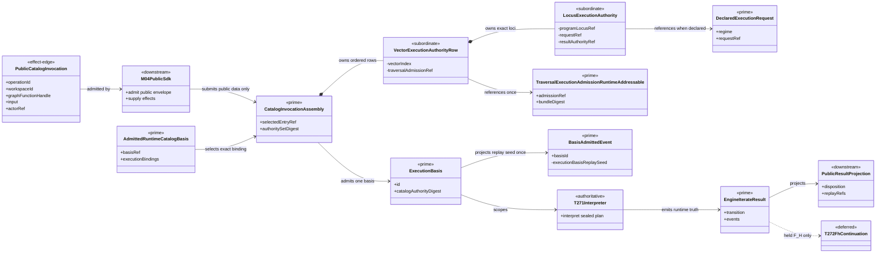
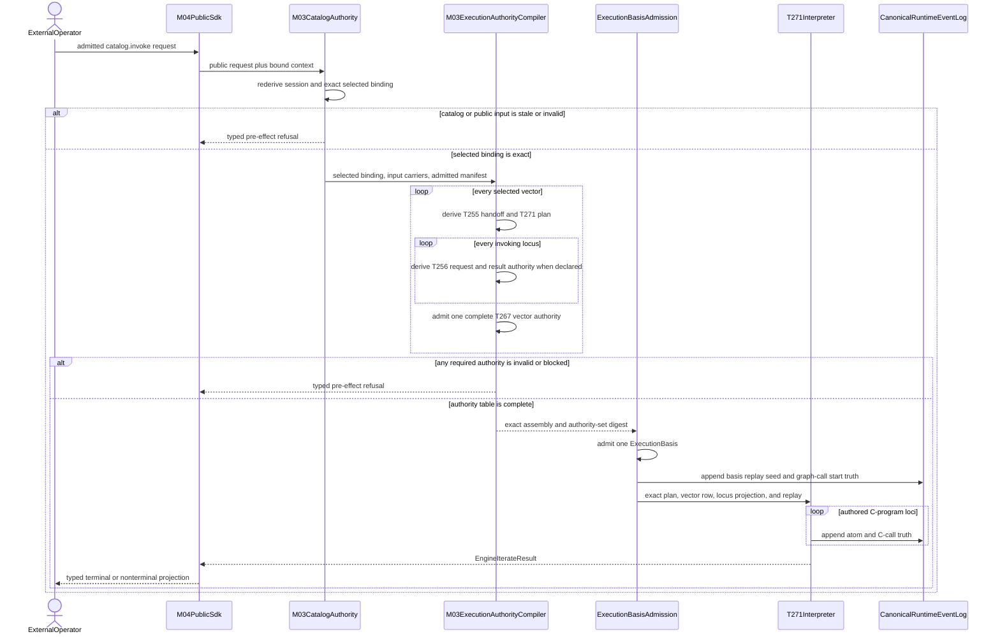
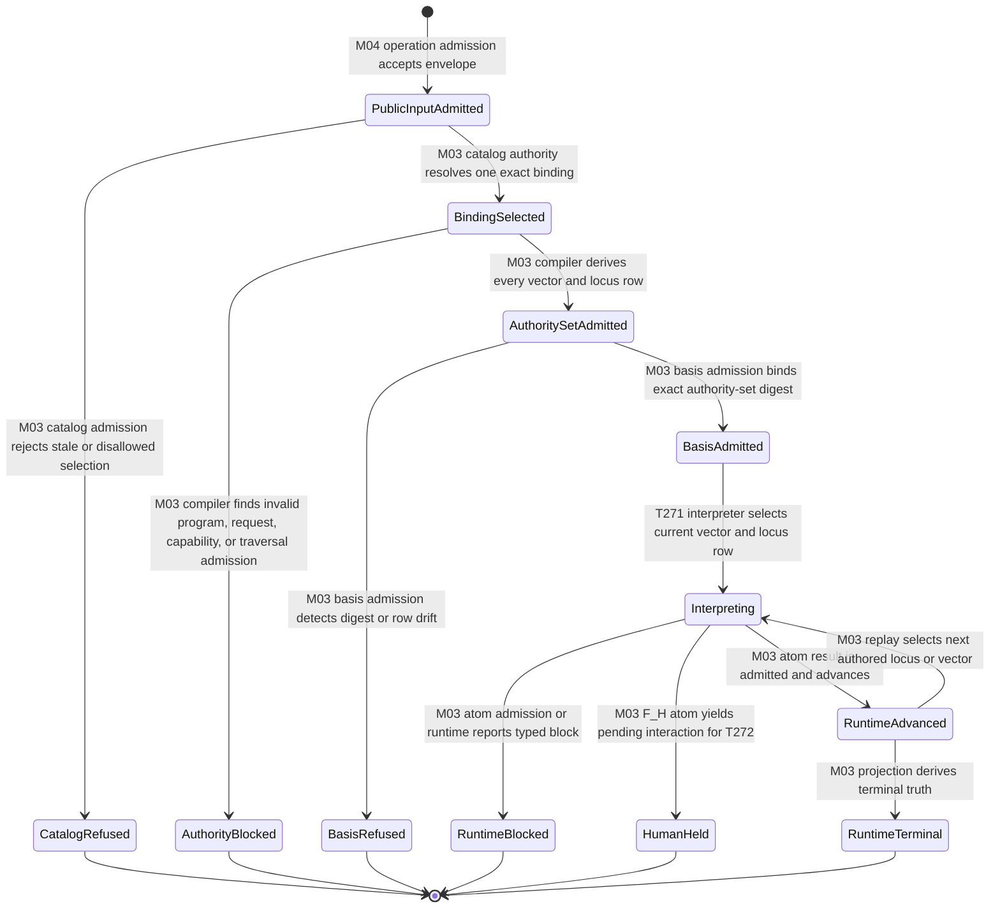

# M03-M04 Public Catalog Invocation Authority Behavior Design

**Status**: Candidate for PC-007 review
**Date**: 2026-07-15
**Ticket**: `T-270`
**Method authority**: `specification_methodology/specification/standards/DESIGN_MODULE_METHOD.md` section 5E
**Prime authority**: [ADR-044](./adrs/ADR-044-prime-contraction-is-a-cross-boundary-design-gate.md)

## Boundary

This design closes the supported path from one admitted public
`abg.operation.catalog.invoke` request to the existing ABG runtime. M04 admits
the public request and supplies effects. M03 alone resolves the selected
catalog entry, derives all execution authorities, admits one execution basis,
and starts interpretation.

The selected GraphFunction may contain several GraphVectors and several
invoking C-program loci. Therefore the route cannot lawfully carry one
caller-selected `DeclaredExecutionRequest` and one
`TraversalExecutionAdmissionRuntimeAddressable`. M03 derives one ordered
authority row per applicable vector; each row contains the exact request and
result-authority projection for every invoking locus in that vector before
effects. Those rows remain subordinate payload inside the existing
`CatalogInvocationAssembly`; they do not become a second execution-basis or
session family.

### Requirements

- `REQ-P-POLICY-019..025`, `-033`, and `-041..046`
- `REQ-P-PUBLIC-CONTRACTS-003`, `-008..010`
- `REQ-M-GTL3-PROGRAM-TRAVERSAL-004..005`, `-011`
- `REQ-R-ABG3-FN-COMP-015`, `-021..024`
- `REQ-R-ABG3-INTERPRET-006`, `-010`, and `-027`
- ADR-043 runtime basis and transition ownership
- T-255, T-256, T-267, and T-271 current carriers
- T-268 exact tenant-capability manifest authority

### Explicit exclusions

- a public invocation session carrier;
- a second public start router;
- a caller-authored capability profile, execution request, prompt plan,
  traversal admission, C-program plan, frame, or C-call;
- a Consensus-specific runtime branch;
- flattening several vector/locus authorities into one aggregate stage;
- moving catalog selection, execution compilation, or event emission into M04;
- automatic F_H response or continuation consumption, owned by T-272; and
- bypassing T-268 when a selected effect requires manifest coverage.

## Irreducible Architectural Carrier Set

| Carrier | Authority | Role |
|---|---|---|
| `AdmittedRuntimeCatalogBasis` | M03 authoritative upstream | Exact installed catalog, registry, Module, and execution-binding truth. |
| `CatalogInvocationAssembly` | M03 authoritative start admission | Existing admission carrier joining one public invocation to selected catalog and derived per-vector authorities. |
| `DeclaredExecutionRequest` | M03 authoritative locus input | Existing F_P or F_H execution-context request derived for one exact invoking locus. |
| `TraversalExecutionAdmissionRuntimeAddressable` | M03 authoritative static gate | Existing T-267 whole-program, result-interface, application, and capability admission. |
| `ExecutionBasis` | M03 authoritative runtime basis | One immutable admitted basis carrying the exact assembly authority digest as subordinate facts. |
| `BasisAdmittedEvent` | M03 authoritative replay event | Existing event extended with one closed subordinate seed sufficient to re-admit the same basis from current catalog truth. |
| `EngineIterateResult` | M03 authoritative runtime outcome | Existing event-backed result returned to the public projection boundary. |

Subordinate payload remains nested in `CatalogInvocationAssembly`:

- the exact `RegistrySessionView` and `CatalogExecutionBinding`;
- ordered vector and program-locus coordinates;
- T-255 handoff and T-271 plan per vector;
- T-256 request and instruction-assembly refs per declared locus;
- one T-267 admission ref and digest per vector after all locus result
  authorities are collected;
- deterministic/no-declared-context dispositions; and
- the exact aggregate authority-set digest bound into `ExecutionBasis`; and
- one closed execution-basis replay seed projected into the existing
  `BasisAdmittedEvent`.

No subordinate row is independently selected, published, or resumed. The
engine selects a row only by current basis, vector index, and exact compiled
program locus.

## Decisions

### D1. Public ingress carries no runtime authority

M04 supplies the admitted public invocation envelope, bound workspace context,
selected public handle, input value or ref, allowlist, capability evidence,
actor attribution, and effects. It does not supply
`declaredExecutionRequest`, `traversalExecutionAdmission`, or
`instructionAssemblyStartup`.

`CatalogInvocationAssemblyInput` removes those optional authority fields from
the supported public path. Tests may not construct them as substitutes for
M03 derivation.

### D2. One selected catalog binding governs all derivation

M03 re-derives the narrowed session view and resolves exactly one
`CatalogExecutionBinding` from the admitted catalog basis. The binding's
Module and GraphFunction bytes are digest-checked before any vector work.

Every downstream handoff, C-program selection, declared execution request,
instruction plan, traversal source, result authority, conformance row, and
runtime admission derives from that same binding. A sibling catalog row cannot
authorize an internal helper or satisfy a selected-entry check.

### D3. Compilation is complete and vector-local

For every selected GraphVector, M03 applies the existing compiler chain:

```text
selected CatalogExecutionBinding
  -> T-255 GraphVectorExecutionHandoffOutcome
  -> T-271 CompiledCProgramPlan
  -> T-256 DeclaredExecutionRequest per declared invoking locus
  -> complete result-authority set for all invoking loci
  -> one T-267 TraversalExecutionAdmissionOutcome for the vector
  -> one ordered subordinate vector-authority row
```

Selector-free and deterministic vectors retain explicit structural or
deterministic rows. Missing capability, invalid program, missing declared
context, or non-runtime-addressable admission blocks the whole invocation
before effects. No row is synthesized for a missing vector or stage category.

### D4. `ExecutionBasis` remains the one runtime basis

The existing basis admission hashes the selected catalog basis ref, execution
binding digest, and ordered authority-set digest as subordinate admitted
facts. Full Module and GraphFunction values still resolve through the admitted
catalog and existing lookup authority. No `InvocationSession`,
`ConsensusExecutionBasis`, or parallel basis object is introduced.

At iteration time, M03 resolves one exact vector-authority row and then its
exact locus projection from the current vector and compiled program locus.
The runtime refuses missing, duplicate, stale, reordered, or cross-vector rows
and missing, duplicate, or cross-locus projections before invoking an atom.

### D5. The T-270 fence moves; it is not deleted

`assertTraversalExecutionRuntimeStart` retains all T-267 identity checks. Its
unconditional T-270 terminal refusal becomes an exact start admission that is
reachable only from a catalog assembly whose basis, binding, request, plan,
instruction, and traversal identities all match.

`runtime_addressable_not_closed` never means effects are already permitted.
The catalog start admission is the additional transition that permits the
interpreter to invoke one exact atom. Runtime result, closure, and
continuation remain event-owned.

### D6. T-271 is the only complete C-program interpreter

The public route invokes the T-271 structural interpreter and its retained
runtime atoms. It does not enter the legacy scalar HoG loop for a declared
C-program vector. C-program receipts are reconstructed from canonical C-call
event truth and the sealed plan; the public adapter does not persist a rival
receipt store.

Legacy entries with no execution-context profile remain a separately tagged
compatibility route through the existing engine. They cannot receive declared
authority rows or satisfy declared-program qualification.

The existing `BasisAdmittedEvent` is the one replay anchor for reconstructing
the full basis after process restart. Its subordinate replay seed records the
catalog, binding, start-intent, runtime, policy, and authority-set refs and
digests needed to re-resolve current objects and reproduce the same basis ID.
The seed is emitted once per admitted basis; downstream F_H interactions cite
that basis event rather than copying the seed.

For a profile-aware entry, the seed and authority-set digest are mandatory and
change the admitted basis identity. A basis event produced by the old partial
route cannot be resealed as current truth. Profile-free compatibility entries
may retain their existing basis form and explicitly omit the declared-program
seed; that omission cannot authorize a declared C-program or F_H resume.

### D7. F_H stops at the T-272 boundary

When the exact active row is F_H, catalog start may reach an engine-owned held
atom and pending interaction. T-270 returns that truthful nonterminal result.
It does not admit a response, resume a receipt, or continue the graph. T-272
owns those transitions.

## Prime Contraction Review

```json prime-contraction
{
  "schemaVersion": 1,
  "iacs": [
    "AdmittedRuntimeCatalogBasis",
    "CatalogInvocationAssembly",
    "DeclaredExecutionRequest",
    "TraversalExecutionAdmissionRuntimeAddressable",
    "ExecutionBasis",
    "BasisAdmittedEvent",
    "EngineIterateResult"
  ],
  "authoritativeCarriers": [
    "AdmittedRuntimeCatalogBasis",
    "CatalogInvocationAssembly",
    "DeclaredExecutionRequest",
    "TraversalExecutionAdmissionRuntimeAddressable",
    "ExecutionBasis",
    "BasisAdmittedEvent",
    "EngineIterateResult"
  ],
  "subordinatePayloads": [
    "RegistrySessionView",
    "CatalogExecutionBinding",
    "vector execution authority row",
    "locus execution authority projection",
    "instruction assembly projection",
    "catalog execution authority-set digest",
    "execution-basis replay seed"
  ],
  "promotionTests": [
    {"candidate": "AdmittedRuntimeCatalogBasis", "verdict": "promote", "reason": "Existing admitted catalog authority independently governs installed runtime resolution."},
    {"candidate": "CatalogInvocationAssembly", "verdict": "promote", "reason": "Existing explicit start-admission boundary is consumed across M04 and M03."},
    {"candidate": "DeclaredExecutionRequest", "verdict": "promote", "reason": "Existing independently admitted F_P/F_H locus request is pattern-matched by runtime."},
    {"candidate": "TraversalExecutionAdmissionRuntimeAddressable", "verdict": "promote", "reason": "Existing independently admitted static execution gate is required before effects."},
    {"candidate": "ExecutionBasis", "verdict": "promote", "reason": "Existing immutable runtime basis governs every advancement attempt."},
    {"candidate": "BasisAdmittedEvent", "verdict": "promote", "reason": "Existing authoritative event is the independently replayed admission record for one runtime basis."},
    {"candidate": "EngineIterateResult", "verdict": "promote", "reason": "Existing closed runtime outcome crosses the M03 to M04 projection boundary."}
  ],
  "recurrenceReview": {"status": "consume_existing", "ref": "PC-007"},
  "authoritySourceCount": {"before": 7, "after": 7},
  "authoringSourceCount": {"before": 7, "after": 7},
  "disposition": "consume_existing",
  "ownerTicket": "T-270"
}
```

The proportional contraction is at ingress: externally supplied runtime
authority fields on the supported public route contract from `3 -> 0` while
the seven existing semantic authorities remain distinct. Public start routes
remain `1 -> 1`; basis replay seeds remain `1 -> 1` even when a run opens more
than one F_H interaction.

## Domain Model



## Execution Sequence



## Lifecycle State Model



## Cross-View Axiom Evaluation

| Axiom | Authority | Domain evidence | Sequence evidence | State evidence | Native enforcement | Admission/compiler enforcement | Verdict | Gap owner |
|---|---|---|---|---|---|---|---|---|
| selected catalog entry is singular | PUBLIC-CONTRACTS-003; PROGRAM-TRAVERSAL-004 | one catalog basis and assembly | binding resolves before compiler | stale selection refuses | exact binding type | catalog reprojection and digest checks | pass | none |
| public caller owns no runtime authority | POLICY-044..045 | public input is effect-edge only | M04 sends no execution carriers | only M03 can enter authority states | operation request excludes private carriers | assembly rejects supplied authority fields | pass | none |
| every vector and locus is conserved | FN-COMP-015; T267 | ordered subordinate row family | compiler loops complete selected structure | missing row blocks | readonly exact rows | T255/T256/T267 recompilation | pass | none |
| one execution basis governs runtime | ADR-043 | one `ExecutionBasis` prime | basis admission precedes interpretation | no parallel session state | existing closed basis type | authority-set digest joins basis | pass | none |
| complete C programs use one interpreter | C-ALGEBRA-016; T271 | T271 is sole interpreter | declared programs route only to T271 | no legacy declared-program state | seven-constructor plan union | plan and receipt rederivation | pass | none |
| capability remains independently admitted | PUBLIC-CONTRACTS-011; T268 | manifest is upstream, not assembly-owned | compiler consumes exact manifest | absence blocks before effects | admitted manifest type | T255/T267 compatibility checks | pass | T268 publication dependency |
| F_H continuation remains separate | POLICY-031..033 | T272 is deferred boundary | start stops at held result | HumanHeld terminates this boundary | closed transition variant | T272 owns resume admission | pass | T272 |

## Proof Contract

Implementation acceptance requires:

1. a non-Consensus multi-vector fixture deriving every exact vector/locus row;
2. the unchanged T-252 Consensus body entering the same compiler and router;
3. negatives for sibling-entry authorization, omitted/duplicate/reordered rows,
   stale plan/request/admission, wrong vector or program locus, missing manifest,
   and caller-supplied execution carriers;
4. exact parity through SDK and CLI construction over existing, alternate, and
   temporary installed workspaces;
5. declared programs invoking T-271 only, with no production call to the old
   scalar declared-program route;
6. event-derived C-program replay receipts and no second receipt store;
7. no effect before catalog, program, capability, result-interface, and basis
   admission all pass; and
8. focused, semantic, GTL, packed, publication, governance, and design gates
   green from one tree.

## Migration

- profile-aware `CatalogInvocationAssembly` input fields supplied by M04 are
  removed, not deprecated as a second route;
- profile-aware basis IDs and `BasisAdmittedEvent` values are re-derived with
  the authority-set digest and closed replay seed;
- mixed old assembly plus new basis, or new assembly plus old basis event,
  fails before effects;
- profile-free legacy entries remain explicitly tagged and cannot satisfy a
  declared-program proof; and
- T-270 may implement the generic compiler/router while T-268 is open, but its
  packed installed-workspace exit cannot close until the canonical manifest is
  published and admitted.

## Design Verdict

`candidate`. The design is structurally complete and intentionally introduces
no new public carrier. Implementation remains blocked until the PC-007 review
confirms the multi-vector authority table, `ExecutionBasis` join, and T-271
production path.
