# M03-M04 Public run.invoke Authority Behavior Design

> **T-283 authority disposition (2026-07-20):**
> `invalidated_for_5_0_implementation_by_upstream_intent_reprice`. This file is
> retained as historical and current-state evidence only. Prior acceptance
> records its former basis; it does not authorize design, code, proof, Product
> scope, or closure under the T-283 candidate. Reusable local contracts must be
> re-derived under the accepted direct-GTL replacement design after T-283
> closes.

**Status**: Accepted on its recorded superseded basis; invalidated for current 5.0 implementation

**Date**: 2026-07-18

**Ticket**: `T-270`

**Ontology authority**: `ABIOGENESIS_PUBLIC_CONTROL_PLANE_ONTOLOGY.md` digest `f817a7e730bec935f053138e85cb09aa6e0f693e558eaf287be502803da20ee8`

**Method authority**: `../../../../.genesis/docs/standards/DESIGN_MODULE_METHOD.md`

**Prime authority**: [ADR-044](./adrs/ADR-044-prime-contraction-is-a-cross-boundary-design-gate.md)

**Bounded delta status**: the replay-derived current-observation join remains
`fh_accepted_for_implementation` and is realized at commit `a8a96284` on
2026-07-18. The accepted AF-15 schema-capability and AF-13/AF-14 ingress-order
boundaries remain unchanged. This amendment corrects only root-carrier
constructability: public preparation retains the canonical admitted inline
`invoke` value without a source-Node mapping, and the post-AF-14 finalizer
constructs the existing root-carrier set only after one exact selected catalog
binding supplies that mapping. Runtime implementation is authorized only within
this bounded delta. The previously accepted identity,
authority, Prime count, and public-operation boundary are unchanged.

## Boundary

This design closes the generic execution-admission join after the admitted One
Surface program has selected one lawful action and AF-14 has admitted its
`ConstructionIntent`. Public ingress admits and transports one
`PublicInvocation<run.invoke>` under the exact `PublicFunctionDefinition` and
`InvocationAuthority`; it does not select, order, invoke, evaluate, or close
work.

`InvocationAuthority` is variant-specific. `invoke` carries one exact
canonical catalog-handle constraint plus the selected catalog product's
serialized input contract and request payload identity. The resolved catalog
binding separately preserves the internal GraphFunction identity and its exact
ordered non-empty input Node/schema interface; neither is inferred from the
handle string or collapsed to the first input. `start` carries the admitted program,
workspace scope, target, and stopping constraints only. A `start` packet does
not carry a hidden GraphFunction, input contract, or input payload; AF-13 and
AF-14 supply those authorities later.

The one private asynchronous pre-AF-13 M04 preparation seam is
`preparePrivateRunInvokeExecution`. It consumes a
`BoundWorkspaceContext`, loads each exact bound product manifest through
`BoundWorkspaceContext.effects.readRecord`, and admits the existing P1
operation packet. For `invoke`, the request constraint may identify and load
one candidate public input contract's canonical `schema_asset` row under the
row's owning product root and verify the content digest before preparing one
immutable
`InstalledPublicSchemaAuthoritySet`. That set owns outer public/root input
admission only. It is not authority for graph-private symbolic Node schemas.
The preparation result is identity-free process-local data, not
`AdmittedRunInvokeExecutionIngress`; it contains no selected execution binding,
schema-admission capability basis, engine input, runtime witness, or effect
authority. It projects request constraints into AF-13 without selecting:
`invoke` contributes the one exact admitted member constraint;
`start(graph_function)` narrows through the admitted session catalog,
`start(asset)` requires the published operator-asset ownership projection and
otherwise returns its typed semantic gap, and `start(next)` retains the exact
admitted view. No target string becomes catalog execution authority.

After AF-14 selects the exact member, the private finalizer derives one ready
callable session entry from the admitted view and calls the existing
selected-entry resolver. The selected
`CatalogExecutionBinding.module.metadata` contributes exactly one
closed `abg.runtime_schema_admission_bindings` JSON-blob entry. Each admitted
row is the flat strict
`graphFunctionId + nodeRef + symbolicSchemaRef + contractId + contractVersion`
tuple. It contains no `PublicContractCoordinate`, projection digest, locator,
witness, or callable. The T-252/M03 owner source is one closed schema-key/source
family covering every reachable public or private Consensus Node schema,
including vector schemas;
the existing `moduleDigest` seals the
serialized entry because Module serialization already includes `metadata`.
There is no new typed Module field, contribution digest, or public identity.

M04 separately receives opaque existing `NativeContractDefinition` carriers,
asserts each carrier, and exact-joins
`symbolicSchemaRef + contractId + contractVersion` to one native definition
whose process-local origin is the exact source row used by the resolver. The
resolver-to-definition-to-binder association is retained opaquely; a cloned or
relabeled source row cannot bind even when its schema, locator, and checks are
structurally equal. Repeated Module rows may reuse one relation only when their
complete `symbolicSchemaRef + contractId + contractVersion` relation key is
identical. Reusing one contract id/version across divergent symbolic refs
requires one distinct exact relation per symbolic ref; current same-contract
conservation also requires the same definition carrier, but coordinate reuse
alone never admits a relation. No source row, origin token, or membership registry
is published or serialized. Only M04 imports the native contract, Valibot, public-coordinate, and
native projection-witness types. Its adapter projects one neutral M03/shared
`RuntimeSchemaAdmissionCapability` per exact catalog/module Node tuple. The capability
contains a digest-sealed structural basis made only of primitive and canonical
I-JSON-compatible coordinate/witness facts plus one undigested
`admit(IJsonValue) -> IJsonValue` function closed over the asserted native
schema. Admitted ingress receives only ordered sealed basis rows; a separate
AF-15 process-local engine-input envelope carries the capabilities. M03 asserts
the neutral carrier brand and exact-matches each capability basis one-to-one to
an admitted ingress basis and compiler Node/symbolic refs
and treats a value as admitted only through that function. The callable never
enters the basis digest, identity, persistence, replay, registry, or ambient
lookup.

The pre-AF-13 preparation seam obtains the request value only from the native
P1 `invoke` packet, admits canonical I-JSON once, and calls
`admitCatalogGraphFunctionInput` with the exact installed root schema body. It
retains that canonical admitted `IJsonValue` and the installed public schema
authority set process-locally without selecting or inventing a graph-private
source Node. P2 `inputRef` resolution is outside this seam. After AF-14, the
private finalizer derives exactly one ready callable session entry from the
selected GraphFunction within the admitted view, calls the existing
selected-entry catalog-binding resolver, verifies
AF-13/AF-14/program/view/workspace/invocation-authority equality, and derives
the selected GraphFunction's exact source interface from that binding. For
`invoke`, exactly one declared source Node constructs the existing neutral M03
`AdmittedInvocationCarrierSet` from the prepared canonical value; zero source
Nodes refuse the invoke contract and multiple source Nodes retain
`gap://abg/t270/multi-source-root-input-mapping`. Only then does the finalizer
project M04 schema capabilities and call
`admitPrivateRunInvokeExecutionIngress`. The finalizer returns one
identity-free process-local tuple
`{ ingress, selectedExecutionBinding, schemaAdmissionEngineInput }`. The sealed
carrier set, installed public schema authority set, and ordered digestible
schema-admission capability bases cross through admitted M03 ingress; raw `input`, input readers,
filesystem callbacks, and schema-admission callables do not. The branded
callables travel separately in the identity-free process-local AF-15 engine
input. `start` carries neither public root schema/body nor root carrier set.
After final ingress and the current-observation recheck, T-270 calls the M03
compiler once. That call returns the unchanged compact
`CompiledTraversalExecutionFamily` plus one private runtime projection derived
from the same drafts and names every reachable source/target symbolic Node
schema ref. M03 exact-matches those compiler-derived requirements to the
admitted bases and neutral capabilities constructed by M04 for that exact
selected binding; no Module
metadata, opaque native definition, implicit path, or string lookup crosses
that boundary.

The GTL program is the program. A `GraphFunction` is one callable member
published by that program. `invoke` narrows the program-derived `ActionCatalog`
to one exact member and `start` supplies scope, target, and until constraints;
both still pass AF-13 and AF-14. T-270 begins at the admitted
`ConstructionIntent` and performs only AF-15 execution admission.

T-270 verifies one exact program/function/view/binding/invocation-authority/
intent/current-observation join, consumes the immutable
T-255/T-256/T-267/T-271 compiler chain, derives one private
`TraversalExecutionFamilyRuntimeProjection` from the same T-267 compiler pass
as the compact family, derives one non-effect `T270StartAdmissionWitness`, and
admits one sole effect-authorizing `ExecutionBasis`. The private projection
retains the exact source input, plan, application kind, GraphVector, locus
contracts, operator projection, contexts, and result authorities needed at
runtime; it does not change the compact T-267 family or its
`effectsPermitted: false` truth.

AF-15 then uses one structure-derived program router around the existing
complete-C, structural HOF fan-out, fan-in, and typed graph-recurse runtimes.
The router returns a private closed union wrapping their actual current result
types; a separate exhaustive fold projects that union to AF-16 evidence,
T-272 held truth, or a typed nonterminal. It never asserts those heterogeneous
results are `EngineIterateResult`. T-271 retains all seven complete-C
constructors, including `C.batch` and `C.retry`. Complete-C leaf callbacks use
one generic leaf executor and the immutable invocation-local runtime-value
environment; neither owns a second C-call spine. T-270 neither mutates T-267
static truth nor creates a parallel session, basis, current pointer, payload
store, schema store, or observation store.

Completed runtime evidence returns to program-owned AF-16. Held F_H truth ends
this boundary and enters T-272. Public projection transports the resulting
truth only.

### Requirements

- `REQ-P-PUBLIC-CONTRACTS-008..010`
- `REQ-P-POLICY-019..025`, `-053..054`, and `-062..064`
- `REQ-M-GTL3-PROGRAM-TRAVERSAL-001..010`
- `REQ-L-GTL3-OPERATOR-003..005`
- `REQ-R-ABG3-INTERPRET-002`, `-009..013`, and `-029..030`
- `REQ-R-ABG3-BINDING-015..018`
- `REQ-R-ABG3-FN-COMP-022..024` and `-026..027`
- the ratified public control-plane Ontology and PRODUCT One Surface contract
- T-255, T-256, T-267, and T-271 current accepted carriers

### Explicit Exclusions

- `abg.operation.catalog.invoke` or any legacy public invocation identity;
- GraphFunction, Module, catalog row, SDK, CLI, or ingress as the GTL program;
- ingress-owned model synthesis, gap evaluation, action selection, intent
  admission, runtime orchestration, action evaluation, or closure;
- direct catalog selection used as action truth or a bypass around AF-13;
- a caller-authored observation snapshot, replay cursor, replay head, current
  pointer, or freshness assertion;
- caller-authored execution authority, request, plan, frame, C-call, or basis;
- mutation of T-267 or reinterpretation of `effectsPermitted: false`;
- a persisted payload-value store, caller-authored payload-value admission, or
  runtime-value environment promoted into semantic authority;
- raw public `input` crossing M04 into M03, schema content not loaded from the
  exact bound installed asset, or inferred decomposition across multiple input
  Nodes;
- M03 filesystem/schema reads, native Consensus decoder shortcuts,
  callback-authored schemas, or ref-to-body schema lookup;
- function-name, product-name, profile-name, or payload-shape runtime routing;
- a router- or leaf-adapter-owned C-call around an existing runtime C-call;
- a compatibility, fallback, profile-free, or second start route;
- a Consensus-specific compiler, router, or runtime branch;
- T-270 capability inference or ownership of the final T-268 manifest;
- F_H response or continuation, owned by T-272; and
- direct raw interpreter result to public terminal projection.

## Ontology Slice

### Irreducible Architectural Carrier Set

| Carrier | Authority | Lifecycle role |
|---|---|---|
| `PublicFunctionDefinition<run.invoke>` | public contract family | Defines the one `invoke | start` operation family and its closed schema coordinates. |
| `PublicInvocation<run.invoke>` | public ingress admission | Carries admitted operator input only. |
| `InvocationAuthority<run.invoke>` | operation-indexed admission | Immutably joins actor, grants, view, policy, steering, and authority basis. |
| `WorkspaceBinding` | stable workspace authority | Binds product/install/root/catalog authority; mutable observations do not alter it. |
| `ConstructionObservationSnapshot` | AF-12 admitted observation authority | Owns one immutable full-content mutable-worksite observation under the stable binding. |
| `ConstructionObservationSnapshotMaterializedEvent` | canonical replay authority | Records the exact snapshot and stable scope at one admission ordinal. |
| `GtlProgram` | admitted constructive program | Owns AF-11 through AF-16 ordering and publishes callable GraphFunctions. |
| `CatalogView` | narrowing catalog authority | Restricts, but cannot enlarge, the admitted program's callable universe. |
| `SerializedInputContract` | selected catalog-product contract authority | Binds the contribution's public contract identity and exact canonical schema asset. It remains distinct from the GraphFunction input Node's symbolic GTL schema ref. |
| `Operator` | existing GTL work declaration | Owns the exact regime and implementation binding ref at an executable graph locus; it never serializes a callable. |
| `AdmittedInvocationCarrierSet` | existing M03 input-admission carrier | After AF-14 and exact selected-binding resolution, seals the prepared canonical admitted value and that binding's exact single source Node/schema for `invoke`; it creates no selection or effect authority. |
| `NextActionProjection` | AF-13 selection authority | Carries selected-or-no-action truth and exact causal basis. |
| `ConstructionIntent` | AF-14 intent authority | Admits one selected program-owned action before invocation. |
| `CompiledExecutionContextContract` | existing static locus authority | Supplies the exact payload-independent F_P or F_H context contract before start. |
| `DeclaredExecutionRequest` | existing runtime locus authority | Joins one admitted per-locus payload to its compiled context after the payload exists and before that locus may execute. |
| `TraversalExecutionAdmissionRuntimeAddressable` | T-267 static authority | Proves whole-program/result/capability structure while remaining no-effect truth. |
| `ExecutionBasis` | ABG runtime basis | Governs one admitted execution spine and current replay truth. |
| `BasisAdmittedEvent` | canonical replay authority | Records the one admitted basis and closed subordinate seed. |
| `CompleteAdmittedEvidenceView` | AF-16 input authority | Receives only evidence admitted from the selected runtime owner's actual result; AF-15 never casts heterogeneous runtime results into a synthetic engine result. |
| `NativeContractDefinition` | existing M04 native-schema authority | Owns one opaque strict Valibot schema, exact public contract coordinate, projected schema, and source/projection witness; it is delivered process-locally and cannot be reconstructed from serialized GTL metadata. |

### Subordinate Payload

- one identity-free process-local `PreparedRunInvokeExecution` carrying the
  admitted public invocation, exact workspace/program/catalog-view joins,
  request-origin AF-13 constraints, optional invoke root schema authority, and
  optional canonical admitted invoke `IJsonValue` without a source-Node
  mapping;
  it is not final ingress and carries no selected binding, capability basis,
  runtime witness, or effect authority;
- one identity-free process-local `FinalizedRunInvokeExecution` tuple containing
  the final admitted ingress, the existing exact selected catalog execution
  binding, and the separate M04 schema-admission engine input; it adds no
  identity, digest, persistence, replay, registry, or peer authority;
- one private `TraversalExecutionFamilyRuntimeProjection` returned with the
  compact `CompiledTraversalExecutionFamily` from one shared compiler core;
- one sealed `AdmittedRunInvokeExecutionIngress` neutral M03 projection of the
  admitted public packet; for `invoke` it owns the exact sealed
  `AdmittedInvocationCarrierSet` and `InstalledPublicSchemaAuthoritySet`, plus
  ordered digestible `RuntimeSchemaAdmissionCapabilityBasis` rows only; never a
  callable, raw input, or effect callback, and contains no selection or effect
  authority; `start` carries neither root set;
- ordered `TraversalExecutionFamilyRuntimeVectorProjection` and
  `TraversalExecutionFamilyRuntimeLocusProjection` rows derived from the exact
  compiler drafts;
- one `TraversalExecutionFamilyOperatorProjection` per ordinary/workflow
  executable locus, derived from exact GraphVector operator ordinal and
  content; structural HOF wrapper loci carry `null` exactly;
- T-255 `GraphVectorExecutionHandoffOutcome`;
- T-271 `CompiledCProgramPlan`;
- T-256 compiled execution-context contracts and result-authority projections;
- one `CurrentObservationBasisProjection` derived from the current canonical
  replay and exact admitted snapshot; it is not a basis, authority, selector,
  event, store, or mutable pointer;
- one immutable invocation-local `AdmittedRuntimeValueEnvironmentProjection`,
  seeded from admitted invoke root carriers or exact admitted AF-14 source
  carriers and extended only by schema-admitted atom or child outputs; it is not
  a store, event, replay fact, or authority;
- one neutral process-local `RuntimeSchemaAdmissionCapability` per declared
  schema tuple, projected only by M04 after the exact catalog/module/Node/
  metadata/native-definition join. Each native definition must retain an opaque
  exact-origin relation to the complete source row presented to the resolver;
  structurally equal clones and coordinate relabeling refuse. Repeated Module
  rows share the relation only for an identical symbolic-ref/id/version key;
  divergent symbolic refs require distinct exact relations even when the
  contract coordinate and conserved definition carrier are the same. Its sealed basis contains only primitive and
  canonical I-JSON-compatible coordinate/witness facts; its undigested
  admission function is explicit bounded engine input. The T-252/M03 closed
  schema-key/source family derives the canonical Module's flat Consensus rows
  for every reachable public/private/vector Node schema; T-274B packages that
  exact Module and derives/supplies its opaque native definitions
  through the same M04 call site to the neutral constructor, and
  Scenario-09 supplies the same inputs for the non-Consensus proof;
- one separate undigested `RuntimeSchemaAdmissionEngineInput` envelope carrying
  those capabilities into AF-15; it is outside admitted ingress and every
  stable-hashed carrier;
- one contracts-owned, dependency-leaf
  `FhHeldExecutionCheckpointBasis` created only after T-271 admits an F_H-held
  receipt; it contains the exact cursor ref/digest, input payload/lineage refs,
  remaining primitive held coordinates, and ordered frozen canonical I-JSON
  carrier rows as subordinate content inside the existing
  `FhInteractionOpenedEvent`. Runner/T-270 adapters above contracts prove
  exact equality to `AdmittedInvocationCarrier` and
  `CProgramAtomReceipt`; contracts import neither owner. The event's existing
  `interactionBasisDigest` is the sole identity seal and covers the complete
  checkpoint content, so no checkpoint ref/digest or sibling body copy exists;
- one bounded conservation amendment to the existing T-271 atom
  request/receipt carrier: `invokeLeaf` threads the already-derived
  `CProgramExecutionCursor.cursorDigest` beside `cursorRef`, and receipt sealing
  preserves it. This adds no selector, identity, authority, or lifecycle;
- one `FdOperatorImplementationBinding` subordinate delivery row selected only
  by exact admitted `Operator.binding` and then matched to the full compiled
  stage contract required by `REQ-L-GTL3-C-ALGEBRA-010`; it is neither
  published GTL truth nor a semantic selector;
- one private `T270ProgramRouteOutcome` union wrapping
  `CProgramExecutionOutcome | CBatchResolution | HofFanInResolution |
  TypedRecurseResolution`, plus one separate exhaustive AF-15 fold;
- one non-effect `T270StartAdmissionWitness` that never mutates T-267;
- exact catalog, program, binding, intent, compiler-chain, and capability
  digests; and
- one closed execution-basis replay seed.

These values are selected only through their owning primes. None becomes a
public/session/controller authority or independently selectable registry.

### Authority And Function Derivation

```text
PublicFunctionDefinition<run.invoke>
  -> PublicInvocation + InvocationAuthority + WorkspaceBinding
  -> private async M04 process-local preparation through BoundWorkspaceContext effects
  -> invoke only: candidate public input schema body admitted without granting selection
  -> invoke only: admitCatalogGraphFunctionInput + prepared canonical admitted IJsonValue
  -> admitted GtlProgram + narrowing CatalogView
  -> pure request-constraint projection into AF-13:
       invoke exact member | start graph_function admitted-view narrowing |
       start asset published ownership projection or typed gap | start next exact view
  -> AF-11 synthesizeModel
  -> AF-12 ConstructionObservationSnapshot + materialized event
  -> replay-derived CurrentObservationBasisProjection
  -> AF-13 NextActionProjection bound to that projection
  -> AF-14 ConstructionIntent
  -> derive one unique ready session entry from AF-13/AF-14 selected GraphFunction
  -> existing selected-entry resolver returns exact CatalogExecutionBinding
  -> invoke only: derive exact single source Node from selected binding
  -> invoke only: construct AdmittedInvocationCarrierSet from prepared canonical value
  -> M04 exact source-definition relations project bases + process-local engine input
  -> finalizer seals AdmittedRunInvokeExecutionIngress and returns
       { ingress, selectedExecutionBinding, schemaAdmissionEngineInput }
  -> T-270 re-derives the same CurrentObservationBasisProjection
  -> T-270 exact authority and current-observation join
  -> one post-AF-14 T-267 compiler core -> compact family + private runtime projection
  -> every reachable symbolic schema exact-matched against the selected-module binding set
  -> T-255/T-271/T-256/T-267 compiler chain with operator conservation
  -> subordinate T270StartAdmissionWitness
  -> one sole effect-authorizing ExecutionBasis
  -> AF-15 structure-derived program routing
  -> T-271 complete-C interpretation including C.batch/C.retry
     | existing structural HOF fan-out/fan-in/typed-recurse runtime
  -> immutable admitted runtime-value environment at each executable locus
  -> exact Operator.binding plus full locus-contract F_D implementation match
     | strict F_P wire plus target-value admission
     | F_H held/no-output result -> admitted receipt -> event-contained value checkpoint
     | exact nested-child admission
  -> one generic leaf executor over those existing interiors
  -> closed actual-runtime outcome union
  -> separate exhaustive fold: held receipt/checkpoint to existing interaction open and T-272 | admitted evidence to AF-16 | typed nonterminal
  -> public projection
```

T-270 owns only the authority join, start-admission-witness derivation, basis
admission, and AF-15 entry. The admitted program owns the sequence. AF-11,
AF-12, AF-13, AF-14, and AF-16 remain distinct authorities.

### Current-Observation Ontology Delta

This bounded slice projects the parent Ontology's existing
`ObservationSnapshot`, `RuntimeEventLog`, `WorkspaceBinding`,
`NextActionProjection`, and `ConstructionIntent` entities. It adds no product
entity, public operation, event kind, mutable current pointer, or selection
authority.

`CurrentObservationBasisProjection` is a module-local, downstream-only value.
Despite its name, it is not an `ExecutionBasis` or `WorkspaceAuthorityBasis`.
It binds the decisive already-admitted observation event to the exact immutable
snapshot consumed by AF-13 within one stable episode/program/workspace scope.
Its constructor and carrier remain M03-internal and absent from public package
exports, schemas, operation definitions, and catalog rows.

| Projection field | Exact source | Law |
|---|---|---|
| `projectionRef`, `projectionDigest` | canonical digest of every field below | Any changed field produces a different projection; no field is inferred from a string. |
| `episodeId` | AF-12 observation episode | Bounds one constructive episode; unrelated episodes cannot stale it. |
| `workspaceBindingRef`, `workspaceBindingDigest` | admitted `WorkspaceBinding` carried by neutral execution ingress and AF-14 | Stable authority only; replay cannot select or mutate it. |
| `admittedProgramRef`, `admittedProgramDigest` | accepted One Surface program binding | Bounds the AF-12/AF-13/AF-14 chain; unrelated programs cannot stale it. |
| `observationId`, `snapshotDigest` | full normalized admitted `ConstructionObservationSnapshot` | `observationId` remains the sole snapshot ref. The digest covers every other normalized snapshot field. No `snapshotRef` alias exists. |
| `materializedEventRef`, `materializedEventDigest`, `materializedEventAdmissionOrdinal` | decisive canonical `construction_observation_snapshot_materialized` event | `materializedEventRef` is the canonical `eventId`. The event carries the exact `observationId`/`snapshotDigest` pair and stable scope. Admission ordinal, never array position, event time, iteration, or event sequence, decides currentness. |

The existing materialization event gains no new authority or lifecycle. Its
payload must retain the exact `observationId` and add the exact `snapshotDigest`,
`workspaceBindingRef`, `workspaceBindingDigest`, `admittedProgramRef`, and
`admittedProgramDigest` that it records. Those fields are additional admitted
content on the existing event family, not a new event or basis constituent.
The old `consequenceConstructionPreludeEvents` emitter cannot construct that
stable scope from its legacy `ExecutionBasis`; T-270 retires that emitter from
the One Surface path. Its replacement consumes the same neutral admitted
workspace/program projection used by AF-12. Optional, inferred, or synthetic
scope fields are forbidden.

The derivation consumes the exact admitted workspace binding and program, one
episode id, one admitted snapshot, and canonical replay. It performs this
closed F_D fold:

1. validate runtime events and order the complete replay with
   `sortReplayByAdmissionOrdinalFailClosed`; missing or colliding admission
   ordinals fail closed;
2. filter observation-materialized events by the exact supplied
   `episodeId + admittedProgramRef/digest + workspaceBindingRef/digest` stable
   scope, never by the proposed `observationId`/`snapshotDigest`;
3. choose the scoped event with the greatest admission ordinal, so a later
   snapshot in the same scope invalidates an earlier AF-13 result while an
   unrelated workspace, program, or episode does not;
4. recompute the full normalized snapshot digest and full canonical event
   digest, then require the decisive event's snapshot pair and stable scope to
   equal the supplied values exactly; require the snapshot episode and
   `basisRef` to equal the supplied episode and workspace-binding ref; and
5. return the frozen projection without appending an event or authorizing an
   effect.

The projection is first derived after AF-12 and supplied to AF-13.
`TargetObligationBinding` preserves only the existing snapshot identity
(`snapshotRef == observationId`) plus `snapshotDigest`.
`NextActionProjection` seals those target-binding digests and the one
`CurrentObservationBasisProjection` ref/digest. AF-14 admission and its admitted
intent preserve the exact `NextActionProjection` ref/digest rather than copying
the projection constituents. Immediately before AF-15 derives a witness, T-270
re-runs the same pure fold over current canonical replay. The re-derived
projection ref/digest must equal the AF-13 seal; the T-270 witness preserves
only the ingress, AF-14 admission, current-observation projection, and compiler
chain ref/digests. A later in-scope observation therefore makes
the AF-13/AF-14 pair stale and routes back through AF-13 and AF-14; it does not
create `basis_fork_detected`, rebind the workspace, or authorize AF-15 to select
another action.

#### Entity Lifecycle Completeness

| Entity | Identity | Authority owner | Declare/create | Read/project | Update/transition | Delete/retire |
|---|---|---|---|---|---|---|
| `WorkspaceBinding` | existing binding ref/digest | workspace-binding admission | existing AF-07 | consumed by AF-12 through AF-15 | immutable; another authority/product/root set is a separately admitted binding | retained as authority evidence |
| `ConstructionObservationSnapshot` | existing `observationId` plus full normalized content digest | AF-12 evaluator admission | AF-12 admits one immutable snapshot | currentness fold and AF-13 consume | a new observation creates another snapshot and invalidates dependants only | retained as evaluator evidence |
| observation-materialized event | canonical event id, admission ordinal, and full-event digest | ABG event admission | append once after snapshot admission | canonical replay fold | immutable; later event may become decisive | retained by replay law |
| `CurrentObservationBasisProjection` | content-derived projection ref/digest | no peer authority; subordinate to AF-12 event truth | pure derivation only | AF-13 consumes and AF-15 re-derives | never mutated; a changed decisive event produces another value | not persisted; discarded after the join |
| `TargetObligationBinding` | existing ref/digest over `snapshotRef == observationId`, snapshot digest, pressure, action, target, and evidence basis | AF-13 | AF-13 derives | `NextActionProjection` consumes | newer in-scope observation creates a new binding | retained as causal evidence |
| `NextActionProjection` | existing ref/digest plus one current-observation projection ref/digest and target-binding digests | AF-13 | AF-13 admits | AF-14 and AF-15 consume | newer in-scope observation makes it stale and requires re-evaluation | retained as causal selection evidence |
| `ConstructionIntent` | existing AF-14 intent identity bound transitively by the exact `NextActionProjection` ref/digest | AF-14 | admit only from exact AF-13 result | AF-15 consumes | immutable; stale observation requires a new AF-13/AF-14 result | retained as intent evidence |

#### Authority Matrix

| Function or transition | Proposer | Evaluator | Verifier | Admitter | Executor | Projector | Retirement owner |
|---|---|---|---|---|---|---|---|
| derive current observation | canonical replay plus exact admitted snapshot | M03 pure F_D replay fold | runtime-event admission, D-ordinal law, snapshot/event digest equality | none; derived read model | none | `CurrentObservationBasisProjection` | not persisted |
| AF-13 bind current observation | admitted One Surface program | AF-13 | exact current-observation projection ref/digest plus target-binding `observationId`/snapshot-digest equality | ABG next-action admission | declared AF-13 evaluator | target binding plus `NextActionProjection` | ABG replay retention |
| AF-14 preserve current observation lineage | selected AF-13 result | AF-14 admission law | exact next-action ref/digest | ABG construction-intent admission | none | admitted intent evidence | ABG replay retention |
| AF-15 currentness join | admitted One Surface program | T-270 pure F_D join | re-derived projection byte equality plus AF-13/AF-14 exact joins | T-270 start-witness admission only after success | no effect until separate `ExecutionBasis` admission | typed zero-effect refusal or subordinate witness | ABG replay retention |

#### Atomic Function And Composition Derivation

| Discovered functionality | Existing Ontology function | Realization function | Composition | Effect | Disposition |
|---|---|---|---|---|---|
| observe mutable worksite/replay truth | AF-12 `evalGap` | existing snapshot admission and observation event | existing One Surface program | governed evaluator plus event admission | retained unchanged |
| decide current admitted observation | AF-12/AF-13 causal boundary | one parameterized pure replay projection | ordinary pure fold over canonical replay | none | bounded T-270 realization delta |
| select lawful action | AF-13 `evaluateNext` | existing AF-13 result admission consumes the projection | existing One Surface program | governed evaluator/admission | retained; currentness fold cannot select |
| admit selected intent | AF-14 `admitConstructionIntent` | existing intent admission preserves projection lineage | existing One Surface program | admitted event | retained; currentness fold cannot admit |
| invoke selected callable | AF-15 `invokeGraphFunction` | exact re-derivation and join precede existing execution admission | existing One Surface program and ABG interpreter | traversal only after basis admission | T-270 owner |

### AF-15 Runtime Constructability Ontology Delta

The accepted parent Ontology already owns AF-15 `invokeGraphFunction`; this
delta adds no product entity, public operation, graph constructor, semantic
authority, effect class, or result disposition. It identifies the exact joins
between the admitted `ExecutionBasis` and the existing runtime atoms:

1. one private T-267 compiler core returns the unchanged compact family and a
   `TraversalExecutionFamilyRuntimeProjection` from the same drafts; the
   runtime projection retains exact source inputs, plans, application kinds,
   GraphVectors, loci, contexts, result authorities, and compiler-derived
   Operator projections without becoming a second compiler result authority;
2. one module-local `AdmittedRuntimeValueEnvironmentProjection` makes exact
   admitted carrier sets available at each root or child locus and conserves
   admitted output bodies during one uninterrupted invocation;
3. one pure `routeAdmittedProgramStructure` function dispatches only from the
   runtime projection's existing discriminants to the existing complete-C,
   structural HOF fan-out, fan-in, and typed graph-recurse runtimes; and
4. one `invokeAdmittedAtom` implementation satisfies the existing
   `CProgramInterpreterInvocation` callback by joining the exact locus to the
   existing F_P or F_H interior, the exact declared F_D Operator
   implementation, or a nested-workflow child.

`preparePrivateRunInvokeExecution` first loads and admits all bound
product manifests from `BoundWorkspaceContext`. For `invoke`, it reads the
request-constrained candidate public input contract's canonical `schema_asset` row with
`BoundWorkspaceContext.effects.readRecord`, confines it to the exact owning
`ToolchainProductBindingV3.productRoot`, and checks its row, schema, and
content digests before adding it to one immutable
`InstalledPublicSchemaAuthoritySet`. Missing or ambiguous public input rows,
an unresolved product owner, or a digest mismatch refuses before final ingress
admission. `start` has no public input set. This preparation does not compile,
resolve a catalog execution binding, project M04 capabilities, seal final
execution ingress, or select a GraphFunction, so it remains valid before
AF-13/AF-14.

After AF-14, the exact selected `CatalogExecutionBinding.module` must
contain one closed `abg.runtime_schema_admission_bindings` entry in its
existing `Module.metadata`. Its `json_blob` contains only rows mapping exact
`graphFunctionId + nodeRef + symbolicSchemaRef` tuples to flat
`contractId + contractVersion` keys. Module admission rejects a second metadata
key, an unknown or missing row field, any embedded coordinate/digest/locator/
witness/callable field, a duplicate tuple, a GraphFunction or contained Node
outside that Module, or a symbolic ref differing from the exact contained
Node. The GraphFunction-contained set is the exact-identity union of inputs,
outputs, environment requires/provides/carries, and inline-graph nodes; equal
Node ids deduplicate only when the complete Node values are equal. Repeated
rows with the same full `symbolicSchemaRef + contractId + contractVersion` key
may reuse one exact relation. Equal `contractId + contractVersion` values under
different symbolic refs require distinct exact relations. They conserve the
same definition carrier under the current same-contract rule, but the shared
coordinate alone creates neither a relation nor schema authority.
The existing
`moduleDigest = stableSha256Digest(module)` seals this metadata; T-270 invents
no row, source, decoder, or callable digest.

M04 engine delivery independently carries existing opaque
`NativeContractDefinition` values. The M04 adapter verifies every delivered
value with `assertNativeContractDefinitionCarrier` and verifies that each
definition retains the exact resolved source-row origin identified by
`symbolicSchemaRef + contractId + contractVersion`; it never serializes or
digests the Valibot callable or publishes an origin token. A cloned, relabeled,
or structurally equal source row is not that relation. M04 first admits the
complete exact relation-key family for every Module row all-or-nothing. Only
after that total family passes may it project bases and callables for the
selected GraphFunction. Identical full relation keys reuse one exact relation;
divergent symbolic refs retain distinct relations even when current
same-contract conservation requires the same definition carrier. The join covers each
admitted catalog binding's actual
`workspaceId`, `bindingId`, `catalogId`, `resolvedLockRef`, `entryRef`,
`declarationRef`, `declarationDigest`, `ownerRef`, `version`, `moduleRef`,
`moduleDigest`, `graphFunctionId`, and `graphFunctionDigest`; each declared
`Node.id` and symbolic `Node.schema.ref`; the flat metadata contract key; and
the native definition's exact matching `schemaCoordinate` plus `projectionWitness`
`sourceModuleDigest`, `sourceBasisDigest`, `projectorBasisDigest`,
`projectionDigest`, and `witnessDigest`. It projects only neutral
`RuntimeSchemaAdmissionCapability` values whose structural bases contain those
facts as primitives or canonical I-JSON-compatible values and whose undigested
admission functions close over the asserted schemas. Only ordered sealed bases
cross in admitted ingress; the callables enter AF-15 through a separate
process-local engine-input envelope. After AF-14 selects the exact
GraphFunction, T-270 calls the shared T-267 compiler core once and exact-matches
every reachable Node/symbolic ref to one capability basis before witness or
basis admission. Zero, multiple, extra, or mismatched native definitions refuse
before capability construction. The T-252/M03 closed schema-key/source family
owns rows for every reachable public or private Consensus Node schema,
including vector schemas. T-274B packages that exact Module, derives and
delivers the matching full native definitions, and publishes only T-274A's nine
existing public assets. Scenario-09 supplies the same two carrier kinds as the
non-Consensus proof. Generic T-270 imports neither product family and cannot
infer a row from a schema string, product name, or payload shape.

M04 constructs the existing `AdmittedInvocationCarrierSet` only after the
post-AF-14 selected binding supplies exactly one source Node and the root schema
authority plus `admitCatalogGraphFunctionInput` have admitted the same canonical
inline P1 I-JSON value. Zero source Nodes refuse; multiple source Nodes without
an explicit mapping retain the named semantic gap. The amended
`admitPrivateRunInvokeExecutionIngress` receives the carrier set and public
input schema set as already-admitted inputs and seals their digests into neutral
M03 ingress. AF-15 later joins that ingress, the exact compiler projection, and
the separate explicit bounded schema-admission engine input. It does not recover a
value or schema body from a ref, filesystem path, replay row, or caller
callback. The T-270 neutral path imports no M04, native-contract,
public-coordinate, Valibot, or native projection-witness type; this does not
ban unrelated lawful M03 Valibot imports. Module metadata names only a flat
owning-family contract id/version key; the M04-held opaque native definition
remains the only callable schema author and the only source of full coordinate/
witness truth.

The runtime value environment is an invocation-local immutable projection over
exact `AdmittedInvocationCarrier` values. Its root value is seeded from the
sealed `AdmittedInvocationCarrierSet`. Every subsequent version is derived only
after an F_D, F_P, or child output is admitted as canonical I-JSON against the
exact target Node/schema and constructed as another existing
`AdmittedInvocationCarrier`. Entries are keyed by exact node and carrier
identities. T-256 source rows project one ordered carrier set from those exact
entries for each locus. The environment identity is derived from
`ExecutionBasis + ordered entry ref/digest/value seals`. It is normally
discarded with the invocation. At an exact F_H hold only, after T-271 has
admitted the held `CProgramAtomReceipt`, AF-15 derives one
`FhHeldExecutionCheckpointBasis`. This dependency-leaf contracts value
contains only primitive invocation/basis/graph-call/frame/plan/receipt/locus
fields, including the T-271 cursor ref/digest and input payload/lineage refs,
plus ordered frozen carrier rows. Each row contains its ordinal,
node/schema/carrier/admission refs, carrier digest, and canonical `IJsonValue`
body. A runner/T-270 adapter above contracts proves exact equality to the
current `CProgramAtomReceipt` and every `AdmittedInvocationCarrier`, then
discards those owner types. The existing `FhInteractionOpenedEvent` carries
this one neutral body; its `interactionBasisDigest` covers the full canonical
body and remains the sole seal. The checkpoint has no ref, digest, second body,
store, event family, public contract, selector, or authority source.

The current T-271 request/receipt family already owns the cursor coordinate but
retains only `cursorRef` at the receipt boundary. T-270 realization therefore
makes one conservation-only extension: `invokeLeaf` copies its existing
`currentCursor.cursorDigest` into `CProgramAtomRequestBasis`, and
`sealAtomReceipt` preserves that exact digest in `CProgramAtomReceipt`. The
digest is not recomputed from refs and does not create another cursor,
authority, event, or store.

If the selected GraphFunction declares more than one input Node, the published
contract must also declare an exact admitted mapping from the one public input
value to those ordered sources. No such generic mapping is currently
published. The ingress-to-AF-15 handoff therefore stops before witness or basis admission with
`gap://abg/t270/multi-source-root-input-mapping`; it never assigns the whole
value to every source or chooses the first source. This is a named
constructability gap, not an invitation to infer structure.

`start` carries no M04 root set. AF-15 may seed its environment only when the
AF-14 intent's exact `inputAssetRefs` resolve to schema-admitted actual carrier
values under the same workspace/program/result authority. References without
admitted bodies stop at the runtime-value-environment rehydration gap. `start`
cannot fetch those bodies from an asset path, replay ref, archive, or model
label and cannot reuse the `invoke` request value.

`routeAdmittedProgramStructure` receives a private closed route-authority union
derived only from `TraversalContractSourceBasis.sourceKind` and
`applicationKind`: `selected_program_handoff/direct`,
`structural_hof_fan_out/fan_out`, `selected_program_handoff/fan_in`, or
`selected_program_handoff/recurse`. Any other pair is compiler-invalid or a
typed `semantic_not_realized` gap; the router does not author a second
persisted program-kind enum or selector. An ordinary complete-C plan,
including complete-C `C.batch` and `C.retry`, enters
`interpretCompleteCProgram`; only graph-level structural HOF fan-out enters
`resolveCBatch`; fan-in enters `resolveHofFanIn`; typed graph application
recursion enters `resolveTypedRecurse`.

The router returns a closed wrapper union over the actual current return types:
`CProgramExecutionOutcome`, `CBatchResolution`, `HofFanInResolution`, or
`TypedRecurseResolution`. A separate exhaustive fold maps each actual status
and stop reason to AF-16 admitted-evidence input, an exact F_H hold-opening
input, or a typed pending/blocked/runtime-failed nonterminal. For the held
branch, the existing opened-interaction event produced after the fold is the
T-272 input. The fold may use only
events, receipts, output refs, result refs, and evidence already admitted by
the selected runtime owner. It cannot assert, widen, or cast the union to
`EngineIterateResult`, and it cannot manufacture `CompleteAdmittedEvidenceView`
or closure truth.

Each child request recursively enters the same router under its exact compiled
child authority. An existing `c_program_workflow_atom_request` routes its exact
child before fibre dispatch: its parent Operator projection is conserved as
sub-traversal declaration evidence, but its binding is never invoked as an
F_D implementation. The router emits no C-call. T-271 owns the C-call around
each `CProgramAtomRequest`, while the existing HOF and recurse runtimes retain
the C-calls declared by their own accepted designs.

The leaf executor is an adapter over existing native interfaces, not a new
interpreter. It validates the T-271 request against the exact T-267 locus and
runtime value environment. Each fibre then has one exact path:

- F_D consumes the exact compiler-derived
  `TraversalExecutionFamilyOperatorProjection` belonging to the admitted
  GraphVector/locus. `REQ-L-GTL3-OPERATOR-004` makes its `binding` the primary
  implementation ref. `REQ-L-GTL3-C-ALGEBRA-010` additionally requires the
  delivery row to exact-match selected program ref, stage role, fibre, arm,
  and ordered input/output carriers. One generic
  `resolveFdOperatorImplementation` function filters by the binding ref and
  then admits that complete locus relation, supplies the exact ordered locus
  carrier set to a total native function, admits its I-JSON return value
  through the exact neutral schema-admission capability,
  constructs the target carrier, and extends the environment. This path is
  distinct from `resolveHandlerForSelection`, plugin selection, and
  `fdEvaluator`;
- F_P conserves the same compiler-derived Operator projection as declaration
  evidence, but does not use it as a second plugin selector. It projects the
  exact locus contract, resolves the declared plugin through the current
  `engine_runner` guarded async driver path and
  `standardPluginCatalogWithCapabilities`, constructs the existing engine
  plugin input from the T-256 request, and calls
  `admitFpResultContractEnvelope`. The accepted wire envelope is still not the
  target value. Its actual body must pass the exact selected
  neutral capability and target-carrier admission before the
  environment extends;
- F_H conserves the same Operator projection as declaration evidence, but does
  not use it as a second interaction selector. It returns truthful `held` atom
  truth without manufacturing an output carrier, response, or continuation.
  T-271 first admits the exact held receipt. The AF-15 fold then joins that
  receipt, cursor ref/digest, input payload/lineage refs, and locus to the current
  environment checkpoint basis and calls `openFhInteraction`; the opened truth
  carries the one neutral body, and its interaction-basis digest seals those
  exact held coordinates and ordered values needed by T-272. No interaction
  opens before the held receipt and cursor exist;
  and
- a nested workflow, HOF, fan-in, or recurse child recursively routes under its
  exact child authority. Its actual output must pass the same target-carrier
  admission before the parent environment extends.

The engine implementation set is delivery wiring, not published language truth
or a second selector. `Operator.binding` is the primary lookup key; after that
lookup, program ref, stage role, fibre, arm, and ordered input/output carriers
must match as the required implementation contract. Product, profile, payload
shape, and feature name cannot participate. Duplicate complete matches, an
absent match, a regime mismatch, or a carrier mismatch refuse. Raw executable
callables remain absent from GTL serialization.

Operator conservation is a compile-time relation, never a runtime inference.
For an ordinary `compiled_c_stage_leaf`, the compiler filters the exact owning
GraphVector's ordered `operators` by the locus regime. Zero or more than one
match is `program_invalid`; exactly one becomes a
`TraversalExecutionFamilyOperatorProjection` with
`graphVectorRef + operatorOrdinal + operatorDigest` identity and frozen
`name/regime/binding/tags`. Every authored operator must map to at least one
compiled locus. One operator may cover multiple same-regime loci only when an
implementation row exact-matches each locus's full C contract separately.
For `compiled_c_workflow_lift`, the same exact-regime projection is conserved
as sub-traversal evidence, not invoked. A `structural_hof_fan_out` wrapper must
declare zero operators and therefore has no operator projection; its exact
child GraphVector compiles independently under these same rules. F_P and F_H
retain their projections as evidence while their existing plugin and
interaction owners remain the only interior selectors.

T-270 owns the generic F_D resolver, schema-binding resolver, immutable
environment, and target-carrier extension rule. The T-252/M03 closed
schema-key/source family owns every reachable public or private Consensus Node
schema, including vector schemas, and derives the canonical Module's flat
contract-key metadata rows. T-274B packages that exact Module and
derives/supplies the matching opaque native contract definitions through M04;
it publishes only T-274A's existing nine public assets. T-275 owns only the SYSTEM
stdlib implementation, profile, and result bindings required by the motivating
program; metadata does not publish a private coordinate into the installed
public catalog. T-270 proves genericity with the
non-Consensus Scenario-09 function, its lab-family metadata/native-definition
pair, and a minimal engine-delivery implementation fixture. Until T-274B
delivers the exact Module/native-definition pair and T-275 supplies its exact
stdlib/profile/result bindings, those leaves remain
truthfully `semantic_not_realized`; no handler, evaluator, plugin, installed
public schema, or feature branch substitutes.

One generic re-entry gap remains after the uninterrupted and exact F_H
continuation paths are constructed:

- `gap://abg/t270/runtime-value-environment-rehydration`: `CProgramAtomResult`,
  atom receipts, HOF/recurse child results, and payload-ledger projections
  retain refs/digests but not actual values. An accepted F_P result envelope
  or resolved total F_D function contains its body transiently, and the
  invocation-local environment can conserve it during uninterrupted execution.
  The exact F_H hold path is excluded from this gap: its existing opened event
  carries the complete admitted checkpoint basis and T-272 verifies the opened
  event's interaction-basis digest, held receipt, cursor ref/digest, input
  payload/lineage refs, locus, basis, graph call, and continuation before
  reconstructing the same environment. Other process
  re-entry, replay-only receipts, old F_H
  events without a checkpoint, and nested-child suspension without this exact
  carrier remain unsupported.

The canonical motivating graph has a single public root source but internal
multi-source joins, so root admission alone cannot satisfy re-entry. Until
general rehydration has an accepted neutral solution, a replay or continuation
that requires an absent predecessor value must return the named
`semantic_not_realized` stop before the downstream locus. It cannot use an
archive, prompt transcript, filesystem lookup, feature-specific reducer, or
ambient map as authority. The only current exception is exact T-272 same-locus
replacement from the checkpoint basis already admitted in its causative
`FhInteractionOpenedEvent`.

No branch may call `resolveCCall`; no nested-workflow atom may call
`resolveWorkflowC` from inside the T-271 C-call. That would mint a second
C-call spine for one locus. The adapter returns only the existing
`CProgramAtomResult`; T-271 owns its receipt, replay, retry, and complete-C
progression. AF-16 alone evaluates admitted completed, blocked, or failed
evidence. T-272 alone responds to or continues held F_H truth.

#### Constructability Entity Lifecycle

| Entity/value | Identity | Authority owner | Declare/create | Read/project | Update/transition | Delete/retire |
|---|---|---|---|---|---|---|
| installed public schema authority set | set digest over exact owning product, public contract row, asset locator, content digest, and canonical I-JSON body | bound installed product manifests and public contract catalogs | private async M04 preparation reads the request-constrained candidate public input schema row through `BoundWorkspaceContext.effects.readRecord`; missing or ambiguous root rows refuse `invoke`; `start` has no set | outer/root public input admission only; cannot select a GraphFunction or catalog binding | immutable; changed product or public schema body requires new preparation | discarded with invocation preparation; never persisted as a store |
| runtime schema-admission metadata row | exact Module `metadata` key plus the flat five fields `graphFunctionId + nodeRef + symbolicSchemaRef + contractId + contractVersion`; existing `moduleDigest` seals the serialized JSON-blob | admitted Module owns the declaration; row is subordinate | owning family authors one closed metadata entry; generic admission rejects missing/unknown fields, duplicate tuples, nonmember GraphFunction or contained-Node refs, divergent same-id Node truth, mismatched symbolic refs, and any embedded full-coordinate/witness/callable fact; containment is the exact deduplicated union of inputs, outputs, environment requires/provides/carries, and inline-graph nodes; only identical full symbolic-ref/id/version keys reuse a relation, while divergent symbolic refs require distinct relations even when the contract coordinate is equal | contributes only one neutral native-contract key | immutable with the Module; any change changes `moduleDigest` | retired with the Module version; no separate row identity or public-catalog publication |
| runtime schema-admission capability basis | content-derived digest over exact catalog-binding, Node, flat contract key, and M04-joined full coordinate/native-witness primitive/I-JSON-compatible facts; callable excluded | no peer owner; neutral M03/shared subordinate projection of M04-verified authority | after AF-14, M04 admits exactly one relation for every distinct Module symbolic-ref/id/version key all-or-nothing before projecting selected-GraphFunction bases; identical full keys may reuse that relation, divergent symbolic refs require distinct relations, and current same-contract conservation requires the same definition carrier for equal id/version coordinates | final admitted ingress carries only these ordered bases; M03 exact-matches selected binding plus Node/symbolic refs and verifies the seal; AF-14 program is verified separately | immutable for one selected execution | discarded with execution; never persisted, replayed, or registered |
| runtime schema-admission capability | no identity or digest beyond its sealed structural basis; admission function is explicitly undigested | no peer owner; process-local engine input | after the M04 join, M04 alone calls the neutral M03/shared constructor, which freezes and `WeakSet`-brands basis plus `admit(IJsonValue) -> IJsonValue` closure over the asserted schema | M03 asserts the neutral brand and invokes only after exact one-to-one match with an admitted ingress basis | immutable bounded input | discarded with execution; no ambient lookup or registry |
| runtime schema-admission engine input | no identity or digest | no peer owner; separate process-local AF-15 parameter | M04 packages the neutral branded capabilities outside admitted ingress after all native joins complete | M03 validates its exact one-to-one relation with admitted ingress bases before any capability call | immutable bounded input | discarded with execution; never hashed, persisted, replayed, registered, or ambiently resolved |
| admitted root payload set | existing invocation plus carrier-set and carrier ref/digests | M04 public input admission plus installed contract/schema authority | `invoke` obtains one canonical value, calls `admitCatalogGraphFunctionInput`, and constructs existing M03 set; `start` has none | neutral ingress carries sealed set; AF-15 derives one locus projection only after basis admission | immutable; no inferred multi-source decomposition | retained only by existing invocation evidence |
| compiler-derived Operator projection | `graphVectorRef + operatorOrdinal + operatorDigest` plus exact frozen Operator fields | admitted GTL program; compiler projection only | shared T-267 compiler core maps each ordinary/workflow locus to exactly one same-regime GraphVector operator; structural wrapper has none | F_D resolver consumes it; F_P/F_H/workflow retain it as evidence only | immutable; changed operator creates a changed program/family digest | retired with owning program version |
| F_D implementation binding | exact Operator binding ref plus program/stage/fibre/arm/carrier contract and delivery implementation identity | no semantic owner; subordinate engine-delivery wiring | resolver first matches binding then admits exactly one full C-ALGEBRA-010 relation | supplies one total function for one F_D call | never rewritten or selected by feature metadata | discarded with engine delivery; not serialized as GTL truth |
| admitted atom/child output value | target Node/schema, carrier ref/digest, admission ref, and canonical I-JSON body | exact target-schema/result admission | F_D total function, accepted F_P body, or admitted child output enters the same target-carrier construction | runtime environment supplies exact later loci | immutable; another output creates another carrier/environment | refs remain evidence; body expires with invocation unless lawful rehydration exists |
| `AdmittedRuntimeValueEnvironmentProjection` | content-derived basis plus ordered node/carrier/value seal | no peer authority; subordinate to admitted payloads and `ExecutionBasis` | seed from invoke root set or exact admitted AF-14 source carriers; each schema-admitted output derives a new immutable environment value | projects the exact ordered carrier set for T-256 or a nested child | never mutated in place | normally discarded with invocation; exact F_H hold derives one subordinate checkpoint |
| `FhHeldExecutionCheckpointBasis` | no independent identity; the existing opened event's `interactionBasisDigest` seals exact primitive held coordinates, including the T-271 cursor ref/digest and input payload/lineage refs, plus ordered canonical I-JSON carrier rows | no peer authority; contracts-owned subordinate value of the existing F_H-opened event | runner/T-270 adapter derives it only after T-271 admits the exact held receipt and cursor, proves equality to runner/carrier owner types, and freezes the neutral body before `openFhInteraction` emits | T-272 verifies the event's interaction-basis digest, cursor ref/digest, input payload/lineage refs, and exact same-locus body before reconstructing owner types above contracts | immutable; changed body changes the event's interaction-basis digest | retained only inside existing opened-event replay truth until continuation resolves; no checkpoint ref/digest, store, or event family |
| structure-derived route | exact runtime vector projection and its existing `sourceKind + applicationKind` pair | AF-15 under admitted program and basis | pure exhaustive projection to one private route-authority union | selects one existing runtime function | recursive child uses its own admitted child authority | not persisted |
| runtime route outcome | wrapper discriminant plus one unchanged `CProgramExecutionOutcome`, `CBatchResolution`, `HofFanInResolution`, or `TypedRecurseResolution` | selected existing runtime | router wraps, but does not reshape, one actual result | separate exhaustive fold projects admitted evidence, held truth, or nonterminal | immutable | discarded after owning events/projections admit it |
| leaf execution | existing T-271 atom request and T-267 locus identity | AF-15 runtime; interior authority remains F_D/F_P/F_H | T-271 invokes the one callback inside its existing C-call | existing result admission returns `CProgramAtomResult` | replay/retry remain T-271-owned | terminal evidence retained by existing event law |

#### Constructability Authority Matrix

| Function or transition | Proposer | Evaluator | Verifier | Admitter | Executor | Projector | Retirement owner |
|---|---|---|---|---|---|---|---|
| prepare installed public schema and invoke value | admitted public request, bound workspace context, admitted catalog family | M04 public-schema and input admission | request-constrained candidate public input contract has one bound catalog row/body/digest and the inline P1 request has one canonical admitted value; no source Node is available or inferred | existing public/M03 admissions | bound `readRecord` only for the schema asset before effect basis | process-local `InstalledPublicSchemaAuthoritySet` and canonical admitted `IJsonValue`; no carrier set, final ingress, or selected binding | invocation evidence owner |
| project AF-13 request constraint | admitted public request and catalog view | pure narrowing projection | `invoke` exact member; `start(graph_function)` admitted-session narrowing; `start(asset)` published owner projection or named gap; `start(next)` exact admitted view | AF-13 admits selection; AF-14 admits intent | none | one constraint, never execution authority | discarded after AF-14 |
| resolve selected execution, root carrier, and runtime symbolic schemas | exact AF-13 result, AF-14 admission, admitted view, existing selected-entry resolver, prepared canonical invoke value, exact catalog/module closure, and M04-held opaque native definitions | derive unique ready entry, resolve existing binding, derive its exact single source Node for `invoke`, construct the existing carrier set, then perform the M04 flat-contract-key/native-definition join and neutral constructor call | exact AF-13/AF-14 GraphFunction derives one admitted entry; the selected binding alone supplies source-Node identity; actual catalog-binding identity, exact Node id/symbolic ref, flat key, exact source-definition origin, and M04-only full coordinate/native projection-witness facts seal the final-ingress basis | existing root input admission plus neutral branded capability admission only after exact one-to-one match with an ingress basis; M03 grants no schema authority and imports no M04 type | separate process-local AF-15 engine-input envelope only after exact basis match | exact `AdmittedInvocationCarrierSet`, final ingress, existing selected binding, and identity-free engine input, or typed pre-effect refusal; zero source Nodes refuse and multiple source Nodes retain the named mapping gap | module/native-family owners retire source truth; capability and envelope expire with execution |
| derive locus carrier set | immutable runtime environment | pure F_D projection | basis, plan, locus, ordered T-256 source rows, carrier-set digest, source admissions, and result authorities | none; derives no new authority | none | exact ordered existing carrier set | invocation lifecycle discards environment |
| resolve and execute F_D Operator | exact compiler-derived Operator projection plus runtime locus | binding-first resolver then full C-ALGEBRA-010 match and declared total function | graph/vector/operator ordinal and digest, program/stage/fibre/arm, ordered carriers/schemas, implementation identity, and I-JSON return | selected module-contributed native target-schema admission constructs existing carrier | engine-delivery implementation | new immutable runtime environment | implementation owner retires delivery entry; program owner retires binding ref |
| admit F_P value | exact selected plugin/result contract and raw worker output | existing envelope admission then declared target-schema admission | plugin capability, wire contract, target schema, payload digest, locus and result authority | target-carrier admission | selected plugin only | new immutable runtime environment | existing result/replay retention; body follows invocation lifecycle |
| hold F_H | exact T-256 interaction request and T-271 held receipt | existing F_H admission | profile, capability, interaction, lineage, exact held receipt/locus, contracts-owned neutral checkpoint body, and basis | existing F_H interaction opening after held receipt admission | human interaction boundary | held evidence plus one event-contained basis whose content is sealed by `interactionBasisDigest`; environment does not extend | T-272 continuation verifies the opened event and consumes the body on exact same-locus resume |
| route admitted program structure | private runtime projection from the one T-267 compiler core | pure exhaustive `sourceKind + applicationKind` match | exact source input, plan, relation, locus, operator, context, result, and child identities | none | selected existing interpreter/runtime | closed wrapper union over the four existing runtime result types | no persisted route |
| fold route outcome | closed runtime outcome wrapper | pure exhaustive status/stop-reason fold | selected runtime's admitted events, receipts, outputs, result refs, evidence, and exact F_H held receipt/locus | existing evidence admission or subsequent existing interaction opening | none | AF-16 evidence input, F_H hold-opening input with checkpoint, or typed nonterminal | downstream owner |
| execute ordinary atom interior | T-271 request inside its existing C-call | fibre-specific existing law | T-267 locus, T-256 request where applicable, environment carrier set, Operator/plugin/F_H request authority | exact F_D/F_P output carrier or truthful F_H held atom result | resolved F_D implementation or declared plugin; F_H has no worker effect | `CProgramAtomResult` to T-271 plus immutable environment extension when value-bearing | existing replay/event owner |
| execute nested child | compiler-declared workflow/HOF/recurse relation | owning structural runtime | exact child ref/digest, catalog basis, input projection, and lineage | child uses its own existing admission | same structure-derived router recursively | existing child result contract | existing replay/event owner |
| reconstruct exact F_H-held runtime values | admitted `run.continue` over existing opened truth | opened-event verification against current intent, continuation, interaction-basis digest, basis, graph call, plan, held receipt, cursor ref/digest, input payload/lineage refs, locus, and ordered neutral rows | full canonical I-JSON carrier bodies are present in the event-contained basis and adapters re-prove owner-type equality | existing continuation admission only | none before exact verification | reconstructed immutable environment at the same held locus and input coordinate | T-272 consumes once; no general store |
| rehydrate other runtime values | replay or continuation request without the exact F_H checkpoint | unresolved | refs/digests are insufficient to recover actual admitted bodies | none | none | named semantic gap | T-270 general re-entry |

#### Constructability Function Derivation

| Discovered functionality | Existing Ontology function | Realization function | Composition | Effect | Disposition |
|---|---|---|---|---|---|
| prepare installed public input schema authority | installed product authority feeding public/root admission | `preparePrivateRunInvokeExecution` | one all-or-nothing candidate public input schema set in process-local prepared truth for `invoke`; no set for `start`; no final ingress | bound schema read only in M04; no runtime effect | bounded T-270 realization delta |
| project request constraint into AF-13 | admitted request plus exact catalog view | `projectRunInvokeAf13Constraint` | one constraint family over invoke/start applications; no request-string selection | AF-13 only | bounded T-270 realization delta; `start(asset)` preserves its named ownership-projection gap |
| bind every reachable symbolic Node schema to native admission | AF-13/AF-14-selected program/module plus M04 owning native contract definitions | post-AF-14 finalizer derives one ready entry, calls the existing selected-entry resolver, admits one closed flat-key Module.metadata JSON-blob, validates each row against the exact GraphFunction-contained Node set, and calls the total `projectM04RuntimeSchemaAdmission` seam; that seam admits one exact relation per distinct Module symbolic-ref/id/version key all-or-nothing before projecting selected-GraphFunction bases and engine input | exact GraphFunction/contained-Node/symbolic-schema/contract-id/version tuple plus exact source-definition relation and M04-only full coordinate/witness facts seal the final-ingress basis; callable excluded; AF-14 program remains a separate T-270 check; identical full keys share one relation, divergent symbolic refs require distinct relations, and equal id/version coordinates conserve the same definition carrier under current law; the T-252/M03 source family, T-274B delivery, and Scenario-09 use the same M04 call site and neutral constructor | AF-15 receives capabilities in a separate identity-free engine parameter, asserts the neutral brand, exact-matches them one-to-one to ingress bases, then invokes `admit(IJsonValue) -> IJsonValue` | bounded generic T-270 realization; T-252/M03 owns all public/private/vector keys and sources, T-274B packages the Module and derives/delivers definitions while publishing only nine T-274A assets, and Scenario-09 supplies its proof pair |
| admit one public invoke value against installed bound schema | public input admission feeding AF-15 | existing `admitCatalogGraphFunctionInput` during preparation, then existing M03 carrier-set construction after the selected binding exists | canonical admitted inline P1 value is retained in prepared truth without a source mapping; the finalizer binds it to the exact single source Node from the post-AF-14 selected binding | no runtime effect; P2 `inputRef` resolution is outside this seam | bounded T-270 realization delta |
| map one public value to multiple ordered source Nodes | AF-15 input admission | no lawful function without a declared value-to-source mapping | unresolved | none | `semantic_not_realized`, owner T-270 requirement/design re-entry |
| make admitted payload bodies available at one locus | AF-15 invocation under admitted input/result truth | immutable runtime value environment projects exact ordered existing carrier set | subordinate projection from sealed root set or admitted outputs | none | bounded T-270 realization delta |
| checkpoint an exact F_H-held environment for same-locus continuation | AF-15/T-272 held boundary | derive one dependency-leaf neutral event basis after held receipt and cursor admission, include its complete content in existing `interactionBasisDigest`, verify exact cursor ref/digest and input payload/lineage refs, then reconstruct on `run.continue` | one subordinate contracts-owned value over existing primitive receipt/cursor coordinates and canonical I-JSON rows; no checkpoint identity | existing F_H-opened event only; no new event or store | bounded T-270 prerequisite consumed by T-272 |
| conserve GraphVector Operator at every executable locus | AF-15 compiler/runtime join | private runtime projection derived from the same T-267 drafts | exact operator ordinal/digest plus locus regime; structural wrapper zero | none | bounded T-270 compiler projection delta |
| execute a declared total F_D value transformation | AF-15 deterministic leaf | `resolveFdOperatorImplementation` plus exact total function and target-carrier admission | binding-primary plus program/stage/fibre/arm/ordered-carrier match | declared F_D effect only | bounded generic T-270 realization; T-275 supplies motivating stdlib rows |
| admit and conserve an F_P output body | AF-15 probabilistic leaf | existing envelope admission then exact declared target-carrier admission and environment extension | ordinary plugin/result-admission path | declared F_P effect only | bounded generic T-270 integration; domain decoder supplied by owning product family |
| conserve an admitted output body across later locus in one invocation | AF-15 runtime progression | derive next immutable runtime environment | exact target-carrier admission | none beyond already executed atom | bounded T-270 realization delta |
| conserve admitted bodies across unsupported replay or non-checkpoint re-entry | AF-15 general re-entry boundary | no lawful general rehydration carrier exists | unresolved outside exact F_H checkpoint continuation | none | `semantic_not_realized`, owner T-270 general re-entry |
| choose the applicable runtime for admitted program structure | AF-15 `invokeGraphFunction` | `routeAdmittedProgramStructure` | exhaustive projection of current T-267 source/application discriminants | none before selected runtime | bounded T-270 realization delta |
| project selected runtime truth to downstream owners | AF-15 output boundary | `foldT270ProgramRouteOutcome` | exhaustive fold over actual existing runtime outcomes; no `EngineIterateResult` cast | none | bounded T-270 realization delta |
| execute one complete-C atom | AF-15 `invokeGraphFunction` | existing `CProgramInterpreterInvocation.invokeAdmittedAtom` implementation | T-271 callback over F_D/F_P/F_H/nested child interiors | existing interior only | bounded T-270 realization delta |
| interpret complete-C, including `C.batch` and `C.retry` | AF-15 `invokeGraphFunction` | existing `interpretCompleteCProgram` | seven-C constructor algebra | existing T-271 law | retain unchanged |
| interpret structural HOF fan-out, fan-in, and typed graph recurse | AF-15 `invokeGraphFunction` | existing `resolveCBatch`, `resolveHofFanIn`, and `resolveTypedRecurse` | existing HOF/recurse algebra outside complete-C | existing structural runtime laws | retain unchanged |
| evaluate action result | AF-16 `evaluateAction` | existing AF-16 admission/evaluation | One Surface program | governed evaluation/admission | outside this adapter; retain owner |

#### Native TypeScript Constructability

The delta uses one private compiler projection, one outer public-schema
projection, one closed Module-metadata declaration, one M04 native-contract
adapter, one neutral process-local M03/shared schema-admission capability, one
separate identity-free AF-15 engine-input envelope, one runtime-value
environment, one subordinate F_D delivery binding, and functions over current
native interfaces. The sketch constrains the implementation; it is not an
alternate public runtime API:

Module placement is a hard dependency rule. The neutral basis, capability,
engine-input envelope, constructor authority, and assertion live in M03/shared
contracts. The constructor freezes and `WeakSet`-brands the capability; M04 is
the sole admitted call site and may call it only after native definition and
coordinate/witness admission. The T-270 neutral path imports only these neutral
interfaces. A source gate rejects imports from that path to `app/m04`,
`PublicContractCoordinate`, `NativeContractDefinition`, native
projection-witness types, or Valibot, and rejects any non-M04 capability-
constructor call. Existing unrelated lawful M03 Valibot imports are outside
this negative gate.

```ts
interface RunInvokeExecutionIngressBasis {
  // Post-AF-14 finalization enforces invoke => one selected-binding-derived
  // single-source set, start => null. Raw public input and filesystem/effect
  // callbacks are absent.
  readonly admittedInputCarriers: AdmittedInvocationCarrierSet | null;
  readonly installedPublicInputSchemas:
    InstalledPublicSchemaAuthoritySet | null;
  readonly schemaAdmissionCapabilityBases:
    readonly RuntimeSchemaAdmissionCapabilityBasis[];
}

interface InstalledPublicSchemaAuthority {
  readonly kind: "installed_public_schema_authority";
  readonly owningProductId: string;
  readonly owningProductVersion: string;
  readonly publicContractCatalogId: string;
  readonly contractId: string;
  readonly contractDigest: `sha256:${string}`;
  readonly publicSchemaId: string;
  readonly publicSchemaVersion: string;
  readonly assetRelativePath: string;
  readonly assetDigest: `sha256:${string}`;
  readonly schema: IJsonValue;
}

interface InstalledPublicSchemaAuthoritySet {
  readonly kind: "installed_public_schema_authority_set";
  readonly schemas: readonly InstalledPublicSchemaAuthority[];
  readonly schemaSetDigest: `sha256:${string}`;
}

const RUNTIME_SCHEMA_ADMISSION_METADATA_KEY =
  "abg.runtime_schema_admission_bindings" as const;

// M04-only projection of the one Module.metadata json_blob. The serialized
// metadata uses ordinary SerializedJsonValue rows; no callable crosses Module.
interface M04RuntimeSchemaAdmissionMetadataRow {
  readonly graphFunctionId: CatalogExecutionBinding["graphFunctionId"];
  readonly nodeRef: Node["id"];
  readonly symbolicSchemaRef: string;
  readonly contractId: string;
  readonly contractVersion: string;
}

interface RuntimeSchemaRequirement {
  readonly graphFunctionId: CatalogExecutionBinding["graphFunctionId"];
  readonly nodeRef: Node["id"];
  readonly symbolicSchemaRef: string;
}

// Dependency-safe M03/shared structural carrier. Every field is a primitive or
// canonical I-JSON-compatible value. It imports no app/m04 or Valibot type.
interface RuntimeSchemaAdmissionCapabilityBasis {
  readonly kind: "runtime_schema_admission_capability_basis";
  readonly workspaceId: string;
  readonly bindingId: string;
  readonly catalogId: string;
  readonly resolvedLockRef: string;
  readonly entryRef: string;
  readonly declarationRef: string;
  readonly declarationDigest: `sha256:${string}`;
  readonly ownerRef: string;
  readonly version: string;
  readonly moduleRef: string;
  readonly moduleDigest: `sha256:${string}`;
  readonly graphFunctionId: string;
  readonly graphFunctionDigest: `sha256:${string}`;
  readonly nodeRef: string;
  readonly symbolicSchemaRef: string;
  readonly nativeSymbol: string;
  readonly contractId: string;
  readonly contractVersion: string;
  readonly contractDigest: `sha256:${string}`;
  readonly schemaId: string;
  readonly schemaVersion: string;
  readonly schemaDigest: `sha256:${string}`;
  readonly nativeLocator: IJsonValue | null;
  readonly assetLocator: IJsonValue | null;
  readonly projectionSourceLocator: IJsonValue;
  readonly sourceModuleDigest: `sha256:${string}`;
  readonly sourceBasisDigest: `sha256:${string}`;
  readonly namedCheckSource: IJsonValue;
  readonly projectorRef: string;
  readonly projectorVersion: string;
  readonly projectorBasisDigest: `sha256:${string}`;
  readonly projectionDigest: `sha256:${string}`;
  readonly namedChecks: IJsonValue;
  readonly witnessDigest: `sha256:${string}`;
  readonly basisDigest: `sha256:${string}`;
}

declare const RUNTIME_SCHEMA_ADMISSION_CAPABILITY: unique symbol;

// Explicit bounded process-local engine input. The neutral constructor freezes
// and WeakSet-brands this object. The function is excluded from basisDigest,
// identity, persistence, replay, registry, and ambient lookup.
interface RuntimeSchemaAdmissionCapability {
  readonly [RUNTIME_SCHEMA_ADMISSION_CAPABILITY]: true;
  readonly kind: "runtime_schema_admission_capability";
  readonly basis: RuntimeSchemaAdmissionCapabilityBasis;
  readonly admit: (value: IJsonValue) => IJsonValue;
}

// Separate AF-15 parameter. It is not part of admitted ingress or any
// stable-hashed carrier and has no identity, digest, persistence, or replay.
interface RuntimeSchemaAdmissionEngineInput {
  readonly kind: "runtime_schema_admission_engine_input";
  readonly capabilities: readonly RuntimeSchemaAdmissionCapability[];
}

const RUNTIME_SCHEMA_ADMISSION_CAPABILITY_AUTHORITY = new WeakSet<object>();

function constructRuntimeSchemaAdmissionCapability(input: {
  readonly basis: RuntimeSchemaAdmissionCapabilityBasis;
  readonly admit: (value: IJsonValue) => IJsonValue;
}): RuntimeSchemaAdmissionCapability;

function assertRuntimeSchemaAdmissionCapability(
  value: unknown
): asserts value is RuntimeSchemaAdmissionCapability;

interface TraversalExecutionFamilyOperatorProjection {
  readonly kind: "traversal_execution_family_operator_projection";
  readonly graphVectorRef: TraversalExecutionFamilyVector["graphVectorRef"];
  readonly operatorOrdinal: number;
  readonly operatorName: Operator["name"];
  readonly regime: Operator["regime"];
  readonly binding: Operator["binding"];
  readonly tags: Operator["tags"];
  readonly operatorDigest: `sha256:${string}`;
}

interface TraversalExecutionFamilyRuntimeLocusProjection {
  readonly compact: TraversalExecutionFamilyLocus;
  readonly stage: TraversalContractWorkStage;
  readonly node: CompiledCStageLeaf | CompiledCWorkflowLift;
  readonly compiledExecutionContext: CompiledExecutionContextContract | null;
  readonly resultAuthority: AdmittedTraversalStageResultAuthority;
  readonly operator: TraversalExecutionFamilyOperatorProjection | null;
}

interface TraversalExecutionFamilyRuntimeVectorProjection {
  readonly compact: TraversalExecutionFamilyVector;
  readonly graphVector: GraphVector;
  readonly sourceInput: ProjectTraversalContractSourceInput;
  readonly source: TraversalContractSourceBasis;
  readonly loci: readonly TraversalExecutionFamilyRuntimeLocusProjection[];
}

interface TraversalExecutionFamilyRuntimeProjection {
  readonly kind: "traversal_execution_family_runtime_projection";
  readonly compactFamily: CompiledTraversalExecutionFamily;
  readonly vectors: readonly TraversalExecutionFamilyRuntimeVectorProjection[];
  readonly requiredSchemas: readonly RuntimeSchemaRequirement[];
  readonly projectionDigest: `sha256:${string}`;
  readonly effectsPermitted: false;
}

interface PreparedRunInvokeExecution<D extends PrivateRunInvokeP1Definition> {
  readonly kind: "prepared_run_invoke_execution";
  readonly definition: D;
  readonly invocation: PublicInvocation<D["definitionKey"]>;
  readonly workspaceBinding: ToolchainWorkspaceBindingV3;
  readonly catalogBasis: AdmittedRuntimeCatalogBasis;
  readonly sessionView: RegistrySessionView;
  readonly authorityProgram: OneSurfaceAuthorityProgramBinding;
  readonly af13Constraint: RunInvokeAf13Constraint;
  readonly installedPublicSchemaAuthoritySet:
    InstalledPublicSchemaAuthoritySet | null;
  readonly admittedInvokeValue: IJsonValue | null;
}

interface FinalizedRunInvokeExecution {
  readonly ingress: AdmittedRunInvokeExecutionIngress;
  readonly selectedExecutionBinding: CatalogExecutionBinding;
  readonly schemaAdmissionEngineInput: RuntimeSchemaAdmissionEngineInput;
}

async function preparePrivateRunInvokeExecution<
  D extends PrivateRunInvokeP1Definition
>(input: Omit<PrivateRunInvokeExecutionIngressInput<D>,
  "workspaceBinding" | "productToolchainManifests"> & {
  readonly context: BoundWorkspaceContext;
}): Promise<PreparedRunInvokeExecution<D>>;

function finalizePrivateRunInvokeExecutionIngress(input: {
  readonly prepared: PreparedRunInvokeExecution<PrivateRunInvokeP1Definition>;
  readonly nextAction: NextActionProjection;
  readonly intentAdmission: OneSurfaceConstructionIntentAdmission;
  readonly nativeDefinitionRelations:
    readonly M04RuntimeSchemaNativeDefinitionRelation[];
}): FinalizedRunInvokeExecution;

function compileTraversalExecutionFamilyForRuntime(input: {
  readonly catalogBasis: AdmittedRuntimeCatalogBasis;
  readonly executionBinding: CatalogExecutionBinding;
  readonly admittedTenantConformanceManifest: AdmittedTenantConformanceManifest;
}): Readonly<{
  readonly family: CompiledTraversalExecutionFamily;
  readonly runtimeProjection: TraversalExecutionFamilyRuntimeProjection;
}>;

// These are the sole P1 integration calls in
// app/m04/public_contracts/private_public_operation_ingress.ts. Preparation
// loads bound manifests/schema assets through context.effects and admits the
// inline P1 invoke input value, but returns only process-local prepared truth
// without a source Node or carrier set. P2 inputRef resolution is outside this
// seam.
// The admitted program consumes its constraint through AF-13 and AF-14.
// Finalization derives one unique ready session entry from their selected
// GraphFunction, uses the existing selected-entry resolver, derives the exact
// single source Node from that binding, constructs the existing carrier set,
// exact-checks the source-definition relations, projects M04 bases/capabilities,
// seals neutral ingress, and returns the selected binding and identity-free
// engine input beside it. Neither seam selects from a request string. P2 may
// later invoke these same seams only after its separate inputRef resolution.
// After AF-14, compileTraversalExecutionFamilyForRuntime invokes one shared compiler core.
// Its semantic compiler enforces operator !== null exactly for ordinary and
// workflow loci, operator === null exactly for structural_hof_fan_out loci,
// and rejects every opposite pairing before runtime authority admission. A
// M04 alone admits the selected Module's complete flat strict metadata and
// exact native-definition relation family all-or-nothing. Only after every
// distinct Module symbolicSchemaRef + contractId + contractVersion key has one
// exact relation may it project selected-GraphFunction bases and callables.
// Identical full relation keys may reuse the relation; divergent symbolic refs
// remain distinct even when same-contract conservation requires one definition
// carrier. Each callable closes over v.parse and canonical I-JSON admission.
interface M04RuntimeSchemaAdmissionProjection {
  readonly kind: "m04_runtime_schema_admission_projection";
  readonly bases: readonly RuntimeSchemaAdmissionCapabilityBasis[];
  readonly engineInput: RuntimeSchemaAdmissionEngineInput;
}

function projectM04RuntimeSchemaAdmission(input: {
  readonly selectedExecutionBinding: CatalogExecutionBinding;
  readonly nativeDefinitionRelations:
    readonly M04RuntimeSchemaNativeDefinitionRelation<v.GenericSchema>[];
}): M04RuntimeSchemaAdmissionProjection;

// M03 sees only neutral interfaces. It asserts each capability carrier and
// exact-matches every capability basis one-to-one with the admitted ingress
// bases. Zero, multiple, missing, extra, mismatched, or reforged rows refuse
// before any capability invocation or runtime effect.
function resolveRuntimeSchemaAdmissionCapability(input: {
  readonly requirement: RuntimeSchemaRequirement;
  readonly selectedExecutionBinding: CatalogExecutionBinding;
  readonly af14Program: OneSurfaceAuthorityProgramBinding;
  readonly admittedBases:
    RunInvokeExecutionIngressBasis["schemaAdmissionCapabilityBases"];
  readonly engineInput: RuntimeSchemaAdmissionEngineInput;
}): RuntimeSchemaAdmissionCapability;

function admitGraphPrivateTargetValue(input: {
  readonly capability: RuntimeSchemaAdmissionCapability;
  readonly candidate: IJsonValue;
}): IJsonValue {
  assertRuntimeSchemaAdmissionCapability(input.capability);
  return admitIJsonValue(input.capability.admit(input.candidate));
}

type T270ProgramRouteAuthority =
  | Readonly<{
      kind: "complete_c_program_route";
      vector: TraversalExecutionFamilyRuntimeVectorProjection;
      source: TraversalContractSourceBasis & {
        readonly sourceKind: "selected_program_handoff";
        readonly applicationKind: "direct";
      };
    }>
  | Readonly<{
      kind: "structural_hof_fan_out_route";
      vector: TraversalExecutionFamilyRuntimeVectorProjection;
      source: TraversalContractSourceBasis & {
        readonly sourceKind: "structural_hof_fan_out";
        readonly applicationKind: "fan_out";
      };
    }>
  | Readonly<{
      kind: "hof_fan_in_route";
      vector: TraversalExecutionFamilyRuntimeVectorProjection;
      source: TraversalContractSourceBasis & {
        readonly sourceKind: "selected_program_handoff";
        readonly applicationKind: "fan_in";
      };
    }>
  | Readonly<{
      kind: "typed_recurse_route";
      vector: TraversalExecutionFamilyRuntimeVectorProjection;
      source: TraversalContractSourceBasis & {
        readonly sourceKind: "selected_program_handoff";
        readonly applicationKind: "recurse";
      };
    }>;

type T270ProgramRouteOutcome =
  | Readonly<{
      kind: "complete_c_program_route_outcome";
      outcome: CProgramExecutionOutcome;
    }>
  | Readonly<{
      kind: "structural_hof_fan_out_route_outcome";
      outcome: CBatchResolution;
    }>
  | Readonly<{
      kind: "hof_fan_in_route_outcome";
      outcome: HofFanInResolution;
    }>
  | Readonly<{
      kind: "typed_recurse_route_outcome";
      outcome: TypedRecurseResolution;
    }>;

type T270Af15FoldOutcome =
  | Readonly<{
      kind: "af16_evidence_input";
      disposition: "completed" | "blocked" | "runtime_failed";
      routeOutcome: T270ProgramRouteOutcome;
      admittedEvidence: readonly AdmittedOutputAuthorityProjection[];
    }>
  | Readonly<{
      kind: "fh_hold_opening_input";
      disposition: "held";
      routeOutcome: T270ProgramRouteOutcome;
      heldReceiptRef: CProgramAtomReceipt["receiptRef"];
      heldReceiptDigest: CProgramAtomReceipt["receiptDigest"];
      heldLocus: T270HeldLocusCoordinate;
      heldExecutionCheckpointBasis: FhHeldExecutionCheckpointBasis;
    }>
  | Readonly<{
      kind: "runtime_nonterminal";
      disposition: "pending";
      routeOutcome: T270ProgramRouteOutcome;
      reasonRef: string;
    }>;

interface AdmittedRuntimeValueEnvironmentProjection {
  readonly kind: "admitted_runtime_value_environment_projection";
  readonly executionBasisId: ExecutionBasis["id"];
  readonly environmentDigest: `sha256:${string}`;
  readonly entries: readonly Readonly<{
    readonly nodeRef: string;
    readonly carrierRef: string;
    readonly carrier: AdmittedInvocationCarrier;
  }>[];
}

// Bounded conservation amendment: the existing T-271 request basis and receipt
// also carry cursorDigest copied from currentCursor at invokeLeaf. The receipt
// remains the one replay carrier and gains no new authority or identity.
interface T270HeldLocusCoordinate {
  readonly planRef: CProgramAtomReceipt["planRef"];
  readonly planDigest: CProgramAtomReceipt["planDigest"];
  readonly nodeRef: CProgramAtomReceipt["nodeRef"];
  readonly nodeDigest: CProgramAtomReceipt["nodeDigest"];
  readonly cursorRef: CProgramAtomReceipt["cursorRef"];
  readonly cursorDigest: CProgramAtomReceipt["cursorDigest"];
  readonly inputPayloadRef: CProgramAtomReceipt["inputPayloadRef"];
  readonly inputLineageRef: CProgramAtomReceipt["inputLineageRef"];
  readonly cCallRef: CProgramAtomReceipt["cCallRef"];
  readonly vectorIndex: number;
  readonly taskOrdinal: CProgramAtomReceipt["taskOrdinal"];
  readonly retryAttempt: CProgramAtomReceipt["retryAttempt"];
  readonly retryPath: CProgramAtomReceipt["retryPath"];
}

interface FhHeldExecutionCheckpointBasis {
  // Dependency-leaf contracts carrier: no runner or declared-context types.
  readonly kind: "fh_held_execution_checkpoint_basis";
  readonly invocationId: string;
  readonly executionBasisId: string;
  readonly graphFunctionId: string;
  readonly graphCallId: string;
  readonly frameId: string;
  readonly planRef: string;
  readonly planDigest: `sha256:${string}`;
  readonly heldReceiptRef: string;
  readonly heldReceiptDigest: `sha256:${string}`;
  readonly nodeRef: string;
  readonly nodeDigest: `sha256:${string}`;
  readonly cursorRef: string;
  readonly cursorDigest: `sha256:${string}`;
  readonly inputPayloadRef: string;
  readonly inputLineageRef: string;
  readonly cCallRef: string;
  readonly vectorIndex: number;
  readonly edge: string;
  readonly taskOrdinal: number | null;
  readonly retryAttempt: number;
  readonly retryPath: readonly number[];
  readonly environmentDigest: `sha256:${string}`;
  readonly entries: readonly Readonly<{
    readonly ordinal: number;
    readonly sourceNodeRef: string;
    readonly schemaRef: string;
    readonly carrierRef: string;
    readonly carrierDigest: `sha256:${string}`;
    readonly admissionRef: string;
    readonly value: IJsonValue;
  }>[];
}

function deriveFhHeldExecutionCheckpointBasis(input: {
  readonly invocationId: string;
  readonly executionBasis: ExecutionBasis;
  readonly graphFunctionId: string;
  readonly graphCallId: string;
  readonly frameId: string;
  readonly edge: string;
  readonly receipt: CProgramAtomReceipt;
  readonly heldLocus: T270HeldLocusCoordinate;
  readonly values: AdmittedRuntimeValueEnvironmentProjection;
}): FhHeldExecutionCheckpointBasis;

// This adapter is above contracts. It proves every primitive coordinate,
// including the cursor ref/digest and input payload/lineage refs, and every
// canonical I-JSON row equal to the owner types, freezes the neutral body, and
// then discards CProgramAtomReceipt and AdmittedInvocationCarrier. The existing
// FhInteractionOpenedEvent nests the returned body. Its interactionBasisDigest
// covers that body and is the only checkpoint seal.

interface FdOperatorImplementationBinding {
  readonly kind: "fd_operator_implementation_binding";
  readonly operatorBindingRef: Operator["binding"];
  readonly implementationRef: string;
  readonly regime: "F_D";
  readonly programRef: CompiledCProgramPlan["programRef"];
  readonly stageRole: CompiledCStageLeaf["domainStageRole"];
  readonly fibre: "F_D";
  readonly armId: CompiledCStageLeaf["armId"];
  readonly inputCarrierRefs: readonly string[];
  readonly outputCarrierRefs: readonly string[];
  readonly inputSchemaRefs: readonly string[];
  readonly outputSchemaRef: string;
  readonly invoke: (
    input: Readonly<AdmittedInvocationCarrierSet>
  ) => IJsonValue;
}

function resolveFdOperatorImplementation(input: {
  readonly operator: Readonly<TraversalExecutionFamilyOperatorProjection> & {
    readonly regime: "F_D";
  };
  readonly locus: Readonly<TraversalExecutionFamilyRuntimeLocusProjection> & {
    readonly node: CompiledCStageLeaf;
  };
  readonly implementations: readonly FdOperatorImplementationBinding[];
}): Readonly<FdOperatorImplementationBinding>;

function extendAdmittedRuntimeValueEnvironment(input: {
  readonly current: Readonly<AdmittedRuntimeValueEnvironmentProjection>;
  readonly admittedOutput: Readonly<AdmittedInvocationCarrier>;
}): Readonly<AdmittedRuntimeValueEnvironmentProjection>;

type CProgramAtomInteriorEvent = Extract<RuntimeEvent, {
  readonly kind:
    | "instruction_prompt_manifest_projected"
    | "fp_dispatch_requested"
    | "instruction_causal_context_bound"
    | "plugin_traversal_prompt_materialized"
    | "actor_invocation_started"
    | "actor_process_started"
    | "actor_process_start_failed"
    | "actor_process_stream_observed"
    | "actor_process_heartbeat"
    | "actor_process_timeout"
    | "actor_process_signal_sent"
    | "actor_process_exited"
    | "runtime_activity_probe_observed"
    | "runtime_external_interruption_observed"
    | "actor_result_artifact_observed"
    | "instruction_response_contract_admitted"
    | "actor_invocation_closed";
}>;

interface CProgramAtomInvocationSubmission {
  readonly kind: "c_program_atom_invocation_submission";
  readonly result: CProgramAtomResult;
  readonly admittedTargetCarrier: AdmittedInvocationCarrier | null;
  readonly interiorEvents: readonly CProgramAtomInteriorEvent[];
  readonly evidenceEvents: readonly CProgramAtomEvidenceEvent[];
  readonly closeBasis: CProgramAtomCloseBasis | null;
}

interface CProgramInterpreterInvocation {
  readonly invokeAdmittedAtom: (
    request: CProgramAtomRequest
  ) => Promise<CProgramAtomInvocationSubmission>;
  // No projectAtomRuntimeEvents side channel remains.
}

// Resolution filters by binding ref, then requires exactly one full match on
// programRef, stageRole, fibre, armId, and ordered carrier/schema interfaces.

function routeAdmittedProgramStructure(
  authority: Readonly<T270ProgramRouteAuthority>,
  basis: Readonly<ExecutionBasis>,
  values: Readonly<AdmittedRuntimeValueEnvironmentProjection>,
  invokeAtom: CProgramInterpreterInvocation["invokeAdmittedAtom"]
): Promise<T270ProgramRouteOutcome>;

function foldT270ProgramRouteOutcome(input: {
  readonly route: T270ProgramRouteAuthority;
  readonly outcome: T270ProgramRouteOutcome;
  readonly invocationId: string;
  readonly basis: ExecutionBasis;
  readonly values: AdmittedRuntimeValueEnvironmentProjection;
}): T270Af15FoldOutcome;

// For `fh_hold_opening_input`, AF-15 passes the exact held receipt/locus and
// one neutral checkpoint basis to the existing openFhInteraction admission.
// The resulting FhInteractionOpenedEvent nests that basis and includes its
// complete content in interactionBasisDigest; there is no checkpoint identity.
// T-272 may reconstruct only after exact current-intent, continuation, basis,
// graph-call, plan, held-receipt, cursor ref/digest, input payload/lineage refs,
// locus, event-digest, and body verification.

const invokeAdmittedAtom:
  CProgramInterpreterInvocation["invokeAdmittedAtom"] = async (request) => {
    // Match request.kind before fibre. A workflow request recursively routes
    // the child and never invokes its parent Operator.binding. An ordinary
    // stage validates exact locus/operator/value/schema/result authority,
    // invokes one existing interior, and returns one closed submission. T271
    // alone admits and orders open -> interior -> evidence -> close.
  };
```

TypeScript can enforce the closed route authority/outcome/fold unions, closed
atom request/result/submission unions, immutable environment, F_D-only
implementation signature, exact breaking callback signature, and exhaustive
structural narrowing. The
semantic compiler proves nonlocal GraphVector-to-locus operator cardinality,
program membership, plan/locus ownership, carrier continuity, and child
authority. M04 installed-product admission proves the outer public input row,
bound-root confinement, body digest, and I-JSON/schema validity. The selected
catalog/module closure plus native-family contributions prove exact symbolic
Node schema admission. Runtime admission proves that relation, the complete
Operator implementation relation, payload schema/digest/source truth,
capability, result authority, and replay currentness. No layer may replace
another's proof with a string comparison or cast, and refs alone cannot
reconstruct an actual value.

Native constructability is complete for a generic uninterrupted single-source
invocation and exact same-locus F_H continuation: root admission, immutable
value propagation, post-selection source-Node binding, exact F_D binding,
strict F_P value admission, held-receipt
checkpointing, event-contained reconstruction, routing, and callback shape all
have native interfaces and admission owners. The motivating program remains
`semantic_not_realized` until T-274B delivers the exact canonical Module/native
definition pair and T-275 supplies its SYSTEM stdlib/profile/result bindings.
Replay or continuation re-entry without the exact
event-contained F_H checkpoint remains `semantic_not_realized` at the named
rehydration gap; this design does not pretend refs are bodies or invent a store.

The non-Consensus constructability fixture is the existing Scenario-09 lab
program: `LabObservation -> NormalizedObservation -> ResearchFinding`. It must
exercise an ordinary complete-C path plus a mixed/nested HOF or recurse path,
using the same router and leaf callback. A generic-entity and runtime-source
scan must find no feature-specific routing vocabulary.

## Decisions

### D1. Ingress Admits And Transports Only

Ingress validates the definition, operation variant, schema, binding,
invocation authority, program reference, view, and input. For `invoke`, it
reads the already bound installed schema asset, verifies the bound digest,
uses `admitCatalogGraphFunctionInput`, and retains the canonical admitted inline
P1 value process-locally without a source-Node mapping or carrier set. It
appends admission truth and ignites the admitted program. Only the post-AF-14
finalizer may bind that value to the exact single source Node of the selected
catalog execution binding and seal it into the existing M03
`AdmittedInvocationCarrierSet`. Ingress never passes raw input across the
boundary, selects a catalog member, constructs an intent, or calls the
interpreter directly. P2 `inputRef` resolution remains outside this seam.

The current published contract binds one whole input value and an ordered
source-interface row set, but declares no value-to-source decomposition. A
single-source GraphFunction is natively constructable. A multi-source
GraphFunction remains `semantic_not_realized` at
`gap://abg/t270/multi-source-root-input-mapping` unless its published contract
names an explicit admitted tuple/object-to-ordered-source mapping. Position,
first-input choice, object keys, schema names, or payload shape cannot infer the
mapping.

### D2. Program Membership Precedes Callable Selection

The admitted `GtlProgram` is the program. A `GraphFunction` is callable only
when the program publishes it and the `CatalogView` retains it. `invoke` may
constrain AF-13's candidate universe to one exact member; that constraint never
establishes current eligibility or selection by itself.

The admitted catalog contribution structurally joins two deliberately distinct
identities: its `sourceContractRef` names the owning product's published
serialized contract row, while the selected GraphFunction input Node retains
its symbolic GTL `schema.ref`. The exact admitted Module/GraphFunction binding
proves that association. Runtime admission shall not equate the two strings or
author a second mapping. ABIogenesis' installed manifest supplies runtime
profile authority; the selected contribution owner's independently bound
manifest supplies the serialized input contract.

For `start`, ingress preserves only `scope + target + until` and the narrowing
view. `next` has no selected member, and `asset:<handle>` remains an unresolved
operator-asset constraint until the admitted program's ownership registry and
AF-13 resolve it. Neither case may receive a synthetic root payload identity.
An admitted empty narrowing view remains lawful for `start` so AF-13 can emit
truthful no-action; `invoke` still requires its canonical handle to resolve to
exactly one retained callable member.

### D3. One Surface Handoff Is Mandatory

T-270 requires an admitted AF-13 `NextActionProjection` and matching AF-14
`ConstructionIntent`. AF-13 must carry the exact
`CurrentObservationBasisProjection` ref/digest derived after AF-12. AF-15
re-derives that projection from current canonical replay and admits no witness
unless it is byte-equivalent. The program, selected action, function, stable
workspace binding, invocation authority, observation event, replay cursor,
lineage, and current causal basis must match exactly. Missing, stale, mutated,
unorderable, or cross-program values refuse before effect.

For `invoke`, the exact member constraint narrows only the AF-13 action catalog;
the current-observation fold and AF-13/AF-14 currentness rules remain mandatory.
For `start`, `next | graph_function | asset` target constraints likewise enter
AF-13 and cannot become an observation, selection, intent, root payload, or
execution authority. Both variants derive AF-11/AF-12 truth, bind the same
current-observation projection in AF-13, admit AF-14, and recheck it at AF-15.

Commit `a8a96284` realizes the neutral projection and AF-13 carrier join.
Missing decisive replay, ordinal collision, snapshot/event mismatch, or a newer
observation is a typed zero-effect currentness refusal. None permits an old
snapshot fallback, caller assertion, array-order choice, or synthetic current
pointer.

### D4. Compilation Is Complete Before Effects

For each selected GraphVector, T-270 re-derives the accepted compiler chain:

```text
T-255 GraphVectorExecutionHandoffOutcome
  -> T-271 CompiledCProgramPlan
  -> T-256 CompiledExecutionContextContract and result authority per locus
  -> T-267 TraversalExecutionAdmissionRuntimeAddressable
  -> ordered vector/locus rows
```

A structural HOF wrapper is not an executable T-255 subject. T-270 recompiles
its existing `CompiledHofFanOutRelation`, retains the wrapper only as structural
relation truth, and follows its exact child ref/digest. The executable child
then compiles as its own subject from its own T-255 outcome. Parent workflow or
HOF loci keep only their structural result authority; they never borrow or
duplicate a child's execution context.

All payload-independent rows compile before start admission. A concrete
`DeclaredExecutionRequest` cannot compile for a child locus until its parent
output has been admitted as that locus's input payload. T-271 therefore reaches
the locus with the admitted payload; T-256 joins that payload to the already
compiled `CompiledExecutionContextContract`; and the atom executor refuses
unless the exact request exists before that locus's effect. Missing, duplicate,
reordered, cross-vector, cross-locus, stale, or incomplete static authority
refuses before start. Missing or mismatched per-locus payload/request authority
refuses before that locus's effect. Runtime progression remains replay-owned.

The current T-271 atom request carries payload and lineage refs, not an admitted
payload value carrier. The current public-ingress witness likewise carries only
invocation/binding refs and digests, not the neutral admitted runtime-authority
content required to construct `ExecutionBasis`. This candidate closes their
design shape with the neutral M03 runtime-value environment and the accepted
authority-set projection. Until implementation lands, AF-15 retains the finite
zero-effect gaps `gap://abg/t270/runtime-value-environment`,
`gap://abg/t270/admitted-runtime-authority-projection`,
`gap://abg/t270/fd-operator-implementation-resolver`,
`gap://abg/t270/structure-derived-program-router`, and
`gap://abg/t270/admitted-atom-executor`. None permits a caller-authored
substitute, imperative feature branch, handler/evaluator fallthrough, or
fixture-authored success. The separate general/non-checkpoint rehydration gap
remains after these implementation gaps close; the exact F_H checkpoint path
is part of this candidate.

### D5. Static Admission Never Becomes Start Authority

T-267 remains exact immutable static truth with `effectsPermitted: false` and
all nonterminal closure fields unchanged. T-270 derives a subordinate
`T270StartAdmissionWitness` from the exact ConstructionIntent, program,
function, binding, invocation authority, current-observation projection,
compiler chain, and admitted capability facts. The
witness grants no effect and cannot be selected. One matching `ExecutionBasis`
admission remains the sole authority that opens AF-15.

### D6. One Structure-Derived Router, Existing Runtime Owners

T-271 is the sole interpreter for a compiled complete-C plan, including all
seven constructors and therefore `C.batch` and `C.retry`; it is not the
interpreter for graph-level HOF or recurse structure. One shared compiler core
returns the unchanged compact T-267 family and one private runtime projection
from the same drafts. The one generic AF-15 router exhaustively projects that
runtime projection's current `sourceKind + applicationKind` pair and enters
T-271, `resolveCBatch`, `resolveHofFanIn`, or `resolveTypedRecurse`. Nested
child requests recursively enter that same router under their own compiler
authority. There is no second compile, ref lookup, scalar declared-program
fallback, function-name switch, feature-specific branch, or second runtime
registry.

The router returns a closed wrapper over the actual
`CProgramExecutionOutcome | CBatchResolution | HofFanInResolution |
TypedRecurseResolution` types. A separate exhaustive fold admits their
owner-produced evidence to AF-16, derives a hold-opening input only from an
actual F_H hold plus admitted receipt/checkpoint truth, and preserves
pending/blocked/runtime-failed truth. The resulting existing interaction-opened
event is the T-272 input. It does not cast those results
to `EngineIterateResult` or collapse their different status grammars.

T-271 owns the C-call around its atom callback. Existing HOF and recurse
runtimes retain only the C-calls already assigned by their accepted designs.
The router and leaf adapter own none, and a nested workflow atom cannot invoke
the legacy workflow resolver from inside T-271.

Completed and blocked evidence returns to AF-16 for governed action evaluation.
Held F_H truth returns a nonterminal interaction boundary for T-272. No adapter
creates closure from interpreter output.

### D6a. F_D Resolves The Declared Operator Binding

The shared T-267 compiler core derives Operator authority from the exact owning
GraphVector before runtime. An ordinary or workflow C locus must match exactly
one GraphVector Operator by regime; zero or multiple matches is
`program_invalid`, and every authored Operator must map to at least one locus.
The projection identity is exact GraphVector ref, operator ordinal, and full
Operator digest. A structural HOF wrapper must contain zero Operators; its
child GraphVector compiles independently. Runtime never infers or reselects an
Operator.

For an ordinary F_D stage, `Operator.binding` is the primary implementation
key under `REQ-L-GTL3-OPERATOR-004`. A workflow atom is routed by
`CProgramAtomRequest.kind` first and retains its Operator only as sub-traversal
evidence; it never invokes the parent binding. F_P and F_H likewise conserve
the projection as declaration evidence without replacing their existing
plugin and interaction selectors.

`resolveFdOperatorImplementation` first filters the engine delivery's
immutable set by exact binding ref, then requires exactly one complete match
on selected program ref, stage role, fibre, arm, ordered input/output carrier
refs, and ordered input/output schema refs. Those additional fields are
required implementation admission under `REQ-L-GTL3-C-ALGEBRA-010`, not a
second selector. The total function receives only the exact ordered
`AdmittedInvocationCarrierSet`, returns canonical I-JSON, and cannot admit its
own result. M04 has already resolved the exact symbolic Node schema through the
metadata/native-definition join and projected a neutral sealed capability. M03
exact-matches its structural basis, calls only its bounded
`admit(IJsonValue) -> IJsonValue` function, constructs the output carrier
separately, and only then extends the runtime value environment. The function
is process-local input, not stored authority. Installed public schema
assets remain outer/root contract admission and cannot satisfy this internal
relation.

The implementation row is subordinate delivery wiring. GTL publishes only the
binding ref; the engine-delivery callable is neither a catalog selector nor a
second language truth. Handler selection, plugin selection, and `fdEvaluator`
remain disjoint and cannot service an unresolved F_D Operator. T-275 supplies
only the motivating SYSTEM stdlib/profile/result bindings; T-270 supplies the
generic resolver and Scenario-09 proof fixture only.

### D7. Binding And Invocation Authority Are Exact

Every execution invocation has exactly one immutable `WorkspaceBinding` and
one operation-indexed `InvocationAuthority`. Actor, grants, program view,
policy, steering, provenance, and authority basis must match. Steering may
narrow but cannot grant. A newer `ObservationSnapshot` under the same binding
does not fork the binding or execution basis. It invalidates only the dependent
`CurrentObservationBasisProjection`, `NextActionProjection`, and
`ConstructionIntent`; AF-13 and AF-14 must run again before AF-15. A changed
workspace binding remains a separately admitted identity and cannot be
reconstructed from observation truth.

### D8. Capability Admission Is Independent

Focused T-270 proof uses a minimal generic admitted capability definition,
grant, and manifest fixture. Missing or incompatible capability blocks before
effect. T-270 cannot infer capability from function names or own the final
tenant manifest. T-268 aggregates the final manifest downstream.

### D9. The 5.0 Boundary Is A Hard Break

The accepted path has one operation family, one admitted program authority,
one selection authority, one intent authority, one compiler chain, one
non-effect start witness, one structure-derived router, one generic leaf
adapter, and one sole effect-authorizing `ExecutionBasis`.
Legacy operations, schemas, SDK rows, CLI rows, compatibility branches, and
profile-free fallback are removed rather than adapted.

AF-15 has one admitted input surface. It consumes the neutral
`AdmittedRunInvokeExecutionIngress`, exact program binding, AF-13 projection,
AF-14 admission, current canonical replay/runtime scope, and admitted payload
and runtime-authority projections. Raw `StartIntent`, `inputBindings`,
`inputValue`, catalog selection rows, allowed-entry arrays, caller-supplied
workspace/program refs, observation snapshots, replay cursors, execution
bindings, plans, witnesses, and bases are not alternate AF-15 inputs. Their
absence is part of the 5.0 hard-break proof, not a compatibility gap.

The hard break also forbids a payload-value store, second program-kind enum,
function-name router, direct engine-run fallback, `resolveCCall` inside the leaf
adapter, `resolveWorkflowC` inside the T-271 atom callback, or any route selected
from feature, profile, product, or payload vocabulary.

M03 neutral ingress receives only the sealed existing carrier set, installed
public input schema set when present, and ordered digestible schema-admission
capability bases. No raw input, input-asset reader, filesystem fallback, native
domain decoder, schema-admission callable, or ref-to-body callback enters that
admitted carrier. M04 alone admits the selected Module metadata, asserts opaque
native definitions, performs their exact join, and constructs the neutral
branded capabilities. Those callables reach AF-15 only through the separate
identity-free process-local engine input outside every stable hash. After AF-14
for either variant, the one shared M03 compiler core produces the exact private
runtime projection and exact-matches every reachable symbolic Node/schema
requirement to one admitted capability basis and one branded neutral
capability; M03 consumes neither Module metadata nor opaque native definitions.
A multi-source input requires an explicit published mapping and cannot be
inferred by order, object key, schema ref, or duplication.

## Prime Contraction Review

```json prime-contraction
{
  "schemaVersion": 1,
  "iacs": [
    "PublicFunctionDefinition",
    "PublicInvocation",
    "InvocationAuthority",
    "WorkspaceBinding",
    "ConstructionObservationSnapshot",
    "ConstructionObservationSnapshotMaterializedEvent",
    "GtlProgram",
    "CatalogView",
    "SerializedInputContract",
    "Operator",
    "NextActionProjection",
    "ConstructionIntent",
    "AdmittedInvocationCarrierSet",
    "CompiledExecutionContextContract",
    "DeclaredExecutionRequest",
    "TraversalExecutionAdmissionRuntimeAddressable",
    "ExecutionBasis",
    "BasisAdmittedEvent",
    "CompleteAdmittedEvidenceView",
    "NativeContractDefinition"
  ],
  "authoritativeCarriers": [
    "PublicFunctionDefinition",
    "PublicInvocation",
    "InvocationAuthority",
    "WorkspaceBinding",
    "ConstructionObservationSnapshot",
    "ConstructionObservationSnapshotMaterializedEvent",
    "GtlProgram",
    "CatalogView",
    "SerializedInputContract",
    "Operator",
    "NextActionProjection",
    "ConstructionIntent",
    "AdmittedInvocationCarrierSet",
    "CompiledExecutionContextContract",
    "DeclaredExecutionRequest",
    "TraversalExecutionAdmissionRuntimeAddressable",
    "ExecutionBasis",
    "BasisAdmittedEvent",
    "CompleteAdmittedEvidenceView",
    "NativeContractDefinition"
  ],
  "subordinatePayloads": [
    "TraversalExecutionFamilyRuntimeProjection",
    "AdmittedRunInvokeExecutionIngress",
    "InstalledPublicSchemaAuthoritySet",
    "M04RuntimeSchemaAdmissionMetadataRow",
    "RuntimeSchemaAdmissionCapabilityBasis",
    "RuntimeSchemaAdmissionCapability",
    "RuntimeSchemaAdmissionEngineInput",
    "TraversalExecutionFamilyRuntimeVectorProjection",
    "TraversalExecutionFamilyRuntimeLocusProjection",
    "TraversalExecutionFamilyOperatorProjection",
    "GraphVectorExecutionHandoffOutcome",
    "CompiledHofFanOutRelation",
    "CompiledCProgramPlan",
    "AdmittedInvocationCarrier",
    "CurrentObservationBasisProjection",
    "AdmittedRuntimeValueEnvironmentProjection",
    "FhHeldExecutionCheckpointBasis",
    "FdOperatorImplementationBinding",
    "T270ProgramRouteOutcome",
    "T270Af15FoldOutcome",
    "T270StartAdmissionWitness",
    "execution-basis replay seed"
  ],
  "promotionTests": [
    {"candidate": "PublicFunctionDefinition", "verdict": "promote", "reason": "The versioned public contract is independently admitted and projected across schema, SDK, CLI, and runtime ingress."},
    {"candidate": "PublicInvocation", "verdict": "promote", "reason": "The admitted request has an independent lifecycle before One Surface interpretation."},
    {"candidate": "InvocationAuthority", "verdict": "promote", "reason": "Runtime admission independently pattern-matches the exact actor, grants, view, policy, steering, and authority basis."},
    {"candidate": "WorkspaceBinding", "verdict": "promote", "reason": "The immutable binding independently governs workspace, product, root, and catalog authority."},
    {"candidate": "GtlProgram", "verdict": "promote", "reason": "ABG interprets this independently admitted constructive carrier and verifies its member functions."},
    {"candidate": "CatalogView", "verdict": "promote", "reason": "The narrowing view is independently identified and checked before selection and invocation."},
    {"candidate": "SerializedInputContract", "verdict": "promote", "reason": "The selected contribution independently versions and binds the installed input-schema asset consumed by public input admission."},
    {"candidate": "Operator", "verdict": "promote", "reason": "The admitted GTL work declaration independently binds one regime to one implementation reference that AF-15 must pattern-match exactly."},
    {"candidate": "ConstructionObservationSnapshot", "verdict": "promote", "reason": "The existing AF-12 snapshot independently admits immutable mutable-worksite and replay observation truth under stable authority."},
    {"candidate": "ConstructionObservationSnapshotMaterializedEvent", "verdict": "promote", "reason": "The existing replay event independently records the exact snapshot identity at one canonical admission ordinal."},
    {"candidate": "NextActionProjection", "verdict": "promote", "reason": "AF-13 independently admits selected-or-no-action truth and its causal basis."},
    {"candidate": "ConstructionIntent", "verdict": "promote", "reason": "AF-14 independently admits the selected program-owned action before invocation."},
    {"candidate": "AdmittedInvocationCarrierSet", "verdict": "promote", "reason": "The existing M03 set is independently admitted as the exact actual-value input to T-256; the post-AF-14 selected binding supplies its exact source Node before M04 seals it into neutral ingress, without creating a new semantic authority source."},
    {"candidate": "CompiledExecutionContextContract", "verdict": "promote", "reason": "Each declared F_P or F_H locus independently owns one payload-free static context contract before start."},
    {"candidate": "DeclaredExecutionRequest", "verdict": "promote", "reason": "Each declared F_P or F_H locus independently pattern-matches one exact request only after its admitted payload exists."},
    {"candidate": "TraversalExecutionAdmissionRuntimeAddressable", "verdict": "promote", "reason": "T-267 independently admits the complete no-effect static traversal and result-authority basis."},
    {"candidate": "ExecutionBasis", "verdict": "promote", "reason": "One immutable runtime basis independently governs every interpreted advancement."},
    {"candidate": "BasisAdmittedEvent", "verdict": "promote", "reason": "Canonical replay independently reconstructs and verifies the admitted execution basis."},
    {"candidate": "CompleteAdmittedEvidenceView", "verdict": "promote", "reason": "AF-16 independently admits the complete evidence view after the selected runtime owner's result passes existing event and evidence law."},
    {"candidate": "NativeContractDefinition", "verdict": "promote", "reason": "The existing opaque M04 carrier independently owns the strict native schema, exact contract coordinate, projected schema, and source/projection witness; T-270 may consume it only after its native authority assertion passes."},
    {"candidate": "AdmittedRunInvokeExecutionIngress", "verdict": "remain_subordinate", "reason": "It is the one sealed neutral projection of already-admitted public, program, binding, catalog, policy, steering, runtime-profile, schema-set, invoke carrier-set, and ordered schema-capability-basis truth; it contains no raw input, callable, or effect callback and cannot select, invoke, or authorize effects."},
    {"candidate": "TraversalExecutionFamilyRuntimeProjection", "verdict": "remain_subordinate", "reason": "It derives from the same compiler drafts as the compact T-267 family, retains only runtime-required bodies and relations, grants no effect, and has no independent lifecycle or selection authority."},
    {"candidate": "InstalledPublicSchemaAuthoritySet", "verdict": "remain_subordinate", "reason": "It projects the exact installed public input contract row and digest-verified body for outer/root admission only; it creates no graph-private schema, store, selector, or public identity."},
    {"candidate": "M04RuntimeSchemaAdmissionMetadataRow", "verdict": "remain_subordinate", "reason": "It is the M04-only admitted projection of one closed Module.metadata JSON-blob row, sealed by the existing moduleDigest, and contains only the flat GraphFunction/Node/symbolic-ref/contract-id/version key; full coordinate, digest, locator, witness, and callable truth remain absent."},
    {"candidate": "RuntimeSchemaAdmissionCapabilityBasis", "verdict": "remain_subordinate", "reason": "It is a dependency-safe neutral structural projection of exact catalog/Node/coordinate/witness facts using only primitives and canonical I-JSON-compatible values; its digest excludes the callable and AF-14 program authority remains separately checked."},
    {"candidate": "RuntimeSchemaAdmissionCapability", "verdict": "remain_subordinate", "reason": "It is a frozen WeakSet-branded neutral M03/shared carrier constructed through one neutral authority and called by M04 only after an asserted NativeContractDefinition join; its undigested admission function has no identity, persistence, replay, registry, or ambient lookup."},
    {"candidate": "RuntimeSchemaAdmissionEngineInput", "verdict": "remain_subordinate", "reason": "It is an identity-free undigested process-local AF-15 parameter carrying neutral branded capabilities outside admitted ingress and every stable-hashed carrier; it has no persistence, replay, registry, or ambient lookup."},
    {"candidate": "TraversalExecutionFamilyOperatorProjection", "verdict": "remain_subordinate", "reason": "It conserves one existing GraphVector Operator ordinal and digest into one compiler locus; it does not author another Operator or runtime selector."},
    {"candidate": "CurrentObservationBasisProjection", "verdict": "remain_subordinate", "reason": "It is a pure current-replay projection over existing snapshot, event, binding, and program authority; it has no independent lifecycle, admission, effect, or selector semantics."},
    {"candidate": "AdmittedInvocationCarrier", "verdict": "remain_subordinate", "reason": "It is an owned row of the existing admitted carrier set and has no independent public, persistence, selection, or effect boundary."},
    {"candidate": "AdmittedRuntimeValueEnvironmentProjection", "verdict": "remain_subordinate", "reason": "It is an immutable invocation-local projection of existing admitted carriers keyed by exact node/carrier identities; it has no independent admission, persistence, selection, effect, or pattern-match semantics."},
    {"candidate": "FhHeldExecutionCheckpointBasis", "verdict": "remain_subordinate", "reason": "It is a dependency-leaf neutral value nested in one existing interaction-opened event; that event's interactionBasisDigest is the sole seal over exact primitive held receipt/cursor coordinates, including input payload/lineage refs, and canonical I-JSON rows, so the value adds no identity, digest, store, event family, public identity, selector, controller, or peer authority."},
    {"candidate": "FdOperatorImplementationBinding", "verdict": "remain_subordinate", "reason": "It is engine-delivery wiring matched by Operator.binding plus the full compiled C implementation contract; it owns no published identity, semantic selection, result admission, persistence, or independent lifecycle."},
    {"candidate": "T270ProgramRouteOutcome", "verdict": "remain_subordinate", "reason": "It only wraps one unchanged result from an existing runtime so an exhaustive fold can preserve distinct status grammars without a cast or new result authority."},
    {"candidate": "T270StartAdmissionWitness", "verdict": "remain_subordinate", "reason": "It proves the exact AF-15 join but grants no effect, has no independent lifecycle, and is consumed only by ExecutionBasis admission."}
  ],
  "recurrenceReview": {"status": "consume_existing", "ref": "PC-007"},
  "authoritySourceCount": {"before": 17, "after": 17},
  "authoringSourceCount": {"before": 4, "after": 1},
  "disposition": "migrate_authority",
  "ownerTicket": "T-270"
}
```

`PublicContractCoordinate` is reused only inside the M04 adapter as the
existing native-definition coordinate shape. Module metadata contains only the
flat strict `graphFunctionId + nodeRef + symbolicSchemaRef + contractId +
contractVersion` row. It publishes no coordinate, projection digest, locator,
witness, callable, public operation, or schema identity by implication. The
owning family must already supply the closed contract key/source and T-274B must
derive and deliver the opaque definition. The total M04 projector admits every
distinct Module symbolic-ref/id/version relation key all-or-nothing before it
projects the selected GraphFunction's bases and engine input. Equal contract
coordinates across divergent symbolic refs still require distinct exact
relations; current same-contract conservation reuses the definition carrier,
not the relation. Admitted ingress receives
only ordered sealed neutral structural bases. AF-15 separately receives the
identity-free process-local engine-input envelope, asserts the neutral carrier
brand, and exact-matches every capability basis one-to-one to those admitted
bases before invoking the bounded admission function. For Consensus, one
T-252/M03 closed schema-key/source family covers every reachable public or
private Node schema, including vector schemas, and derives the canonical
Module's flat rows. T-274B packages that Module and derives/delivers the full
opaque definitions while publishing only T-274A's nine existing public assets.
T-275 authors no metadata row or native definition. Scenario-09 supplies its
own key/source and definition through the same generic delivery boundary.

The semantic authorities remain distinct. The contraction removes separate
catalog-selection, compatibility, session, and adapter-result authoring paths;
one accepted authority chain derives every subordinate execution value.

### Prime, Goedel, And Proportionality Check

Whole-family contraction retains the existing snapshot, event, compiler,
runtime, declared Operator, plugin, interaction, and opaque native-contract
authorities. It adds the installed-public-schema set, M04-only serialized
metadata row, neutral sealed capability basis, process-local admission
capability and identity-free AF-15 engine-input envelope, private runtime
compiler projection, runtime-value environment,
contracts-owned F_H-held checkpoint basis, Operator projection, runtime-outcome
wrapper, and F_D implementation binding only as subordinate
invocation/delivery projections, plus parameterized realization functions
inside AF-15, with no new peer authority or public carrier. The selected native
contract definitions remain schema authors; Module metadata carries only flat
contract keys, and the M04 adapter alone joins and conserves the full
definitions and witnesses into the neutral basis. A
`PublicContractCoordinate` used inside M04 is not automatically published in
the installed public catalog. T-274B derives the complete public/private/vector
definition set from the T-252/M03 schema-key/source family and publishes only
the existing nine T-274A public assets. Splitting snapshot parity, ordinal choice,
AF-13 binding, or AF-15 recheck into peer carriers would create duplicate
currentness truth. Collapsing the current-observation projection into
`WorkspaceBinding`, `ExecutionBasis`, `NextActionProjection`, or
`ConstructionIntent` would let mutable observation redefine stable authority or
let one authority certify its own freshness. One pure parameterized projection
is therefore the Prime boundary.

The runtime-value environment cannot be removed because the existing T-271 atom
request carries refs while T-256 requires an admitted carrier containing the
actual value. Promoting it into a store, replay event, public schema, or peer
authority fails the Promotion Test; keeping it as one immutable invocation-local
projection is the contraction. The exact F_H continuation needs the same
admitted bodies after a hold; one dependency-leaf neutral value nested in the
already-required opened-interaction event and sealed only by that event's
`interactionBasisDigest` is smaller than a value store, checkpoint identity,
event family, or continuation controller and preserves one authoritative
environment. `Operator` remains existing program-owned GTL
authority. Its compiler-derived locus projection is conservation evidence,
while `FdOperatorImplementationBinding` remains subordinate delivery wiring
matched by the binding plus the existing C implementation contract. Making
either projection another published registry would duplicate Operator truth.
The structural router cannot be duplicated by
runtime kind: one exhaustive function over compiler-owned discriminants reuses
the existing interpreters. The leaf adapter cannot be duplicated by product or
feature: one existing callback union delegates to the admitted F_D/F_P/F_H or
nested-child interior. Neither function warrants a new runtime module,
controller, selector, request family, or result family.

The IACS and authority-source counts are deliberately not conflated. The IACS
contains 20 independently admitted or addressed carriers after making the
existing `SerializedInputContract`, `Operator`,
`AdmittedInvocationCarrierSet`, and `NativeContractDefinition` explicit.
`InstalledPublicSchemaAuthoritySet` is a subordinate projection of bound
installed-product/public-contract truth and is not an IACS authority. The
earlier 16-source claim omitted the already-existing native-contract schema
authority; the corrected authority-source count is 17 before and 17 after.
Module metadata, the M04 adapter, the neutral capability/basis/envelope, and the
existing event payload create no eighteenth semantic authority.

Native constructability is present for the generic uninterrupted path.
Canonical runtime
events and D-ordinal helpers support current-observation derivation. Existing
M04 installed-product effects read bound manifests and schema assets; stable
digests verify their content, while the current P1 request supplies its input
inline and `admitCatalogGraphFunctionInput` validates that actual I-JSON value.
P2 `inputRef` resolution remains outside this seam. The bounded
delta prepares the installed public input schema set once in
`preparePrivateRunInvokeExecution` for the request-constrained candidate public
input schema row, instead of adding a reader to M03 or sealing final ingress.
After AF-13/AF-14 derive the exact GraphFunction and one ready admitted session
entry, the existing selected-entry resolver supplies the exact selected
catalog/module closure. That closure contributes one closed flat-key metadata JSON-blob for
every reachable symbolic Node schema, including public, private, and vector
schemas, and M04 engine delivery supplies the corresponding opaque native
definitions. M04 may call the one neutral M03/shared constructor only after
exact catalog/program/Node/contract-key/source-definition-origin/coordinate/
witness admission;
the resulting frozen branded capability closes its undigested function over
`v.parse`. Admitted ingress consumes only ordered sealed neutral bases. AF-15
receives the capabilities through a separate process-local parameter, asserts
the neutral brand, and requires an exact one-to-one basis match before invoking
one. No installed public asset, serialized callable, persisted function, M04
import, or string comparison substitutes. Existing
`AdmittedInvocationCarrierSet` and
`AdmittedInvocationCarrier` types seal that accepted single-source value only
after the post-AF-14 selected binding supplies its source Node; they then cross
the neutral ingress and support the private value environment. The shared
T-267 compiler drafts already carry the exact GraphVector, source input,
complete plan, context, and result authority needed to derive the private
runtime projection without recompilation. Current `sourceKind`,
`applicationKind`, atom-request kinds, and the four actual runtime result types
supply discriminants for exhaustive TypeScript narrowing.
`CProgramInterpreterInvocation.invokeAdmittedAtom` supplies one breaking,
Prime-neutral submission containing the exact result, optional existing
`AdmittedInvocationCarrier`, bounded existing interior events, evidence events,
and close basis. It replaces the prior `projectAtomRuntimeEvents` side channel;
T-271 alone validates and orders the submission inside its C-call. The closed
`Operator` type, compiler-derived ordinal/digest
projection, and a private F_D-only function interface make full
C-ALGEBRA-010 implementation admission natively expressible.
Existing plugin, F_H, complete-C, structural HOF fan-out, fan-in, and
typed-recurse APIs supply their current interiors. T-274B still owns exact
canonical Module packaging and opaque native-definition delivery; T-275 still
owns the motivating program's SYSTEM stdlib/profile/result bindings; and
the general replay/continuation boundary still lacks actual-body rehydration
when the exact F_H checkpoint is absent. Those are explicit downstream and
general re-entry gaps, not permission for a special branch. No
new event kind, store, scheduler, public operation, GTL constructor, C-call
spine, request family, or result family is authorized by this candidate.

The design remains incomplete in the Goedel sense. Its own prose and digest
cannot prove that the implementation selected the decisive canonical event,
bound the exact snapshot, admitted the actual payload body, routed only from
compiler structure, executed the correct interior without a second C-call,
conserved actual output values, exact-matched F_D Operator bindings, removed raw AF-15
inputs, or refused before effect. Those are implementation
and source-independent negative-proof obligations. Until they pass, the finite
T-270 implementation gaps remain `semantic_not_realized`; the general
rehydration gap remains for replay/non-checkpoint re-entry after uninterrupted
and exact F_H continuation work. A self-produced witness, fixture, or callback
stub cannot close either class.

The proportional defense budget follows the declared single-developer desktop
risk:

| Risk | Likelihood | Consequence | Required defense |
|---|---|---|---|
| malformed or wrong-contract F_P output | high | false progression or opaque retry | strict locus contract, envelope admission, actual-value schema/digest check, typed blocked result |
| missing exact F_D implementation or lost predecessor output value | high for the retained canonical graph | false construction or inability to execute internal joins | exact Operator.binding match, total I-JSON function, immutable environment, exact F_H-held checkpoint, and named gap for unsupported general re-entry; no evaluator/handler substitution or ref-to-body inference |
| stale, malformed, or cross-locus F_H checkpoint | medium | resume at the wrong atom or with wrong admitted values | one contracts-owned neutral body inside existing opened-event truth; existing `interactionBasisDigest` covers its complete coordinates and ordered I-JSON rows; exact invocation/basis/graph-call/plan/receipt/locus verification; typed no-effect continuation refusal |
| missing or misbound graph-private schema admission | high for first end-to-end execution | malformed F_D/F_P/child output can enter the value environment or lawful output blocks | one closed flat module-metadata tuple-to-contract-key declaration plus one asserted opaque native definition; exact catalog/program/Node/key/coordinate/witness join; zero-or-many rows refuse; complete public/private/vector Consensus coverage and Scenario-09 prove genericity |
| malformed GTL or incomplete compiler structure | medium | wrong route or missing child | semantic compiler rejection, exhaustive native discriminants, `semantic_not_realized` for an unimplemented admitted constructor |
| stale/cross-locus payload, plan, intent, or replay truth | medium | execution under wrong authority | exact nominal refs/digests, T-267 locus checks, current-observation fold, zero-effect refusal |
| accidental duplicate C-call or feature-specific routing during integration | medium | split lineage or counterfeit genericity | one callback signature, structural route scan, C-call-count negatives, non-Consensus fixture |
| hostile in-process mutation, forged local files, or archive tampering | low for the current trusted desktop | forensic corruption | out of scope; no signatures, locks, tamper-proof archive, or hostile-plugin sandbox in T-270 |

Misplaced hardening would add stores, locks, signatures, or duplicate archives
without a credible current threat and would be technical debt. Any such defense
requires separate demand and re-entry.

Stop conditions are finite:

- malformed snapshot or canonical event: typed zero-effect refusal;
- missing or colliding replay ordinals: typed zero-effect refusal;
- no decisive observation for the exact episode/program/workspace scope: typed zero-effect
  refusal;
- snapshot/event, program, workspace-binding, AF-13, or AF-14 mismatch: typed
  zero-effect refusal;
- newer observation under the same binding: stale selection, rerun AF-13 then
  AF-14, no rebind and no basis fork;
- changed workspace or execution authority: separately admitted binding or
  covering reprice, otherwise `basis_fork_detected`;
- multiple source Nodes without an explicit published value mapping: retain
  `gap://abg/t270/multi-source-root-input-mapping` and admit no carrier set;
- missing/mismatched payload value, compiler route, Operator implementation,
  plugin/interaction, or child authority: typed locus/runtime refusal with no
  unauthorized effect;
- exact F_H `run.continue` with missing, stale, mutated, or cross-locus
  checkpoint: typed continuation refusal and no resumed effect;
- unsupported replay or non-checkpoint continuation needing an absent actual
  body: retain `gap://abg/t270/runtime-value-environment-rehydration` and
  execute no downstream locus; and
- unrealized neutral projection, runtime-value environment, Operator resolver,
  program router, leaf executor, or raw-input retirement: retain the named
  `semantic_not_realized` gap and emit no witness, basis, C-call, or effect.

## Domain Model

```mermaid
classDiagram
  direction LR
  class PublicFunctionDefinitionRunInvoke {
    <<prime>>
    +operationId run.invoke
    +variant invoke or start
  }
  class PublicInvocationRunInvoke {
    <<prime>>
    +variant
    +input
  }
  class PreparedRunInvokeExecution {
    <<subordinate process local>>
    +admittedInvocation
    +exactViewAndProgram
    +requestConstraint
    +optionalInstalledPublicSchemaSet
    +optionalCanonicalAdmittedInvokeValue
    -noSelectedBinding
    -noSourceNodeMapping
    -noRootCarrierSet
    -noIngressSeal
  }
  class RunInvokeAf13Constraint {
    <<subordinate pure projection>>
    +invokeExactMember
    +startGraphFunctionNarrowing
    +startAssetOwnershipOrGap
    +startNextView
  }
  class AdmittedRunInvokeExecutionIngress {
    <<subordinate>>
    +ingressRef
    +ingressDigest
    +selectedExecutionBasis
    +nextActionRefAndDigest
    +intentAdmissionRefAndDigest
    -orderedSchemaAdmissionCapabilityBases
  }
  class FinalizedRunInvokeExecution {
    <<subordinate process local>>
    +ingress
    +selectedExecutionBinding
    +schemaAdmissionEngineInput
    -noIdentity
    -noDigest
  }
  class InvocationAuthority {
    <<prime>>
    +authoritySetRef
    +authoritySetDigest
  }
  class WorkspaceBinding {
    <<prime>>
    +bindingRef
    +bindingDigest
  }
  class CanonicalRuntimeReplay {
    <<existing authoritative>>
    +eventAdmissionOrdinal
  }
  class AdmittedGtlProgram {
    <<prime>>
    +programRef
    +programDigest
  }
  class CatalogView {
    <<prime>>
    +viewRef
    +viewDigest
  }
  class OverlayDeclaration {
    <<existing GTL declaration>>
    +declarationRef
    +declarationDigest
    +graphFunctionRefs
  }
  class DeclarationApplication {
    <<prime AF10 relation>>
    +applicationRef
    +applicationDigest
    +targetRef
    +targetDigest
  }
  class ProgramMemberProjection {
    <<subordinate>>
    +graphFunctionRefs
    +graphFunctionDigests
  }
  class RegistrySessionGraphFunctionEntry {
    <<existing admitted view member>>
    +entryRef
    +declarationRef
    +graphFunctionRef
    +ready
    +callable
  }
  class SerializedInputContract {
    <<prime>>
    +contractId
    +contractDigest
    +sourceInterface
    +assetDigest
  }
  class BoundWorkspaceContext {
    <<existing M04 context>>
    +binding
    +effects.readRecord
  }
  class InstalledPublicSchemaAuthoritySet {
    <<subordinate>>
    -schemaSetDigest
    -publicInputSchemaBodies
  }
  class SelectedCatalogExecutionBinding {
    <<existing selected authority>>
    +workspaceId
    +bindingId
    +catalogId
    +resolvedLockRef
    +entryRef
    +declarationRef
    +declarationDigest
    +ownerRef
    +version
    +moduleRef
    +moduleDigest
    +graphFunctionId
    +graphFunctionDigest
  }
  class CatalogDeclarationModuleBinding {
    <<existing admitted module closure>>
    +moduleRef
    +moduleDigest
  }
  class M04RuntimeSchemaAdmissionMetadataRow {
    <<M04 subordinate serialized declaration>>
    -graphFunctionId
    -nodeRef
    -symbolicSchemaRef
    -contractId
    -contractVersion
  }
  class M04RuntimeSchemaAdmissionProjector {
    <<M04 total boundary function>>
    +projectM04RuntimeSchemaAdmission
    -admit complete Module relation family
    -project selected GraphFunction bases and engine input
  }
  class RuntimeSchemaAdmissionCapabilityBasis {
    <<neutral M03 shared subordinate>>
    -catalogProgramIdentityFacts
    -nodeRef
    -symbolicSchemaRef
    -coordinateWitnessIJsonFacts
    -basisDigest
  }
  class RuntimeSchemaAdmissionCapability {
    <<neutral branded process local carrier>>
    -basis
    -undigestedAdmitIJsonFunction
  }
  class RuntimeSchemaAdmissionEngineInput {
    <<identity free AF15 parameter>>
    -capabilities
    -noDigest
  }
  class NativeContractDefinition {
    <<existing schema authority>>
    +nativeSymbol
    +schemaCoordinate
    +opaqueSchema
    +projectedSchema
    +projectionWitness
  }
  class ExactNativeSourceDefinitionRelation {
    <<subordinate process local relation>>
    +symbolicSchemaRef
    +contractId
    +contractVersion
    -opaqueExactOriginRow
  }
  class CatalogInputAdmission {
    <<existing authoritative>>
    -admitCatalogGraphFunctionInput
  }
  class CanonicalAdmittedInvokeValue {
    <<subordinate process local value>>
    +IJsonValue
    -noIdentity
    -noSourceNodeMapping
  }
  class AdmittedInvocationCarrierSet {
    <<prime>>
    -carrierSetDigest
  }
  class AdmittedInvocationCarrier {
    <<subordinate>>
    -sourceNodeRef
    -schemaRef
    -carrierRef
    -carrierDigest
    -admissionRef
    -value
  }
  class ProgramOwnedGraphFunction {
    <<member>>
    +functionRef
  }
  class DeclaredOperator {
    <<existing prime>>
    +regime F_D or F_P or F_H
    +binding
  }
  class ConstructionObservationSnapshot {
    <<existing authoritative>>
    +observationId
    +snapshotDigest
  }
  class ConstructionObservationSnapshotMaterializedEvent {
    <<existing replay authority>>
    +eventId
    +eventAdmissionOrdinal
    +episodeId
    +observationId
    +snapshotDigest
    +admittedProgramRef
    +admittedProgramDigest
    +workspaceBindingRef
    +workspaceBindingDigest
  }
  class CurrentObservationBasisProjection {
    <<subordinate>>
    <<downstream>>
    +projectionRef
    +projectionDigest
    +episodeId
    +admittedProgramRef
    +workspaceBindingRef
    +observationId
    +snapshotDigest
    +materializedEventRef
    +materializedEventDigest
    +materializedEventAdmissionOrdinal
  }
  class TargetObligationBinding {
    <<existing AF13 carrier>>
    +snapshotRef
    +snapshotDigest
  }
  class NextActionProjection {
    <<prime>>
    +selectedActionRef
    +basisRef
    +currentObservationRef
    +currentObservationDigest
  }
  class ConstructionIntent {
    <<prime>>
    +intentRef
    +lineageRef
    +nextActionRef
    +nextActionDigest
  }
  class ConstructionIntentAdmission {
    <<existing AF14 admission>>
    +admissionRef
    +admissionDigest
    +nextActionRef
    +nextActionDigest
  }
  class TraversalExecutionFamilyRuntimeProjection {
    <<subordinate>>
    +projectionDigest
    +effectsPermitted false
  }
  class CompiledHofFanOutRelation {
    <<existing structural relation>>
    +childGraphFunctionRef
    +childGraphFunctionDigest
  }
  class TraversalExecutionFamilyRuntimeVectorProjection {
    <<subordinate>>
    +vectorIndex
    +sourceKind
    +applicationKind
  }
  class TraversalExecutionFamilyRuntimeLocusProjection {
    <<subordinate>>
    +programLocusRef
    +resultAuthorityRef
    +nodeKind
  }
  class TraversalExecutionFamilyOperatorProjection {
    <<subordinate conservation>>
    +graphVectorRef
    +operatorOrdinal
    +operatorDigest
    +regime
    +binding
  }
  class CompiledExecutionContextContract {
    <<prime>>
    +contractRef
  }
  class DeclaredExecutionRequest {
    <<prime>>
    +requestRef
  }
  class TraversalExecutionAdmission {
    <<prime>>
    +effectsPermitted false
  }
  class AdmittedResultAuthority {
    <<existing locus authority>>
    +resultContractRef
    +resultAuthorityDigest
  }
  class T270StartAdmissionWitness {
    <<subordinate>>
    +joinDigest
    +currentObservationRef
    +currentObservationDigest
    +intentAdmissionRef
    +intentAdmissionDigest
  }
  class ExecutionBasis {
    <<prime>>
    +id
  }
  class BasisAdmittedEvent {
    <<prime replay authority>>
    +basisId
    +authoritySetDigest
  }
  class T271Interpreter {
    <<existing authoritative>>
    +interpretCompleteCProgram
  }
  class StructureDerivedProgramRouter {
    <<subordinate>>
    -routeAdmittedProgramStructure
  }
  class HofFanOutRuntime {
    <<existing authoritative>>
    +resolveCBatch
  }
  class FanInRuntime {
    <<existing authoritative>>
    +resolveHofFanIn
  }
  class RecurseRuntime {
    <<existing authoritative>>
    +resolveTypedRecurse
  }
  class AdmittedRuntimeValueEnvironmentProjection {
    <<subordinate>>
    <<downstream>>
    -executionBasisId
    -environmentDigest
    -entriesByNodeAndCarrier
  }
  class FhHeldExecutionCheckpointBasis {
    <<subordinate event content>>
    -invocationId
    -executionBasisId
    -graphFunctionId
    -graphCallId
    -frameId
    -planRef
    -planDigest
    -heldReceiptRef
    -heldReceiptDigest
    -primitiveHeldLocus
    -cursorDigest
    -inputPayloadRef
    -inputLineageRef
    -environmentDigest
    -orderedCanonicalIJsonCarrierRows
  }
  class CProgramAtomReceipt {
    <<existing replay receipt>>
    +receiptRef
    +receiptDigest
    +nodeRef
    +cursorRef
    +cursorDigest
    +inputPayloadRef
    +inputLineageRef
    +cCallRef
  }
  class CProgramAtomInvocationSubmission {
    <<subordinate Prime neutral join>>
    +result
    +optionalAdmittedTargetCarrier
    +interiorEvents
    +evidenceEvents
    +optionalCloseBasis
  }
  class AdmittedAtomLeafExecutor {
    <<effect-edge>>
    -invokeAdmittedAtom
  }
  class FdOperatorImplementationResolver {
    <<subordinate function>>
    -resolveFdOperatorImplementation
  }
  class FdOperatorImplementationBinding {
    <<subordinate delivery wiring>>
    -operatorBindingRef
    -implementationRef
    -regime F_D
    -programRef
    -stageRole
    -armId
    -orderedCarrierRefs
    -orderedInputSchemaRefs
    -outputSchemaRef
    -totalIJsonFunction
  }
  class ExistingFPPlugin {
    <<existing authoritative>>
  }
  class FpResultEnvelopeAdmission {
    <<existing admission>>
    -admitFpResultContractEnvelope
  }
  class FpResultArtifact {
    <<subordinate evidence>>
    +resultRef
    +artifactPayload
    +evidenceRefs
  }
  class FpTargetValueCandidate {
    <<subordinate candidate>>
    +targetValue IJsonValue
  }
  class FpEvaluationOutcome {
    <<subordinate candidate and evidence>>
    +status evaluated or blocked
    +findings
    +resultContractRef
  }
  class LiveCapabilityBinding {
    <<subordinate process local>>
    -pluginCapabilities
    -noIdentity
    -noDigest
  }
  class CProgramAtomInteriorEvents {
    <<subordinate event projection>>
    +orderedExistingRuntimeEvents
  }
  class DeclaredTargetValueAdmission {
    <<existing authority join>>
    -targetNodeRef
    -targetSchemaRef
    -admittedIJsonBody
  }
  class ExistingFHInteraction {
    <<existing authoritative>>
  }
  class FhInteractionOpenedEvent {
    <<existing replay event extended>>
    +interactionRef
    +continuationRef
    +interactionBasisDigest
    +heldExecutionCheckpointBasis
  }
  class RuntimeValueEnvironmentRehydrationGap {
    <<semantic_not_realized>>
    -gapRef
  }
  class T275SystemStdlibDelivery {
    <<downstream>>
    -implementationRows
    -profileBindings
    -resultBindings
  }
  class T252ConsensusModule {
    <<existing authoritative>>
    -closedSchemaKeySourceFamily
    -publicPrivateVectorCoverage
    -flatRuntimeSchemaAdmissionBindings
  }
  class T274BConsensusSchemaDelivery {
    <<downstream>>
    -packagedExactModule
    -opaqueNativeDefinitions
  }
  class T270ProgramRouteOutcome {
    <<subordinate closed union>>
    +actualRuntimeKind
    +actualRuntimeOutcome
  }
  class T270Af15FoldOutcome {
    <<subordinate exhaustive fold>>
    +disposition
  }
  class CompleteAdmittedEvidenceView {
    <<AF16 prime>>
    +viewRef
    +viewDigest
  }
  class OneSurfaceActionEvaluation {
    <<AF16>>
  }
  class PublicProjection {
    <<transport>>
  }
  class T272Continuation {
    <<downstream>>
  }
  class Scenario09LabProgram {
    <<downstream>>
    -LabObservation_to_NormalizedObservation
    -NormalizedObservation_to_ResearchFinding
  }

  PublicFunctionDefinitionRunInvoke --> PublicInvocationRunInvoke : governs
  PublicInvocationRunInvoke --> PreparedRunInvokeExecution : admits before AF13
  PreparedRunInvokeExecution --> RunInvokeAf13Constraint : projects request constraint only
  PublicInvocationRunInvoke --> InvocationAuthority : requires exact
  PublicInvocationRunInvoke --> WorkspaceBinding : requires exact
  PublicInvocationRunInvoke --> AdmittedGtlProgram : names admitted
  PreparedRunInvokeExecution --> InvocationAuthority : preserves exact
  PreparedRunInvokeExecution --> WorkspaceBinding : preserves exact
  PreparedRunInvokeExecution --> AdmittedGtlProgram : preserves exact
  PreparedRunInvokeExecution --> CatalogView : preserves exact
  CatalogView --> DeclarationApplication : exact AF10 basis only
  OverlayDeclaration --> DeclarationApplication : applied without invocation
  DeclarationApplication --> AdmittedGtlProgram : targets exact effective program
  AdmittedGtlProgram --> ProgramMemberProjection : derives exact membership
  ProgramMemberProjection --> NextActionProjection : constrains AF13 candidates
  FinalizedRunInvokeExecution *-- AdmittedRunInvokeExecutionIngress : seals after AF14
  FinalizedRunInvokeExecution --> SelectedCatalogExecutionBinding : returns existing authority
  FinalizedRunInvokeExecution *-- RuntimeSchemaAdmissionEngineInput : returns identity free parameter
  AdmittedRunInvokeExecutionIngress --> InvocationAuthority : preserves exact
  AdmittedRunInvokeExecutionIngress --> WorkspaceBinding : preserves exact
  AdmittedRunInvokeExecutionIngress --> AdmittedGtlProgram : preserves exact
  AdmittedGtlProgram *-- ProgramOwnedGraphFunction : publishes member
  AdmittedGtlProgram *-- DeclaredOperator : publishes work binding
  CatalogView --> ProgramOwnedGraphFunction : narrows
  CatalogView *-- RegistrySessionGraphFunctionEntry : contains admitted members
  ProgramOwnedGraphFunction --> SerializedInputContract : binds invoke input
  BoundWorkspaceContext --> InstalledPublicSchemaAuthoritySet : reads invoke candidate input body
  SerializedInputContract --> InstalledPublicSchemaAuthoritySet : outer root schema member
  PublicInvocationRunInvoke --> CatalogInputAdmission : supplies invoke value only
  InstalledPublicSchemaAuthoritySet --> CatalogInputAdmission : exact content and digest
  CatalogInputAdmission --> CanonicalAdmittedInvokeValue : admits inline P1 value without source mapping
  AdmittedInvocationCarrierSet "1" *-- "1" AdmittedInvocationCarrier : current constructable mapping
  PreparedRunInvokeExecution "1" *-- "0..1" CanonicalAdmittedInvokeValue : invoke one start none
  PreparedRunInvokeExecution "1" *-- "0..1" InstalledPublicSchemaAuthoritySet : invoke one start none
  RunInvokeAf13Constraint --> NextActionProjection : constrains candidate universe only
  WorkspaceBinding --> ConstructionObservationSnapshot : stable authority for
  CanonicalRuntimeReplay *-- ConstructionObservationSnapshotMaterializedEvent : retains ordered
  ConstructionObservationSnapshot --> CurrentObservationBasisProjection : full content binds
  ConstructionObservationSnapshotMaterializedEvent --> CurrentObservationBasisProjection : decisive event derives
  WorkspaceBinding --> CurrentObservationBasisProjection : stable join only
  AdmittedGtlProgram --> CurrentObservationBasisProjection : bounds AF12 chain
  CurrentObservationBasisProjection --> TargetObligationBinding : AF13 preserves pair
  TargetObligationBinding --> NextActionProjection : contributes exact selection basis
  CurrentObservationBasisProjection --> NextActionProjection : AF13 binds ref and digest
  NextActionProjection --> ConstructionIntentAdmission : AF14 admits exact pair
  ConstructionIntentAdmission *-- ConstructionIntent : owns admitted intent
  ConstructionIntent --> ProgramOwnedGraphFunction : binds selected member
  ConstructionIntent --> InvocationAuthority : binds
  ConstructionIntent --> WorkspaceBinding : binds
  ConstructionIntent --> TraversalExecutionFamilyRuntimeProjection : exact join uses compiler output
  ConstructionIntent --> SelectedCatalogExecutionBinding : binds selected member
  NextActionProjection --> RegistrySessionGraphFunctionEntry : selected GraphFunction derives unique member
  ConstructionIntentAdmission --> RegistrySessionGraphFunctionEntry : confirms same GraphFunction
  RegistrySessionGraphFunctionEntry --> SelectedCatalogExecutionBinding : existing entry resolver exact once
  SelectedCatalogExecutionBinding --> AdmittedInvocationCarrierSet : exact single source Node constructs invoke set
  CanonicalAdmittedInvokeValue --> AdmittedInvocationCarrierSet : supplies admitted value after selection
  FinalizedRunInvokeExecution --> AdmittedInvocationCarrierSet : constructs before final ingress
  AdmittedRunInvokeExecutionIngress "1" *-- "0..1" AdmittedInvocationCarrierSet : invoke one start none
  SelectedCatalogExecutionBinding --> CatalogDeclarationModuleBinding : exact admitted closure
  CatalogDeclarationModuleBinding --> M04RuntimeSchemaAdmissionMetadataRow : Module metadata owns sealed flat key row
  M04RuntimeSchemaAdmissionMetadataRow --> M04RuntimeSchemaAdmissionProjector : contributes complete Module relation key family
  NativeContractDefinition --> ExactNativeSourceDefinitionRelation : retains resolved origin opaquely
  ExactNativeSourceDefinitionRelation --> M04RuntimeSchemaAdmissionProjector : one exact relation per full key
  SelectedCatalogExecutionBinding --> M04RuntimeSchemaAdmissionProjector : exact Module and selected GraphFunction
  M04RuntimeSchemaAdmissionProjector --> RuntimeSchemaAdmissionCapabilityBasis : projects selected bases after total family admits
  M04RuntimeSchemaAdmissionProjector --> RuntimeSchemaAdmissionCapability : calls neutral constructor after total admission
  AdmittedRunInvokeExecutionIngress "1" *-- "0..*" RuntimeSchemaAdmissionCapabilityBasis : contains ordered bases only
  RuntimeSchemaAdmissionEngineInput "1" *-- "0..*" RuntimeSchemaAdmissionCapability : carries callables outside stable hash
  RuntimeSchemaAdmissionCapability --> RuntimeSchemaAdmissionCapabilityBasis : exact sealed basis
  RuntimeSchemaAdmissionCapability --> AdmittedRunInvokeExecutionIngress : basis must match exactly one admitted row
  PreparedRunInvokeExecution --> FinalizedRunInvokeExecution : exact prepared truth
  NextActionProjection --> FinalizedRunInvokeExecution : AF13 exact selected truth
  ConstructionIntentAdmission --> FinalizedRunInvokeExecution : AF14 exact admitted truth
  M04RuntimeSchemaAdmissionProjector --> FinalizedRunInvokeExecution : bases and engine input after selection
  TraversalExecutionFamilyRuntimeProjection --> RuntimeSchemaAdmissionCapabilityBasis : exact matches reachable Node ref
  ConstructionIntentAdmission --> T270StartAdmissionWitness : preserves exact pair
  TraversalExecutionFamilyRuntimeProjection --> CompiledHofFanOutRelation : follows structural child
  CompiledHofFanOutRelation --> ProgramOwnedGraphFunction : resolves executable child
  TraversalExecutionFamilyRuntimeProjection *-- TraversalExecutionFamilyRuntimeVectorProjection : owns ordered
  TraversalExecutionFamilyRuntimeVectorProjection *-- TraversalExecutionFamilyRuntimeLocusProjection : owns ordered loci
  TraversalExecutionFamilyRuntimeLocusProjection "1" *-- "0..1" TraversalExecutionFamilyOperatorProjection : ordinary workflow exact structural wrapper none
  TraversalExecutionFamilyOperatorProjection --> DeclaredOperator : derives from existing declaration
  TraversalExecutionFamilyRuntimeLocusProjection --> CompiledExecutionContextContract : references when declared
  TraversalExecutionFamilyRuntimeLocusProjection --> AdmittedResultAuthority : references exact result
  TraversalExecutionFamilyRuntimeVectorProjection --> TraversalExecutionAdmission : compact sibling
  TraversalExecutionFamilyRuntimeProjection --> T270StartAdmissionWitness : derives exact witness
  CurrentObservationBasisProjection --> T270StartAdmissionWitness : rederived current join
  AdmittedRunInvokeExecutionIngress --> T270StartAdmissionWitness : sole neutral ingress
  T270StartAdmissionWitness --> ExecutionBasis : required by admission
  ExecutionBasis --> BasisAdmittedEvent : emits once
  ExecutionBasis --> StructureDerivedProgramRouter : scopes one AF15 route
  TraversalExecutionFamilyRuntimeProjection --> StructureDerivedProgramRouter : supplies compiler structure
  StructureDerivedProgramRouter --> T271Interpreter : ordinary complete C
  StructureDerivedProgramRouter --> HofFanOutRuntime : graph level HOF fan out
  StructureDerivedProgramRouter --> FanInRuntime : fan in
  StructureDerivedProgramRouter --> RecurseRuntime : typed recurse
  StructureDerivedProgramRouter --> StructureDerivedProgramRouter : exact child recursively
  T271Interpreter --> AdmittedAtomLeafExecutor : invokes breaking submission callback inside C call
  AdmittedAtomLeafExecutor --> AdmittedRuntimeValueEnvironmentProjection : reads exact locus
  AdmittedInvocationCarrier --> AdmittedRuntimeValueEnvironmentProjection : root or admitted output source
  AdmittedRuntimeValueEnvironmentProjection --> DeclaredExecutionRequest : projects ordered admitted carrier set
  CompiledExecutionContextContract --> DeclaredExecutionRequest : governs runtime join
  AdmittedAtomLeafExecutor --> FdOperatorImplementationResolver : F_D exact binding
  TraversalExecutionFamilyOperatorProjection --> FdOperatorImplementationResolver : binding primary and locus exact
  FdOperatorImplementationResolver --> FdOperatorImplementationBinding : exact one
  FdOperatorImplementationBinding --> DeclaredTargetValueAdmission : returns IJSON body
  RuntimeSchemaAdmissionCapability --> DeclaredTargetValueAdmission : bounded neutral admission
  AdmittedAtomLeafExecutor --> LiveCapabilityBinding : joins admitted steering ref and digest after AF14
  LiveCapabilityBinding --> ExistingFPPlugin : F_P process local capability only
  AdmittedAtomLeafExecutor --> ExistingFPPlugin : compiler derived F_P interior
  ExistingFPPlugin --> FpResultEnvelopeAdmission : raw result
  FpResultEnvelopeAdmission --> FpResultArtifact : admits evidence and attribution
  FpResultEnvelopeAdmission --> FpTargetValueCandidate : projects distinct constructive target candidate
  FpResultEnvelopeAdmission --> FpEvaluationOutcome : normalizes evaluator projection
  FpTargetValueCandidate --> DeclaredTargetValueAdmission : candidate B only
  FpEvaluationOutcome --> DeclaredTargetValueAdmission : evaluated candidate B only
  ExistingFPPlugin --> CProgramAtomInteriorEvents : supplies process evidence for ABG admission
  CProgramAtomInteriorEvents --> CProgramAtomInvocationSubmission : exact bounded existing events
  FpResultArtifact --> CProgramAtomInvocationSubmission : evidence coordinate only
  AdmittedInvocationCarrier --> CProgramAtomInvocationSubmission : optional exact target B
  CProgramAtomInvocationSubmission --> T271Interpreter : T271 validates and orders inside C call
  FpResultArtifact --> CProgramAtomReceipt : evidence refs only
  DeclaredTargetValueAdmission --> AdmittedInvocationCarrier : constructs target carrier
  DeclaredTargetValueAdmission --> AdmittedRuntimeValueEnvironmentProjection : derives next immutable version
  AdmittedAtomLeafExecutor --> T271Interpreter : returns F_H held atom truth
  T271Interpreter --> CProgramAtomReceipt : admits exact held receipt
  AdmittedRuntimeValueEnvironmentProjection --> FhHeldExecutionCheckpointBasis : seals full admitted values at hold
  CProgramAtomReceipt --> FhHeldExecutionCheckpointBasis : seals exact held receipt and locus
  AdmittedAtomLeafExecutor --> StructureDerivedProgramRouter : nested workflow child
  StructureDerivedProgramRouter --> DeclaredTargetValueAdmission : child output before parent use
  AdmittedRuntimeValueEnvironmentProjection ..> RuntimeValueEnvironmentRehydrationGap : unsupported general reentry
  T252ConsensusModule *-- M04RuntimeSchemaAdmissionMetadataRow : derives all public private vector key rows
  T274BConsensusSchemaDelivery --> T252ConsensusModule : packages exact Module later
  T252ConsensusModule --> T274BConsensusSchemaDelivery : supplies closed schema sources
  T274BConsensusSchemaDelivery --> NativeContractDefinition : derives and supplies full definitions to M04 later
  T275SystemStdlibDelivery --> FdOperatorImplementationBinding : supplies motivating rows later
  T275SystemStdlibDelivery --> DeclaredTargetValueAdmission : supplies profile and result bindings later
  T271Interpreter --> T270ProgramRouteOutcome : wraps actual C outcome
  HofFanOutRuntime --> T270ProgramRouteOutcome : wraps actual batch outcome
  FanInRuntime --> T270ProgramRouteOutcome : wraps actual fan in outcome
  RecurseRuntime --> T270ProgramRouteOutcome : wraps actual recurse outcome
  T270ProgramRouteOutcome --> T270Af15FoldOutcome : exhaustive actual status fold
  T270Af15FoldOutcome --> CompleteAdmittedEvidenceView : admitted evidence only
  T270Af15FoldOutcome --> ExistingFHInteraction : actual held plus exact checkpoint
  ExistingFHInteraction --> FhInteractionOpenedEvent : opens after held receipt admission
  FhInteractionOpenedEvent *-- FhHeldExecutionCheckpointBasis : nested content covered by interaction basis digest
  FhInteractionOpenedEvent --> T272Continuation : exact same locus continuation input
  CompleteAdmittedEvidenceView --> OneSurfaceActionEvaluation : evidence to AF16
  OneSurfaceActionEvaluation --> PublicProjection : projects
  Scenario09LabProgram --> AdmittedGtlProgram : non feature specific fixture
  Scenario09LabProgram --> M04RuntimeSchemaAdmissionMetadataRow : supplies lab metadata contribution
  Scenario09LabProgram --> NativeContractDefinition : supplies lab native definition to M04
  Scenario09LabProgram --> StructureDerivedProgramRouter : proves same generic path
```

## Execution Sequence

```mermaid
sequenceDiagram
  actor Caller
  participant Ingress as PublicIngress
  participant Context as BoundWorkspaceContext
  participant Prepared as PreparedRunInvokeExecution
  participant Constraint as AF13RequestConstraintProjection
  participant View as AdmittedCatalogView
  participant Apply as AF10CatalogApply
  participant Application as ImmutableDeclarationApplication
  participant BindingResolver as ExistingSelectedEntryResolver
  participant Finalizer as PostAF14IngressFinalizer
  participant PublicSchema as InstalledPublicSchemaAuthoritySet
  participant M04Projector as M04RuntimeSchemaAdmissionProjector
  participant SchemaCapability as NeutralSchemaAdmissionCapability
  participant SchemaEngineInput as AF15SchemaAdmissionEngineInput
  participant InputAdmission as CatalogInputAdmission
  participant RootCarriers as AdmittedInvocationCarrierSet
  participant ABG as ABGOneSurfaceInterpreter
  participant Program as AdmittedOneSurfaceProgram
  participant Model as AF11SynthesizeModel
  participant Gap as AF12EvalGap
  participant Replay as CanonicalRuntimeReplay
  participant Current as CurrentObservationProjection
  participant Next as AF13EvaluateNext
  participant Events as ABGEventTruth
  participant T270 as T270ExecutionAdmission
  participant Compiler as T255T256T267T271Compiler
  participant Basis as ExecutionBasisAdmission
  participant Router as StructureDerivedProgramRouter
  participant Runtime as T271Interpreter
  participant FanOut as HofFanOutRuntime
  participant FanIn as FanInRuntime
  participant Recurse as RecurseRuntime
  participant Outcome as T270ProgramRouteOutcome
  participant Fold as T270Af15Fold
  participant Values as RuntimeValueEnvironment
  participant Checkpoint as FhHeldExecutionCheckpointBasis
  participant Leaf as AdmittedAtomLeafExecutor
  participant FD as FdOperatorImplementationResolver
  participant LiveBinding as ProcessLocalLiveCapabilityBinding
  participant FP as ExistingFPPlugin
  participant FPAdmission as FpResultEnvelopeAdmission
  participant FPArtifact as FpResultArtifact
  participant TargetCandidate as FpTargetValueCandidate
  participant Interior as CProgramAtomInteriorEvents
  participant TargetAdmission as DeclaredTargetValueAdmission
  participant FH as ExistingFHInteraction
  participant Action as AF16EvaluateAction
  participant Projection as PublicProjection
  participant T272 as T272Continuation
  participant Fixture as Scenario09LabProgram

  opt non feature specific constructability proof
    Fixture->>Ingress: invoke Scenario 09 mixed or nested admitted program
  end
  Caller->>View: catalog.view exact allowlist
  View-->>Caller: view ref digest handles and residuals only
  Caller->>Apply: catalog.apply exact overlay view target and basis
  Apply->>Application: write one immutable application artifact
  Apply->>Events: admit one generic Rule-B availability event
  Apply-->>Caller: application ref and target program ref digest
  Caller->>Ingress: propose run.invoke invoke or start against target program
  Ingress->>Context: preparePrivateRunInvokeExecution
  Context->>Context: read and admit every exact bound product manifest
  opt invoke variant
    Ingress->>Context: read request constrained public input schema asset
    Context-->>Ingress: canonical public schema body under exact owning product root
    Ingress->>PublicSchema: admit exact row body and digest
    alt public input row missing duplicate or digest stale
      PublicSchema-->>Ingress: typed pre effect input_invalid refusal
    else exact installed public input schema
      PublicSchema-->>Ingress: sealed immutable public schema authority set
    end
    Ingress->>InputAdmission: admitCatalogGraphFunctionInput schema and inline P1 request value
    alt schema or value malformed
      InputAdmission-->>Ingress: typed input refusal
    else canonical input admitted
      InputAdmission-->>Ingress: canonical admitted IJsonValue with no source Node mapping
    end
    Note over Ingress,Prepared: P2 inputRef resolution is outside this seam
  end
  Ingress->>Ingress: validate definition schema binding authority program and view
  alt public admission fails
    Ingress-->>Caller: typed pre-effect refusal
  else invocation prepared
    Ingress->>Events: admit invocation and invocation authority
    Ingress->>Prepared: freeze admitted packet view program and optional invoke root truth without ingress seal
    Ingress->>Constraint: project request constraint for AF13 only
    break start asset has no exact published ownership projection
      Constraint-->>ABG: typed semantic_not_realized asset ownership gap
      ABG-->>Projection: truthful nonterminal gap projection
    end
    Constraint-->>ABG: invoke exact member or start graph function narrowing or start next view
    Prepared-->>ABG: process local prepared truth with no selected binding capability or effect authority
    ABG->>Program: interpret declared One Surface composition
    ABG->>Model: AF11 synthesize model
    Model->>Events: admit ProductAssetModel
    ABG->>Gap: AF12 evaluate gap under stable binding
    Gap->>Events: admit ObservationSnapshot and GapPressureRows
    Events->>Replay: append stable scope plus exact snapshot pair at admission ordinal
    ABG->>Current: derive from exact snapshot episode program workspace and canonical replay
    Current->>Replay: validate and ordinal-fold exact stable-scope observation events
    Replay-->>Current: decisive observation event and exact snapshot pair
    alt replay missing unorderable or snapshot event mismatch
      Current-->>ABG: typed zero-effect currentness refusal
      ABG-->>Projection: governed refusal projection
    else current observation derived
      Current-->>ABG: CurrentObservationBasisProjection
    end
    ABG->>Next: action catalog fresh gap initial basis and current-observation snapshot event pairs
    Next->>Events: admit NextActionProjection
    alt no lawful action
      ABG-->>Projection: truthful no-action projection
    else action selected
      ABG->>Events: AF14 admit admission and intent with unchanged current-observation snapshot event pairs
      ABG->>Finalizer: prepared truth plus exact AF13 projection and AF14 admission
      Finalizer->>View: derive unique ready callable entry matching selected GraphFunction
      break zero multiple outside view or AF13 AF14 mismatch
        View-->>Finalizer: typed zero-effect selection authority refusal
        Finalizer-->>ABG: no ingress no engine input
      end
      View-->>Finalizer: one exact admitted entryRef and declaration truth
      Finalizer->>BindingResolver: resolve exact selected entryRef in admitted catalog basis
      break existing resolver refuses or binding differs from AF13 AF14 view truth
        BindingResolver-->>Finalizer: typed zero-effect binding refusal
        Finalizer-->>ABG: no ingress no engine input
      end
      BindingResolver-->>Finalizer: exact CatalogExecutionBinding
      opt invoke variant
        Finalizer->>Finalizer: derive exact source interface from selected binding GraphFunction inputs
        break selected GraphFunction has zero source Nodes
          Finalizer-->>ABG: typed zero-effect invoke input refusal
        end
        break selected GraphFunction has multiple sources without declared value mapping
          Finalizer-->>ABG: semantic_not_realized multi source mapping gap
        end
        Finalizer->>RootCarriers: construct existing M03 set from prepared admitted value and exact source Node schema
        RootCarriers-->>Finalizer: sealed carrier set
      end
      Finalizer->>M04Projector: projectM04RuntimeSchemaAdmission with selected binding and relation family
      break metadata definition source origin or coordinate relation rejects
        M04Projector-->>Finalizer: typed zero-effect schema authority refusal
        Finalizer-->>ABG: no ingress no engine input
      end
      M04Projector->>M04Projector: admit every distinct Module relation key all-or-nothing
      M04Projector->>M04Projector: project selected GraphFunction bases and callables only after total admission
      M04Projector-->>Finalizer: ordered sealed capability bases
      M04Projector-->>SchemaEngineInput: frozen branded capabilities in undigested process local envelope
      Finalizer->>Ingress: seal final admitted ingress after selected binding exists
      Ingress-->>Finalizer: AdmittedRunInvokeExecutionIngress
      Finalizer->>T270: ingress selectedExecutionBinding and schemaAdmissionEngineInput
      T270->>Current: rederive exact episode program workspace scope from canonical replay
      Current->>Replay: repeat exact D-ordinal fold
      Replay-->>Current: current decisive observation
      alt projection changed or currentness refuses
        T270-->>ABG: typed zero-effect stale-selection refusal
        ABG->>Next: rerun AF13 then AF14 under same binding
      else projection byte-equivalent
      T270->>Compiler: compile selected family once from exact runtime catalog binding
      Compiler-->>T270: unchanged compact family plus private runtime projection
      Compiler->>Compiler: conserve GraphVector operator ordinal digest and child authorities from same drafts
      Compiler-->>T270: exact reachable GraphFunction Node symbolic schema requirements
      SchemaEngineInput-->>T270: separate AF15 parameter with branded capabilities
      T270->>SchemaCapability: assert neutral brand and pair each capability basis one to one with admitted ingress bases
      T270->>SchemaCapability: verify basis digest selected catalog identity and reachable requirement
      alt capability or admitted basis missing extra duplicate stale mismatched reforged or seal differs
        T270-->>ABG: typed zero-effect refusal
        ABG-->>Projection: governed refusal projection
      else complete exact authority set
        T270->>Basis: derive non-effect witness and admit one sole effect basis
        Basis->>Events: append basis event and graph-call start truth
        alt uninterrupted invoke with sealed root set
          RootCarriers->>Values: seed immutable environment with admitted actual value
        else fresh start with exact AF14 source carriers already admitted
          T270->>Values: seed immutable environment from exact input asset carrier values
        else unsupported replay or non checkpoint continuation requires absent body
          Replay-->>Values: refs and digests only
          Values-->>ABG: semantic_not_realized runtime value environment rehydration
          ABG-->>Projection: truthful nonterminal gap projection
          Note over Values,Router: no downstream locus executes from refs alone
        end
        Basis->>Router: AF15 route exact compiler-declared structure
        alt ordinary complete C plan including C batch and C retry
          Router->>Runtime: interpretCompleteCProgram under exact basis
          Runtime->>Values: project exact ordered carriers for locus
          Values->>Compiler: join actual admitted carriers to compiled context
          alt payload or locus request absent or mismatched
            Compiler-->>Runtime: typed zero-effect locus refusal
          else exact locus request joined
            Compiler-->>Runtime: DeclaredExecutionRequest
            Runtime->>Events: append sole atom C-call open
            Runtime->>Leaf: invokeAdmittedAtom inside existing C-call
            alt workflow atom request
              Leaf->>Router: recursively route exact compiled child before fibre dispatch
              Router-->>Leaf: admitted child route outcome
              Leaf->>TargetAdmission: admit child body against exact parent target schema authority
              TargetAdmission->>Values: derive next immutable environment with target carrier
              Note over Leaf,FD: parent Operator is conserved evidence and never invoked
            else F_D stage locus
              Leaf->>FD: exact Operator projection and immutable delivery set
              FD->>FD: binding primary then program stage fibre arm and ordered carrier match
              FD-->>Leaf: exact total F_D implementation or typed refusal
              Leaf->>FD: invoke with exact ordered admitted carrier set
              FD-->>Leaf: canonical IJSON output or typed failure
              Leaf->>SchemaCapability: call exact bounded admit IJSON function
              SchemaCapability->>TargetAdmission: canonical admitted IJSON body
              Leaf->>TargetAdmission: admit output against exact target Node schema and result authority
              TargetAdmission->>Values: derive next immutable environment with target carrier
            else F_P locus
              Leaf->>LiveBinding: verify admitted steering ref and digest after AF14
              LiveBinding-->>Leaf: identity free plugin capabilities or typed refusal
              Leaf->>FP: resolve compiler selected capable plugin and invoke T256 request
              FP-->>Leaf: raw worker result and bounded process evidence
              Leaf->>Interior: project existing actor process instruction and result facts
              Leaf->>FPAdmission: admit exact selected wire envelope
              alt malformed wrong contract or incomplete response
                FPAdmission-->>Leaf: typed blocked or retryable result
              else transform response admitted
                FPAdmission->>FPArtifact: admit attribution and assessment evidence
                FPAdmission->>TargetCandidate: project distinct target_value candidate B
                alt target_value absent or malformed
                  TargetCandidate-->>Leaf: typed blocked or retryable target pressure
                else one canonical transform target candidate
                  Leaf->>SchemaCapability: call exact target Node admit IJSON function with B only
                  SchemaCapability->>TargetAdmission: canonical admitted target B
                  Leaf->>TargetAdmission: admit B against exact result authority
                  TargetAdmission->>Values: derive next immutable environment with target carrier
                end
              else evaluator response admitted
                FPAdmission-->>Leaf: normalized FpEvaluationOutcome and attributed findings
                alt evaluator outcome blocked
                  Leaf-->>Runtime: typed blocked or retryable pressure with no target B
                else evaluator outcome evaluated
                  Leaf->>SchemaCapability: admit normalized FpEvaluationOutcome as evaluator target B
                  SchemaCapability->>TargetAdmission: canonical admitted evaluator B
                  Leaf->>TargetAdmission: admit B against exact result authority
                  TargetAdmission->>Values: derive next immutable environment with target carrier
                end
              end
            else F_H locus
              Leaf-->>Runtime: truthful held atom truth only and no output carrier
            end
            Leaf-->>Runtime: existing CProgramAtomResult
            Interior-->>Runtime: bounded existing events for this exact call locus
            Runtime->>Events: append C-call open then interior then payload evidence then sole close and receipt
          end
        else graph level structural HOF fan out
          Router->>FanOut: resolveCBatch under existing relation and basis
          FanOut->>Router: recursively route exact task child
          Router-->>FanOut: admitted task result
          FanOut->>TargetAdmission: admit child bodies before parent use
          TargetAdmission->>Values: derive next immutable environment
        else fan in
          Router->>FanIn: resolveHofFanIn under exact reduction binding
          FanIn->>Router: recursively route exact reducer child
          Router-->>FanIn: admitted reducer result
          FanIn->>TargetAdmission: admit reduction body before parent use
          TargetAdmission->>Values: derive next immutable environment
        else typed recurse
          Router->>Recurse: resolveTypedRecurse under exact policy and budget
          Recurse->>Router: recursively route child evaluator or foldback
          Router-->>Recurse: admitted recursive result
          Recurse->>TargetAdmission: admit foldback body before parent use
          TargetAdmission->>Values: derive next immutable environment
        else unrecognized or unrealized compiler structure
          Router-->>ABG: typed zero-effect semantic_not_realized
        end
        Router->>Events: append only events owned by selected runtime
        Router->>Outcome: wrap unchanged actual runtime result
        Outcome->>Fold: exhaustive runtime kind status and stop reason fold
        alt completed
          Fold-->>ABG: completed result and admitted evidence
          ABG->>Action: complete admitted evidence under current intent
          Action->>Events: admit ledger and closure decision
          Action-->>ABG: completed action evaluation
          ABG-->>Projection: governed result and frontier
        else held F_H
          Fold->>Checkpoint: derive exact receipt cursor input coordinates and ordered canonical IJSON rows
          Checkpoint-->>Fold: frozen dependency leaf event basis
          Fold->>FH: open exact interaction after held receipt with one neutral basis
          FH->>Events: append existing FhInteractionOpenedEvent whose interaction basis digest covers full checkpoint content
          Events-->>ABG: truthful held result and interaction continuation refs
          ABG->>T272: held continuation boundary with exact opened event
          T272->>Events: after response admit distinct run.continue
          Events-->>T272: current intent continuation and causative opened event
          T272->>Checkpoint: verify basis digest cursor ref digest input payload lineage refs ordered rows and bodies
          alt checkpoint missing stale mutated or locus differs
            Checkpoint-->>T272: typed continuation refusal with no resumed effect
          else exact same locus checkpoint
            Checkpoint->>Values: reconstruct identical immutable admitted environment
            Values->>Runtime: resume same T271 locus under existing continuation law
          end
          ABG-->>Projection: truthful nonterminal projection
        else blocked
          Fold-->>ABG: typed blocked result and admitted evidence
          ABG->>Action: complete blocked evidence basis
          Action->>Events: admit ledger and closure decision
          Action-->>ABG: governed blocked disposition
          ABG-->>Projection: blocked result and frontier
        else runtime failed
          Fold-->>ABG: typed runtime failure and admitted evidence
          ABG->>Action: complete failure evidence basis
          Action->>Events: admit ledger and closure decision
          Action-->>ABG: governed failure disposition
          ABG-->>Projection: runtime-failed result and frontier
        else pending nonterminal
          Fold-->>ABG: truthful pending result with reason
          ABG-->>Projection: pending nonterminal projection
        end
      end
    end
    end
    Projection-->>Ingress: resulting public projection
    Ingress-->>Caller: transport public outcome
  end
```

## Lifecycle State Model

```mermaid
stateDiagram-v2
  [*] --> CatalogViewNarrowed
  CatalogViewNarrowed --> ApplicationRefused: overlay row view target or digest mismatch
  CatalogViewNarrowed --> ApplicationWritten: AF10 exact overlay application
  ApplicationWritten --> ApplicationBoundaryAdmitted: one Rule-B event
  ApplicationBoundaryAdmitted --> Proposed: run.invoke cites exact applied program
  ApplicationRefused --> [*]
  Proposed --> InstalledPublicInputSchemaPreparing: invoke loads request constrained candidate public input schema
  Proposed --> OperationPrepared: start has no public root schema or value
  InstalledPublicInputSchemaPreparing --> InvocationRefused: manifest public schema row path or digest rejects
  InstalledPublicInputSchemaPreparing --> OperationPrepared: immutable public input schema set sealed
  OperationPrepared --> InvokeInputAdmitting: invoke admits inline P1 value against installed root schema
  InvokeInputAdmitting --> InvocationRefused: schema digest or value admission rejects
  InvokeInputAdmitting --> InvokeInputAdmitted: canonical value retained without source Node mapping
  InvokeInputAdmitted --> InvocationRefused: remaining definition binding authority or view invalid
  InvokeInputAdmitted --> InvocationPrepared: public invoke preparation succeeds without final ingress
  OperationPrepared --> InvocationRefused: start definition binding authority or view invalid
  OperationPrepared --> InvocationPrepared: public start preparation succeeds without root input
  InvocationPrepared --> Af13ConstraintProjecting: project request constraint only
  Af13ConstraintProjecting --> TargetConstraintUnrealized: start asset lacks published owner projection
  Af13ConstraintProjecting --> ProgramObserving: invoke exact member or start graph function narrowing or start next exact view
  ProgramObserving --> ObservationCurrent: scoped replay fold derives exact snapshot event pair
  ProgramObserving --> ObservationRefused: replay missing unorderable or snapshot event pair differs
  ObservationCurrent --> ProgramSelecting: AF13 consumes exact current-observation projection
  ProgramSelecting --> NoActionOrBlocked: AF13 admits no lawful action
  ProgramSelecting --> NextActionAdmitted: AF13 selects exact action and preserves pair
  NextActionAdmitted --> IntentRefused: AF14 rejects lineage program binding or authority
  NextActionAdmitted --> ConstructionIntentAdmitted: AF14 admits intent
  ConstructionIntentAdmitted --> SelectedCatalogEntryDeriving: derive unique ready view entry from selected GraphFunction
  SelectedCatalogEntryDeriving --> SelectionAuthorityRefused: zero multiple outside view or AF13 AF14 mismatch
  SelectedCatalogEntryDeriving --> SelectedCatalogBindingResolving: one exact admitted entry
  SelectedCatalogBindingResolving --> SelectionAuthorityRefused: existing resolver refuses or binding differs
  SelectedCatalogBindingResolving --> InvokeRootCarrierConstructing: invoke exact selected binding
  SelectedCatalogBindingResolving --> M04SchemaCapabilitiesProjecting: start exact selected binding has no root value
  InvokeRootCarrierConstructing --> InvocationRefused: zero source Nodes violate invoke input contract
  InvokeRootCarrierConstructing --> InputMappingUnrealized: multiple sources lack declared value mapping
  InvokeRootCarrierConstructing --> M04SchemaCapabilitiesProjecting: exact single source Node constructs sealed carrier set
  M04SchemaCapabilitiesProjecting --> ExecutionAuthorityBlocked: metadata native definition exact source relation or capability projection rejects
  M04SchemaCapabilitiesProjecting --> FinalIngressAdmitting: ordered sealed bases and identity free engine input exist
  FinalIngressAdmitting --> ExecutionAuthorityBlocked: final authority equality rejects
  FinalIngressAdmitting --> CurrentObservationRechecking: final ingress selected binding and engine input returned
  CurrentObservationRechecking --> SelectionStale: newer in-scope observation is decisive
  CurrentObservationRechecking --> FamilyCompiling: projection pair exact
  FamilyCompiling --> ExecutionAuthorityBlocked: compiler operator or capability relation rejects
  FamilyCompiling --> SchemaCapabilitiesMatching: compact family derives requirements and separate engine input is presented
  SchemaCapabilitiesMatching --> ReachableSchemaValidating: assert neutral brands and match capabilities one to one to admitted ingress bases
  ReachableSchemaValidating --> ExecutionAuthorityBlocked: capability or basis missing extra duplicate stale mismatched reforged or seal differs
  ReachableSchemaValidating --> ExecutionAuthorityAdmitted: every reachable symbolic schema resolves exactly once
  SelectionStale --> ProgramSelecting: rerun AF13 then AF14 under unchanged binding
  ExecutionAuthorityAdmitted --> BasisRefused: start or basis admission rejects
  ExecutionAuthorityAdmitted --> BasisAdmitted: exact witness matches and sole effect basis admits
  BasisAdmitted --> RuntimeValueSeeding: uninterrupted invoke root or start source carriers admitted
  BasisAdmitted --> ValueEnvironmentRehydrating: unsupported replay or non checkpoint reentry needs absent body
  RuntimeValueSeeding --> StructureRouting: immutable environment seeded
  ValueEnvironmentRehydrating --> ValueEnvironmentUnrealized: current refs and digests cannot recover bodies
  StructureRouting --> CompleteCInterpreting: T271 owns all seven C constructors
  StructureRouting --> HofFanOutInterpreting: graph level HOF relation selects resolveCBatch
  StructureRouting --> FanInInterpreting: fan in relation selects resolveHofFanIn
  StructureRouting --> RecurseInterpreting: typed graph recurse selects resolveTypedRecurse
  StructureRouting --> StructureUnrealized: compiler structure unknown or runtime atom absent
  CompleteCInterpreting --> LocusValuesProjecting: T271 reaches exact atom locus
  LocusValuesProjecting --> LocusRequestBlocked: carrier body admission or T256 join rejects
  LocusValuesProjecting --> AtomDispatching: exact ordered carriers and locus request exist
  AtomDispatching --> StructureRouting: workflow request routes child before fibre dispatch
  AtomDispatching --> FdImplementationResolving: F_D stage uses compiler derived Operator projection
  FdImplementationResolving --> LocusRequestBlocked: missing duplicate or full C implementation mismatch
  FdImplementationResolving --> TargetValueAdmitting: total function returns canonical IJSON
  AtomDispatching --> FpCapabilityJoining: F_P uses admitted steering ref and digest
  FpCapabilityJoining --> LocusRequestBlocked: process local capability absent or mismatched
  FpCapabilityJoining --> FpExecuting: exact compiler selected capable plugin
  FpExecuting --> FpWireRefused: transport plugin or wire admission fails
  FpExecuting --> FpArtifactAdmitted: evidence and attribution admitted separately
  FpExecuting --> FpEvaluationAdmitted: evaluator response normalized
  FpArtifactAdmitted --> FpTargetMissing: constructive response has no target_value
  FpArtifactAdmitted --> TargetValueAdmitting: one distinct target candidate B
  FpEvaluationAdmitted --> FpWireRefused: blocked evaluator has no target B
  FpEvaluationAdmitted --> TargetValueAdmitting: normalized evaluated outcome is candidate B
  FpWireRefused --> AtomInteriorEnclosing: typed blocked or retryable pressure
  FpTargetMissing --> AtomInteriorEnclosing: typed blocked or retryable pressure
  AtomDispatching --> AtomInteriorEnclosing: F_H returns held atom truth without output carrier
  TargetValueAdmitting --> LocusRequestBlocked: target schema result authority or body rejects
  TargetValueAdmitting --> ValueEnvironmentExtending: output carrier admitted
  ValueEnvironmentExtending --> CompleteCInterpreting: next locus uses new immutable environment
  ValueEnvironmentExtending --> AtomInteriorEnclosing: selected runtime has admitted target and evidence
  AtomInteriorEnclosing --> RuntimeOutcomeProduced: T271 orders open interior evidence and sole close
  HofFanOutInterpreting --> StructureRouting: exact task child
  HofFanOutInterpreting --> RuntimeOutcomeProduced: structural runtime returns
  FanInInterpreting --> StructureRouting: exact reducer child
  FanInInterpreting --> RuntimeOutcomeProduced: reduction runtime returns
  RecurseInterpreting --> StructureRouting: exact child evaluator or foldback
  RecurseInterpreting --> RuntimeOutcomeProduced: recurse runtime returns
  RuntimeOutcomeProduced --> OutcomeFolding: wrap unchanged actual runtime result
  OutcomeFolding --> RuntimeCompleted: actual completion and admitted evidence
  OutcomeFolding --> RuntimeBlocked: actual blocked and admitted evidence
  OutcomeFolding --> RuntimeFailed: actual runtime failure and admitted evidence
  OutcomeFolding --> RuntimePending: actual pending nonterminal
  OutcomeFolding --> HeldEnvironmentCheckpointing: actual F_H hold and exact held receipt only
  HeldEnvironmentCheckpointing --> FhInteractionOpening: neutral dependency leaf body proves owner equality
  HeldEnvironmentCheckpointing --> HeldCheckpointRefused: receipt locus or canonical IJSON row equality rejects
  FhInteractionOpening --> HumanHeld: opened event interaction basis digest covers full body and held coordinate
  HumanHeld --> HeldEnvironmentReconstructing: admitted run.continue consumes exact opened truth
  HeldEnvironmentReconstructing --> HeldCheckpointRefused: event digest basis graph call plan receipt locus or body differs
  HeldEnvironmentReconstructing --> CompleteCInterpreting: identical environment reconstructed at same locus
  RuntimeCompleted --> ActionEvaluated: AF16 owns ledger and decision
  RuntimeBlocked --> ActionEvaluated: AF16 evaluates complete blocked evidence
  RuntimeFailed --> ActionEvaluated: AF16 evaluates complete failure evidence
  InvocationRefused --> [*]
  InputMappingUnrealized --> [*]
  TargetConstraintUnrealized --> [*]
  ObservationRefused --> [*]
  NoActionOrBlocked --> [*]
  IntentRefused --> [*]
  SelectionAuthorityRefused --> [*]
  ExecutionAuthorityBlocked --> [*]
  BasisRefused --> [*]
  ValueEnvironmentUnrealized --> [*]
  HeldCheckpointRefused --> [*]
  StructureUnrealized --> [*]
  LocusRequestBlocked --> [*]
  RuntimePending --> [*]
  HumanHeld --> [*]
  ActionEvaluated --> PublicOutcome
  PublicOutcome --> [*]
```



`ProgramSelecting` and `ActionEvaluated` are One Surface-owned. T-270's
execution-authority finalization begins at `ConstructionIntentAdmitted`; its
earlier process-local preparation contributes only AF-13 constraints and no
selected binding, final ingress, capability, witness, or effect authority.
`HumanHeld` is T-272 input.

## Cross-View Axiom Evaluation

| Axiom | Domain evidence | Sequence evidence | State evidence | Native/admission enforcement | Design verdict |
|---|---|---|---|---|---|
| A1 admitted GtlProgram is the program; GraphFunction is a member callable | program owns member | ABG interprets admitted program from prepared public truth; final execution ingress exists only after the program selects a member | ProgramSelecting then SelectedCatalogEntryDeriving | nominal program/member types, view membership admission, and existing selected-entry resolver | pending implementation |
| A2 invoke and start share run.invoke and neither bypasses AF-13 | one definition family | both enter Program then Next | ProgramSelecting required | closed variant plus ActionCatalog constraint | pending implementation |
| A3 AF-13 and AF-14 precede T-270 execution authority | projection and intent primes | pre-AF-13 preparation emits only a constraint; Next then Events precede selected-entry resolution, M04 capability projection, and final ingress | finalization begins at ConstructionIntentAdmitted | native prepared/finalized split; exact causal refs, selected-entry/binding equality, and digest admission | pending implementation |
| A4 caller and ingress own no runtime, evaluation, or closure authority | transport-only projection | ingress hands admitted truth to ABG and later transports its projection | Proposed cannot enter runtime without ABG program interpretation | public request excludes private carriers | pending implementation |
| A5 every execution invocation has one immutable binding | WorkspaceBinding prime; current-observation projection subordinate | exact binding scopes observation fold and passes once | newer observation returns to AF13 without rebind; authority mutation refuses | binding digest; observation excluded from binding identity | pending implementation |
| A6 InvocationAuthority is exact and steering grants nothing | exact authority-set prime | validated before program | mutation refuses | closed constituent set and narrowing law | pending implementation |
| A7 every executable vector and locus uses the exact compiler chain | one shared compiler core emits the unchanged compact family and one subordinate runtime projection from the same drafts; exact Operator ordinal/digest is conserved per executable locus and structural HOF wrappers retain relation truth with zero Operators | compilation occurs once after AF-14, every reachable symbolic schema exact-matches a selected-module native admission binding, ordinary/workflow locus Operator cardinality is checked, structural child identity is followed, and each child compiles from its own T255 outcome; T271 joins admitted payload at the locus before effect | incomplete static chain, schema binding, or Operator conservation blocks basis; structural wrappers cannot borrow child contexts; missing request blocks the locus | T255/T271/T256/T267 digest checks, same-draft compact/runtime projection, exact module-contributed schema relation, exact Operator cardinality and digest checks, exact HOF relation recompilation, subject/context ownership checks, and per-locus request admission | pending implementation |
| A8 T-267 and the T-270 witness remain no-effect; only ExecutionBasis authorizes execution | static admission plus subordinate witness | witness then basis admission follows complete chain | authority join and basis states remain separate | immutable T267, nominal witness, and sole basis admission | pending implementation |
| A9 one ExecutionBasis and basis event govern runtime | one basis prime | one admission before T271 | no parallel session state | basis digest and replay event uniqueness | pending implementation |
| A10 capability is separately admitted; T-268 is downstream | no manifest prime added | generic fixture checked before start | missing capability blocks | exact definition grant manifest compatibility | pending implementation |
| A11 one structural router preserves existing interpreter owners; AF-16 evaluates evidence; T-272 owns held continuation | router is subordinate; complete-C, HOF fan-out/fan-in, recurse, evaluator, interaction, and continuation owners stay distinct | exhaustive structure branch then owner-specific result fold; held receipt and neutral checkpoint basis precede existing interaction opening and T-272 | StructureRouting, owner-specific interpreting states, HeldEnvironmentCheckpointing, HumanHeld, and ActionEvaluated separate | existing compiler discriminants, runtime APIs, closed result variants, event-owned interaction-basis seal, and owner-specific APIs | pending implementation |
| A12 hard break leaves zero legacy operations, fallback, or parallel register | one definition/program/basis path | no compatibility branch | no compatibility state | generated operation family and negative scans | pending implementation |
| A13 AF-15 consumes only the latest admitted in-scope observation pair | existing snapshot/event authority plus subordinate local projection | AF12 event, AF13 pair propagation, AF14 preservation, AF15 ordinal re-derivation | ObservationCurrent, SelectionStale, and ObservationRefused are distinct; unrelated scopes do not transition this invocation | full snapshot/event digests, exact episode/program/workspace scope, canonical D-ordinal fold, and no caller-current input | pending implementation |

### Constructability Delta Axiom Evaluation

This bounded matrix applies the current STDO projection gate to the new AF-15
delta without reopening unchanged accepted rows above.

| Axiom | Ontology evidence | Authority | Domain evidence | Sequence evidence | State evidence | Native enforcement | Admission/compiler enforcement | Verdict | Gap owner |
|---|---|---|---|---|---|---|---|---|---|
| C1 actual admitted payload value exists before a locus effect | AF-15 runtime-value environment function | inherits exact admitted carrier and basis; creates none | subordinate immutable environment owns existing carriers | ordered environment projection precedes T-256 join and atom dispatch | LocusValuesProjecting precedes AtomDispatching | readonly private interface over `AdmittedInvocationCarrier` | schema, carrier digest, source admission, result authority, plan, and locus match | pass | T-270 realization |
| C2 compiler structure alone selects runtime | AF-15 structural composition | admitted program/compiler basis; router grants none | one subordinate router associated with existing runtimes | exhaustive complete-C/HOF/fan-in/recurse alternatives | StructureRouting has no feature branch | discriminated-union narrowing and `never` exhaustion | T-255/T-267 structure and child identity admission | pass | T-270 realization |
| C3 T-271 owns all seven complete-C constructors | existing seven-C algebra | T-271 accepted runtime authority | T271Interpreter distinct from structural runtimes | complete-C including C.batch/C.retry enters only T-271 | CompleteCInterpreting is one state | existing `CompiledCProgramPlan` and interpreter API | plan kind/digest and replay receipts | pass | none |
| C4 one locus has one C-call spine | existing runtime C-call law | current interpreter/runtime owner only | router and leaf own no C-call; one subordinate submission contracts result and event projections | T-271 opens, invokes one submission callback, then admits bounded interior/evidence and closes; structural runtimes retain their accepted calls | no adapter-call state exists | callback returns one closed `CProgramAtomInvocationSubmission`; prior projection hook removed | closed event-kind roster plus basis/graph-call/frame/vector/edge/C-call/order and replay count negatives | pass | T-271 bounded extension and T-270 proof |
| C5 F_D/F_P/F_H interiors remain distinct and admitted | existing fibre and Operator laws | Operator implementation/plugin/interaction owners; AF-15 owns execution envelope | three distinct interior relations, one generic adapter | explicit fibre alternatives and strict result admission; F_H receipt/checkpoint then existing interaction admission | FdImplementationResolving, FpExecuting, HeldEnvironmentCheckpointing, and HumanHeld are distinct | closed request/result unions and checkpoint type | exact Operator binding, plugin capability and F_P envelope, F_H request/receipt/locus/checkpoint admission | pass | T-270 realization |
| C6 AF-16 and T-272 ownership is preserved | parent One Surface AF-16 and held-continuation law | AF-16 evaluates evidence; T-272 responds/continues | action evaluation and continuation remain downstream | router returns evidence or held truth only; AF-15 checkpoints but never responds/continues | RuntimeCompleted/Blocked/Failed enter ActionEvaluated; HumanHeld enters only admitted run.continue reconstruction | closed outcome variants | owner-specific admission and no auto-response | pass | T-270/T-272 boundary |
| C7 genericity is proved outside the motivating product function | PRODUCT atom criterion | fixture owns no runtime authority | Scenario09LabProgram uses same admitted program/router | fixture enters same public ingress and structural route | same lifecycle states | no feature-specific generic type or branch | source/name scan plus mixed/nested fixture | pass | T-270 proof |
| C8 unrealized substrate is reported honestly | Goedel boundary and semantic gap law | no self-produced witness may admit itself | named gaps, no phantom carrier or inferred multi-source mapping | post-selection input mapping, unsupported general rehydration, or unrecognized/unrealized route stops before effect | InputMappingUnrealized, ValueEnvironmentUnrealized, StructureUnrealized, and LocusRequestBlocked are terminal here | exhaustive native default cannot fabricate support | semantic compiler/runtime emits named `semantic_not_realized` | pass | T-270 realization |
| C9 defense is proportional to trusted desktop risk | proportionality law | no speculative authority added | no lock/signature/archive/store carrier | malformed/stale inputs refuse; hostile-process hardening absent | refusal states cover likely faults | native shape/digest checks | strict F_P admission and compiler/global joins | pass | separate demand for hostile hardening |
| C10 F_D execution resolves only the exact declared Operator binding | OPERATOR-004 and C-ALGEBRA-010 | admitted GTL Operator owns the primary binding ref; delivery row owns none | declared Operator prime plus subordinate implementation binding | binding lookup precedes full program/stage/fibre/arm/carrier/schema admission, total function, and target admission | FdImplementationResolving precedes TargetValueAdmitting | F_D-only total I-JSON function type and immutable delivery set | exact operator identity, selected program, stage role, fibre, arm, ordered input/output carriers, and ordered schemas; zero-or-many complete matches refuse | pass | T-270 generic resolver; T-275 motivating rows |
| C11 F_P output becomes a value only after both wire and target admission | existing F_P/result and target-carrier law | plugin cannot admit its own result | evidence-only ResultArtifact, distinct target candidate B, target admission, existing carrier, and environment remain distinct | attached transform result admits artifact evidence, then bare `target_value` enters exact target-schema admission, then environment | FpExecuting, FpArtifactAdmitted, TargetValueAdmitting, and ValueEnvironmentExtending are distinct | hard-break `attached_transform_result` union plus readonly admitted carrier; evaluator profile forbids target value | selected result contract, compiler locus/profile, target capability, target schema, result authority, and digest checks | pass | T-270 integration; owning domain family supplies decoder |
| C12 admitted bodies cross an F_H hold only through the exact neutral checkpoint | replay/continuation and Goedel law | environment owns no replay authority; existing opened event owns replay truth and the sole digest | dependency-leaf checkpoint is subordinate event content with no identity/digest; general rehydration gap remains distinct | held receipt and cursor precede neutral basis and interaction open; run.continue verifies exact opened event/body before same-locus reconstruction | HeldEnvironmentCheckpointing and HeldEnvironmentReconstructing are distinct from unsupported ValueEnvironmentRehydrating | readonly primitive/I-JSON contracts type; adapters above contracts prove owner equality; no ref-to-value cast or ambient callback | interaction-basis digest plus invocation/basis/graph-call/frame/plan/receipt/cursor ref-digest/input payload-lineage/locus and ordered body equality; absent/mutated basis refuses, other absent bodies emit the named gap | pass | T-270 checkpoint basis; T-272 consumption |
| C13 public and graph-private schema authorities remain distinct and total | installed-product, admitted-module, and native-contract law | M04 bound public manifest owns outer input body; Module metadata names only flat contract keys; opaque NativeContractDefinition owns full graph-private schema meaning; AF-15 owns neither | one optional process-local candidate public input set and canonical admitted inline P1 value without source mapping, one selected-binding-derived root carrier set, one complete T-252/M03 public/private/vector schema-key/source family, one flat metadata row family, one exact source-definition origin relation retained opaquely, one total M04 metadata/native projector, ordered sealed capability bases in final admitted ingress, and one identity-free process-local AF-15 envelope carrying neutral branded callables outside every stable hash; no schema store or registry | pre-AF-13 preparation admits only the inline value and projects request constraints; AF-13/AF-14 derive the exact GraphFunction; one admitted view entry and the existing resolver derive the selected catalog binding; the finalizer derives the exact single source Node and constructs the existing carrier set before ingress; T-274B packages the exact Module and derives/delivers definitions; `projectM04RuntimeSchemaAdmission` verifies every Module tuple against the exact-identity union of GraphFunction inputs, outputs, environment requires/provides/carries, and inline-graph nodes, admits one exact source-definition relation per distinct full symbolic-ref/id/version key all-or-nothing, and only then projects selected-GraphFunction bases and engine input; identical full keys reuse one relation, divergent symbolic refs require distinct relations, and equal id/version coordinates conserve the same definition carrier under current law; post-AF-14 M03 asserts every neutral brand, exact-matches capabilities one-to-one to admitted bases and reachable symbolic refs, then invokes | InstalledPublicInputSchemaPreparing and InvokeInputAdmitting precede AF-13 without source mapping; SelectedCatalogEntryDeriving, SelectedCatalogBindingResolving, InvokeRootCarrierConstructing, M04SchemaCapabilitiesProjecting, and FinalIngressAdmitting follow AF-14 and precede SchemaCapabilitiesMatching, ReachableSchemaValidating, and ExecutionAuthorityAdmitted | M04 alone imports SerializedAttrs/native/public-coordinate/Valibot types; the T-270 neutral path exposes only primitive/I-JSON basis, neutral constructor/assertion, engine envelope, and `IJsonValue -> IJsonValue`; unrelated lawful M03 Valibot imports remain outside this gate | exact five-field metadata shape and total contained-Node coverage; all Module relation keys admitted before selected projection; product-root public row/body/digest equality; exact selected-entry/binding and selected source-Node equality; exact source-definition object relation; exact catalog binding, contract key, full coordinate/witness basis digest, neutral WeakSet brand, exact one-to-one admitted-basis/capability match, and zero/many/extra/mismatch/reforged refusal; zero-source invoke and undeclared multi-source mapping stop before ingress; cloned/relabelled source rows, relation reuse across divergent symbolic refs, and full coordinate/locator/witness/callable metadata fields refuse, and callable remains excluded from every seal | pass | T-270 total M04 projector and neutral M03/shared basis/capability/envelope; T-252/T-274B and Scenario-09 inputs |
| C14 Operator conservation is compiler-derived, not runtime selection | OPERATOR-003..005 and C-ALGEBRA-010 | authored GraphVector owns Operator truth; compiler projects it; runtime authors none | non-null ordinal/digest projection per ordinary/workflow executable locus; structural HOF wrapper locus has null exactly | compiler rejects zero/multiple same-regime matches, unmapped authored Operators, null ordinary/workflow projections, and non-null structural projections; workflow/F_P/F_H conserve evidence without using it as a selector | OperatorConserving precedes basis and fibre dispatch | readonly nullable projection whose discriminant relation is compiler-proven | ordinal/content digest equality, ordinary/workflow cardinality, all-authored coverage, structural-wrapper zero/null, and workflow non-invocation | pass | T-270 shared compiler core |
| C15 heterogeneous runtime results retain their owners | existing complete-C, HOF, recurse, AF-16, and F_H laws | each runtime owns its result; T-270 owns only a private wrapper and total fold | closed wrapper union plus subordinate fold output | route returns one unchanged actual result; exhaustive fold sends admitted evidence, held truth, or typed nonterminal to the existing owner | RuntimeOutcomeProduced precedes OutcomeFolding; completed/blocked/failed/pending/held remain distinct | closed discriminated unions and `never` exhaustion; no result assertion | owner-produced evidence only; no `EngineIterateResult` cast or manufactured closure | pass | T-270 realization |
| C16 F_H same-locus continuation adds no store, event family, or controller | existing F_H-opened event and T-272 continuation law | T-271 owns held receipt and cursor; existing interaction event owns replay truth and sole digest; T-272 owns response/continue | one dependency-leaf neutral basis nested in the existing event | held result -> receipt/cursor -> neutral basis -> interaction open; run.continue verifies event/body and reconstructs before same-locus replacement | HumanHeld can enter HeldEnvironmentReconstructing only through admitted continuation | contracts-owned frozen primitive/I-JSON basis plus exact upper adapters | interaction-basis digest, current intent, continuation, basis, graph call, frame, plan, receipt, cursor ref/digest, input payload/lineage refs, C-call, vector/task/retry, and ordered row equality | pass | T-270 prerequisite; T-272 consumer |

## Proof Contract

1. `run.invoke` `invoke` and `start` share one definition and admission; exact
   function constraint still passes AF-13.
2. Cross-program function, nonmember, outside-view, noncallable, stale program,
   and stale view refuse with zero effects.
3. Missing, stale, or mutated `NextActionProjection` or `ConstructionIntent`,
   and any caller-injected request, plan, admission, start witness, frame,
   C-call, or execution basis, refuses with zero effects.
4. Exact `InvocationAuthority` succeeds; actor, grant, policy, steering,
   provenance, and authority-basis mutations refuse; steering cannot widen.
5. A newer `ObservationSnapshot` under one binding succeeds; a changed binding
   constituent requires new binding/reprice. A newer in-scope observation after
   AF-14 makes the old AF-13/AF-14 pair stale and reruns them, while a newer
   event for another workspace, program, or episode does not stale the pair.
6. `observationId` remains the sole snapshot ref and its full-content
   `snapshotDigest` enters `TargetObligationBinding`. One
   `CurrentObservationBasisProjection` owns the complete snapshot/event/scope
   seal; `NextActionProjection` carries only that projection ref/digest plus
   target-binding digests; AF-14 carries the exact next-action ref/digest; and
   `T270StartAdmissionWitness` carries the exact current projection and AF-14
   admission ref/digests without copying their constituents.
7. Missing materialization, missing admission ordinal, ordinal collision,
   snapshot/event digest mutation, stable-scope mutation, and selecting latest
   by array order all refuse before witness, basis, C-call, or effect.
8. One shared compiler core derives the unchanged byte-equivalent no-effect
   T-267 compact family, the subordinate runtime projection, and the non-effect
   start-admission witness from the same drafts; only the matching
   `ExecutionBasis` admission authorizes runtime effects.
9. Omission, duplication, reorder, cross-vector, cross-locus, stale handoff,
   stale plan, stale context, stale result authority, Operator ordinal/digest
   mutation, zero or multiple same-regime Operators, and any unmapped authored
   Operator refuse before effect. A structural HOF wrapper with an authored
   Operator or non-null operator projection is compiler-invalid; an ordinary
   or workflow locus with a null projection is likewise invalid. The structural
   child compiles independently.
10. A non-Consensus Scenario-09 mixed/nested program and the unchanged
    motivating program use the same compiler, structural router, complete-C
    interpreter, and leaf adapter. T-271 retains `C.batch` and `C.retry`; only
    graph-level structural HOF fan-out reaches `resolveCBatch`.
11. A generic capability fixture succeeds; missing or incompatible capability
   blocks without a T-268 final-artifact dependency.
12. `completed | held | pending | blocked | runtime_failed` remain distinct;
    held emits no auto-response and completed evidence reaches AF-16.
13. Re-admitting the same basis/replay truth is byte-equivalent and creates no
    second receipt, session, or basis store.
14. AF-15 exposes no raw `StartIntent`, `inputBindings`, `inputValue`, catalog
    selection, allowed-entry list, workspace/program ref, observation snapshot,
    replay cursor, execution binding, plan, witness, or basis input.
15. T-270 hard-break scans plus focused semantic, GTL, packed, publication,
    governance, Prime, and design gates prove old `catalog.invoke`, second-start
    and profile-free fallbacks, and their old schemas, SDK rows, and CLI rows
    are absent. T-272 owns the `run.resume` and `fh.*` hard break.
16. Missing/outside-product-root public input schema asset, unresolved or wrong
    product owner, duplicate public contract row, row/body/digest mutation,
    missing/duplicate-tuple/unknown-field/outside-Module GraphFunction or Node/
    symbolic-schema-mismatch Module metadata row, any
    metadata-embedded coordinate/digest/locator/witness/callable field,
    missing/forged/duplicate native definition, exact source-definition origin
    mismatch, cloned or relabeled source row, contract-id/version mismatch, or
    schema-coordinate/source/projection-witness mismatch refuses in M04 after
    AF-14 and before final admitted ingress.
    Pre-AF-13 preparation admits only the inline P1 value and exposes neither
    `readInputAsset` nor a source-Node mapping or carrier set; P2 `inputRef`
    resolution is outside this seam. After the exact selected binding exists,
    zero source Nodes refuse the invoke contract, exactly one source Node
    constructs the existing carrier set from the prepared canonical value, and
    multiple source Nodes without a declared mapping yield
    `gap://abg/t270/multi-source-root-input-mapping` before final ingress.
    Catalog binding, AF-14 program, GraphFunction/Node/symbolic-schema, neutral
    basis digest, missing/extra/duplicate capability or admitted basis,
    non-one-to-one basis pairing, or unbranded/reforged capability refuses in
    M03 before effect. The callable and its engine-input envelope are absent
    from ingress digest, identity, persistence, replay, registry, and ambient
    lookup. A malformed root value, missing
    root or child output body, payload
    digest/schema/source-admission mutation, payload-ref aliasing, or
    cross-locus payload reuse refuses before that locus's effect and creates no
    payload store or replay authority. More than one input source without an
    explicit published mapping yields the named `semantic_not_realized` gap;
    first-source, positional, object-key, schema-name, and duplicated-value
    inference all refuse.
17. Missing, duplicate, wrong-regime, wrong-input-schema, wrong-output-schema,
    or mismatched `Operator.binding` implementation refuses before F_D
    execution. After binding-primary lookup, selected program, stage role,
    fibre, arm, ordered input/output carriers, and ordered schemas must all
    match exactly. Function/feature/product/profile/payload vocabulary,
    handler selection, plugin selection, and `fdEvaluator` cannot select or
    rescue an implementation.
18. Unknown, wrong-seam, wrong-kind, incapable, or conflicting plugin selection;
    malformed plugin output; wrong result contract; unattested assessment; and
    target-body schema/digest mutation all become typed F_P refusals or blocked
    results without environment extension or closure by omission. Conserved
    Operator evidence cannot replace or widen plugin selection. Installed
    public schema assets cannot admit a graph-private target.
19. F_H request, profile, capability, interaction, lineage, held receipt/locus,
    cursor ref/digest, input payload/lineage refs, or environment-checkpoint
    mutation refuses. A valid hold first admits the exact receipt and cursor,
    derives one contracts-owned neutral basis with those existing primitive
    coordinates and ordered canonical I-JSON rows, then opens one interaction
    whose existing `interactionBasisDigest` covers the complete nested body;
    the checkpoint has no identity or digest and performs no automatic response
    or continuation. Conserved Operator evidence cannot select an interaction
    or response.
20. Workflow child ref/digest, catalog basis, input payload, lineage, or result
    authority mutation refuses. One child uses the same recursive router and no
    `resolveWorkflowC` or second C-call inside the T-271 callback; the workflow
    parent Operator binding is never invoked.
21. HOF relation/input-vector/child-context mutation, fan-in reducer or selected
    vector-basis mutation, and typed-recurse policy/budget/evaluator/foldback
    mutation refuse under their existing runtime laws.
22. Within one uninterrupted invocation, deriving an environment from the same
    ordered admitted carriers is byte-equivalent and creates no duplicate
    effect, payload admission, C-call, or basis. Exact F_H `run.continue`
    reconstructs the byte-equivalent environment only from the neutral body in
    its causative opened event after exact current-intent, continuation,
    interaction-basis digest, basis, graph-call, frame, plan, held-receipt,
    cursor ref/digest, input payload/lineage refs, locus, ordered-row, and
    canonical-body verification. Any other
    replay or continuation needing an absent body stops at
    `gap://abg/t270/runtime-value-environment-rehydration`; refs alone never
    become values.
23. Runtime source scans contain no function-name, feature-name, product-name,
    profile-name, payload-shape, or special fixture routing; no generic entity
    contains motivating-feature vocabulary.
24. Each route returns exactly one unchanged
    `CProgramExecutionOutcome | CBatchResolution | HofFanInResolution |
    TypedRecurseResolution` member. The separate exhaustive fold covers every
    owner status and stop reason, consumes only owner-admitted evidence, and
    contains no `EngineIterateResult` assertion, widening cast, or fabricated
    `CompleteAdmittedEvidenceView`.

## Design Verdict

`fh_accepted_for_implementation`. The previously accepted T-270 boundary,
current-observation repair, AF-15 schema-capability boundary, and AF-13/AF-14
ingress ordering remain valid outside this bounded constructability amendment.
This amendment changes only when the existing invoke root carrier set may be
constructed: after the selected binding supplies its exact source Node, never
during pre-AF-13 preparation. It leaves the 17-to-17 authority-source count, 20-member IACS,
public identities, operations, and downstream gaps unchanged.

## 2026-07-18 F_P Target-Value Conformance Amendment

### Re-entry and parent Ontology

This bounded `design_reframe` corrects one realization projection under the
accepted public-control-plane Ontology. It does not add an Ontology function,
public operation, event kind, fluent, C constructor, traversal owner, or
semantic authority. It preserves these parent relations:

- `AF-15` invokes one compiler-selected C-call interior;
- `AF-16` evaluates only admitted action evidence;
- `AF-19` admits an attributed result assessment separately from traversal
  result admission;
- `REQ-R-ABG3-PAYLOAD-019`, `-024`, and `-028` require the selected target
  contract to admit the actual target value before traversal can advance; and
- `REQ-R-ABG3-EVENTS-001`, `-012`, and `-032` leave runtime-event ownership
  with ABG.

The conformance audit found that the existing attached F_P transform path
treated `ResultArtifact.artifactPayload` as the graph target value. That
payload is assessment and provenance evidence, not the declared target `B`.
The repair restores the already-required entity boundary.

### Boundary Ontology slice and Prime result

| Entity or function | Cardinality | Authority | Disposition |
|---|---:|---|---|
| `RawFpTransformResponse` | one per completed transport attempt | external effect-edge only | retained |
| `FpResultArtifact` | exactly one admitted or typed-refused artifact per dispatched result | T-257 wire admission; evidence and attribution only | retained |
| `FpTargetValueCandidate<B>` | exactly one for a returned constructive transform; absent on transport/contract failure | subordinate candidate under the selected result contract | derived as a distinct coordinate |
| `FpEvaluationOutcome` | one normalized evaluated candidate or one blocked disposition per evaluator response | subordinate evaluator target candidate plus attributed finding evidence; blocked carries no `B` | retained |
| `RuntimeSchemaAdmissionCapability<B>` | exactly one for the compiler-selected target Node/schema | M04-projected, M03-matched admission authority | retained |
| `AdmittedInvocationCarrier<B>` | zero or one; exactly one is required for a completed constructive atom | existing target-schema admission carrier and invocation-local value authority | retained and reused |
| `CProgramAtomInteriorEvents` | zero or one ordered batch per atom invocation | ABG-owned actor/process/instruction/result events inside the C-call | derived subordinate carrier |
| `CProgramAtomInvocationSubmission` | exactly one per invoked atom | Prime-neutral join of result, optional admitted target carrier, interior events, evidence events, and close basis | derived by contraction; replaces the prior projection side channel |
| `CProgramAtomResult` | exactly one admitted result or typed stop | existing T-271 atom result authority | retained |
| `CProgramAtomReceipt` | exactly one for a non-replayed atom invocation | T-271 C-call/replay authority | retained |
| `LiveCapabilityBinding` | zero or one process-local value join for a live F_P locus | identity-free effect dependency; never semantic authority | derived subordinate carrier |

Whole-family Prime contraction yields one wire admission family with two
projections, not two parsers. The misleading
`attached_result_artifact` profile is hard-replaced by
`attached_transform_result`; no alias remains:

```text
attached_transform_result
  -> ResultArtifact evidence + targetValue candidate B

standard_live_review
  -> normalized FpEvaluationOutcome candidate B + attributed finding evidence
```

`targetValue` is required only by the attached constructive-transform
projection. It is not inserted into `artifactPayload`, cannot be inferred from
fulfillment assessments, and does not apply to the review projection. A graph
may lawfully declare `ResultArtifact` itself as `B`; only then will the exact
target schema admit that artifact value as the target. The review projection
forbids `targetValue`: its normalized evaluated `FpEvaluationOutcome` is the
evaluator-locus candidate `B`, while a blocked outcome carries no target.

No second selector is introduced. The compiler-derived locus selects the
profile, plugin seam, target Node, target schema capability, instruction
contract, and result contract. The process-local steering body joins its
already-admitted ref and digest after `AF-14`; it does not enter GTL, ingress,
the execution-basis digest, replay, or public truth.

M04 resolves that process-local body from one invocation-scoped factory map
keyed only by the admitted `transportSteering.steeringRef`. The returned live
projection must repeat the exact admitted steering ref and digest, its
execution-contract digest must already occur in steering provenance, both
standard F_P plugin refs must occur in the selected runtime profile, and the
invocation grants must cover catalog invocation plus seven-term-C execution.
The T-270 path never consults the legacy capability-id factory map and has no
fallback. A missing factory remains an absent process-local dependency; a
compiler-selected live locus then fails before its external effect.

### Domain model

The accepted domain model above now includes the following bounded projection:

```text
classDiagram
  direction LR

  class CompiledFpLocus {
    <<prime>>
    <<authoritative>>
    +nodeRef
    +targetSchemaRef
    +pluginRef
    +wireProfile
  }
  class RawFpTransformResponse {
    <<effect-edge>>
    +result_contract_ref
    +artifact fields
    +target_value
  }
  class FpResultArtifact {
    <<subordinate>>
    +resultRef
    +artifactPayload
    +evidenceRefs
  }
  class FpTargetValueCandidate {
    <<subordinate>>
    +value IJsonValue
  }
  class RuntimeSchemaAdmissionCapability {
    <<prime>>
    <<authoritative>>
    +graphFunctionId
    +nodeRef
    +symbolicSchemaRef
  }
  class AdmittedInvocationCarrier {
    <<subordinate>>
    +payloadRef
    +payloadDigest
    +contractRef
    +value IJsonValue
  }
  class LiveCapabilityBinding {
    <<subordinate>>
    -pluginCapabilities
  }
  class CProgramAtomInteriorEvents {
    <<subordinate>>
    +ordered RuntimeEvent rows
  }
  class CProgramAtomResult {
    <<prime>>
    +status
    +outputPayloadRef
    +responseContractRef
  }
  class CProgramAtomInvocationSubmission {
    <<subordinate>>
    +result
    +optionalAdmittedTargetCarrier
    +interiorEvents
    +evidenceEvents
    +optionalCloseBasis
  }
  class CProgramAtomReceipt {
    <<authoritative>>
    +cCallRef
    +runtimeEvents
  }
  class CompleteAdmittedEvidenceView {
    <<downstream>>
  }

  CompiledFpLocus --> RuntimeSchemaAdmissionCapability : selects exactly one
  CompiledFpLocus --> LiveCapabilityBinding : joins process locally
  RawFpTransformResponse *-- FpResultArtifact : wire admission projects evidence
  RawFpTransformResponse *-- FpTargetValueCandidate : wire admission projects B
  RuntimeSchemaAdmissionCapability --> FpTargetValueCandidate : admits exact B
  FpTargetValueCandidate --> AdmittedInvocationCarrier : admitted or refused
  AdmittedInvocationCarrier --> CProgramAtomInvocationSubmission : exact completed target only
  CProgramAtomResult --> CProgramAtomInvocationSubmission : exact result
  LiveCapabilityBinding --> CProgramAtomInteriorEvents : effect produces facts
  CProgramAtomInteriorEvents --> CProgramAtomInvocationSubmission : exact bounded facts
  CProgramAtomInvocationSubmission --> CProgramAtomReceipt : T271 admits and encloses
  CProgramAtomReceipt --> CompleteAdmittedEvidenceView : replay projects
```

### Execution sequence

The accepted execution sequence above now includes the following bounded projection:

```text
sequenceDiagram
  participant Caller as Public Caller
  participant Program as Admitted GTL Program
  participant Compiler as T267 Compiler Projection
  participant M04 as M04 Post-AF14 Join
  participant T271 as T271 Complete-C Interpreter
  participant FpAtom as Compiler-Derived F_P Atom
  participant Plugin as Selected Standard Plugin
  participant Wire as T257 Wire Admission
  participant Schema as Exact Target Schema Capability
  participant Events as ABG Event Admission
  participant Replay as Replay and AF16 Projection

  Caller->>Program: admitted run.invoke input
  Program->>Compiler: selected GraphFunction and C locus
  Compiler-->>M04: exact locus, target Node/schema, plugin and wire profile
  M04->>M04: verify steering ref/digest and join process-local capability body
  M04->>T271: one ExecutionBasis and admitted atom dependencies
  T271->>Events: buffer C-call open
  T271->>FpAtom: invoke exact admitted F_P atom
  FpAtom->>Plugin: declared instruction and process-local capability
  Plugin-->>FpAtom: raw response plus process evidence
  FpAtom->>Wire: admit exact selected transform wire contract
  alt malformed response, artifact, or missing target_value
    Wire-->>FpAtom: typed contract failure
    FpAtom-->>T271: blocked or retryable result plus interior events
  else wire admitted
    Wire-->>FpAtom: ResultArtifact plus targetValue candidate
    FpAtom->>Schema: admit targetValue under compiler-selected target schema
    alt target schema rejects
      Schema-->>FpAtom: typed payload rejection
      FpAtom-->>T271: blocked or retryable result plus interior events
    else target schema admits
      Schema-->>FpAtom: admitted target B ref, digest, contract and value
      FpAtom-->>T271: completed atom result plus interior events
    end
  end
  T271->>Events: admit C-call open then bounded interior then payload evidence then C-call close
  Events-->>T271: exact ordered admitted event family
  T271-->>Replay: receipt with one C-call and admitted output or truthful stop
  Replay-->>Program: AF16 evidence and next lawful state
  Program-->>Caller: public projection
```

### Lifecycle state model

The accepted lifecycle model above now includes the following bounded projection:

```text
stateDiagram-v2
  [*] --> LocusCompiled : compiler owns exact F_P locus
  LocusCompiled --> CapabilityBlocked : M04 join rejects steering ref digest or plugin capability
  LocusCompiled --> AtomAdmitted : execution basis and dependencies exact
  AtomAdmitted --> CCallOpened : T271 owns C-call open
  CCallOpened --> FpExecuting : selected plugin owns effect interior only
  FpExecuting --> WireRefused : T257 rejects malformed wrong-contract or incomplete response
  FpExecuting --> ArtifactAdmitted : T257 admits ResultArtifact evidence
  ArtifactAdmitted --> TargetMissing : constructive transform has no target_value
  ArtifactAdmitted --> TargetAdmitting : one targetValue candidate exists
  TargetAdmitting --> TargetRejected : exact target schema rejects B
  TargetAdmitting --> TargetAdmitted : exact target schema admits B
  TargetAdmitted --> AtomCompleted : admitted B supplies output payload and contract
  WireRefused --> AtomBlocked : typed contract pressure
  TargetMissing --> AtomBlocked : typed missing-target pressure
  TargetRejected --> AtomBlocked : typed payload pressure
  AtomBlocked --> RetryOrStop : existing retry law owns disposition
  AtomCompleted --> EventsEnclosing : T271 orders open interior evidence close
  RetryOrStop --> EventsEnclosing : T271 orders open interior evidence close
  EventsEnclosing --> ReceiptAdmitted : one C-call receipt
  ReceiptAdmitted --> ReplayProjected : replay owns resulting truth
  CapabilityBlocked --> [*]
  ReplayProjected --> [*]
```

### Cross-view conformance

| Axiom | Ontology evidence | Authority | Domain evidence | Sequence evidence | State evidence | Native enforcement | Admission/compiler enforcement | Verdict | Gap owner |
|---|---|---|---|---|---|---|---|---|---|
| Result artifact is not target `B` | PAYLOAD-019/-024 | artifact admission owns evidence; target capability owns B | distinct entities and relation | separate Wire then Schema calls | ArtifactAdmitted precedes TargetAdmitting | distinct fields and nominal carriers | exact target schema admits only candidate B | pass | T-270 realization |
| Evaluator result remains a target-typed traversal value | C-ALGEBRA-002/-018; PAYLOAD-024 | normalized outcome supplies evaluator `B`; finding evidence supplies no closure | evaluated candidate and blocked disposition remain distinct | evaluated outcome crosses target admission; blocked outcome cannot | EvaluationAdmitted reaches target or non-close refusal | same generic target carrier as every other locus | exact compiler-selected target schema and binding | pass | T-270 realization |
| Malformed F_P output cannot advance | PAYLOAD-006/-012/-028 | ABG admission | raw response is effect-edge only | refusal returns before completed atom | refusal reaches AtomBlocked only | closed wire/result unions | T257 vocabulary plus target-schema validation | pass | T-270 realization |
| One traversal monad remains | ODD constructive-carrier law; CCALL | admitted GTL program and T271 | no router/controller carrier added | same compiler-derived T271 call | no alternate execution state | existing interpreter callback and closed runtime result | GTL authority guard and call-locus equality | pass | none |
| T271 solely owns C-call enclosure | CCALL-001..017 | T271 | interior events are subordinate | open, interior, evidence, close | one CCallOpened and one ReceiptAdmitted | bounded interior-event union | exact basis/graph-call/frame/vector/edge/C-call checks | pass | T-271 bounded extension |
| Plugins own interiors only | ODD A5; EVENTS-001/-012 | ABG owns events and replay | plugin has no lifecycle authority | plugin returns raw output and evidence | plugin cannot transition past FpExecuting | no event sink or continuation authority in plugin contract | T271/ABG admits ordered facts | pass | T-270 realization |
| Steering body grants no semantic authority | accepted InvocationAuthority law | M04 process-local join | identity-free subordinate carrier | exact steering-key lookup occurs after AF14 before effect; no legacy fallback | failure stops at CapabilityBlocked | value excluded from stable carriers | ref/digest/provenance equality plus grant and runtime-profile coverage | pass | T-270 realization |
| Assessment remains separate | AF-19 | result-assessment owner | no assessment field becomes B | assessment occurs only after replay result evidence | no assessment transition in target admission | separate public contract family | replay-derived result identity required | pass | T-275/result.assess integration |
| Prime and public surface are conserved | accepted 27/7/19 Ontology | parent Ontology | zero new prime authority or public identity | one existing AF15 path | no new product lifecycle | one parameterized wire family | whole-family source count conserved | pass | none |
| Trusted-desktop defense is proportional | proportionality law | exact external boundary admission | no tamper/hostile-process carrier | validate malformed external output and authority joins only | no speculative failure states | closed fields and native types | schema, digest, and locus checks | pass | none |

### Amendment verdict

`fh_accepted_for_implementation` under the user's delegated F_H authority.
Implementation is limited to the existing T-257 wire family, the exact
compiler-derived T-270 F_P atom, one bounded T-271 interior-event projection,
the existing payload/event/replay chain, and replay-derived public assessment.
Any SDK-selected F_P branch, `runEngineStartAsync` call, raw declaration read,
new event kind/fluent/operation, inferred target value, or second C-call is a
hard stop.

## 2026-07-19 AF-10 Applied-Program Membership Amendment

### Re-entry and finding

This bounded `design_reframe` corrects the installed-program authority join
discovered by the T-276 source-blind steel thread. The thread admitted the
catalog and narrowed one session, then passed the static SYSTEM control-program
coordinate returned by `catalog.view` directly to `run.invoke`. The selected
downstream GraphFunction was visible in the view but was not a member of that
program, so AF-13 correctly derived zero lawful actions.

The defect is not a missing traversal, HOF, or Event Calculus atom. AF-10
`DeclarationApplication`, multi-Module `GtlProgram`, AF-13, AF-14, AF-15, and
the T-271 interpreter already exist. The missing realization is the exact join:

```text
admitted catalog row + narrowed view + overlay declaration + base control program
  -> AF-10 immutable DeclarationApplication
  -> one exact applied multi-Module GTL program coordinate
  -> program-member projection intersected with the same view
  -> AF-13 selection -> AF-14 intent -> existing AF-15/T-271 execution
```

`catalog.view` is a pure narrowing relation. It returns its view identity,
effective handles, residuals, and zero or more sealed AF-10 application
candidate coordinates. Each candidate is derived from the exact admitted row,
view, declaration, target GraphFunction, and catalog basis by the same helper
that `catalog.apply` reuses; the caller passes that coordinate unchanged. A
candidate is published only when its derived application view is exactly the
returned view. It is not an execution-program coordinate and the view does not
apply, copy, select, or invoke a program. `catalog.apply(overlay)` owns the
non-callable composition relation. Its Prime public projection uses the
existing `targetRef + targetDigest` pair for the resulting effective
`GtlProgram`; `DeclarationApplication.applicationRef` remains a distinct
application identity and shall not be relabeled as the program.

### Authority and Prime boundary

| Carrier | Classification | Owner | Constraint |
|---|---|---|---|
| admitted catalog row | existing prime | catalog admission | exact overlay row, declaration digest, owner, product and lock |
| `CatalogView` | existing prime | AF-09 | narrows visibility only; cannot author program membership |
| `DeclarationApplication` | existing prime relation | AF-10 | immutable overlay-to-program application; non-callable and effect-free |
| applied `GtlProgram` coordinate | existing prime | GTL program admission | content-derived from exact base program, exact installed target Module, exact overlay and compiler rows |
| program-member projection | subordinate | GTL program admission | exact GraphFunction refs/digests from the applied program; no registry or selector |
| `ActionCatalog` | existing subordinate projection | AF-13 input projection | intersection of program membership and the same admitted view |
| compiled target execution family | existing subordinate compiler result | T-267 | compiled once for the selected exact target and reused by AF-15 |

Prime contraction is one application artifact, one applied-program identity,
one compiler result, and one ActionCatalog projection. No nested
`effectiveProgram` field, parallel program register, copied SYSTEM module,
catalog-visibility inference, or second selection authority is admitted.
The accepted public `catalog.apply` result regains the already-designed
`targetDigest` and provenance fields; that is contract conformance, not public
surface growth.

AF-10 uses the existing Rule-B boundary. The owner writes the immutable
application artifact, computes its content digest, and emits exactly one
causally linked `public_operation_artifact_admitted` event. Existing Event
Calculus initiates only `public_operation_artifact_available`. No catalog-
specific event, fluent, GraphCall, C-call, worker invocation, retry, or
traversal is introduced.

The public request may cite only already-admitted authority. For the bounded
sunny overlay slice it therefore carries the exact overlay row and declaration,
the exact narrowed view, one exact already-admitted target GraphFunction, and
the public catalog-admission basis. AF-10 privately joins those coordinates to
the installed base control program. Its result, not the caller, publishes the
new content-derived effective `GtlProgram` coordinate. An overlay declaring
zero or multiple target GraphFunctions returns typed `target_invalid` until a
separately proven generic multi-target application relation exists. The
source-blind caller shall not preview, reproduce, or guess the target-program
identity.

For the exact `invoke` steel thread, preparation may compile and validate the
single caller-constrained applied-program member before AF-13. This is a
constraint proof, not selection: AF-13 remains the only authority that can
select it. The resulting compiler projection is retained process-locally and
reused after AF-14; it is not compiled a second time. A visible but unapplied
member, an applied member outside the view, or an invalid program fails before
construction intent and before every runtime effect.

### Domain model

```text
classDiagram
  direction LR
  class AdmittedCatalog {
    <<prime>>
    +catalogRef
    +catalogDigest
  }
  class CatalogView {
    <<prime narrowing>>
    +viewRef
    +viewDigest
    +effectiveHandles
  }
  class OverlayDeclaration {
    <<existing GTL declaration>>
    +declarationRef
    +declarationDigest
    +graphFunctionRefs
  }
  class BaseControlProgram {
    <<existing admitted GTL program>>
    +programRef
    +programDigest
  }
  class DeclarationApplication {
    <<prime AF10 relation>>
    +applicationRef
    +applicationDigest
    +targetRef
    +targetDigest
  }
  class AppliedGtlProgram {
    <<existing prime>>
    +programRef
    +programDigest
  }
  class ProgramMemberProjection {
    <<subordinate>>
    +graphFunctionRefs
    +graphFunctionDigests
  }
  class ActionCatalog {
    <<subordinate AF13 input>>
    +actionRows
  }
  class NextActionProjection {
    <<authoritative AF13 result>>
  }
  class ConstructionIntent {
    <<authoritative AF14 admission>>
  }
  class T271CompleteCInterpreter {
    <<existing sole traversal owner>>
  }

  AdmittedCatalog --> CatalogView : narrows
  AdmittedCatalog --> OverlayDeclaration : admits exact row
  BaseControlProgram --> DeclarationApplication : composition base
  OverlayDeclaration --> DeclarationApplication : applied by AF10
  CatalogView --> DeclarationApplication : exact application basis
  DeclarationApplication *-- AppliedGtlProgram : targets
  AppliedGtlProgram --> ProgramMemberProjection : projects exact membership
  ProgramMemberProjection --> ActionCatalog : intersects with view
  CatalogView --> ActionCatalog : narrows only
  ActionCatalog --> NextActionProjection : AF13 selects zero or one
  NextActionProjection --> ConstructionIntent : AF14 admits
  ConstructionIntent --> T271CompleteCInterpreter : AF15 invokes once
```

### Execution sequence

```text
sequenceDiagram
  participant Caller as Packed public caller
  participant View as catalog.view AF09
  participant Apply as catalog.apply AF10
  participant Store as Immutable application artifact
  participant Events as ABG event admission
  participant Prepare as T270 preparation
  participant Compiler as Existing T267 compiler
  participant Program as Applied GTL program
  participant Next as AF13 evaluateNext
  participant Intent as AF14 intent admission
  participant T271 as T271 complete-C interpreter
  participant Replay as Replay and project.read

  Caller->>View: exact allowlist
  View-->>Caller: view ref digest handles residuals and sealed application candidate
  Caller->>Apply: unchanged exact application candidate
  Apply->>Apply: verify row kind owner digest view and target
  Apply->>Store: write one immutable DeclarationApplication
  Apply->>Events: admit one generic Rule-B boundary event
  Apply-->>Caller: application ref plus target program ref digest
  Caller->>Prepare: run.invoke exact target member and applied program
  Prepare->>Events: prove application artifact available in replay
  Prepare->>Compiler: compile exact constrained target once
  Compiler-->>Prepare: compiler rows and runtime projection
  Prepare->>Program: admit exact multi-Module composition
  Program-->>Next: program members intersected with exact view
  Next-->>Intent: one selected member or no action
  Intent-->>Prepare: exact admitted ConstructionIntent
  Prepare->>T271: reuse compiled target under one ExecutionBasis
  T271->>Events: one GraphCall Frame Vector and C-call enclosure
  Events-->>Replay: admitted result and evidence
  Replay-->>Caller: typed outcome and replay-derived projection
```

### Lifecycle state model

```text
stateDiagram-v2
  [*] --> CatalogAdmitted
  CatalogAdmitted --> ViewNarrowed : AF09 exact allowlist
  ViewNarrowed --> ApplyRefused : row kind view target or digest mismatch
  ViewNarrowed --> ApplicationWritten : AF10 verifies exact overlay application
  ApplicationWritten --> BoundaryAdmitted : one Rule-B event
  BoundaryAdmitted --> ProgramPreparing : run.invoke cites exact target program
  ProgramPreparing --> ProgramRefused : artifact unavailable or program member invalid
  ProgramPreparing --> ProgramAdmitted : compiler and composition conformance green
  ProgramAdmitted --> NoLawfulAction : view contains no applied callable member
  ProgramAdmitted --> ActionProjected : member and view intersect
  ActionProjected --> IntentAdmitted : AF13 then AF14
  IntentAdmitted --> Traversing : AF15 enters T271 once
  Traversing --> ResultAdmitted : existing events and replay
  ApplyRefused --> [*]
  ProgramRefused --> [*]
  NoLawfulAction --> [*]
  ResultAdmitted --> [*]
```

### Cross-view conformance

| Axiom | Domain evidence | Sequence evidence | State evidence | Verdict |
|---|---|---|---|---|
| GTL program owns composition | application targets one multi-Module program | AF-10 precedes AF-13 and AF-15 | ProgramAdmitted gates ActionProjected | pass |
| view does not author program truth | `CatalogView` has no program relation | view returns no program coordinate | ViewNarrowed cannot reach traversal directly | pass |
| AF-13 is sole selector | ActionCatalog is input; NextAction is authority | compiler proves constraint, AF-13 selects | only ActionProjected reaches IntentAdmitted | pass |
| one traversal monad remains | only T271 owns traversal | AF-15 calls T271 once | one Traversing state | pass |
| Event Calculus boundary is proportional | generic Rule-B event only | artifact write precedes one boundary event | BoundaryAdmitted only establishes availability | pass |
| Prime is conserved | one application, program and compiler projection | no parallel registry or runner | no duplicate authority state | pass |
| malformed external and authored truth fails closed | exact closed contracts and digests | refusal precedes effects | refusal states terminate | pass |
| caller constructability | request cites only admitted row view target GF and catalog basis | AF10 alone derives the effective program | multi-target or guessed target refuses | pass |

### Amendment verdict

`fh_accepted_for_implementation` under the user's delegated F_H authority after
independent architecture review. Implementation is restricted to removing
program authority from `catalog.view`, realizing the existing AF-10 overlay
application and Rule-B artifact boundary, deriving the exact applied program
membership, reusing one compiler result, and advancing the existing T-276
packed thread. A new operation, atom, event, fluent, HOF, controller, program
registry, module mutation, visibility-as-membership inference, or second T-271
call is a hard stop.
