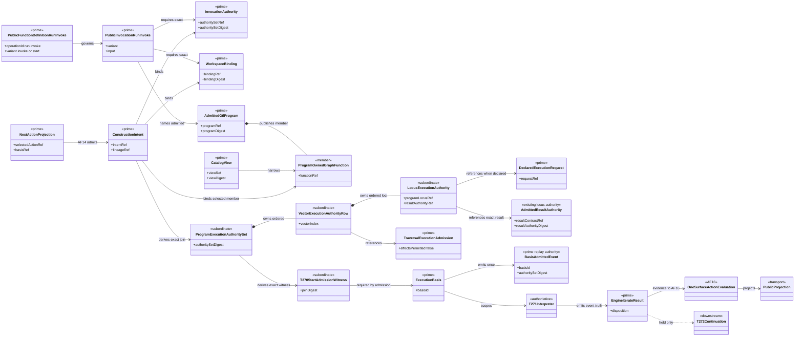
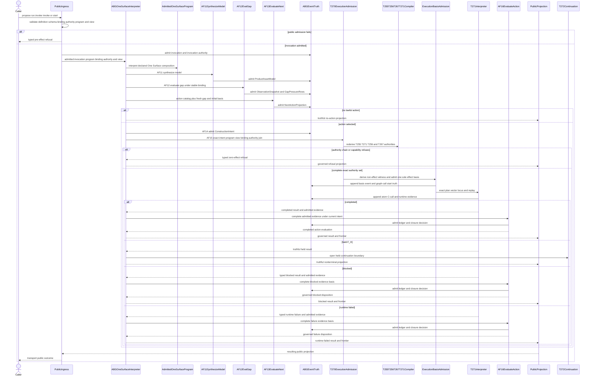
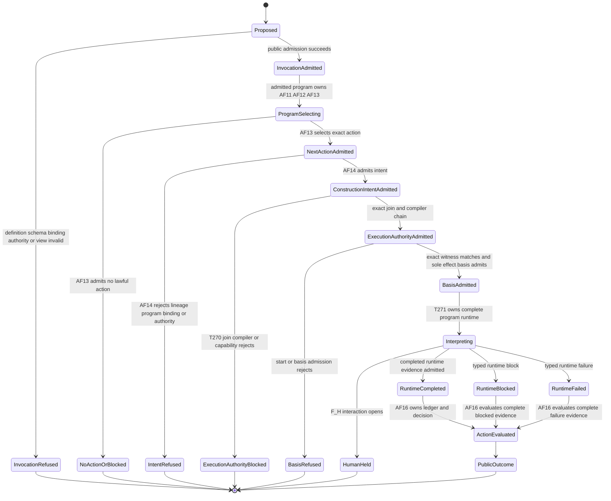

# M03-M04 Public run.invoke Authority Behavior Design

**Status**: Accepted - reconciled to ratified Ontology for runtime reconciliation

**Date**: 2026-07-16

**Ticket**: `T-270`

**Ontology authority**: `ABIOGENESIS_PUBLIC_CONTROL_PLANE_ONTOLOGY.md` digest `f817a7e730bec935f053138e85cb09aa6e0f693e558eaf287be502803da20ee8`

**Method authority**: `specification_methodology/specification/standards/DESIGN_MODULE_METHOD.md`

**Prime authority**: [ADR-044](./adrs/ADR-044-prime-contraction-is-a-cross-boundary-design-gate.md)

## Boundary

This design closes the generic execution-admission join after the admitted One
Surface program has selected one lawful action and AF-14 has admitted its
`ConstructionIntent`. Public ingress admits and transports one
`PublicInvocation<run.invoke>` under the exact `PublicFunctionDefinition` and
`InvocationAuthority`; it does not select, order, invoke, evaluate, or close
work.

The GTL program is the program. A `GraphFunction` is one callable member
published by that program. `invoke` narrows the program-derived `ActionCatalog`
to one exact member and `start` supplies scope, target, and until constraints;
both still pass AF-13 and AF-14. T-270 begins at the admitted
`ConstructionIntent` and performs only AF-15 execution admission.

T-270 verifies one exact program/function/view/binding/invocation-authority/
intent join, consumes the immutable T-255/T-256/T-267/T-271 compiler chain,
derives one subordinate `ProgramExecutionAuthoritySet` and one non-effect
`T270StartAdmissionWitness`, admits one sole effect-authorizing
`ExecutionBasis`, and enters the T-271 interpreter. It neither mutates T-267
static truth nor creates a parallel session or basis.

Completed runtime evidence returns to program-owned AF-16. Held F_H truth ends
this boundary and enters T-272. Public projection transports the resulting
truth only.

### Requirements

- `REQ-P-PUBLIC-CONTRACTS-008..010`
- `REQ-P-POLICY-019..025`, `-053..054`, and `-062..064`
- `REQ-M-GTL3-PROGRAM-TRAVERSAL-001..010`
- `REQ-R-ABG3-INTERPRET-002`, `-009..013`, and `-029..030`
- `REQ-R-ABG3-BINDING-015..018`
- `REQ-R-ABG3-FN-COMP-022..024` and `-026..027`
- the ratified public control-plane Ontology and PRODUCT One Surface contract
- T-255, T-256, T-267, and T-271 current accepted carriers

### Explicit Exclusions

- `abg.operation.catalog.invoke` or any legacy public invocation identity;
- GraphFunction, Module, catalog row, SDK, CLI, or ingress as the GTL program;
- ingress-owned model synthesis, gap evaluation, action selection, intent
  admission, runtime orchestration, action evaluation, or closure;
- direct catalog selection used as action truth or a bypass around AF-13;
- caller-authored execution authority, request, plan, frame, C-call, or basis;
- mutation of T-267 or reinterpretation of `effectsPermitted: false`;
- a compatibility, fallback, profile-free, or second start route;
- a Consensus-specific compiler, router, or runtime branch;
- T-270 capability inference or ownership of the final T-268 manifest;
- F_H response or continuation, owned by T-272; and
- direct raw interpreter result to public terminal projection.

## Ontology Slice

### Irreducible Architectural Carrier Set

| Carrier | Authority | Lifecycle role |
|---|---|---|
| `PublicFunctionDefinition<run.invoke>` | public contract family | Defines the one `invoke | start` operation family and its closed schema coordinates. |
| `PublicInvocation<run.invoke>` | public ingress admission | Carries admitted operator input only. |
| `InvocationAuthority<run.invoke>` | operation-indexed admission | Immutably joins actor, grants, view, policy, steering, and authority basis. |
| `WorkspaceBinding` | stable workspace authority | Binds product/install/root/catalog authority; mutable observations do not alter it. |
| `GtlProgram` | admitted constructive program | Owns AF-11 through AF-16 ordering and publishes callable GraphFunctions. |
| `CatalogView` | narrowing catalog authority | Restricts, but cannot enlarge, the admitted program's callable universe. |
| `NextActionProjection` | AF-13 selection authority | Carries selected-or-no-action truth and exact causal basis. |
| `ConstructionIntent` | AF-14 intent authority | Admits one selected program-owned action before invocation. |
| `DeclaredExecutionRequest` | existing locus authority | Supplies one exact F_P or F_H declared execution context. |
| `TraversalExecutionAdmissionRuntimeAddressable` | T-267 static authority | Proves whole-program/result/capability structure while remaining no-effect truth. |
| `ExecutionBasis` | ABG runtime basis | Governs one admitted execution spine and current replay truth. |
| `BasisAdmittedEvent` | canonical replay authority | Records the one admitted basis and closed subordinate seed. |
| `EngineIterateResult` | event-backed runtime outcome | Preserves completed, held, blocked, and runtime-failed truth. |

### Subordinate Payload

- `ProgramExecutionAuthoritySet` derived from exact upstream authorities;
- ordered vector/locus authority rows;
- T-255 `GraphVectorExecutionHandoffOutcome`;
- T-271 `CompiledCProgramPlan`;
- T-256 declared execution contexts and result-authority projections;
- one non-effect `T270StartAdmissionWitness` that never mutates T-267;
- exact catalog, program, binding, intent, compiler-chain, and capability
  digests; and
- one closed execution-basis replay seed.

These values are selected only through their owning primes. None becomes a
public/session/controller authority or independently selectable registry.

### Authority And Function Derivation

```text
PublicFunctionDefinition<run.invoke>
  -> PublicInvocation + InvocationAuthority + WorkspaceBinding
  -> admitted GtlProgram + narrowing CatalogView
  -> AF-11 synthesizeModel
  -> AF-12 evalGap
  -> AF-13 NextActionProjection
  -> AF-14 ConstructionIntent
  -> T-270 exact authority join
  -> T-255/T-271/T-256/T-267 compiler chain
  -> subordinate T270StartAdmissionWitness
  -> one sole effect-authorizing ExecutionBasis
  -> AF-15 T-271 interpretation
  -> held truth to T-272 | admitted evidence to AF-16
  -> public projection
```

T-270 owns only the authority join, start-admission-witness derivation, basis
admission, and AF-15 entry. The admitted program owns the sequence. AF-11,
AF-12, AF-13, AF-14, and AF-16 remain distinct authorities.

## Decisions

### D1. Ingress Admits And Transports Only

Ingress validates the definition, operation variant, schema, binding,
invocation authority, program reference, view, and input. It appends admission
truth and ignites the admitted program. It never selects a catalog member,
constructs an intent, or calls the interpreter directly.

### D2. Program Membership Precedes Callable Selection

The admitted `GtlProgram` is the program. A `GraphFunction` is callable only
when the program publishes it and the `CatalogView` retains it. `invoke` may
constrain AF-13's candidate universe to one exact member; that constraint never
establishes current eligibility or selection by itself.

### D3. One Surface Handoff Is Mandatory

T-270 requires an admitted AF-13 `NextActionProjection` and matching AF-14
`ConstructionIntent`. The program, selected action, function, workspace
binding, invocation authority, lineage, and current causal basis must match
exactly. Missing, stale, mutated, or cross-program values refuse before effect.

### D4. Compilation Is Complete Before Effects

For each selected GraphVector, T-270 re-derives the accepted compiler chain:

```text
T-255 GraphVectorExecutionHandoffOutcome
  -> T-271 CompiledCProgramPlan
  -> T-256 DeclaredExecutionRequest and result authority per locus
  -> T-267 TraversalExecutionAdmissionRuntimeAddressable
  -> ordered vector/locus rows
```

All rows compile before start admission. Missing, duplicate, reordered,
cross-vector, cross-locus, stale, or incomplete authority refuses before any
atom is invoked. Runtime progression remains replay-owned.

### D5. Static Admission Never Becomes Start Authority

T-267 remains exact immutable static truth with `effectsPermitted: false` and
all nonterminal closure fields unchanged. T-270 derives a subordinate
`T270StartAdmissionWitness` from the exact ConstructionIntent, program,
function, binding, invocation authority, compiler chain, and admitted
capability facts. The witness grants no effect and cannot be selected. One
matching `ExecutionBasis` admission remains the sole authority that opens
AF-15.

### D6. T-271 Is The Sole Complete Interpreter

The route enters the T-271 complete C-program interpreter and its existing
seven constructors, HOF relations, and recurse semantics. There is no scalar
declared-program fallback or Consensus branch. Results remain one of
`completed | held | blocked | runtime_failed`.

Completed and blocked evidence returns to AF-16 for governed action evaluation.
Held F_H truth returns a nonterminal interaction boundary for T-272. No adapter
creates closure from interpreter output.

### D7. Binding And Invocation Authority Are Exact

Every execution invocation has exactly one immutable `WorkspaceBinding` and
one operation-indexed `InvocationAuthority`. Actor, grants, program view,
policy, steering, provenance, and authority basis must match. Steering may
narrow but cannot grant. A newer `ObservationSnapshot` under the same binding
does not fork the binding or execution basis.

### D8. Capability Admission Is Independent

Focused T-270 proof uses a minimal generic admitted capability definition,
grant, and manifest fixture. Missing or incompatible capability blocks before
effect. T-270 cannot infer capability from function names or own the final
tenant manifest. T-268 aggregates the final manifest downstream.

### D9. The 5.0 Boundary Is A Hard Break

The accepted path has one operation family, one admitted program authority,
one selection authority, one intent authority, one compiler chain, one
non-effect start witness, and one sole effect-authorizing `ExecutionBasis`.
Legacy operations, schemas, SDK rows, CLI rows, compatibility branches, and
profile-free fallback are removed rather than adapted.

## Prime Contraction Review

```json prime-contraction
{
  "schemaVersion": 1,
  "iacs": [
    "PublicFunctionDefinition",
    "PublicInvocation",
    "InvocationAuthority",
    "WorkspaceBinding",
    "GtlProgram",
    "CatalogView",
    "NextActionProjection",
    "ConstructionIntent",
    "DeclaredExecutionRequest",
    "TraversalExecutionAdmissionRuntimeAddressable",
    "ExecutionBasis",
    "BasisAdmittedEvent",
    "EngineIterateResult"
  ],
  "authoritativeCarriers": [
    "PublicFunctionDefinition",
    "PublicInvocation",
    "InvocationAuthority",
    "WorkspaceBinding",
    "GtlProgram",
    "CatalogView",
    "NextActionProjection",
    "ConstructionIntent",
    "DeclaredExecutionRequest",
    "TraversalExecutionAdmissionRuntimeAddressable",
    "ExecutionBasis",
    "BasisAdmittedEvent",
    "EngineIterateResult"
  ],
  "subordinatePayloads": [
    "ProgramExecutionAuthoritySet",
    "VectorExecutionAuthorityRow",
    "LocusExecutionAuthority",
    "GraphVectorExecutionHandoffOutcome",
    "CompiledCProgramPlan",
    "T270StartAdmissionWitness",
    "execution-basis replay seed"
  ],
  "promotionTests": [
    {"candidate": "PublicFunctionDefinition", "verdict": "promote", "reason": "The versioned public contract is independently admitted and projected across schema, SDK, CLI, and runtime ingress."},
    {"candidate": "PublicInvocation", "verdict": "promote", "reason": "The admitted request has an independent lifecycle before One Surface interpretation."},
    {"candidate": "InvocationAuthority", "verdict": "promote", "reason": "Runtime admission independently pattern-matches the exact actor, grants, view, policy, steering, and authority basis."},
    {"candidate": "WorkspaceBinding", "verdict": "promote", "reason": "The immutable binding independently governs workspace, product, root, and catalog authority."},
    {"candidate": "GtlProgram", "verdict": "promote", "reason": "ABG interprets this independently admitted constructive carrier and verifies its member functions."},
    {"candidate": "CatalogView", "verdict": "promote", "reason": "The narrowing view is independently identified and checked before selection and invocation."},
    {"candidate": "NextActionProjection", "verdict": "promote", "reason": "AF-13 independently admits selected-or-no-action truth and its causal basis."},
    {"candidate": "ConstructionIntent", "verdict": "promote", "reason": "AF-14 independently admits the selected program-owned action before invocation."},
    {"candidate": "DeclaredExecutionRequest", "verdict": "promote", "reason": "Each declared F_P or F_H locus independently pattern-matches an exact request contract."},
    {"candidate": "TraversalExecutionAdmissionRuntimeAddressable", "verdict": "promote", "reason": "T-267 independently admits the complete no-effect static traversal and result-authority basis."},
    {"candidate": "ExecutionBasis", "verdict": "promote", "reason": "One immutable runtime basis independently governs every interpreted advancement."},
    {"candidate": "BasisAdmittedEvent", "verdict": "promote", "reason": "Canonical replay independently reconstructs and verifies the admitted execution basis."},
    {"candidate": "EngineIterateResult", "verdict": "promote", "reason": "The event-backed result crosses the runtime-to-evaluation boundary as a closed variant."},
    {"candidate": "ProgramExecutionAuthoritySet", "verdict": "remain_subordinate", "reason": "It derives from accepted intent, program, invocation, compiler, and causal-basis inputs and has no independent lifecycle."},
    {"candidate": "T270StartAdmissionWitness", "verdict": "remain_subordinate", "reason": "It proves the exact AF-15 join but grants no effect, has no independent lifecycle, and is consumed only by ExecutionBasis admission."}
  ],
  "recurrenceReview": {"status": "consume_existing", "ref": "PC-007"},
  "authoritySourceCount": {"before": 13, "after": 13},
  "authoringSourceCount": {"before": 4, "after": 1},
  "disposition": "migrate_authority",
  "ownerTicket": "T-270"
}
```

The semantic authorities remain distinct. The contraction removes separate
catalog-selection, compatibility, session, and adapter-result authoring paths;
one accepted authority chain derives every subordinate execution value.

## Domain Model



## Execution Sequence



## Lifecycle State Model



`ProgramSelecting` and `ActionEvaluated` are One Surface-owned. T-270 begins at
`ConstructionIntentAdmitted`; `HumanHeld` is T-272 input.

## Cross-View Axiom Evaluation

| Axiom | Domain evidence | Sequence evidence | State evidence | Native/admission enforcement | Design verdict |
|---|---|---|---|---|---|
| A1 admitted GtlProgram is the program; GraphFunction is a member callable | program owns member | ABG interprets admitted program after ingress handoff | ProgramSelecting | nominal program/member types and membership admission | pending implementation |
| A2 invoke and start share run.invoke and neither bypasses AF-13 | one definition family | both enter Program then Next | ProgramSelecting required | closed variant plus ActionCatalog constraint | pending implementation |
| A3 AF-13 and AF-14 precede T-270 | projection and intent primes | Next then Events then T270 | T270 begins at ConstructionIntentAdmitted | exact causal refs and digest admission | pending implementation |
| A4 caller and ingress own no runtime, evaluation, or closure authority | transport-only projection | ingress hands admitted truth to ABG and later transports its projection | Proposed cannot enter runtime without ABG program interpretation | public request excludes private carriers | pending implementation |
| A5 every execution invocation has one immutable binding | WorkspaceBinding prime | exact binding passed once | authority mutation refuses | binding digest; observation excluded | pending implementation |
| A6 InvocationAuthority is exact and steering grants nothing | exact authority-set prime | validated before program | mutation refuses | closed constituent set and narrowing law | pending implementation |
| A7 every vector and locus uses the exact compiler chain | ordered subordinate rows | compiler rederives all rows | incomplete chain blocks | T255/T271/T256/T267 digest checks | pending implementation |
| A8 T-267 and the T-270 witness remain no-effect; only ExecutionBasis authorizes execution | static admission plus subordinate witness | witness then basis admission follows complete chain | authority join and basis states remain separate | immutable T267, nominal witness, and sole basis admission | pending implementation |
| A9 one ExecutionBasis and basis event govern runtime | one basis prime | one admission before T271 | no parallel session state | basis digest and replay event uniqueness | pending implementation |
| A10 capability is separately admitted; T-268 is downstream | no manifest prime added | generic fixture checked before start | missing capability blocks | exact definition grant manifest compatibility | pending implementation |
| A11 T-271 alone interprets; AF-16 evaluates evidence; T-272 owns held continuation | distinct interpreter/result/evaluator | explicit branch after runtime | HumanHeld and ActionEvaluated separate | closed result variants and owner-specific APIs | pending implementation |
| A12 hard break leaves zero legacy operations, fallback, or parallel register | one definition/program/basis path | no compatibility branch | no compatibility state | generated operation family and negative scans | pending implementation |

## Proof Contract

1. `run.invoke` `invoke` and `start` share one definition and admission; exact
   function constraint still passes AF-13.
2. Cross-program function, nonmember, outside-view, noncallable, stale program,
   and stale view refuse with zero effects.
3. Missing, stale, or mutated `NextActionProjection` or `ConstructionIntent`,
   and any caller-injected request, plan, admission, start witness, frame,
   C-call, or execution basis, refuses with zero effects.
4. Exact `InvocationAuthority` succeeds; actor, grant, policy, steering,
   provenance, and authority-basis mutations refuse; steering cannot widen.
5. A newer `ObservationSnapshot` under one binding succeeds; a changed binding
   constituent requires new binding/reprice.
6. The exact compiler chain derives a non-effect start-admission witness while
   T-267 remains byte-equivalent and no-effect; only the matching
   `ExecutionBasis` admission authorizes runtime effects.
7. Omission, duplication, reorder, cross-vector, cross-locus, stale handoff,
   stale plan, stale context, and stale result authority refuse before effect.
8. A non-Consensus mixed/nested program and unchanged Consensus program use the
   same compiler and interpreter, preserving C-plan, fan-out, fan-in, and recurse
   identity.
9. A generic capability fixture succeeds; missing or incompatible capability
   blocks without a T-268 final-artifact dependency.
10. `completed | held | blocked | runtime_failed` remain distinct; held emits no
    auto-response and completed evidence reaches AF-16.
11. Re-admitting the same basis/replay truth is byte-equivalent and creates no
    second receipt, session, or basis store.
12. T-270 hard-break scans plus focused semantic, GTL, packed, publication,
    governance, Prime, and design gates prove old `catalog.invoke`, second-start
    and profile-free fallbacks, and their old schemas, SDK rows, and CLI rows
    are absent. T-272 owns the `run.resume` and `fh.*` hard break.

## Design Verdict

`accepted_for_runtime_reconciliation`. The previously accepted T-270 design was
superseded by the ratified Ontology. Runtime work is authorized only within this
reconciled AF-15 authority-join boundary and still requires independent closure
review.
