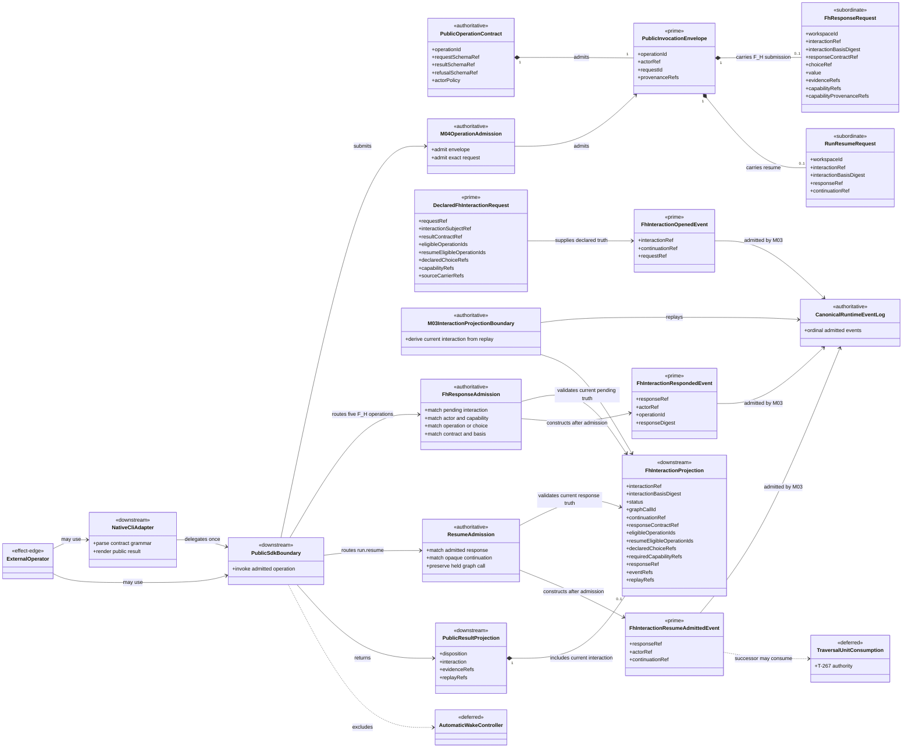
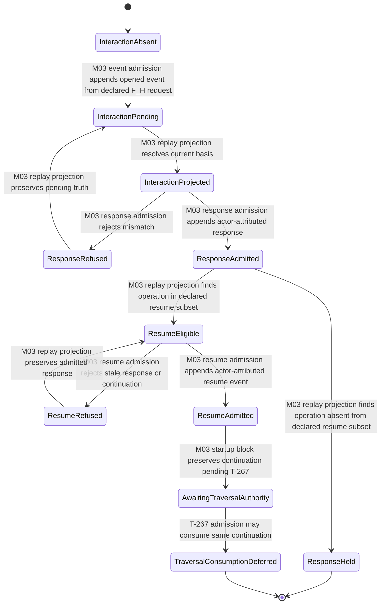

# M03-M04 Public SDK And CLI Behavior Design

**Status**: Accepted three-view design for T-258
**Date**: 2026-07-13
**Checkpoints**: T-223 public SDK/CLI baseline and T-258 public F_H interaction slice
**Method authority**: `../../../../.genesis/docs/standards/DESIGN_MODULE_METHOD.md` section 5E
**Tenant authority**: [TYPESCRIPT_REALIZATION_GUARDRAILS.md](./TYPESCRIPT_REALIZATION_GUARDRAILS.md)

## Boundary

- **Active slice**: T-258 closes the public hold, response-admission, and
  resume-admission boundary for one existing F_H interaction.
- **Owning modules**: M03 owns the pending interaction, continuation identity,
  canonical events, replay, response admission, and resume admission. M04 owns
  public request admission and adaptation. The CLI parses and renders only.
- **Requirements**: `REQ-P-POLICY-019..024`, `-031..033`, `-041..045`;
  `REQ-P-PUBLIC-CONTRACTS-003`, `-005`, `-006A`, `-008..010`;
  `REQ-R-ABG3-FN-COMP-017`; `REQ-R-ABG3-PAYLOAD-021`;
  `REQ-R-ABG3-ASSURANCE-029`, `-033`; and `REQ-R-ABG3-WITNESS-009`.
- **Public operations**: `abg.operation.fh.select`, `.approve`, `.reject`,
  `.assess`, `.answer-escalation`, and `abg.operation.run.resume`. T-258 adds no
  operation identity outside the constitutional 36-operation catalog.
- **Prime source**: the T-256 `DeclaredFhInteractionRequest`, extended with
  eligible operation IDs, the resume-eligible subset, and selectable choice
  refs derived from the selected GTL source carrier. M03 does not synthesize
  interaction choices or resume policy.
- **Public projection**: `abg.schema.fh-interaction` is a replay-derived view of
  the current pending, responded, held, or resume-admitted interaction.
- **Explicit exclusions**: consuming a response as a `TraversalUnit`, applying
  traversal effects, selecting a private frontier, deciding closure, returning
  escalation as graph success, a Consensus-specific CLI verb, a shell-owned
  continuation, an automatic wake controller, scheduler, watcher, or ticket
  mutation.
- **Successor boundary**: T-267 owns traversal-result conservation and may
  consume a resume-admitted interaction. Until T-267 closes, resume admission
  preserves the same continuation but remains a truthful nonterminal hold.

The existing T-223 SDK/CLI implementation remains the broader adapter baseline.
This design updates its previously deferred F_H edge without claiming that the
complete 36-operation product or post-resume traversal is implemented.

## Decisions

1. One `FhInteractionProjection` carries the public interaction truth for all
   five constitutional F_H operation identities.
2. The exact public operation identity is also the submitted decision identity.
   The pending interaction declares eligible operation IDs and a resume-eligible
   subset. This avoids a second decision vocabulary. `select` also cites an
   exact declared choice ref.
3. Every F_H request cites the interaction ref and basis digest, response
   contract, supplied value or choice, evidence, capability refs, capability
   provenance, and an actor-attributed public invocation envelope.
4. M03 resolves the interaction from canonical replay. The caller cannot submit
   a private frame, frontier, vector, event, or mutable continuation object.
5. An admitted response emits `fh_interaction_responded`. It does not mutate
   traversal or closure truth.
6. `run.resume` cites the admitted response and opaque continuation identity.
   M03 emits `fh_interaction_resume_admitted` only for the same unresolved
   interaction. T-267 remains required before traversal can consume it.
7. Resume eligibility is declared per operation by the selected interaction
   carrier. `answer-escalation` is not hard-coded as either resumable or held.
   No operation in this slice can fabricate graph success.
8. The CLI delegates the same typed invocation used by the SDK and defines no
   interaction semantics of its own.

## Domain Model

The event log is prime runtime truth. The interaction and public result are
projections. The external operator supplies effect-edge data through a declared
request; neither the operator, CLI, nor SDK owns lifecycle state.

## Execution Sequence

```mermaid
sequenceDiagram
  actor Operator as ExternalOperator
  participant CLI as NativeCliAdapter
  participant SDK as PublicSdkBoundary
  participant M04 as M04OperationAdmission
  participant Projection as M03InteractionProjectionBoundary
  participant Response as FhResponseAdmission
  participant Resume as ResumeAdmission
  participant Events as CanonicalRuntimeEventLog

  Operator->>CLI: declared command and serialized request
  CLI->>SDK: one PublicInvocationEnvelope
  SDK->>M04: admit operation contract, actor, and request
  alt M04 rejects malformed or mismatched input
    M04-->>SDK: typed public refusal
    SDK-->>CLI: unchanged refusal and exit classification
    CLI-->>Operator: render only
  else M04 admits input
    M04-->>SDK: admitted invocation
    alt one of five F_H operation identities
      SDK->>Projection: resolve interactionRef from canonical replay
      Projection->>Events: read admitted interaction events
      Events-->>Projection: current ordered interaction truth
      Projection-->>SDK: FhInteractionProjection or unknown
      SDK->>Response: submit projection, actor, operation identity, value or choice, evidence, capabilities, provenance
      alt M03 response admission rejects identity, state, operation, choice, contract, actor capability, or basis
        Response-->>SDK: typed refusal without event
      else M03 response admission accepts
        Response->>Events: append actor-attributed FhInteractionRespondedEvent
        Events-->>Response: admitted event identity
        Response-->>SDK: responded FhInteractionProjection
      end
    else operation is run.resume
      SDK->>Projection: resolve interaction and admitted response from replay
      Projection->>Events: read admitted interaction events
      Events-->>Projection: current ordered interaction truth
      Projection-->>SDK: FhInteractionProjection or unknown
      SDK->>Resume: submit projection, actor, responseRef, and opaque continuationRef
      alt M03 resume admission rejects stale, mismatched, unresolved, or non-resume-eligible input
        Resume-->>SDK: typed refusal without event
      else M03 resume admission accepts same continuation
        Resume->>Events: append actor-attributed FhInteractionResumeAdmittedEvent
        Events-->>Resume: admitted event identity
        Resume-->>SDK: nonterminal resume-admitted projection
        Note over Resume,Events: T-267 must consume the admitted response as traversal truth
      end
    end
    SDK-->>CLI: one PublicOperationResult with interaction and replay refs
    CLI-->>Operator: render unchanged result and declared exit
  end
```

M04 owns only public ingress. M03 owns every identity check and event. The
resume operation admits the operator's request against the held continuation;
it does not run a private loop or apply a traversal result.

## Lifecycle State Machine

Every lifecycle transition names its owner. `ResumeAdmitted` is nonterminal and
cannot become `converged`, `closed`, or a traversal effect in this slice.

## Cross-View Checks

| Check | Evidence | Verdict |
|---|---|---|
| Every sequence participant exists in the domain view or is external | All seven participants are modeled; the operator is explicitly external | pass |
| Every lifecycle carrier exists in the domain view | Pending projection, response event, resume event, and deferred traversal consumption are modeled | pass |
| Every message names an admission, projection, or event boundary | M04 admits ingress; M03 projects, admits responses/resume, and appends events | pass |
| Every state transition names its owner | M03 admission/projection, external operator, and T-267 successor ownership are explicit | pass |
| Raw external response cannot become traversal or closure truth | Response admission creates only an actor-attributed response event; resume creates only a nonterminal resume event | pass |
| CLI and SDK preserve one operation contract | CLI delegates one envelope and renders the SDK result unchanged | pass |
| Caller cannot construct private continuation | Public request carries only the opaque continuation ref projected by M03 | pass |
| No F_H response can become graph success | Resume eligibility is declared, but even eligible responses stop at nonterminal resume admission | pass |
| Post-resume traversal is complete | T-267 remains required and is shown as deferred | not_applicable: successor boundary |

## Axiom Evaluation

| Axiom | Authority | Domain evidence | Sequence evidence | State evidence | Native enforcement | Admission/compiler enforcement | Verdict | Gap owner |
|---|---|---|---|---|---|---|---|---|
| F_H is an external callout, not runtime authority | `REQ-R-ABG3-FN-COMP-017`, `ASSURANCE-033` | operator is effect-edge; event log is authoritative | external value enters response admission | no external-to-traversal transition | closed request/result/event unions | M03 exact interaction admission | pass | none |
| Every F_H response matches one current pending interaction | `REQ-P-POLICY-031..032` | request and projection carry interaction ref and basis | projection precedes response admission | mismatch reaches refusal and leaves pending truth unchanged | branded refs and digest fields | replay lookup and exact identity checks | pass | none |
| Operations, resume policy, and selections are declared, not synthesized | `REQ-P-POLICY-020`, `-031..032` | declared request carries eligible operations, resume subset, and choice refs | admission compares exact public operation and choice to projection | undeclared input cannot leave pending | constitutional operation-ID union and readonly arrays | T-256 derivation, subset proof, and M03 membership check | pass | none |
| Actor, capability, evidence, and provenance are explicit | `REQ-P-POLICY-031..032`, `-042` | envelope and request carry all identities | response admission checks them before append | only admitted response becomes responded | actor-required operation contracts | exact capability set and non-empty provenance checks | pass | none |
| Public mutation enters canonical event truth | `REQ-P-POLICY-042`, `REQ-R-ABG3-WITNESS-009` | response and resume events are prime | both accepted mutations append through M03 | lifecycle advances only after admitted event | canonical event variants | event admission and ordinal replay | pass | none |
| CLI is a thin adapter over the SDK | `REQ-P-POLICY-044` | CLI has no runtime carrier | one delegate and render path | no CLI lifecycle state | exhaustive command-to-operation map | shared operation admission | pass | none |
| Resume preserves ABG-owned continuation | `REQ-P-POLICY-024`, `-033` | only an opaque projected continuation ref is public | resume resolves current replay before admission | stale or different continuation refuses | closed resume request | replay-derived equality and response-state checks | pass | none |
| Resume does not fabricate post-hold success | `REQ-P-POLICY-032`, `ASSURANCE-033` | traversal consumption is deferred | sequence stops at nonterminal resume event | startup block remains until T-267 | result disposition excludes convergence | T-267 gate is explicit | pass | none |
| Complete post-resume traversal is implemented | T-267 | deferred carrier only | no traversal-consumption message | awaiting-authority state is nonterminal | not in T-258 API | T-267 owns admission | not_applicable: successor boundary | T-267 |
| Complete 36-operation public product is implemented | `REQ-P-PUBLIC-CONTRACTS-008` | this slice covers six existing identities | other operations are outside sequence | no claim beyond active slice | operation union remains constitutional | release conformance owns total census | not_applicable: bounded slice | later delivery tickets |

## Proof Contract

T-258 implementation acceptance requires:

1. exact request, result, refusal, invocation, schema, operation, capability, and
   package-export publication for the five F_H operations and `run.resume`;
2. one generic non-Consensus fixture proving open, project, respond, resume, and
   replay through public SDK and CLI-equivalent request construction;
3. negative tests for unknown interaction, stale basis, undeclared operation or
   choice, wrong response contract, missing actor, capability mismatch, missing
   provenance, wrong response, wrong continuation, duplicate-conflicting
   response, and a non-resume-eligible operation;
4. exact idempotent replay behavior for repeated equivalent submissions;
5. T-252 structural invocation of the public interaction path while preserving
   the unchanged Consensus GTL body digest;
6. no private runner import from the CLI, no second event reader, no scheduler,
   no watcher, and no post-resume traversal before T-267;
7. focused, semantic, GTL, T-223, publication, packed-export, Mermaid, lint,
   typecheck, and diff gates green.

## Design Verdict

`accepted` under the delegated F_H decision recorded for T-258. Acceptance is
limited to T-258's public interaction and resume-admission slice. It does not
accept the complete public operator product or T-267's post-resume traversal
boundary.
