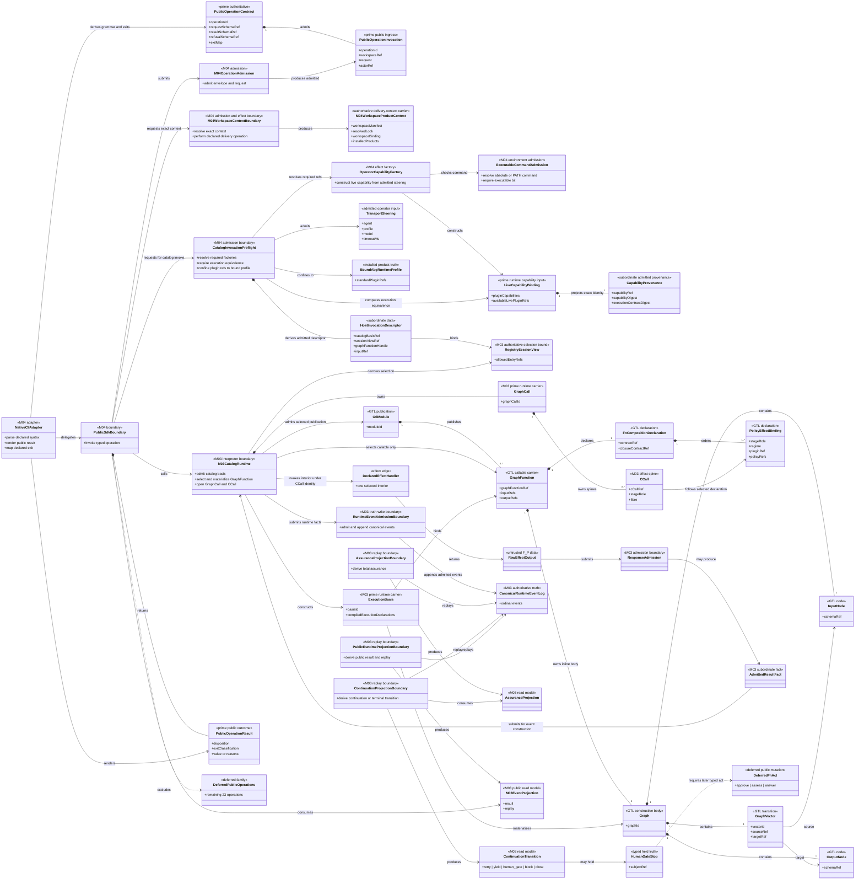
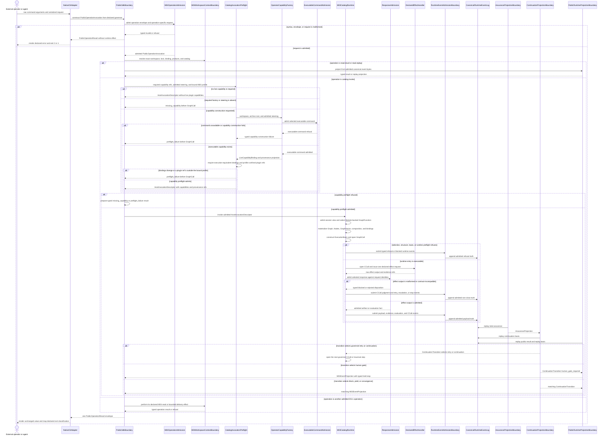
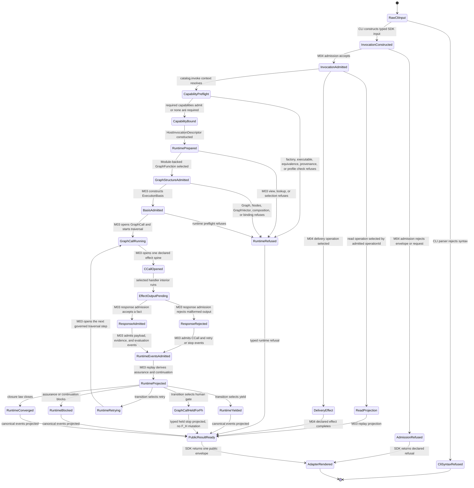

# M03-M04 Public SDK And CLI Behavior Design

**Status**: Retrospective three-view design blocked
**Date**: 2026-07-12
**Checkpoints**: `b445eb1`, `779eb07`, and `28da030` (`T-223` public SDK,
CLI, operation-correlation, and live-preflight path)
**Method authority**: `specification_methodology/specification/standards/DESIGN_MODULE_METHOD.md` section 5E
**Tenant authority**: [TYPESCRIPT_REALIZATION_GUARDRAILS.md](./TYPESCRIPT_REALIZATION_GUARDRAILS.md)

## Boundary

- **Design verdict**: `blocked` for the complete `catalog.invoke` path.
  The thin SDK/CLI adapter subset remains a candidate for independent axiom
  review, but its runtime dependencies are not accepted
- **Owning modules**: `M04-app-bootstrap` for the public SDK and CLI adapter;
  `M03-engine-kernel` for catalog admission, selection, GraphCall, traversal,
  effects, events, continuation, result, replay, and closure truth
- **Requirements**: `PRODUCT.md` Public Operator Product;
  `REQ-P-PUBLIC-CONTRACTS-003`, `-009`, `-010`, and `-014`;
  `REQ-P-CATALOG-007`, `-014`, and `-015`; `REQ-R-ABG3-EVENTS`;
  `REQ-R-ABG3-PROJECTION-011` and `-019`
- **Ticket or intake**: completed `T-223`, public SDK and CLI checkpoint
- **Code scope**:
  `code/src/app/m04/public_sdk/`, `code/src/app/m04/public_cli/`,
  `code/src/bin/abg.cli.ts`, and the M03 public catalog invocation and
  projection entries they consume, including node capability factories,
  executable-command admission, live preflight, and provenance construction
- **Dependencies**: admitted public operation contracts, exact workspace and
  product binding, M03 runtime catalog, M03 start-to-iterate runner, canonical
  event admission and replay projection; the separately blocked F_P output
  admission design; the blocked instruction-protocol design; and the compiled
  execution handoff
- **Explicit exclusions**: the remaining 23 operations in the 36-operation 5.0
  catalog; node-type and overlay application; a CLI-owned loop; a CLI-owned
  worker or plugin; a second event reader; generic resume and F_H mutation;
  batch, recursion, or nested-workflow construction by M04

This is a retrospective behavioral review of an already completed checkpoint.
Acceptance is limited to the adapter boundary shown below. It is not a finding
that the complete 5.0 public operator product is implemented.

## Domain Model

The selected callable is not a catalog nameplate. Its Module, GraphFunction,
inline Graph, input and output Nodes, GraphVector, composition declaration,
and policy/effect bindings remain visible before M03 opens a GraphCall. This
view does not claim that the separate C-conformance result is joined to
`ExecutionBasis`; that missing relation is a blocking gap below.

## Execution Sequence

The adapter does not fan out, retry, recurse, resume, or answer an F_H gate.
M03 alone consumes admitted continuation truth. A projected human gate ends
this public invocation with the underlying GraphCall held; this checkpoint has
no public F_H mutation that may exit the held runtime state. The CLI only
renders the typed result.

## Lifecycle State Machine

No CLI-local variable is a lifecycle authority. Public runtime states derive
from M03 admission, events, transition projection, and closure law. M04 owns
only public request admission, delivery effects, and result adaptation. The
underlying `GraphCallHeldForFh` has no exit in this checkpoint; a future typed
F_H public act must provide that transition rather than the CLI inventing one.

## Cross-View Invariants

| Check | Evidence | Verdict |
|---|---|---|
| Every sequence participant exists in the domain model or is external | Every adapter, admission, context, runtime, response, handler, event, and projection participant is modeled; `Operator` is external | pass |
| Every lifecycle carrier exists in the domain model | Public invocation/result, capability preflight/provenance, GraphFunction structure, ExecutionBasis, GraphCall/CCall, raw/admitted response, event, assurance/continuation, and held F_H truth are represented | pass |
| Every message names a typed transform, interpreter act, or effect boundary | Admission, exact-context resolution, M03 invocation, C-call effect, event projection, and result adaptation are named | pass |
| Every transition names an admission, interpreter, event, projection, or external owner | M04 owns ingress/delivery; M03 owns runtime states; CLI owns syntax/render only | pass |
| Constructive GraphFunction structure is visible | Module, GraphFunction, Graph, input/output Nodes, GraphVector, composition, and policy/effect binding appear before GraphCall | pass |
| Raw F_P output cannot transition directly to accepted or closed | The views require response admission and events first, but the separate F_P design is blocked pending G1-G5 | fail |
| Plugins and handlers own interiors only | `DeclaredEffectHandler` returns data and evidence refs; M03 emits events and decides transitions | pass |
| Batch, retry, recursion, and nested workflow use declared algebra | M04 constructs none and this adapter design claims no C-constructor realization | not_applicable |
| CLI and SDK cannot diverge in runtime meaning | CLI delegates one typed invocation to the SDK and renders the same result/exit map | pass |
| Live capability construction is pre-effect and provenance carrying | executable admission, execution-equivalence comparison, profile confinement, and three provenance refs precede M03 invocation | pass |

## Axiom Evaluation

| Axiom | Authority | Domain evidence | Sequence evidence | State evidence | Native enforcement | Admission/compiler enforcement | Verdict | Gap owner |
|---|---|---|---|---|---|---|---|---|
| The native CLI is a thin adapter over one public SDK | `PRODUCT.md` lines 75-104; `M04-app-bootstrap` | CLI has no runtime carrier or semantic ownership | CLI calls SDK once and renders its envelope | no CLI-owned runtime states | operation-specific TypeScript request/result correlation and exhaustive CLI command union | M04 operation admission rejects unmatched operation/request pairs | pass | none |
| M03 is the sole runtime controller | `PRODUCT.md` lines 94-110; `M03-engine-kernel`; `T-223` non-closure law | selection, GraphCall, events, projection, continuation, and closure remain M03-owned | SDK makes one call to the M03 catalog invocation entry | every retry, block, gate, yield, and close transition is M03-owned | package exports expose the public boundary without granting CLI private runner state | exact basis, session view, lookup, selection, and runtime admission | pass | none |
| The host-neutral invocation descriptor is data, not authority | `REQ-P-PUBLIC-CONTRACTS-010` | descriptor is subordinate to admitted invocation and M03 basis | SDK derives it; M03 independently admits and interprets | descriptor creates no lifecycle transition by itself | closed readonly carrier | public invocation and host schema admission | pass | none |
| Operator capability construction fails closed before GraphCall | T-223 live preflight; PRODUCT trusted-desktop boundary | steering, factory, executable admission, binding, provenance, and bound profile are distinct | command availability, factory presence, execution equivalence, and profile confinement precede M03 | any mismatch reaches `RuntimeRefused`; only `CapabilityBound` reaches runtime | closed steering/profile/binding carriers | factory lookup, executable admission, stable projection equality, and plugin-ref subset check | pass | none |
| Capability provenance is ABG-consumable input, not ambient process truth | T-223 WITNESS-010 path | capability ref, capability digest, and execution-contract digest are explicit | preflight adds exact refs to the host descriptor | provenance exists before `RuntimePrepared` | readonly provenance projection | stable digest construction and descriptor admission | pass | none |
| GraphFunction is the sole public callable catalog kind | `PRODUCT.md` lines 68-73; `REQ-P-CATALOG-007` | selected callable is a GraphFunction; node and overlay remain read-only rows | M03 selection precedes GraphCall | only GraphFunction selection enters running | closed public catalog-kind and request unions | catalog lookup rejects non-callable kinds | pass | none |
| A callable GraphFunction retains its constructive graph body | `REQ-L-GTL3-GRAPHFUNCTION-002/-015/-019`; tenant calibration checks | Module owns GraphFunction, inline Graph, Nodes, GraphVector, composition, and bindings | M03 materializes all structural parts before basis and GraphCall | `GraphStructureAdmitted` precedes `BasisAdmitted` | closed GTL carrier families | Module and GraphFunction admission reject missing structural identity | pass | none |
| Public mutation enters canonical event truth; reads remain projections | `PRODUCT.md` lines 94-98; `REQ-R-ABG3-EVENTS`; `REQ-R-ABG3-PROJECTION-011` | one M03 event log and one projection family | invoke emits through M03; reads consume admitted event bytes | public result states follow projection | event and projection types are M03 exports | canonical event admission checks ordinals and kinds | pass | none |
| Raw or malformed F_P output cannot become closure truth | `REQ-L-GTL3-C-ALGEBRA-018`; `PRODUCT.md` evaluator law | handler output is effect-edge data only | designed path admits response and events before projection | no designed raw-output-to-close transition | typed plugin and payload status families exist, but cross-field relations remain open | separate F_P design records open-contract, status-family, and composed-proof failures | fail | `M03_FP_OUTPUT_ADMISSION_BEHAVIOR_DESIGN.md` G1-G5 |
| Effects own interiors only | `REQ-R-ABG3-HANDLERS`; ODD boundary law | handler has no event, transition, or closure relationship | handler returns only effect output and evidence refs | no handler-owned lifecycle transition | handler contract excludes authoritative runtime carriers | M03 plugin and payload admission | pass | none |
| Adapter code must not replace declared graph/C composition | ODD method; `TYPESCRIPT_REALIZATION_GUARDRAILS.md` | M04 has no batch, recursion, or nested workflow carrier | M04 delegates selected GraphFunction interpretation to M03 | runtime states remain inside M03 | no adapter orchestration API | this slice claims no C-constructor realization | pass | none |
| Runtime invocation certifies the selected constructive body against C conformance | `REQ-L-GTL3-C-ALGEBRA-014..-018`; compiled-handoff design | GraphFunction structure and ExecutionBasis exist but no conformance-result relation joins them | basis construction compiles execution declarations only | `BasisAdmitted` cannot encode C-conformance identity | separate typed carriers exist | current basis admission does not bind the separate C compilation result | fail | M01/M03 mapping design |
| Product-visible prompt protocol is declared by GTL | `REQ-R-ABG3-HANDLERS-015`; instruction-protocol design | Graph declarations and prompt manifest exist but the instruction-category/protocol source is absent | current M03 startup synthesizes transform/review protocol text | dispatch is reachable from code-owned protocol synthesis | no type binds section text to a GTL instruction declaration | plan compilation validates asserted values rather than declaration lineage | fail | `M03_INSTRUCTION_PROTOCOL_BEHAVIOR_DESIGN.md` |
| F_H is a typed external boundary, not an adapter decision | `PRODUCT.md` lines 106-110; `REQ-R-ABG3-ASSURANCE-033`; tenant calibration checks | `HumanGateStop` and deferred typed F_H act are distinct | M03 returns a held stop; CLI cannot answer it | `GraphCallHeldForFh` has no exit in this checkpoint | public result union exposes the stop | no public typed F_H mutation is realized | fail | later public F_H operation slice |
| Complete 36-operation catalog is required for the 5.0 product | `REQ-P-PUBLIC-CONTRACTS-008` | DS-1 domain intentionally contains only 13 operations | sequence covers the DS-1 subset only | deferred operations do not enter DS-1 states | later operation contracts absent by design | release conformance must reject an incomplete final catalog | not_applicable | T-218 successor phases |
| Hostile-workstation tamper defense is outside product scope | `PRODUCT.md` lines 155-166; `REQ-P-PUBLIC-CONTRACTS-014` | exact identity/digest coherence, no signing authority | admission verifies exact local artifacts and bindings | mismatch refuses; no hostile actor lifecycle is claimed | digest and path types | product verification and canonical digest admission | pass | none |

## Gap And Exclusion Register

| Gap or exclusion | Why outside or blocking | Owner | Re-entry condition |
|---|---|---|---|
| 23 later public operation identities | DS-1 deliberately publishes 13 operations; this checkpoint is not complete 5.0 operator closure | T-218 successor phases | owning requirement/design slice admits each operation and extends conformance proof |
| Generic resume and interactive F_H mutation | CLI may render a stop but cannot lawfully invent continuation or human judgment | later operator-contract slice | public request/result/event contracts and M03 consumption path are designed and accepted |
| Node-type and overlay application | DS-1 exposes list/describe only and preserves GraphFunction-only callability | T-228 or successor | application semantics and compiler/runtime binding are admitted |
| F_P response-contract closure and raw-to-close proof | `catalog.invoke` depends on a blocked response-admission design | M03 F_P admission | G1-G5 receive design disposition and the resulting design is accepted |
| C-conformance identity on `ExecutionBasis` | public invocation cannot certify that the selected constructive body passed the C semantic compiler | M01/M03 mapping design | one admitted compilation identity joins the authoritative selected body and basis without creating rival program authority |
| Declared instruction protocol | public invocation currently reaches a manifest whose transform/review protocol source is authored in M03 | GTL instruction and M03 compiler design | selected stages resolve exact declared instruction-category/protocol assets before plan compilation |
| Adapter-owned batch, retry, recursion, or nested workflow | prohibited, not missing from M04 | M03/GTL only | never re-enters M04; declared programs use realized algebra |
| Full 5.0 release conformance | later product gate, not evidence supplied by this checkpoint | release/conformance phase | exact operation and capability catalogs are complete and qualified |

## Design Verdict

`blocked` for acceptance as the complete public `catalog.invoke` design across
`b445eb1`, `779eb07`, and `28da030`. The
thin CLI-to-SDK adapter and exact public-envelope mapping remain bounded
candidate subclaims, but the runtime operation depends on blocked F_P and
instruction designs, lacks a C-conformance identity joined to its
`ExecutionBasis`, and has no typed public exit from an F_H-held GraphCall.

The T-223 SDK/CLI equivalence, catalog invocation, malformed-input, result, and
replay tests remain useful evidence; they do not cure those design failures or
replace independent axiom review and F_H disposition. No dependent
implementation is authorized.
