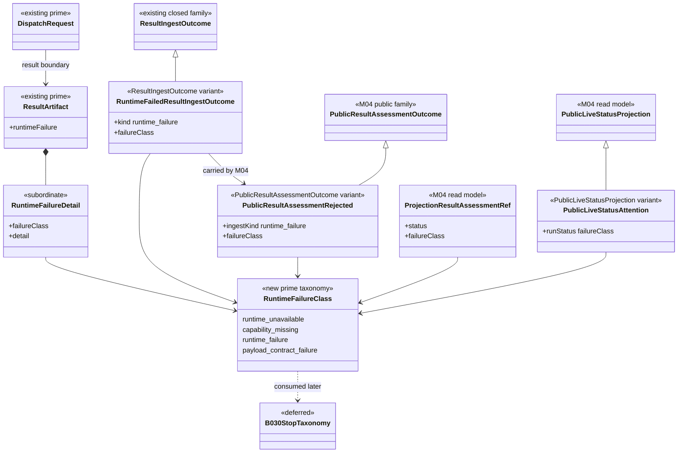

# M03/M04 Runtime Failure Taxonomy Structural Carrier Diagram

**Status**: Active
**Date**: 2026-04-25
**Derived from**: [M03_M04_RUNTIME_FAILURE_TAXONOMY_DERIVATION.md](./M03_M04_RUNTIME_FAILURE_TAXONOMY_DERIVATION.md), [M03_M04_RUNTIME_FAILURE_TAXONOMY_FIRST_SLICE_IACS.md](./M03_M04_RUNTIME_FAILURE_TAXONOMY_FIRST_SLICE_IACS.md)

## Purpose

Show the runtime failure class as one canonical carrier family that originates
in `M03` and is carried by `M04` result assessment and live status without
downstream reinterpretation.

## Diagram

## Reading Rules

- `RuntimeFailureClass` is the only canonical class source for runtime/payload
  failure in this slice.
- `ResultArtifact.runtimeFailure` is the admitted subordinate payload that
  carries class plus detail.
- `ResultIngestOutcome{kind: runtime_failure}` is the M03 route into M04.
- M04 result assessment keeps public `kind: rejected` but preserves
  `ingestKind: runtime_failure` and `failureClass`.
- M04 live status uses `failureClass` directly for attention `runStatus`.
- `B-030-TS` consumes this taxonomy later; it does not own the M03/M04
  classification.

## Sign-Off Claim

This diagram is lawful only if future code rejects legacy transport classes,
preserves `RuntimeFailureClass` across M03 and M04, and prevents downstream
status wrappers from reconstructing failure class from reason text.
